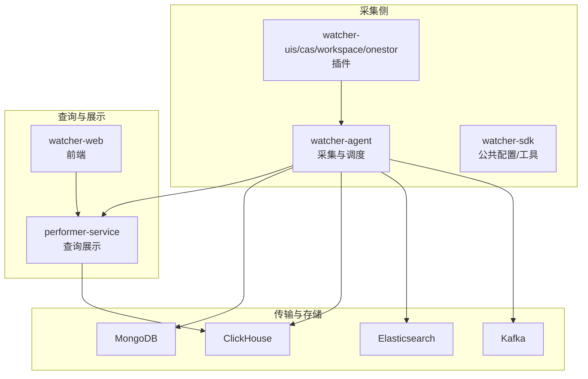
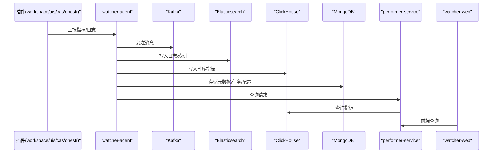
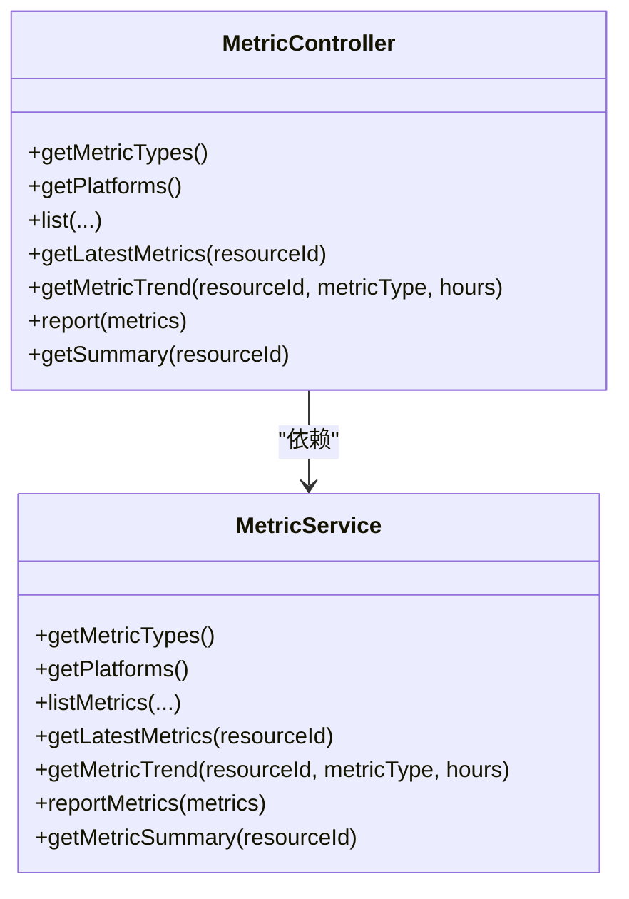
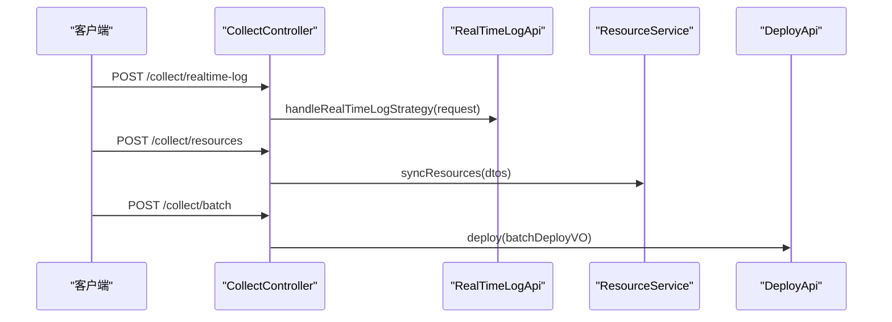
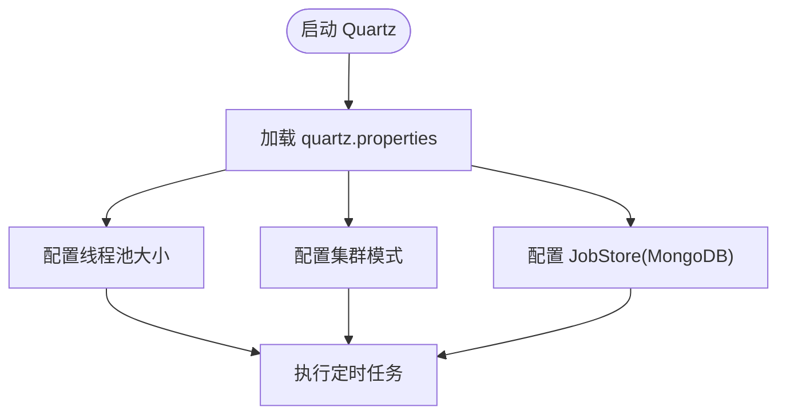
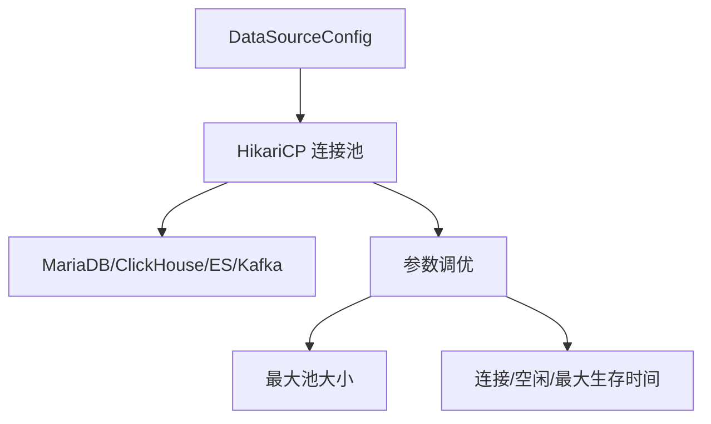
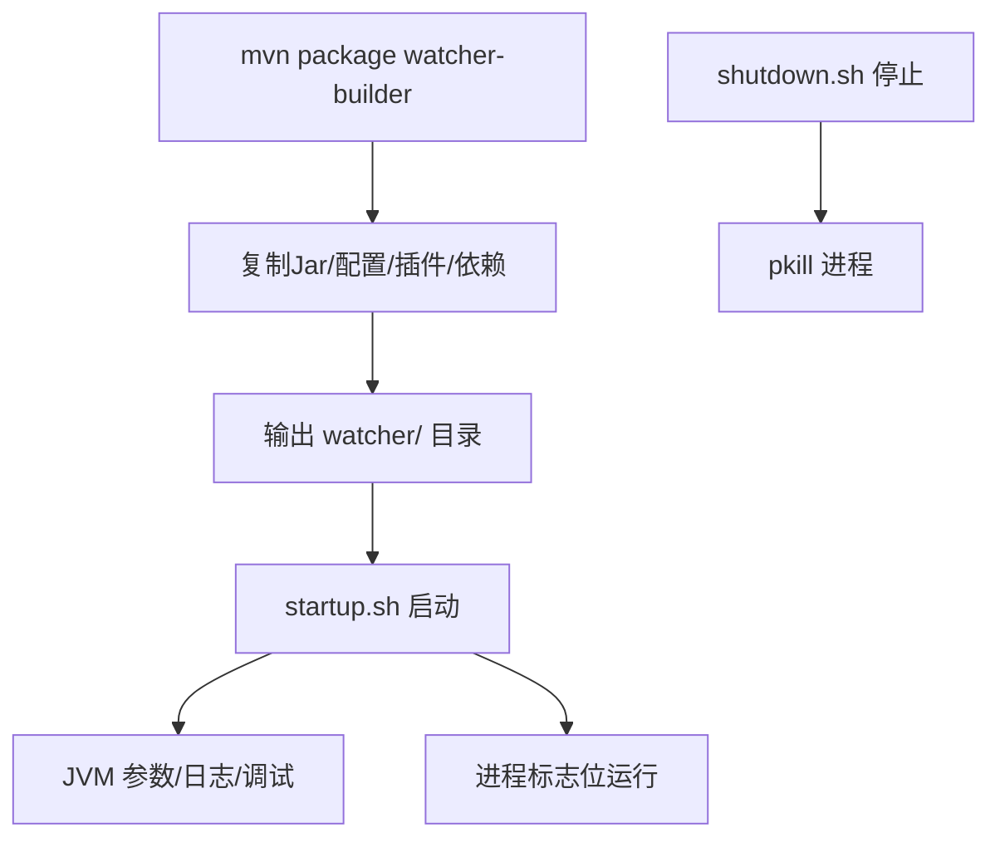
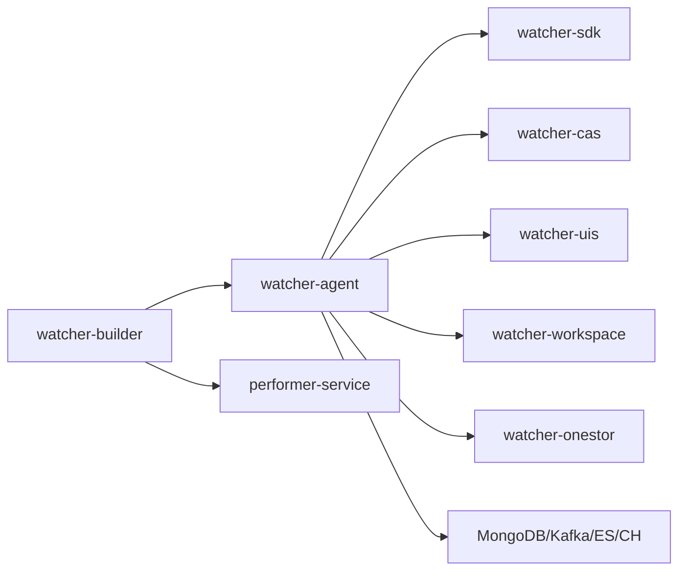

# 最佳实践

<cite>
**本文引用的文件**
- [Readme.md](file://Readme.md)
- [WatcherAgentApplication.java](file://watcher-agent/src/main/java/com/virtual/cloud/om/agent/WatcherAgentApplication.java)
- [application-prod.properties](file://watcher-agent/src/main/resources/application-prod.properties)
- [application-dev.properties](file://watcher-agent/src/main/resources/application-dev.properties)
- [schema-mysql.sql](file://watcher-agent/src/main/resources/schema-mysql.sql)
- [quartz.properties](file://watcher-agent/src/main/resources/quartz.properties)
- [DataSourceConfig.java](file://watcher-agent/src/main/java/com/virtual/cloud/om/agent/config/DataSourceConfig.java)
- [MetricController.java](file://watcher-agent/src/main/java/com/virtual/cloud/om/agent/controller/MetricController.java)
- [MetricService.java](file://watcher-agent/src/main/java/com/virtual/cloud/om/agent/service/report/MetricService.java)
- [CollectController.java](file://watcher-agent/src/main/java/com/virtual/cloud/om/agent/controller/CollectController.java)
- [startup.sh](file://watcher-builder/assembly/bin/startup.sh)
- [shutdown.sh](file://watcher-builder/assembly/bin/shutdown.sh)
- [pom.xml（watcher-builder）](file://watcher-builder/pom.xml)
</cite>

## 目录
1. [简介](#简介)
2. [项目结构](#项目结构)
3. [核心组件](#核心组件)
4. [架构总览](#架构总览)
5. [详细组件分析](#详细组件分析)
6. [依赖关系分析](#依赖关系分析)
7. [性能考虑](#性能考虑)
8. [故障排查指南](#故障排查指南)
9. [结论](#结论)
10. [附录](#附录)

## 简介
本指南面向ShowTime监控系统，聚焦于性能优化、部署最佳实践、监控策略、故障预防与运维管理，并结合仓库现有代码与构建脚本，给出可落地的建议与实操路径。系统采用Spring Boot微服务风格，结合Quartz定时任务、MongoDB、ClickHouse、Kafka、Elasticsearch等组件，形成“采集-传输-存储-查询-可视化”的完整链路。

## 项目结构
- watcher-agent：采集与调度主服务，负责指标上报、资源管理、定时采集、日志策略下发等。
- watcher-builder：打包与部署脚本，产出可执行的watcher/performer二进制与配置、插件集合。
- watcher-sdk：公共配置、DTO、工具类与常量定义。
- watcher-uis/cas/workspace/onestor：各产品线的采集插件与日志解析能力。
- watcher-web：前端Vue3应用。
- performer-service：监控数据查询与展示服务，对接ClickHouse。

图表来源
- [Readme.md:27-38](file://Readme.md#L27-L38)
- [WatcherAgentApplication.java:14-18](file://watcher-agent/src/main/java/com/virtual/cloud/om/agent/WatcherAgentApplication.java#L14-L18)

章节来源
- [Readme.md:27-38](file://Readme.md#L27-L38)
- [WatcherAgentApplication.java:14-18](file://watcher-agent/src/main/java/com/virtual/cloud/om/agent/WatcherAgentApplication.java#L14-L18)

## 核心组件
- 应用启动与扫描路径：通过@SpringBootApplication排除Quartz自动装配，启用@EnableScheduling，扫描agent、sdk、cas、uis、workspace、onestor等包。
- 数据源与连接池：使用HikariCP，MariaDB驱动，连接池大小与超时参数在配置类中设置。
- 指标查询与上报：提供REST接口用于查询指标类型、平台、列表、最新值、趋势与上报；后端聚合逻辑在服务层实现。
- 定时任务：Quartz配置线程池大小、集群模式等，结合MongoDB JobStore持久化。
- 生产配置：application-prod.properties集中管理ES/Kafka/MongoDB/ClickHouse/各产品REST端口等。
- 打包与启动：watcher-builder将Agent/Performer、配置、插件、依赖复制到统一目录，提供startup.sh/shutdown.sh进行进程生命周期管理。

章节来源
- [WatcherAgentApplication.java:14-18](file://watcher-agent/src/main/java/com/virtual/cloud/om/agent/WatcherAgentApplication.java#L14-L18)
- [DataSourceConfig.java:27-45](file://watcher-agent/src/main/java/com/virtual/cloud/om/agent/config/DataSourceConfig.java#L27-L45)
- [MetricController.java:24-102](file://watcher-agent/src/main/java/com/virtual/cloud/om/agent/controller/MetricController.java#L24-L102)
- [MetricService.java:26-265](file://watcher-agent/src/main/java/com/virtual/cloud/om/agent/service/report/MetricService.java#L26-L265)
- [quartz.properties:15-40](file://watcher-agent/src/main/resources/quartz.properties#L15-L40)
- [application-prod.properties:1-70](file://watcher-agent/src/main/resources/application-prod.properties#L1-L70)
- [startup.sh:62-78](file://watcher-builder/assembly/bin/startup.sh#L62-L78)
- [shutdown.sh:20-24](file://watcher-builder/assembly/bin/shutdown.sh#L20-L24)

## 架构总览
下图展示采集侧与查询侧的交互关系，以及关键外部组件：

图表来源
- [Readme.md:11-26](file://Readme.md#L11-L26)
- [MetricController.java:80-91](file://watcher-agent/src/main/java/com/virtual/cloud/om/agent/controller/MetricController.java#L80-L91)
- [application-prod.properties:65-69](file://watcher-agent/src/main/resources/application-prod.properties#L65-L69)

## 详细组件分析

### 指标查询与上报组件
- 控制器提供指标类型、平台、列表、最新值、趋势与上报接口，便于前端与上层系统集成。
- 服务层根据是否有resourceId与metricType决定走实时采集还是数据库查询；同时支持按时间范围与分页查询。
- 上报时对缺失字段进行补齐并入库。

图表来源
- [MetricController.java:24-102](file://watcher-agent/src/main/java/com/virtual/cloud/om/agent/controller/MetricController.java#L24-L102)
- [MetricService.java:26-265](file://watcher-agent/src/main/java/com/virtual/cloud/om/agent/service/report/MetricService.java#L26-L265)

章节来源
- [MetricController.java:24-102](file://watcher-agent/src/main/java/com/virtual/cloud/om/agent/controller/MetricController.java#L24-L102)
- [MetricService.java:26-265](file://watcher-agent/src/main/java/com/virtual/cloud/om/agent/service/report/MetricService.java#L26-L265)

### 采集与资源管理组件
- 提供实时日志策略下发、资源批量同步与批量部署接口，支撑运维自动化与策略下发。
- 与DeployApi、RealTimeLogApi、ResourceService等协作完成资源编排与任务下发。

图表来源
- [CollectController.java:45-65](file://watcher-agent/src/main/java/com/virtual/cloud/om/agent/controller/CollectController.java#L45-L65)

章节来源
- [CollectController.java:27-66](file://watcher-agent/src/main/java/com/virtual/cloud/om/agent/controller/CollectController.java#L27-L66)

### 定时任务与作业存储
- Quartz线程池大小与集群模式在quartz.properties中配置，结合MongoDB JobStore实现持久化与集群容错。
- 建议结合业务负载评估线程数与Misfire阈值，避免任务堆积或丢失。

图表来源
- [quartz.properties:15-40](file://watcher-agent/src/main/resources/quartz.properties#L15-L40)

章节来源
- [quartz.properties:15-40](file://watcher-agent/src/main/resources/quartz.properties#L15-L40)

### 数据源与连接池
- HikariCP连接池参数（最大池大小、最小空闲、连接超时、空闲超时、最大生存时间）直接影响数据库吞吐与稳定性。
- 建议结合ClickHouse/MySQL/ES/Kafka的并发与延迟目标调整连接池上限与超时。

图表来源
- [DataSourceConfig.java:27-45](file://watcher-agent/src/main/java/com/virtual/cloud/om/agent/config/DataSourceConfig.java#L27-L45)

章节来源
- [DataSourceConfig.java:18-45](file://watcher-agent/src/main/java/com/virtual/cloud/om/agent/config/DataSourceConfig.java#L18-L45)

### 生产配置与外部依赖
- 生产配置集中于application-prod.properties，涵盖MongoDB、Kafka、ES、ClickHouse、各产品REST端口等。
- 建议将敏感信息纳入密钥管理，避免硬编码；同时为不同环境准备独立配置文件。

章节来源
- [application-prod.properties:1-70](file://watcher-agent/src/main/resources/application-prod.properties#L1-L70)
- [application-dev.properties:1-72](file://watcher-agent/src/main/resources/application-dev.properties#L1-L72)

### 打包与启动脚本
- watcher-builder将Agent/Performer、配置、插件与依赖复制到统一目录，便于部署。
- startup.sh设置JVM内存与GC日志、堆转储路径，支持远程调试端口；shutdown.sh基于进程标志位停止服务。

图表来源
- [pom.xml（watcher-builder）:25-198](file://watcher-builder/pom.xml#L25-L198)
- [startup.sh:62-78](file://watcher-builder/assembly/bin/startup.sh#L62-L78)
- [shutdown.sh:20-24](file://watcher-builder/assembly/bin/shutdown.sh#L20-L24)

章节来源
- [pom.xml（watcher-builder）:15-212](file://watcher-builder/pom.xml#L15-L212)
- [startup.sh:1-81](file://watcher-builder/assembly/bin/startup.sh#L1-L81)
- [shutdown.sh:1-26](file://watcher-builder/assembly/bin/shutdown.sh#L1-L26)

## 依赖关系分析
- watcher-agent依赖watcher-sdk提供的常量、DTO、工具与MyBatis Mapper；同时扫描多个业务包以加载插件能力。
- watcher-builder通过AntRun插件在打包阶段组装产物，确保部署一致性。
- 外部依赖包括MongoDB、Kafka、Elasticsearch、ClickHouse等，需在生产环境独立部署与高可用配置。

图表来源
- [WatcherAgentApplication.java:14-18](file://watcher-agent/src/main/java/com/virtual/cloud/om/agent/WatcherAgentApplication.java#L14-L18)
- [pom.xml（watcher-builder）:25-198](file://watcher-builder/pom.xml#L25-L198)

章节来源
- [WatcherAgentApplication.java:14-18](file://watcher-agent/src/main/java/com/virtual/cloud/om/agent/WatcherAgentApplication.java#L14-L18)
- [pom.xml（watcher-builder）:15-212](file://watcher-builder/pom.xml#L15-L212)

## 性能考虑
- 系统性能调优
  - JVM参数：结合startup.sh中的-Xmx/-Xms与GC日志配置，评估内存占用与Full GC频率，必要时调整堆大小与GC策略。
  - 连接池：根据数据库与外部组件并发需求调整HikariCP参数，避免连接饥饿与超时。
  - 定时任务：根据业务峰值调整Quartz线程池大小与Misfire阈值，避免任务积压。
- 数据库查询优化
  - MySQL初始化脚本包含多处索引，建议结合实际查询模式验证索引命中率，必要时增加复合索引或分区。
  - 对高频查询字段（如report_time、resource_id、metric_type）保持索引有效性。
- 缓存策略
  - 对热点指标与平台类型查询结果进行短期缓存，降低数据库压力。
  - 对前端常用枚举（如指标类型、平台类型）进行静态缓存或前端本地缓存。
- 资源利用率提升
  - 合理设置Kafka/ES/CH的消费者并发与批处理大小，避免过载。
  - 对日志批量采集路径与文件大小进行限流，防止磁盘IO瓶颈。

章节来源
- [startup.sh:62-78](file://watcher-builder/assembly/bin/startup.sh#L62-L78)
- [DataSourceConfig.java:35-44](file://watcher-agent/src/main/java/com/virtual/cloud/om/agent/config/DataSourceConfig.java#L35-L44)
- [quartz.properties:15-40](file://watcher-agent/src/main/resources/quartz.properties#L15-L40)
- [schema-mysql.sql:112-203](file://watcher-agent/src/main/resources/schema-mysql.sql#L112-L203)

## 故障排查指南
- 启停问题
  - 启动失败：检查Java版本与JAR路径，确认-Dloader.path包含lib、plugins、conf目录。
  - 停止异常：确认进程标志位匹配，避免误杀其他进程。
- 指标查询异常
  - 若返回空列表，确认resourceId与metricType是否正确，或切换为数据库查询路径。
  - 上报失败：检查日志错误与数据库连接参数，关注连接池耗尽与超时。
- 外部组件连通性
  - ES/Kafka/MongoDB/ClickHouse的连接参数与超时需与生产配置一致，优先验证连通性与鉴权。
- 日志与诊断
  - 查看GC日志与堆转储，定位内存与GC问题；结合业务峰值观察指标波动。

章节来源
- [startup.sh:15-25](file://watcher-builder/assembly/bin/startup.sh#L15-L25)
- [shutdown.sh:20-24](file://watcher-builder/assembly/bin/shutdown.sh#L20-L24)
- [MetricController.java:80-91](file://watcher-agent/src/main/java/com/virtual/cloud/om/agent/controller/MetricController.java#L80-L91)
- [application-prod.properties:3-30](file://watcher-agent/src/main/resources/application-prod.properties#L3-L30)

## 结论
本指南基于仓库现有代码与构建脚本，给出了ShowTime监控系统在性能优化、部署与运维方面的最佳实践建议。建议在生产环境中进一步完善密钥管理、高可用架构与灾备方案，并持续优化查询与缓存策略，以满足大规模监控场景下的稳定性与可观测性要求。

## 附录
- 关键指标建议
  - 指标采集延迟、上报成功率、查询响应时间、数据库连接池使用率、Kafka消费者滞后、ES写入延迟、ClickHouse写入队列长度。
- 告警阈值设定
  - 基于历史基线与业务SLA设定阈值，区分严重/警告/提醒三级告警，并配套自愈动作。
- 监控覆盖度
  - 覆盖采集、传输、存储、查询全链路，确保关键路径均有可观测性与告警。
- 变更与发布
  - 采用蓝绿/滚动发布策略，配合灰度流量与快速回滚；变更前进行压测与回归测试。
- 安全加固
  - 强化配置文件权限与密钥管理，启用TLS与最小权限访问控制，定期进行漏洞扫描与基线检查。