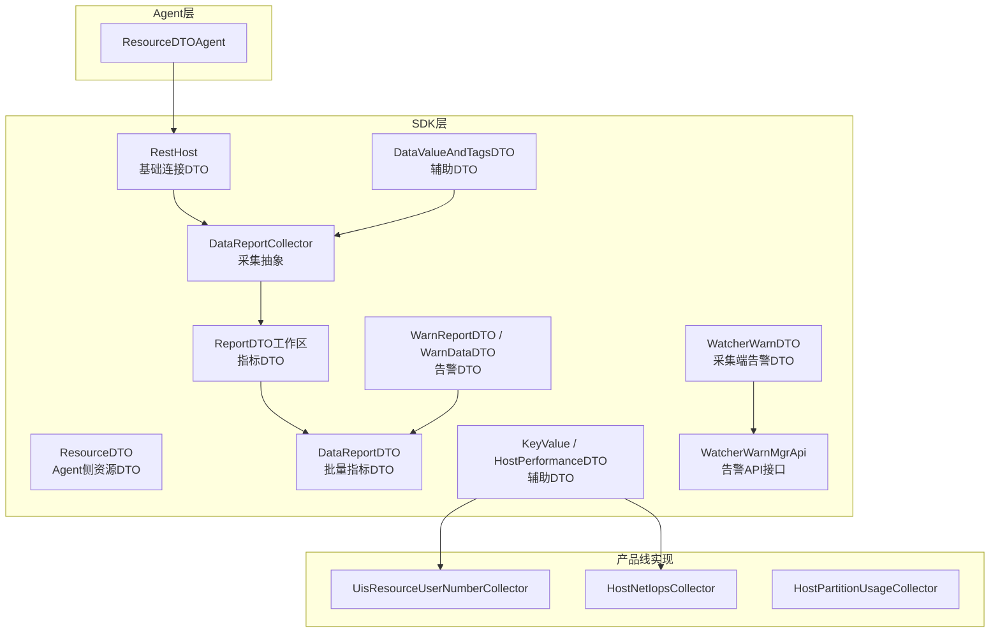
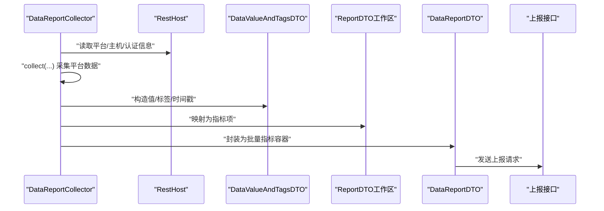
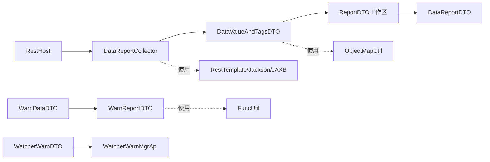
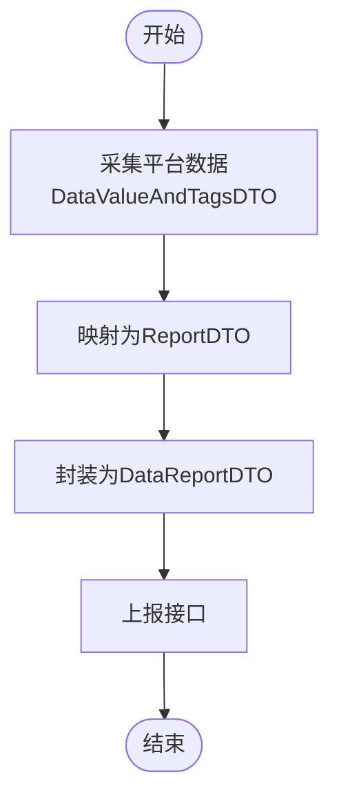

# DTO数据传输对象

<cite>
**本文引用的文件**
- [RestHost.java](file://watcher-sdk/src/main/java/com/virtual/cloud/om/sdk/dto/RestHost.java)
- [ResourceDTO.java](file://watcher-agent/src/main/java/com/virtual/cloud/om/agent/dto/ResourceDTO.java)
- [ReportDTO.java（工作区）](file://watcher-sdk/src/main/java/com/virtual/cloud/om/sdk/dto/dataReport/workspace/ReportDTO.java)
- [DataReportDTO.java](file://watcher-agent/src/main/java/com/virtual/cloud/om/agent/dto/DataReportDTO.java)
- [WarnReportDTO.java](file://watcher-sdk/src/main/java/com/virtual/cloud/om/sdk/dto/dataReport/workspace/WarnReportDTO.java)
- [WarnDataDTO.java](file://watcher-sdk/src/main/java/com/virtual/cloud/om/sdk/dto/dataReport/workspace/WarnDataDTO.java)
- [WatcherWarnDTO.java](file://watcher-sdk/src/main/java/com/virtual/cloud/om/sdk/dto/WatcherWarnDTO.java)
- [DataValueAndTagsDTO.java](file://watcher-sdk/src/main/java/com/virtual/cloud/om/sdk/dto/dataReport/DataValueAndTagsDTO.java)
- [KeyValue.java](file://watcher-sdk/src/main/java/com/virtual/cloud/om/sdk/dto/dataReport/cas/KeyValue.java)
- [HostPerformanceDTO.java](file://watcher-sdk/src/main/java/com/virtual/cloud/om/sdk/dto/dataReport/cas/HostPerformanceDTO.java)
- [DataReportCollector.java](file://watcher-sdk/src/main/java/com/virtual/cloud/om/sdk/api/DataReportCollector.java)
- [WatcherWarnMgrApi.java](file://watcher-sdk/src/main/java/com/virtual/cloud/om/sdk/api/WatcherWarnMgrApi.java)
- [UisResourceUserNumberCollector.java](file://watcher-uis/src/main/java/com/virtual/cloud/om/uis/service/report/UisResourceUserNumberCollector.java)
- [HostNetIopsCollector.java](file://watcher-cas/src/main/java/com/virtual/cloud/om/cas/service/severPerformanceMonitor/HostNetIopsCollector.java)
- [HostPartitionUsageCollector.java](file://watcher-cas/src/main/java/com/virtual/cloud/om/cas/service/severPerformanceMonitor/HostPartitionUsageCollector.java)
- [RestTemplateConfig.java](file://watcher-sdk/src/main/java/com/virtual/cloud/om/sdk/config/rest/RestTemplateConfig.java)
- [ObjectMapUtil.java](file://watcher-sdk/src/main/java/com/virtual/cloud/om/sdk/utils/ObjectMapUtil.java)
- [FuncUtil.java](file://watcher-sdk/src/main/java/com/virtual/cloud/om/sdk/utils/FuncUtil.java)
</cite>

## 目录
1. [引言](#引言)
2. [项目结构](#项目结构)
3. [核心组件](#核心组件)
4. [架构总览](#架构总览)
5. [详细组件分析](#详细组件分析)
6. [依赖分析](#依赖分析)
7. [性能考虑](#性能考虑)
8. [故障排查指南](#故障排查指南)
9. [结论](#结论)
10. [附录](#附录)

## 引言
本文件系统性梳理仓库中的DTO数据传输对象，覆盖基础DTO（如RestHost、ResourceDTO）、指标DTO（如ReportDTO、HostPerformanceDTO）、告警DTO（如WarnReportDTO、WatcherWarnDTO），并解释其字段语义、数据类型、验证规则与序列化机制；同时阐明不同产品线（CAS/UIS/Workspace/OneStor）的DTO差异与通用性设计，给出DataValueAndTagsDTO、KeyValue等辅助DTO的职责与用法，最后总结DTO之间的转换关系与映射规则，并提供在API调用、数据传输与业务逻辑中的使用示例与最佳实践。

## 项目结构
DTO主要分布在以下模块与包中：
- SDK层：通用DTO与采集/告警API抽象
  - 基础DTO：com.virtual.cloud.om.sdk.dto
  - 指标DTO：com.virtual.cloud.om.sdk.dto.dataReport.* 与 dataReport.workspace.*
  - 告警DTO：com.virtual.cloud.om.sdk.dto.dataReport.workspace.* 与 sdk.dto
  - 采集与告警API：com.virtual.cloud.om.sdk.api
- Agent层：Agent侧资源与上报封装
  - 资源DTO：com.virtual.cloud.om.agent.dto
- 产品线实现：CAS/UIS等通过DataReportCollector等实现采集与上报

图表来源
- [RestHost.java:1-116](file://watcher-sdk/src/main/java/com/virtual/cloud/om/sdk/dto/RestHost.java#L1-L116)
- [ResourceDTO.java:1-35](file://watcher-agent/src/main/java/com/virtual/cloud/om/agent/dto/ResourceDTO.java#L1-L35)
- [ReportDTO.java（工作区）:1-25](file://watcher-sdk/src/main/java/com/virtual/cloud/om/sdk/dto/dataReport/workspace/ReportDTO.java#L1-L25)
- [DataReportDTO.java:1-26](file://watcher-agent/src/main/java/com/virtual/cloud/om/agent/dto/DataReportDTO.java#L1-L26)
- [WarnReportDTO.java:1-25](file://watcher-sdk/src/main/java/com/virtual/cloud/om/sdk/dto/dataReport/workspace/WarnReportDTO.java#L1-L25)
- [WarnDataDTO.java:1-32](file://watcher-sdk/src/main/java/com/virtual/cloud/om/sdk/dto/dataReport/workspace/WarnDataDTO.java#L1-L32)
- [WatcherWarnDTO.java:1-39](file://watcher-sdk/src/main/java/com/virtual/cloud/om/sdk/dto/WatcherWarnDTO.java#L1-L39)
- [DataValueAndTagsDTO.java:1-16](file://watcher-sdk/src/main/java/com/virtual/cloud/om/sdk/dto/dataReport/DataValueAndTagsDTO.java#L1-L16)
- [KeyValue.java:1-18](file://watcher-sdk/src/main/java/com/virtual/cloud/om/sdk/dto/dataReport/cas/KeyValue.java#L1-L18)
- [HostPerformanceDTO.java:1-43](file://watcher-sdk/src/main/java/com/virtual/cloud/om/sdk/dto/dataReport/cas/HostPerformanceDTO.java#L1-L43)
- [DataReportCollector.java:1-118](file://watcher-sdk/src/main/java/com/virtual/cloud/om/sdk/api/DataReportCollector.java#L1-L118)
- [WatcherWarnMgrApi.java:1-36](file://watcher-sdk/src/main/java/com/virtual/cloud/om/sdk/api/WatcherWarnMgrApi.java#L1-L36)
- [UisResourceUserNumberCollector.java:1-27](file://watcher-uis/src/main/java/com/virtual/cloud/om/uis/service/report/UisResourceUserNumberCollector.java#L1-L27)
- [HostNetIopsCollector.java:128-137](file://watcher-cas/src/main/java/com/virtual/cloud/om/cas/service/severPerformanceMonitor/HostNetIopsCollector.java#L128-L137)
- [HostPartitionUsageCollector.java:157-173](file://watcher-cas/src/main/java/com/virtual/cloud/om/cas/service/severPerformanceMonitor/HostPartitionUsageCollector.java#L157-L173)

章节来源
- [RestHost.java:1-116](file://watcher-sdk/src/main/java/com/virtual/cloud/om/sdk/dto/RestHost.java#L1-L116)
- [ResourceDTO.java:1-35](file://watcher-agent/src/main/java/com/virtual/cloud/om/agent/dto/ResourceDTO.java#L1-L35)
- [ReportDTO.java（工作区）:1-25](file://watcher-sdk/src/main/java/com/virtual/cloud/om/sdk/dto/dataReport/workspace/ReportDTO.java#L1-L25)
- [DataReportDTO.java:1-26](file://watcher-agent/src/main/java/com/virtual/cloud/om/agent/dto/DataReportDTO.java#L1-L26)
- [WarnReportDTO.java:1-25](file://watcher-sdk/src/main/java/com/virtual/cloud/om/sdk/dto/dataReport/workspace/WarnReportDTO.java#L1-L25)
- [WarnDataDTO.java:1-32](file://watcher-sdk/src/main/java/com/virtual/cloud/om/sdk/dto/dataReport/workspace/WarnDataDTO.java#L1-L32)
- [WatcherWarnDTO.java:1-39](file://watcher-sdk/src/main/java/com/virtual/cloud/om/sdk/dto/WatcherWarnDTO.java#L1-L39)
- [DataValueAndTagsDTO.java:1-16](file://watcher-sdk/src/main/java/com/virtual/cloud/om/sdk/dto/dataReport/DataValueAndTagsDTO.java#L1-L16)
- [KeyValue.java:1-18](file://watcher-sdk/src/main/java/com/virtual/cloud/om/sdk/dto/dataReport/cas/KeyValue.java#L1-L18)
- [HostPerformanceDTO.java:1-43](file://watcher-sdk/src/main/java/com/virtual/cloud/om/sdk/dto/dataReport/cas/HostPerformanceDTO.java#L1-L43)
- [DataReportCollector.java:1-118](file://watcher-sdk/src/main/java/com/virtual/cloud/om/sdk/api/DataReportCollector.java#L1-L118)
- [WatcherWarnMgrApi.java:1-36](file://watcher-sdk/src/main/java/com/virtual/cloud/om/sdk/api/WatcherWarnMgrApi.java#L1-L36)
- [UisResourceUserNumberCollector.java:1-27](file://watcher-uis/src/main/java/com/virtual/cloud/om/uis/service/report/UisResourceUserNumberCollector.java#L1-L27)
- [HostNetIopsCollector.java:128-137](file://watcher-cas/src/main/java/com/virtual/cloud/om/cas/service/severPerformanceMonitor/HostNetIopsCollector.java#L128-L137)
- [HostPartitionUsageCollector.java:157-173](file://watcher-cas/src/main/java/com/virtual/cloud/om/cas/service/severPerformanceMonitor/HostPartitionUsageCollector.java#L157-L173)

## 核心组件
- 基础DTO
  - RestHost：描述资源管理平台（CAS/UIS/Workspace/OneStor）的连接地址与认证信息，支持构建器模式，便于链式配置。
  - ResourceDTO（Agent）：描述Agent侧资源的连接参数与认证细节，便于统一接入各平台REST接口。
- 指标DTO
  - ReportDTO（工作区）：指标项的最小单元，包含指标枚举、值类型、标签、批次、值与时间戳。
  - DataReportDTO：批量指标容器，承载多条ReportDTO及租户/平台/时间戳等上下文。
  - DataValueAndTagsDTO：采集阶段的中间载体，包含值、标签与时间戳，用于从具体平台数据到标准ReportDTO的转换。
  - HostPerformanceDTO、KeyValue：产品线特定的辅助DTO，分别承载主机性能与键值对结构。
- 告警DTO
  - WarnReportDTO/WarnDataDTO：工作区告警上报结构，包含租户/组织/平台、告警列表、上报时间与追踪ID。
  - WatcherWarnDTO：采集端告警聚合结构，包含节点ID、级别、消息、首次/最新时间与重复次数等。

章节来源
- [RestHost.java:1-116](file://watcher-sdk/src/main/java/com/virtual/cloud/om/sdk/dto/RestHost.java#L1-L116)
- [ResourceDTO.java:1-35](file://watcher-agent/src/main/java/com/virtual/cloud/om/agent/dto/ResourceDTO.java#L1-L35)
- [ReportDTO.java（工作区）:1-25](file://watcher-sdk/src/main/java/com/virtual/cloud/om/sdk/dto/dataReport/workspace/ReportDTO.java#L1-L25)
- [DataReportDTO.java:1-26](file://watcher-agent/src/main/java/com/virtual/cloud/om/agent/dto/DataReportDTO.java#L1-L26)
- [DataValueAndTagsDTO.java:1-16](file://watcher-sdk/src/main/java/com/virtual/cloud/om/sdk/dto/dataReport/DataValueAndTagsDTO.java#L1-L16)
- [HostPerformanceDTO.java:1-43](file://watcher-sdk/src/main/java/com/virtual/cloud/om/sdk/dto/dataReport/cas/HostPerformanceDTO.java#L1-L43)
- [KeyValue.java:1-18](file://watcher-sdk/src/main/java/com/virtual/cloud/om/sdk/dto/dataReport/cas/KeyValue.java#L1-L18)
- [WarnReportDTO.java:1-25](file://watcher-sdk/src/main/java/com/virtual/cloud/om/sdk/dto/dataReport/workspace/WarnReportDTO.java#L1-L25)
- [WarnDataDTO.java:1-32](file://watcher-sdk/src/main/java/com/virtual/cloud/om/sdk/dto/dataReport/workspace/WarnDataDTO.java#L1-L32)
- [WatcherWarnDTO.java:1-39](file://watcher-sdk/src/main/java/com/virtual/cloud/om/sdk/dto/WatcherWarnDTO.java#L1-L39)

## 架构总览
下图展示了采集与上报流程中DTO的流转关系：采集器通过RestHost获取平台数据，产出DataValueAndTagsDTO，再映射为ReportDTO，最终封装进DataReportDTO进行上报；告警路径则由产品线生成WarnDataDTO，封装为WarnReportDTO进行上报或由采集端聚合为WatcherWarnDTO。

图表来源
- [DataReportCollector.java:48-86](file://watcher-sdk/src/main/java/com/virtual/cloud/om/sdk/api/DataReportCollector.java#L48-L86)
- [DataValueAndTagsDTO.java:1-16](file://watcher-sdk/src/main/java/com/virtual/cloud/om/sdk/dto/dataReport/DataValueAndTagsDTO.java#L1-L16)
- [ReportDTO.java（工作区）:1-25](file://watcher-sdk/src/main/java/com/virtual/cloud/om/sdk/dto/dataReport/workspace/ReportDTO.java#L1-L25)
- [DataReportDTO.java:1-26](file://watcher-agent/src/main/java/com/virtual/cloud/om/agent/dto/DataReportDTO.java#L1-L26)

## 详细组件分析

### 基础DTO：RestHost 与 ResourceDTO
- 设计目的
  - RestHost：统一描述平台连接信息（平台类型、资源ID、主机、协议、端口、用户名/密码、管理节点凭据），支持构建器以提升可读性与可维护性。
  - ResourceDTO（Agent）：面向Agent侧资源的统一描述，便于对接各平台HTTP接口与SSH端口等。
- 字段与类型
  - 平台类型、资源ID、主机、协议、端口、用户名/密码、管理节点凭据、认证类型、服务器端口等。
- 验证规则
  - 未见显式注解校验，建议在使用前进行非空与格式校验（如端口范围、协议枚举）。
- 序列化机制
  - 使用Swagger注解标注，配合SDK的RestTemplate/Jackson/JAXB消息转换器进行序列化/反序列化。

章节来源
- [RestHost.java:1-116](file://watcher-sdk/src/main/java/com/virtual/cloud/om/sdk/dto/RestHost.java#L1-L116)
- [ResourceDTO.java:1-35](file://watcher-agent/src/main/java/com/virtual/cloud/om/agent/dto/ResourceDTO.java#L1-L35)
- [RestTemplateConfig.java:138-151](file://watcher-sdk/src/main/java/com/virtual/cloud/om/sdk/config/rest/RestTemplateConfig.java#L138-L151)

### 指标DTO：ReportDTO、DataReportDTO、DataValueAndTagsDTO
- 设计目的
  - ReportDTO：指标项的标准化载体，包含指标类型、值类型、标签、批次、值与时间戳。
  - DataReportDTO：批量指标容器，承载租户/组织/平台上下文与多条指标项。
  - DataValueAndTagsDTO：采集阶段的中间载体，便于从平台特定数据结构映射为标准指标。
- 字段与类型
  - ReportDTO：指标枚举、值类型枚举、标签字符串、批次字符串、值对象、时间戳长整型。
  - DataReportDTO：租户/组织/平台上下文、指标列表、上报时间、追踪ID。
  - DataValueAndTagsDTO：值对象、标签字符串、时间戳长整型。
- 验证规则
  - ReportDTO的值类型与值对象需保持一致；DataValueAndTagsDTO要求三要素均非空。
- 序列化机制
  - Jackson用于JSON序列化；JAXB用于XML序列化（部分产品线）。

章节来源
- [ReportDTO.java（工作区）:1-25](file://watcher-sdk/src/main/java/com/virtual/cloud/om/sdk/dto/dataReport/workspace/ReportDTO.java#L1-L25)
- [DataReportDTO.java:1-26](file://watcher-agent/src/main/java/com/virtual/cloud/om/agent/dto/DataReportDTO.java#L1-L26)
- [DataValueAndTagsDTO.java:1-16](file://watcher-sdk/src/main/java/com/virtual/cloud/om/sdk/dto/dataReport/DataValueAndTagsDTO.java#L1-L16)

### 告警DTO：WarnReportDTO、WarnDataDTO、WatcherWarnDTO
- 设计目的
  - WarnReportDTO/WarnDataDTO：工作区告警上报结构，承载租户/组织/平台、告警列表、上报时间与追踪ID。
  - WatcherWarnDTO：采集端告警聚合结构，便于统一管理节点级告警状态。
- 字段与类型
  - WarnReportDTO：租户/组织/平台、告警列表、上报时间、追踪ID。
  - WarnDataDTO：告警类型、来源、名称、对象类别、消息、开始/结束时间、级别、重复次数、资源ID、Agent IP。
  - WatcherWarnDTO：节点ID、级别、消息、首次/最新时间、类型、重复次数。
- 验证规则
  - 建议对时间戳、级别、类型等进行范围校验。
- 序列化机制
  - JSON序列化为主，配合Swagger注解。

章节来源
- [WarnReportDTO.java:1-25](file://watcher-sdk/src/main/java/com/virtual/cloud/om/sdk/dto/dataReport/workspace/WarnReportDTO.java#L1-L25)
- [WarnDataDTO.java:1-32](file://watcher-sdk/src/main/java/com/virtual/cloud/om/sdk/dto/dataReport/workspace/WarnDataDTO.java#L1-L32)
- [WatcherWarnDTO.java:1-39](file://watcher-sdk/src/main/java/com/virtual/cloud/om/sdk/dto/WatcherWarnDTO.java#L1-L39)

### 辅助DTO：HostPerformanceDTO、KeyValue
- 设计目的
  - HostPerformanceDTO：承载主机实时性能信息（CPU、内存、IO、网络、周期）。
  - KeyValue：键值对结构，常用于平台内部数据组装与序列化。
- 字段与类型
  - HostPerformanceDTO：字符串型性能指标与周期。
  - KeyValue：键字符串与值字符串。
- 验证规则
  - 建议对数值型指标进行格式与范围校验。
- 序列化机制
  - JAXB注解用于XML序列化；Jackson用于JSON序列化。

章节来源
- [HostPerformanceDTO.java:1-43](file://watcher-sdk/src/main/java/com/virtual/cloud/om/sdk/dto/dataReport/cas/HostPerformanceDTO.java#L1-L43)
- [KeyValue.java:1-18](file://watcher-sdk/src/main/java/com/virtual/cloud/om/sdk/dto/dataReport/cas/KeyValue.java#L1-L18)

### 采集与告警API：DataReportCollector、WatcherWarnMgrApi
- 设计目的
  - DataReportCollector：采集抽象基类，统一采集入口，负责从RestHost读取平台数据，产出DataValueAndTagsDTO并映射为ReportDTO。
  - WatcherWarnMgrApi：采集端告警管理接口，定义查询与编辑采集端告警的方法。
- 处理逻辑
  - data(...) 方法：读取RestHost，调用collect(...)采集平台数据，映射为ReportDTO列表，统一填充时间戳后返回。
  - collect(...)：抽象方法，由各产品线实现具体采集逻辑。
  - WatcherWarnMgrApi：定义按节点与类型查询/编辑采集端告警。

章节来源
- [DataReportCollector.java:1-118](file://watcher-sdk/src/main/java/com/virtual/cloud/om/sdk/api/DataReportCollector.java#L1-L118)
- [WatcherWarnMgrApi.java:1-36](file://watcher-sdk/src/main/java/com/virtual/cloud/om/sdk/api/WatcherWarnMgrApi.java#L1-L36)

## 依赖分析
- 组件耦合
  - DataReportCollector依赖RestHost与DataValueAndTagsDTO，向上游产出ReportDTO，再由上层封装为DataReportDTO。
  - 产品线实现（如CAS/UIS）通过继承DataReportCollector完成采集，使用DataValueAndTagsDTO作为中间载体。
  - 告警路径中，产品线生成WarnDataDTO，封装为WarnReportDTO；采集端通过WatcherWarnDTO进行聚合。
- 外部依赖
  - RestTemplate/Jackson/JAXB消息转换器用于序列化/反序列化。
  - 工具类ObjectMapUtil、FuncUtil用于对象与XML转换。

图表来源
- [DataReportCollector.java:48-86](file://watcher-sdk/src/main/java/com/virtual/cloud/om/sdk/api/DataReportCollector.java#L48-L86)
- [DataValueAndTagsDTO.java:1-16](file://watcher-sdk/src/main/java/com/virtual/cloud/om/sdk/dto/dataReport/DataValueAndTagsDTO.java#L1-L16)
- [ReportDTO.java（工作区）:1-25](file://watcher-sdk/src/main/java/com/virtual/cloud/om/sdk/dto/dataReport/workspace/ReportDTO.java#L1-L25)
- [DataReportDTO.java:1-26](file://watcher-agent/src/main/java/com/virtual/cloud/om/agent/dto/DataReportDTO.java#L1-L26)
- [WarnReportDTO.java:1-25](file://watcher-sdk/src/main/java/com/virtual/cloud/om/sdk/dto/dataReport/workspace/WarnReportDTO.java#L1-L25)
- [WarnDataDTO.java:1-32](file://watcher-sdk/src/main/java/com/virtual/cloud/om/sdk/dto/dataReport/workspace/WarnDataDTO.java#L1-L32)
- [WatcherWarnDTO.java:1-39](file://watcher-sdk/src/main/java/com/virtual/cloud/om/sdk/dto/WatcherWarnDTO.java#L1-L39)
- [RestTemplateConfig.java:138-151](file://watcher-sdk/src/main/java/com/virtual/cloud/om/sdk/config/rest/RestTemplateConfig.java#L138-L151)
- [ObjectMapUtil.java:1-44](file://watcher-sdk/src/main/java/com/virtual/cloud/om/sdk/utils/ObjectMapUtil.java#L1-L44)
- [FuncUtil.java:194-225](file://watcher-sdk/src/main/java/com/virtual/cloud/om/sdk/utils/FuncUtil.java#L194-L225)

## 性能考虑
- 序列化开销
  - 大批量指标上报时，优先使用Jackson进行JSON序列化，减少不必要的XML转换。
  - 对于CAS等使用JAXB的场景，注意XML编码与字符集转换成本。
- 数据映射效率
  - DataReportCollector在映射阶段避免重复计算，统一填充时间戳，减少下游处理成本。
- 连接与认证
  - RestHost应复用连接池与认证缓存，降低频繁认证带来的延迟。

## 故障排查指南
- 常见问题
  - 字段为空或类型不匹配：检查ReportDTO的值类型与值对象一致性，确保DataValueAndTagsDTO三要素齐全。
  - 序列化失败：确认RestTemplate的消息转换器配置是否包含Jackson与JAXB；必要时调整字符集。
  - 告警缺失：核对WarnReportDTO/WarnDataDTO的时间戳与追踪ID，确保采集端与上报端一致。
- 排查步骤
  - 在采集器中打印中间产物（DataValueAndTagsDTO、ReportDTO列表）以定位异常。
  - 使用ObjectMapUtil进行对象到Map的转换，辅助调试字段映射。
  - 对XML序列化问题，使用FuncUtil提供的转换工具进行对比验证。

章节来源
- [DataReportCollector.java:48-86](file://watcher-sdk/src/main/java/com/virtual/cloud/om/sdk/api/DataReportCollector.java#L48-L86)
- [RestTemplateConfig.java:138-151](file://watcher-sdk/src/main/java/com/virtual/cloud/om/sdk/config/rest/RestTemplateConfig.java#L138-L151)
- [ObjectMapUtil.java:1-44](file://watcher-sdk/src/main/java/com/virtual/cloud/om/sdk/utils/ObjectMapUtil.java#L1-L44)
- [FuncUtil.java:194-225](file://watcher-sdk/src/main/java/com/virtual/cloud/om/sdk/utils/FuncUtil.java#L194-L225)

## 结论
本仓库的DTO体系围绕“采集—映射—上报—告警”主线展开，通过RestHost、DataValueAndTagsDTO、ReportDTO与DataReportDTO形成清晰的数据流，辅以产品线特定的DTO（如HostPerformanceDTO、KeyValue）满足差异化需求。SDK层提供统一的采集与告警API抽象，Agent层提供资源侧封装，产品线实现通过继承与组合完成落地。遵循本文的字段语义、验证规则与序列化机制，可在API调用、数据传输与业务逻辑中高效、稳定地使用这些DTO对象。

## 附录

### DTO字段定义与类型摘要
- RestHost
  - 平台类型、资源ID、主机、协议、端口、用户名、密码、管理节点用户名/密码
- ResourceDTO（Agent）
  - 资源名称、平台、ID、IP、端口、认证用户名/密码、协议、认证类型、服务器后台账号/密码、服务器端口
- ReportDTO（工作区）
  - 指标枚举、值类型枚举、标签、批次、值对象、时间戳
- DataReportDTO
  - 租户/组织/平台、指标列表、上报时间、追踪ID
- DataValueAndTagsDTO
  - 值对象、标签、时间戳
- WarnReportDTO/WarnDataDTO
  - 租户/组织/平台、告警列表、上报时间、追踪ID；告警类型、来源、名称、对象类别、消息、开始/结束时间、级别、重复次数、资源ID、Agent IP
- WatcherWarnDTO
  - 节点ID、级别、消息、首次/最新时间、类型、重复次数
- HostPerformanceDTO
  - CPU利用率、内存利用率、IO、网络吞吐量、周期
- KeyValue
  - 键、值

### DTO转换关系与映射规则
- 采集映射
  - RestHost → DataValueAndTagsDTO → ReportDTO → DataReportDTO
- 告警映射
  - 产品线告警 → WarnDataDTO → WarnReportDTO
  - 采集端聚合 → WatcherWarnDTO

图表来源
- [DataReportCollector.java:48-86](file://watcher-sdk/src/main/java/com/virtual/cloud/om/sdk/api/DataReportCollector.java#L48-L86)
- [DataValueAndTagsDTO.java:1-16](file://watcher-sdk/src/main/java/com/virtual/cloud/om/sdk/dto/dataReport/DataValueAndTagsDTO.java#L1-L16)
- [ReportDTO.java（工作区）:1-25](file://watcher-sdk/src/main/java/com/virtual/cloud/om/sdk/dto/dataReport/workspace/ReportDTO.java#L1-L25)
- [DataReportDTO.java:1-26](file://watcher-agent/src/main/java/com/virtual/cloud/om/agent/dto/DataReportDTO.java#L1-L26)

### 使用示例（路径指引）
- API调用与数据传输
  - 采集指标：参考 [DataReportCollector.java:48-86](file://watcher-sdk/src/main/java/com/virtual/cloud/om/sdk/api/DataReportCollector.java#L48-L86)，结合 [RestHost.java:1-116](file://watcher-sdk/src/main/java/com/virtual/cloud/om/sdk/dto/RestHost.java#L1-L116) 与 [DataValueAndTagsDTO.java:1-16](file://watcher-sdk/src/main/java/com/virtual/cloud/om/sdk/dto/dataReport/DataValueAndTagsDTO.java#L1-L16)。
  - 上报指标：参考 [DataReportDTO.java:1-26](file://watcher-agent/src/main/java/com/virtual/cloud/om/agent/dto/DataReportDTO.java#L1-L26)。
  - 产品线采集示例：CAS网络IOPS采集 [HostNetIopsCollector.java:128-137](file://watcher-cas/src/main/java/com/virtual/cloud/om/cas/service/severPerformanceMonitor/HostNetIopsCollector.java#L128-L137)；分区使用率采集 [HostPartitionUsageCollector.java:157-173](file://watcher-cas/src/main/java/com/virtual/cloud/om/cas/service/severPerformanceMonitor/HostPartitionUsageCollector.java#L157-L173)。
  - UIS用户数采集：参考 [UisResourceUserNumberCollector.java:1-27](file://watcher-uis/src/main/java/com/virtual/cloud/om/uis/service/report/UisResourceUserNumberCollector.java#L1-L27)。
- 告警管理
  - 查询/编辑采集端告警：参考 [WatcherWarnMgrApi.java:1-36](file://watcher-sdk/src/main/java/com/virtual/cloud/om/sdk/api/WatcherWarnMgrApi.java#L1-L36)，聚合为 [WatcherWarnDTO.java:1-39](file://watcher-sdk/src/main/java/com/virtual/cloud/om/sdk/dto/WatcherWarnDTO.java#L1-L39)。
- 序列化与工具
  - 消息转换器配置：参考 [RestTemplateConfig.java:138-151](file://watcher-sdk/src/main/java/com/virtual/cloud/om/sdk/config/rest/RestTemplateConfig.java#L138-L151)。
  - 对象转Map：参考 [ObjectMapUtil.java:1-44](file://watcher-sdk/src/main/java/com/virtual/cloud/om/sdk/utils/ObjectMapUtil.java#L1-L44)。
  - XML转换：参考 [FuncUtil.java:194-225](file://watcher-sdk/src/main/java/com/virtual/cloud/om/sdk/utils/FuncUtil.java#L194-L225)。