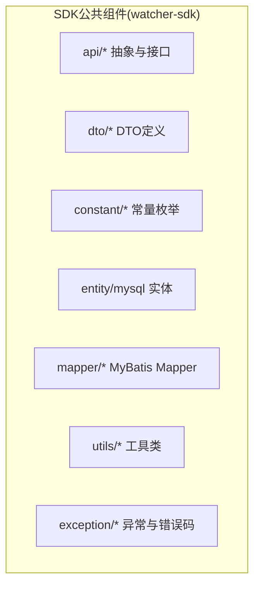
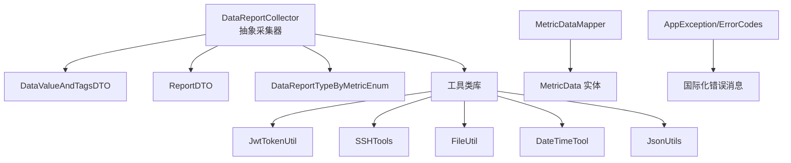
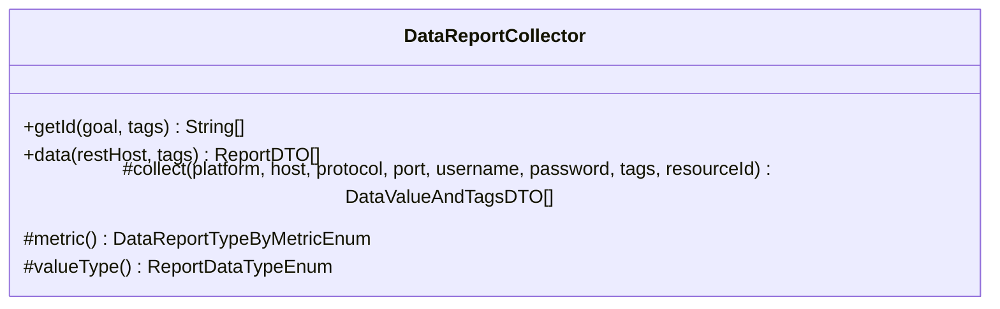
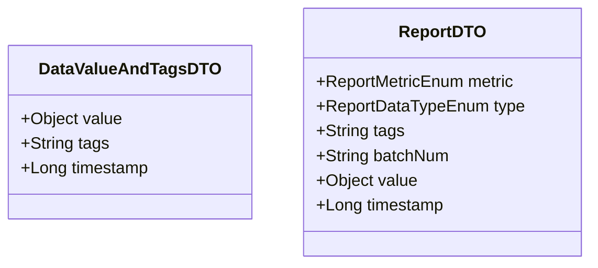
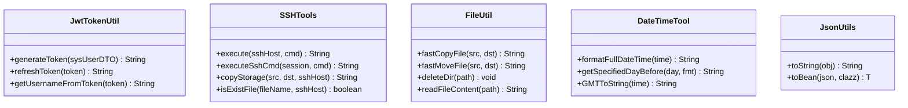
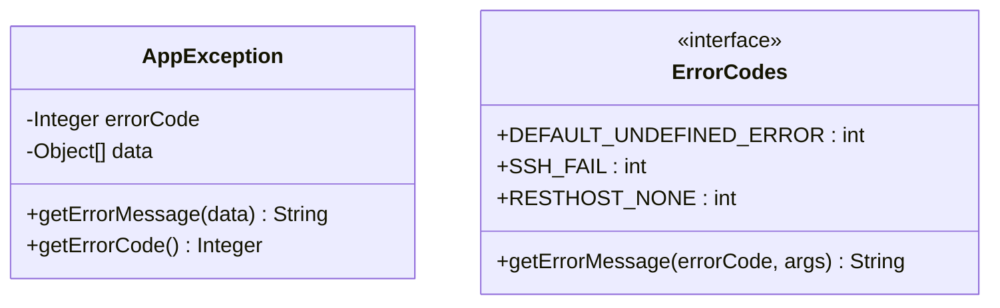
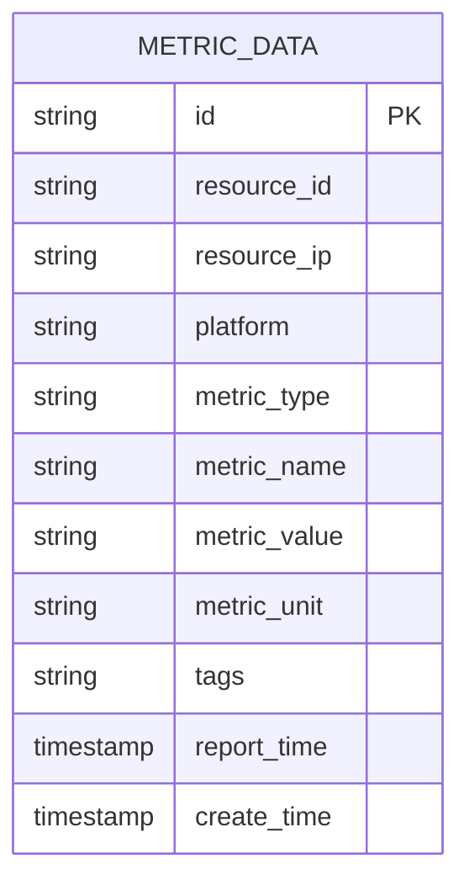
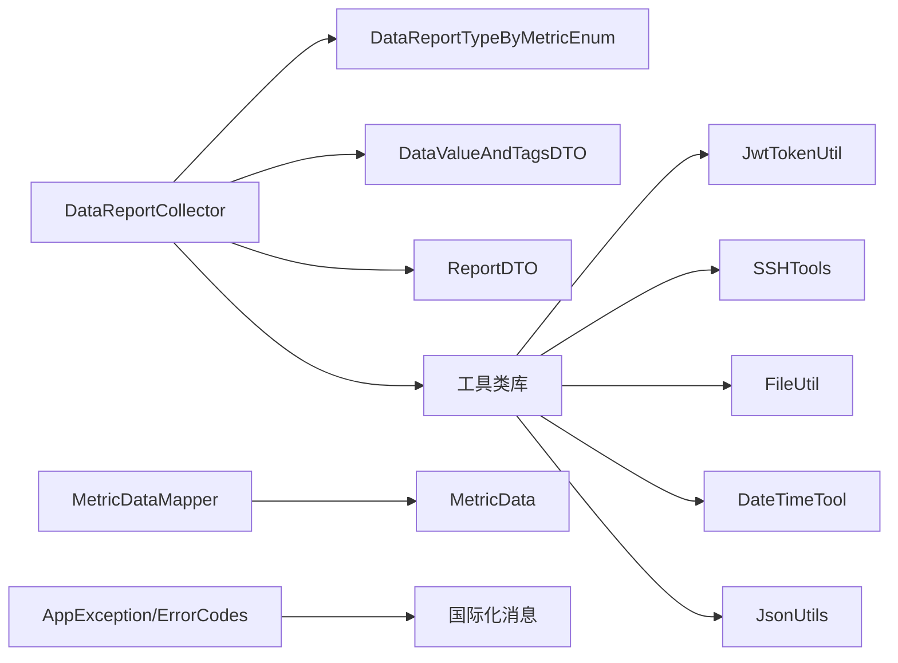

# SDK公共组件

<cite>
**本文引用的文件**
- [DataReportCollector.java](file://watcher-sdk/src/main/java/com/virtual/cloud/om/sdk/api/DataReportCollector.java)
- [JwtTokenUtil.java](file://watcher-sdk/src/main/java/com/virtual/cloud/om/sdk/utils/JwtTokenUtil.java)
- [SSHTools.java](file://watcher-sdk/src/main/java/com/virtual/cloud/om/sdk/utils/SSHTools.java)
- [AppException.java](file://watcher-sdk/src/main/java/com/virtual/cloud/om/sdk/exception/AppException.java)
- [ErrorCodes.java](file://watcher-sdk/src/main/java/com/virtual/cloud/om/sdk/exception/ErrorCodes.java)
- [MetricDataMapper.java](file://watcher-sdk/src/main/java/com/virtual/cloud/om/sdk/mapper/MetricDataMapper.java)
- [DataValueAndTagsDTO.java](file://watcher-sdk/src/main/java/com/virtual/cloud/om/sdk/dto/dataReport/DataValueAndTagsDTO.java)
- [ReportDTO.java](file://watcher-sdk/src/main/java/com/virtual/cloud/om/sdk/dto/dataReport/workspace/ReportDTO.java)
- [DataReportTypeByMetricEnum.java](file://watcher-sdk/src/main/java/com/virtual/cloud/om/sdk/constant/DataReportTypeByMetricEnum.java)
- [DateTimeTool.java](file://watcher-sdk/src/main/java/com/virtual/cloud/om/sdk/utils/DateTimeTool.java)
- [FileUtil.java](file://watcher-sdk/src/main/java/com/virtual/cloud/om/sdk/utils/FileUtil.java)
- [JsonUtils.java](file://watcher-sdk/src/main/java/com/virtual/cloud/om/sdk/utils/JsonUtils.java)
- [MetricData.java](file://watcher-sdk/src/main/java/com/virtual/cloud/om/sdk/entity/mysql/MetricData.java)
</cite>

## 目录
1. [简介](#简介)
2. [项目结构](#项目结构)
3. [核心组件](#核心组件)
4. [架构总览](#架构总览)
5. [详细组件分析](#详细组件分析)
6. [依赖分析](#依赖分析)
7. [性能考虑](#性能考虑)
8. [故障排查指南](#故障排查指南)
9. [结论](#结论)
10. [附录](#附录)

## 简介
本技术文档面向SDK公共组件，围绕以下主题展开：
- DataReportCollector抽象类的设计理念与实现模式，以及如何通过继承该抽象类实现自定义数据采集器
- DTO数据传输对象的设计规范，包括字段定义、数据验证规则与序列化机制
- 工具类库的功能与使用方法，涵盖JWT令牌处理、SSH工具、文件操作、时间处理等
- 异常处理机制，包括自定义异常类、错误码定义与国际化错误消息处理
- MyBatis配置与数据库访问层设计，包括Mapper接口定义、SQL映射与事务管理
- 在新模块中集成SDK组件的方法与扩展、定制建议

## 项目结构
SDK公共组件位于watcher-sdk模块，主要包含API、工具、异常、常量、DTO、实体与Mapper等包，形成清晰的分层与职责划分。

图表来源
- [DataReportCollector.java:1-118](file://watcher-sdk/src/main/java/com/virtual/cloud/om/sdk/api/DataReportCollector.java#L1-L118)
- [MetricDataMapper.java:1-14](file://watcher-sdk/src/main/java/com/virtual/cloud/om/sdk/mapper/MetricDataMapper.java#L1-L14)
- [MetricData.java:1-43](file://watcher-sdk/src/main/java/com/virtual/cloud/om/sdk/entity/mysql/MetricData.java#L1-L43)

章节来源
- [DataReportCollector.java:1-118](file://watcher-sdk/src/main/java/com/virtual/cloud/om/sdk/api/DataReportCollector.java#L1-L118)
- [MetricDataMapper.java:1-14](file://watcher-sdk/src/main/java/com/virtual/cloud/om/sdk/mapper/MetricDataMapper.java#L1-L14)
- [MetricData.java:1-43](file://watcher-sdk/src/main/java/com/virtual/cloud/om/sdk/entity/mysql/MetricData.java#L1-L43)

## 核心组件
- DataReportCollector：抽象采集器基类，封装通用采集流程（鉴权、采集、组装上报DTO），并暴露策略与值类型抽象钩子
- DTO体系：DataValueAndTagsDTO与ReportDTO定义上报数据结构；配套枚举定义指标与类型
- 工具类：JWT令牌、SSH、文件、时间、JSON等常用工具
- 异常体系：AppException与ErrorCodes，支持国际化错误消息
- 数据访问：MetricDataMapper与MetricData实体，映射指标数据表

章节来源
- [DataReportCollector.java:18-118](file://watcher-sdk/src/main/java/com/virtual/cloud/om/sdk/api/DataReportCollector.java#L18-L118)
- [DataValueAndTagsDTO.java:1-17](file://watcher-sdk/src/main/java/com/virtual/cloud/om/sdk/dto/dataReport/DataValueAndTagsDTO.java#L1-L17)
- [ReportDTO.java:1-25](file://watcher-sdk/src/main/java/com/virtual/cloud/om/sdk/dto/dataReport/workspace/ReportDTO.java#L1-L25)
- [DataReportTypeByMetricEnum.java:1-190](file://watcher-sdk/src/main/java/com/virtual/cloud/om/sdk/constant/DataReportTypeByMetricEnum.java#L1-L190)
- [JwtTokenUtil.java:1-88](file://watcher-sdk/src/main/java/com/virtual/cloud/om/sdk/utils/JwtTokenUtil.java#L1-L88)
- [SSHTools.java:1-471](file://watcher-sdk/src/main/java/com/virtual/cloud/om/sdk/utils/SSHTools.java#L1-L471)
- [FileUtil.java:1-392](file://watcher-sdk/src/main/java/com/virtual/cloud/om/sdk/utils/FileUtil.java#L1-L392)
- [DateTimeTool.java:1-182](file://watcher-sdk/src/main/java/com/virtual/cloud/om/sdk/utils/DateTimeTool.java#L1-L182)
- [JsonUtils.java:1-53](file://watcher-sdk/src/main/java/com/virtual/cloud/om/sdk/utils/JsonUtils.java#L1-L53)
- [AppException.java:1-64](file://watcher-sdk/src/main/java/com/virtual/cloud/om/sdk/exception/AppException.java#L1-L64)
- [ErrorCodes.java:1-190](file://watcher-sdk/src/main/java/com/virtual/cloud/om/sdk/exception/ErrorCodes.java#L1-L190)
- [MetricDataMapper.java:1-14](file://watcher-sdk/src/main/java/com/virtual/cloud/om/sdk/mapper/MetricDataMapper.java#L1-L14)
- [MetricData.java:1-43](file://watcher-sdk/src/main/java/com/virtual/cloud/om/sdk/entity/mysql/MetricData.java#L1-L43)

## 架构总览
SDK采用“抽象采集器 + DTO + 工具 + 异常 + 数据访问”的分层架构，上层业务通过继承DataReportCollector实现具体采集逻辑，底层通过工具类完成认证与系统交互，异常体系保障错误可追踪与可国际化，数据访问层支撑指标数据持久化。

图表来源
- [DataReportCollector.java:18-118](file://watcher-sdk/src/main/java/com/virtual/cloud/om/sdk/api/DataReportCollector.java#L18-L118)
- [DataValueAndTagsDTO.java:1-17](file://watcher-sdk/src/main/java/com/virtual/cloud/om/sdk/dto/dataReport/DataValueAndTagsDTO.java#L1-L17)
- [ReportDTO.java:1-25](file://watcher-sdk/src/main/java/com/virtual/cloud/om/sdk/dto/dataReport/workspace/ReportDTO.java#L1-L25)
- [DataReportTypeByMetricEnum.java:1-190](file://watcher-sdk/src/main/java/com/virtual/cloud/om/sdk/constant/DataReportTypeByMetricEnum.java#L1-L190)
- [JwtTokenUtil.java:1-88](file://watcher-sdk/src/main/java/com/virtual/cloud/om/sdk/utils/JwtTokenUtil.java#L1-L88)
- [SSHTools.java:1-471](file://watcher-sdk/src/main/java/com/virtual/cloud/om/sdk/utils/SSHTools.java#L1-L471)
- [FileUtil.java:1-392](file://watcher-sdk/src/main/java/com/virtual/cloud/om/sdk/utils/FileUtil.java#L1-L392)
- [DateTimeTool.java:1-182](file://watcher-sdk/src/main/java/com/virtual/cloud/om/sdk/utils/DateTimeTool.java#L1-L182)
- [JsonUtils.java:1-53](file://watcher-sdk/src/main/java/com/virtual/cloud/om/sdk/utils/JsonUtils.java#L1-L53)
- [MetricDataMapper.java:1-14](file://watcher-sdk/src/main/java/com/virtual/cloud/om/sdk/mapper/MetricDataMapper.java#L1-L14)
- [MetricData.java:1-43](file://watcher-sdk/src/main/java/com/virtual/cloud/om/sdk/entity/mysql/MetricData.java#L1-L43)
- [AppException.java:1-64](file://watcher-sdk/src/main/java/com/virtual/cloud/om/sdk/exception/AppException.java#L1-L64)
- [ErrorCodes.java:1-190](file://watcher-sdk/src/main/java/com/virtual/cloud/om/sdk/exception/ErrorCodes.java#L1-L190)

## 详细组件分析

### DataReportCollector 抽象类
设计理念
- 统一封装采集生命周期：鉴权参数解析、采集执行、结果组装、时间戳补全
- 通过抽象方法解耦具体采集实现，策略与值类型通过枚举与抽象方法约束
- 返回标准化的ReportDTO列表，便于上层统一上报

实现要点
- data方法负责整体流程编排，包含日志记录、采集执行、空值兜底与时间戳填充
- collect为抽象方法，由子类实现具体采集逻辑
- metric与valueType为抽象方法，分别定义策略与值类型

图表来源
- [DataReportCollector.java:18-118](file://watcher-sdk/src/main/java/com/virtual/cloud/om/sdk/api/DataReportCollector.java#L18-L118)

章节来源
- [DataReportCollector.java:18-118](file://watcher-sdk/src/main/java/com/virtual/cloud/om/sdk/api/DataReportCollector.java#L18-L118)

### DTO 设计规范
字段定义与职责
- DataValueAndTagsDTO：承载单条指标值与标签、时间戳
- ReportDTO：承载指标类型、值类型、标签、批次号、值与时间戳

序列化与验证
- 使用注解标注字段含义与必填性，便于生成接口文档与前端校验
- 值类型由valueType()与枚举共同约束，确保上报结构一致

图表来源
- [DataValueAndTagsDTO.java:1-17](file://watcher-sdk/src/main/java/com/virtual/cloud/om/sdk/dto/dataReport/DataValueAndTagsDTO.java#L1-L17)
- [ReportDTO.java:1-25](file://watcher-sdk/src/main/java/com/virtual/cloud/om/sdk/dto/dataReport/workspace/ReportDTO.java#L1-L25)

章节来源
- [DataValueAndTagsDTO.java:1-17](file://watcher-sdk/src/main/java/com/virtual/cloud/om/sdk/dto/dataReport/DataValueAndTagsDTO.java#L1-L17)
- [ReportDTO.java:1-25](file://watcher-sdk/src/main/java/com/virtual/cloud/om/sdk/dto/dataReport/workspace/ReportDTO.java#L1-L25)

### 工具类库
- JWT令牌处理：JwtTokenUtil提供签发、刷新、解析与用户名提取能力
- SSH工具：SSHTools封装会话建立、命令执行、文件传输、超时控制与错误处理
- 文件操作：FileUtil提供跨平台文件复制/移动/删除、目录清理、文件内容读取等
- 时间处理：DateTimeTool提供多种时间格式化、日期计算与UTC转换
- JSON工具：JsonUtils提供对象与JSON字符串互转

图表来源
- [JwtTokenUtil.java:1-88](file://watcher-sdk/src/main/java/com/virtual/cloud/om/sdk/utils/JwtTokenUtil.java#L1-L88)
- [SSHTools.java:1-471](file://watcher-sdk/src/main/java/com/virtual/cloud/om/sdk/utils/SSHTools.java#L1-L471)
- [FileUtil.java:1-392](file://watcher-sdk/src/main/java/com/virtual/cloud/om/sdk/utils/FileUtil.java#L1-L392)
- [DateTimeTool.java:1-182](file://watcher-sdk/src/main/java/com/virtual/cloud/om/sdk/utils/DateTimeTool.java#L1-L182)
- [JsonUtils.java:1-53](file://watcher-sdk/src/main/java/com/virtual/cloud/om/sdk/utils/JsonUtils.java#L1-L53)

章节来源
- [JwtTokenUtil.java:1-88](file://watcher-sdk/src/main/java/com/virtual/cloud/om/sdk/utils/JwtTokenUtil.java#L1-L88)
- [SSHTools.java:1-471](file://watcher-sdk/src/main/java/com/virtual/cloud/om/sdk/utils/SSHTools.java#L1-L471)
- [FileUtil.java:1-392](file://watcher-sdk/src/main/java/com/virtual/cloud/om/sdk/utils/FileUtil.java#L1-L392)
- [DateTimeTool.java:1-182](file://watcher-sdk/src/main/java/com/virtual/cloud/om/sdk/utils/DateTimeTool.java#L1-L182)
- [JsonUtils.java:1-53](file://watcher-sdk/src/main/java/com/virtual/cloud/om/sdk/utils/JsonUtils.java#L1-L53)

### 异常处理机制
- AppException：运行时异常，携带错误码与可选参数，支持国际化消息获取
- ErrorCodes：集中定义错误码与消息模板，配合国际化资源bundle加载
- 异常控制器：通过全局异常控制器将异常转换为统一响应格式

图表来源
- [AppException.java:1-64](file://watcher-sdk/src/main/java/com/virtual/cloud/om/sdk/exception/AppException.java#L1-L64)
- [ErrorCodes.java:1-190](file://watcher-sdk/src/main/java/com/virtual/cloud/om/sdk/exception/ErrorCodes.java#L1-L190)

章节来源
- [AppException.java:1-64](file://watcher-sdk/src/main/java/com/virtual/cloud/om/sdk/exception/AppException.java#L1-L64)
- [ErrorCodes.java:1-190](file://watcher-sdk/src/main/java/com/virtual/cloud/om/sdk/exception/ErrorCodes.java#L1-L190)

### MyBatis配置与数据库访问层
- Mapper接口：MetricDataMapper继承BaseMapper，提供基础CRUD能力
- 实体映射：MetricData实体映射metric_data表，包含指标ID、资源ID/IP、平台、指标类型/名称/单位、标签、上报时间与创建时间
- 配置要点：结合Spring Boot与MyBatis-Plus，自动扫描Mapper与实体，简化SQL映射

图表来源
- [MetricData.java:1-43](file://watcher-sdk/src/main/java/com/virtual/cloud/om/sdk/entity/mysql/MetricData.java#L1-L43)

章节来源
- [MetricDataMapper.java:1-14](file://watcher-sdk/src/main/java/com/virtual/cloud/om/sdk/mapper/MetricDataMapper.java#L1-L14)
- [MetricData.java:1-43](file://watcher-sdk/src/main/java/com/virtual/cloud/om/sdk/entity/mysql/MetricData.java#L1-L43)

## 依赖分析
- 抽象采集器依赖枚举与DTO，向上提供统一上报结构
- 工具类被采集器与服务层广泛复用，降低重复实现
- 异常体系贯穿各层，保证错误传播一致性
- 数据访问层与实体解耦，便于扩展与迁移

图表来源
- [DataReportCollector.java:18-118](file://watcher-sdk/src/main/java/com/virtual/cloud/om/sdk/api/DataReportCollector.java#L18-L118)
- [DataReportTypeByMetricEnum.java:1-190](file://watcher-sdk/src/main/java/com/virtual/cloud/om/sdk/constant/DataReportTypeByMetricEnum.java#L1-L190)
- [DataValueAndTagsDTO.java:1-17](file://watcher-sdk/src/main/java/com/virtual/cloud/om/sdk/dto/dataReport/DataValueAndTagsDTO.java#L1-L17)
- [ReportDTO.java:1-25](file://watcher-sdk/src/main/java/com/virtual/cloud/om/sdk/dto/dataReport/workspace/ReportDTO.java#L1-L25)
- [JwtTokenUtil.java:1-88](file://watcher-sdk/src/main/java/com/virtual/cloud/om/sdk/utils/JwtTokenUtil.java#L1-L88)
- [SSHTools.java:1-471](file://watcher-sdk/src/main/java/com/virtual/cloud/om/sdk/utils/SSHTools.java#L1-L471)
- [FileUtil.java:1-392](file://watcher-sdk/src/main/java/com/virtual/cloud/om/sdk/utils/FileUtil.java#L1-L392)
- [DateTimeTool.java:1-182](file://watcher-sdk/src/main/java/com/virtual/cloud/om/sdk/utils/DateTimeTool.java#L1-L182)
- [JsonUtils.java:1-53](file://watcher-sdk/src/main/java/com/virtual/cloud/om/sdk/utils/JsonUtils.java#L1-L53)
- [MetricDataMapper.java:1-14](file://watcher-sdk/src/main/java/com/virtual/cloud/om/sdk/mapper/MetricDataMapper.java#L1-L14)
- [MetricData.java:1-43](file://watcher-sdk/src/main/java/com/virtual/cloud/om/sdk/entity/mysql/MetricData.java#L1-L43)
- [AppException.java:1-64](file://watcher-sdk/src/main/java/com/virtual/cloud/om/sdk/exception/AppException.java#L1-L64)
- [ErrorCodes.java:1-190](file://watcher-sdk/src/main/java/com/virtual/cloud/om/sdk/exception/ErrorCodes.java#L1-L190)

## 性能考虑
- 采集器日志与耗时统计：data方法记录开始/结束时间，便于定位慢采集点
- SSH命令执行与缓冲：SSHTools采用分块读取与超时控制，避免阻塞与内存溢出
- 文件操作：跨平台命令执行与路径处理，减少不必要的IO往返
- JSON序列化：Jackson ObjectMapper复用，避免频繁初始化带来的开销

章节来源
- [DataReportCollector.java:48-86](file://watcher-sdk/src/main/java/com/virtual/cloud/om/sdk/api/DataReportCollector.java#L48-L86)
- [SSHTools.java:207-264](file://watcher-sdk/src/main/java/com/virtual/cloud/om/sdk/utils/SSHTools.java#L207-L264)
- [FileUtil.java:40-73](file://watcher-sdk/src/main/java/com/virtual/cloud/om/sdk/utils/FileUtil.java#L40-L73)
- [JsonUtils.java:10-53](file://watcher-sdk/src/main/java/com/virtual/cloud/om/sdk/utils/JsonUtils.java#L10-L53)

## 故障排查指南
常见问题与定位步骤
- SSH执行失败：检查主机信息合法性、密码/免密配置、通道状态码与错误输出流
- 文件操作异常：确认源文件存在、目标目录存在且可写、跨平台命令可用
- JWT解析失败：核对签名密钥、过期时间与Subject结构
- 数据库访问异常：检查Mapper接口与实体映射、连接配置与事务边界
- 异常消息国际化：确认错误码存在、国际化资源bundle加载成功

章节来源
- [SSHTools.java:372-471](file://watcher-sdk/src/main/java/com/virtual/cloud/om/sdk/utils/SSHTools.java#L372-L471)
- [FileUtil.java:40-73](file://watcher-sdk/src/main/java/com/virtual/cloud/om/sdk/utils/FileUtil.java#L40-L73)
- [JwtTokenUtil.java:20-88](file://watcher-sdk/src/main/java/com/virtual/cloud/om/sdk/utils/JwtTokenUtil.java#L20-L88)
- [AppException.java:12-64](file://watcher-sdk/src/main/java/com/virtual/cloud/om/sdk/exception/AppException.java#L12-L64)
- [ErrorCodes.java:10-190](file://watcher-sdk/src/main/java/com/virtual/cloud/om/sdk/exception/ErrorCodes.java#L10-L190)

## 结论
SDK公共组件通过抽象采集器、标准化DTO、完备工具库、统一异常与数据访问层，构建了高内聚、低耦合的采集与上报基础设施。开发者可通过继承DataReportCollector快速扩展采集能力，借助工具类完成复杂系统交互，利用异常与国际化机制提升可观测性与可维护性。

## 附录

### 在新模块中集成SDK组件的步骤
- 引入依赖：在新模块的构建脚本中引入watcher-sdk模块或打包产物
- 配置环境：确保MyBatis-Plus与相关依赖已配置，数据库连接正常
- 编写采集器：继承DataReportCollector，实现collect方法与策略/值类型抽象方法
- 使用工具类：在采集器中调用SSHTools、FileUtil、DateTimeTool等工具完成系统交互与数据处理
- 处理异常：捕获并包装业务异常，使用ErrorCodes与国际化消息提升用户体验
- 上报数据：将采集结果封装为ReportDTO列表，交由上层统一上报

章节来源
- [DataReportCollector.java:18-118](file://watcher-sdk/src/main/java/com/virtual/cloud/om/sdk/api/DataReportCollector.java#L18-L118)
- [SSHTools.java:1-471](file://watcher-sdk/src/main/java/com/virtual/cloud/om/sdk/utils/SSHTools.java#L1-L471)
- [FileUtil.java:1-392](file://watcher-sdk/src/main/java/com/virtual/cloud/om/sdk/utils/FileUtil.java#L1-L392)
- [DateTimeTool.java:1-182](file://watcher-sdk/src/main/java/com/virtual/cloud/om/sdk/utils/DateTimeTool.java#L1-L182)
- [ErrorCodes.java:1-190](file://watcher-sdk/src/main/java/com/virtual/cloud/om/sdk/exception/ErrorCodes.java#L1-L190)