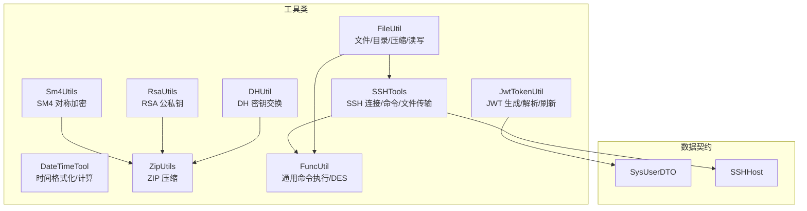
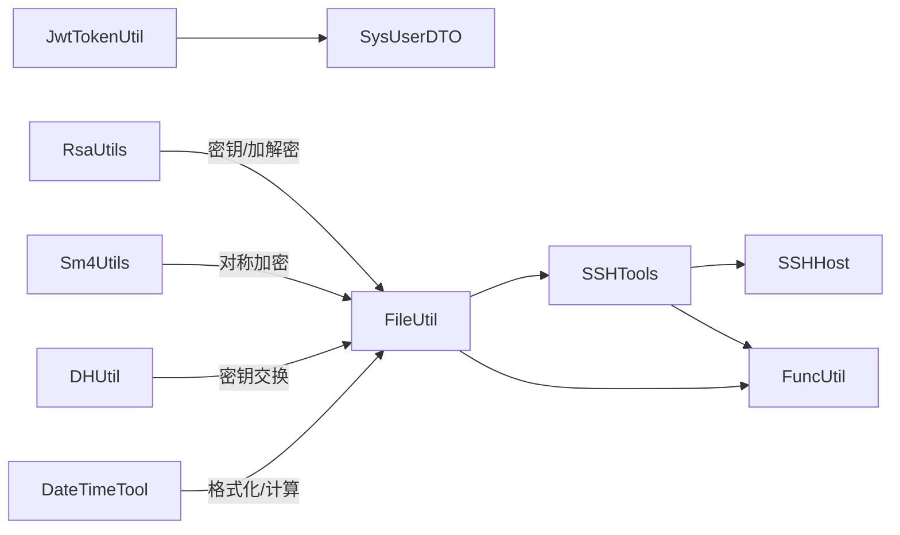
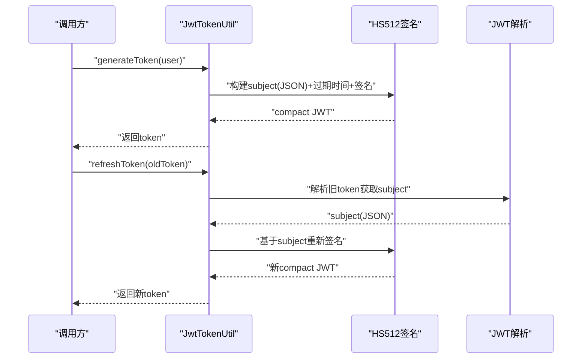
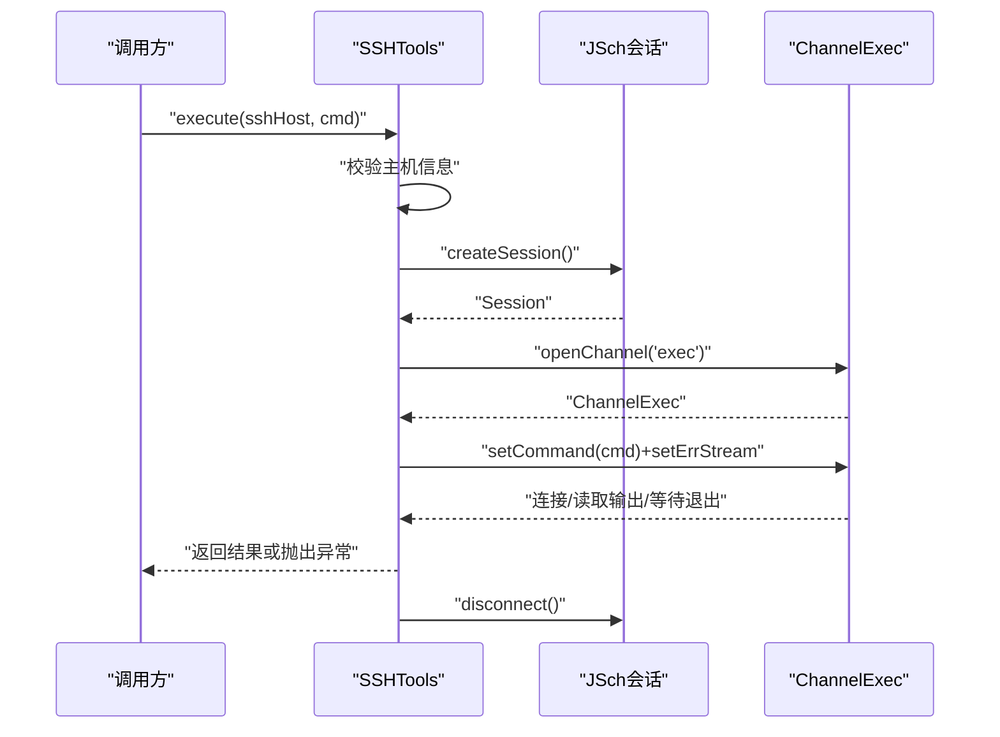
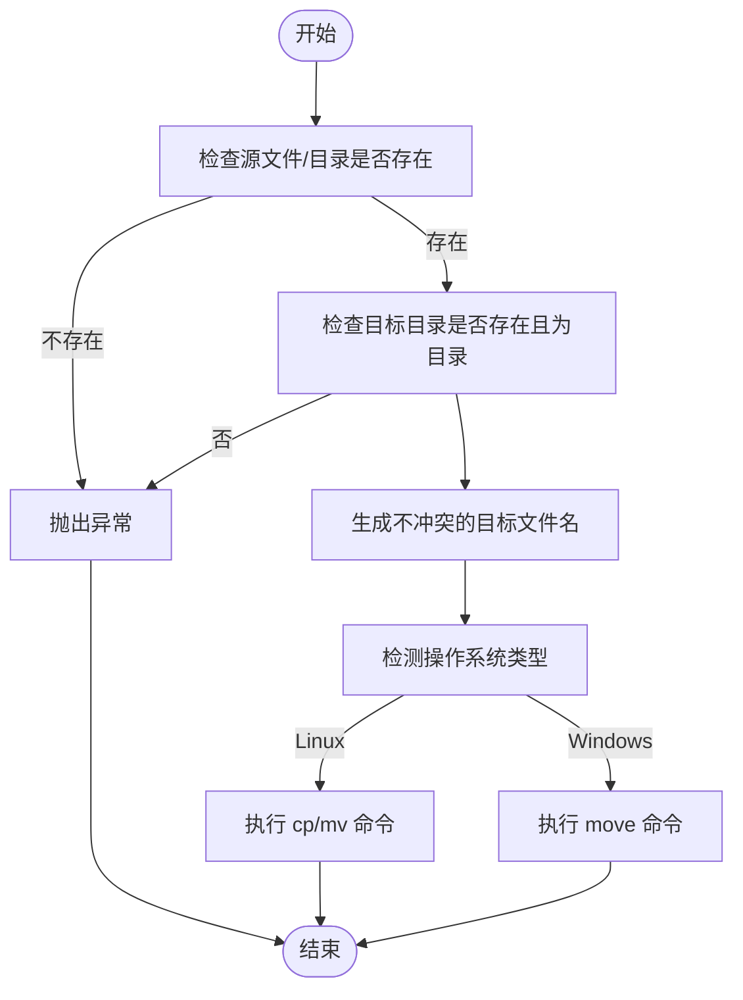
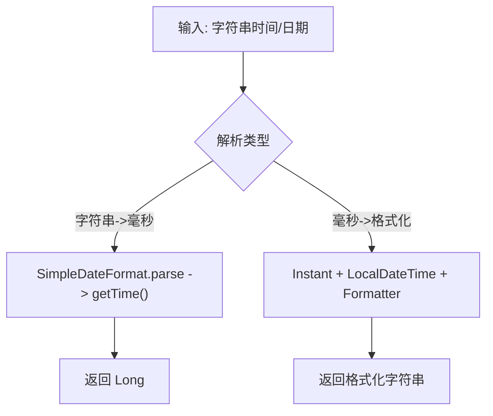
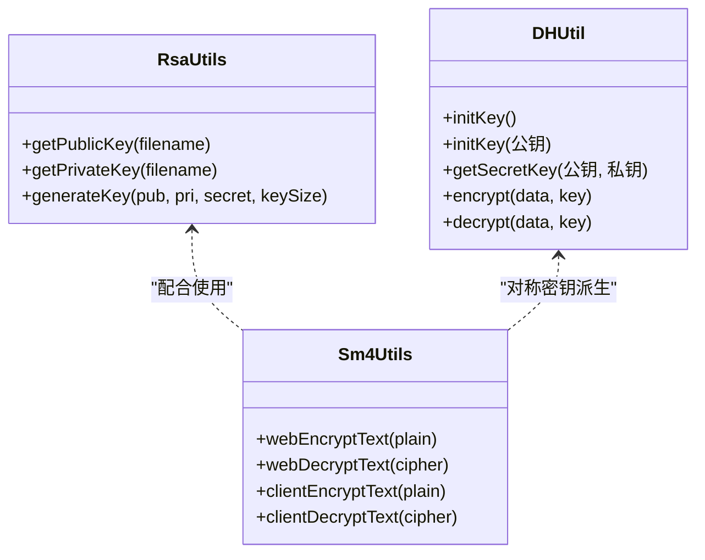
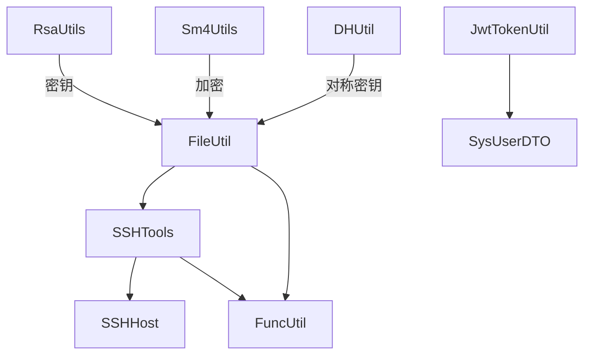

# 工具类库

<cite>
**本文引用的文件**
- [JwtTokenUtil.java](file://watcher-sdk/src/main/java/com/virtual/cloud/om/sdk/utils/JwtTokenUtil.java)
- [SSHTools.java](file://watcher-sdk/src/main/java/com/virtual/cloud/om/sdk/utils/SSHTools.java)
- [FileUtil.java](file://watcher-sdk/src/main/java/com/virtual/cloud/om/sdk/utils/FileUtil.java)
- [DateTimeTool.java](file://watcher-sdk/src/main/java/com/virtual/cloud/om/sdk/utils/DateTimeTool.java)
- [RsaUtils.java](file://watcher-sdk/src/main/java/com/virtual/cloud/om/sdk/utils/RsaUtils.java)
- [Sm4Utils.java](file://watcher-sdk/src/main/java/com/virtual/cloud/om/sdk/utils/sm4/Sm4Utils.java)
- [FuncUtil.java](file://watcher-sdk/src/main/java/com/virtual/cloud/om/sdk/utils/FuncUtil.java)
- [SysUserDTO.java](file://watcher-sdk/src/main/java/com/virtual/cloud/om/sdk/dto/SysUserDTO.java)
- [SSHHost.java](file://watcher-sdk/src/main/java/com/virtual/cloud/om/sdk/dto/SSHHost.java)
- [ZipUtils.java](file://watcher-sdk/src/main/java/com/virtual/cloud/om/sdk/utils/ZipUtils.java)
- [DHUtil.java](file://watcher-sdk/src/main/java/com/virtual/cloud/om/sdk/utils/DHUtil.java)
</cite>

## 目录
1. [简介](#简介)
2. [项目结构](#项目结构)
3. [核心组件](#核心组件)
4. [架构总览](#架构总览)
5. [详细组件分析](#详细组件分析)
6. [依赖分析](#依赖分析)
7. [性能考虑](#性能考虑)
8. [故障排查指南](#故障排查指南)
9. [结论](#结论)
10. [附录](#附录)

## 简介
本指南面向使用者与维护者，系统性讲解工具类库中以下模块的使用方法与最佳实践：
- JWT 令牌处理：JwtTokenUtil 的生成、刷新、解析与校验流程
- SSH 工具：SSHTools 的连接建立、命令执行、文件传输与安全注意事项
- 文件操作：FileUtil 的读写、复制/移动、压缩/解压、目录清理与时间比较
- 时间处理：DateTimeTool 的格式化、日期计算与 UTC/本地互转
- 加密工具：RSA 公私钥加解密（RsaUtils）与 SM4 对称加密（Sm4Utils），以及 DH 密钥交换（DHUtil）

文档提供分层次的说明、流程图与时序图、常见问题排查与性能优化建议，帮助读者快速上手并稳定落地。

## 项目结构
工具类集中于 SDK 模块的 utils 包内，围绕“通用工具”“加密工具”“SSH 工具”“文件工具”“时间工具”等维度组织。部分工具通过 DTO（如 SysUserDTO、SSHHost）承载跨模块的数据契约。

图表来源
- [JwtTokenUtil.java:1-88](file://watcher-sdk/src/main/java/com/virtual/cloud/om/sdk/utils/JwtTokenUtil.java#L1-L88)
- [SSHTools.java:1-471](file://watcher-sdk/src/main/java/com/virtual/cloud/om/sdk/utils/SSHTools.java#L1-L471)
- [FileUtil.java:1-392](file://watcher-sdk/src/main/java/com/virtual/cloud/om/sdk/utils/FileUtil.java#L1-L392)
- [DateTimeTool.java:1-182](file://watcher-sdk/src/main/java/com/virtual/cloud/om/sdk/utils/DateTimeTool.java#L1-L182)
- [RsaUtils.java:1-102](file://watcher-sdk/src/main/java/com/virtual/cloud/om/sdk/utils/RsaUtils.java#L1-L102)
- [Sm4Utils.java:1-55](file://watcher-sdk/src/main/java/com/virtual/cloud/om/sdk/utils/sm4/Sm4Utils.java#L1-L55)
- [FuncUtil.java:1-859](file://watcher-sdk/src/main/java/com/virtual/cloud/om/sdk/utils/FuncUtil.java#L1-L859)
- [SysUserDTO.java:1-27](file://watcher-sdk/src/main/java/com/virtual/cloud/om/sdk/dto/SysUserDTO.java#L1-L27)
- [SSHHost.java:1-163](file://watcher-sdk/src/main/java/com/virtual/cloud/om/sdk/dto/SSHHost.java#L1-L163)
- [ZipUtils.java:1-90](file://watcher-sdk/src/main/java/com/virtual/cloud/om/sdk/utils/ZipUtils.java#L1-L90)
- [DHUtil.java:1-311](file://watcher-sdk/src/main/java/com/virtual/cloud/om/sdk/utils/DHUtil.java#L1-L311)

章节来源
- [JwtTokenUtil.java:1-88](file://watcher-sdk/src/main/java/com/virtual/cloud/om/sdk/utils/JwtTokenUtil.java#L1-L88)
- [SSHTools.java:1-471](file://watcher-sdk/src/main/java/com/virtual/cloud/om/sdk/utils/SSHTools.java#L1-L471)
- [FileUtil.java:1-392](file://watcher-sdk/src/main/java/com/virtual/cloud/om/sdk/utils/FileUtil.java#L1-L392)
- [DateTimeTool.java:1-182](file://watcher-sdk/src/main/java/com/virtual/cloud/om/sdk/utils/DateTimeTool.java#L1-L182)
- [RsaUtils.java:1-102](file://watcher-sdk/src/main/java/com/virtual/cloud/om/sdk/utils/RsaUtils.java#L1-L102)
- [Sm4Utils.java:1-55](file://watcher-sdk/src/main/java/com/virtual/cloud/om/sdk/utils/sm4/Sm4Utils.java#L1-L55)
- [FuncUtil.java:1-859](file://watcher-sdk/src/main/java/com/virtual/cloud/om/sdk/utils/FuncUtil.java#L1-L859)
- [SysUserDTO.java:1-27](file://watcher-sdk/src/main/java/com/virtual/cloud/om/sdk/dto/SysUserDTO.java#L1-L27)
- [SSHHost.java:1-163](file://watcher-sdk/src/main/java/com/virtual/cloud/om/sdk/dto/SSHHost.java#L1-L163)
- [ZipUtils.java:1-90](file://watcher-sdk/src/main/java/com/virtual/cloud/om/sdk/utils/ZipUtils.java#L1-L90)
- [DHUtil.java:1-311](file://watcher-sdk/src/main/java/com/virtual/cloud/om/sdk/utils/DHUtil.java#L1-L311)

## 核心组件
- JWT 令牌工具：基于 HS512 算法，使用固定密钥生成与解析；提供过期时间、刷新与用户名提取能力
- SSH 工具：封装 JSch 会话、ChannelExec 执行、命令超时控制、SCP 文件传输与免密连接
- 文件工具：跨平台复制/移动/删除、目录清理、压缩打包、文件内容读取与时间比较
- 时间工具：多种格式化器、UTC 与本地互转、字符串与毫秒互转、指定日期前后 N 天计算
- 加密工具：RSA 公私钥加载与生成、SM4 对称加密（Web/客户端两套密钥）、DH 密钥交换

章节来源
- [JwtTokenUtil.java:17-86](file://watcher-sdk/src/main/java/com/virtual/cloud/om/sdk/utils/JwtTokenUtil.java#L17-L86)
- [SSHTools.java:169-468](file://watcher-sdk/src/main/java/com/virtual/cloud/om/sdk/utils/SSHTools.java#L169-L468)
- [FileUtil.java:40-390](file://watcher-sdk/src/main/java/com/virtual/cloud/om/sdk/utils/FileUtil.java#L40-L390)
- [DateTimeTool.java:17-175](file://watcher-sdk/src/main/java/com/virtual/cloud/om/sdk/utils/DateTimeTool.java#L17-L175)
- [RsaUtils.java:20-85](file://watcher-sdk/src/main/java/com/virtual/cloud/om/sdk/utils/RsaUtils.java#L20-L85)
- [Sm4Utils.java:20-49](file://watcher-sdk/src/main/java/com/virtual/cloud/om/sdk/utils/sm4/Sm4Utils.java#L20-L49)
- [DHUtil.java:50-216](file://watcher-sdk/src/main/java/com/virtual/cloud/om/sdk/utils/DHUtil.java#L50-L216)

## 架构总览
工具类之间耦合度低，主要通过 DTO 与通用命令执行（FuncUtil）间接协作。JWT 与 SSH 工具分别面向认证与远程运维场景；文件与时间工具提供基础能力；加密工具覆盖对称与非对称两种模式。

图表来源
- [JwtTokenUtil.java:1-88](file://watcher-sdk/src/main/java/com/virtual/cloud/om/sdk/utils/JwtTokenUtil.java#L1-L88)
- [SSHTools.java:1-471](file://watcher-sdk/src/main/java/com/virtual/cloud/om/sdk/utils/SSHTools.java#L1-L471)
- [FileUtil.java:1-392](file://watcher-sdk/src/main/java/com/virtual/cloud/om/sdk/utils/FileUtil.java#L1-L392)
- [DateTimeTool.java:1-182](file://watcher-sdk/src/main/java/com/virtual/cloud/om/sdk/utils/DateTimeTool.java#L1-L182)
- [RsaUtils.java:1-102](file://watcher-sdk/src/main/java/com/virtual/cloud/om/sdk/utils/RsaUtils.java#L1-L102)
- [Sm4Utils.java:1-55](file://watcher-sdk/src/main/java/com/virtual/cloud/om/sdk/utils/sm4/Sm4Utils.java#L1-L55)
- [FuncUtil.java:1-859](file://watcher-sdk/src/main/java/com/virtual/cloud/om/sdk/utils/FuncUtil.java#L1-L859)
- [SysUserDTO.java:1-27](file://watcher-sdk/src/main/java/com/virtual/cloud/om/sdk/dto/SysUserDTO.java#L1-L27)
- [SSHHost.java:1-163](file://watcher-sdk/src/main/java/com/virtual/cloud/om/sdk/dto/SSHHost.java#L1-L163)

## 详细组件分析

### JWT 令牌处理工具 JwtTokenUtil
- 生成令牌：将 SysUserDTO 序列化为 JSON 作为主题，设置过期时间（默认 2 小时），使用 HS512 签名
- 解析与校验：解析 Claims 并允许一定时钟偏差；提取用户名时反序列化为 SysUserDTO
- 刷新令牌：从旧令牌解析主体，重新生成新令牌
- 异常处理：解析失败返回空或抛出异常，调用方需捕获并降级

图表来源
- [JwtTokenUtil.java:49-69](file://watcher-sdk/src/main/java/com/virtual/cloud/om/sdk/utils/JwtTokenUtil.java#L49-L69)
- [SysUserDTO.java:17-27](file://watcher-sdk/src/main/java/com/virtual/cloud/om/sdk/dto/SysUserDTO.java#L17-L27)

章节来源
- [JwtTokenUtil.java:17-86](file://watcher-sdk/src/main/java/com/virtual/cloud/om/sdk/utils/JwtTokenUtil.java#L17-L86)
- [SysUserDTO.java:17-27](file://watcher-sdk/src/main/java/com/virtual/cloud/om/sdk/dto/SysUserDTO.java#L17-L27)

最佳实践
- 密钥管理：生产环境应从配置中心读取密钥，避免硬编码
- 过期策略：结合业务设置合理的过期时间与刷新阈值
- 异常处理：解析失败时记录上下文并返回安全的空值或抛出自定义异常

---

### SSH 工具 SSHTools
- 连接建立：支持口令与免密两种会话创建；提供长超时会话；严格校验主机信息
- 命令执行：ChannelExec 执行命令，聚合输出与错误流；支持超时控制；退出码非 0 抛出异常
- 文件传输：封装 sshpass + scp 的复制/下载/上传；自动处理路径空格转义与权限修正
- 安全与健壮性：关闭连接、异常捕获、错误码与错误流透传

图表来源
- [SSHTools.java:169-264](file://watcher-sdk/src/main/java/com/virtual/cloud/om/sdk/utils/SSHTools.java#L169-L264)
- [SSHTools.java:372-389](file://watcher-sdk/src/main/java/com/virtual/cloud/om/sdk/utils/SSHTools.java#L372-L389)
- [SSHTools.java:280-342](file://watcher-sdk/src/main/java/com/virtual/cloud/om/sdk/utils/SSHTools.java#L280-L342)

章节来源
- [SSHTools.java:169-468](file://watcher-sdk/src/main/java/com/virtual/cloud/om/sdk/utils/SSHTools.java#L169-L468)
- [SSHHost.java:78-83](file://watcher-sdk/src/main/java/com/virtual/cloud/om/sdk/dto/SSHHost.java#L78-L83)

最佳实践
- 超时控制：根据命令复杂度设置合理超时，避免阻塞
- 错误处理：区分退出码与错误流，记录详细日志便于定位
- 安全加固：避免在命令中直接拼接敏感信息；优先使用免密连接

---

### 文件操作工具 FileUtil
- 复制/移动：跨平台 cp/mv 命令封装；自动生成不冲突的目标文件名
- 删除：目录与文件删除；清空目录内容
- 压缩：基于 tar 的目录打包；ZipUtils 提供 ZIP 压缩
- 读取：按行读取文件内容；时间比较：文件新旧判断
- 依赖：大量调用 FuncUtil 执行系统命令

图表来源
- [FileUtil.java:40-73](file://watcher-sdk/src/main/java/com/virtual/cloud/om/sdk/utils/FileUtil.java#L40-L73)
- [FileUtil.java:96-128](file://watcher-sdk/src/main/java/com/virtual/cloud/om/sdk/utils/FileUtil.java#L96-L128)

章节来源
- [FileUtil.java:40-390](file://watcher-sdk/src/main/java/com/virtual/cloud/om/sdk/utils/FileUtil.java#L40-L390)
- [ZipUtils.java:25-37](file://watcher-sdk/src/main/java/com/virtual/cloud/om/sdk/utils/ZipUtils.java#L25-L37)

最佳实践
- 路径转义：涉及外部命令时注意空格与特殊字符转义
- 权限与磁盘：确保目标路径权限与磁盘空间充足
- 压缩策略：大文件建议使用 tar；ZIP 更适合跨平台共享

---

### 时间处理工具 DateTimeTool
- 格式化：提供多种格式化器（完整、数字、年月等）；支持 UTC+08:00
- 计算：指定日期前/后 N 天；字符串与毫秒互转；GMT 字符串转 Date
- 视图：默认视图格式与 UTC 格式常量

图表来源
- [DateTimeTool.java:43-67](file://watcher-sdk/src/main/java/com/virtual/cloud/om/sdk/utils/DateTimeTool.java#L43-L67)
- [DateTimeTool.java:171-174](file://watcher-sdk/src/main/java/com/virtual/cloud/om/sdk/utils/DateTimeTool.java#L171-L174)

章节来源
- [DateTimeTool.java:17-175](file://watcher-sdk/src/main/java/com/virtual/cloud/om/sdk/utils/DateTimeTool.java#L17-L175)

最佳实践
- 时区：统一使用 UTC+08:00 或明确转换逻辑
- 解析异常：捕获 ParseException 并记录原始输入

---

### 加密工具类
- RSA 公私钥：支持从文件读取与生成；提供公钥/私钥对象获取
- SM4 对称加密：提供 Web 与客户端两套密钥实例；CBC 模式偏移量固定
- DH 密钥交换：生成双方密钥对，基于对方公钥与己方私钥生成本地对称密钥

图表来源
- [RsaUtils.java:20-85](file://watcher-sdk/src/main/java/com/virtual/cloud/om/sdk/utils/RsaUtils.java#L20-L85)
- [Sm4Utils.java:20-49](file://watcher-sdk/src/main/java/com/virtual/cloud/om/sdk/utils/sm4/Sm4Utils.java#L20-L49)
- [DHUtil.java:50-216](file://watcher-sdk/src/main/java/com/virtual/cloud/om/sdk/utils/DHUtil.java#L50-L216)

章节来源
- [RsaUtils.java:20-102](file://watcher-sdk/src/main/java/com/virtual/cloud/om/sdk/utils/RsaUtils.java#L20-L102)
- [Sm4Utils.java:20-55](file://watcher-sdk/src/main/java/com/virtual/cloud/om/sdk/utils/sm4/Sm4Utils.java#L20-L55)
- [DHUtil.java:50-216](file://watcher-sdk/src/main/java/com/virtual/cloud/om/sdk/utils/DHUtil.java#L50-L216)

最佳实践
- RSA：密钥文件路径与权限管理；生成密钥时指定足够长度
- SM4：密钥与偏移量需与前端/客户端约定一致；CBC 模式务必保持偏移量一致
- DH：遵循注释要求设置 VM 参数以启用 KDF；对称密钥用于后续数据加解密

## 依赖分析
- 内部依赖：FileUtil 与 SSHTools 依赖 FuncUtil 执行系统命令；SSHTools 依赖 SSHHost；JwtTokenUtil 依赖 SysUserDTO
- 外部依赖：JSch（SSH）、JWT 库（JWT）、Java 标准库（时间、IO、压缩、加密）

图表来源
- [SSHTools.java:1-471](file://watcher-sdk/src/main/java/com/virtual/cloud/om/sdk/utils/SSHTools.java#L1-L471)
- [FileUtil.java:1-392](file://watcher-sdk/src/main/java/com/virtual/cloud/om/sdk/utils/FileUtil.java#L1-L392)
- [JwtTokenUtil.java:1-88](file://watcher-sdk/src/main/java/com/virtual/cloud/om/sdk/utils/JwtTokenUtil.java#L1-L88)
- [RsaUtils.java:1-102](file://watcher-sdk/src/main/java/com/virtual/cloud/om/sdk/utils/RsaUtils.java#L1-L102)
- [Sm4Utils.java:1-55](file://watcher-sdk/src/main/java/com/virtual/cloud/om/sdk/utils/sm4/Sm4Utils.java#L1-L55)
- [DHUtil.java:1-311](file://watcher-sdk/src/main/java/com/virtual/cloud/om/sdk/utils/DHUtil.java#L1-L311)
- [SSHHost.java:1-163](file://watcher-sdk/src/main/java/com/virtual/cloud/om/sdk/dto/SSHHost.java#L1-L163)
- [SysUserDTO.java:1-27](file://watcher-sdk/src/main/java/com/virtual/cloud/om/sdk/dto/SysUserDTO.java#L1-L27)
- [FuncUtil.java:1-859](file://watcher-sdk/src/main/java/com/virtual/cloud/om/sdk/utils/FuncUtil.java#L1-L859)

章节来源
- [SSHTools.java:1-471](file://watcher-sdk/src/main/java/com/virtual/cloud/om/sdk/utils/SSHTools.java#L1-L471)
- [FileUtil.java:1-392](file://watcher-sdk/src/main/java/com/virtual/cloud/om/sdk/utils/FileUtil.java#L1-L392)
- [JwtTokenUtil.java:1-88](file://watcher-sdk/src/main/java/com/virtual/cloud/om/sdk/utils/JwtTokenUtil.java#L1-L88)
- [RsaUtils.java:1-102](file://watcher-sdk/src/main/java/com/virtual/cloud/om/sdk/utils/RsaUtils.java#L1-L102)
- [Sm4Utils.java:1-55](file://watcher-sdk/src/main/java/com/virtual/cloud/om/sdk/utils/sm4/Sm4Utils.java#L1-L55)
- [DHUtil.java:1-311](file://watcher-sdk/src/main/java/com/virtual/cloud/om/sdk/utils/DHUtil.java#L1-L311)
- [SSHHost.java:1-163](file://watcher-sdk/src/main/java/com/virtual/cloud/om/sdk/dto/SSHHost.java#L1-L163)
- [SysUserDTO.java:1-27](file://watcher-sdk/src/main/java/com/virtual/cloud/om/sdk/dto/SysUserDTO.java#L1-L27)
- [FuncUtil.java:1-859](file://watcher-sdk/src/main/java/com/virtual/cloud/om/sdk/utils/FuncUtil.java#L1-L859)

## 性能考虑
- SSH 命令执行：批量命令建议合并为单次执行；避免频繁创建/销毁会话；合理设置超时
- 文件操作：大文件复制/压缩建议使用 tar 或原生 IO；避免在循环中重复 stat
- 加密：RSA 仅用于密钥交换或小数据；大数据优先使用 SM4/AES；DH 生成对称密钥后复用
- 时间处理：格式化尽量复用 DateTimeFormatter；避免频繁 parse/format

## 故障排查指南
- SSH 连接失败
  - 检查主机信息合法性与网络连通性
  - 确认密码/密钥配置正确；必要时切换免密连接
  - 查看错误码与错误流输出，定位具体失败步骤
- 命令执行异常
  - 关注退出码与错误流；确认命令语法与权限
  - 合理设置超时，防止长时间阻塞
- 文件操作失败
  - 检查源/目标路径存在性与权限；避免同名冲突
  - 大文件压缩/传输时关注磁盘空间与网络带宽
- JWT 解析失败
  - 校验签名密钥一致性；检查时钟偏差与过期时间
- 加密异常
  - RSA：确认密钥格式与文件路径；SM4：核对密钥与偏移量；DH：确保 VM 参数已配置

章节来源
- [SSHTools.java:253-263](file://watcher-sdk/src/main/java/com/virtual/cloud/om/sdk/utils/SSHTools.java#L253-L263)
- [SSHTools.java:331-341](file://watcher-sdk/src/main/java/com/virtual/cloud/om/sdk/utils/SSHTools.java#L331-L341)
- [FileUtil.java:40-73](file://watcher-sdk/src/main/java/com/virtual/cloud/om/sdk/utils/FileUtil.java#L40-L73)
- [JwtTokenUtil.java:20-43](file://watcher-sdk/src/main/java/com/virtual/cloud/om/sdk/utils/JwtTokenUtil.java#L20-L43)
- [RsaUtils.java:20-85](file://watcher-sdk/src/main/java/com/virtual/cloud/om/sdk/utils/RsaUtils.java#L20-L85)
- [Sm4Utils.java:20-49](file://watcher-sdk/src/main/java/com/virtual/cloud/om/sdk/utils/sm4/Sm4Utils.java#L20-L49)
- [DHUtil.java:18-25](file://watcher-sdk/src/main/java/com/virtual/cloud/om/sdk/utils/DHUtil.java#L18-L25)

## 结论
本工具类库提供了从认证、远程运维、文件与时间处理到加密的完整工具集。建议在生产环境中：
- 统一密钥与配置管理
- 明确异常处理与日志策略
- 合理设置超时与资源限制
- 优先使用对称加密处理大数据，非对称加密用于密钥交换与小数据

## 附录
- 使用示例（路径参考）
  - 生成并刷新 JWT：[JwtTokenUtil.java:49-69](file://watcher-sdk/src/main/java/com/virtual/cloud/om/sdk/utils/JwtTokenUtil.java#L49-L69)
  - 执行远程命令：[SSHTools.java:169-182](file://watcher-sdk/src/main/java/com/virtual/cloud/om/sdk/utils/SSHTools.java#L169-L182)
  - 传输文件：[SSHTools.java:37-57](file://watcher-sdk/src/main/java/com/virtual/cloud/om/sdk/utils/SSHTools.java#L37-L57)
  - 复制/移动文件：[FileUtil.java:96-128](file://watcher-sdk/src/main/java/com/virtual/cloud/om/sdk/utils/FileUtil.java#L96-L128)
  - 压缩目录：[ZipUtils.java:25-37](file://watcher-sdk/src/main/java/com/virtual/cloud/om/sdk/utils/ZipUtils.java#L25-L37)
  - 时间格式化与计算：[DateTimeTool.java:43-116](file://watcher-sdk/src/main/java/com/virtual/cloud/om/sdk/utils/DateTimeTool.java#L43-L116)
  - RSA 加解密：[RsaUtils.java:20-85](file://watcher-sdk/src/main/java/com/virtual/cloud/om/sdk/utils/RsaUtils.java#L20-L85)
  - SM4 加解密：[Sm4Utils.java:20-49](file://watcher-sdk/src/main/java/com/virtual/cloud/om/sdk/utils/sm4/Sm4Utils.java#L20-L49)
  - DH 密钥交换：[DHUtil.java:50-216](file://watcher-sdk/src/main/java/com/virtual/cloud/om/sdk/utils/DHUtil.java#L50-L216)