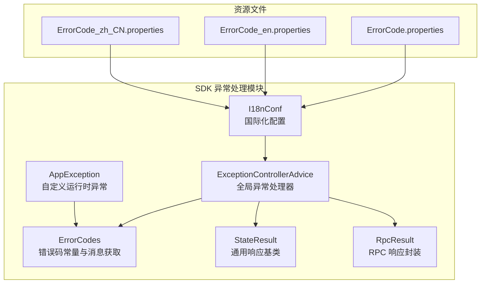
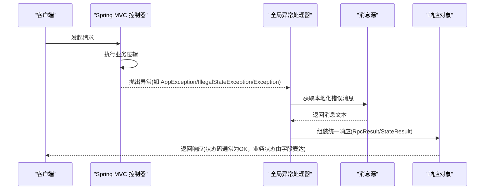
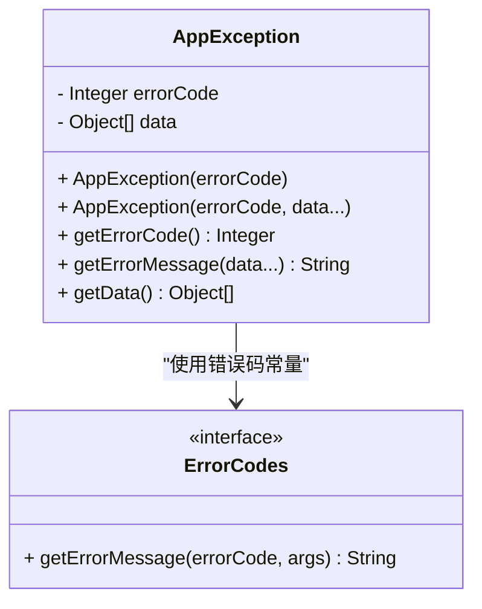
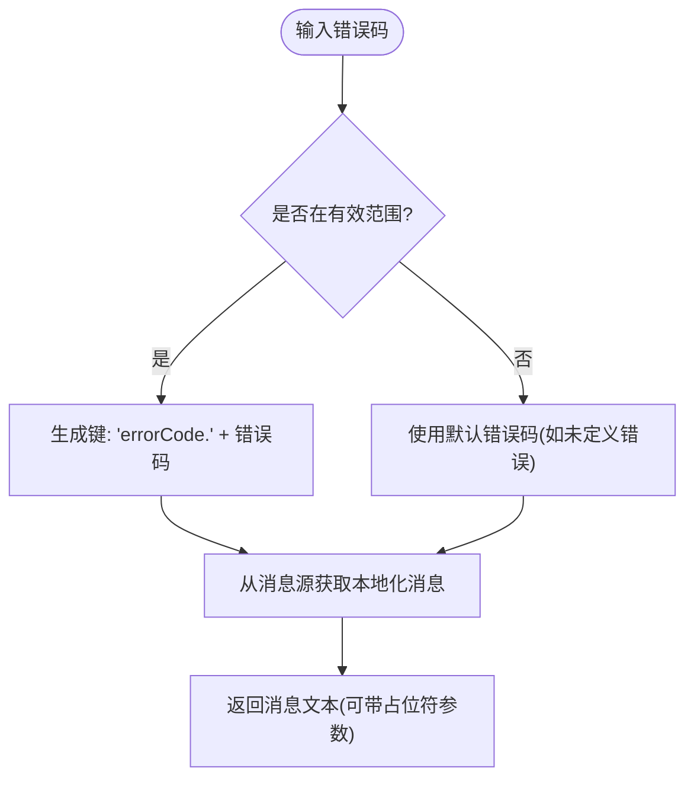
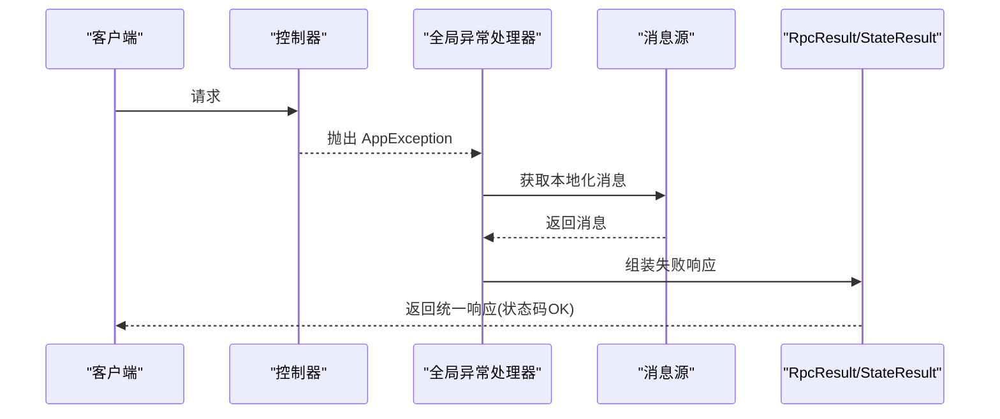
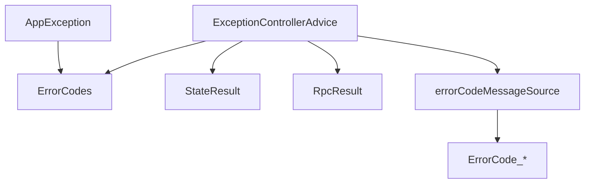

# 异常处理机制

<cite>
**本文引用的文件**
- [AppException.java](file://watcher-sdk/src/main/java/com/virtual/cloud/om/sdk/exception/AppException.java)
- [ErrorCodes.java](file://watcher-sdk/src/main/java/com/virtual/cloud/om/sdk/exception/ErrorCodes.java)
- [ExceptionControllerAdvice.java](file://watcher-sdk/src/main/java/com/virtual/cloud/om/sdk/exception/ExceptionControllerAdvice.java)
- [I18nConf.java](file://watcher-sdk/src/main/java/com/virtual/cloud/om/sdk/exception/I18nConf.java)
- [RpcResult.java](file://watcher-sdk/src/main/java/com/virtual/cloud/om/sdk/dto/RpcResult.java)
- [StateResult.java](file://watcher-sdk/src/main/java/com/virtual/cloud/om/sdk/dto/StateResult.java)
- [ErrorCode.properties](file://watcher-agent/src/main/resources/messages/ErrorCode.properties)
- [ErrorCode_zh_CN.properties](file://watcher-agent/src/main/resources/messages/ErrorCode_zh_CN.properties)
- [ErrorCode_en.properties](file://watcher-agent/src/main/resources/messages/ErrorCode_en.properties)
</cite>

## 目录
1. [简介](#简介)
2. [项目结构](#项目结构)
3. [核心组件](#核心组件)
4. [架构总览](#架构总览)
5. [详细组件分析](#详细组件分析)
6. [依赖关系分析](#依赖关系分析)
7. [性能考量](#性能考量)
8. [故障排查指南](#故障排查指南)
9. [结论](#结论)
10. [附录](#附录)

## 简介
本技术文档围绕异常处理机制展开，系统性介绍自定义异常类、错误码体系、全局异常处理器以及国际化消息处理。重点覆盖以下方面：
- AppException 自定义异常类的设计与使用，包括异常类型定义、构造函数与异常传播机制
- ErrorCodes 错误码体系，包括错误码定义、分类规则与国际化支持
- ExceptionControllerAdvice 全局异常处理器的工作原理，包括异常拦截、错误响应格式化与 HTTP 状态码设置
- I18nConf 国际化的异常消息处理机制
- 异常处理最佳实践，包括异常分类策略、错误信息设计与用户体验优化
- 提供具体异常处理示例与调试技巧

## 项目结构
异常处理相关代码主要位于 SDK 模块中，涉及异常类、错误码接口、全局异常处理器与国际化配置；同时在资源目录下提供多语言错误消息文件。

图表来源
- [AppException.java:1-64](file://watcher-sdk/src/main/java/com/virtual/cloud/om/sdk/exception/AppException.java#L1-L64)
- [ErrorCodes.java:1-190](file://watcher-sdk/src/main/java/com/virtual/cloud/om/sdk/exception/ErrorCodes.java#L1-L190)
- [ExceptionControllerAdvice.java:1-96](file://watcher-sdk/src/main/java/com/virtual/cloud/om/sdk/exception/ExceptionControllerAdvice.java#L1-L96)
- [I18nConf.java:1-23](file://watcher-sdk/src/main/java/com/virtual/cloud/om/sdk/exception/I18nConf.java#L1-L23)
- [StateResult.java:1-74](file://watcher-sdk/src/main/java/com/virtual/cloud/om/sdk/dto/StateResult.java#L1-L74)
- [RpcResult.java:1-88](file://watcher-sdk/src/main/java/com/virtual/cloud/om/sdk/dto/RpcResult.java#L1-L88)
- [ErrorCode_zh_CN.properties:1-97](file://watcher-agent/src/main/resources/messages/ErrorCode_zh_CN.properties#L1-L97)
- [ErrorCode_en.properties:1-86](file://watcher-agent/src/main/resources/messages/ErrorCode_en.properties#L1-L86)
- [ErrorCode.properties:1-103](file://watcher-agent/src/main/resources/messages/ErrorCode.properties#L1-L103)

章节来源
- [AppException.java:1-64](file://watcher-sdk/src/main/java/com/virtual/cloud/om/sdk/exception/AppException.java#L1-L64)
- [ErrorCodes.java:1-190](file://watcher-sdk/src/main/java/com/virtual/cloud/om/sdk/exception/ErrorCodes.java#L1-L190)
- [ExceptionControllerAdvice.java:1-96](file://watcher-sdk/src/main/java/com/virtual/cloud/om/sdk/exception/ExceptionControllerAdvice.java#L1-L96)
- [I18nConf.java:1-23](file://watcher-sdk/src/main/java/com/virtual/cloud/om/sdk/exception/I18nConf.java#L1-L23)
- [StateResult.java:1-74](file://watcher-sdk/src/main/java/com/virtual/cloud/om/sdk/dto/StateResult.java#L1-L74)
- [RpcResult.java:1-88](file://watcher-sdk/src/main/java/com/virtual/cloud/om/sdk/dto/RpcResult.java#L1-L88)
- [ErrorCode_zh_CN.properties:1-97](file://watcher-agent/src/main/resources/messages/ErrorCode_zh_CN.properties#L1-L97)
- [ErrorCode_en.properties:1-86](file://watcher-agent/src/main/resources/messages/ErrorCode_en.properties#L1-L86)
- [ErrorCode.properties:1-103](file://watcher-agent/src/main/resources/messages/ErrorCode.properties#L1-L103)

## 核心组件
本节对异常处理的关键组件进行深入分析，涵盖类职责、数据结构、处理流程与依赖关系。

- AppException：继承运行时异常，封装错误码与可变参数，支持从国际化资源动态构建错误消息，并允许显式设置消息覆盖默认行为。
- ErrorCodes：定义统一错误码常量与前缀，提供静态方法通过错误码与参数获取本地化消息。
- ExceptionControllerAdvice：基于 Spring 的全局异常处理器，拦截不同类型的异常，统一输出 RPC 风格响应。
- I18nConf：声明基于资源包的消息源，指定错误码消息的基础名与编码，启用按代码回退默认消息。
- StateResult/RpcResult：统一响应模型，包含状态、错误码、成功/失败消息字段，便于前后端一致的契约表达。

章节来源
- [AppException.java:12-64](file://watcher-sdk/src/main/java/com/virtual/cloud/om/sdk/exception/AppException.java#L12-L64)
- [ErrorCodes.java:10-189](file://watcher-sdk/src/main/java/com/virtual/cloud/om/sdk/exception/ErrorCodes.java#L10-L189)
- [ExceptionControllerAdvice.java:25-96](file://watcher-sdk/src/main/java/com/virtual/cloud/om/sdk/exception/ExceptionControllerAdvice.java#L25-L96)
- [I18nConf.java:11-22](file://watcher-sdk/src/main/java/com/virtual/cloud/om/sdk/exception/I18nConf.java#L11-L22)
- [StateResult.java:10-74](file://watcher-sdk/src/main/java/com/virtual/cloud/om/sdk/dto/StateResult.java#L10-L74)
- [RpcResult.java:3-88](file://watcher-sdk/src/main/java/com/virtual/cloud/om/sdk/dto/RpcResult.java#L3-L88)

## 架构总览
异常处理的整体工作流如下：
- 应用层抛出自定义异常或业务异常
- 全局异常处理器捕获异常，根据异常类型映射到统一响应模型
- 错误码与国际化消息由消息源与错误码常量共同决定
- 响应体采用 RPC 风格（含状态、错误码、消息），HTTP 状态通常为 OK，业务错误通过状态字段表达

图表来源
- [ExceptionControllerAdvice.java:34-93](file://watcher-sdk/src/main/java/com/virtual/cloud/om/sdk/exception/ExceptionControllerAdvice.java#L34-L93)
- [RpcResult.java:31-45](file://watcher-sdk/src/main/java/com/virtual/cloud/om/sdk/dto/RpcResult.java#L31-L45)
- [StateResult.java:23-72](file://watcher-sdk/src/main/java/com/virtual/cloud/om/sdk/dto/StateResult.java#L23-L72)
- [I18nConf.java:13-20](file://watcher-sdk/src/main/java/com/virtual/cloud/om/sdk/exception/I18nConf.java#L13-L20)

## 详细组件分析

### AppException 自定义异常类
- 设计要点
  - 实现序列化接口，确保跨网络传输安全
  - 内部持有错误码与参数数组，支持占位符替换
  - 优先使用显式设置的消息，否则回退至国际化资源中的错误码消息
  - 提供便捷方法获取错误码与消息，便于上层统一处理
- 构造函数
  - 单参数：仅传入错误码，消息从资源文件加载
  - 可变参数：传入错误码与参数，用于格式化消息
- 异常传播
  - 作为运行时异常，可在任意层次抛出，最终由全局异常处理器捕获并格式化

图表来源
- [AppException.java:18-62](file://watcher-sdk/src/main/java/com/virtual/cloud/om/sdk/exception/AppException.java#L18-L62)
- [ErrorCodes.java:10-189](file://watcher-sdk/src/main/java/com/virtual/cloud/om/sdk/exception/ErrorCodes.java#L10-L189)

章节来源
- [AppException.java:12-64](file://watcher-sdk/src/main/java/com/virtual/cloud/om/sdk/exception/AppException.java#L12-L64)

### ErrorCodes 错误码体系
- 定义规范
  - 使用接口定义错误码常量，避免重复与冲突
  - 统一前缀与基础消息包名，便于集中管理与检索
  - 提供静态方法通过错误码与参数获取本地化消息
- 分类规则
  - 公共错误：1-100
  - HTTP 相关：401/403/404/409/415/500/501/502/503/504/505
  - 业务域划分：部署(1001-1100)、参数(1101-1200)、登录认证(1301-1400)、资源(2011)等
- 国际化支持
  - 通过消息源与资源包键“errorCode.{code}”获取对应语言消息
  - 支持占位符参数，实现动态消息拼接

图表来源
- [ErrorCodes.java:12-189](file://watcher-sdk/src/main/java/com/virtual/cloud/om/sdk/exception/ErrorCodes.java#L12-L189)
- [I18nConf.java:13-20](file://watcher-sdk/src/main/java/com/virtual/cloud/om/sdk/exception/I18nConf.java#L13-L20)

章节来源
- [ErrorCodes.java:10-189](file://watcher-sdk/src/main/java/com/virtual/cloud/om/sdk/exception/ErrorCodes.java#L10-L189)

### ExceptionControllerAdvice 全局异常处理器
- 拦截策略
  - MethodArgumentNotValidException：参数校验失败，返回统一失败响应
  - AppException：直接取错误码与消息，返回统一失败响应
  - IllegalStateException/NullPointerException：参数检查类错误，映射到相应错误码
  - Exception：兜底异常，统一返回未知错误
- 响应格式
  - 使用 RpcResult.fail 或 StateResult 构建统一响应
  - HTTP 状态通常为 OK，业务错误通过状态字段表达
- 国际化消息
  - 通过消息源按请求上下文的语言环境获取本地化消息

图表来源
- [ExceptionControllerAdvice.java:43-48](file://watcher-sdk/src/main/java/com/virtual/cloud/om/sdk/exception/ExceptionControllerAdvice.java#L43-L48)
- [RpcResult.java:31-45](file://watcher-sdk/src/main/java/com/virtual/cloud/om/sdk/dto/RpcResult.java#L31-L45)
- [StateResult.java:23-72](file://watcher-sdk/src/main/java/com/virtual/cloud/om/sdk/dto/StateResult.java#L23-L72)

章节来源
- [ExceptionControllerAdvice.java:25-96](file://watcher-sdk/src/main/java/com/virtual/cloud/om/sdk/exception/ExceptionControllerAdvice.java#L25-L96)

### I18nConf 国际化配置
- 配置要点
  - 声明名为“errorCodeMessageSource”的消息源 Bean
  - 设置基础名指向“messages/ErrorCode”，启用 UTF-8 编码
  - 启用按代码回退默认消息，保证缺失语言时仍可显示
- 资源文件
  - ErrorCode.properties：默认语言（含中文键值）
  - ErrorCode_zh_CN.properties：简体中文
  - ErrorCode_en.properties：英文
- 使用方式
  - 全局异常处理器通过消息源按请求语言获取对应错误消息

章节来源
- [I18nConf.java:11-22](file://watcher-sdk/src/main/java/com/virtual/cloud/om/sdk/exception/I18nConf.java#L11-L22)
- [ErrorCode.properties:1-103](file://watcher-agent/src/main/resources/messages/ErrorCode.properties#L1-L103)
- [ErrorCode_zh_CN.properties:1-97](file://watcher-agent/src/main/resources/messages/ErrorCode_zh_CN.properties#L1-L97)
- [ErrorCode_en.properties:1-86](file://watcher-agent/src/main/resources/messages/ErrorCode_en.properties#L1-L86)

## 依赖关系分析
异常处理模块内部依赖清晰，耦合度低，扩展性强。

图表来源
- [AppException.java:14-14](file://watcher-sdk/src/main/java/com/virtual/cloud/om/sdk/exception/AppException.java#L14-L14)
- [ErrorCodes.java:12-13](file://watcher-sdk/src/main/java/com/virtual/cloud/om/sdk/exception/ErrorCodes.java#L12-L13)
- [ExceptionControllerAdvice.java:31-32](file://watcher-sdk/src/main/java/com/virtual/cloud/om/sdk/exception/ExceptionControllerAdvice.java#L31-L32)
- [RpcResult.java:3-3](file://watcher-sdk/src/main/java/com/virtual/cloud/om/sdk/dto/RpcResult.java#L3-L3)
- [StateResult.java:10-10](file://watcher-sdk/src/main/java/com/virtual/cloud/om/sdk/dto/StateResult.java#L10-L10)
- [I18nConf.java:13-20](file://watcher-sdk/src/main/java/com/virtual/cloud/om/sdk/exception/I18nConf.java#L13-L20)

章节来源
- [AppException.java:1-64](file://watcher-sdk/src/main/java/com/virtual/cloud/om/sdk/exception/AppException.java#L1-L64)
- [ErrorCodes.java:1-190](file://watcher-sdk/src/main/java/com/virtual/cloud/om/sdk/exception/ErrorCodes.java#L1-L190)
- [ExceptionControllerAdvice.java:1-96](file://watcher-sdk/src/main/java/com/virtual/cloud/om/sdk/exception/ExceptionControllerAdvice.java#L1-L96)
- [I18nConf.java:1-23](file://watcher-sdk/src/main/java/com/virtual/cloud/om/sdk/exception/I18nConf.java#L1-L23)
- [RpcResult.java:1-88](file://watcher-sdk/src/main/java/com/virtual/cloud/om/sdk/dto/RpcResult.java#L1-L88)
- [StateResult.java:1-74](file://watcher-sdk/src/main/java/com/virtual/cloud/om/sdk/dto/StateResult.java#L1-L74)

## 性能考量
- 消息源缓存：Spring 的消息源具备缓存能力，频繁调用不会造成显著开销
- 字符串格式化：错误消息中占位符替换为轻量级操作，建议避免在高频路径中重复构造大量参数
- 日志记录：异常处理器已内置日志记录，注意避免在消息源获取过程中引入额外 IO 开销
- 响应封装：统一响应对象结构简单，序列化成本低，适合高并发场景

## 故障排查指南
- 症状：返回消息为错误码而非本地化文本
  - 检查消息源 Bean 名称与注入名称是否一致
  - 确认资源包基础名与文件命名是否匹配
- 症状：未知错误总是返回
  - 检查兜底异常处理器是否被触发
  - 确认异常是否被正确抛出且未被捕获
- 症状：参数校验失败未按预期返回
  - 确认参数校验注解与绑定结果是否正确
  - 检查字段错误消息是否为空导致回退逻辑
- 症状：国际化未生效
  - 检查请求上下文语言环境是否正确传递
  - 确认资源文件是否存在对应语言版本

章节来源
- [ExceptionControllerAdvice.java:34-93](file://watcher-sdk/src/main/java/com/virtual/cloud/om/sdk/exception/ExceptionControllerAdvice.java#L34-L93)
- [I18nConf.java:13-20](file://watcher-sdk/src/main/java/com/virtual/cloud/om/sdk/exception/I18nConf.java#L13-L20)

## 结论
该异常处理机制通过自定义异常、统一错误码、全局异常处理器与国际化配置形成闭环，既保证了错误信息的一致性与可维护性，又提升了用户体验与可诊断性。建议在后续迭代中持续完善错误码覆盖范围与消息细化程度，确保关键业务场景具备明确的错误提示与引导。

## 附录
- 最佳实践
  - 明确异常分类：区分业务异常（AppException）与系统异常（Exception），前者使用错误码，后者兜底
  - 错误信息设计：保持简洁、可读、可翻译，避免泄露敏感信息
  - 用户体验优化：在前端展示统一的错误提示与重试入口，必要时提供错误码以便定位问题
  - 国际化落地：确保所有错误消息均有默认与目标语言版本，占位符参数齐全
- 示例参考
  - 抛出业务异常：[AppException 构造函数:22-31](file://watcher-sdk/src/main/java/com/virtual/cloud/om/sdk/exception/AppException.java#L22-L31)
  - 全局拦截与响应：[异常处理器方法:43-87](file://watcher-sdk/src/main/java/com/virtual/cloud/om/sdk/exception/ExceptionControllerAdvice.java#L43-L87)
  - 统一响应模型：[RpcResult.fail:31-33](file://watcher-sdk/src/main/java/com/virtual/cloud/om/sdk/dto/RpcResult.java#L31-L33)、[StateResult 字段:23-72](file://watcher-sdk/src/main/java/com/virtual/cloud/om/sdk/dto/StateResult.java#L23-L72)
- 调试技巧
  - 在异常处理器中打印请求语言与错误码，核对消息源是否正确选择语言
  - 使用最小化参数复现参数校验失败场景，验证字段错误消息是否按预期返回