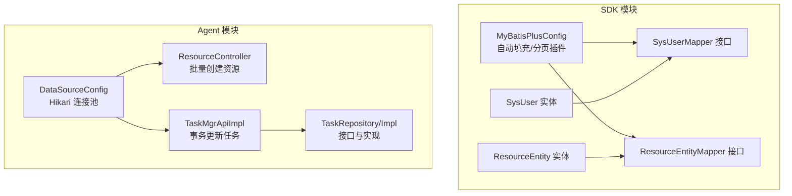
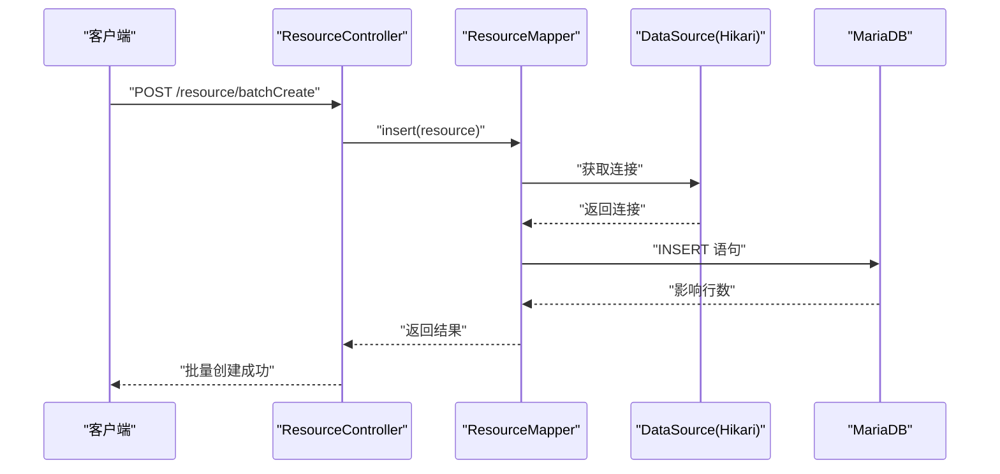
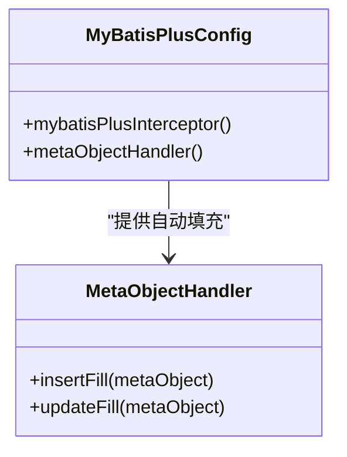
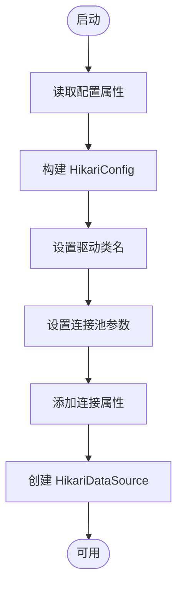
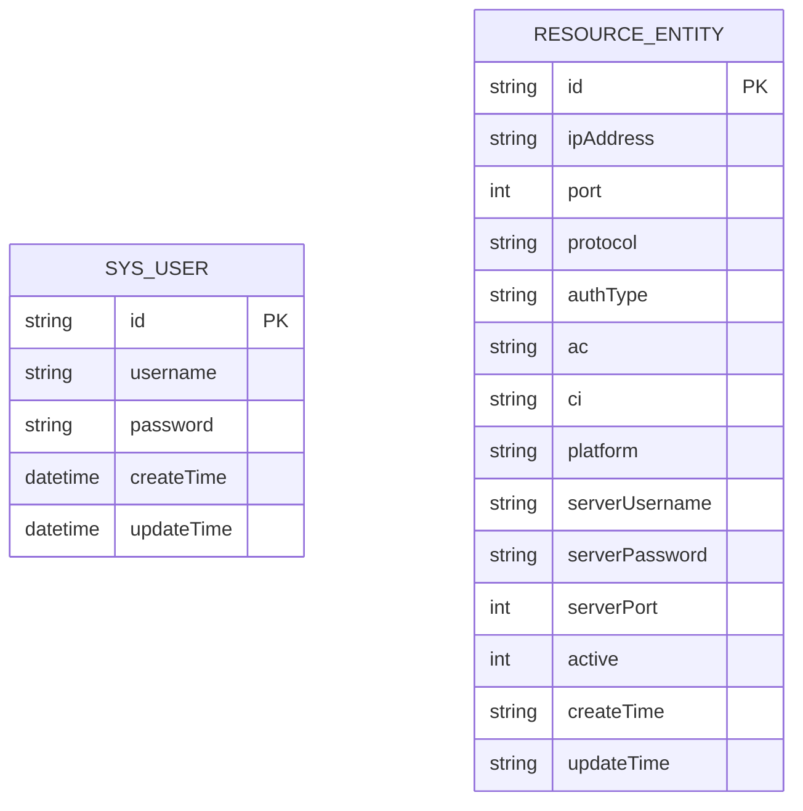
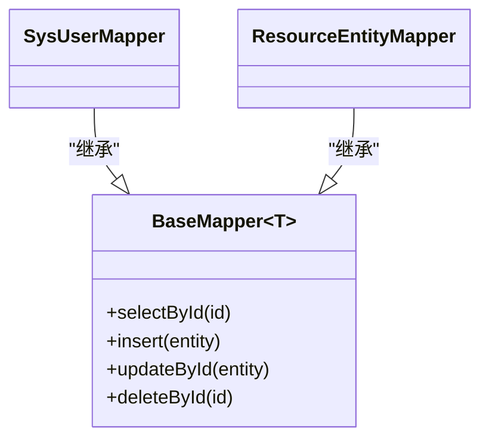
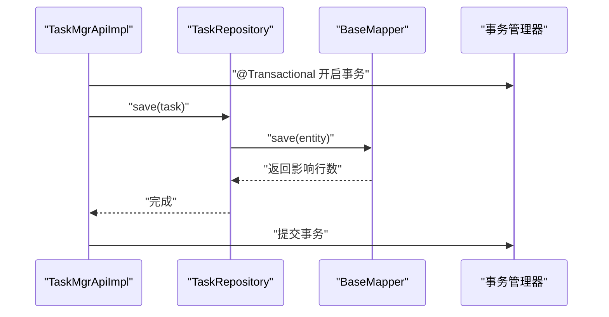
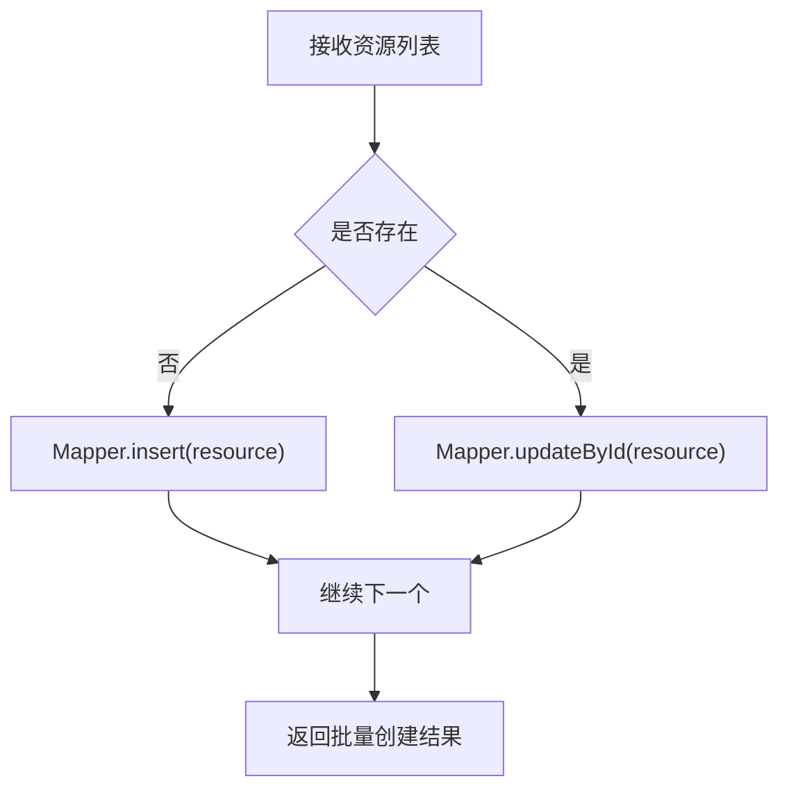
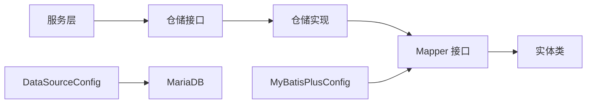

# 数据库配置与访问

<cite>
**本文引用的文件**
- [MyBatisPlusConfig.java](file://watcher-sdk/src/main/java/com/virtual/cloud/om/sdk/config/mybatis/MyBatisPlusConfig.java)
- [DataSourceConfig.java](file://watcher-agent/src/main/java/com/virtual/cloud/om/agent/config/DataSourceConfig.java)
- [SysUser.java](file://watcher-sdk/src/main/java/com/virtual/cloud/om/sdk/entity/mysql/SysUser.java)
- [SysUserMapper.java](file://watcher-sdk/src/main/java/com/virtual/cloud/om/sdk/mapper/SysUserMapper.java)
- [ResourceEntity.java](file://watcher-sdk/src/main/java/com/virtual/cloud/om/sdk/entity/mysql/ResourceEntity.java)
- [ResourceEntityMapper.java](file://watcher-sdk/src/main/java/com/virtual/cloud/om/sdk/mapper/ResourceEntityMapper.java)
- [TaskMgrApiImpl.java](file://watcher-agent/src/main/java/com/virtual/cloud/om/agent/service/task/TaskMgrApiImpl.java)
- [TaskRepository.java](file://watcher-agent/src/main/java/com/virtual/cloud/om/agent/repository/TaskRepository.java)
- [TaskRepositoryImpl.java](file://watcher-agent/src/main/java/com/virtual/cloud/om/agent/repository/TaskRepositoryImpl.java)
- [ResourceController.java](file://watcher-agent/src/main/java/com/virtual/cloud/om/agent/controller/ResourceController.java)
- [index.ts](file://watcher-web/src/api/resource/index.ts)
- [init.sql](file://watcher-agent/src/main/resources/database/init.sql)
- [schema-mysql.sql](file://watcher-agent/src/main/resources/schema-mysql.sql)
</cite>

## 目录
1. [简介](#简介)
2. [项目结构](#项目结构)
3. [核心组件](#核心组件)
4. [架构总览](#架构总览)
5. [详细组件分析](#详细组件分析)
6. [依赖分析](#依赖分析)
7. [性能考虑](#性能考虑)
8. [故障排查指南](#故障排查指南)
9. [结论](#结论)
10. [附录](#附录)

## 简介
本文件聚焦于数据库配置与访问层，系统性梳理以下内容：
- MyBatis-Plus 配置类的设计与功能（数据源、自动填充、分页插件）
- Mapper 接口设计模式与命名规范（CRUD 与 SQL 映射）
- 实体类与数据库表的映射关系（字段映射、主键策略、注解使用）
- 事务管理、连接池配置与性能优化策略
- 典型数据库操作示例（复杂查询、批量操作、事务处理）
- 数据库设计最佳实践与常见问题解决方案

## 项目结构
数据库相关能力主要分布在两个模块：
- watcher-sdk：提供通用的 MyBatis-Plus 配置、实体与 Mapper 定义
- watcher-agent：提供数据源连接池配置，并通过控制器与服务层进行数据库访问

图表来源
- [MyBatisPlusConfig.java:1-51](file://watcher-sdk/src/main/java/com/virtual/cloud/om/sdk/config/mybatis/MyBatisPlusConfig.java#L1-L51)
- [DataSourceConfig.java:1-47](file://watcher-agent/src/main/java/com/virtual/cloud/om/agent/config/DataSourceConfig.java#L1-L47)
- [SysUser.java:1-56](file://watcher-sdk/src/main/java/com/virtual/cloud/om/sdk/entity/mysql/SysUser.java#L1-L56)
- [SysUserMapper.java:1-14](file://watcher-sdk/src/main/java/com/virtual/cloud/om/sdk/mapper/SysUserMapper.java#L1-L14)
- [ResourceEntity.java:1-48](file://watcher-sdk/src/main/java/com/virtual/cloud/om/sdk/entity/mysql/ResourceEntity.java#L1-L48)
- [ResourceEntityMapper.java:1-14](file://watcher-sdk/src/main/java/com/virtual/cloud/om/sdk/mapper/ResourceEntityMapper.java#L1-L14)
- [TaskMgrApiImpl.java:1-129](file://watcher-agent/src/main/java/com/virtual/cloud/om/agent/service/task/TaskMgrApiImpl.java#L1-L129)
- [TaskRepository.java:1-34](file://watcher-agent/src/main/java/com/virtual/cloud/om/agent/repository/TaskRepository.java#L1-L34)
- [TaskRepositoryImpl.java:1-78](file://watcher-agent/src/main/java/com/virtual/cloud/om/agent/repository/TaskRepositoryImpl.java#L1-L78)
- [ResourceController.java:123-135](file://watcher-agent/src/main/java/com/virtual/cloud/om/agent/controller/ResourceController.java#L123-L135)

章节来源
- [MyBatisPlusConfig.java:1-51](file://watcher-sdk/src/main/java/com/virtual/cloud/om/sdk/config/mybatis/MyBatisPlusConfig.java#L1-L51)
- [DataSourceConfig.java:1-47](file://watcher-agent/src/main/java/com/virtual/cloud/om/agent/config/DataSourceConfig.java#L1-L47)

## 核心组件
- MyBatis-Plus 配置类
  - 提供分页插件（MySQL）与自动填充处理器（插入/更新时填充时间字段）
- 数据源配置类
  - 基于 Hikari 的连接池配置，指定 MariaDB 驱动与连接参数
- 实体与 Mapper
  - 使用 MyBatis-Plus 注解定义表名、主键策略与字段映射
  - Mapper 继承 BaseMapper，天然具备 CRUD 能力
- 事务与仓储
  - 服务层使用 @Transactional 管理事务
  - 仓储层提供接口与实现（当前实现中部分方法日志提示功能已禁用）

章节来源
- [MyBatisPlusConfig.java:13-50](file://watcher-sdk/src/main/java/com/virtual/cloud/om/sdk/config/mybatis/MyBatisPlusConfig.java#L13-L50)
- [DataSourceConfig.java:12-46](file://watcher-agent/src/main/java/com/virtual/cloud/om/agent/config/DataSourceConfig.java#L12-L46)
- [SysUser.java:15-55](file://watcher-sdk/src/main/java/com/virtual/cloud/om/sdk/entity/mysql/SysUser.java#L15-L55)
- [SysUserMapper.java:7-13](file://watcher-sdk/src/main/java/com/virtual/cloud/om/sdk/mapper/SysUserMapper.java#L7-L13)
- [ResourceEntity.java:10-47](file://watcher-sdk/src/main/java/com/virtual/cloud/om/sdk/entity/mysql/ResourceEntity.java#L10-L47)
- [ResourceEntityMapper.java:7-13](file://watcher-sdk/src/main/java/com/virtual/cloud/om/sdk/mapper/ResourceEntityMapper.java#L7-L13)
- [TaskMgrApiImpl.java:98-104](file://watcher-agent/src/main/java/com/virtual/cloud/om/agent/service/task/TaskMgrApiImpl.java#L98-L104)
- [TaskRepository.java:8-33](file://watcher-agent/src/main/java/com/virtual/cloud/om/agent/repository/TaskRepository.java#L8-L33)
- [TaskRepositoryImpl.java:11-77](file://watcher-agent/src/main/java/com/virtual/cloud/om/agent/repository/TaskRepositoryImpl.java#L11-L77)

## 架构总览
数据库访问层采用“配置 + 实体 + Mapper + 服务/控制器”的分层设计：
- 配置层：MyBatis-Plus 插件与自动填充；Hikari 连接池
- 访问层：Mapper 接口继承 BaseMapper，提供标准 CRUD
- 业务层：服务类负责事务控制与业务编排
- 控制层：控制器接收请求，调用服务层，返回结果

图表来源
- [ResourceController.java:123-135](file://watcher-agent/src/main/java/com/virtual/cloud/om/agent/controller/ResourceController.java#L123-L135)
- [SysUserMapper.java:7-13](file://watcher-sdk/src/main/java/com/virtual/cloud/om/sdk/mapper/SysUserMapper.java#L7-L13)
- [DataSourceConfig.java:27-45](file://watcher-agent/src/main/java/com/virtual/cloud/om/agent/config/DataSourceConfig.java#L27-L45)

## 详细组件分析

### MyBatis-Plus 配置类
- 分页插件
  - 在拦截器中添加 MySQL 分页内核，确保分页行为与 MySQL 兼容
- 自动填充处理器
  - 插入时填充创建时间（驼峰与下划线两种字段名）
  - 更新时填充更新时间（驼峰与下划线两种字段名）
- 设计要点
  - 将自动填充逻辑集中在一处，避免在各实体重复定义
  - 分页插件按数据库类型选择，保证 SQL 生成正确

图表来源
- [MyBatisPlusConfig.java:16-50](file://watcher-sdk/src/main/java/com/virtual/cloud/om/sdk/config/mybatis/MyBatisPlusConfig.java#L16-L50)

章节来源
- [MyBatisPlusConfig.java:19-49](file://watcher-sdk/src/main/java/com/virtual/cloud/om/sdk/config/mybatis/MyBatisPlusConfig.java#L19-L49)

### 数据源配置与连接池
- Hikari 连接池参数
  - 最大池大小、最小空闲、连接超时、空闲超时、最大生存时间
  - 设置 MariaDB 驱动类名与若干连接属性（SSL、公钥检索、时区）
- 设计要点
  - 生产环境建议结合监控指标动态调整池大小
  - 时区与 SSL 参数需与数据库服务器一致

图表来源
- [DataSourceConfig.java:18-44](file://watcher-agent/src/main/java/com/virtual/cloud/om/agent/config/DataSourceConfig.java#L18-L44)

章节来源
- [DataSourceConfig.java:27-45](file://watcher-agent/src/main/java/com/virtual/cloud/om/agent/config/DataSourceConfig.java#L27-L45)

### 实体类与数据库映射
- SysUser 实体
  - 表名为 sys_user，主键策略为输入式（由外部赋值）
  - 字段 createTime/updateTime 支持自动填充
  - lastLoginTime 使用注解标记为非表字段
- ResourceEntity 实体
  - 表名为 resource_entity，主键策略为输入式
  - 字段覆盖 IP、端口、协议、认证方式、平台等资源信息
- 注解使用
  - @TableName：声明表名
  - @TableId：声明主键及策略
  - @TableField(exist=false)：声明非表字段
  - Lombok 注解：简化 getter/setter/构造函数

图表来源
- [SysUser.java:22-55](file://watcher-sdk/src/main/java/com/virtual/cloud/om/sdk/entity/mysql/SysUser.java#L22-L55)
- [ResourceEntity.java:14-47](file://watcher-sdk/src/main/java/com/virtual/cloud/om/sdk/entity/mysql/ResourceEntity.java#L14-L47)

章节来源
- [SysUser.java:22-55](file://watcher-sdk/src/main/java/com/virtual/cloud/om/sdk/entity/mysql/SysUser.java#L22-L55)
- [ResourceEntity.java:14-47](file://watcher-sdk/src/main/java/com/virtual/cloud/om/sdk/entity/mysql/ResourceEntity.java#L14-L47)

### Mapper 接口设计与命名规范
- 设计模式
  - Mapper 继承 BaseMapper，天然具备 CRUD 能力
  - 通过注解与 XML 映射扩展复杂查询（如需要）
- 命名规范
  - Mapper 接口以实体名 + Mapper 结尾，位于 sdk/mapper 包
  - 与实体类一一对应，便于维护与查找
- 典型使用
  - SysUserMapper、ResourceEntityMapper 直接继承 BaseMapper，即可使用 selectById、insert、updateById、deleteById 等方法

图表来源
- [SysUserMapper.java:3-13](file://watcher-sdk/src/main/java/com/virtual/cloud/om/sdk/mapper/SysUserMapper.java#L3-L13)
- [ResourceEntityMapper.java:3-13](file://watcher-sdk/src/main/java/com/virtual/cloud/om/sdk/mapper/ResourceEntityMapper.java#L3-L13)

章节来源
- [SysUserMapper.java:7-13](file://watcher-sdk/src/main/java/com/virtual/cloud/om/sdk/mapper/SysUserMapper.java#L7-L13)
- [ResourceEntityMapper.java:7-13](file://watcher-sdk/src/main/java/com/virtual/cloud/om/sdk/mapper/ResourceEntityMapper.java#L7-L13)

### 事务管理与服务层
- 事务控制
  - 服务层方法使用 @Transactional 标注，确保数据库操作在单个事务中执行
- 业务流程
  - 从 DTO 转换到实体，校验后写入数据库
  - 失败时异常回滚，成功时提交

图表来源
- [TaskMgrApiImpl.java:98-104](file://watcher-agent/src/main/java/com/virtual/cloud/om/agent/service/task/TaskMgrApiImpl.java#L98-L104)
- [TaskRepository.java:12-33](file://watcher-agent/src/main/java/com/virtual/cloud/om/agent/repository/TaskRepository.java#L12-L33)

章节来源
- [TaskMgrApiImpl.java:98-104](file://watcher-agent/src/main/java/com/virtual/cloud/om/agent/service/task/TaskMgrApiImpl.java#L98-L104)
- [TaskRepository.java:12-33](file://watcher-agent/src/main/java/com/virtual/cloud/om/agent/repository/TaskRepository.java#L12-L33)

### 批量操作与复杂查询示例
- 批量创建资源
  - 控制器遍历资源列表，若存在则更新，否则插入
  - 返回统一结果封装
- 复杂查询
  - 可通过自定义 SQL 或条件构造器实现多表关联、分页、排序等
  - 建议配合 MyBatis-Plus 分页插件使用

图表来源
- [ResourceController.java:123-135](file://watcher-agent/src/main/java/com/virtual/cloud/om/agent/controller/ResourceController.java#L123-L135)

章节来源
- [ResourceController.java:123-135](file://watcher-agent/src/main/java/com/virtual/cloud/om/agent/controller/ResourceController.java#L123-L135)

### 前端调用与 API 映射
- 前端通过封装的 API 文件调用后端接口
- 示例：资源列表、详情、创建、批量创建、更新、删除等

章节来源
- [index.ts:1-66](file://watcher-web/src/api/resource/index.ts#L1-L66)

## 依赖分析
- 组件耦合
  - Mapper 仅依赖实体类与 MyBatis-Plus 基类，低耦合高内聚
  - 服务层依赖仓储接口，仓储实现可替换
- 外部依赖
  - MyBatis-Plus、HikariCP、MariaDB 驱动
- 循环依赖
  - 当前结构未见循环依赖风险

图表来源
- [TaskMgrApiImpl.java:24-28](file://watcher-agent/src/main/java/com/virtual/cloud/om/agent/service/task/TaskMgrApiImpl.java#L24-L28)
- [TaskRepository.java:3-4](file://watcher-agent/src/main/java/com/virtual/cloud/om/agent/repository/TaskRepository.java#L3-L4)
- [SysUserMapper.java:3-4](file://watcher-sdk/src/main/java/com/virtual/cloud/om/sdk/mapper/SysUserMapper.java#L3-L4)
- [SysUser.java:3-6](file://watcher-sdk/src/main/java/com/virtual/cloud/om/sdk/entity/mysql/SysUser.java#L3-L6)
- [MyBatisPlusConfig.java:3-6](file://watcher-sdk/src/main/java/com/virtual/cloud/om/sdk/config/mybatis/MyBatisPlusConfig.java#L3-L6)
- [DataSourceConfig.java:3-4](file://watcher-agent/src/main/java/com/virtual/cloud/om/agent/config/DataSourceConfig.java#L3-L4)

## 性能考虑
- 连接池参数调优
  - 根据 QPS 与并发连接峰值调整最大池大小与空闲超时
  - 合理设置连接超时，避免长时间占用连接
- 自动填充与索引
  - 对频繁更新的列（如 updateTime）建立索引，减少锁竞争
- 分页与查询
  - 大数据量场景优先使用带条件的分页查询，避免全表扫描
- 批量操作
  - 批量插入/更新时合理分批，避免单次事务过大导致锁等待

## 故障排查指南
- 连接池相关
  - 现象：获取连接超时或连接池耗尽
  - 排查：检查最大池大小、连接超时、空闲超时配置是否合理
- 自动填充不生效
  - 现象：插入/更新后时间字段未填充
  - 排查：确认实体字段名与自动填充处理器中字段名一致（驼峰与下划线两种）
- 主键策略
  - 现象：主键为空或重复
  - 排查：确认主键策略与数据库自增/外部赋值策略一致
- 事务未生效
  - 现象：异常未回滚
  - 排查：确认方法可见性与 @Transactional 注解位置，避免同类内部调用导致代理失效

章节来源
- [DataSourceConfig.java:34-43](file://watcher-agent/src/main/java/com/virtual/cloud/om/agent/config/DataSourceConfig.java#L34-L43)
- [MyBatisPlusConfig.java:36-47](file://watcher-sdk/src/main/java/com/virtual/cloud/om/sdk/config/mybatis/MyBatisPlusConfig.java#L36-L47)
- [SysUser.java:27-28](file://watcher-sdk/src/main/java/com/virtual/cloud/om/sdk/entity/mysql/SysUser.java#L27-L28)
- [TaskMgrApiImpl.java:98-104](file://watcher-agent/src/main/java/com/virtual/cloud/om/agent/service/task/TaskMgrApiImpl.java#L98-L104)

## 结论
本数据库访问层通过 MyBatis-Plus 与 HikariCP 的组合，实现了简洁高效的 ORM 能力：
- 配置层集中管理分页与自动填充，降低重复代码
- Mapper 层基于 BaseMapper 提供标准 CRUD，易于扩展
- 服务层通过事务注解保障一致性
- 控制层对接前端，形成清晰的分层架构

## 附录
- 数据库初始化脚本
  - 初始化脚本与 MySQL 架构脚本位于资源目录，用于创建表结构与初始数据
- 建议
  - 在生产环境启用连接池监控与慢查询日志
  - 对高频字段建立索引，定期分析执行计划
  - 使用分页插件与条件构造器，避免 N+1 查询

章节来源
- [init.sql](file://watcher-agent/src/main/resources/database/init.sql)
- [schema-mysql.sql](file://watcher-agent/src/main/resources/schema-mysql.sql)