# 数据采集抽象层

<cite>
**本文引用的文件**
- [DataReportCollector.java](file://watcher-sdk/src/main/java/com/virtual/cloud/om/sdk/api/DataReportCollector.java)
- [DataReportTypeByMetricEnum.java](file://watcher-sdk/src/main/java/com/virtual/cloud/om/sdk/constant/DataReportTypeByMetricEnum.java)
- [ReportDataTypeEnum.java](file://watcher-sdk/src/main/java/com/virtual/cloud/om/sdk/constant/report/ReportDataTypeEnum.java)
- [DataValueAndTagsDTO.java](file://watcher-sdk/src/main/java/com/virtual/cloud/om/sdk/dto/dataReport/DataValueAndTagsDTO.java)
- [ReportDTO.java](file://watcher-sdk/src/main/java/com/virtual/cloud/om/sdk/dto/dataReport/workspace/ReportDTO.java)
- [DataReportCollectorOverview.java](file://watcher-agent/src/main/java/com/virtual/cloud/om/agent/service/DataReportCollectorOverview.java)
- [DataReportService.java](file://watcher-agent/src/main/java/com/virtual/cloud/om/agent/service/report/DataReportService.java)
- [TagsUtil.java](file://watcher-sdk/src/main/java/com/virtual/cloud/om/sdk/utils/TagsUtil.java)
- [ClusterVirtHostMemTopNCollector.java](file://watcher-cas/src/main/java/com/virtual/cloud/om/cas/service/report/ClusterVirtHostMemTopNCollector.java)
- [WorkspaceResourceUserNumberCollector.java](file://watcher-workspace/src/main/java/com/virtual/cloud/om/workspace/service/report/WorkspaceResourceUserNumberCollector.java)
- [UisResourceUserNumberCollector.java](file://watcher-uis/src/main/java/com/virtual/cloud/om/uis/service/report/UisResourceUserNumberCollector.java)
- [StorClusterBandwidthCollector.java](file://watcher-onestor/src/main/java/com/virtual/cloud/om/onestor/service/clusterBasic/StorClusterBandwidthCollector.java)
- [HostCapacityMonitorCollector.java](file://watcher-onestor/src/main/java/com/virtual/cloud/om/onestor/service/report/monitor/host/HostCapacityMonitorCollector.java)
- [AppException.java](file://watcher-sdk/src/main/java/com/virtual/cloud/om/sdk/exception/AppException.java)
- [ErrorCodes.java](file://watcher-sdk/src/main/java/com/virtual/cloud/om/sdk/exception/ErrorCodes.java)
</cite>

## 目录
1. [简介](#简介)
2. [项目结构](#项目结构)
3. [核心组件](#核心组件)
4. [架构总览](#架构总览)
5. [详细组件分析](#详细组件分析)
6. [依赖分析](#依赖分析)
7. [性能考虑](#性能考虑)
8. [故障排查指南](#故障排查指南)
9. [结论](#结论)
10. [附录](#附录)

## 简介
本技术文档围绕“数据采集抽象层”展开，重点剖析 DataReportCollector 抽象类的设计理念与实现模式，系统阐释其在模板方法与策略模式下的职责划分与协作关系，并结合 CAS、UIS、Workspace、OneStor 等产品线的采集器实现，给出可复用的扩展范式与最佳实践。

## 项目结构
数据采集抽象层位于 SDK 模块，采集器实现分布在各产品线模块（CAS、UIS、Workspace、OneStor），采集调度与注册由 Agent 模块负责。

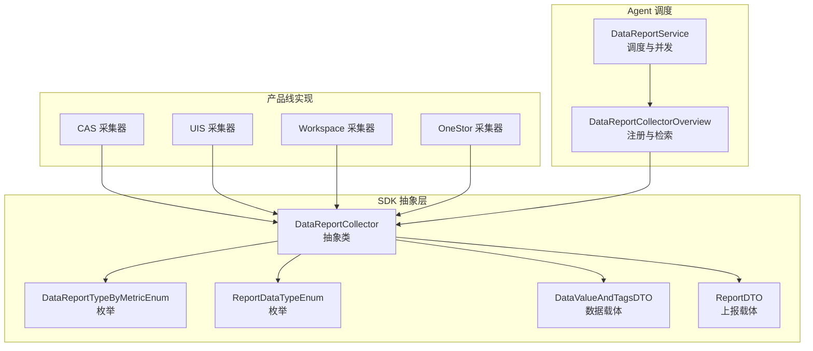

图表来源
- [DataReportCollector.java:18-118](file://watcher-sdk/src/main/java/com/virtual/cloud/om/sdk/api/DataReportCollector.java#L18-L118)
- [DataReportTypeByMetricEnum.java:21-190](file://watcher-sdk/src/main/java/com/virtual/cloud/om/sdk/constant/DataReportTypeByMetricEnum.java#L21-L190)
- [ReportDataTypeEnum.java:3-17](file://watcher-sdk/src/main/java/com/virtual/cloud/om/sdk/constant/report/ReportDataTypeEnum.java#L3-L17)
- [DataValueAndTagsDTO.java:9-16](file://watcher-sdk/src/main/java/com/virtual/cloud/om/sdk/dto/dataReport/DataValueAndTagsDTO.java#L9-L16)
- [ReportDTO.java:11-24](file://watcher-sdk/src/main/java/com/virtual/cloud/om/sdk/dto/dataReport/workspace/ReportDTO.java#L11-L24)
- [DataReportCollectorOverview.java:23-45](file://watcher-agent/src/main/java/com/virtual/cloud/om/agent/service/DataReportCollectorOverview.java#L23-L45)
- [DataReportService.java:186-201](file://watcher-agent/src/main/java/com/virtual/cloud/om/agent/service/report/DataReportService.java#L186-L201)

章节来源
- [DataReportCollector.java:18-118](file://watcher-sdk/src/main/java/com/virtual/cloud/om/sdk/api/DataReportCollector.java#L18-L118)
- [DataReportTypeByMetricEnum.java:1-190](file://watcher-sdk/src/main/java/com/virtual/cloud/om/sdk/constant/DataReportTypeByMetricEnum.java#L1-L190)
- [ReportDataTypeEnum.java:1-18](file://watcher-sdk/src/main/java/com/virtual/cloud/om/sdk/constant/report/ReportDataTypeEnum.java#L1-L18)
- [DataValueAndTagsDTO.java:1-17](file://watcher-sdk/src/main/java/com/virtual/cloud/om/sdk/dto/dataReport/DataValueAndTagsDTO.java#L1-L17)
- [ReportDTO.java:1-25](file://watcher-sdk/src/main/java/com/virtual/cloud/om/sdk/dto/dataReport/workspace/ReportDTO.java#L1-L25)
- [DataReportCollectorOverview.java:18-45](file://watcher-agent/src/main/java/com/virtual/cloud/om/agent/service/DataReportCollectorOverview.java#L18-L45)
- [DataReportService.java:186-201](file://watcher-agent/src/main/java/com/virtual/cloud/om/agent/service/report/DataReportService.java#L186-L201)

## 核心组件
- DataReportCollector 抽象类
  - 提供模板方法 data(...)，封装参数解析、采集执行、结果转换与时间戳处理的完整流程。
  - 定义抽象方法 metric()、valueType()、collect(...)，分别承担“指标类型定义”、“数据类型定义”、“具体采集逻辑”的职责。
  - 提供静态工具方法 getId(...)，用于从标签中解析多目标 ID（如 hostIds、clusterIds）。
- DataReportTypeByMetricEnum 枚举
  - 将“指标策略”与“资源平台”进行解耦，支持同一策略在不同平台的差异化实现。
  - 提供按策略+平台或策略+分离维度（host/domain/cluster 等）检索实现类型的方法。
- ReportDataTypeEnum 枚举
  - 统一 data.value 的类型语义，涵盖 json、text、gauge、counter、histogra、summary 等。
- DataValueAndTagsDTO 与 ReportDTO
  - DataValueAndTagsDTO 表达单条采集结果（value/tags/timestamp）。
  - ReportDTO 表达最终上报结构（metric/type/value/tags/timestamp）。

章节来源
- [DataReportCollector.java:18-118](file://watcher-sdk/src/main/java/com/virtual/cloud/om/sdk/api/DataReportCollector.java#L18-L118)
- [DataReportTypeByMetricEnum.java:10-190](file://watcher-sdk/src/main/java/com/virtual/cloud/om/sdk/constant/DataReportTypeByMetricEnum.java#L10-L190)
- [ReportDataTypeEnum.java:1-18](file://watcher-sdk/src/main/java/com/virtual/cloud/om/sdk/constant/report/ReportDataTypeEnum.java#L1-L18)
- [DataValueAndTagsDTO.java:1-17](file://watcher-sdk/src/main/java/com/virtual/cloud/om/sdk/dto/dataReport/DataValueAndTagsDTO.java#L1-L17)
- [ReportDTO.java:1-25](file://watcher-sdk/src/main/java/com/virtual/cloud/om/sdk/dto/dataReport/workspace/ReportDTO.java#L1-L25)

## 架构总览
抽象层采用“模板方法 + 策略模式”的组合设计：
- 模板方法：DataReportCollector.data(...) 定义采集流程骨架，子类仅需实现采集细节。
- 策略模式：DataReportTypeByMetricEnum 将“指标策略”与“平台实现”解耦，通过注册表在运行时选择具体采集器。

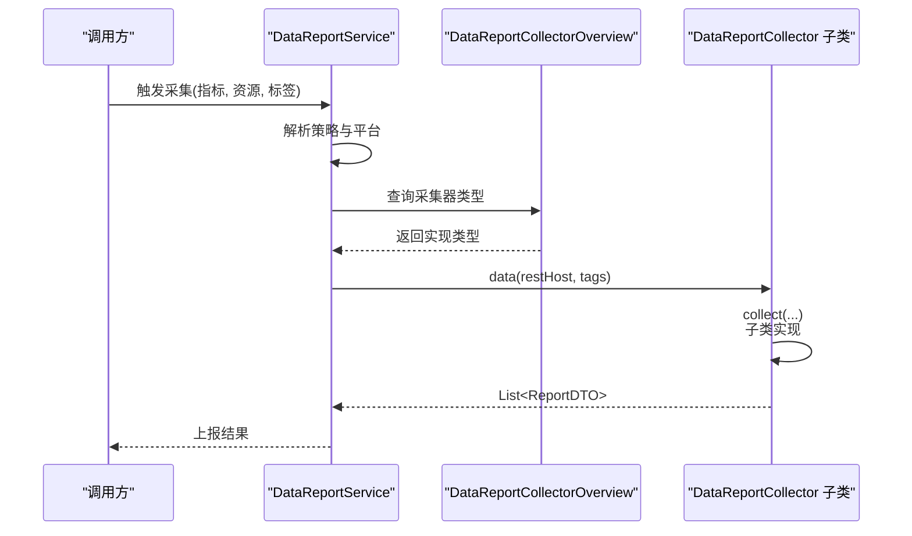

图表来源
- [DataReportService.java:186-201](file://watcher-agent/src/main/java/com/virtual/cloud/om/agent/service/report/DataReportService.java#L186-L201)
- [DataReportCollectorOverview.java:23-45](file://watcher-agent/src/main/java/com/virtual/cloud/om/agent/service/DataReportCollectorOverview.java#L23-L45)
- [DataReportCollector.java:48-86](file://watcher-sdk/src/main/java/com/virtual/cloud/om/sdk/api/DataReportCollector.java#L48-L86)

## 详细组件分析

### DataReportCollector 抽象类
- 设计要点
  - 模板方法 data(...)：统一参数解析、采集执行、结果转换与时间戳处理；若采集结果为空，自动填充空数组以保证上报结构一致。
  - 抽象方法职责
    - metric()：返回 DataReportTypeByMetricEnum，标识指标策略与平台绑定关系。
    - valueType()：返回 ReportDataTypeEnum，决定 data.value 的类型语义。
    - collect(...)：子类实现具体采集逻辑，返回 List<DataValueAndTagsDTO>。
  - 工具方法 getId(...)：从标签字符串中解析目标 ID 列表，支持多 ID 场景（如逗号分隔）。
- 关键流程图

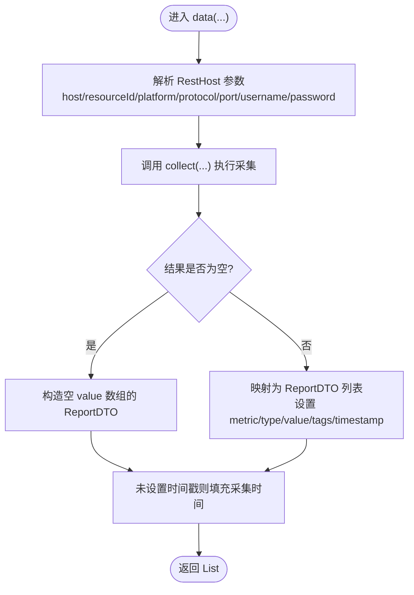

图表来源
- [DataReportCollector.java:48-86](file://watcher-sdk/src/main/java/com/virtual/cloud/om/sdk/api/DataReportCollector.java#L48-L86)

章节来源
- [DataReportCollector.java:18-118](file://watcher-sdk/src/main/java/com/virtual/cloud/om/sdk/api/DataReportCollector.java#L18-L118)

### 策略枚举 DataReportTypeByMetricEnum
- 设计要点
  - 将“指标策略（ReportMetricEnum）”与“资源平台（ReportResourceEnum）”进行解耦，支持同一策略在多个平台的差异化实现。
  - 支持“分离维度”（host/domain/cluster 等），便于按层级拆分采集。
  - 提供按策略+平台或策略+分离维度检索实现类型的方法，确保在多实现场景下仍能稳定定位。
- 类图

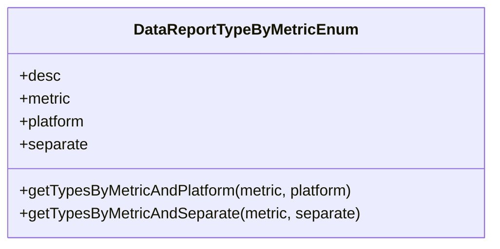

图表来源
- [DataReportTypeByMetricEnum.java:21-190](file://watcher-sdk/src/main/java/com/virtual/cloud/om/sdk/constant/DataReportTypeByMetricEnum.java#L21-L190)

章节来源
- [DataReportTypeByMetricEnum.java:10-190](file://watcher-sdk/src/main/java/com/virtual/cloud/om/sdk/constant/DataReportTypeByMetricEnum.java#L10-L190)

### 数据类型枚举 ReportDataTypeEnum
- 设计要点
  - 统一 data.value 的类型语义，便于上层解析与存储。
  - 常见类型：json、text、gauge、counter、histogra、summary。
- 类图

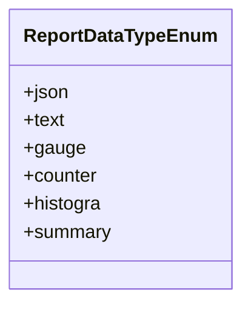

图表来源
- [ReportDataTypeEnum.java:3-17](file://watcher-sdk/src/main/java/com/virtual/cloud/om/sdk/constant/report/ReportDataTypeEnum.java#L3-L17)

章节来源
- [ReportDataTypeEnum.java:1-18](file://watcher-sdk/src/main/java/com/virtual/cloud/om/sdk/constant/report/ReportDataTypeEnum.java#L1-L18)

### 数据载体 DataValueAndTagsDTO 与 ReportDTO
- 设计要点
  - DataValueAndTagsDTO：承载单条采集结果（value/tags/timestamp），作为中间载体。
  - ReportDTO：承载最终上报结构（metric/type/value/tags/timestamp），作为对外输出。
- 类图

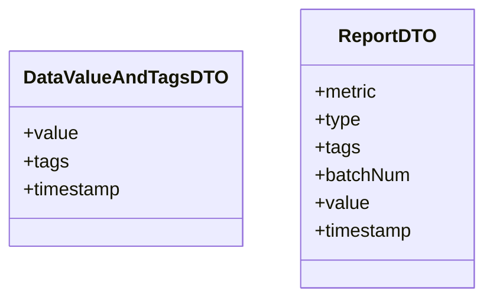

图表来源
- [DataValueAndTagsDTO.java:9-16](file://watcher-sdk/src/main/java/com/virtual/cloud/om/sdk/dto/dataReport/DataValueAndTagsDTO.java#L9-L16)
- [ReportDTO.java:11-24](file://watcher-sdk/src/main/java/com/virtual/cloud/om/sdk/dto/dataReport/workspace/ReportDTO.java#L11-L24)

章节来源
- [DataValueAndTagsDTO.java:1-17](file://watcher-sdk/src/main/java/com/virtual/cloud/om/sdk/dto/dataReport/DataValueAndTagsDTO.java#L1-L17)
- [ReportDTO.java:1-25](file://watcher-sdk/src/main/java/com/virtual/cloud/om/sdk/dto/dataReport/workspace/ReportDTO.java#L1-L25)

### Agent 注册与调度
- DataReportCollectorOverview：启动时扫描所有 DataReportCollector 实现，按 metric 映射到具体实现，便于后续检索。
- DataReportService：根据指标与平台，查找实现类型并并发触发采集，统一处理上下文类加载器与异常。

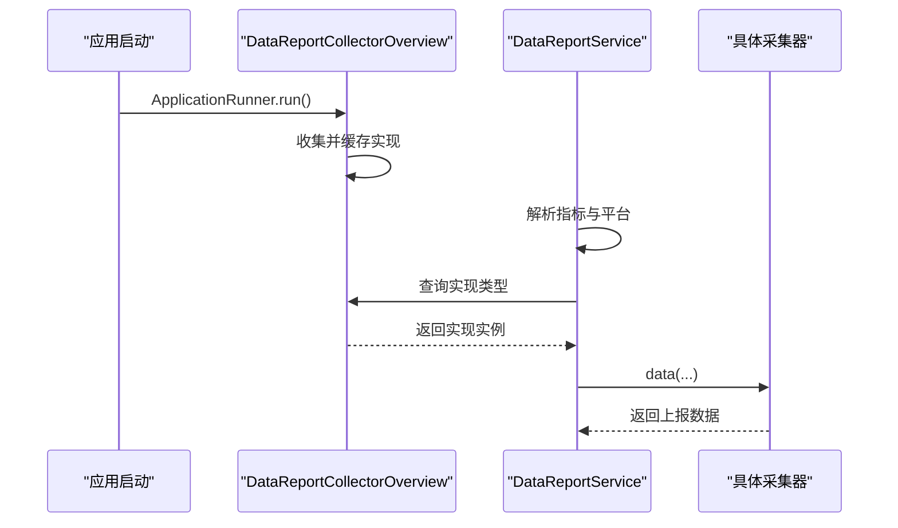

图表来源
- [DataReportCollectorOverview.java:23-45](file://watcher-agent/src/main/java/com/virtual/cloud/om/agent/service/DataReportCollectorOverview.java#L23-L45)
- [DataReportService.java:186-201](file://watcher-agent/src/main/java/com/virtual/cloud/om/agent/service/report/DataReportService.java#L186-L201)

章节来源
- [DataReportCollectorOverview.java:18-45](file://watcher-agent/src/main/java/com/virtual/cloud/om/agent/service/DataReportCollectorOverview.java#L18-L45)
- [DataReportService.java:186-201](file://watcher-agent/src/main/java/com/virtual/cloud/om/agent/service/report/DataReportService.java#L186-L201)

### 标签解析与多目标 ID 提取
- 工具方法 getId(...)：从标签字符串中解析目标 ID 列表，支持“key=value1,value2”形式，返回多 ID。
- TagsUtil.buildTags(...)：构建标准化标签，支持 resourceId、hostIds、clusterIds、domainIds 等类型。

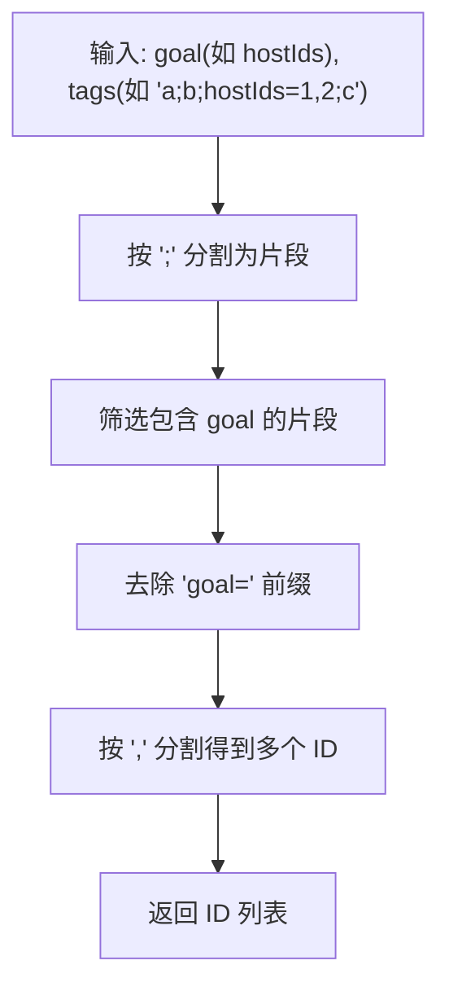

图表来源
- [DataReportCollector.java:27-39](file://watcher-sdk/src/main/java/com/virtual/cloud/om/sdk/api/DataReportCollector.java#L27-L39)
- [TagsUtil.java:21-39](file://watcher-sdk/src/main/java/com/virtual/cloud/om/sdk/utils/TagsUtil.java#L21-L39)

章节来源
- [DataReportCollector.java:27-39](file://watcher-sdk/src/main/java/com/virtual/cloud/om/sdk/api/DataReportCollector.java#L27-L39)
- [TagsUtil.java:11-42](file://watcher-sdk/src/main/java/com/virtual/cloud/om/sdk/utils/TagsUtil.java#L11-L42)

### 具体实现示例与模式

#### CAS 产品线
- 示例：ClusterVirtHostMemTopNCollector
  - 使用 getId(...) 从标签中解析 clusterIds，再基于 REST 接口拉取虚拟机内存 TopN 数据。
  - metric() 返回 DataReportTypeByMetricEnum.cluster_virt_host_mem_TopN，valueType() 返回 ReportDataTypeEnum.json。
- 示例：WorkspaceResourceUserNumberCollector
  - 通过 REST 接口聚合用户数量，返回 gauge 类型数值。
- 示例：UisResourceUserNumberCollector
  - 通过 REST 接口查询操作员数量，返回 gauge 类型数值。

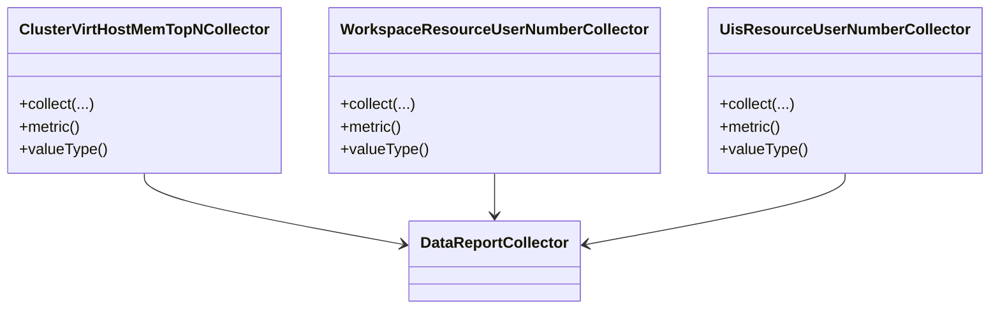

图表来源
- [ClusterVirtHostMemTopNCollector.java:33-69](file://watcher-cas/src/main/java/com/virtual/cloud/om/cas/service/report/ClusterVirtHostMemTopNCollector.java#L33-L69)
- [WorkspaceResourceUserNumberCollector.java:25-62](file://watcher-workspace/src/main/java/com/virtual/cloud/om/workspace/service/report/WorkspaceResourceUserNumberCollector.java#L25-L62)
- [UisResourceUserNumberCollector.java:25-54](file://watcher-uis/src/main/java/com/virtual/cloud/om/uis/service/report/UisResourceUserNumberCollector.java#L25-L54)

章节来源
- [ClusterVirtHostMemTopNCollector.java:30-69](file://watcher-cas/src/main/java/com/virtual/cloud/om/cas/service/report/ClusterVirtHostMemTopNCollector.java#L30-L69)
- [WorkspaceResourceUserNumberCollector.java:22-62](file://watcher-workspace/src/main/java/com/virtual/cloud/om/workspace/service/report/WorkspaceResourceUserNumberCollector.java#L22-L62)
- [UisResourceUserNumberCollector.java:22-54](file://watcher-uis/src/main/java/com/virtual/cloud/om/uis/service/report/UisResourceUserNumberCollector.java#L22-L54)

#### OneStor 产品线
- 示例：StorClusterBandwidthCollector
  - 通过 REST 接口获取集群带宽相关指标，封装为 JSON 结构并返回。
- 示例：HostCapacityMonitorCollector
  - 遍历主机并采集容量监控指标，逐条返回 JSON 结果。

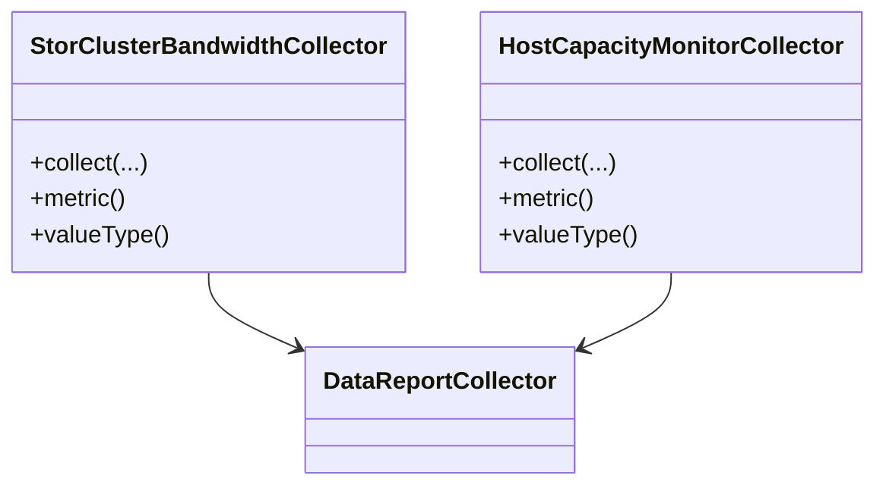

图表来源
- [StorClusterBandwidthCollector.java:37-120](file://watcher-onestor/src/main/java/com/virtual/cloud/om/onestor/service/clusterBasic/StorClusterBandwidthCollector.java#L37-L120)
- [HostCapacityMonitorCollector.java:36-82](file://watcher-onestor/src/main/java/com/virtual/cloud/om/onestor/service/report/monitor/host/HostCapacityMonitorCollector.java#L36-L82)

章节来源
- [StorClusterBandwidthCollector.java:34-120](file://watcher-onestor/src/main/java/com/virtual/cloud/om/onestor/service/clusterBasic/StorClusterBandwidthCollector.java#L34-L120)
- [HostCapacityMonitorCollector.java:33-82](file://watcher-onestor/src/main/java/com/virtual/cloud/om/onestor/service/report/monitor/host/HostCapacityMonitorCollector.java#L33-L82)

## 依赖分析
- 抽象层与实现层
  - 所有产品线采集器均继承 DataReportCollector，遵循统一的模板方法与策略约定。
- 调度层与抽象层
  - Agent 通过 DataReportCollectorOverview 与 DataReportService 在运行时解析并调度具体采集器。
- 类型与数据模型
  - DataReportTypeByMetricEnum 与 ReportDataTypeEnum 为策略与类型契约，贯穿采集与上报流程。

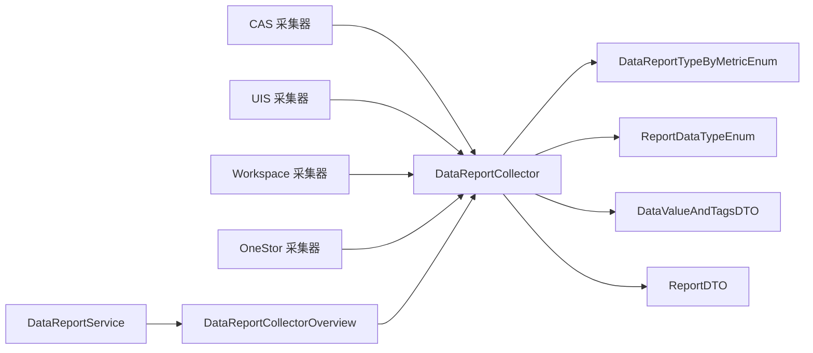

图表来源
- [DataReportCollector.java:18-118](file://watcher-sdk/src/main/java/com/virtual/cloud/om/sdk/api/DataReportCollector.java#L18-L118)
- [DataReportTypeByMetricEnum.java:21-190](file://watcher-sdk/src/main/java/com/virtual/cloud/om/sdk/constant/DataReportTypeByMetricEnum.java#L21-L190)
- [ReportDataTypeEnum.java:3-17](file://watcher-sdk/src/main/java/com/virtual/cloud/om/sdk/constant/report/ReportDataTypeEnum.java#L3-L17)
- [DataValueAndTagsDTO.java:9-16](file://watcher-sdk/src/main/java/com/virtual/cloud/om/sdk/dto/dataReport/DataValueAndTagsDTO.java#L9-L16)
- [ReportDTO.java:11-24](file://watcher-sdk/src/main/java/com/virtual/cloud/om/sdk/dto/dataReport/workspace/ReportDTO.java#L11-L24)
- [DataReportCollectorOverview.java:23-45](file://watcher-agent/src/main/java/com/virtual/cloud/om/agent/service/DataReportCollectorOverview.java#L23-L45)
- [DataReportService.java:186-201](file://watcher-agent/src/main/java/com/virtual/cloud/om/agent/service/report/DataReportService.java#L186-L201)

章节来源
- [DataReportCollector.java:18-118](file://watcher-sdk/src/main/java/com/virtual/cloud/om/sdk/api/DataReportCollector.java#L18-L118)
- [DataReportCollectorOverview.java:18-45](file://watcher-agent/src/main/java/com/virtual/cloud/om/agent/service/DataReportCollectorOverview.java#L18-L45)
- [DataReportService.java:186-201](file://watcher-agent/src/main/java/com/virtual/cloud/om/agent/service/report/DataReportService.java#L186-L201)

## 性能考虑
- 并发采集：Agent 层通过异步与并行方式触发不同指标的采集，减少整体等待时间。
- 结果转换与时间戳处理：在模板方法中统一处理空结果与时间戳回填，避免重复逻辑与潜在误差。
- 标签解析：getId(...) 采用简单字符串分割与过滤，复杂度低，适合高频调用场景。
- 可扩展性：策略枚举支持按平台与分离维度检索，便于在多实现场景下快速定位与扩展。

## 故障排查指南
- 异常类型
  - AppException：统一包装业务异常，携带错误码与消息。
  - ErrorCodes：集中定义错误码，便于国际化与统一处理。
- 常见问题定位
  - 采集器未被发现：检查 DataReportCollectorOverview 是否正确注册实现。
  - 上报数据为空：确认 collect(...) 是否返回空列表，模板方法会自动填充空数组。
  - 时间戳缺失：模板方法会在未设置时间戳时回填采集时间，若仍为空，检查子类是否显式设置了 timestamp。
  - 标签解析失败：确认标签格式是否符合 buildTags(...) 的约定，以及 getId(...) 的目标 key 是否匹配。

章节来源
- [AppException.java:12-45](file://watcher-sdk/src/main/java/com/virtual/cloud/om/sdk/exception/AppException.java#L12-L45)
- [ErrorCodes.java:10-190](file://watcher-sdk/src/main/java/com/virtual/cloud/om/sdk/exception/ErrorCodes.java#L10-L190)
- [DataReportCollector.java:48-86](file://watcher-sdk/src/main/java/com/virtual/cloud/om/sdk/api/DataReportCollector.java#L48-L86)

## 结论
DataReportCollector 抽象层通过模板方法与策略模式，实现了采集流程的标准化与多产品线的可插拔扩展。配合策略枚举与数据模型，形成从“指标策略—平台实现—采集执行—上报输出”的完整闭环。遵循本文提供的实现范式，可在 CAS、UIS、Workspace、OneStor 等产品线上快速扩展新的采集器，提升系统的可维护性与可扩展性。

## 附录
- 快速实现清单
  - 继承 DataReportCollector，实现 collect(...) 采集逻辑。
  - 实现 metric() 返回 DataReportTypeByMetricEnum，valueType() 返回 ReportDataTypeEnum。
  - 若需要从标签中解析多目标 ID，使用 getId(...) 或参考 TagsUtil.buildTags(...) 构建标签。
  - 在 Agent 启动阶段确保实现类被扫描并注册，以便 DataReportCollectorOverview 正常检索。