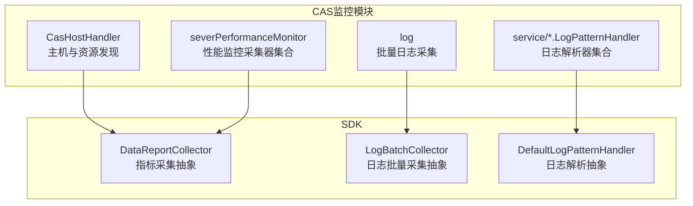
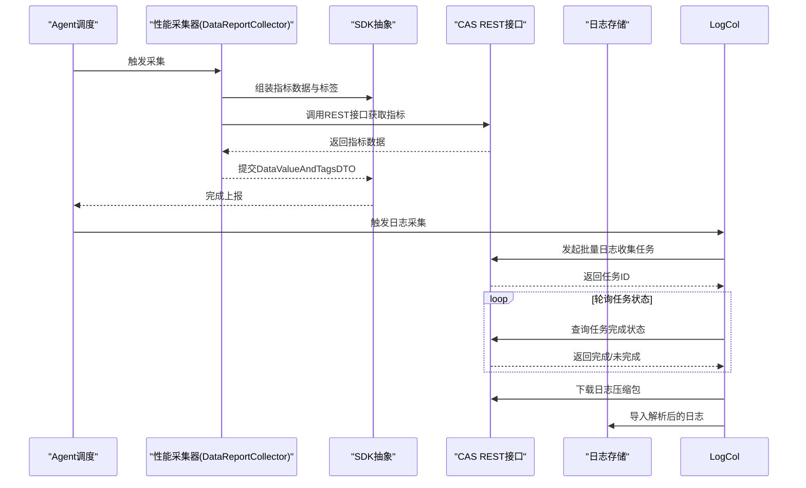
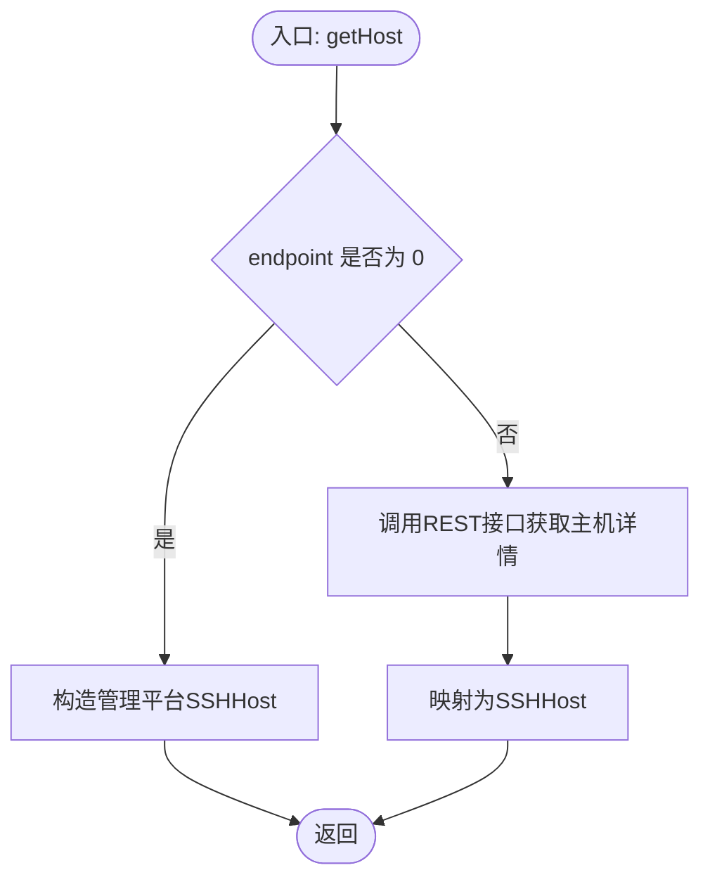
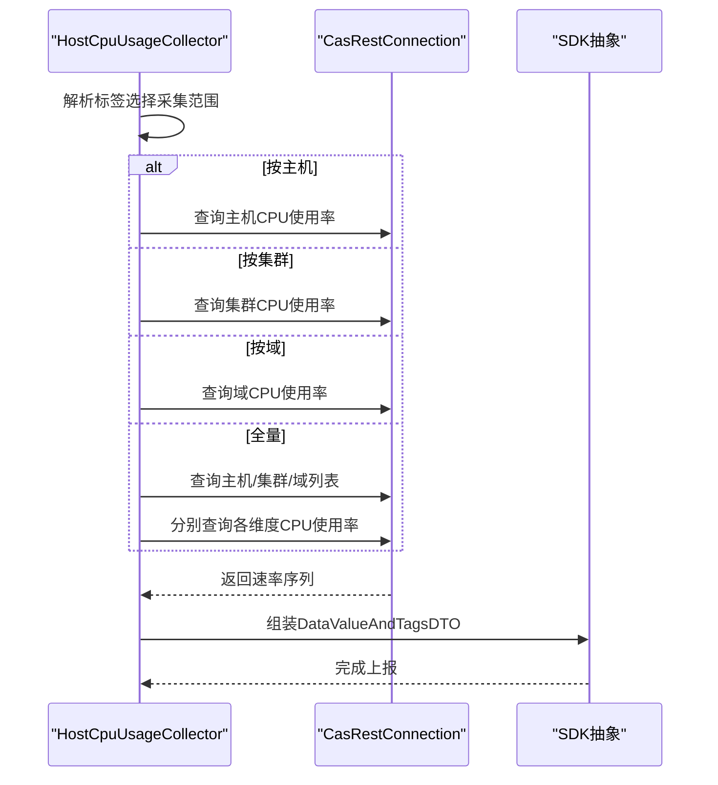
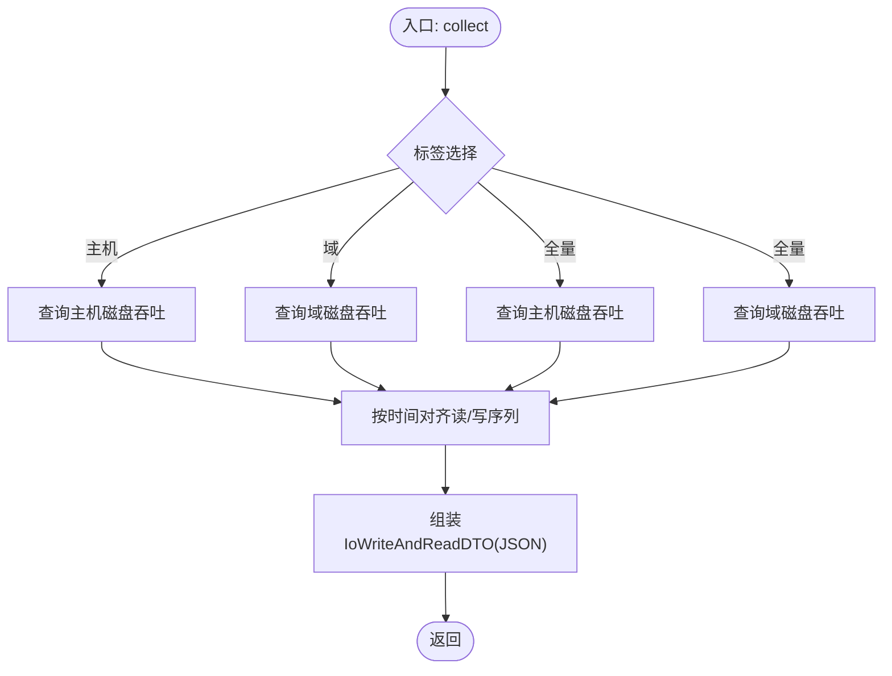
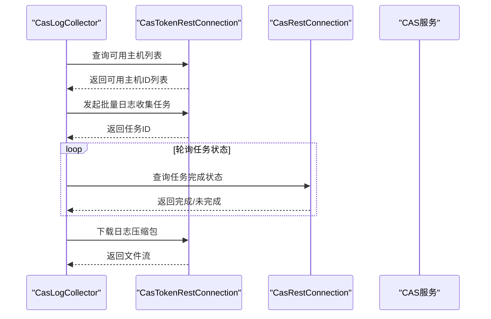
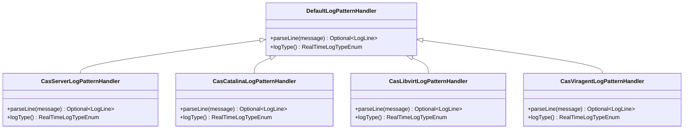
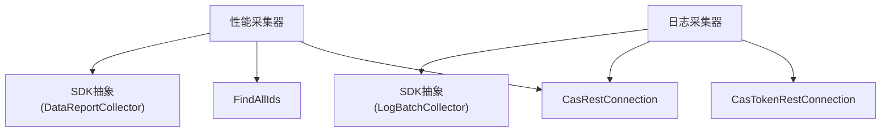

# CAS产品监控模块

<cite>
**本文引用的文件**
- [CasHostHandler.java](file://watcher-cas/src/main/java/com/virtual/cloud/om/cas/service/CasHostHandler.java)
- [CasServerLogPatternHandler.java](file://watcher-cas/src/main/java/com/virtual/cloud/om/cas/service/CasServerLogPatternHandler.java)
- [CasCatalinaLogPatternHandler.java](file://watcher-cas/src/main/java/com/virtual/cloud/om/cas/service/CasCatalinaLogPatternHandler.java)
- [CasLibvirtLogPatternHandler.java](file://watcher-cas/src/main/java/com/virtual/cloud/om/cas/service/CasLibvirtLogPatternHandler.java)
- [CasViragentLogPatternHandler.java](file://watcher-cas/src/main/java/com/virtual/cloud/om/cas/service/CasViragentLogPatternHandler.java)
- [CpuAllocateRateCollector.java](file://watcher-cas/src/main/java/com/virtual/cloud/om/cas/service/severPerformanceMonitor/CpuAllocateRateCollector.java)
- [HostCpuUsageCollector.java](file://watcher-cas/src/main/java/com/virtual/cloud/om/cas/service/severPerformanceMonitor/HostCpuUsageCollector.java)
- [HostMemUsageCollector.java](file://watcher-cas/src/main/java/com/virtual/cloud/om/cas/service/severPerformanceMonitor/HostMemUsageCollector.java)
- [DiskThroughputCollector.java](file://watcher-cas/src/main/java/com/virtual/cloud/om/cas/service/severPerformanceMonitor/DiskThroughputCollector.java)
- [CasLogCollector.java](file://watcher-cas/src/main/java/com/virtual/cloud/om/cas/service/log/CasLogCollector.java)
</cite>

## 目录
1. [简介](#简介)
2. [项目结构](#项目结构)
3. [核心组件](#核心组件)
4. [架构总览](#架构总览)
5. [详细组件分析](#详细组件分析)
6. [依赖分析](#依赖分析)
7. [性能考虑](#性能考虑)
8. [故障排查指南](#故障排查指南)
9. [结论](#结论)
10. [附录](#附录)

## 简介
本文件面向CAS（Cloud Administration System）监控模块，系统性梳理并说明以下能力：
- 主机性能监控：CPU使用率、内存使用率、磁盘吞吐（读写分离聚合）、网络相关指标（基于现有实现可扩展）
- 主机基础信息采集：通过REST接口获取主机列表与基础详情
- 集群资源监控：按集群维度聚合CPU/内存等指标
- 虚拟机资源统计：按域（Domain）维度采集CPU/内存等指标
- 平台版本监控：平台版本与用户数等资源统计
- CAS服务器性能监控器：CPU分配率、内存分配率、磁盘吞吐等关键指标采集逻辑
- 日志采集与解析：服务器日志、虚拟机代理日志、libvirt日志等多类型日志的解析规则与处理流程
- SDK集成与数据上报：监控采集器与SDK的契约、上报类型与标签组织方式
- 扩展指引：新增采集器、扩展指标与优化采集性能的方法

## 项目结构
CAS监控模块位于watcher-cas工程中，主要由三类组件构成：
- 主机与资源发现：通过CasHostHandler对接CAS REST接口，获取主机列表与基础信息
- 性能监控采集器：位于severPerformanceMonitor包，按指标维度实现DataReportCollector子类
- 日志采集与解析：位于log包与service包下的多个LogPatternHandler实现

图表来源
- [CasHostHandler.java:26-60](file://watcher-cas/src/main/java/com/virtual/cloud/om/cas/service/CasHostHandler.java#L26-L60)
- [CpuAllocateRateCollector.java:33-90](file://watcher-cas/src/main/java/com/virtual/cloud/om/cas/service/severPerformanceMonitor/CpuAllocateRateCollector.java#L33-L90)
- [CasLogCollector.java:29-111](file://watcher-cas/src/main/java/com/virtual/cloud/om/cas/service/log/CasLogCollector.java#L29-L111)
- [CasServerLogPatternHandler.java:19-54](file://watcher-cas/src/main/java/com/virtual/cloud/om/cas/service/CasServerLogPatternHandler.java#L19-L54)

章节来源
- [CasHostHandler.java:26-60](file://watcher-cas/src/main/java/com/virtual/cloud/om/cas/service/CasHostHandler.java#L26-L60)
- [CasLogCollector.java:29-111](file://watcher-cas/src/main/java/com/virtual/cloud/om/cas/service/log/CasLogCollector.java#L29-L111)

## 核心组件
- 主机与资源发现
  - 通过CasHostHandler对接CAS REST接口，支持按endpoint获取主机详情或查询全部主机ID，用于后续指标采集与日志收集的目标筛选
- 性能监控采集器
  - 基于DataReportCollector抽象，实现CPU使用率、内存使用率、磁盘吞吐等指标采集，并按主机/集群/域维度输出
- 日志采集与解析
  - CasLogCollector负责批量日志采集与下载；各LogPatternHandler实现对不同日志格式的解析

章节来源
- [CasHostHandler.java:32-59](file://watcher-cas/src/main/java/com/virtual/cloud/om/cas/service/CasHostHandler.java#L32-L59)
- [HostCpuUsageCollector.java:44-57](file://watcher-cas/src/main/java/com/virtual/cloud/om/cas/service/severPerformanceMonitor/HostCpuUsageCollector.java#L44-L57)
- [HostMemUsageCollector.java:40-53](file://watcher-cas/src/main/java/com/virtual/cloud/om/cas/service/severPerformanceMonitor/HostMemUsageCollector.java#L40-L53)
- [DiskThroughputCollector.java:42-54](file://watcher-cas/src/main/java/com/virtual/cloud/om/cas/service/severPerformanceMonitor/DiskThroughputCollector.java#L42-L54)
- [CasLogCollector.java:34-102](file://watcher-cas/src/main/java/com/virtual/cloud/om/cas/service/log/CasLogCollector.java#L34-L102)

## 架构总览
CAS监控模块围绕“采集-解析-上报”闭环构建：
- 采集层：DataReportCollector派生类负责指标采集；LogBatchCollector派生类负责日志批量采集
- 解析层：DefaultLogPatternHandler派生类负责按日志格式解析为统一LogLine模型
- 上报层：SDK提供DataReportCollector与LogBatchCollector抽象，统一指标与日志上报契约

图表来源
- [CpuAllocateRateCollector.java:39-77](file://watcher-cas/src/main/java/com/virtual/cloud/om/cas/service/severPerformanceMonitor/CpuAllocateRateCollector.java#L39-L77)
- [HostCpuUsageCollector.java:44-57](file://watcher-cas/src/main/java/com/virtual/cloud/om/cas/service/severPerformanceMonitor/HostCpuUsageCollector.java#L44-L57)
- [HostMemUsageCollector.java:40-53](file://watcher-cas/src/main/java/com/virtual/cloud/om/cas/service/severPerformanceMonitor/HostMemUsageCollector.java#L40-L53)
- [DiskThroughputCollector.java:42-54](file://watcher-cas/src/main/java/com/virtual/cloud/om/cas/service/severPerformanceMonitor/DiskThroughputCollector.java#L42-L54)
- [CasLogCollector.java:57-90](file://watcher-cas/src/main/java/com/virtual/cloud/om/cas/service/log/CasLogCollector.java#L57-L90)

## 详细组件分析

### 主机与资源发现（CasHostHandler）
- 功能要点
  - 支持根据endpoint区分“管理平台”与具体主机，生成SSHHost对象
  - 提供查询全部主机ID的能力，用于后续指标与日志采集的目标筛选
- 关键行为
  - endpoint=0时直接构造管理平台标识的SSHHost
  - 其他endpoint调用REST接口获取主机基础信息并映射为SSHHost

图表来源
- [CasHostHandler.java:32-42](file://watcher-cas/src/main/java/com/virtual/cloud/om/cas/service/CasHostHandler.java#L32-L42)

章节来源
- [CasHostHandler.java:32-59](file://watcher-cas/src/main/java/com/virtual/cloud/om/cas/service/CasHostHandler.java#L32-L59)

### 主机性能监控器（CPU使用率、内存使用率、磁盘吞吐）

#### CPU使用率采集（HostCpuUsageCollector）
- 采集范围
  - 支持按主机ID、集群ID、域ID或全量采集
  - 全量时分别查询主机、集群、域的全部列表并合并
- 数据来源
  - 分别调用主机、集群、域的CPU使用率接口，取最新时间点的速率
- 输出
  - 指标类型：gauge
  - 标签：包含资源ID类型与对应ID

图表来源
- [HostCpuUsageCollector.java:44-201](file://watcher-cas/src/main/java/com/virtual/cloud/om/cas/service/severPerformanceMonitor/HostCpuUsageCollector.java#L44-L201)

章节来源
- [HostCpuUsageCollector.java:44-216](file://watcher-cas/src/main/java/com/virtual/cloud/om/cas/service/severPerformanceMonitor/HostCpuUsageCollector.java#L44-L216)

#### 内存使用率采集（HostMemUsageCollector）
- 采集范围与策略同CPU使用率采集
- 数据来源：主机/集群/域内存使用率接口，取最新时间点的速率
- 输出：gauge类型指标，带相应标签

章节来源
- [HostMemUsageCollector.java:40-192](file://watcher-cas/src/main/java/com/virtual/cloud/om/cas/service/severPerformanceMonitor/HostMemUsageCollector.java#L40-L192)

#### 磁盘吞吐采集（DiskThroughputCollector）
- 采集范围：主机或域维度
- 数据来源：主机IO IOPS或域磁盘吞吐接口
- 处理逻辑：读/写序列按时间对齐，组装IoWriteAndReadDTO作为JSON值
- 输出：json类型指标，带设备名标签

图表来源
- [DiskThroughputCollector.java:42-153](file://watcher-cas/src/main/java/com/virtual/cloud/om/cas/service/severPerformanceMonitor/DiskThroughputCollector.java#L42-L153)

章节来源
- [DiskThroughputCollector.java:42-192](file://watcher-cas/src/main/java/com/virtual/cloud/om/cas/service/severPerformanceMonitor/DiskThroughputCollector.java#L42-L192)

#### CPU分配率采集（CpuAllocateRateCollector）
- 采集范围：主机维度
- 数据来源：主机详情接口中的CPU超分比
- 输出：gauge类型指标，带主机ID标签

章节来源
- [CpuAllocateRateCollector.java:39-90](file://watcher-cas/src/main/java/com/virtual/cloud/om/cas/service/severPerformanceMonitor/CpuAllocateRateCollector.java#L39-L90)

### 日志采集与解析

#### 批量日志采集（CasLogCollector）
- 流程
  - 获取可用主机列表，过滤非法输入的hostId
  - 发起批量日志收集任务，轮询任务完成状态
  - 下载日志压缩包并导入
- 异常处理
  - 对非法hostId记录错误日志
  - 下载异常返回失败

图表来源
- [CasLogCollector.java:34-102](file://watcher-cas/src/main/java/com/virtual/cloud/om/cas/service/log/CasLogCollector.java#L34-L102)

章节来源
- [CasLogCollector.java:34-111](file://watcher-cas/src/main/java/com/virtual/cloud/om/cas/service/log/CasLogCollector.java#L34-L111)

#### 日志解析器（LogPatternHandler）
- 通用模式
  - 继承DefaultLogPatternHandler，实现parseLine将原始日志行解析为LogLine
  - 指定logType以区分不同日志类型
- 典型实现
  - 服务器日志（CasServerLogPatternHandler）：解析时间、级别、线程、方法、消息
  - Catalina日志（CasCatalinaLogPatternHandler）：与服务器日志相同格式
  - Libvirt日志（CasLibvirtLogPatternHandler）：解析时间、级别、方法、行号、消息
  - Viragent日志（CasViragentLogPatternHandler）：与Libvirt类似格式

图表来源
- [CasServerLogPatternHandler.java:19-54](file://watcher-cas/src/main/java/com/virtual/cloud/om/cas/service/CasServerLogPatternHandler.java#L19-L54)
- [CasCatalinaLogPatternHandler.java:16-51](file://watcher-cas/src/main/java/com/virtual/cloud/om/cas/service/CasCatalinaLogPatternHandler.java#L16-L51)
- [CasLibvirtLogPatternHandler.java:16-51](file://watcher-cas/src/main/java/com/virtual/cloud/om/cas/service/CasLibvirtLogPatternHandler.java#L16-L51)
- [CasViragentLogPatternHandler.java:16-52](file://watcher-cas/src/main/java/com/virtual/cloud/om/cas/service/CasViragentLogPatternHandler.java#L16-L52)

章节来源
- [CasServerLogPatternHandler.java:25-53](file://watcher-cas/src/main/java/com/virtual/cloud/om/cas/service/CasServerLogPatternHandler.java#L25-L53)
- [CasCatalinaLogPatternHandler.java:22-50](file://watcher-cas/src/main/java/com/virtual/cloud/om/cas/service/CasCatalinaLogPatternHandler.java#L22-L50)
- [CasLibvirtLogPatternHandler.java:22-50](file://watcher-cas/src/main/java/com/virtual/cloud/om/cas/service/CasLibvirtLogPatternHandler.java#L22-L50)
- [CasViragentLogPatternHandler.java:22-51](file://watcher-cas/src/main/java/com/virtual/cloud/om/cas/service/CasViragentLogPatternHandler.java#L22-L51)

### 平台版本与用户数等资源统计
- 该模块提供多种资源统计采集器（如平台版本、用户数等），通过DataReportCollector实现，遵循统一的指标上报契约
- 由于篇幅限制，此处不展开具体文件分析，可参考其他采集器的实现模式进行扩展

## 依赖分析
- 组件耦合
  - 性能采集器依赖CasRestConnection与FindAllIds（用于动态获取ID列表）
  - 日志采集器依赖CasTokenRestConnection与CasRestConnection
  - 所有采集器均继承SDK提供的DataReportCollector或LogBatchCollector抽象
- 外部依赖
  - CAS REST接口：主机、集群、域、日志等接口
  - 时间戳转换工具：统一时间格式处理
  - 标签工具：统一标签拼装

图表来源
- [CpuAllocateRateCollector.java:35-37](file://watcher-cas/src/main/java/com/virtual/cloud/om/cas/service/severPerformanceMonitor/CpuAllocateRateCollector.java#L35-L37)
- [HostCpuUsageCollector.java:39-42](file://watcher-cas/src/main/java/com/virtual/cloud/om/cas/service/severPerformanceMonitor/HostCpuUsageCollector.java#L39-L42)
- [HostMemUsageCollector.java:35-38](file://watcher-cas/src/main/java/com/virtual/cloud/om/cas/service/severPerformanceMonitor/HostMemUsageCollector.java#L35-L38)
- [DiskThroughputCollector.java:37-39](file://watcher-cas/src/main/java/com/virtual/cloud/om/cas/service/severPerformanceMonitor/DiskThroughputCollector.java#L37-L39)
- [CasLogCollector.java:30-31](file://watcher-cas/src/main/java/com/virtual/cloud/om/cas/service/log/CasLogCollector.java#L30-L31)

章节来源
- [CpuAllocateRateCollector.java:35-37](file://watcher-cas/src/main/java/com/virtual/cloud/om/cas/service/severPerformanceMonitor/CpuAllocateRateCollector.java#L35-L37)
- [HostCpuUsageCollector.java:39-42](file://watcher-cas/src/main/java/com/virtual/cloud/om/cas/service/severPerformanceMonitor/HostCpuUsageCollector.java#L39-L42)
- [HostMemUsageCollector.java:35-38](file://watcher-cas/src/main/java/com/virtual/cloud/om/cas/service/severPerformanceMonitor/HostMemUsageCollector.java#L35-L38)
- [DiskThroughputCollector.java:37-39](file://watcher-cas/src/main/java/com/virtual/cloud/om/cas/service/severPerformanceMonitor/DiskThroughputCollector.java#L37-L39)
- [CasLogCollector.java:30-31](file://watcher-cas/src/main/java/com/virtual/cloud/om/cas/service/log/CasLogCollector.java#L30-L31)

## 性能考虑
- 并行采集
  - 多个采集器使用并行流对主机/域ID列表进行并行请求，提升整体采集效率
- 最新时间点选取
  - 对速率序列按时间降序取第一条，避免重复计算与历史噪声
- 标签与ID缓存
  - 优先从标签中提取ID，必要时通过FindAllIds动态获取，减少无效请求
- 日志采集轮询
  - 使用固定间隔轮询任务状态，避免频繁阻塞与资源浪费

## 故障排查指南
- 采集失败
  - 检查REST连接参数与权限
  - 查看采集器日志中的错误堆栈与URL
- 日志采集异常
  - 确认输入的hostId存在于可用主机列表中
  - 检查下载阶段的IO异常与网络连通性
- 时间戳解析异常
  - 核对时间格式与转换工具的输入格式一致性

章节来源
- [HostCpuUsageCollector.java:82-83](file://watcher-cas/src/main/java/com/virtual/cloud/om/cas/service/severPerformanceMonitor/HostCpuUsageCollector.java#L82-L83)
- [HostMemUsageCollector.java:76-78](file://watcher-cas/src/main/java/com/virtual/cloud/om/cas/service/severPerformanceMonitor/HostMemUsageCollector.java#L76-L78)
- [DiskThroughputCollector.java:78-80](file://watcher-cas/src/main/java/com/virtual/cloud/om/cas/service/severPerformanceMonitor/DiskThroughputCollector.java#L78-L80)
- [CasLogCollector.java:97-99](file://watcher-cas/src/main/java/com/virtual/cloud/om/cas/service/log/CasLogCollector.java#L97-L99)

## 结论
CAS监控模块通过标准化的采集器与解析器，实现了对主机、集群、域等多维度的性能指标采集与日志批量采集。其设计遵循SDK抽象，具备良好的扩展性与可维护性。建议在新增指标或日志类型时，复用现有抽象与工具类，确保上报格式一致与性能稳定。

## 附录

### 新增CAS监控采集器步骤
- 继承DataReportCollector，实现collect方法
- 在collect中：
  - 解析标签，确定采集范围（主机/集群/域/全量）
  - 调用CasRestConnection获取指标数据
  - 组装DataValueAndTagsDTO并设置时间戳与标签
- 实现metric与valueType，声明指标类型与值类型
- 将采集器注册为Spring组件，参与调度

章节来源
- [CpuAllocateRateCollector.java:39-90](file://watcher-cas/src/main/java/com/virtual/cloud/om/cas/service/severPerformanceMonitor/CpuAllocateRateCollector.java#L39-L90)
- [HostCpuUsageCollector.java:44-57](file://watcher-cas/src/main/java/com/virtual/cloud/om/cas/service/severPerformanceMonitor/HostCpuUsageCollector.java#L44-L57)
- [HostMemUsageCollector.java:40-53](file://watcher-cas/src/main/java/com/virtual/cloud/om/cas/service/severPerformanceMonitor/HostMemUsageCollector.java#L40-L53)
- [DiskThroughputCollector.java:42-54](file://watcher-cas/src/main/java/com/virtual/cloud/om/cas/service/severPerformanceMonitor/DiskThroughputCollector.java#L42-L54)

### 扩展日志解析器步骤
- 继承DefaultLogPatternHandler，编写正则表达式匹配目标日志格式
- 实现parseLine，将匹配字段映射到LogLine
- 实现logType，指定日志类型枚举
- 注册为Spring组件，参与日志解析流程

章节来源
- [CasServerLogPatternHandler.java:25-53](file://watcher-cas/src/main/java/com/virtual/cloud/om/cas/service/CasServerLogPatternHandler.java#L25-L53)
- [CasLibvirtLogPatternHandler.java:22-50](file://watcher-cas/src/main/java/com/virtual/cloud/om/cas/service/CasLibvirtLogPatternHandler.java#L22-L50)
- [CasViragentLogPatternHandler.java:22-51](file://watcher-cas/src/main/java/com/virtual/cloud/om/cas/service/CasViragentLogPatternHandler.java#L22-L51)