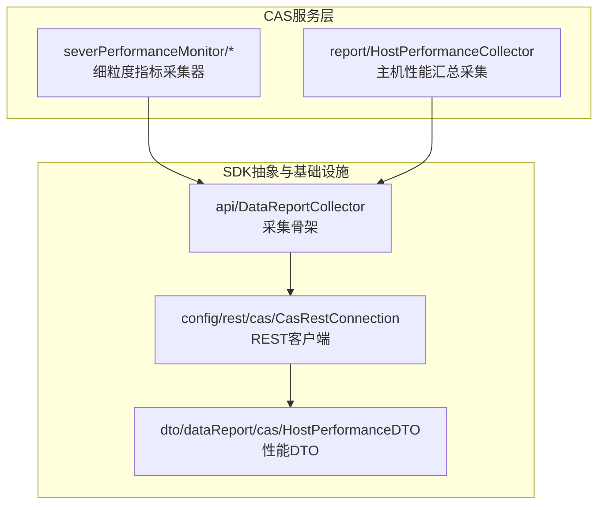
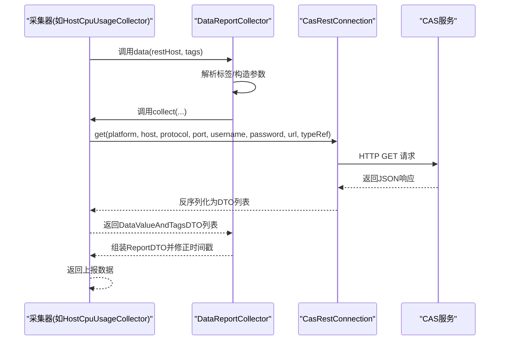
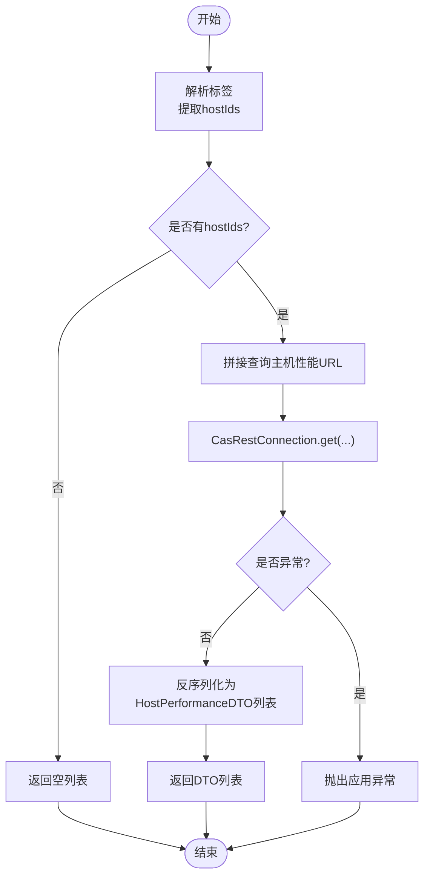
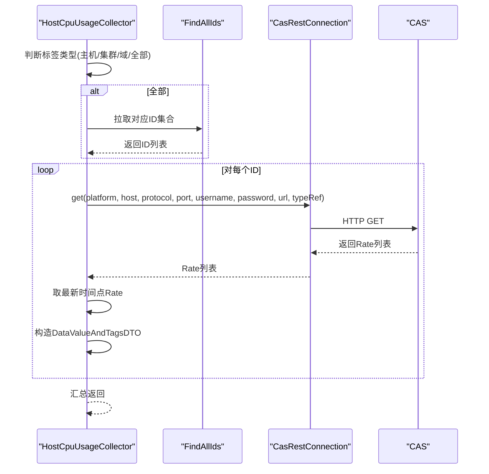
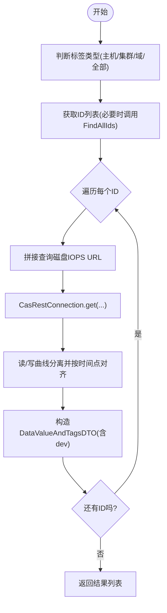
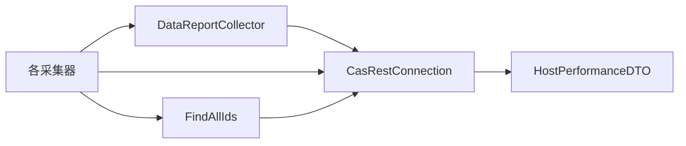

# 主机性能监控

<cite>
**本文引用的文件**   
- [HostPerformanceCollector.java](file://watcher-cas/src/main/java/com/virtual/cloud/om/cas/service/report/HostPerformanceCollector.java)
- [HostCpuUsageCollector.java](file://watcher-cas/src/main/java/com/virtual/cloud/om/cas/service/severPerformanceMonitor/HostCpuUsageCollector.java)
- [HostMemUsageCollector.java](file://watcher-cas/src/main/java/com/virtual/cloud/om/cas/service/severPerformanceMonitor/HostMemUsageCollector.java)
- [HostDiskIopsCollector.java](file://watcher-cas/src/main/java/com/virtual/cloud/om/cas/service/severPerformanceMonitor/HostDiskIopsCollector.java)
- [HostNetIopsCollector.java](file://watcher-cas/src/main/java/com/virtual/cloud/om/cas/service/severPerformanceMonitor/HostNetIopsCollector.java)
- [FindAllIds.java](file://watcher-cas/src/main/java/com/virtual/cloud/om/cas/service/severPerformanceMonitor/FindAllIds.java)
- [HostPerformanceDTO.java](file://watcher-sdk/src/main/java/com/virtual/cloud/om/sdk/dto/dataReport/cas/HostPerformanceDTO.java)
- [DataReportCollector.java](file://watcher-sdk/src/main/java/com/virtual/cloud/om/sdk/api/DataReportCollector.java)
- [CasRestConnection.java](file://watcher-sdk/src/main/java/com/virtual/cloud/om/sdk/config/rest/cas/CasRestConnection.java)
</cite>

## 目录
1. [简介](#简介)
2. [项目结构](#项目结构)
3. [核心组件](#核心组件)
4. [架构总览](#架构总览)
5. [详细组件分析](#详细组件分析)
6. [依赖分析](#依赖分析)
7. [性能考虑](#性能考虑)
8. [故障排查指南](#故障排查指南)
9. [结论](#结论)
10. [附录](#附录)

## 简介
本技术文档聚焦于CAS主机性能监控能力，系统性阐述主机性能数据采集的完整实现，覆盖CPU使用率、内存使用率、磁盘IOPS（读写分离聚合）、网络IOPS（收发配对）等关键指标。文档深入解析以下内容：
- HostPerformanceCollector类的实现机制：如何通过REST API获取主机性能数据，请求参数构造、响应数据解析与异常处理。
- 服务器性能监控器的实现：HostCpuUsageCollector、HostMemUsageCollector、HostDiskIopsCollector、HostNetIopsCollector的具体工作原理。
- 扩展新性能监控指标的方法与最佳实践。
- 性能监控数据的上报机制与与SDK的集成方式。

## 项目结构
围绕CAS主机性能监控的关键模块分布如下：
- CAS侧服务层：report与severPerformanceMonitor两个包分别承载“主机性能汇总”与“细粒度指标采集”两类职责。
- SDK侧抽象与基础设施：DataReportCollector定义采集骨架；CasRestConnection封装REST调用；HostPerformanceDTO等DTO描述响应结构。

图表来源
- [HostPerformanceCollector.java:32-67](file://watcher-cas/src/main/java/com/virtual/cloud/om/cas/service/report/HostPerformanceCollector.java#L32-L67)
- [HostCpuUsageCollector.java:37-215](file://watcher-cas/src/main/java/com/virtual/cloud/om/cas/service/severPerformanceMonitor/HostCpuUsageCollector.java#L37-L215)
- [HostMemUsageCollector.java:34-191](file://watcher-cas/src/main/java/com/virtual/cloud/om/cas/service/severPerformanceMonitor/HostMemUsageCollector.java#L34-L191)
- [HostDiskIopsCollector.java:37-223](file://watcher-cas/src/main/java/com/virtual/cloud/om/cas/service/severPerformanceMonitor/HostDiskIopsCollector.java#L37-L223)
- [HostNetIopsCollector.java:34-181](file://watcher-cas/src/main/java/com/virtual/cloud/om/cas/service/severPerformanceMonitor/HostNetIopsCollector.java#L34-L181)
- [DataReportCollector.java:19-117](file://watcher-sdk/src/main/java/com/virtual/cloud/om/sdk/api/DataReportCollector.java#L19-L117)
- [CasRestConnection.java:26-160](file://watcher-sdk/src/main/java/com/virtual/cloud/om/sdk/config/rest/cas/CasRestConnection.java#L26-L160)
- [HostPerformanceDTO.java:19-42](file://watcher-sdk/src/main/java/com/virtual/cloud/om/sdk/dto/dataReport/cas/HostPerformanceDTO.java#L19-L42)

章节来源
- [HostPerformanceCollector.java:1-68](file://watcher-cas/src/main/java/com/virtual/cloud/om/cas/service/report/HostPerformanceCollector.java#L1-L68)
- [HostCpuUsageCollector.java:1-216](file://watcher-cas/src/main/java/com/virtual/cloud/om/cas/service/severPerformanceMonitor/HostCpuUsageCollector.java#L1-L216)
- [HostMemUsageCollector.java:1-192](file://watcher-cas/src/main/java/com/virtual/cloud/om/cas/service/severPerformanceMonitor/HostMemUsageCollector.java#L1-L192)
- [HostDiskIopsCollector.java:1-224](file://watcher-cas/src/main/java/com/virtual/cloud/om/cas/service/severPerformanceMonitor/HostDiskIopsCollector.java#L1-L224)
- [HostNetIopsCollector.java:1-182](file://watcher-cas/src/main/java/com/virtual/cloud/om/cas/service/severPerformanceMonitor/HostNetIopsCollector.java#L1-L182)
- [FindAllIds.java:1-86](file://watcher-cas/src/main/java/com/virtual/cloud/om/cas/service/severPerformanceMonitor/FindAllIds.java#L1-L86)
- [HostPerformanceDTO.java:1-43](file://watcher-sdk/src/main/java/com/virtual/cloud/om/sdk/dto/dataReport/cas/HostPerformanceDTO.java#L1-L43)
- [DataReportCollector.java:1-118](file://watcher-sdk/src/main/java/com/virtual/cloud/om/sdk/api/DataReportCollector.java#L1-L118)
- [CasRestConnection.java:1-161](file://watcher-sdk/src/main/java/com/virtual/cloud/om/sdk/config/rest/cas/CasRestConnection.java#L1-L161)

## 核心组件
- HostPerformanceCollector：面向“主机性能汇总”的采集器，负责从CAS查询主机实时性能（CPU、内存、IO、网络），并以JSON格式返回。
- HostCpuUsageCollector：按主机/集群/域维度采集CPU使用率，支持全量或指定ID集合，返回gauge数值。
- HostMemUsageCollector：按主机/集群/域维度采集内存使用率，返回gauge数值。
- HostDiskIopsCollector：按主机/集群/域维度采集磁盘IOPS，读写分离后按时间点对齐聚合，返回json对象（包含读/写）。
- HostNetIopsCollector：按主机/域维度采集网络IOPS，按网卡设备对齐收发速率，返回json对象（包含发送/接收）。
- FindAllIds：在未显式传入ID时，自动拉取全量主机/集群/域ID集合，用于批量采集。
- DataReportCollector：采集器抽象基类，统一处理标签解析、采集流程、上报结构转换与时间戳修正。
- CasRestConnection：CAS REST客户端，封装HTTP方法、认证、端口选择、异常映射与请求记录。

章节来源
- [HostPerformanceCollector.java:32-67](file://watcher-cas/src/main/java/com/virtual/cloud/om/cas/service/report/HostPerformanceCollector.java#L32-L67)
- [HostCpuUsageCollector.java:37-215](file://watcher-cas/src/main/java/com/virtual/cloud/om/cas/service/severPerformanceMonitor/HostCpuUsageCollector.java#L37-L215)
- [HostMemUsageCollector.java:34-191](file://watcher-cas/src/main/java/com/virtual/cloud/om/cas/service/severPerformanceMonitor/HostMemUsageCollector.java#L34-L191)
- [HostDiskIopsCollector.java:37-223](file://watcher-cas/src/main/java/com/virtual/cloud/om/cas/service/severPerformanceMonitor/HostDiskIopsCollector.java#L37-L223)
- [HostNetIopsCollector.java:34-181](file://watcher-cas/src/main/java/com/virtual/cloud/om/cas/service/severPerformanceMonitor/HostNetIopsCollector.java#L34-L181)
- [FindAllIds.java:27-85](file://watcher-cas/src/main/java/com/virtual/cloud/om/cas/service/severPerformanceMonitor/FindAllIds.java#L27-L85)
- [DataReportCollector.java:19-117](file://watcher-sdk/src/main/java/com/virtual/cloud/om/sdk/api/DataReportCollector.java#L19-L117)
- [CasRestConnection.java:26-160](file://watcher-sdk/src/main/java/com/virtual/cloud/om/sdk/config/rest/cas/CasRestConnection.java#L26-L160)

## 架构总览
CAS主机性能监控采用“采集器抽象 + REST客户端 + DTO模型”的分层设计。采集器通过标签识别目标范围（主机/集群/域/全部），调用CasRestConnection发起REST请求，解析响应为统一的DataValueAndTagsDTO结构，再由DataReportCollector组装为上报结构。

图表来源
- [HostCpuUsageCollector.java:44-58](file://watcher-cas/src/main/java/com/virtual/cloud/om/cas/service/severPerformanceMonitor/HostCpuUsageCollector.java#L44-L58)
- [DataReportCollector.java:48-86](file://watcher-sdk/src/main/java/com/virtual/cloud/om/sdk/api/DataReportCollector.java#L48-L86)
- [CasRestConnection.java:113-117](file://watcher-sdk/src/main/java/com/virtual/cloud/om/sdk/config/rest/cas/CasRestConnection.java#L113-L117)

## 详细组件分析

### HostPerformanceCollector：主机性能汇总采集
- 角色定位：面向“主机性能汇总”的采集器，返回CPU、内存、IO、网络等综合指标。
- 请求路径：根据标签中的hostIds提取首个主机ID，拼接查询主机性能的URL，调用CasRestConnection执行GET。
- 响应解析：将返回的列表反序列化为HostPerformanceDTO列表。
- 异常处理：捕获异常并抛出应用级异常，包含URL与错误信息。
- 上报类型：valueType为json，metric为host_performance。

图表来源
- [HostPerformanceCollector.java:35-56](file://watcher-cas/src/main/java/com/virtual/cloud/om/cas/service/report/HostPerformanceCollector.java#L35-L56)
- [HostPerformanceDTO.java:19-42](file://watcher-sdk/src/main/java/com/virtual/cloud/om/sdk/dto/dataReport/cas/HostPerformanceDTO.java#L19-L42)

章节来源
- [HostPerformanceCollector.java:32-67](file://watcher-cas/src/main/java/com/virtual/cloud/om/cas/service/report/HostPerformanceCollector.java#L32-L67)
- [HostPerformanceDTO.java:19-42](file://watcher-sdk/src/main/java/com/virtual/cloud/om/sdk/dto/dataReport/cas/HostPerformanceDTO.java#L19-L42)

### HostCpuUsageCollector：主机CPU使用率采集
- 目标范围：支持按主机、集群、域或全量采集；当标签包含“全部”占位符时，通过FindAllIds自动拉取ID集合。
- 请求与解析：针对每个ID构建查询URL，调用CasRestConnection获取Rate列表，取最新时间点作为值。
- 并行策略：主机/集群/域维度均采用并行流提升吞吐。
- 上报结构：value为gauge数值，timestamp为最新采样时间，tags包含资源ID与目标类型标识。

图表来源
- [HostCpuUsageCollector.java:44-201](file://watcher-cas/src/main/java/com/virtual/cloud/om/cas/service/severPerformanceMonitor/HostCpuUsageCollector.java#L44-L201)
- [FindAllIds.java:32-82](file://watcher-cas/src/main/java/com/virtual/cloud/om/cas/service/severPerformanceMonitor/FindAllIds.java#L32-L82)

章节来源
- [HostCpuUsageCollector.java:37-215](file://watcher-cas/src/main/java/com/virtual/cloud/om/cas/service/severPerformanceMonitor/HostCpuUsageCollector.java#L37-L215)
- [FindAllIds.java:27-85](file://watcher-cas/src/main/java/com/virtual/cloud/om/cas/service/severPerformanceMonitor/FindAllIds.java#L27-L85)

### HostMemUsageCollector：主机内存使用率采集
- 逻辑与CPU采集一致，但返回值为内存使用率gauge。
- 支持主机/集群/域/全部四种模式，内部通过FindAllIds与并行流实现高效采集。

章节来源
- [HostMemUsageCollector.java:34-191](file://watcher-cas/src/main/java/com/virtual/cloud/om/cas/service/severPerformanceMonitor/HostMemUsageCollector.java#L34-L191)
- [FindAllIds.java:32-82](file://watcher-cas/src/main/java/com/virtual/cloud/om/cas/service/severPerformanceMonitor/FindAllIds.java#L32-L82)

### HostDiskIopsCollector：主机磁盘IOPS采集
- 读写分离：从趋势数据中筛选“读/写”两条曲线，按设备名与时间点对齐，计算同一时刻的读/写速率。
- 并行策略：主机维度采用CompletableFuture并行拉取各设备的IOPS趋势，减少串行等待。
- 上报结构：value为json对象（包含读/写），tags附加设备标识，timestamp为最新采样时间。

图表来源
- [HostDiskIopsCollector.java:42-195](file://watcher-cas/src/main/java/com/virtual/cloud/om/cas/service/severPerformanceMonitor/HostDiskIopsCollector.java#L42-L195)
- [FindAllIds.java:32-82](file://watcher-cas/src/main/java/com/virtual/cloud/om/cas/service/severPerformanceMonitor/FindAllIds.java#L32-L82)

章节来源
- [HostDiskIopsCollector.java:37-223](file://watcher-cas/src/main/java/com/virtual/cloud/om/cas/service/severPerformanceMonitor/HostDiskIopsCollector.java#L37-L223)
- [FindAllIds.java:27-85](file://watcher-cas/src/main/java/com/virtual/cloud/om/cas/service/severPerformanceMonitor/FindAllIds.java#L27-L85)

### HostNetIopsCollector：主机网络IOPS采集
- 支持主机与域两种模式：主机维度返回“发送/接收”速率；域维度返回PerfDataDTO的收发配对。
- 读取策略：按设备名称匹配“发送/接收”曲线，按时间点对齐生成同一时刻的收发速率对。
- 上报结构：value为json对象（发送/接收），tags附加设备标识，timestamp为最新采样时间。

章节来源
- [HostNetIopsCollector.java:34-181](file://watcher-cas/src/main/java/com/virtual/cloud/om/cas/service/severPerformanceMonitor/HostNetIopsCollector.java#L34-L181)

### DataReportCollector：采集骨架与上报机制
- 标签解析：getId方法从tags字符串中提取目标ID集合。
- 采集流程：data方法统一入口，记录开始/结束时间与耗时，调用子类collect实现。
- 结果组装：将DataValueAndTagsDTO转换为ReportDTO列表，统一设置type与timestamp（若为空则回填采集时间）。
- 抽象方法：metric与valueType由子类实现，决定上报指标名与数据类型。

章节来源
- [DataReportCollector.java:19-117](file://watcher-sdk/src/main/java/com/virtual/cloud/om/sdk/api/DataReportCollector.java#L19-L117)

### CasRestConnection：REST客户端与异常处理
- 方法封装：提供exchange/exchangeResp/get/post/put/delete等方法，统一封装HTTP交互。
- 端口适配：根据平台与协议动态选择CAS端口（http/https）。
- 异常映射：将远端409冲突映射为应用异常，携带错误码与消息；记录请求日志便于排障。
- 连接缓存：通过CasRestClientCache复用RestTemplate实例，降低连接开销。

章节来源
- [CasRestConnection.java:26-160](file://watcher-sdk/src/main/java/com/virtual/cloud/om/sdk/config/rest/cas/CasRestConnection.java#L26-L160)

## 依赖分析
- 采集器对SDK的依赖：所有采集器继承自DataReportCollector，统一使用CasRestConnection进行REST调用。
- ID发现依赖：FindAllIds在未显式传入ID时，通过CasRestConnection拉取全量主机/集群/域ID。
- DTO依赖：HostPerformanceCollector依赖HostPerformanceDTO描述主机性能响应结构。

图表来源
- [DataReportCollector.java:19-117](file://watcher-sdk/src/main/java/com/virtual/cloud/om/sdk/api/DataReportCollector.java#L19-L117)
- [CasRestConnection.java:26-160](file://watcher-sdk/src/main/java/com/virtual/cloud/om/sdk/config/rest/cas/CasRestConnection.java#L26-L160)
- [FindAllIds.java:27-85](file://watcher-cas/src/main/java/com/virtual/cloud/om/cas/service/severPerformanceMonitor/FindAllIds.java#L27-L85)
- [HostPerformanceDTO.java:19-42](file://watcher-sdk/src/main/java/com/virtual/cloud/om/sdk/dto/dataReport/cas/HostPerformanceDTO.java#L19-L42)

章节来源
- [HostCpuUsageCollector.java:37-215](file://watcher-cas/src/main/java/com/virtual/cloud/om/cas/service/severPerformanceMonitor/HostCpuUsageCollector.java#L37-L215)
- [HostMemUsageCollector.java:34-191](file://watcher-cas/src/main/java/com/virtual/cloud/om/cas/service/severPerformanceMonitor/HostMemUsageCollector.java#L34-L191)
- [HostDiskIopsCollector.java:37-223](file://watcher-cas/src/main/java/com/virtual/cloud/om/cas/service/severPerformanceMonitor/HostDiskIopsCollector.java#L37-L223)
- [HostNetIopsCollector.java:34-181](file://watcher-cas/src/main/java/com/virtual/cloud/om/cas/service/severPerformanceMonitor/HostNetIopsCollector.java#L34-L181)
- [FindAllIds.java:27-85](file://watcher-cas/src/main/java/com/virtual/cloud/om/cas/service/severPerformanceMonitor/FindAllIds.java#L27-L85)
- [DataReportCollector.java:19-117](file://watcher-sdk/src/main/java/com/virtual/cloud/om/sdk/api/DataReportCollector.java#L19-L117)
- [CasRestConnection.java:26-160](file://watcher-sdk/src/main/java/com/virtual/cloud/om/sdk/config/rest/cas/CasRestConnection.java#L26-L160)
- [HostPerformanceDTO.java:19-42](file://watcher-sdk/src/main/java/com/virtual/cloud/om/sdk/dto/dataReport/cas/HostPerformanceDTO.java#L19-L42)

## 性能考虑
- 并行采集：主机/集群/域维度普遍采用并行流或CompletableFuture并行拉取，显著降低整体采集延迟。
- 缓存与复用：CasRestConnection基于CasRestClientCache复用RestTemplate，减少连接建立成本。
- 时间点对齐：磁盘IOPS与网络IOPS在读/写或收/发曲线间按时间点对齐，避免跨时间窗口的不一致。
- 端口适配：根据平台与协议自动选择端口，避免手动配置带来的性能与稳定性问题。
- 异常短路：REST异常被快速捕获并映射为应用异常，防止长时间阻塞影响整体采集。

## 故障排查指南
- REST调用失败
  - 现象：采集器抛出应用异常，日志包含URL与错误信息。
  - 排查要点：检查CasRestConnection的异常映射逻辑，确认远端返回状态码与头部错误信息；核对平台、协议与端口配置。
- 无数据返回
  - 现象：返回空列表或空值。
  - 排查要点：确认标签中目标ID是否正确；当使用“全部”占位符时，检查FindAllIds拉取是否成功。
- 时间戳缺失
  - 现象：上报数据timestamp为空。
  - 处理机制：DataReportCollector会回填采集端时间戳，确保上报完整性。

章节来源
- [HostPerformanceCollector.java:47-50](file://watcher-cas/src/main/java/com/virtual/cloud/om/cas/service/report/HostPerformanceCollector.java#L47-L50)
- [HostCpuUsageCollector.java:81-84](file://watcher-cas/src/main/java/com/virtual/cloud/om/cas/service/severPerformanceMonitor/HostCpuUsageCollector.java#L81-L84)
- [HostMemUsageCollector.java:76-78](file://watcher-cas/src/main/java/com/virtual/cloud/om/cas/service/severPerformanceMonitor/HostMemUsageCollector.java#L76-L78)
- [HostDiskIopsCollector.java:78-80](file://watcher-cas/src/main/java/com/virtual/cloud/om/cas/service/severPerformanceMonitor/HostDiskIopsCollector.java#L78-L80)
- [HostNetIopsCollector.java:78-80](file://watcher-cas/src/main/java/com/virtual/cloud/om/cas/service/severPerformanceMonitor/HostNetIopsCollector.java#L78-L80)
- [CasRestConnection.java:64-93](file://watcher-sdk/src/main/java/com/virtual/cloud/om/sdk/config/rest/cas/CasRestConnection.java#L64-L93)
- [DataReportCollector.java:81-84](file://watcher-sdk/src/main/java/com/virtual/cloud/om/sdk/api/DataReportCollector.java#L81-L84)

## 结论
CAS主机性能监控通过“采集器抽象 + REST客户端 + DTO模型”的清晰分层，实现了CPU、内存、磁盘IOPS与网络IOPS的高可靠采集与上报。其并行策略、ID自动发现与异常映射机制有效提升了性能与可维护性。后续可通过扩展采集器与DTO模型的方式，平滑引入新的性能指标。

## 附录
- 扩展新指标步骤建议
  - 定义DTO：在SDK的cas包下新增响应DTO，描述新指标的数据结构。
  - 实现采集器：新建采集器类，继承DataReportCollector，实现collect方法与metric/valueType。
  - 配置URL：在CasUriConstants中新增对应查询URL常量。
  - 集成上报：采集器返回DataValueAndTagsDTO列表，由DataReportCollector统一组装上报。
- 优化采集频率与性能
  - 合理设置采集周期，避免过于频繁导致CAS压力。
  - 使用并行流与CompletableFuture提升多目标场景下的吞吐。
  - 通过CasRestClientCache复用连接，减少握手开销。
  - 在标签中明确指定目标ID，减少FindAllIds的全量拉取。