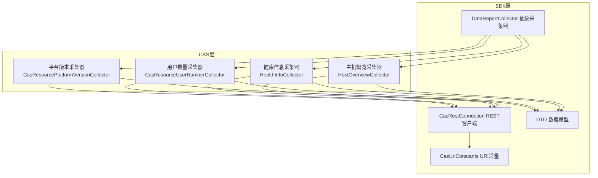
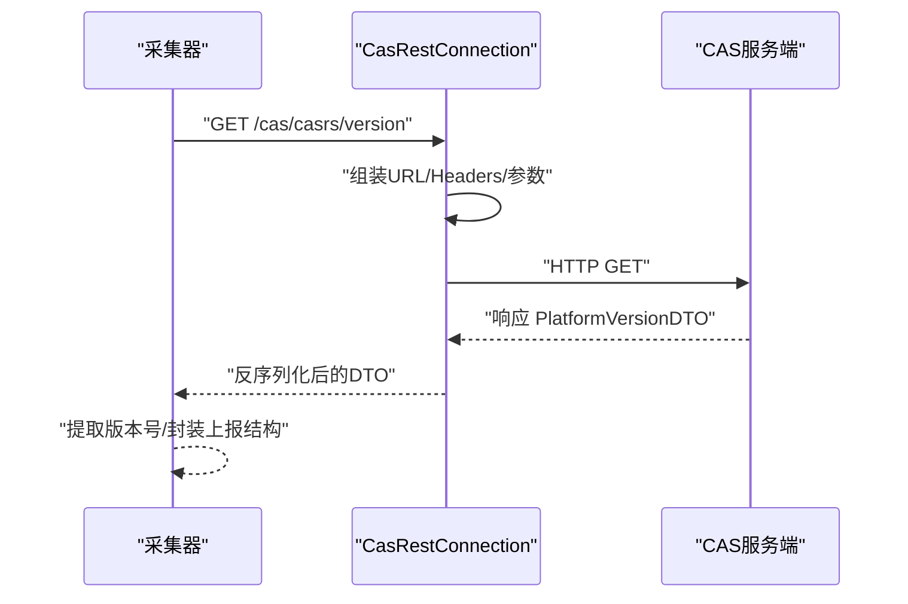
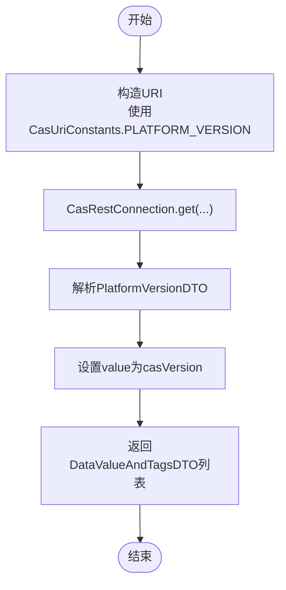
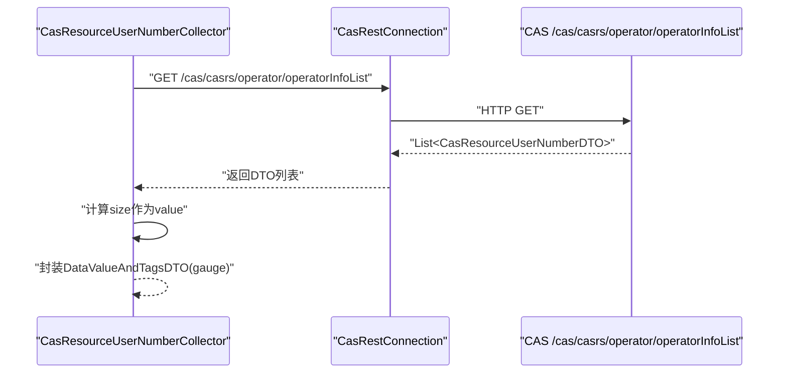
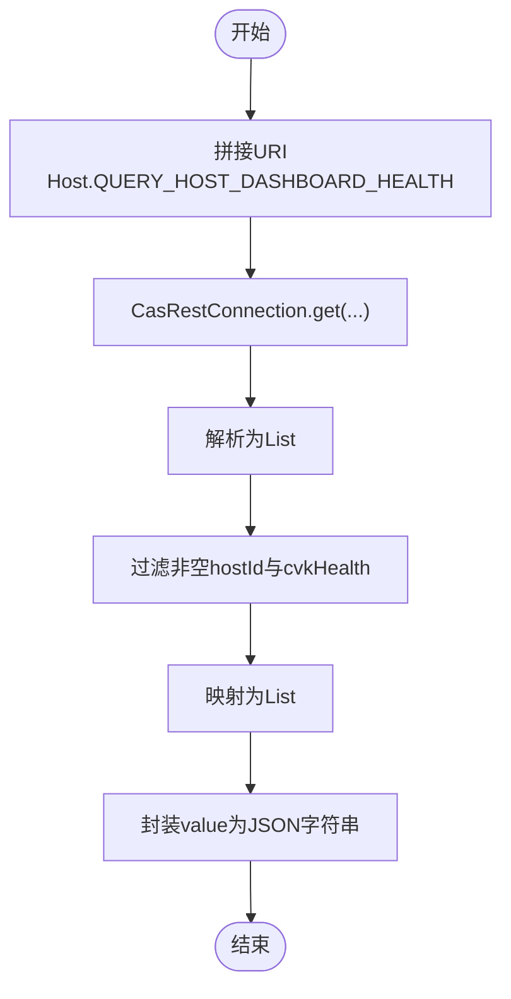
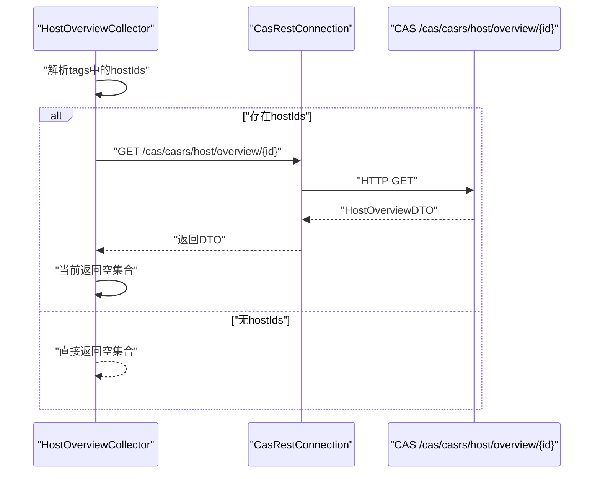
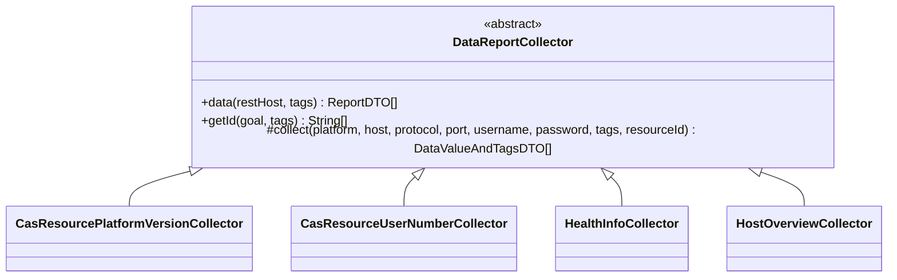
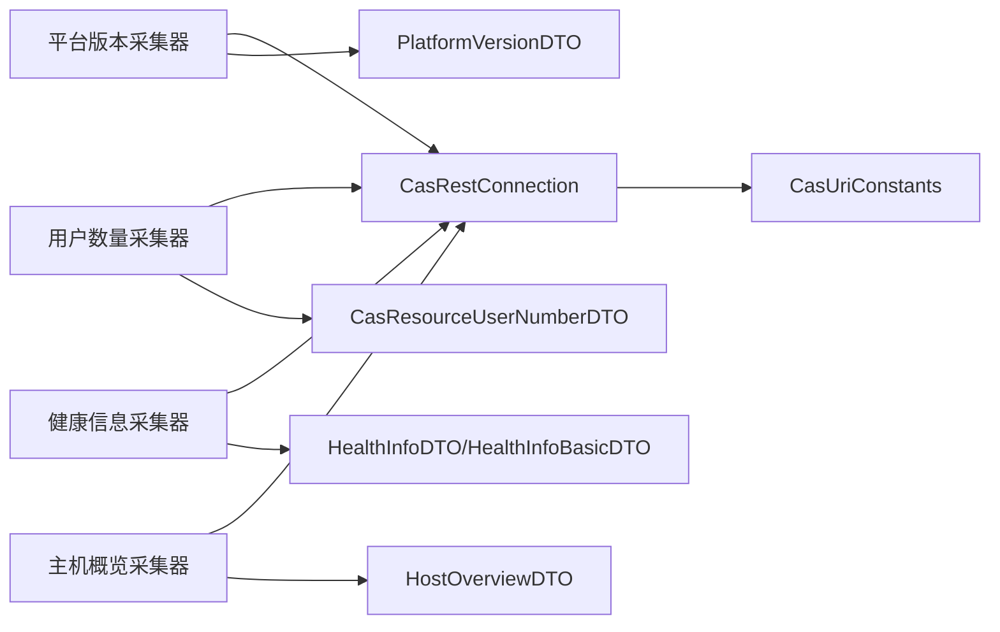

# 平台版本与用户监控

<cite>
**本文引用的文件**
- [CasResourcePlatformVersionCollector.java](file://watcher-cas/src/main/java/com/virtual/cloud/om/cas/service/report/CasResourcePlatformVersionCollector.java)
- [CasResourceUserNumberCollector.java](file://watcher-cas/src/main/java/com/virtual/cloud/om/cas/service/report/CasResourceUserNumberCollector.java)
- [HealthInfoCollector.java](file://watcher-cas/src/main/java/com/virtual/cloud/om/cas/service/report/HealthInfoCollector.java)
- [HostOverviewCollector.java](file://watcher-cas/src/main/java/com/virtual/cloud/om/cas/service/report/HostOverviewCollector.java)
- [CasRestConnection.java](file://watcher-sdk/src/main/java/com/virtual/cloud/om/sdk/config/rest/cas/CasRestConnection.java)
- [CasUriConstants.java](file://watcher-sdk/src/main/java/com/virtual/cloud/om/sdk/constant/uri/CasUriConstants.java)
- [PlatformVersionDTO.java](file://watcher-sdk/src/main/java/com/virtual/cloud/om/sdk/dto/dataReport/cas/PlatformVersionDTO.java)
- [CasResourceUserNumberDTO.java](file://watcher-sdk/src/main/java/com/virtual/cloud/om/sdk/dto/dataReport/cas/CasResourceUserNumberDTO.java)
- [HealthInfoDTO.java](file://watcher-sdk/src/main/java/com/virtual/cloud/om/sdk/dto/dataReport/cas/HealthInfoDTO.java)
- [HealthInfoBasicDTO.java](file://watcher-sdk/src/main/java/com/virtual/cloud/om/sdk/dto/dataReport/cas/HealthInfoBasicDTO.java)
- [HostOverviewDTO.java](file://watcher-sdk/src/main/java/com/virtual/cloud/om/sdk/dto/dataReport/cas/HostOverviewDTO.java)
- [DataReportCollector.java](file://watcher-sdk/src/main/java/com/virtual/cloud/om/sdk/api/DataReportCollector.java)
- [ErrorCodes.java](file://watcher-sdk/src/main/java/com/virtual/cloud/om/sdk/exception/ErrorCodes.java)
</cite>

## 目录
1. [简介](#简介)
2. [项目结构](#项目结构)
3. [核心组件](#核心组件)
4. [架构总览](#架构总览)
5. [组件详解](#组件详解)
6. [依赖关系分析](#依赖关系分析)
7. [性能考量](#性能考量)
8. [故障排查指南](#故障排查指南)
9. [结论](#结论)
10. [附录](#附录)

## 简介
本技术文档聚焦于CAS平台版本与用户监控功能，系统性阐述以下内容：
- 平台版本采集器与用户数量采集器的工作原理与实现细节
- 健康状态监控与主机概览监控的实现机制及数据来源
- 通过CAS API获取平台健康信息与主机运行状态的关键流程
- 平台监控数据的采集流程、数据结构与上报规范
- 如何基于现有框架扩展平台监控能力
- 平台监控数据在系统运维中的应用场景与价值

## 项目结构
围绕CAS监控的核心模块主要分布在两个子工程中：
- watcher-sdk：提供统一的REST客户端、URI常量、数据模型与采集抽象基类
- watcher-cas：基于SDK封装CAS特有采集器，对接CAS API完成数据采集与上报

图表来源
- [CasResourcePlatformVersionCollector.java:22-47](file://watcher-cas/src/main/java/com/virtual/cloud/om/cas/service/report/CasResourcePlatformVersionCollector.java#L22-L47)
- [CasResourceUserNumberCollector.java:26-64](file://watcher-cas/src/main/java/com/virtual/cloud/om/cas/service/report/CasResourceUserNumberCollector.java#L26-L64)
- [HealthInfoCollector.java:29-74](file://watcher-cas/src/main/java/com/virtual/cloud/om/cas/service/report/HealthInfoCollector.java#L29-L74)
- [HostOverviewCollector.java:32-67](file://watcher-cas/src/main/java/com/virtual/cloud/om/cas/service/report/HostOverviewCollector.java#L32-L67)
- [CasRestConnection.java:26-160](file://watcher-sdk/src/main/java/com/virtual/cloud/om/sdk/config/rest/cas/CasRestConnection.java#L26-L160)
- [CasUriConstants.java:10-180](file://watcher-sdk/src/main/java/com/virtual/cloud/om/sdk/constant/uri/CasUriConstants.java#L10-L180)
- [DataReportCollector.java:18-118](file://watcher-sdk/src/main/java/com/virtual/cloud/om/sdk/api/DataReportCollector.java#L18-L118)

章节来源
- [CasResourcePlatformVersionCollector.java:1-48](file://watcher-cas/src/main/java/com/virtual/cloud/om/cas/service/report/CasResourcePlatformVersionCollector.java#L1-L48)
- [CasResourceUserNumberCollector.java:1-65](file://watcher-cas/src/main/java/com/virtual/cloud/om/cas/service/report/CasResourceUserNumberCollector.java#L1-L65)
- [HealthInfoCollector.java:1-75](file://watcher-cas/src/main/java/com/virtual/cloud/om/cas/service/report/HealthInfoCollector.java#L1-L75)
- [HostOverviewCollector.java:1-68](file://watcher-cas/src/main/java/com/virtual/cloud/om/cas/service/report/HostOverviewCollector.java#L1-L68)
- [CasRestConnection.java:1-161](file://watcher-sdk/src/main/java/com/virtual/cloud/om/sdk/config/rest/cas/CasRestConnection.java#L1-L161)
- [CasUriConstants.java:1-822](file://watcher-sdk/src/main/java/com/virtual/cloud/om/sdk/constant/uri/CasUriConstants.java#L1-L822)
- [DataReportCollector.java:1-118](file://watcher-sdk/src/main/java/com/virtual/cloud/om/sdk/api/DataReportCollector.java#L1-L118)

## 核心组件
- 平台版本采集器：从CAS版本接口获取平台版本号，以文本型指标上报
- 用户数量采集器：拉取操作员列表，统计用户数量，以上报指标形式输出
- 健康信息采集器：拉取主机健康度信息，筛选关键字段，以JSON型指标上报
- 主机概览采集器：按标签中的hostIds查询主机概要信息，当前用于后续数据适配

章节来源
- [CasResourcePlatformVersionCollector.java:22-47](file://watcher-cas/src/main/java/com/virtual/cloud/om/cas/service/report/CasResourcePlatformVersionCollector.java#L22-L47)
- [CasResourceUserNumberCollector.java:26-64](file://watcher-cas/src/main/java/com/virtual/cloud/om/cas/service/report/CasResourceUserNumberCollector.java#L26-L64)
- [HealthInfoCollector.java:29-74](file://watcher-cas/src/main/java/com/virtual/cloud/om/cas/service/report/HealthInfoCollector.java#L29-L74)
- [HostOverviewCollector.java:32-67](file://watcher-cas/src/main/java/com/virtual/cloud/om/cas/service/report/HostOverviewCollector.java#L32-L67)

## 架构总览
CAS监控数据流自上而下分为三层：
- 采集层：各采集器继承统一抽象基类，负责具体指标的采集逻辑
- 传输层：REST客户端封装HTTP调用，自动注入真实来源IP头，记录请求与耗时
- 协议层：URI常量集中管理CAS API路径，确保调用一致性

图表来源
- [CasResourcePlatformVersionCollector.java:25-36](file://watcher-cas/src/main/java/com/virtual/cloud/om/cas/service/report/CasResourcePlatformVersionCollector.java#L25-L36)
- [CasRestConnection.java:113-117](file://watcher-sdk/src/main/java/com/virtual/cloud/om/sdk/config/rest/cas/CasRestConnection.java#L113-L117)
- [CasUriConstants.java](file://watcher-sdk/src/main/java/com/virtual/cloud/om/sdk/constant/uri/CasUriConstants.java#L21)

## 组件详解

### 平台版本采集器
- 功能：调用CAS版本接口，提取平台版本号作为文本型指标上报
- 关键点：
  - 使用统一REST客户端发起GET请求
  - 通过URI常量定位版本接口
  - 将DTO中的版本号映射为value，tags透传
  - 指标类型为text，便于展示与检索

图表来源
- [CasResourcePlatformVersionCollector.java:25-46](file://watcher-cas/src/main/java/com/virtual/cloud/om/cas/service/report/CasResourcePlatformVersionCollector.java#L25-L46)
- [CasUriConstants.java](file://watcher-sdk/src/main/java/com/virtual/cloud/om/sdk/constant/uri/CasUriConstants.java#L21)
- [PlatformVersionDTO.java:15-18](file://watcher-sdk/src/main/java/com/virtual/cloud/om/sdk/dto/dataReport/cas/PlatformVersionDTO.java#L15-L18)

章节来源
- [CasResourcePlatformVersionCollector.java:22-47](file://watcher-cas/src/main/java/com/virtual/cloud/om/cas/service/report/CasResourcePlatformVersionCollector.java#L22-L47)
- [PlatformVersionDTO.java:11-18](file://watcher-sdk/src/main/java/com/virtual/cloud/om/sdk/dto/dataReport/cas/PlatformVersionDTO.java#L11-L18)

### 用户数量采集器
- 功能：拉取操作员列表，统计用户数量，以上报指标形式输出
- 关键点：
  - 通过URI常量Operator.QUERY_OPERATOR获取操作员列表
  - 列表长度即为用户数量，封装为gauge型指标
  - 异常时抛出统一错误码，便于上层告警与重试

图表来源
- [CasResourceUserNumberCollector.java:30-53](file://watcher-cas/src/main/java/com/virtual/cloud/om/cas/service/report/CasResourceUserNumberCollector.java#L30-L53)
- [CasUriConstants.java](file://watcher-sdk/src/main/java/com/virtual/cloud/om/sdk/constant/uri/CasUriConstants.java#L780)
- [CasResourceUserNumberDTO.java:15-38](file://watcher-sdk/src/main/java/com/virtual/cloud/om/sdk/dto/dataReport/cas/CasResourceUserNumberDTO.java#L15-L38)

章节来源
- [CasResourceUserNumberCollector.java:26-64](file://watcher-cas/src/main/java/com/virtual/cloud/om/cas/service/report/CasResourceUserNumberCollector.java#L26-L64)
- [CasResourceUserNumberDTO.java:11-38](file://watcher-sdk/src/main/java/com/virtual/cloud/om/sdk/dto/dataReport/cas/CasResourceUserNumberDTO.java#L11-L38)

### 健康信息采集器
- 功能：拉取主机健康度信息，筛选主机ID与cvk健康度，以JSON型指标上报
- 关键点：
  - 通过Host.QUERY_HOST_DASHBOARD_HEALTH获取健康信息列表
  - 过滤非空的hostId与cvkHealth，封装为HealthInfoBasicDTO列表
  - 指标类型为json，便于前端渲染与二次加工

图表来源
- [HealthInfoCollector.java:33-63](file://watcher-cas/src/main/java/com/virtual/cloud/om/cas/service/report/HealthInfoCollector.java#L33-L63)
- [CasUriConstants.java](file://watcher-sdk/src/main/java/com/virtual/cloud/om/sdk/constant/uri/CasUriConstants.java#L179)
- [HealthInfoDTO.java:15-48](file://watcher-sdk/src/main/java/com/virtual/cloud/om/sdk/dto/dataReport/cas/HealthInfoDTO.java#L15-L48)
- [HealthInfoBasicDTO.java:9-25](file://watcher-sdk/src/main/java/com/virtual/cloud/om/sdk/dto/dataReport/cas/HealthInfoBasicDTO.java#L9-L25)

章节来源
- [HealthInfoCollector.java:29-74](file://watcher-cas/src/main/java/com/virtual/cloud/om/cas/service/report/HealthInfoCollector.java#L29-L74)
- [HealthInfoDTO.java:11-48](file://watcher-sdk/src/main/java/com/virtual/cloud/om/sdk/dto/dataReport/cas/HealthInfoDTO.java#L11-L48)
- [HealthInfoBasicDTO.java:7-25](file://watcher-sdk/src/main/java/com/virtual/cloud/om/sdk/dto/dataReport/cas/HealthInfoBasicDTO.java#L7-L25)

### 主机概览采集器
- 功能：从标签中解析hostIds，按ID查询主机概要信息
- 关键点：
  - 通过getId从tags中提取hostIds
  - 使用Host.QUERY_HOST_OVERVIEW按ID查询
  - 当前返回空集合，后续可用于适配数据中心所需数据结构

图表来源
- [HostOverviewCollector.java:35-56](file://watcher-cas/src/main/java/com/virtual/cloud/om/cas/service/report/HostOverviewCollector.java#L35-L56)
- [CasUriConstants.java](file://watcher-sdk/src/main/java/com/virtual/cloud/om/sdk/constant/uri/CasUriConstants.java#L149)
- [HostOverviewDTO.java:16-76](file://watcher-sdk/src/main/java/com/virtual/cloud/om/sdk/dto/dataReport/cas/HostOverviewDTO.java#L16-L76)

章节来源
- [HostOverviewCollector.java:32-67](file://watcher-cas/src/main/java/com/virtual/cloud/om/cas/service/report/HostOverviewCollector.java#L32-L67)
- [HostOverviewDTO.java:10-76](file://watcher-sdk/src/main/java/com/virtual/cloud/om/sdk/dto/dataReport/cas/HostOverviewDTO.java#L10-L76)

### 采集抽象与上报流程
- 统一抽象：所有采集器继承DataReportCollector，复用统一的data方法与ID解析逻辑
- 上报结构：将DataValueAndTagsDTO映射为ReportDTO，填充指标名、类型、标签与时间戳
- 时间处理：若采集器未设置timestamp，则由基类统一回填采集时间

图表来源
- [DataReportCollector.java:18-118](file://watcher-sdk/src/main/java/com/virtual/cloud/om/sdk/api/DataReportCollector.java#L18-L118)
- [CasResourcePlatformVersionCollector.java:22-47](file://watcher-cas/src/main/java/com/virtual/cloud/om/cas/service/report/CasResourcePlatformVersionCollector.java#L22-L47)
- [CasResourceUserNumberCollector.java:26-64](file://watcher-cas/src/main/java/com/virtual/cloud/om/cas/service/report/CasResourceUserNumberCollector.java#L26-L64)
- [HealthInfoCollector.java:29-74](file://watcher-cas/src/main/java/com/virtual/cloud/om/cas/service/report/HealthInfoCollector.java#L29-L74)
- [HostOverviewCollector.java:32-67](file://watcher-cas/src/main/java/com/virtual/cloud/om/cas/service/report/HostOverviewCollector.java#L32-L67)

章节来源
- [DataReportCollector.java:18-118](file://watcher-sdk/src/main/java/com/virtual/cloud/om/sdk/api/DataReportCollector.java#L18-L118)

## 依赖关系分析
- 采集器对REST客户端的依赖：通过构造函数注入CasRestConnection，避免硬编码
- REST客户端对URI常量的依赖：统一从CasUriConstants读取API路径
- DTO模型与指标类型：不同采集器对应不同的DTO，但最终统一映射到ReportDTO

图表来源
- [CasResourcePlatformVersionCollector.java:22-36](file://watcher-cas/src/main/java/com/virtual/cloud/om/cas/service/report/CasResourcePlatformVersionCollector.java#L22-L36)
- [CasResourceUserNumberCollector.java:28-52](file://watcher-cas/src/main/java/com/virtual/cloud/om/cas/service/report/CasResourceUserNumberCollector.java#L28-L52)
- [HealthInfoCollector.java:31-62](file://watcher-cas/src/main/java/com/virtual/cloud/om/cas/service/report/HealthInfoCollector.java#L31-L62)
- [HostOverviewCollector.java:33-55](file://watcher-cas/src/main/java/com/virtual/cloud/om/cas/service/report/HostOverviewCollector.java#L33-L55)
- [CasRestConnection.java:26-160](file://watcher-sdk/src/main/java/com/virtual/cloud/om/sdk/config/rest/cas/CasRestConnection.java#L26-L160)
- [CasUriConstants.java:10-180](file://watcher-sdk/src/main/java/com/virtual/cloud/om/sdk/constant/uri/CasUriConstants.java#L10-L180)
- [PlatformVersionDTO.java:11-18](file://watcher-sdk/src/main/java/com/virtual/cloud/om/sdk/dto/dataReport/cas/PlatformVersionDTO.java#L11-L18)
- [CasResourceUserNumberDTO.java:11-38](file://watcher-sdk/src/main/java/com/virtual/cloud/om/sdk/dto/dataReport/cas/CasResourceUserNumberDTO.java#L11-L38)
- [HealthInfoDTO.java:11-48](file://watcher-sdk/src/main/java/com/virtual/cloud/om/sdk/dto/dataReport/cas/HealthInfoDTO.java#L11-L48)
- [HealthInfoBasicDTO.java:7-25](file://watcher-sdk/src/main/java/com/virtual/cloud/om/sdk/dto/dataReport/cas/HealthInfoBasicDTO.java#L7-L25)
- [HostOverviewDTO.java:10-76](file://watcher-sdk/src/main/java/com/virtual/cloud/om/sdk/dto/dataReport/cas/HostOverviewDTO.java#L10-L76)

章节来源
- [CasRestConnection.java:1-161](file://watcher-sdk/src/main/java/com/virtual/cloud/om/sdk/config/rest/cas/CasRestConnection.java#L1-L161)
- [CasUriConstants.java:1-822](file://watcher-sdk/src/main/java/com/virtual/cloud/om/sdk/constant/uri/CasUriConstants.java#L1-L822)

## 性能考量
- 连接复用：REST客户端通过缓存管理不同鉴权组合的模板实例，减少重复初始化开销
- 超时与并发：建议结合线程池与超时配置控制单次采集耗时，避免阻塞
- 数据量控制：健康度与主机概览等接口可能返回较大列表，需注意序列化与网络传输成本
- 重试与降级：对不可用或409冲突场景进行捕获与重试，必要时降级为默认值或空集

## 故障排查指南
- 常见错误码
  - REST调用失败：统一抛出REST_FAIL错误码，包含URL与错误消息
  - 资源异常原因：RESOURCE_EXCEPTION_REASION用于包装采集过程中的异常
  - 409冲突：从响应头解析Error-Code与Error-Message，便于快速定位
- 排查步骤
  - 检查CAS服务连通性与鉴权信息
  - 查看采集器日志与耗时，确认URI是否正确
  - 核对DTO字段映射与空值过滤逻辑
  - 对异常进行捕获并记录上下文，便于定位问题

章节来源
- [CasRestConnection.java:64-93](file://watcher-sdk/src/main/java/com/virtual/cloud/om/sdk/config/rest/cas/CasRestConnection.java#L64-L93)
- [ErrorCodes.java:67-87](file://watcher-sdk/src/main/java/com/virtual/cloud/om/sdk/exception/ErrorCodes.java#L67-L87)
- [CasResourceUserNumberCollector.java:37-44](file://watcher-cas/src/main/java/com/virtual/cloud/om/cas/service/report/CasResourceUserNumberCollector.java#L37-L44)
- [HealthInfoCollector.java:40-47](file://watcher-cas/src/main/java/com/virtual/cloud/om/cas/service/report/HealthInfoCollector.java#L40-L47)

## 结论
CAS平台版本与用户监控通过统一的采集抽象与REST客户端，实现了对版本号、用户数量、主机健康度与主机概览的稳定采集。其设计具备良好的扩展性，便于在保持一致性的前提下新增更多监控维度。运维侧可基于这些指标进行版本治理、容量规划与健康预警。

## 附录

### 数据模型一览
- 平台版本：PlatformVersionDTO
- 用户数量：CasResourceUserNumberDTO
- 健康信息：HealthInfoDTO → HealthInfoBasicDTO
- 主机概览：HostOverviewDTO

章节来源
- [PlatformVersionDTO.java:11-18](file://watcher-sdk/src/main/java/com/virtual/cloud/om/sdk/dto/dataReport/cas/PlatformVersionDTO.java#L11-L18)
- [CasResourceUserNumberDTO.java:11-38](file://watcher-sdk/src/main/java/com/virtual/cloud/om/sdk/dto/dataReport/cas/CasResourceUserNumberDTO.java#L11-L38)
- [HealthInfoDTO.java:11-48](file://watcher-sdk/src/main/java/com/virtual/cloud/om/sdk/dto/dataReport/cas/HealthInfoDTO.java#L11-L48)
- [HealthInfoBasicDTO.java:7-25](file://watcher-sdk/src/main/java/com/virtual/cloud/om/sdk/dto/dataReport/cas/HealthInfoBasicDTO.java#L7-L25)
- [HostOverviewDTO.java:10-76](file://watcher-sdk/src/main/java/com/virtual/cloud/om/sdk/dto/dataReport/cas/HostOverviewDTO.java#L10-L76)