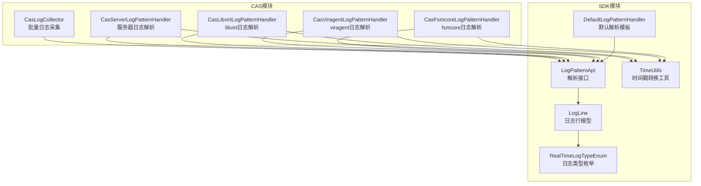
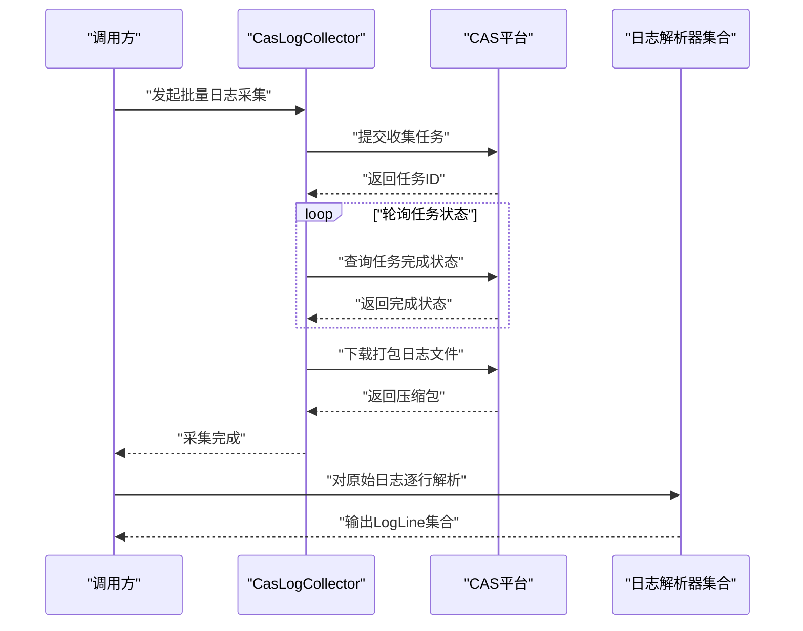
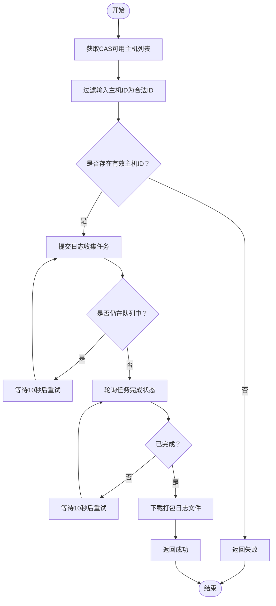
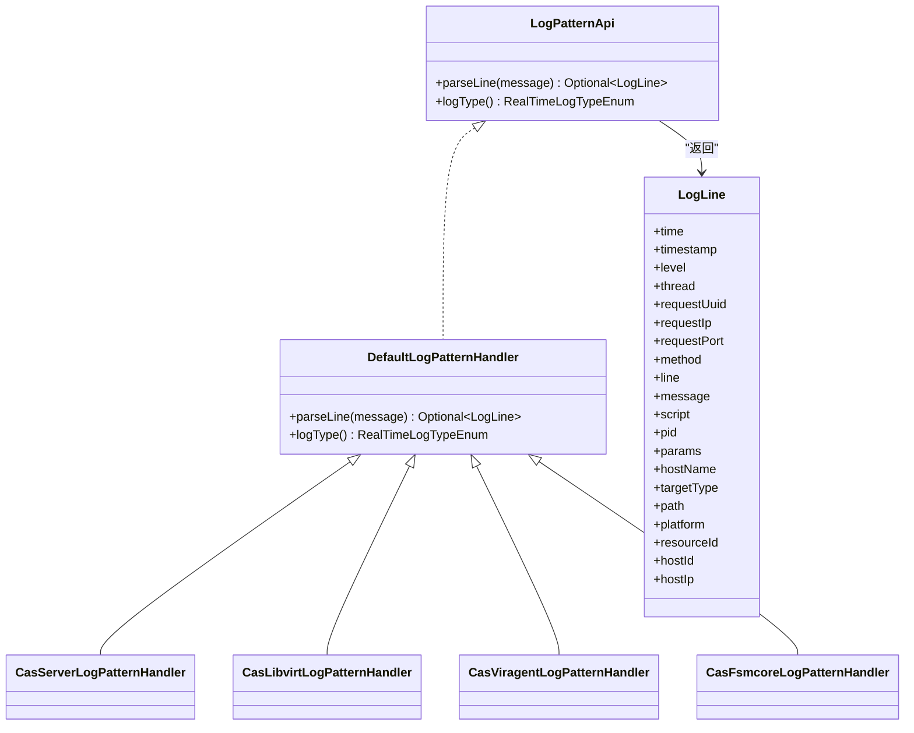
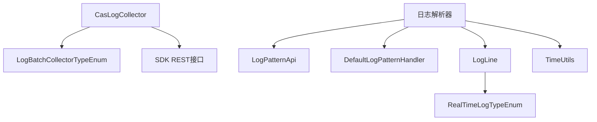

# 日志采集与解析

<cite>
**本文引用的文件**
- [CasLogCollector.java](file://watcher-cas/src/main/java/com/virtual/cloud/om/cas/service/log/CasLogCollector.java)
- [CasServerLogPatternHandler.java](file://watcher-cas/src/main/java/com/virtual/cloud/om/cas/service/CasServerLogPatternHandler.java)
- [CasLibvirtLogPatternHandler.java](file://watcher-cas/src/main/java/com/virtual/cloud/om/cas/service/CasLibvirtLogPatternHandler.java)
- [CasViragentLogPatternHandler.java](file://watcher-cas/src/main/java/com/virtual/cloud/om/cas/service/CasViragentLogPatternHandler.java)
- [CasFsmcoreLogPatternHandler.java](file://watcher-cas/src/main/java/com/virtual/cloud/om/cas/service/CasFsmcoreLogPatternHandler.java)
- [DefaultLogPatternHandler.java](file://watcher-sdk/src/main/java/com/virtual/cloud/om/sdk/api/DefaultLogPatternHandler.java)
- [LogPatternApi.java](file://watcher-sdk/src/main/java/com/virtual/cloud/om/sdk/api/LogPatternApi.java)
- [LogLine.java](file://watcher-sdk/src/main/java/com/virtual/cloud/om/sdk/dto/LogLine.java)
- [RealTimeLogTypeEnum.java](file://watcher-sdk/src/main/java/com/virtual/cloud/om/sdk/constant/RealTimeLogTypeEnum.java)
- [LogBatchCollectorTypeEnum.java](file://watcher-sdk/src/main/java/com/virtual/cloud/om/sdk/constant/LogBatchCollectorTypeEnum.java)
- [TimeUtils.java](file://watcher-sdk/src/main/java/com/virtual/cloud/om/sdk/utils/TimeUtils.java)
</cite>

## 目录
1. [简介](#简介)
2. [项目结构](#项目结构)
3. [核心组件](#核心组件)
4. [架构总览](#架构总览)
5. [详细组件分析](#详细组件分析)
6. [依赖分析](#依赖分析)
7. [性能考虑](#性能考虑)
8. [故障排查指南](#故障排查指南)
9. [结论](#结论)
10. [附录](#附录)

## 简介
本技术文档围绕CAS（Cloud Administration System）系统的日志采集与解析能力展开，重点覆盖以下方面：
- 批量日志采集：通过CasLogCollector对接CAS平台，发起日志收集任务、轮询任务状态并下载打包日志文件。
- 实时日志解析：针对不同日志类型（如服务器日志、libvirt日志、viragent日志、fsmcore日志等），使用对应的LogPatternApi实现进行正则匹配与字段抽取，统一输出LogLine结构。
- 数据模型与类型：统一的日志行模型LogLine及日志类型枚举RealTimeLogTypeEnum，确保解析结果的一致性与可扩展性。
- 可扩展性：通过DefaultLogPatternHandler抽象默认解析模板，便于新增日志类型时快速实现自定义解析规则。

## 项目结构
CAS日志相关代码主要分布在两个模块：
- watcher-cas：包含CAS专用的日志采集器CasLogCollector与多种日志类型的解析处理器。
- watcher-sdk：提供通用的日志解析接口、默认解析器、日志行模型、类型枚举与工具类等基础能力。

图表来源
- [CasLogCollector.java:1-112](file://watcher-cas/src/main/java/com/virtual/cloud/om/cas/service/log/CasLogCollector.java#L1-L112)
- [CasServerLogPatternHandler.java:1-55](file://watcher-cas/src/main/java/com/virtual/cloud/om/cas/service/CasServerLogPatternHandler.java#L1-L55)
- [CasLibvirtLogPatternHandler.java:1-52](file://watcher-cas/src/main/java/com/virtual/cloud/om/cas/service/CasLibvirtLogPatternHandler.java#L1-L52)
- [CasViragentLogPatternHandler.java:1-53](file://watcher-cas/src/main/java/com/virtual/cloud/om/cas/service/CasViragentLogPatternHandler.java#L1-L53)
- [CasFsmcoreLogPatternHandler.java:1-52](file://watcher-cas/src/main/java/com/virtual/cloud/om/cas/service/CasFsmcoreLogPatternHandler.java#L1-L52)
- [DefaultLogPatternHandler.java:1-56](file://watcher-sdk/src/main/java/com/virtual/cloud/om/sdk/api/DefaultLogPatternHandler.java#L1-L56)
- [LogPatternApi.java:1-18](file://watcher-sdk/src/main/java/com/virtual/cloud/om/sdk/api/LogPatternApi.java#L1-L18)
- [LogLine.java:1-56](file://watcher-sdk/src/main/java/com/virtual/cloud/om/sdk/dto/LogLine.java#L1-L56)
- [RealTimeLogTypeEnum.java:1-45](file://watcher-sdk/src/main/java/com/virtual/cloud/om/sdk/constant/RealTimeLogTypeEnum.java#L1-L45)
- [TimeUtils.java:1-37](file://watcher-sdk/src/main/java/com/virtual/cloud/om/sdk/utils/TimeUtils.java#L1-L37)

章节来源
- [CasLogCollector.java:1-112](file://watcher-cas/src/main/java/com/virtual/cloud/om/cas/service/log/CasLogCollector.java#L1-L112)
- [CasServerLogPatternHandler.java:1-55](file://watcher-cas/src/main/java/com/virtual/cloud/om/cas/service/CasServerLogPatternHandler.java#L1-L55)
- [CasLibvirtLogPatternHandler.java:1-52](file://watcher-cas/src/main/java/com/virtual/cloud/om/cas/service/CasLibvirtLogPatternHandler.java#L1-L52)
- [CasViragentLogPatternHandler.java:1-53](file://watcher-cas/src/main/java/com/virtual/cloud/om/cas/service/CasViragentLogPatternHandler.java#L1-L53)
- [CasFsmcoreLogPatternHandler.java:1-52](file://watcher-cas/src/main/java/com/virtual/cloud/om/cas/service/CasFsmcoreLogPatternHandler.java#L1-L52)
- [DefaultLogPatternHandler.java:1-56](file://watcher-sdk/src/main/java/com/virtual/cloud/om/sdk/api/DefaultLogPatternHandler.java#L1-L56)
- [LogPatternApi.java:1-18](file://watcher-sdk/src/main/java/com/virtual/cloud/om/sdk/api/LogPatternApi.java#L1-L18)
- [LogLine.java:1-56](file://watcher-sdk/src/main/java/com/virtual/cloud/om/sdk/dto/LogLine.java#L1-L56)
- [RealTimeLogTypeEnum.java:1-45](file://watcher-sdk/src/main/java/com/virtual/cloud/om/sdk/constant/RealTimeLogTypeEnum.java#L1-L45)
- [TimeUtils.java:1-37](file://watcher-sdk/src/main/java/com/virtual/cloud/om/sdk/utils/TimeUtils.java#L1-L37)

## 核心组件
- 批量日志采集器CasLogCollector：负责向CAS平台提交日志收集任务、轮询任务完成状态、下载打包日志文件，并返回采集结果。
- 日志解析接口LogPatternApi与默认实现DefaultLogPatternHandler：定义统一的解析契约与默认解析模板，具体日志类型通过继承实现自定义解析规则。
- 日志行模型LogLine：承载解析后的标准化字段（时间、级别、线程、方法、消息等）。
- 日志类型枚举RealTimeLogTypeEnum：集中管理所有支持的日志类型，便于路由与扩展。
- 时间工具TimeUtils：提供字符串到时间戳的转换，兼容多种时间格式。

章节来源
- [CasLogCollector.java:29-108](file://watcher-cas/src/main/java/com/virtual/cloud/om/cas/service/log/CasLogCollector.java#L29-L108)
- [LogPatternApi.java:12-17](file://watcher-sdk/src/main/java/com/virtual/cloud/om/sdk/api/LogPatternApi.java#L12-L17)
- [DefaultLogPatternHandler.java:17-55](file://watcher-sdk/src/main/java/com/virtual/cloud/om/sdk/api/DefaultLogPatternHandler.java#L17-L55)
- [LogLine.java:6-55](file://watcher-sdk/src/main/java/com/virtual/cloud/om/sdk/dto/LogLine.java#L6-L55)
- [RealTimeLogTypeEnum.java:15-44](file://watcher-sdk/src/main/java/com/virtual/cloud/om/sdk/constant/RealTimeLogTypeEnum.java#L15-L44)
- [TimeUtils.java:23-35](file://watcher-sdk/src/main/java/com/virtual/cloud/om/sdk/utils/TimeUtils.java#L23-L35)

## 架构总览
CAS日志采集与解析的整体流程如下：
- 批量采集阶段：CasLogCollector通过REST接口向CAS提交日志收集请求，轮询任务状态直至完成，随后下载压缩包。
- 实时解析阶段：各日志类型处理器（如CasServerLogPatternHandler等）基于正则表达式解析原始日志行，生成LogLine对象。
- 统一模型：LogLine作为标准载体，携带时间戳、级别、方法、消息等字段，供后续存储或转发。

图表来源
- [CasLogCollector.java:34-103](file://watcher-cas/src/main/java/com/virtual/cloud/om/cas/service/log/CasLogCollector.java#L34-L103)
- [LogPatternApi.java:12-17](file://watcher-sdk/src/main/java/com/virtual/cloud/om/sdk/api/LogPatternApi.java#L12-L17)
- [LogLine.java:6-55](file://watcher-sdk/src/main/java/com/virtual/cloud/om/sdk/dto/LogLine.java#L6-L55)

## 详细组件分析

### 批量日志采集器 CasLogCollector
- 功能职责
  - 从目标主机列表中过滤出CAS平台存在的有效hostId，避免无效ID导致任务卡死。
  - 提交日志收集任务，若任务排队则持续轮询；任务完成后发起下载。
  - 下载完成后记录耗时并返回采集结果。
- 关键流程
  - 主机校验：拉取CAS可用主机列表，仅保留输入列表中的合法hostId。
  - 任务提交与轮询：使用REST PUT提交收集请求，根据返回状态判断是否继续轮询；轮询间隔固定。
  - 结果查询：通过消息ID查询任务完成状态，直到完成。
  - 文件下载：下载完成后记录成功日志。
- 错误处理
  - 非法hostId记录错误日志。
  - 下载异常捕获并返回失败。
  - 轮询过程中中断信号被捕获并恢复中断状态。

图表来源
- [CasLogCollector.java:34-103](file://watcher-cas/src/main/java/com/virtual/cloud/om/cas/service/log/CasLogCollector.java#L34-L103)

章节来源
- [CasLogCollector.java:34-103](file://watcher-cas/src/main/java/com/virtual/cloud/om/cas/service/log/CasLogCollector.java#L34-L103)

### 日志解析器体系
- 接口与抽象
  - LogPatternApi：定义parseLine与logType两个方法，约束解析行为与类型标识。
  - DefaultLogPatternHandler：提供默认正则模板与通用字段映射逻辑，便于继承扩展。
- 具体实现
  - CasServerLogPatternHandler：解析CAS服务器日志，提取时间、级别、线程、方法与消息。
  - CasLibvirtLogPatternHandler：解析libvirt日志，提取时间、级别、方法、行号与消息。
  - CasViragentLogPatternHandler：解析viragent日志，字段与libvirt类似。
  - CasFsmcoreLogPatternHandler：解析fsmcore日志，提取时间、级别、方法、行号与消息。
- 解析流程
  - 使用预置正则表达式匹配单行日志。
  - 成功匹配后填充LogLine字段，包括时间戳转换、级别、方法、消息等。
  - 失败匹配返回空，表示该行不适用当前解析器。

图表来源
- [LogPatternApi.java:12-17](file://watcher-sdk/src/main/java/com/virtual/cloud/om/sdk/api/LogPatternApi.java#L12-L17)
- [DefaultLogPatternHandler.java:17-55](file://watcher-sdk/src/main/java/com/virtual/cloud/om/sdk/api/DefaultLogPatternHandler.java#L17-L55)
- [CasServerLogPatternHandler.java:19-54](file://watcher-cas/src/main/java/com/virtual/cloud/om/cas/service/CasServerLogPatternHandler.java#L19-L54)
- [CasLibvirtLogPatternHandler.java:16-51](file://watcher-cas/src/main/java/com/virtual/cloud/om/cas/service/CasLibvirtLogPatternHandler.java#L16-L51)
- [CasViragentLogPatternHandler.java:16-52](file://watcher-cas/src/main/java/com/virtual/cloud/om/cas/service/CasViragentLogPatternHandler.java#L16-L52)
- [CasFsmcoreLogPatternHandler.java:16-51](file://watcher-cas/src/main/java/com/virtual/cloud/om/cas/service/CasFsmcoreLogPatternHandler.java#L16-L51)
- [LogLine.java:6-55](file://watcher-sdk/src/main/java/com/virtual/cloud/om/sdk/dto/LogLine.java#L6-L55)

章节来源
- [LogPatternApi.java:12-17](file://watcher-sdk/src/main/java/com/virtual/cloud/om/sdk/api/LogPatternApi.java#L12-L17)
- [DefaultLogPatternHandler.java:17-55](file://watcher-sdk/src/main/java/com/virtual/cloud/om/sdk/api/DefaultLogPatternHandler.java#L17-L55)
- [CasServerLogPatternHandler.java:19-54](file://watcher-cas/src/main/java/com/virtual/cloud/om/cas/service/CasServerLogPatternHandler.java#L19-L54)
- [CasLibvirtLogPatternHandler.java:16-51](file://watcher-cas/src/main/java/com/virtual/cloud/om/cas/service/CasLibvirtLogPatternHandler.java#L16-L51)
- [CasViragentLogPatternHandler.java:16-52](file://watcher-cas/src/main/java/com/virtual/cloud/om/cas/service/CasViragentLogPatternHandler.java#L16-L52)
- [CasFsmcoreLogPatternHandler.java:16-51](file://watcher-cas/src/main/java/com/virtual/cloud/om/cas/service/CasFsmcoreLogPatternHandler.java#L16-L51)
- [LogLine.java:6-55](file://watcher-sdk/src/main/java/com/virtual/cloud/om/sdk/dto/LogLine.java#L6-L55)

### 日志类型与数据模型
- 日志类型枚举RealTimeLogTypeEnum：集中定义CAS支持的所有日志类型，便于路由与扩展。
- 日志行模型LogLine：标准化承载解析后的字段，便于下游统一处理。
- 时间工具TimeUtils：提供字符串到时间戳的转换，兼容多种时间格式。

章节来源
- [RealTimeLogTypeEnum.java:15-44](file://watcher-sdk/src/main/java/com/virtual/cloud/om/sdk/constant/RealTimeLogTypeEnum.java#L15-L44)
- [LogLine.java:6-55](file://watcher-sdk/src/main/java/com/virtual/cloud/om/sdk/dto/LogLine.java#L6-L55)
- [TimeUtils.java:23-35](file://watcher-sdk/src/main/java/com/virtual/cloud/om/sdk/utils/TimeUtils.java#L23-L35)

## 依赖分析
- 组件耦合
  - CasLogCollector依赖CAS REST接口与SDK中的类型枚举，用于任务提交、状态查询与结果判定。
  - 各日志解析器依赖LogPatternApi与DefaultLogPatternHandler，遵循统一契约。
  - LogLine作为跨模块共享的数据载体，被解析器与上层业务共同使用。
- 外部依赖
  - SDK模块提供通用接口与工具，降低CAS模块对具体实现细节的耦合度。
  - 日志类型枚举集中管理，便于扩展新类型时无需修改解析器内部逻辑。

图表来源
- [CasLogCollector.java:30-31](file://watcher-cas/src/main/java/com/virtual/cloud/om/cas/service/log/CasLogCollector.java#L30-L31)
- [LogPatternApi.java:12-17](file://watcher-sdk/src/main/java/com/virtual/cloud/om/sdk/api/LogPatternApi.java#L12-L17)
- [DefaultLogPatternHandler.java:17-55](file://watcher-sdk/src/main/java/com/virtual/cloud/om/sdk/api/DefaultLogPatternHandler.java#L17-L55)
- [LogLine.java:6-55](file://watcher-sdk/src/main/java/com/virtual/cloud/om/sdk/dto/LogLine.java#L6-L55)
- [RealTimeLogTypeEnum.java:15-44](file://watcher-sdk/src/main/java/com/virtual/cloud/om/sdk/constant/RealTimeLogTypeEnum.java#L15-L44)
- [TimeUtils.java:23-35](file://watcher-sdk/src/main/java/com/virtual/cloud/om/sdk/utils/TimeUtils.java#L23-L35)

章节来源
- [CasLogCollector.java:30-31](file://watcher-cas/src/main/java/com/virtual/cloud/om/cas/service/log/CasLogCollector.java#L30-L31)
- [LogPatternApi.java:12-17](file://watcher-sdk/src/main/java/com/virtual/cloud/om/sdk/api/LogPatternApi.java#L12-L17)
- [DefaultLogPatternHandler.java:17-55](file://watcher-sdk/src/main/java/com/virtual/cloud/om/sdk/api/DefaultLogPatternHandler.java#L17-L55)
- [LogLine.java:6-55](file://watcher-sdk/src/main/java/com/virtual/cloud/om/sdk/dto/LogLine.java#L6-L55)
- [RealTimeLogTypeEnum.java:15-44](file://watcher-sdk/src/main/java/com/virtual/cloud/om/sdk/constant/RealTimeLogTypeEnum.java#L15-L44)
- [TimeUtils.java:23-35](file://watcher-sdk/src/main/java/com/virtual/cloud/om/sdk/utils/TimeUtils.java#L23-L35)

## 性能考虑
- 轮询策略
  - 批量采集器采用固定周期（约10秒）轮询任务状态，避免过于频繁的请求造成平台压力。
- 正则匹配
  - 各解析器使用预编译的Pattern，减少重复编译开销；建议保持正则简洁以提升匹配效率。
- 时间转换
  - 时间戳转换使用缓存友好格式与正则校验，避免异常分支带来的额外开销。
- 并发与资源
  - 批量采集器未显式使用多线程，建议在外部调用侧控制并发度，避免同时触发大量采集任务。
- I/O与网络
  - 下载大文件时注意磁盘空间与网络带宽，建议在调用侧设置超时与断点续传策略（如需要）。

## 故障排查指南
- 采集失败
  - 检查输入的hostId是否存在于CAS平台，非法ID会被记录错误日志且不会执行采集。
  - 若下载阶段抛出IO异常，采集器会返回失败；检查目标路径权限与磁盘空间。
- 解析异常
  - 若某行未匹配任何解析器，将返回空结果；确认日志格式与对应解析器是否匹配。
  - 时间戳转换失败时会记录告警并返回空时间戳，检查日志时间格式是否符合预期。
- 任务卡死
  - 若任务长时间处于队列中，检查CAS平台负载与网络连通性；必要时调整轮询间隔或重试策略。

章节来源
- [CasLogCollector.java:42-55](file://watcher-cas/src/main/java/com/virtual/cloud/om/cas/service/log/CasLogCollector.java#L42-L55)
- [CasLogCollector.java:97-100](file://watcher-cas/src/main/java/com/virtual/cloud/om/cas/service/log/CasLogCollector.java#L97-L100)
- [TimeUtils.java:31-35](file://watcher-sdk/src/main/java/com/virtual/cloud/om/sdk/utils/TimeUtils.java#L31-L35)

## 结论
CAS日志采集与解析体系通过“批量采集+实时解析”的双通道设计，实现了对多源日志的统一接入与标准化输出。CasLogCollector负责可靠的任务调度与文件下载，各类日志解析器基于正则表达式实现高内聚、低耦合的扩展点。结合LogLine与类型枚举，系统具备良好的可维护性与可扩展性。建议在生产环境中配合合理的并发控制、超时与重试策略，以获得更稳定的性能表现。

## 附录

### 如何添加新的日志类型支持
- 新增解析器
  - 在CAS模块新增一个实现LogPatternApi的类，参考现有解析器的正则与字段映射方式。
  - 在类中实现parseLine与logType方法，确保logType返回唯一且在RealTimeLogTypeEnum中注册的类型名。
- 注册日志类型
  - 在RealTimeLogTypeEnum中添加新类型常量，保证类型名与解析器一致。
- 使用示例（路径）
  - 参考现有解析器实现位置：
    - [CasServerLogPatternHandler.java:19-54](file://watcher-cas/src/main/java/com/virtual/cloud/om/cas/service/CasServerLogPatternHandler.java#L19-L54)
    - [CasLibvirtLogPatternHandler.java:16-51](file://watcher-cas/src/main/java/com/virtual/cloud/om/cas/service/CasLibvirtLogPatternHandler.java#L16-L51)
    - [CasViragentLogPatternHandler.java:16-52](file://watcher-cas/src/main/java/com/virtual/cloud/om/cas/service/CasViragentLogPatternHandler.java#L16-L52)
    - [CasFsmcoreLogPatternHandler.java:16-51](file://watcher-cas/src/main/java/com/virtual/cloud/om/cas/service/CasFsmcoreLogPatternHandler.java#L16-L51)
  - 类型枚举定义位置：
    - [RealTimeLogTypeEnum.java:15-44](file://watcher-sdk/src/main/java/com/virtual/cloud/om/sdk/constant/RealTimeLogTypeEnum.java#L15-L44)

### 自定义日志解析规则
- 建议步骤
  - 明确日志行的关键字段（时间、级别、方法、消息等）。
  - 设计简洁高效的正则表达式，尽量使用非贪婪匹配与分组命名。
  - 在解析器中调用时间工具进行时间戳转换，确保统一的时间格式。
  - 将解析结果填充至LogLine，保证字段完整性与一致性。
- 参考实现位置
  - 默认解析模板与字段映射：
    - [DefaultLogPatternHandler.java:17-55](file://watcher-sdk/src/main/java/com/virtual/cloud/om/sdk/api/DefaultLogPatternHandler.java#L17-L55)
  - 日志行模型字段定义：
    - [LogLine.java:6-55](file://watcher-sdk/src/main/java/com/virtual/cloud/om/sdk/dto/LogLine.java#L6-L55)
  - 时间戳转换工具：
    - [TimeUtils.java:23-35](file://watcher-sdk/src/main/java/com/virtual/cloud/om/sdk/utils/TimeUtils.java#L23-L35)