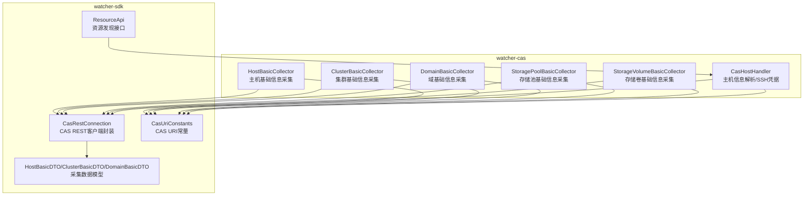
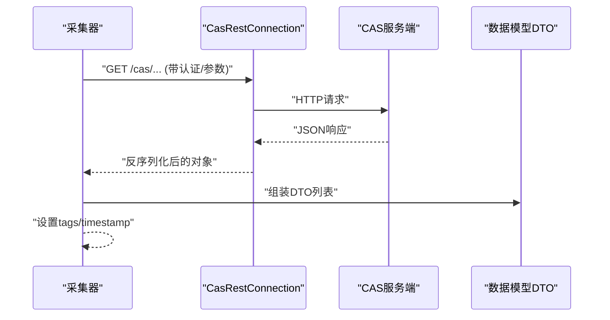
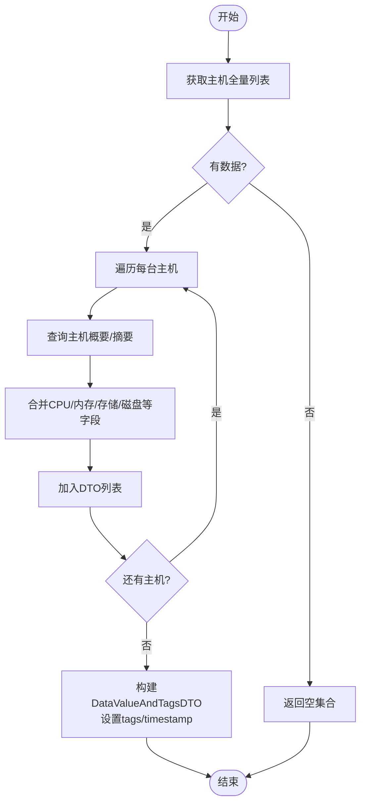
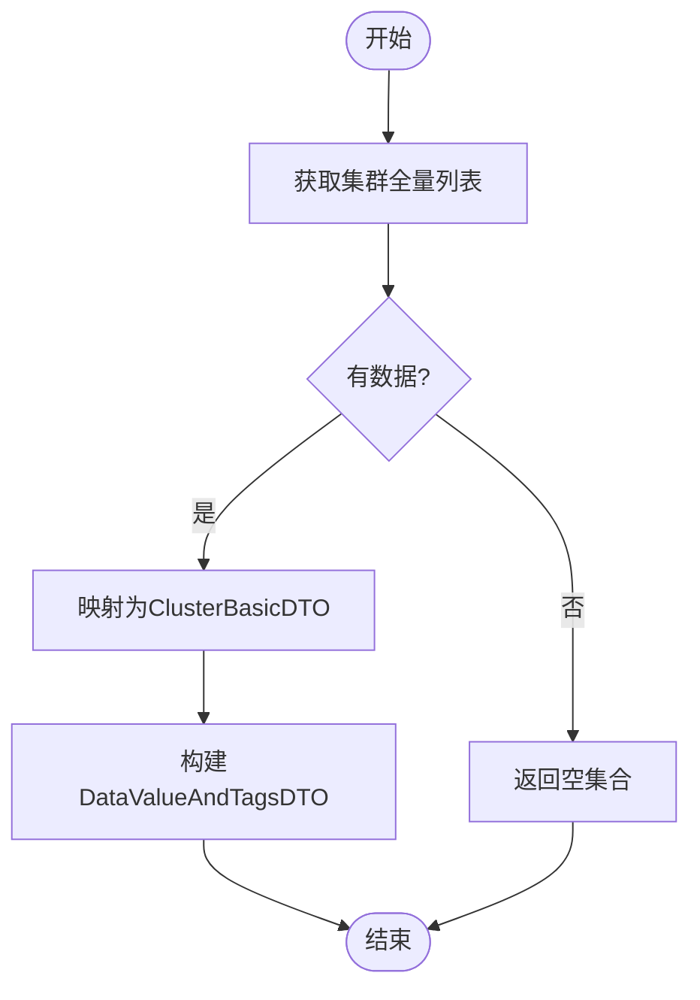
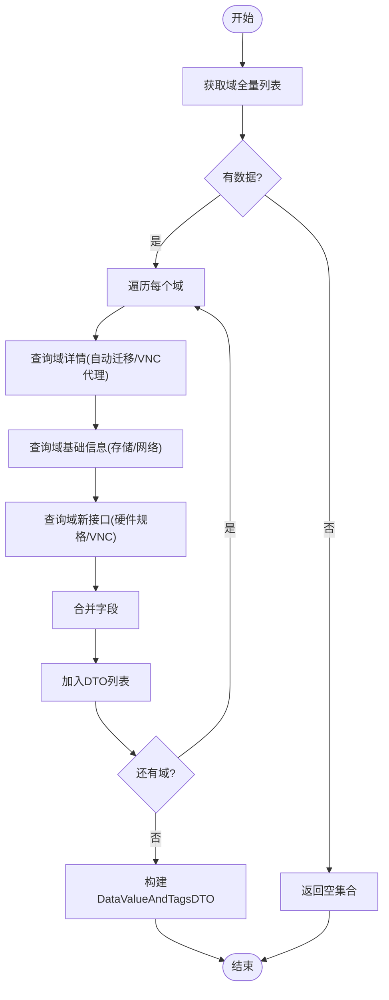
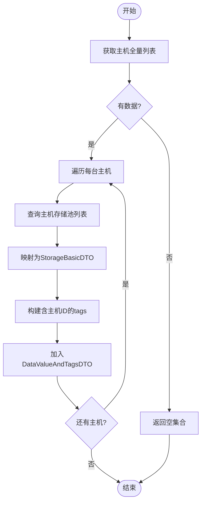
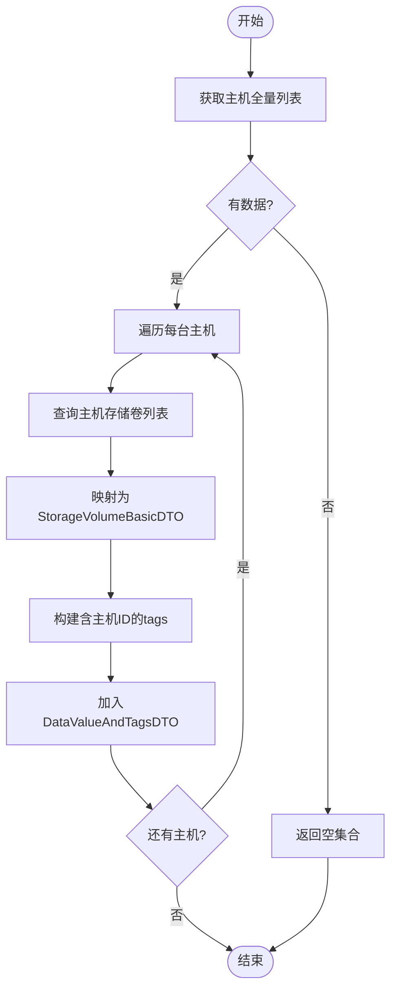
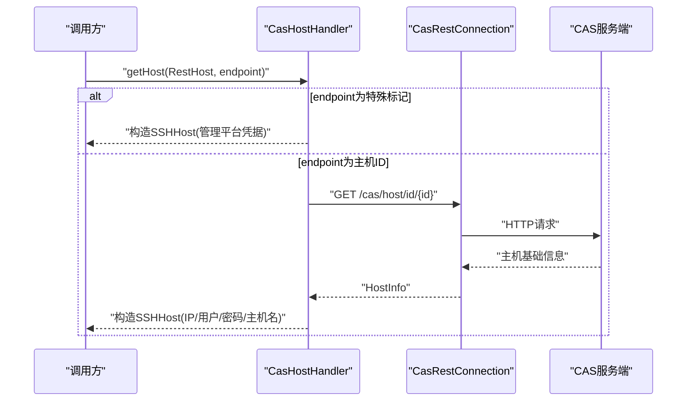
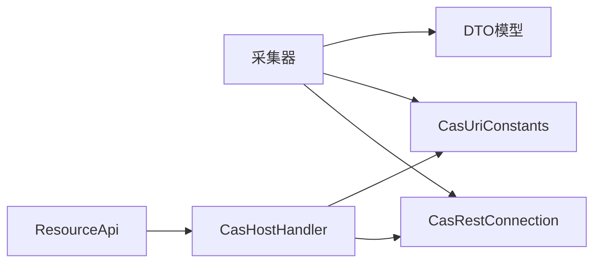

# 资源基础监控

<cite>
**本文引用的文件**
- [CasHostHandler.java](file://watcher-cas/src/main/java/com/virtual/cloud/om/cas/service/CasHostHandler.java)
- [HostBasicCollector.java](file://watcher-cas/src/main/java/com/virtual/cloud/om/cas/service/report/HostBasicCollector.java)
- [ClusterBasicCollector.java](file://watcher-cas/src/main/java/com/virtual/cloud/om/cas/service/report/ClusterBasicCollector.java)
- [DomainBasicCollector.java](file://watcher-cas/src/main/java/com/virtual/cloud/om/cas/service/report/DomainBasicCollector.java)
- [StoragePoolBasicCollector.java](file://watcher-cas/src/main/java/com/virtual/cloud/om/cas/service/report/StoragePoolBasicCollector.java)
- [StorageVolumeBasicCollector.java](file://watcher-cas/src/main/java/com/virtual/cloud/om/cas/service/report/StorageVolumeBasicCollector.java)
- [CasRestConnection.java](file://watcher-sdk/src/main/java/com/virtual/cloud/om/sdk/config/rest/cas/CasRestConnection.java)
- [CasUriConstants.java](file://watcher-sdk/src/main/java/com/virtual/cloud/om/sdk/constant/uri/CasUriConstants.java)
- [HostBasicDTO.java](file://watcher-sdk/src/main/java/com/virtual/cloud/om/sdk/dto/dataReport/cas/HostBasicDTO.java)
- [ClusterBasicDTO.java](file://watcher-sdk/src/main/java/com/virtual/cloud/om/sdk/dto/dataReport/cas/ClusterBasicDTO.java)
- [DomainBasicDTO.java](file://watcher-sdk/src/main/java/com/virtual/cloud/om/sdk/dto/dataReport/cas/DomainBasicDTO.java)
- [ResourceApi.java](file://watcher-sdk/src/main/java/com/virtual/cloud/om/sdk/api/ResourceApi.java)
</cite>

## 目录
1. [引言](#引言)
2. [项目结构](#项目结构)
3. [核心组件](#核心组件)
4. [架构总览](#架构总览)
5. [详细组件分析](#详细组件分析)
6. [依赖关系分析](#依赖关系分析)
7. [性能考量](#性能考量)
8. [故障排查指南](#故障排查指南)
9. [结论](#结论)
10. [附录](#附录)

## 引言
本技术文档聚焦于CAS资源基础监控能力，系统性阐述主机、集群、域（虚拟机）、存储池与存储卷等资源的基础信息采集实现。内容覆盖采集器的工作机制、CAS REST API的调用方式、资源ID解析、数据格式转换与错误处理策略，并给出资源监控数据结构与字段含义，以及扩展新采集器的实践指引。同时说明资源监控数据在整体监控体系中的定位与与其他模块的协作关系。

## 项目结构
CAS资源基础监控位于watcher-cas模块中，围绕watcher-sdk提供的统一REST客户端与URI常量进行CAS资源的拉取与转换；采集结果以统一的数据载体上报给上层数据报告模块。

图表来源
- [HostBasicCollector.java:29-125](file://watcher-cas/src/main/java/com/virtual/cloud/om/cas/service/report/HostBasicCollector.java#L29-L125)
- [ClusterBasicCollector.java:28-72](file://watcher-cas/src/main/java/com/virtual/cloud/om/cas/service/report/ClusterBasicCollector.java#L28-L72)
- [DomainBasicCollector.java:31-163](file://watcher-cas/src/main/java/com/virtual/cloud/om/cas/service/report/DomainBasicCollector.java#L31-L163)
- [StoragePoolBasicCollector.java:29-100](file://watcher-cas/src/main/java/com/virtual/cloud/om/cas/service/report/StoragePoolBasicCollector.java#L29-L100)
- [StorageVolumeBasicCollector.java:30-100](file://watcher-cas/src/main/java/com/virtual/cloud/om/cas/service/report/StorageVolumeBasicCollector.java#L30-L100)
- [CasHostHandler.java:26-60](file://watcher-cas/src/main/java/com/virtual/cloud/om/cas/service/CasHostHandler.java#L26-L60)
- [CasRestConnection.java:26-160](file://watcher-sdk/src/main/java/com/virtual/cloud/om/sdk/config/rest/cas/CasRestConnection.java#L26-L160)
- [CasUriConstants.java:8-822](file://watcher-sdk/src/main/java/com/virtual/cloud/om/sdk/constant/uri/CasUriConstants.java#L8-L822)
- [HostBasicDTO.java:9-115](file://watcher-sdk/src/main/java/com/virtual/cloud/om/sdk/dto/dataReport/cas/HostBasicDTO.java#L9-L115)
- [ClusterBasicDTO.java:9-18](file://watcher-sdk/src/main/java/com/virtual/cloud/om/sdk/dto/dataReport/cas/ClusterBasicDTO.java#L9-L18)
- [DomainBasicDTO.java:15-152](file://watcher-sdk/src/main/java/com/virtual/cloud/om/sdk/dto/dataReport/cas/DomainBasicDTO.java#L15-L152)
- [ResourceApi.java:7-11](file://watcher-sdk/src/main/java/com/virtual/cloud/om/sdk/api/ResourceApi.java#L7-L11)

章节来源
- [CasHostHandler.java:26-60](file://watcher-cas/src/main/java/com/virtual/cloud/om/cas/service/CasHostHandler.java#L26-L60)
- [CasRestConnection.java:26-160](file://watcher-sdk/src/main/java/com/virtual/cloud/om/sdk/config/rest/cas/CasRestConnection.java#L26-L160)
- [CasUriConstants.java:8-822](file://watcher-sdk/src/main/java/com/virtual/cloud/om/sdk/constant/uri/CasUriConstants.java#L8-L822)

## 核心组件
- CAS REST客户端封装：统一发起HTTP请求、处理异常、记录请求与响应、按平台协议选择端口。
- URI常量定义：集中管理CAS各资源的REST接口路径，支持主机、集群、域、存储等子域。
- 数据采集器：面向具体资源类型（主机、集群、域、存储池、存储卷）的采集逻辑，负责调用REST接口、组装数据模型、设置标签与时间戳。
- 资源发现与主机解析：根据资源ID定位REST主机信息，并解析主机SSH凭据。

章节来源
- [CasRestConnection.java:26-160](file://watcher-sdk/src/main/java/com/virtual/cloud/om/sdk/config/rest/cas/CasRestConnection.java#L26-L160)
- [CasUriConstants.java:8-822](file://watcher-sdk/src/main/java/com/virtual/cloud/om/sdk/constant/uri/CasUriConstants.java#L8-L822)
- [HostBasicCollector.java:29-125](file://watcher-cas/src/main/java/com/virtual/cloud/om/cas/service/report/HostBasicCollector.java#L29-L125)
- [ClusterBasicCollector.java:28-72](file://watcher-cas/src/main/java/com/virtual/cloud/om/cas/service/report/ClusterBasicCollector.java#L28-L72)
- [DomainBasicCollector.java:31-163](file://watcher-cas/src/main/java/com/virtual/cloud/om/cas/service/report/DomainBasicCollector.java#L31-L163)
- [StoragePoolBasicCollector.java:29-100](file://watcher-cas/src/main/java/com/virtual/cloud/om/cas/service/report/StoragePoolBasicCollector.java#L29-L100)
- [StorageVolumeBasicCollector.java:30-100](file://watcher-cas/src/main/java/com/virtual/cloud/om/cas/service/report/StorageVolumeBasicCollector.java#L30-L100)
- [CasHostHandler.java:26-60](file://watcher-cas/src/main/java/com/virtual/cloud/om/cas/service/CasHostHandler.java#L26-L60)

## 架构总览
CAS资源基础监控采用“采集器+REST客户端+URI常量+数据模型”的分层设计。采集器通过CasRestConnection调用CasUriConstants中定义的URI，拉取原始JSON数据后映射到SDK层的数据传输对象，最终以统一的数据载体上报。

图表来源
- [HostBasicCollector.java:32-114](file://watcher-cas/src/main/java/com/virtual/cloud/om/cas/service/report/HostBasicCollector.java#L32-L114)
- [CasRestConnection.java:113-139](file://watcher-sdk/src/main/java/com/virtual/cloud/om/sdk/config/rest/cas/CasRestConnection.java#L113-L139)
- [CasUriConstants.java:98-184](file://watcher-sdk/src/main/java/com/virtual/cloud/om/sdk/constant/uri/CasUriConstants.java#L98-L184)

## 详细组件分析

### 主机基础信息采集器（HostBasicCollector）
- 功能概述：拉取所有主机列表，逐台查询主机概要与磁盘利用率等附加信息，组装为HostBasicDTO列表。
- 关键流程：
  - 第一步：调用主机全量接口获取基础信息。
  - 第二步：对每台主机，分别调用主机概要与摘要接口，合并CPU/内存/存储/磁盘利用率等字段。
  - 第三步：将聚合后的DTO列表放入统一数据载体，设置标签与时间戳。
- 错误处理：REST调用异常时抛出统一异常，包含URL与错误信息；单主机异常时跳过该主机继续处理。
- 数据模型：HostBasicDTO包含主机ID、集群ID、名称、IP、提供商、登录凭据、CPU/内存/存储、磁盘利用率、版本、状态、加入时间、系统时间、运行时长、超分比、iLO地址、HA状态等。

图表来源
- [HostBasicCollector.java:32-114](file://watcher-cas/src/main/java/com/virtual/cloud/om/cas/service/report/HostBasicCollector.java#L32-L114)
- [HostBasicDTO.java:9-115](file://watcher-sdk/src/main/java/com/virtual/cloud/om/sdk/dto/dataReport/cas/HostBasicDTO.java#L9-L115)

章节来源
- [HostBasicCollector.java:29-125](file://watcher-cas/src/main/java/com/virtual/cloud/om/cas/service/report/HostBasicCollector.java#L29-L125)
- [HostBasicDTO.java:9-115](file://watcher-sdk/src/main/java/com/virtual/cloud/om/sdk/dto/dataReport/cas/HostBasicDTO.java#L9-L115)

### 集群基础信息采集器（ClusterBasicCollector）
- 功能概述：拉取所有集群信息，组装为ClusterBasicDTO列表。
- 关键流程：调用集群全量接口，遍历集群列表，填充ID、名称、描述、HA状态。
- 数据模型：ClusterBasicDTO包含集群ID、名称、描述、HA启用状态。

图表来源
- [ClusterBasicCollector.java:31-60](file://watcher-cas/src/main/java/com/virtual/cloud/om/cas/service/report/ClusterBasicCollector.java#L31-L60)
- [ClusterBasicDTO.java:9-18](file://watcher-sdk/src/main/java/com/virtual/cloud/om/sdk/dto/dataReport/cas/ClusterBasicDTO.java#L9-L18)

章节来源
- [ClusterBasicCollector.java:28-72](file://watcher-cas/src/main/java/com/virtual/cloud/om/cas/service/report/ClusterBasicCollector.java#L28-L72)
- [ClusterBasicDTO.java:9-18](file://watcher-sdk/src/main/java/com/virtual/cloud/om/sdk/dto/dataReport/cas/ClusterBasicDTO.java#L9-L18)

### 域（虚拟机）基础信息采集器（DomainBasicCollector）
- 功能概述：拉取所有域（虚拟机）列表，逐台查询详情、基本与网络信息，组装为DomainBasicDTO列表。
- 关键流程：
  - 第一步：获取域全量列表。
  - 第二步：对每个域，调用详情接口获取自动迁移、VNC代理等布尔字段；调用基础信息接口获取存储与网络列表；调用新接口获取CPU Socket/Core、VNC端口、显示类型等。
  - 第三步：将聚合后的DTO列表放入统一数据载体。
- 数据模型：DomainBasicDTO包含ID、UUID、集群ID、名称、标题、描述、宿主ID、CASTools状态/版本、系统类型、状态、OS描述、运行时长、创建时间、自动迁移、保护模式、VNC代理、CPU/内存、VNC端口、显示类型、存储与网络列表等。

图表来源
- [DomainBasicCollector.java:34-151](file://watcher-cas/src/main/java/com/virtual/cloud/om/cas/service/report/DomainBasicCollector.java#L34-L151)
- [DomainBasicDTO.java:15-152](file://watcher-sdk/src/main/java/com/virtual/cloud/om/sdk/dto/dataReport/cas/DomainBasicDTO.java#L15-L152)

章节来源
- [DomainBasicCollector.java:31-163](file://watcher-cas/src/main/java/com/virtual/cloud/om/cas/service/report/DomainBasicCollector.java#L31-L163)
- [DomainBasicDTO.java:15-152](file://watcher-sdk/src/main/java/com/virtual/cloud/om/sdk/dto/dataReport/cas/DomainBasicDTO.java#L15-L152)

### 存储池基础信息采集器（StoragePoolBasicCollector）
- 功能概述：先获取主机列表，再对每台主机查询其存储池列表，组装为StorageBasicDTO列表，并携带主机标签。
- 关键流程：按主机维度循环，调用存储池查询接口，填充存储池名称、类型、路径、容量、分配、剩余、状态、自启动、符号链接等字段。
- 数据模型：StorageBasicDTO包含存储池名称、类型、路径、总大小、分配、剩余、状态、自启动、符号链接等。

图表来源
- [StoragePoolBasicCollector.java:32-88](file://watcher-cas/src/main/java/com/virtual/cloud/om/cas/service/report/StoragePoolBasicCollector.java#L32-L88)

章节来源
- [StoragePoolBasicCollector.java:29-100](file://watcher-cas/src/main/java/com/virtual/cloud/om/cas/service/report/StoragePoolBasicCollector.java#L29-L100)

### 存储卷基础信息采集器（StorageVolumeBasicCollector）
- 功能概述：先获取主机列表，再对每台主机查询其存储卷列表，组装为StorageVolumeBasicDTO列表，并携带主机标签。
- 关键流程：按主机维度循环，调用存储卷查询接口，填充存储池名、卷名、大小、分配、格式、用户、是否基镜像、是否临时镜像等字段。
- 数据模型：StorageVolumeBasicDTO包含存储池名、卷名、大小、分配、格式、用户、是否基镜像、是否临时镜像等。

图表来源
- [StorageVolumeBasicCollector.java:33-87](file://watcher-cas/src/main/java/com/virtual/cloud/om/cas/service/report/StorageVolumeBasicCollector.java#L33-L87)

章节来源
- [StorageVolumeBasicCollector.java:30-100](file://watcher-cas/src/main/java/com/virtual/cloud/om/cas/service/report/StorageVolumeBasicCollector.java#L30-L100)

### 主机信息解析与SSH凭据（CasHostHandler）
- 功能概述：根据资源ID与endpoint解析目标主机的SSH访问信息；当endpoint为特定值时，构造管理平台访问凭据。
- 关键流程：若endpoint为特殊标记，则直接构造SSHHost；否则按endpoint作为主机ID查询主机基础信息，再构造SSHHost。
- 适用场景：在需要对主机执行远程操作或采集时，提供准确的IP、用户名、密码与主机标识。

图表来源
- [CasHostHandler.java:31-42](file://watcher-cas/src/main/java/com/virtual/cloud/om/cas/service/CasHostHandler.java#L31-L42)
- [CasRestConnection.java:113-117](file://watcher-sdk/src/main/java/com/virtual/cloud/om/sdk/config/rest/cas/CasRestConnection.java#L113-L117)
- [CasUriConstants.java:98-121](file://watcher-sdk/src/main/java/com/virtual/cloud/om/sdk/constant/uri/CasUriConstants.java#L98-L121)

章节来源
- [CasHostHandler.java:26-60](file://watcher-cas/src/main/java/com/virtual/cloud/om/cas/service/CasHostHandler.java#L26-L60)

## 依赖关系分析
- 采集器对CasRestConnection与CasUriConstants存在直接依赖，用于REST调用与URI拼装。
- 采集器输出统一的数据载体，供上层数据报告模块消费。
- 资源发现接口ResourceApi用于根据资源ID查找对应的REST主机配置，CasHostHandler基于此解析SSH凭据。

图表来源
- [HostBasicCollector.java:29-125](file://watcher-cas/src/main/java/com/virtual/cloud/om/cas/service/report/HostBasicCollector.java#L29-L125)
- [CasRestConnection.java:26-160](file://watcher-sdk/src/main/java/com/virtual/cloud/om/sdk/config/rest/cas/CasRestConnection.java#L26-L160)
- [CasUriConstants.java:8-822](file://watcher-sdk/src/main/java/com/virtual/cloud/om/sdk/constant/uri/CasUriConstants.java#L8-L822)
- [CasHostHandler.java:26-60](file://watcher-cas/src/main/java/com/virtual/cloud/om/cas/service/CasHostHandler.java#L26-L60)
- [ResourceApi.java:7-11](file://watcher-sdk/src/main/java/com/virtual/cloud/om/sdk/api/ResourceApi.java#L7-L11)

章节来源
- [ResourceApi.java:7-11](file://watcher-sdk/src/main/java/com/virtual/cloud/om/sdk/api/ResourceApi.java#L7-L11)
- [CasHostHandler.java:26-60](file://watcher-cas/src/main/java/com/virtual/cloud/om/cas/service/CasHostHandler.java#L26-L60)

## 性能考量
- 批量拉取与串行查询：主机/域/存储卷等采集通常按主机维度循环，存在多次REST往返；建议在上层调度层控制并发与重试策略，避免对CAS服务端造成压力。
- 数据转换与单位换算：采集器中涉及单位换算（如内存大小），应尽量复用工具类，减少重复计算。
- 标签与时间戳：统一设置tags与timestamp，有助于后续聚合与去重。
- 端口与协议：CasRestConnection会根据平台与协议动态选择端口，确保请求命中正确端口，避免额外失败重试。

## 故障排查指南
- REST调用异常：
  - 统一异常包装：采集器在REST调用失败时抛出应用异常，包含URL与错误信息，便于定位问题。
  - 客户端异常处理：CasRestConnection对HTTP 409冲突等进行特殊处理，从响应头提取错误码与消息。
- 单条数据异常：
  - 采集器内部对单主机/单域/单存储卷异常进行捕获并跳过，保证整体采集进度。
- 资源ID解析：
  - 若endpoint为特殊标记，直接构造管理平台凭据；否则需确保endpoint为有效主机ID且可被CAS识别。

章节来源
- [HostBasicCollector.java:46-48](file://watcher-cas/src/main/java/com/virtual/cloud/om/cas/service/report/HostBasicCollector.java#L46-L48)
- [CasRestConnection.java:67-93](file://watcher-sdk/src/main/java/com/virtual/cloud/om/sdk/config/rest/cas/CasRestConnection.java#L67-L93)
- [CasHostHandler.java:33-36](file://watcher-cas/src/main/java/com/virtual/cloud/om/cas/service/CasHostHandler.java#L33-L36)

## 结论
CAS资源基础监控通过标准化的采集器、统一的REST客户端与URI常量，实现了对主机、集群、域、存储池与存储卷的稳定采集。采集器遵循一致的数据模型与上报格式，具备良好的可扩展性。结合资源发现与主机解析能力，可进一步完善跨资源的联动监控与运维自动化。

## 附录

### 新增采集器实践指引（步骤级）
- 明确资源类型与目标URI：参考CasUriConstants中对应资源域的URI常量，确定全量列表与详情接口。
- 编写采集器：
  - 继承统一采集基类，实现collect方法，按资源维度循环拉取数据。
  - 使用CasRestConnection发起GET请求，使用ParameterizedTypeReference声明泛型类型。
  - 将返回对象映射到SDK层DTO模型，设置tags与timestamp。
- 错误处理：
  - 对REST调用异常进行捕获并抛出统一异常；对单条数据异常进行局部处理并继续。
- 注册与调度：
  - 采集器为Spring组件，按需纳入定时任务或事件驱动调度。
- 数据模型：
  - DTO字段命名与含义需与现有模型保持一致，便于上层聚合与展示。

章节来源
- [CasUriConstants.java:98-184](file://watcher-sdk/src/main/java/com/virtual/cloud/om/sdk/constant/uri/CasUriConstants.java#L98-L184)
- [CasRestConnection.java:113-117](file://watcher-sdk/src/main/java/com/virtual/cloud/om/sdk/config/rest/cas/CasRestConnection.java#L113-L117)
- [HostBasicCollector.java:32-114](file://watcher-cas/src/main/java/com/virtual/cloud/om/cas/service/report/HostBasicCollector.java#L32-L114)