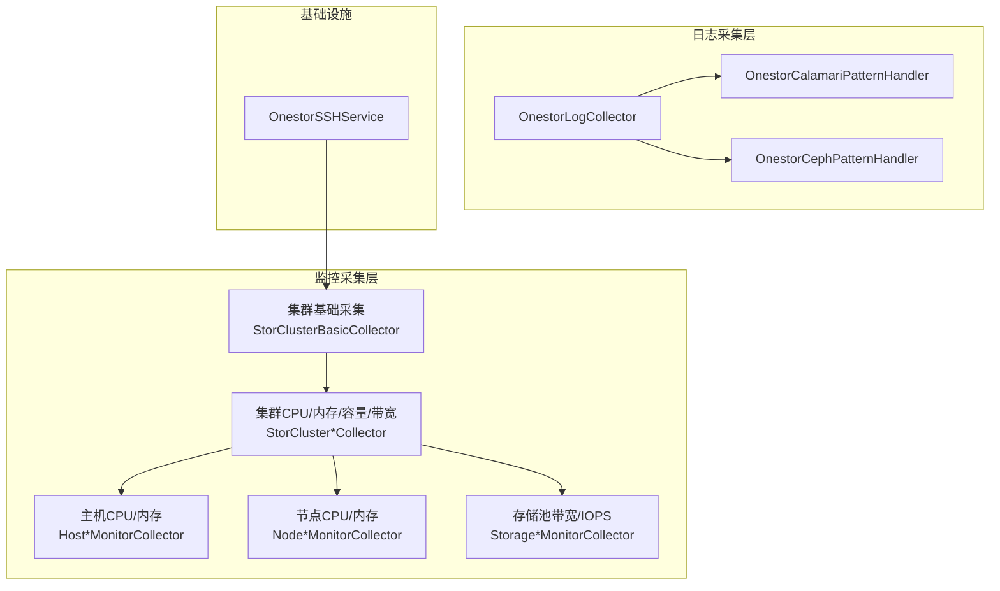
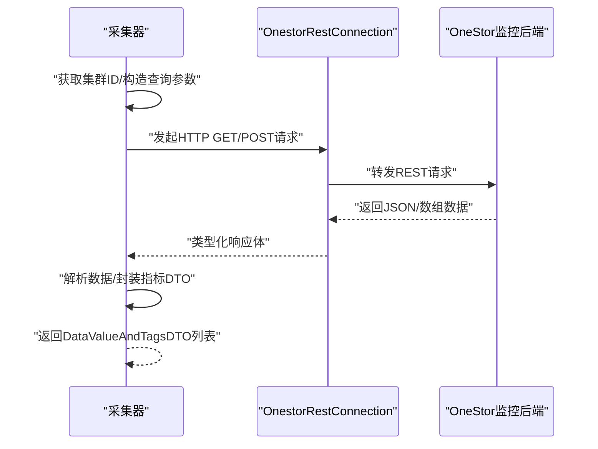
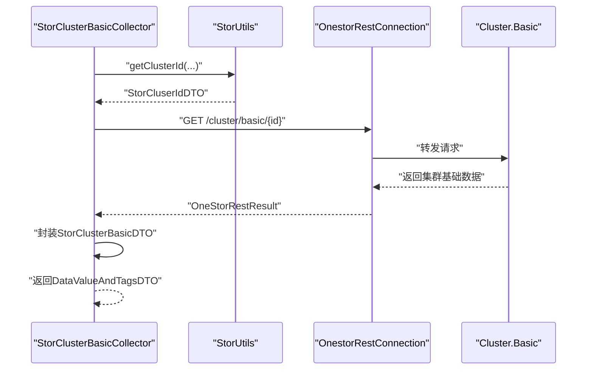
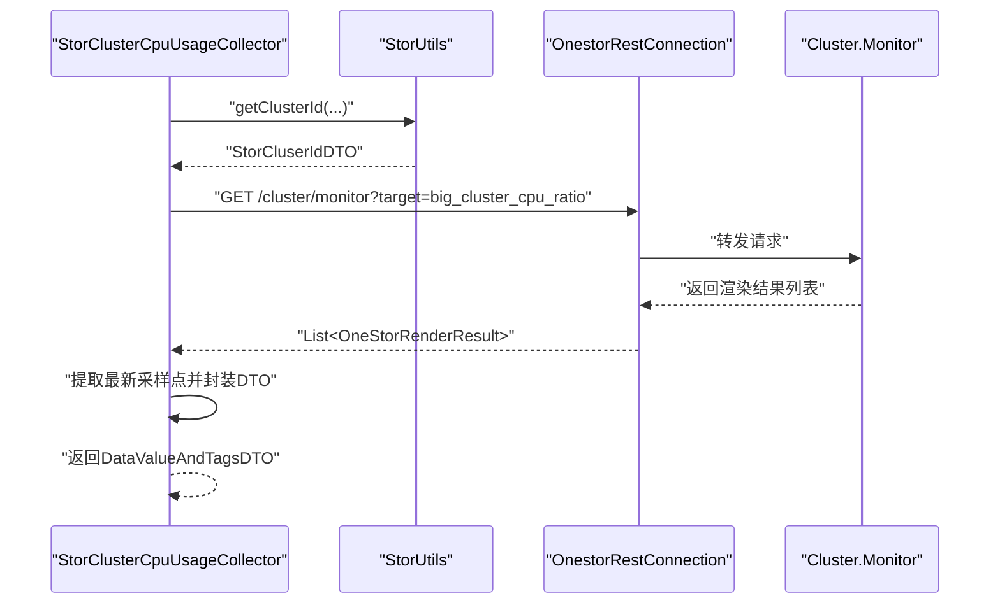
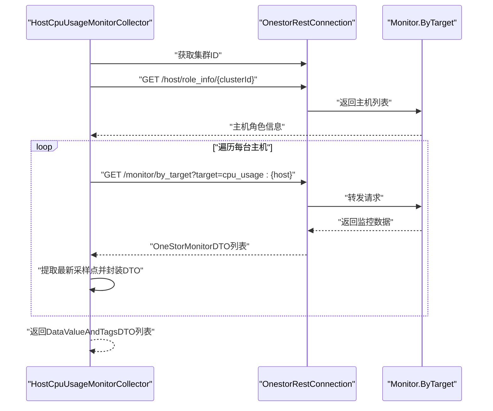
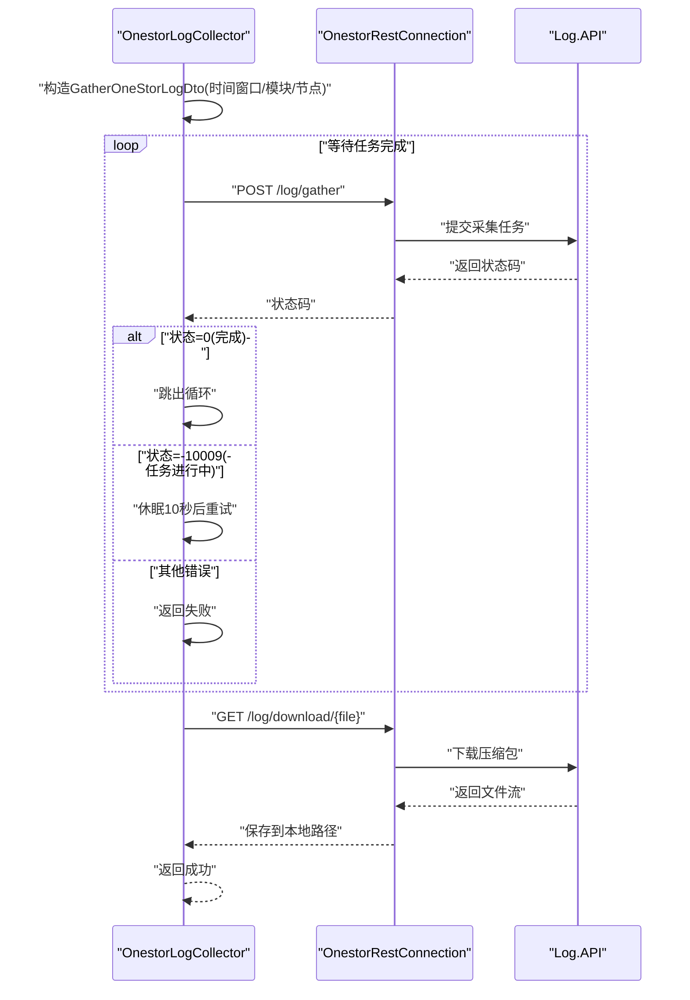
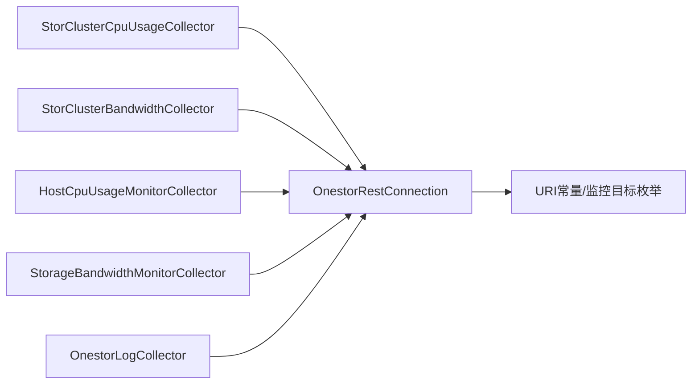

# OneStor存储监控模块

<cite>
**本文引用的文件**
- [StorClusterBasicCollector.java](file://watcher-onestor/src/main/java/com/virtual/cloud/om/onestor/service/clusterBasic/StorClusterBasicCollector.java)
- [StorClusterCpuUsageCollector.java](file://watcher-onestor/src/main/java/com/virtual/cloud/om/onestor/service/clusterBasic/StorClusterCpuUsageCollector.java)
- [StorClusterMemUsageCollector.java](file://watcher-onestor/src/main/java/com/virtual/cloud/om/onestor/service/clusterBasic/StorClusterMemUsageCollector.java)
- [StorClusterCapacityCollector.java](file://watcher-onestor/src/main/java/com/virtual/cloud/om/onestor/service/clusterBasic/StorClusterCapacityCollector.java)
- [StorClusterBandwidthCollector.java](file://watcher-onestor/src/main/java/com/virtual/cloud/om/onestor/service/clusterBasic/StorClusterBandwidthCollector.java)
- [HostCpuUsageMonitorCollector.java](file://watcher-onestor/src/main/java/com/virtual/cloud/om/onestor/service/report/monitor/host/HostCpuUsageMonitorCollector.java)
- [HostMemUsageMonitorCollector.java](file://watcher-onestor/src/main/java/com/virtual/cloud/om/onestor/service/report/monitor/host/HostMemUsageMonitorCollector.java)
- [NodeCpuUsageMonitorCollector.java](file://watcher-onestor/src/main/java/com/virtual/cloud/om/onestor/service/report/monitor/node/NodeCpuUsageMonitorCollector.java)
- [NodeMemUsageMonitorCollector.java](file://watcher-onestor/src/main/java/com/virtual/cloud/om/onestor/service/report/monitor/node/NodeMemUsageMonitorCollector.java)
- [StorageBandwidthMonitorCollector.java](file://watcher-onestor/src/main/java/com/virtual/cloud/om/onestor/service/report/monitor/storage/StorageBandwidthMonitorCollector.java)
- [StorageIOPSMonitorCollector.java](file://watcher-onestor/src/main/java/com/virtual/cloud/om/onestor/service/report/monitor/storage/StorageIOPSMonitorCollector.java)
- [OnestorLogCollector.java](file://watcher-onestor/src/main/java/com/virtual/cloud/om/onestor/service/log/OnestorLogCollector.java)
- [OnestorCalamariPatternHandler.java](file://watcher-onestor/src/main/java/com/virtual/cloud/om/onestor/service/OnestorCalamariPatternHandler.java)
- [OnestorCephPatternHandler.java](file://watcher-onestor/src/main/java/com/virtual/cloud/om/onestor/service/OnestorCephPatternHandler.java)
- [OnestorSSHService.java](file://watcher-onestor/src/main/java/com/virtual/cloud/om/onestor/service/ssh/OnestorSSHService.java)
</cite>

## 目录
1. [简介](#简介)
2. [项目结构](#项目结构)
3. [核心组件](#核心组件)
4. [架构总览](#架构总览)
5. [详细组件分析](#详细组件分析)
6. [依赖分析](#依赖分析)
7. [性能考虑](#性能考虑)
8. [故障排查指南](#故障排查指南)
9. [结论](#结论)
10. [附录](#附录)

## 简介
本技术文档面向OneStor分布式存储系统的监控模块，系统性梳理了存储集群监控、主机性能监控、节点监控以及存储容量与带宽监控的实现方式，并对OneStor日志采集与解析体系进行深入说明。文档以代码级分析为基础，辅以可视化图示，帮助开发者理解监控采集流程、数据结构与扩展路径。

## 项目结构
监控模块位于watcher-onestor工程中，主要由以下子包构成：
- clusterBasic：存储集群基础与关键指标采集器
- report/monitor：按维度（主机、节点、存储池）的监控采集器
- log：批量日志采集器
- ssh：资源类型与认证适配
- 核心常量与枚举：通过SDK提供的URI常量、监控目标枚举与指标类型枚举统一访问后端接口

图表来源
- [StorClusterBasicCollector.java:33-76](file://watcher-onestor/src/main/java/com/virtual/cloud/om/onestor/service/clusterBasic/StorClusterBasicCollector.java#L33-L76)
- [StorClusterCpuUsageCollector.java:36-84](file://watcher-onestor/src/main/java/com/virtual/cloud/om/onestor/service/clusterBasic/StorClusterCpuUsageCollector.java#L36-L84)
- [StorClusterMemUsageCollector.java:36-82](file://watcher-onestor/src/main/java/com/virtual/cloud/om/onestor/service/clusterBasic/StorClusterMemUsageCollector.java#L36-L82)
- [StorClusterCapacityCollector.java:36-87](file://watcher-onestor/src/main/java/com/virtual/cloud/om/onestor/service/clusterBasic/StorClusterCapacityCollector.java#L36-L87)
- [StorClusterBandwidthCollector.java:37-120](file://watcher-onestor/src/main/java/com/virtual/cloud/om/onestor/service/clusterBasic/StorClusterBandwidthCollector.java#L37-L120)
- [HostCpuUsageMonitorCollector.java:35-79](file://watcher-onestor/src/main/java/com/virtual/cloud/om/onestor/service/report/monitor/host/HostCpuUsageMonitorCollector.java#L35-L79)
- [HostMemUsageMonitorCollector.java:36-80](file://watcher-onestor/src/main/java/com/virtual/cloud/om/onestor/service/report/monitor/host/HostMemUsageMonitorCollector.java#L36-L80)
- [NodeCpuUsageMonitorCollector.java:33-79](file://watcher-onestor/src/main/java/com/virtual/cloud/om/onestor/service/report/monitor/node/NodeCpuUsageMonitorCollector.java#L33-L79)
- [NodeMemUsageMonitorCollector.java:35-79](file://watcher-onestor/src/main/java/com/virtual/cloud/om/onestor/service/report/monitor/node/NodeMemUsageMonitorCollector.java#L35-L79)
- [StorageBandwidthMonitorCollector.java:32-82](file://watcher-onestor/src/main/java/com/virtual/cloud/om/onestor/service/report/monitor/storage/StorageBandwidthMonitorCollector.java#L32-L82)
- [StorageIOPSMonitorCollector.java:32-82](file://watcher-onestor/src/main/java/com/virtual/cloud/om/onestor/service/report/monitor/storage/StorageIOPSMonitorCollector.java#L32-L82)
- [OnestorLogCollector.java:26-92](file://watcher-onestor/src/main/java/com/virtual/cloud/om/onestor/service/log/OnestorLogCollector.java#L26-L92)
- [OnestorCalamariPatternHandler.java:17-57](file://watcher-onestor/src/main/java/com/virtual/cloud/om/onestor/service/OnestorCalamariPatternHandler.java#L17-L57)
- [OnestorCephPatternHandler.java:15-51](file://watcher-onestor/src/main/java/com/virtual/cloud/om/onestor/service/OnestorCephPatternHandler.java#L15-L51)
- [OnestorSSHService.java:16-36](file://watcher-onestor/src/main/java/com/virtual/cloud/om/onestor/service/ssh/OnestorSSHService.java#L16-L36)

章节来源
- [StorClusterBasicCollector.java:33-76](file://watcher-onestor/src/main/java/com/virtual/cloud/om/onestor/service/clusterBasic/StorClusterBasicCollector.java#L33-L76)
- [OnestorLogCollector.java:26-92](file://watcher-onestor/src/main/java/com/virtual/cloud/om/onestor/service/log/OnestorLogCollector.java#L26-L92)

## 核心组件
- 集群基础信息采集器：负责获取集群标识与基础元数据，作为后续所有指标采集的上下文依据。
- 集群关键指标采集器：覆盖CPU使用率、内存使用率、存储容量、带宽等核心指标。
- 主机监控采集器：按主机粒度采集CPU/内存使用率等指标。
- 节点池监控采集器：按节点池粒度采集CPU/内存使用率与容量。
- 存储池监控采集器：按存储池粒度采集带宽与IOPS。
- 日志采集器：支持批量下载OneStor系统日志，并对特定日志类型进行解析。
- SSH服务：提供资源类型与认证适配能力。

章节来源
- [StorClusterCpuUsageCollector.java:36-84](file://watcher-onestor/src/main/java/com/virtual/cloud/om/onestor/service/clusterBasic/StorClusterCpuUsageCollector.java#L36-L84)
- [StorClusterMemUsageCollector.java:36-82](file://watcher-onestor/src/main/java/com/virtual/cloud/om/onestor/service/clusterBasic/StorClusterMemUsageCollector.java#L36-L82)
- [StorClusterCapacityCollector.java:36-87](file://watcher-onestor/src/main/java/com/virtual/cloud/om/onestor/service/clusterBasic/StorClusterCapacityCollector.java#L36-L87)
- [StorClusterBandwidthCollector.java:37-120](file://watcher-onestor/src/main/java/com/virtual/cloud/om/onestor/service/clusterBasic/StorClusterBandwidthCollector.java#L37-L120)
- [HostCpuUsageMonitorCollector.java:35-79](file://watcher-onestor/src/main/java/com/virtual/cloud/om/onestor/service/report/monitor/host/HostCpuUsageMonitorCollector.java#L35-L79)
- [HostMemUsageMonitorCollector.java:36-80](file://watcher-onestor/src/main/java/com/virtual/cloud/om/onestor/service/report/monitor/host/HostMemUsageMonitorCollector.java#L36-L80)
- [NodeCpuUsageMonitorCollector.java:33-79](file://watcher-onestor/src/main/java/com/virtual/cloud/om/onestor/service/report/monitor/node/NodeCpuUsageMonitorCollector.java#L33-L79)
- [NodeMemUsageMonitorCollector.java:35-79](file://watcher-onestor/src/main/java/com/virtual/cloud/om/onestor/service/report/monitor/node/NodeMemUsageMonitorCollector.java#L35-L79)
- [StorageBandwidthMonitorCollector.java:32-82](file://watcher-onestor/src/main/java/com/virtual/cloud/om/onestor/service/report/monitor/storage/StorageBandwidthMonitorCollector.java#L32-L82)
- [StorageIOPSMonitorCollector.java:32-82](file://watcher-onestor/src/main/java/com/virtual/cloud/om/onestor/service/report/monitor/storage/StorageIOPSMonitorCollector.java#L32-L82)
- [OnestorLogCollector.java:26-92](file://watcher-onestor/src/main/java/com/virtual/cloud/om/onestor/service/log/OnestorLogCollector.java#L26-L92)
- [OnestorSSHService.java:16-36](file://watcher-onestor/src/main/java/com/virtual/cloud/om/onestor/service/ssh/OnestorSSHService.java#L16-L36)

## 架构总览
监控采集采用“采集器-连接器-后端接口”的分层设计：
- 采集器：各维度监控采集器继承统一的数据采集基类，负责构造请求参数、调用REST连接器、解析响应并封装指标数据。
- 连接器：统一的REST连接器封装HTTP调用、参数化URL与类型化响应。
- 后端接口：通过常量定义的URI与监控目标枚举访问OneStor监控后端。

图表来源
- [StorClusterCpuUsageCollector.java:42-73](file://watcher-onestor/src/main/java/com/virtual/cloud/om/onestor/service/clusterBasic/StorClusterCpuUsageCollector.java#L42-L73)
- [StorClusterBandwidthCollector.java:41-109](file://watcher-onestor/src/main/java/com/virtual/cloud/om/onestor/service/clusterBasic/StorClusterBandwidthCollector.java#L41-L109)
- [OnestorLogCollector.java:32-85](file://watcher-onestor/src/main/java/com/virtual/cloud/om/onestor/service/log/OnestorLogCollector.java#L32-L85)

## 详细组件分析

### 存储集群基础监控器
- 功能职责：获取集群ID与基础信息（如客户端名称、集群名称），作为其他指标采集的上下文。
- 关键流程：
  - 通过工具类获取集群ID
  - 拼装基础信息查询URL
  - 调用REST连接器获取数据
  - 封装为JSON格式的指标数据

图表来源
- [StorClusterBasicCollector.java:38-65](file://watcher-onestor/src/main/java/com/virtual/cloud/om/onestor/service/clusterBasic/StorClusterBasicCollector.java#L38-L65)

章节来源
- [StorClusterBasicCollector.java:33-76](file://watcher-onestor/src/main/java/com/virtual/cloud/om/onestor/service/clusterBasic/StorClusterBasicCollector.java#L33-L76)

### 集群CPU使用率采集器
- 功能职责：采集集群整体CPU使用率，解析最近一次采样点的时间戳与数值。
- 关键流程：
  - 获取集群ID
  - 组装监控查询URL（目标为集群CPU比率）
  - 解析返回结果，取最新时间点的比率值
  - 封装为指标DTO并返回

图表来源
- [StorClusterCpuUsageCollector.java:42-73](file://watcher-onestor/src/main/java/com/virtual/cloud/om/onestor/service/clusterBasic/StorClusterCpuUsageCollector.java#L42-L73)

章节来源
- [StorClusterCpuUsageCollector.java:36-84](file://watcher-onestor/src/main/java/com/virtual/cloud/om/onestor/service/clusterBasic/StorClusterCpuUsageCollector.java#L36-L84)

### 集群内存使用率采集器
- 功能职责：采集集群整体内存使用率，解析最近一次采样点的时间戳与数值。
- 关键流程：
  - 获取集群ID
  - 组装监控查询URL（目标为集群内存比率）
  - 解析返回结果，取最新时间点的比率值
  - 封装为指标DTO并返回

章节来源
- [StorClusterMemUsageCollector.java:36-82](file://watcher-onestor/src/main/java/com/virtual/cloud/om/onestor/service/clusterBasic/StorClusterMemUsageCollector.java#L36-L82)

### 集群容量采集器
- 功能职责：采集集群总容量与已用容量，解析最近一次采样点的时间戳与数值。
- 关键流程：
  - 获取集群ID
  - 组装监控查询URL（目标为总容量与已用容量）
  - 解析返回结果，取最新时间点的总量与用量
  - 封装为指标DTO并返回

章节来源
- [StorClusterCapacityCollector.java:36-87](file://watcher-onestor/src/main/java/com/virtual/cloud/om/onestor/service/clusterBasic/StorClusterCapacityCollector.java#L36-L87)

### 集群带宽采集器
- 功能职责：采集存储读写带宽、恢复带宽、FS读写带宽与总体带宽等多维指标。
- 关键流程：
  - 获取集群ID
  - 组装全量监控查询URL
  - 解析返回结果，提取各类带宽指标的最新采样点
  - 封装为指标DTO并返回

章节来源
- [StorClusterBandwidthCollector.java:37-120](file://watcher-onestor/src/main/java/com/virtual/cloud/om/onestor/service/clusterBasic/StorClusterBandwidthCollector.java#L37-L120)

### 主机监控机制
- 主机CPU使用率采集器：
  - 获取集群ID与主机角色信息
  - 针对每台主机拼装监控查询URL（目标为主机CPU使用率）
  - 解析返回结果，封装主机CPU使用率指标
- 主机内存使用率采集器：
  - 获取集群ID与主机角色信息
  - 针对每台主机拼装监控查询URL（目标为主机内存使用率）
  - 解析返回结果，封装主机内存使用率指标

图表来源
- [HostCpuUsageMonitorCollector.java:38-66](file://watcher-onestor/src/main/java/com/virtual/cloud/om/onestor/service/report/monitor/host/HostCpuUsageMonitorCollector.java#L38-L66)
- [HostMemUsageMonitorCollector.java:39-67](file://watcher-onestor/src/main/java/com/virtual/cloud/om/onestor/service/report/monitor/host/HostMemUsageMonitorCollector.java#L39-L67)

章节来源
- [HostCpuUsageMonitorCollector.java:35-79](file://watcher-onestor/src/main/java/com/virtual/cloud/om/onestor/service/report/monitor/host/HostCpuUsageMonitorCollector.java#L35-L79)
- [HostMemUsageMonitorCollector.java:36-80](file://watcher-onestor/src/main/java/com/virtual/cloud/om/onestor/service/report/monitor/host/HostMemUsageMonitorCollector.java#L36-L80)

### 节点监控系统
- 节点CPU使用率采集器：
  - 获取集群ID与节点池基本信息
  - 针对每个节点池拼装监控查询URL（目标为节点CPU使用率与容量）
  - 解析返回结果，封装节点CPU使用率与容量指标
- 节点内存使用率采集器：
  - 获取集群ID与节点池基本信息
  - 针对每个节点池拼装监控查询URL（目标为节点内存使用率）
  - 解析返回结果，封装节点内存使用率指标

章节来源
- [NodeCpuUsageMonitorCollector.java:33-79](file://watcher-onestor/src/main/java/com/virtual/cloud/om/onestor/service/report/monitor/node/NodeCpuUsageMonitorCollector.java#L33-L79)
- [NodeMemUsageMonitorCollector.java:35-79](file://watcher-onestor/src/main/java/com/virtual/cloud/om/onestor/service/report/monitor/node/NodeMemUsageMonitorCollector.java#L35-L79)

### 存储监控器
- 存储带宽监控采集器：
  - 获取集群ID与存储池基本信息
  - 针对每个存储池拼装监控查询URL（目标为读/写带宽、总带宽、聚合IOPS）
  - 解析返回结果，封装存储带宽与IOPS指标
- 存储IOPS监控采集器：
  - 获取集群ID与存储池基本信息
  - 针对每个存储池拼装监控查询URL（目标为读/写IOPS、总IOPS、总带宽）
  - 解析返回结果，封装存储带宽与IOPS指标

章节来源
- [StorageBandwidthMonitorCollector.java:32-82](file://watcher-onestor/src/main/java/com/virtual/cloud/om/onestor/service/report/monitor/storage/StorageBandwidthMonitorCollector.java#L32-L82)
- [StorageIOPSMonitorCollector.java:32-82](file://watcher-onestor/src/main/java/com/virtual/cloud/om/onestor/service/report/monitor/storage/StorageIOPSMonitorCollector.java#L32-L82)

### OneStor日志采集与解析系统
- 批量日志采集器：
  - 构造日志采集请求（时间窗口、模块集合、节点列表）
  - 循环等待采集任务完成（轮询状态）
  - 下载打包后的日志文件
- 日志解析处理器：
  - Calamari日志：基于正则表达式解析时间、级别、PID、脚本、方法、行号与消息体
  - Ceph日志：基于正则表达式解析时间前缀与消息体

图表来源
- [OnestorLogCollector.java:32-85](file://watcher-onestor/src/main/java/com/virtual/cloud/om/onestor/service/log/OnestorLogCollector.java#L32-L85)

章节来源
- [OnestorLogCollector.java:26-92](file://watcher-onestor/src/main/java/com/virtual/cloud/om/onestor/service/log/OnestorLogCollector.java#L26-L92)
- [OnestorCalamariPatternHandler.java:17-57](file://watcher-onestor/src/main/java/com/virtual/cloud/om/onestor/service/OnestorCalamariPatternHandler.java#L17-L57)
- [OnestorCephPatternHandler.java:15-51](file://watcher-onestor/src/main/java/com/virtual/cloud/om/onestor/service/OnestorCephPatternHandler.java#L15-L51)

## 依赖分析
- 组件内聚与耦合：
  - 各采集器均依赖统一的REST连接器与常量定义，降低对具体后端实现的耦合
  - 采集器之间通过公共的DTO与指标枚举进行解耦
- 外部依赖：
  - SDK中的REST连接器、URI常量、指标枚举与通用工具类
  - Jackson用于JSON反序列化
  - Guava用于集合操作

图表来源
- [StorClusterCpuUsageCollector.java:36-84](file://watcher-onestor/src/main/java/com/virtual/cloud/om/onestor/service/clusterBasic/StorClusterCpuUsageCollector.java#L36-L84)
- [StorClusterBandwidthCollector.java:37-120](file://watcher-onestor/src/main/java/com/virtual/cloud/om/onestor/service/clusterBasic/StorClusterBandwidthCollector.java#L37-L120)
- [HostCpuUsageMonitorCollector.java:35-79](file://watcher-onestor/src/main/java/com/virtual/cloud/om/onestor/service/report/monitor/host/HostCpuUsageMonitorCollector.java#L35-L79)
- [StorageBandwidthMonitorCollector.java:32-82](file://watcher-onestor/src/main/java/com/virtual/cloud/om/onestor/service/report/monitor/storage/StorageBandwidthMonitorCollector.java#L32-L82)
- [OnestorLogCollector.java:26-92](file://watcher-onestor/src/main/java/com/virtual/cloud/om/onestor/service/log/OnestorLogCollector.java#L26-L92)

## 性能考虑
- 并行化采集：主机与节点池监控采集器使用并行流对多个目标进行并发采集，提升吞吐
- 最新采样点选择：统一从返回结果的最后一个采样点取值，避免全量数据处理开销
- 批量日志采集：通过状态轮询与大文件下载减少阻塞，合理设置轮询间隔
- DTO封装：统一返回DataValueAndTagsDTO，便于上层统一处理与上报

## 故障排查指南
- 集群ID为空：当无法获取集群ID时，采集器会记录日志并返回空列表，需检查平台、主机、协议、端口、用户名与密码配置
- 监控接口异常：若REST连接器返回空或状态异常，采集器会记录错误并返回空列表；建议检查后端服务可用性与网络连通性
- 日志采集失败：若状态码非0且非任务进行中，采集器会返回失败；可检查时间窗口、模块集合与节点列表是否正确

章节来源
- [StorClusterBasicCollector.java:40-44](file://watcher-onestor/src/main/java/com/virtual/cloud/om/onestor/service/clusterBasic/StorClusterBasicCollector.java#L40-L44)
- [OnestorLogCollector.java:53-71](file://watcher-onestor/src/main/java/com/virtual/cloud/om/onestor/service/log/OnestorLogCollector.java#L53-L71)

## 结论
OneStor监控模块通过统一的采集器与REST连接器，实现了从集群到主机、节点池与存储池的全链路监控能力，并提供了完善的日志采集与解析机制。模块化设计与并行化策略确保了高扩展性与高性能，适合在大规模分布式存储环境中稳定运行。

## 附录
- 配置要点：
  - 平台、主机、协议、端口、用户名、密码与标签参数需与实际环境一致
  - 日志采集时间窗口应根据问题定位需求合理设置
- 扩展建议：
  - 新增监控指标时，遵循现有采集器模式，复用REST连接器与DTO封装
  - 新增日志类型时，新增解析处理器并注册到日志解析体系