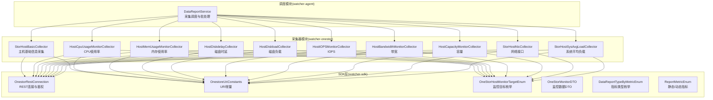
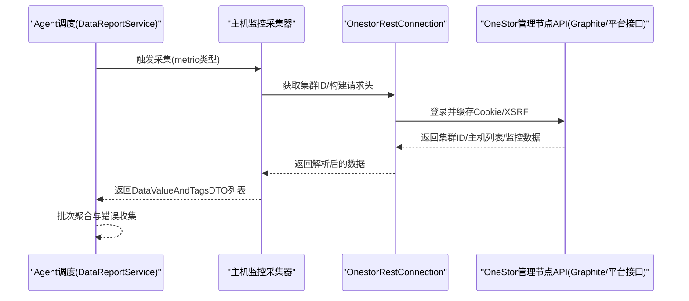
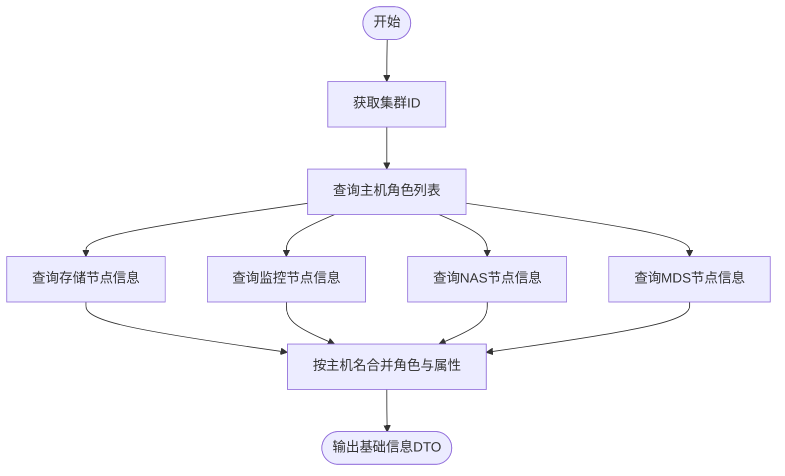
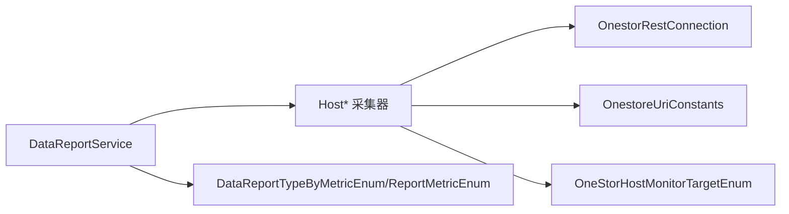

# 主机监控

<cite>
**本文引用的文件**
- [StorHostBasicCollector.java](file://watcher-onestor/src/main/java/com/virtual/cloud/om/onestor/service/report/basic/StorHostBasicCollector.java)
- [HostCpuUsageMonitorCollector.java](file://watcher-onestor/src/main/java/com/virtual/cloud/om/onestor/service/report/monitor/host/HostCpuUsageMonitorCollector.java)
- [HostMemUsageMonitorCollector.java](file://watcher-onestor/src/main/java/com/virtual/cloud/om/onestor/service/report/monitor/host/HostMemUsageMonitorCollector.java)
- [HostDiskdelayCollector.java](file://watcher-onestor/src/main/java/com/virtual/cloud/om/onestor/service/report/monitor/host/HostDiskdelayCollector.java)
- [HostDiskloadCollector.java](file://watcher-onestor/src/main/java/com/virtual/cloud/om/onestor/service/report/monitor/host/HostDiskloadCollector.java)
- [HostIOPSMonitorCollector.java](file://watcher-onestor/src/main/java/com/virtual/cloud/om/onestor/service/report/monitor/host/HostIOPSMonitorCollector.java)
- [HostBandwidthMonitorCollector.java](file://watcher-onestor/src/main/java/com/virtual/cloud/om/onestor/service/report/monitor/host/HostBandwidthMonitorCollector.java)
- [HostCapacityMonitorCollector.java](file://watcher-onestor/src/main/java/com/virtual/cloud/om/onestor/service/report/monitor/host/HostCapacityMonitorCollector.java)
- [StorHostNicCollector.java](file://watcher-onestor/src/main/java/com/virtual/cloud/om/onestor/service/report/monitor/host/StorHostNicCollector.java)
- [StorHostSysAvgLoadCollector.java](file://watcher-onestor/src/main/java/com/virtual/cloud/om/onestor/service/report/monitor/host/StorHostSysAvgLoadCollector.java)
- [IOnestorMonitorCollector.java](file://watcher-onestor/src/main/java/com/virtual/cloud/om/onestor/service/report/monitor/IOnestorMonitorCollector.java)
- [OnestorRestConnection.java](file://watcher-sdk/src/main/java/com/virtual/cloud/om/sdk/config/token/onestor/OnestorRestConnection.java)
- [OnestoreUriConstants.java](file://watcher-sdk/src/main/java/com/virtual/cloud/om/sdk/constant/uri/OnestoreUriConstants.java)
- [OneStorHostMonitorTargetEnum.java](file://watcher-sdk/src/main/java/com/virtual/cloud/om/sdk/constant/onestor/report/OneStorHostMonitorTargetEnum.java)
- [DataReportTypeByMetricEnum.java](file://watcher-sdk/src/main/java/com/virtual/cloud/om/sdk/constant/DataReportTypeByMetricEnum.java)
- [ReportMetricEnum.java](file://watcher-sdk/src/main/java/com/virtual/cloud/om/sdk/constant/report/ReportMetricEnum.java)
- [OneStorMonitorDTO.java](file://watcher-sdk/src/main/java/com/virtual/cloud/om/sdk/dto/dataReport/onestor/monitor/OneStorMonitorDTO.java)
- [DataReportService.java](file://watcher-agent/src/main/java/com/virtual/cloud/om/agent/service/report/DataReportService.java)
</cite>

## 目录
1. [简介](#简介)
2. [项目结构](#项目结构)
3. [核心组件](#核心组件)
4. [架构总览](#架构总览)
5. [详细组件分析](#详细组件分析)
6. [依赖分析](#依赖分析)
7. [性能考虑](#性能考虑)
8. [故障排查指南](#故障排查指南)
9. [结论](#结论)
10. [附录](#附录)

## 简介
本技术文档围绕 OneStor 存储系统中的主机监控能力，系统性梳理了主机基本信息采集与九项关键性能指标监控的实现：CPU 使用率、内存使用率、磁盘时延、磁盘负载、IOPS、带宽、容量、网络接口统计以及系统平均负载。文档覆盖工作原理、数据采集策略、指标计算方法、监控频率设置、REST API 使用方式、多维指标处理与聚合、时间序列处理、异常检测与最佳实践等内容，帮助读者快速理解并高效运维 OneStor 主机监控体系。

## 项目结构
主机监控相关代码主要分布在以下模块：
- watcher-onestor：OneStor 专属采集器与监控逻辑
- watcher-sdk：统一的 REST 连接、URI 常量、监控目标枚举与 DTO 定义
- watcher-agent：采集调度与批处理服务

图表来源
- [StorHostBasicCollector.java:30-174](file://watcher-onestor/src/main/java/com/virtual/cloud/om/onestor/service/report/basic/StorHostBasicCollector.java#L30-L174)
- [HostCpuUsageMonitorCollector.java:35-80](file://watcher-onestor/src/main/java/com/virtual/cloud/om/onestor/service/report/monitor/host/HostCpuUsageMonitorCollector.java#L35-L80)
- [HostMemUsageMonitorCollector.java:36-81](file://watcher-onestor/src/main/java/com/virtual/cloud/om/onestor/service/report/monitor/host/HostMemUsageMonitorCollector.java#L36-L81)
- [HostDiskdelayCollector.java:36-83](file://watcher-onestor/src/main/java/com/virtual/cloud/om/onestor/service/report/monitor/host/HostDiskdelayCollector.java#L36-L83)
- [HostDiskloadCollector.java:37-89](file://watcher-onestor/src/main/java/com/virtual/cloud/om/onestor/service/report/monitor/host/HostDiskloadCollector.java#L37-L89)
- [HostIOPSMonitorCollector.java:36-87](file://watcher-onestor/src/main/java/com/virtual/cloud/om/onestor/service/report/monitor/host/HostIOPSMonitorCollector.java#L36-L87)
- [HostBandwidthMonitorCollector.java:36-87](file://watcher-onestor/src/main/java/com/virtual/cloud/om/onestor/service/report/monitor/host/HostBandwidthMonitorCollector.java#L36-L87)
- [HostCapacityMonitorCollector.java:36-83](file://watcher-onestor/src/main/java/com/virtual/cloud/om/onestor/service/report/monitor/host/HostCapacityMonitorCollector.java#L36-L83)
- [StorHostNicCollector.java:40-145](file://watcher-onestor/src/main/java/com/virtual/cloud/om/onestor/service/report/monitor/host/StorHostNicCollector.java#L40-L145)
- [StorHostSysAvgLoadCollector.java:42-114](file://watcher-onestor/src/main/java/com/virtual/cloud/om/onestor/service/report/monitor/host/StorHostSysAvgLoadCollector.java#L42-L114)
- [OnestorRestConnection.java:50-413](file://watcher-sdk/src/main/java/com/virtual/cloud/om/sdk/config/token/onestor/OnestorRestConnection.java#L50-L413)
- [OnestoreUriConstants.java:57-130](file://watcher-sdk/src/main/java/com/virtual/cloud/om/sdk/constant/uri/OnestoreUriConstants.java#L57-L130)
- [OneStorHostMonitorTargetEnum.java:7-42](file://watcher-sdk/src/main/java/com/virtual/cloud/om/sdk/constant/onestor/report/OneStorHostMonitorTargetEnum.java#L7-L42)
- [DataReportService.java:186-304](file://watcher-agent/src/main/java/com/virtual/cloud/om/agent/service/report/DataReportService.java#L186-L304)

章节来源
- [OnestorRestConnection.java:50-413](file://watcher-sdk/src/main/java/com/virtual/cloud/om/sdk/config/token/onestor/OnestorRestConnection.java#L50-L413)
- [OnestoreUriConstants.java:57-130](file://watcher-sdk/src/main/java/com/virtual/cloud/om/sdk/constant/uri/OnestoreUriConstants.java#L57-L130)
- [DataReportService.java:186-304](file://watcher-agent/src/main/java/com/virtual/cloud/om/agent/service/report/DataReportService.java#L186-L304)

## 核心组件
- 主机基础信息采集器：聚合集群内各节点的角色、存储、监控、NAS、MDS 等信息，形成统一的主机基础视图。
- 主机性能监控采集器：按主机维度拉取 CPU 使用率、内存使用率、磁盘时延、磁盘负载、IOPS、带宽、容量、网络接口统计、系统平均负载等指标。
- SDK 层：封装 REST 访问、鉴权缓存、URI 常量、监控目标枚举与数据模型。
- 调度层：异步并发触发各类采集器，统一批次编号与错误上报。

章节来源
- [StorHostBasicCollector.java:30-174](file://watcher-onestor/src/main/java/com/virtual/cloud/om/onestor/service/report/basic/StorHostBasicCollector.java#L30-L174)
- [HostCpuUsageMonitorCollector.java:35-80](file://watcher-onestor/src/main/java/com/virtual/cloud/om/onestor/service/report/monitor/host/HostCpuUsageMonitorCollector.java#L35-L80)
- [HostMemUsageMonitorCollector.java:36-81](file://watcher-onestor/src/main/java/com/virtual/cloud/om/onestor/service/report/monitor/host/HostMemUsageMonitorCollector.java#L36-L81)
- [HostDiskdelayCollector.java:36-83](file://watcher-onestor/src/main/java/com/virtual/cloud/om/onestor/service/report/monitor/host/HostDiskdelayCollector.java#L36-L83)
- [HostDiskloadCollector.java:37-89](file://watcher-onestor/src/main/java/com/virtual/cloud/om/onestor/service/report/monitor/host/HostDiskloadCollector.java#L37-L89)
- [HostIOPSMonitorCollector.java:36-87](file://watcher-onestor/src/main/java/com/virtual/cloud/om/onestor/service/report/monitor/host/HostIOPSMonitorCollector.java#L36-L87)
- [HostBandwidthMonitorCollector.java:36-87](file://watcher-onestor/src/main/java/com/virtual/cloud/om/onestor/service/report/monitor/host/HostBandwidthMonitorCollector.java#L36-L87)
- [HostCapacityMonitorCollector.java:36-83](file://watcher-onestor/src/main/java/com/virtual/cloud/om/onestor/service/report/monitor/host/HostCapacityMonitorCollector.java#L36-L83)
- [StorHostNicCollector.java:40-145](file://watcher-onestor/src/main/java/com/virtual/cloud/om/onestor/service/report/monitor/host/StorHostNicCollector.java#L40-L145)
- [StorHostSysAvgLoadCollector.java:42-114](file://watcher-onestor/src/main/java/com/virtual/cloud/om/onestor/service/report/monitor/host/StorHostSysAvgLoadCollector.java#L42-L114)

## 架构总览
下图展示了从调度到采集再到数据上报的整体流程，以及各组件之间的依赖关系。

图表来源
- [DataReportService.java:186-304](file://watcher-agent/src/main/java/com/virtual/cloud/om/agent/service/report/DataReportService.java#L186-L304)
- [OnestorRestConnection.java:143-229](file://watcher-sdk/src/main/java/com/virtual/cloud/om/sdk/config/token/onestor/OnestorRestConnection.java#L143-L229)
- [OnestoreUriConstants.java:57-130](file://watcher-sdk/src/main/java/com/virtual/cloud/om/sdk/constant/uri/OnestoreUriConstants.java#L57-L130)

## 详细组件分析

### 主机基础信息采集（StorHostBasicCollector）
- 工作原理：先获取集群 ID，再分别调用角色、存储、监控、NAS、MDS 等接口，合并各角色信息，生成统一的主机基础报告。
- 数据采集策略：按主机名映射不同角色信息，填充 CPU/内存/容量/磁盘状态/节点池/管理 IP 等字段。
- 性能指标：不直接产出时序指标，而是提供静态标签化基础信息，供上层按需关联。
- 监控频率：通常按分钟级周期运行，作为其他时序指标的“元数据”支撑。

图表来源
- [StorHostBasicCollector.java:36-82](file://watcher-onestor/src/main/java/com/virtual/cloud/om/onestor/service/report/basic/StorHostBasicCollector.java#L36-L82)

章节来源
- [StorHostBasicCollector.java:30-174](file://watcher-onestor/src/main/java/com/virtual/cloud/om/onestor/service/report/basic/StorHostBasicCollector.java#L30-L174)

### CPU 使用率监控（HostCpuUsageMonitorCollector）
- 数据源：Graphite 接口，目标为 CPU 占用率。
- 处理逻辑：遍历主机列表，按主机名拼装监控目标，取最新时间戳与数值，封装为报告 DTO。
- 指标含义：CPU 使用率百分比，用于评估主机计算压力。

章节来源
- [HostCpuUsageMonitorCollector.java:35-80](file://watcher-onestor/src/main/java/com/virtual/cloud/om/onestor/service/report/monitor/host/HostCpuUsageMonitorCollector.java#L35-L80)
- [IOnestorMonitorCollector.java:19-53](file://watcher-onestor/src/main/java/com/virtual/cloud/om/onestor/service/report/monitor/IOnestorMonitorCollector.java#L19-L53)
- [OneStorHostMonitorTargetEnum.java:21-22](file://watcher-sdk/src/main/java/com/virtual/cloud/om/sdk/constant/onestor/report/OneStorHostMonitorTargetEnum.java#L21-L22)

### 内存使用率监控（HostMemUsageMonitorCollector）
- 数据源：Graphite 接口，目标为内存占用率。
- 处理逻辑：与 CPU 使用率一致，按主机维度取最新值并封装报告 DTO。
- 指标含义：内存使用率百分比，辅助判断内存压力与碎片化风险。

章节来源
- [HostMemUsageMonitorCollector.java:36-81](file://watcher-onestor/src/main/java/com/virtual/cloud/om/onestor/service/report/monitor/host/HostMemUsageMonitorCollector.java#L36-L81)
- [IOnestorMonitorCollector.java:19-53](file://watcher-onestor/src/main/java/com/virtual/cloud/om/onestor/service/report/monitor/IOnestorMonitorCollector.java#L19-L53)
- [OneStorHostMonitorTargetEnum.java:22-22](file://watcher-sdk/src/main/java/com/virtual/cloud/om/sdk/constant/onestor/report/OneStorHostMonitorTargetEnum.java#L22-L22)

### 磁盘时延监控（HostDiskdelayCollector）
- 数据源：Graphite 接口，目标为读/写时延。
- 处理逻辑：同时拉取读/写两类时延，取最新时间戳与数值，封装报告 DTO。
- 指标含义：磁盘读/写延迟毫秒数，用于定位 IO 性能瓶颈。

章节来源
- [HostDiskdelayCollector.java:36-83](file://watcher-onestor/src/main/java/com/virtual/cloud/om/onestor/service/report/monitor/host/HostDiskdelayCollector.java#L36-L83)
- [IOnestorMonitorCollector.java:19-53](file://watcher-onestor/src/main/java/com/virtual/cloud/om/onestor/service/report/monitor/IOnestorMonitorCollector.java#L19-L53)
- [OneStorHostMonitorTargetEnum.java:24-25](file://watcher-sdk/src/main/java/com/virtual/cloud/om/sdk/constant/onestor/report/OneStorHostMonitorTargetEnum.java#L24-L25)

### 磁盘负载监控（HostDiskloadCollector）
- 数据源：Graphite 接口，目标为平均/最大 util。
- 处理逻辑：仅对存储节点（stor）生效，取最新值封装报告 DTO。
- 指标含义：磁盘利用率百分比，反映设备繁忙程度。

章节来源
- [HostDiskloadCollector.java:37-89](file://watcher-onestor/src/main/java/com/virtual/cloud/om/onestor/service/report/monitor/host/HostDiskloadCollector.java#L37-L89)
- [IOnestorMonitorCollector.java:19-53](file://watcher-onestor/src/main/java/com/virtual/cloud/om/onestor/service/report/monitor/IOnestorMonitorCollector.java#L19-L53)
- [OneStorHostMonitorTargetEnum.java:28-29](file://watcher-sdk/src/main/java/com/virtual/cloud/om/sdk/constant/onestor/report/OneStorHostMonitorTargetEnum.java#L28-L29)

### IOPS 监控（HostIOPSMonitorCollector）
- 数据源：Graphite 接口，目标为读/写 IOPS 与读/写 OPS。
- 处理逻辑：组合四个目标，取最新值封装报告 DTO。
- 指标含义：每秒 I/O 操作次数与文件系统操作次数，衡量吞吐与并发。

章节来源
- [HostIOPSMonitorCollector.java:36-87](file://watcher-onestor/src/main/java/com/virtual/cloud/om/onestor/service/report/monitor/host/HostIOPSMonitorCollector.java#L36-L87)
- [IOnestorMonitorCollector.java:19-53](file://watcher-onestor/src/main/java/com/virtual/cloud/om/onestor/service/report/monitor/IOnestorMonitorCollector.java#L19-L53)
- [OneStorHostMonitorTargetEnum.java:8-11](file://watcher-sdk/src/main/java/com/virtual/cloud/om/sdk/constant/onestor/report/OneStorHostMonitorTargetEnum.java#L8-L11)

### 带宽监控（HostBandwidthMonitorCollector）
- 数据源：Graphite 接口，目标为存储读/写带宽与文件系统读/写带宽。
- 处理逻辑：组合四个目标，取最新值封装报告 DTO。
- 指标含义：单位时间内传输的数据量，用于评估网络与存储链路负载。

章节来源
- [HostBandwidthMonitorCollector.java:36-87](file://watcher-onestor/src/main/java/com/virtual/cloud/om/onestor/service/report/monitor/host/HostBandwidthMonitorCollector.java#L36-L87)
- [IOnestorMonitorCollector.java:19-53](file://watcher-onestor/src/main/java/com/virtual/cloud/om/onestor/service/report/monitor/IOnestorMonitorCollector.java#L19-L53)
- [OneStorHostMonitorTargetEnum.java:13-16](file://watcher-sdk/src/main/java/com/virtual/cloud/om/sdk/constant/onestor/report/OneStorHostMonitorTargetEnum.java#L13-L16)

### 容量监控（HostCapacityMonitorCollector）
- 数据源：Graphite 接口，目标为总容量与已用容量。
- 处理逻辑：组合两个目标，取最新值封装报告 DTO。
- 指标含义：主机层面的容量使用情况，用于容量预警与扩容规划。

章节来源
- [HostCapacityMonitorCollector.java:36-83](file://watcher-onestor/src/main/java/com/virtual/cloud/om/onestor/service/report/monitor/host/HostCapacityMonitorCollector.java#L36-L83)
- [IOnestorMonitorCollector.java:19-53](file://watcher-onestor/src/main/java/com/virtual/cloud/om/onestor/service/report/monitor/IOnestorMonitorCollector.java#L19-L53)
- [OneStorHostMonitorTargetEnum.java:18-19](file://watcher-sdk/src/main/java/com/virtual/cloud/om/sdk/constant/onestor/report/OneStorHostMonitorTargetEnum.java#L18-L19)

### 网络接口监控（StorHostNicCollector）
- 数据源：Graphite 接口，目标为入/出字节、包数、丢包、错误等。
- 处理逻辑：按主机名拼装多个目标，取最新值封装 NIC 统计 DTO。
- 指标含义：网络接口的收发字节、包数、丢包与错误，用于网络链路健康度评估。

章节来源
- [StorHostNicCollector.java:40-145](file://watcher-onestor/src/main/java/com/virtual/cloud/om/onestor/service/report/monitor/host/StorHostNicCollector.java#L40-L145)

### 系统平均负载监控（StorHostSysAvgLoadCollector）
- 数据源：Graphite 接口，目标为 1/5/15 分钟 loadavg。
- 处理逻辑：按主机名拼装三个目标，取最新值封装平均负载 DTO。
- 指标含义：系统平均负载，反映 CPU 与 IO 的综合压力。

章节来源
- [StorHostSysAvgLoadCollector.java:42-114](file://watcher-onestor/src/main/java/com/virtual/cloud/om/onestor/service/report/monitor/host/StorHostSysAvgLoadCollector.java#L42-L114)

## 依赖分析
- 采集器依赖 SDK 的 REST 连接与 URI 常量，确保统一鉴权与请求构造。
- 采集器依赖监控目标枚举，保证 Graphite 目标的正确拼装。
- 调度层通过异步并发执行多个采集器，提升整体吞吐。
- 指标类型枚举与静态/动态指标定义，指导采集器的输出格式与上报策略。

图表来源
- [OnestorRestConnection.java:50-413](file://watcher-sdk/src/main/java/com/virtual/cloud/om/sdk/config/token/onestor/OnestorRestConnection.java#L50-L413)
- [OnestoreUriConstants.java:57-130](file://watcher-sdk/src/main/java/com/virtual/cloud/om/sdk/constant/uri/OnestoreUriConstants.java#L57-L130)
- [OneStorHostMonitorTargetEnum.java:7-42](file://watcher-sdk/src/main/java/com/virtual/cloud/om/sdk/constant/onestor/report/OneStorHostMonitorTargetEnum.java#L7-L42)
- [DataReportService.java:186-304](file://watcher-agent/src/main/java/com/virtual/cloud/om/agent/service/report/DataReportService.java#L186-L304)
- [DataReportTypeByMetricEnum.java:137-149](file://watcher-sdk/src/main/java/com/virtual/cloud/om/sdk/constant/DataReportTypeByMetricEnum.java#L137-L149)
- [ReportMetricEnum.java:89-117](file://watcher-sdk/src/main/java/com/virtual/cloud/om/sdk/constant/report/ReportMetricEnum.java#L89-L117)

章节来源
- [DataReportTypeByMetricEnum.java:137-149](file://watcher-sdk/src/main/java/com/virtual/cloud/om/sdk/constant/DataReportTypeByMetricEnum.java#L137-L149)
- [ReportMetricEnum.java:89-117](file://watcher-sdk/src/main/java/com/virtual/cloud/om/sdk/constant/report/ReportMetricEnum.java#L89-L117)

## 性能考虑
- 并发采集：调度层采用异步并发执行，显著降低整体采集耗时。
- 鉴权缓存：SDK 层基于内存缓存 XSRF 与 session，避免频繁登录开销。
- 时间窗口：Graphite 查询默认使用近一分钟窗口，兼顾实时性与稳定性。
- 数据聚合：采集器返回的 DTO 包含时间戳与标签，便于上层按主机/时间聚合。

章节来源
- [DataReportService.java:186-304](file://watcher-agent/src/main/java/com/virtual/cloud/om/agent/service/report/DataReportService.java#L186-L304)
- [OnestorRestConnection.java:65-136](file://watcher-sdk/src/main/java/com/virtual/cloud/om/sdk/config/token/onestor/OnestorRestConnection.java#L65-L136)
- [OnestoreUriConstants.java:125-128](file://watcher-sdk/src/main/java/com/virtual/cloud/om/sdk/constant/uri/OnestoreUriConstants.java#L125-L128)

## 故障排查指南
- 鉴权失败（401/403）：SDK 自动刷新令牌并重试；若持续失败，检查用户名密码与网络连通性。
- 目标缺失或无数据：采集器在目标为空或数据点不足时返回 0 或空值，需确认 Graphite 目标是否正确、监控是否启用。
- 时间戳异常：采集器按最新数据点时间回填时间戳，若出现异常可检查 Graphite 数据完整性。
- 并发冲突：调度层使用锁避免重复登录，如遇阻塞，检查锁释放与超时配置。

章节来源
- [OnestorRestConnection.java:143-189](file://watcher-sdk/src/main/java/com/virtual/cloud/om/sdk/config/token/onestor/OnestorRestConnection.java#L143-L189)
- [IOnestorMonitorCollector.java:19-53](file://watcher-onestor/src/main/java/com/virtual/cloud/om/onestor/service/report/monitor/IOnestorMonitorCollector.java#L19-L53)

## 结论
OneStor 主机监控体系通过统一的 SDK 与采集器，实现了从基础信息到多维性能指标的全链路采集。依托 Graphite 的高时效性与 SDK 的鉴权缓存机制，系统在保证实时性的前提下具备良好的扩展性与稳定性。建议结合业务峰值与容量规划，合理设置监控频率与阈值，配合异常检测与告警策略，持续优化监控效果。

## 附录

### REST API 使用示例（路径参考）
- 获取集群 ID
  - 方法：GET
  - 路径：/api/v3/plat/cluster
  - 参考：[OnestoreUriConstants.java:59-61](file://watcher-sdk/src/main/java/com/virtual/cloud/om/sdk/constant/uri/OnestoreUriConstants.java#L59-L61)
- 获取主机角色列表
  - 方法：GET
  - 路径：/api/v3/onestor/{clusterId}/plat/servers/ip?roles={roles}
  - 参考：[OnestoreUriConstants.java:77-81](file://watcher-sdk/src/main/java/com/virtual/cloud/om/sdk/constant/uri/OnestoreUriConstants.java#L77-L81)
- 拉取监控数据（Graphite）
  - 方法：GET
  - 路径：/graphite/render?format=json&from=-1minute&target=...
  - 参考：[OnestoreUriConstants.java:125-128](file://watcher-sdk/src/main/java/com/virtual/cloud/om/sdk/constant/uri/OnestoreUriConstants.java#L125-L128)

章节来源
- [OnestoreUriConstants.java:57-130](file://watcher-sdk/src/main/java/com/virtual/cloud/om/sdk/constant/uri/OnestoreUriConstants.java#L57-L130)

### 监控目标枚举（部分）
- CPU 使用率：servers.{host}.cpu.usage.ratio
- 内存使用率：servers.{host}.mem.ratio
- 读/写时延：servers.{host}.diskstat.root.lat.rd/wr
- 磁盘 util：servers.{host}.diskstat.util.avg/max
- IOPS/OPS：servers.{host}.diskstat.root.iops.rd/wr、servers.{host}.fs.ops.rd/wr
- 带宽：servers.{host}.diskstat.root.bw.rd/wr、sub_cluster.{host}.fs.bw.rd/wr
- 容量：servers.{host}.diskspace.root.total/used
- 系统负载：servers.{host}.loadavg_1/5/15

章节来源
- [OneStorHostMonitorTargetEnum.java:7-42](file://watcher-sdk/src/main/java/com/virtual/cloud/om/sdk/constant/onestor/report/OneStorHostMonitorTargetEnum.java#L7-L42)

### 指标类型与分离策略
- 指标类型枚举：定义了主机 IOPS、带宽、容量、磁盘时延、磁盘负载、CPU/内存使用率等指标的分类与上报策略。
- 分离策略：部分指标按主机维度分离，便于按主机粒度展示与告警。

章节来源
- [DataReportTypeByMetricEnum.java:137-149](file://watcher-sdk/src/main/java/com/virtual/cloud/om/sdk/constant/DataReportTypeByMetricEnum.java#L137-L149)
- [ReportMetricEnum.java:89-117](file://watcher-sdk/src/main/java/com/virtual/cloud/om/sdk/constant/report/ReportMetricEnum.java#L89-L117)

### 数据模型（简要）
- OneStorMonitorDTO：包含 target 与 datapoints，用于承载 Graphite 返回的时序数据。
- 各监控采集器返回的 DTO：封装具体指标值与主机名、时间戳、标签等。

章节来源
- [OneStorMonitorDTO.java:10-20](file://watcher-sdk/src/main/java/com/virtual/cloud/om/sdk/dto/dataReport/onestor/monitor/OneStorMonitorDTO.java#L10-L20)