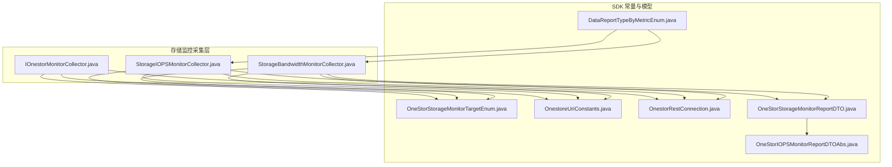
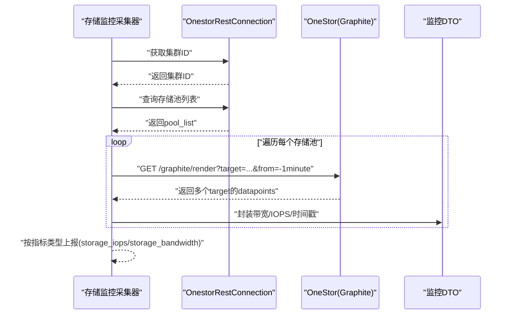
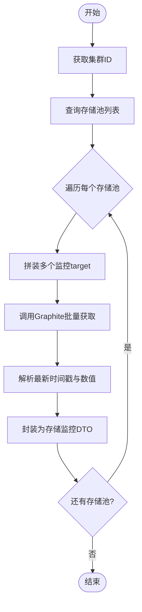
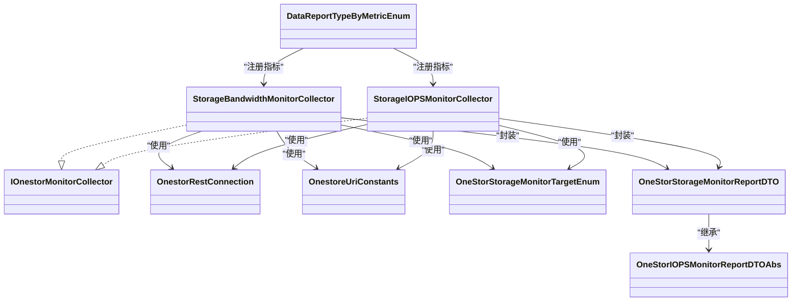

# 存储监控

<cite>
**本文引用的文件**
- [StorageBandwidthMonitorCollector.java](file://watcher-onestor/src/main/java/com/virtual/cloud/om/onestor/service/report/monitor/storage/StorageBandwidthMonitorCollector.java)
- [StorageIOPSMonitorCollector.java](file://watcher-onestor/src/main/java/com/virtual/cloud/om/onestor/service/report/monitor/storage/StorageIOPSMonitorCollector.java)
- [IOnestorMonitorCollector.java](file://watcher-onestor/src/main/java/com/virtual/cloud/om/onestor/service/report/monitor/IOnestorMonitorCollector.java)
- [OneStorStorageMonitorTargetEnum.java](file://watcher-sdk/src/main/java/com/virtual/cloud/om/sdk/constant/onestor/report/OneStorStorageMonitorTargetEnum.java)
- [OneStorStorageMonitorReportDTO.java](file://watcher-sdk/src/main/java/com/virtual/cloud/om/sdk/dto/dataReport/onestor/monitor/storage/OneStorStorageMonitorReportDTO.java)
- [OneStorIOPSMonitorReportDTOAbs.java](file://watcher-sdk/src/main/java/com/virtual/cloud/om/sdk/dto/dataReport/onestor/monitor/abs/OneStorIOPSMonitorReportDTOAbs.java)
- [OnestoreUriConstants.java](file://watcher-sdk/src/main/java/com/virtual/cloud/om/sdk/constant/uri/OnestoreUriConstants.java)
- [OnestorRestConnection.java](file://watcher-sdk/src/main/java/com/virtual/cloud/om/sdk/config/token/onestor/OnestorRestConnection.java)
- [DataReportTypeByMetricEnum.java](file://watcher-sdk/src/main/java/com/virtual/cloud/om/sdk/constant/DataReportTypeByMetricEnum.java)
</cite>

## 目录
1. [简介](#简介)
2. [项目结构](#项目结构)
3. [核心组件](#核心组件)
4. [架构总览](#架构总览)
5. [组件详解](#组件详解)
6. [依赖关系分析](#依赖关系分析)
7. [性能与指标](#性能与指标)
8. [配置与集成](#配置与集成)
9. [最佳实践与排障](#最佳实践与排障)
10. [结论](#结论)

## 简介
本技术文档聚焦 OneStor 存储系统的“存储监控”能力，系统性阐述存储带宽监控（StorageBandwidthMonitorCollector）与存储 IOPS 监控（StorageIOPSMonitorCollector）的实现机制、数据采集策略、性能指标计算方法与上报流程。文档还解释了存储监控器接口（IOnestorMonitorCollector）的通用能力、与主机监控的区别、存储资源的虚拟化管理视角以及多维度分析思路，并给出配置要点、数据聚合策略、性能基准与优化建议。

## 项目结构
围绕存储监控的关键模块分布如下：
- onestor 存储侧监控采集器：负责按存储池维度拉取带宽与 IOPS 指标，并封装为统一 DTO 上报
- SDK 常量与模型：定义监控目标模板、URI 常量、REST 客户端与指标枚举
- 平台层指标枚举：定义 storage_iops 与 storage_bandwidth 等指标类型，用于策略匹配与调度

图表来源
- [StorageBandwidthMonitorCollector.java:1-83](file://watcher-onestor/src/main/java/com/virtual/cloud/om/onestor/service/report/monitor/storage/StorageBandwidthMonitorCollector.java#L1-L83)
- [StorageIOPSMonitorCollector.java:1-83](file://watcher-onestor/src/main/java/com/virtual/cloud/om/onestor/service/report/monitor/storage/StorageIOPSMonitorCollector.java#L1-L83)
- [IOnestorMonitorCollector.java:1-54](file://watcher-onestor/src/main/java/com/virtual/cloud/om/onestor/service/report/monitor/IOnestorMonitorCollector.java#L1-L54)
- [OneStorStorageMonitorTargetEnum.java:1-29](file://watcher-sdk/src/main/java/com/virtual/cloud/om/sdk/constant/onestor/report/OneStorStorageMonitorTargetEnum.java#L1-L29)
- [OnestoreUriConstants.java:1-130](file://watcher-sdk/src/main/java/com/virtual/cloud/om/sdk/constant/uri/OnestoreUriConstants.java#L1-L130)
- [OnestorRestConnection.java:1-413](file://watcher-sdk/src/main/java/com/virtual/cloud/om/sdk/config/token/onestor/OnestorRestConnection.java#L1-L413)
- [OneStorStorageMonitorReportDTO.java:1-21](file://watcher-sdk/src/main/java/com/virtual/cloud/om/sdk/dto/dataReport/onestor/monitor/storage/OneStorStorageMonitorReportDTO.java#L1-L21)
- [OneStorIOPSMonitorReportDTOAbs.java:1-31](file://watcher-sdk/src/main/java/com/virtual/cloud/om/sdk/dto/dataReport/onestor/monitor/abs/OneStorIOPSMonitorReportDTOAbs.java#L1-L31)
- [DataReportTypeByMetricEnum.java:1-190](file://watcher-sdk/src/main/java/com/virtual/cloud/om/sdk/constant/DataReportTypeByMetricEnum.java#L1-L190)

章节来源
- [StorageBandwidthMonitorCollector.java:1-83](file://watcher-onestor/src/main/java/com/virtual/cloud/om/onestor/service/report/monitor/storage/StorageBandwidthMonitorCollector.java#L1-L83)
- [StorageIOPSMonitorCollector.java:1-83](file://watcher-onestor/src/main/java/com/virtual/cloud/om/onestor/service/report/monitor/storage/StorageIOPSMonitorCollector.java#L1-L83)
- [IOnestorMonitorCollector.java:1-54](file://watcher-onestor/src/main/java/com/virtual/cloud/om/onestor/service/report/monitor/IOnestorMonitorCollector.java#L1-L54)
- [OnestoreUriConstants.java:1-130](file://watcher-sdk/src/main/java/com/virtual/cloud/om/sdk/constant/uri/OnestoreUriConstants.java#L1-L130)
- [OnestorRestConnection.java:1-413](file://watcher-sdk/src/main/java/com/virtual/cloud/om/sdk/config/token/onestor/OnestorRestConnection.java#L1-L413)
- [DataReportTypeByMetricEnum.java:1-190](file://watcher-sdk/src/main/java/com/virtual/cloud/om/sdk/constant/DataReportTypeByMetricEnum.java#L1-L190)

## 核心组件
- 存储带宽监控采集器（StorageBandwidthMonitorCollector）
  - 功能：按存储池维度采集读/写带宽、总带宽与总 IOPS，封装为存储监控上报 DTO
  - 关键点：并行遍历存储池，构造多 target 查询，解析最新时间戳与数值
- 存储 IOPS 监控采集器（StorageIOPSMonitorCollector）
  - 功能：按存储池维度采集读/写 IOPS、总带宽与总 IOPS
  - 关键点：与带宽采集器共享通用工具方法，统一时间戳与数值提取
- 存储监控器接口（IOnestorMonitorCollector）
  - 功能：提供统一的数据提取、时间戳解析与 target 拼接工具
  - 关键点：默认方法抽取最新点位，确保异常场景返回安全值

章节来源
- [StorageBandwidthMonitorCollector.java:32-82](file://watcher-onestor/src/main/java/com/virtual/cloud/om/onestor/service/report/monitor/storage/StorageBandwidthMonitorCollector.java#L32-L82)
- [StorageIOPSMonitorCollector.java:32-82](file://watcher-onestor/src/main/java/com/virtual/cloud/om/onestor/service/report/monitor/storage/StorageIOPSMonitorCollector.java#L32-L82)
- [IOnestorMonitorCollector.java:16-54](file://watcher-onestor/src/main/java/com/virtual/cloud/om/onestor/service/report/monitor/IOnestorMonitorCollector.java#L16-L54)

## 架构总览
存储监控在 OneStor 平台上的工作流如下：
- 采集器通过 OnestorRestConnection 获取集群 ID 与存储池列表
- 以“存储池”为单位，拼装多个监控 target，调用 Graphite 接口批量拉取指标
- 解析最新时间戳与数值，封装为 OneStorStorageMonitorReportDTO
- 通过 DataReportTypeByMetricEnum 将指标注册为 storage_iops 与 storage_bandwidth

图表来源
- [StorageBandwidthMonitorCollector.java:35-70](file://watcher-onestor/src/main/java/com/virtual/cloud/om/onestor/service/report/monitor/storage/StorageBandwidthMonitorCollector.java#L35-L70)
- [StorageIOPSMonitorCollector.java:35-70](file://watcher-onestor/src/main/java/com/virtual/cloud/om/onestor/service/report/monitor/storage/StorageIOPSMonitorCollector.java#L35-L70)
- [OnestorRestConnection.java:402-411](file://watcher-sdk/src/main/java/com/virtual/cloud/om/sdk/config/token/onestor/OnestorRestConnection.java#L402-L411)
- [OnestoreUriConstants.java:125-128](file://watcher-sdk/src/main/java/com/virtual/cloud/om/sdk/constant/uri/OnestoreUriConstants.java#L125-L128)
- [OneStorStorageMonitorReportDTO.java:1-21](file://watcher-sdk/src/main/java/com/virtual/cloud/om/sdk/dto/dataReport/onestor/monitor/storage/OneStorStorageMonitorReportDTO.java#L1-L21)

## 组件详解

### 存储带宽监控采集器（StorageBandwidthMonitorCollector）
- 数据源
  - Graphite 接口：/graphite/render?format=json&from=-1minute
  - 监控目标模板来自 OneStorStorageMonitorTargetEnum
- 采集步骤
  - 获取集群 ID 与存储池列表
  - 对每个存储池，构造多个 target（读带宽、写带宽、总 IOPS、总带宽）
  - 批量拉取后，按 target 映射，提取最新点位与时间戳
  - 封装为 OneStorStorageMonitorReportDTO，设置 nodePoolName、allIops、allBw、iopsRead、iopsWrite
- 指标含义
  - allBw：存储池总带宽
  - allIops：存储池总 IOPS
  - iopsRead/iopsWrite：分别对应读/写 IOPS（注意命名与实际含义的对应关系）

图表来源
- [StorageBandwidthMonitorCollector.java:35-70](file://watcher-onestor/src/main/java/com/virtual/cloud/om/onestor/service/report/monitor/storage/StorageBandwidthMonitorCollector.java#L35-L70)
- [OneStorStorageMonitorTargetEnum.java:7-16](file://watcher-sdk/src/main/java/com/virtual/cloud/om/sdk/constant/onestor/report/OneStorStorageMonitorTargetEnum.java#L7-L16)

章节来源
- [StorageBandwidthMonitorCollector.java:32-82](file://watcher-onestor/src/main/java/com/virtual/cloud/om/onestor/service/report/monitor/storage/StorageBandwidthMonitorCollector.java#L32-L82)

### 存储 IOPS 监控采集器（StorageIOPSMonitorCollector）
- 数据源与流程与带宽采集器一致，差异在于监控目标集合
- 监控目标包括：读 IOPS、写 IOPS、总带宽、总 IOPS
- 输出同样封装为 OneStorStorageMonitorReportDTO，便于统一处理

章节来源
- [StorageIOPSMonitorCollector.java:32-82](file://watcher-onestor/src/main/java/com/virtual/cloud/om/onestor/service/report/monitor/storage/StorageIOPSMonitorCollector.java#L32-L82)

### 存储监控器接口（IOnestorMonitorCollector）
- 通用能力
  - getData：按 target 与命名参数格式化后，取最新点位数值；若无数据则返回 0
  - getTime：从多个 target 中选择数据点最长的作为参考，取其最新时间戳
  - appendTarget：将模板 target 与命名参数拼接为 Graphite 查询参数
- 设计意图
  - 降低重复代码，统一不同采集器的解析逻辑
  - 在异常或空数据时提供兜底，保证采集链路稳定

章节来源
- [IOnestorMonitorCollector.java:16-54](file://watcher-onestor/src/main/java/com/virtual/cloud/om/onestor/service/report/monitor/IOnestorMonitorCollector.java#L16-L54)

### 数据模型与指标枚举
- OneStorStorageMonitorReportDTO
  - 继承 OneStorIOPSMonitorReportDTOAbs，扩展 nodePoolName、allIops、allBw
  - 用于 storage_iops 与 storage_bandwidth 两类指标的统一承载
- OneStorStorageMonitorTargetEnum
  - 定义存储监控目标模板，如 iops_read、iops_write、storage_read_bw、storage_write_bw、onestor_pool_iops_all、onestor_pool_bw_all
- DataReportTypeByMetricEnum
  - 定义 storage_iops 与 storage_bandwidth 指标类型，供策略与调度使用

章节来源
- [OneStorStorageMonitorReportDTO.java:1-21](file://watcher-sdk/src/main/java/com/virtual/cloud/om/sdk/dto/dataReport/onestor/monitor/storage/OneStorStorageMonitorReportDTO.java#L1-L21)
- [OneStorIOPSMonitorReportDTOAbs.java:1-31](file://watcher-sdk/src/main/java/com/virtual/cloud/om/sdk/dto/dataReport/onestor/monitor/abs/OneStorIOPSMonitorReportDTOAbs.java#L1-L31)
- [OneStorStorageMonitorTargetEnum.java:1-29](file://watcher-sdk/src/main/java/com/virtual/cloud/om/sdk/constant/onestor/report/OneStorStorageMonitorTargetEnum.java#L1-L29)
- [DataReportTypeByMetricEnum.java:137-138](file://watcher-sdk/src/main/java/com/virtual/cloud/om/sdk/constant/DataReportTypeByMetricEnum.java#L137-L138)

## 依赖关系分析
- 采集器依赖
  - OnestorRestConnection：统一认证、Cookie/XSRF 注入、重试与异常处理
  - OnestoreUriConstants：提供 Graphite 与平台 API 的 URI 常量
  - OneStorStorageMonitorTargetEnum：监控目标模板
  - OneStorStorageMonitorReportDTO：指标上报载体
- 指标注册
  - DataReportTypeByMetricEnum 将 storage_iops 与 storage_bandwidth 与 OneStor 平台绑定，支持策略匹配与多实现兼容

图表来源
- [StorageBandwidthMonitorCollector.java:1-83](file://watcher-onestor/src/main/java/com/virtual/cloud/om/onestor/service/report/monitor/storage/StorageBandwidthMonitorCollector.java#L1-L83)
- [StorageIOPSMonitorCollector.java:1-83](file://watcher-onestor/src/main/java/com/virtual/cloud/om/onestor/service/report/monitor/storage/StorageIOPSMonitorCollector.java#L1-L83)
- [IOnestorMonitorCollector.java:1-54](file://watcher-onestor/src/main/java/com/virtual/cloud/om/onestor/service/report/monitor/IOnestorMonitorCollector.java#L1-L54)
- [OnestorRestConnection.java:1-413](file://watcher-sdk/src/main/java/com/virtual/cloud/om/sdk/config/token/onestor/OnestorRestConnection.java#L1-L413)
- [OnestoreUriConstants.java:1-130](file://watcher-sdk/src/main/java/com/virtual/cloud/om/sdk/constant/uri/OnestoreUriConstants.java#L1-L130)
- [OneStorStorageMonitorTargetEnum.java:1-29](file://watcher-sdk/src/main/java/com/virtual/cloud/om/sdk/constant/onestor/report/OneStorStorageMonitorTargetEnum.java#L1-L29)
- [OneStorStorageMonitorReportDTO.java:1-21](file://watcher-sdk/src/main/java/com/virtual/cloud/om/sdk/dto/dataReport/onestor/monitor/storage/OneStorStorageMonitorReportDTO.java#L1-L21)
- [OneStorIOPSMonitorReportDTOAbs.java:1-31](file://watcher-sdk/src/main/java/com/virtual/cloud/om/sdk/dto/dataReport/onestor/monitor/abs/OneStorIOPSMonitorReportDTOAbs.java#L1-L31)
- [DataReportTypeByMetricEnum.java:137-138](file://watcher-sdk/src/main/java/com/virtual/cloud/om/sdk/constant/DataReportTypeByMetricEnum.java#L137-L138)

## 性能与指标
- 时间窗口与频率
  - Graphite 查询采用 from=-1minute，适合近实时指标
  - 采集器对每个存储池并行处理，提升整体吞吐
- 指标计算
  - 读/写带宽：从对应 target 的 datapoints 取最新值
  - 总带宽/总 IOPS：从相应 target 的 datapoints 取最新值
  - 时间戳：取数据点最长 target 的最新时间戳，确保各指标时间一致性
- 数据类型
  - 指标值为数值型，时间戳为毫秒级时间戳
  - 上报数据类型为 json，便于后续解析与可视化

章节来源
- [StorageBandwidthMonitorCollector.java:35-70](file://watcher-onestor/src/main/java/com/virtual/cloud/om/onestor/service/report/monitor/storage/StorageBandwidthMonitorCollector.java#L35-L70)
- [StorageIOPSMonitorCollector.java:35-70](file://watcher-onestor/src/main/java/com/virtual/cloud/om/onestor/service/report/monitor/storage/StorageIOPSMonitorCollector.java#L35-L70)
- [IOnestorMonitorCollector.java:20-47](file://watcher-onestor/src/main/java/com/virtual/cloud/om/onestor/service/report/monitor/IOnestorMonitorCollector.java#L20-L47)

## 配置与集成
- 认证与连接
  - OnestorRestConnection 提供登录、Cookie/XSRF 注入与缓存，自动处理 401/403 场景的令牌刷新
  - 支持并发锁避免重复刷新，减少无效请求
- 指标类型注册
  - storage_iops 与 storage_bandwidth 已在 DataReportTypeByMetricEnum 中注册，可被策略系统识别
- 监控目标模板
  - OneStorStorageMonitorTargetEnum 定义了存储监控常用目标模板，采集器按存储池动态拼装
- URI 常量
  - OnestoreUriConstants 提供 Graphite 与平台 API 的基础路径，采集器按需组合

章节来源
- [OnestorRestConnection.java:65-136](file://watcher-sdk/src/main/java/com/virtual/cloud/om/sdk/config/token/onestor/OnestorRestConnection.java#L65-L136)
- [DataReportTypeByMetricEnum.java:137-138](file://watcher-sdk/src/main/java/com/virtual/cloud/om/sdk/constant/DataReportTypeByMetricEnum.java#L137-L138)
- [OneStorStorageMonitorTargetEnum.java:7-16](file://watcher-sdk/src/main/java/com/virtual/cloud/om/sdk/constant/onestor/report/OneStorStorageMonitorTargetEnum.java#L7-L16)
- [OnestoreUriConstants.java:125-128](file://watcher-sdk/src/main/java/com/virtual/cloud/om/sdk/constant/uri/OnestoreUriConstants.java#L125-L128)

## 最佳实践与排障

### 最佳实践
- 采集频率与时间窗口
  - 建议保持 Graphite 的 from=-1minute，兼顾实时性与稳定性
  - 对大规模存储池，优先使用并行处理，减少单次等待
- 指标命名与语义
  - 注意 iops_read/iops_write 与带宽指标的命名映射，避免混淆
  - 统一使用 nodePoolName 作为标识，便于上层聚合与告警
- 错误与降级
  - 当某 target 无数据时，getData 返回 0，避免中断整个采集流程
  - 若 Graphite 返回异常，OnestorRestConnection 自动刷新令牌并重试

### 故障排查
- 令牌失效
  - 现象：出现 401/403
  - 处理：OnestorRestConnection 会自动移除缓存并刷新令牌，重试请求
- 目标缺失
  - 现象：某存储池无对应 target 或 datapoints 为空
  - 处理：getData 返回 0，不影响其他存储池的采集
- 时间戳不一致
  - 现象：不同 target 的时间戳差异较大
  - 处理：getTime 选择数据点最长的 target 作为基准，确保时间对齐

章节来源
- [IOnestorMonitorCollector.java:20-47](file://watcher-onestor/src/main/java/com/virtual/cloud/om/onestor/service/report/monitor/IOnestorMonitorCollector.java#L20-L47)
- [OnestorRestConnection.java:143-189](file://watcher-sdk/src/main/java/com/virtual/cloud/om/sdk/config/token/onestor/OnestorRestConnection.java#L143-L189)

## 结论
本文档系统梳理了 OneStor 存储监控的实现细节，包括采集器职责、通用接口能力、数据模型与指标枚举、REST 集成方式与性能考量。通过并行采集、统一时间戳与数值提取、以及令牌自动刷新机制，存储带宽与 IOPS 监控具备良好的实时性与稳定性。结合平台指标枚举与 URI 常量，可快速扩展更多存储维度的监控能力，并在大规模环境中保持高效与可靠。