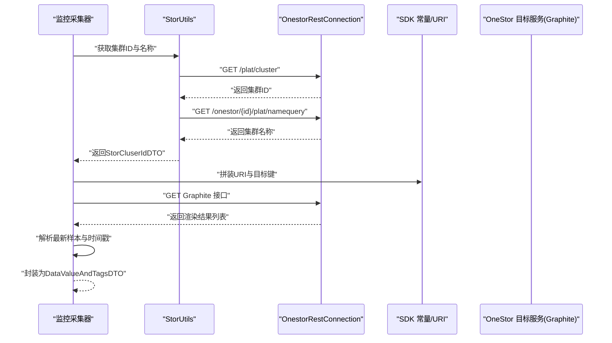
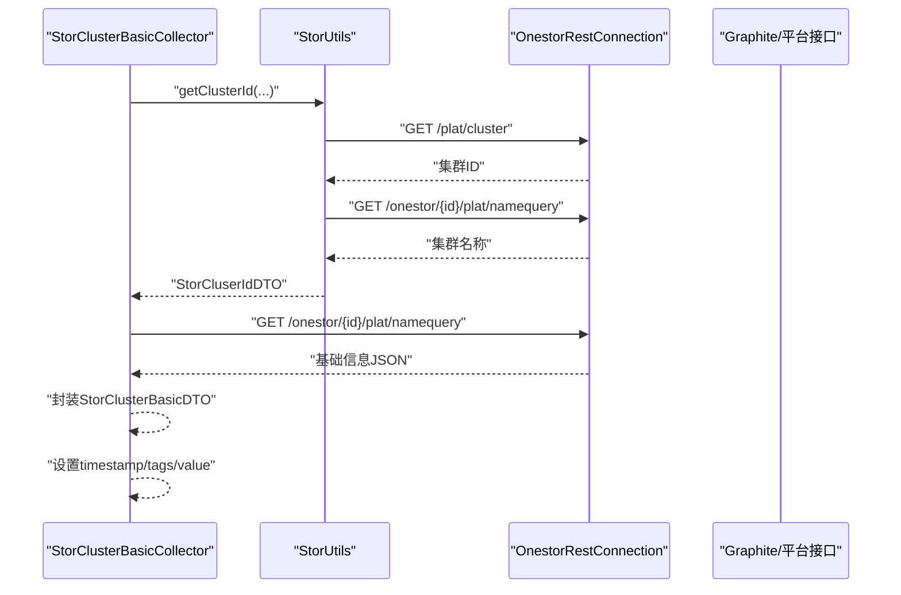
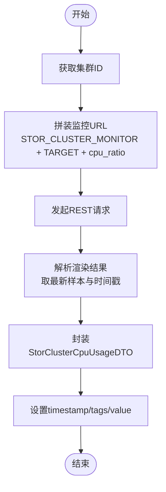
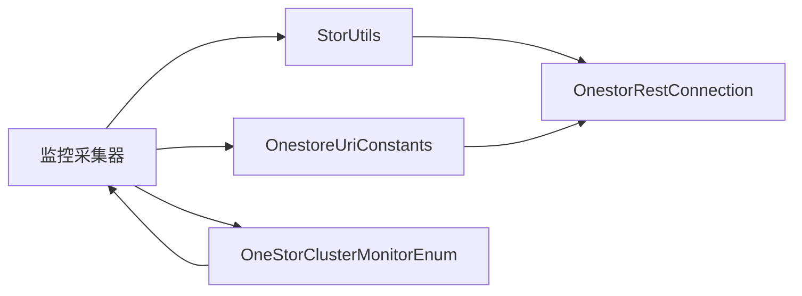

# 存储集群监控

<cite>
**本文引用的文件**
- [StorClusterBasicCollector.java](file://watcher-onestor/src/main/java/com/virtual/cloud/om/onestor/service/clusterBasic/StorClusterBasicCollector.java)
- [StorClusterCpuUsageCollector.java](file://watcher-onestor/src/main/java/com/virtual/cloud/om/onestor/service/clusterBasic/StorClusterCpuUsageCollector.java)
- [StorClusterMemUsageCollector.java](file://watcher-onestor/src/main/java/com/virtual/cloud/om/onestor/service/clusterBasic/StorClusterMemUsageCollector.java)
- [StorClusterCapacityCollector.java](file://watcher-onestor/src/main/java/com/virtual/cloud/om/onestor/service/clusterBasic/StorClusterCapacityCollector.java)
- [StorClusterBandwidthCollector.java](file://watcher-onestor/src/main/java/com/virtual/cloud/om/onestor/service/clusterBasic/StorClusterBandwidthCollector.java)
- [StorClusterIopsCollector.java](file://watcher-onestor/src/main/java/com/virtual/cloud/om/onestor/service/clusterBasic/StorClusterIopsCollector.java)
- [StorClusterDiskDelayCollector.java](file://watcher-onestor/src/main/java/com/virtual/cloud/om/onestor/service/clusterBasic/StorClusterDiskDelayCollector.java)
- [StorClusterDiskLoadCollector.java](file://watcher-onestor/src/main/java/com/virtual/cloud/om/onestor/service/clusterBasic/StorClusterDiskLoadCollector.java)
- [StorClusterFlowCollector.java](file://watcher-onestor/src/main/java/com/virtual/cloud/om/onestor/service/clusterBasic/StorClusterFlowCollector.java)
- [StorClusterMonitorCollector.java](file://watcher-onestor/src/main/java/com/virtual/cloud/om/onestor/service/clusterBasic/StorClusterMonitorCollector.java)
- [StorUtils.java](file://watcher-onestor/src/main/java/com/virtual/cloud/om/onestor/service/clusterBasic/StorUtils.java)
- [OneStorClusterMonitorEnum.java](file://watcher-sdk/src/main/java/com/virtual/cloud/om/sdk/constant/OneStorClusterMonitorEnum.java)
- [OnestoreUriConstants.java](file://watcher-sdk/src/main/java/com/virtual/cloud/om/sdk/constant/uri/OnestoreUriConstants.java)
</cite>

## 目录
1. [简介](#简介)
2. [项目结构](#项目结构)
3. [核心组件](#核心组件)
4. [架构总览](#架构总览)
5. [详细组件分析](#详细组件分析)
6. [依赖关系分析](#依赖关系分析)
7. [性能考量](#性能考量)
8. [故障排查指南](#故障排查指南)
9. [结论](#结论)
10. [附录](#附录)

## 简介
本技术文档围绕 OneStor 存储集群监控能力展开，系统性梳理了集群基础信息采集、CPU 使用率、内存使用率、容量、带宽、IOPS、磁盘延迟与负载、网络流量以及综合健康状态等监控器的实现原理、数据采集流程、REST API 调用方式与数据转换逻辑。文档旨在帮助开发者与运维工程师快速理解各监控器的工作机制，并提供可操作的排障与优化建议。

## 项目结构
监控相关代码主要位于以下模块与包中：
- watcher-onestor 模块：存储集群监控采集器实现，位于 clusterBasic 包下，包含各类 StorCluster*Collector。
- watcher-sdk 模块：统一的常量、URI 定义、DTO 结构与通用工具，支撑监控数据的标准化传输与转换。

```mermaid
graph TB
subgraph "监控采集层"
Basic["StorClusterBasicCollector"]
Cpu["StorClusterCpuUsageCollector"]
Mem["StorClusterMemUsageCollector"]
Cap["StorClusterCapacityCollector"]
Bw["StorClusterBandwidthCollector"]
Iops["StorClusterIopsCollector"]
Delay["StorClusterDiskDelayCollector"]
Load["StorClusterDiskLoadCollector"]
Flow["StorClusterFlowCollector"]
Mon["StorClusterMonitorCollector"]
Utils["StorUtils"]
end
subgraph "SDK 常量与URI"
Enum["OneStorClusterMonitorEnum"]
Uri["OnestoreUriConstants"]
end
Basic --> Utils
Cpu --> Utils
Mem --> Utils
Cap --> Utils
Bw --> Utils
Iops --> Utils
Delay --> Utils
Load --> Utils
Flow --> Utils
Mon --> Utils
Basic --> Uri
Cpu --> Uri
Mem --> Uri
Cap --> Uri
Bw --> Uri
Iops --> Uri
Delay --> Uri
Load --> Uri
Flow --> Uri
Mon --> Uri
Cpu --> Enum
Mem --> Enum
Cap --> Enum
Bw --> Enum
Iops --> Enum
Delay --> Enum
Load --> Enum
Flow --> Enum
```

图表来源
- [StorClusterBasicCollector.java:33-76](file://watcher-onestor/src/main/java/com/virtual/cloud/om/onestor/service/clusterBasic/StorClusterBasicCollector.java#L33-L76)
- [StorClusterCpuUsageCollector.java:36-84](file://watcher-onestor/src/main/java/com/virtual/cloud/om/onestor/service/clusterBasic/StorClusterCpuUsageCollector.java#L36-L84)
- [StorClusterMemUsageCollector.java:36-82](file://watcher-onestor/src/main/java/com/virtual/cloud/om/onestor/service/clusterBasic/StorClusterMemUsageCollector.java#L36-L82)
- [StorClusterCapacityCollector.java:36-87](file://watcher-onestor/src/main/java/com/virtual/cloud/om/onestor/service/clusterBasic/StorClusterCapacityCollector.java#L36-L87)
- [StorClusterBandwidthCollector.java:37-120](file://watcher-onestor/src/main/java/com/virtual/cloud/om/onestor/service/clusterBasic/StorClusterBandwidthCollector.java#L37-L120)
- [StorClusterIopsCollector.java:35-146](file://watcher-onestor/src/main/java/com/virtual/cloud/om/onestor/service/clusterBasic/StorClusterIopsCollector.java#L35-L146)
- [StorClusterDiskDelayCollector.java:36-84](file://watcher-onestor/src/main/java/com/virtual/cloud/om/onestor/service/clusterBasic/StorClusterDiskDelayCollector.java#L36-L84)
- [StorClusterDiskLoadCollector.java:36-84](file://watcher-onestor/src/main/java/com/virtual/cloud/om/onestor/service/clusterBasic/StorClusterDiskLoadCollector.java#L36-L84)
- [StorClusterFlowCollector.java:38-111](file://watcher-onestor/src/main/java/com/virtual/cloud/om/onestor/service/clusterBasic/StorClusterFlowCollector.java#L38-L111)
- [StorClusterMonitorCollector.java:32-77](file://watcher-onestor/src/main/java/com/virtual/cloud/om/onestor/service/clusterBasic/StorClusterMonitorCollector.java#L32-L77)
- [StorUtils.java:27-56](file://watcher-onestor/src/main/java/com/virtual/cloud/om/onestor/service/clusterBasic/StorUtils.java#L27-L56)
- [OneStorClusterMonitorEnum.java:10-66](file://watcher-sdk/src/main/java/com/virtual/cloud/om/sdk/constant/OneStorClusterMonitorEnum.java#L10-L66)
- [OnestoreUriConstants.java:27-62](file://watcher-sdk/src/main/java/com/virtual/cloud/om/sdk/constant/uri/OnestoreUriConstants.java#L27-L62)

章节来源
- [StorClusterBasicCollector.java:33-76](file://watcher-onestor/src/main/java/com/virtual/cloud/om/onestor/service/clusterBasic/StorClusterBasicCollector.java#L33-L76)
- [OnestoreUriConstants.java:27-62](file://watcher-sdk/src/main/java/com/virtual/cloud/om/sdk/constant/uri/OnestoreUriConstants.java#L27-L62)

## 核心组件
- 集群基础信息采集器：负责获取集群 ID、名称与更新时间，并封装为基础 DTO。
- CPU 使用率采集器：从 Graphite 接口按目标键获取最近采样值与时间戳。
- 内存使用率采集器：同上，获取内存占用率并转换为 DTO。
- 容量采集器：同时拉取总容量与已用容量，计算时间戳后封装。
- 带宽采集器：聚合多个带宽目标，处理缺失目标的空值场景。
- IOPS 采集器：聚合 IOPS、OPS、带宽与流量相关多个目标，统一时间戳。
- 磁盘延迟采集器：读写时延分别取最新样本。
- 磁盘负载采集器：平均与最大 util，统一时间戳。
- 流量采集器：读写与恢复流量聚合，统一时间戳。
- 综合监控采集器：获取监控器健康计数（warn/critical/ok）。

章节来源
- [StorClusterBasicCollector.java:33-76](file://watcher-onestor/src/main/java/com/virtual/cloud/om/onestor/service/clusterBasic/StorClusterBasicCollector.java#L33-L76)
- [StorClusterCpuUsageCollector.java:36-84](file://watcher-onestor/src/main/java/com/virtual/cloud/om/onestor/service/clusterBasic/StorClusterCpuUsageCollector.java#L36-L84)
- [StorClusterMemUsageCollector.java:36-82](file://watcher-onestor/src/main/java/com/virtual/cloud/om/onestor/service/clusterBasic/StorClusterMemUsageCollector.java#L36-L82)
- [StorClusterCapacityCollector.java:36-87](file://watcher-onestor/src/main/java/com/virtual/cloud/om/onestor/service/clusterBasic/StorClusterCapacityCollector.java#L36-L87)
- [StorClusterBandwidthCollector.java:37-120](file://watcher-onestor/src/main/java/com/virtual/cloud/om/onestor/service/clusterBasic/StorClusterBandwidthCollector.java#L37-L120)
- [StorClusterIopsCollector.java:35-146](file://watcher-onestor/src/main/java/com/virtual/cloud/om/onestor/service/clusterBasic/StorClusterIopsCollector.java#L35-L146)
- [StorClusterDiskDelayCollector.java:36-84](file://watcher-onestor/src/main/java/com/virtual/cloud/om/onestor/service/clusterBasic/StorClusterDiskDelayCollector.java#L36-L84)
- [StorClusterDiskLoadCollector.java:36-84](file://watcher-onestor/src/main/java/com/virtual/cloud/om/onestor/service/clusterBasic/StorClusterDiskLoadCollector.java#L36-L84)
- [StorClusterFlowCollector.java:38-111](file://watcher-onestor/src/main/java/com/virtual/cloud/om/onestor/service/clusterBasic/StorClusterFlowCollector.java#L38-L111)
- [StorClusterMonitorCollector.java:32-77](file://watcher-onestor/src/main/java/com/virtual/cloud/om/onestor/service/clusterBasic/StorClusterMonitorCollector.java#L32-L77)

## 架构总览
监控采集器均继承自统一的采集基类，通过 OnestorRestConnection 发起 REST 请求，使用 OnestoreUriConstants 提供的 URI 模板与 OneStorClusterMonitorEnum 的目标键，最终将结果转换为 DataValueAndTagsDTO 并附带统一时间戳与标签。

图表来源
- [StorClusterBasicCollector.java:39-65](file://watcher-onestor/src/main/java/com/virtual/cloud/om/onestor/service/clusterBasic/StorClusterBasicCollector.java#L39-L65)
- [StorClusterCpuUsageCollector.java:42-73](file://watcher-onestor/src/main/java/com/virtual/cloud/om/onestor/service/clusterBasic/StorClusterCpuUsageCollector.java#L42-L73)
- [StorClusterCapacityCollector.java:42-76](file://watcher-onestor/src/main/java/com/virtual/cloud/om/onestor/service/clusterBasic/StorClusterCapacityCollector.java#L42-L76)
- [StorClusterBandwidthCollector.java:42-109](file://watcher-onestor/src/main/java/com/virtual/cloud/om/onestor/service/clusterBasic/StorClusterBandwidthCollector.java#L42-L109)
- [StorClusterIopsCollector.java:39-134](file://watcher-onestor/src/main/java/com/virtual/cloud/om/onestor/service/clusterBasic/StorClusterIopsCollector.java#L39-L134)
- [StorClusterDiskDelayCollector.java:41-72](file://watcher-onestor/src/main/java/com/virtual/cloud/om/onestor/service/clusterBasic/StorClusterDiskDelayCollector.java#L41-L72)
- [StorClusterDiskLoadCollector.java:41-72](file://watcher-onestor/src/main/java/com/virtual/cloud/om/onestor/service/clusterBasic/StorClusterDiskLoadCollector.java#L41-L72)
- [StorClusterFlowCollector.java:44-99](file://watcher-onestor/src/main/java/com/virtual/cloud/om/onestor/service/clusterBasic/StorClusterFlowCollector.java#L44-L99)
- [StorClusterMonitorCollector.java:38-65](file://watcher-onestor/src/main/java/com/virtual/cloud/om/onestor/service/clusterBasic/StorClusterMonitorCollector.java#L38-L65)
- [StorUtils.java:31-55](file://watcher-onestor/src/main/java/com/virtual/cloud/om/onestor/service/clusterBasic/StorUtils.java#L31-L55)
- [OnestoreUriConstants.java:39-61](file://watcher-sdk/src/main/java/com/virtual/cloud/om/sdk/constant/uri/OnestoreUriConstants.java#L39-L61)
- [OneStorClusterMonitorEnum.java:10-66](file://watcher-sdk/src/main/java/com/virtual/cloud/om/sdk/constant/OneStorClusterMonitorEnum.java#L10-L66)

## 详细组件分析

### 集群基础信息采集器（StorClusterBasicCollector）
- 实现要点
  - 通过 StorUtils 获取集群 ID 与名称，并回填到 DTO。
  - 使用平台 URI 模板构造查询 URL，调用 REST 接口获取基础信息。
  - 将返回数据映射到 StorClusterBasicDTO，并设置统一时间戳与标签。
- 数据流
  - 输入：平台、主机、协议、端口、用户名、密码、标签、资源ID。
  - 处理：获取集群ID → 拼接基础信息URL → REST请求 → JSON解析 → DTO封装。
  - 输出：DataValueAndTagsDTO 列表（单条记录）。
- 关键路径
  - [collect(...):39-65](file://watcher-onestor/src/main/java/com/virtual/cloud/om/onestor/service/clusterBasic/StorClusterBasicCollector.java#L39-L65)
  - [StorUtils.getClusterId(...):31-55](file://watcher-onestor/src/main/java/com/virtual/cloud/om/onestor/service/clusterBasic/StorUtils.java#L31-L55)
  - [OnestoreUriConstants.Cluster.STOR_CLUSTER_BASIC](file://watcher-sdk/src/main/java/com/virtual/cloud/om/sdk/constant/uri/OnestoreUriConstants.java#L44)

图表来源
- [StorClusterBasicCollector.java:39-65](file://watcher-onestor/src/main/java/com/virtual/cloud/om/onestor/service/clusterBasic/StorClusterBasicCollector.java#L39-L65)
- [StorUtils.java:31-55](file://watcher-onestor/src/main/java/com/virtual/cloud/om/onestor/service/clusterBasic/StorUtils.java#L31-L55)
- [OnestoreUriConstants.java](file://watcher-sdk/src/main/java/com/virtual/cloud/om/sdk/constant/uri/OnestoreUriConstants.java#L44)

章节来源
- [StorClusterBasicCollector.java:33-76](file://watcher-onestor/src/main/java/com/virtual/cloud/om/onestor/service/clusterBasic/StorClusterBasicCollector.java#L33-L76)
- [StorUtils.java:27-56](file://watcher-onestor/src/main/java/com/virtual/cloud/om/onestor/service/clusterBasic/StorUtils.java#L27-L56)
- [OnestoreUriConstants.java:39-44](file://watcher-sdk/src/main/java/com/virtual/cloud/om/sdk/constant/uri/OnestoreUriConstants.java#L39-L44)

### CPU 使用率采集器（StorClusterCpuUsageCollector）
- 实现要点
  - 使用 STOR_CLUSTER_MONITOR 模板与目标键 big_cluster_cpu_ratio。
  - 解析返回的渲染结果，取最新样本值与时间戳，转换为标准时间字符串。
  - 封装为 StorClusterCpuUsageDTO，设置统一时间戳与标签。
- 数据流
  - 输入：平台、主机、协议、端口、用户名、密码、标签、资源ID。
  - 处理：获取集群ID → 拼接监控URL → REST请求 → 解析最新样本 → DTO封装。
  - 输出：DataValueAndTagsDTO（单条记录）。
- 关键路径
  - [collect(...):42-73](file://watcher-onestor/src/main/java/com/virtual/cloud/om/onestor/service/clusterBasic/StorClusterCpuUsageCollector.java#L42-L73)
  - [OneStorClusterMonitorEnum.big_cluster_cpu_ratio](file://watcher-sdk/src/main/java/com/virtual/cloud/om/sdk/constant/OneStorClusterMonitorEnum.java#L30)
  - [OnestoreUriConstants.Cluster.STOR_CLUSTER_MONITOR](file://watcher-sdk/src/main/java/com/virtual/cloud/om/sdk/constant/uri/OnestoreUriConstants.java#L57)

图表来源
- [StorClusterCpuUsageCollector.java:42-73](file://watcher-onestor/src/main/java/com/virtual/cloud/om/onestor/service/clusterBasic/StorClusterCpuUsageCollector.java#L42-L73)
- [OneStorClusterMonitorEnum.java](file://watcher-sdk/src/main/java/com/virtual/cloud/om/sdk/constant/OneStorClusterMonitorEnum.java#L30)
- [OnestoreUriConstants.java](file://watcher-sdk/src/main/java/com/virtual/cloud/om/sdk/constant/uri/OnestoreUriConstants.java#L57)

章节来源
- [StorClusterCpuUsageCollector.java:36-84](file://watcher-onestor/src/main/java/com/virtual/cloud/om/onestor/service/clusterBasic/StorClusterCpuUsageCollector.java#L36-L84)
- [OneStorClusterMonitorEnum.java:10-66](file://watcher-sdk/src/main/java/com/virtual/cloud/om/sdk/constant/OneStorClusterMonitorEnum.java#L10-L66)
- [OnestoreUriConstants.java](file://watcher-sdk/src/main/java/com/virtual/cloud/om/sdk/constant/uri/OnestoreUriConstants.java#L57)

### 内存使用率采集器（StorClusterMemUsageCollector）
- 实现要点
  - 使用 big_cluster_mem_ratio 目标键，解析最新样本值与时间戳。
  - 封装为 StorClusterMemUsageDTO，统一设置时间戳与标签。
- 数据流
  - 输入：平台、主机、协议、端口、用户名、密码、标签、资源ID。
  - 处理：获取集群ID → 拼装监控URL → REST请求 → 解析样本 → DTO封装。
  - 输出：DataValueAndTagsDTO（单条记录）。
- 关键路径
  - [collect(...):41-71](file://watcher-onestor/src/main/java/com/virtual/cloud/om/onestor/service/clusterBasic/StorClusterMemUsageCollector.java#L41-L71)
  - [OneStorClusterMonitorEnum.big_cluster_mem_ratio](file://watcher-sdk/src/main/java/com/virtual/cloud/om/sdk/constant/OneStorClusterMonitorEnum.java#L31)

章节来源
- [StorClusterMemUsageCollector.java:36-82](file://watcher-onestor/src/main/java/com/virtual/cloud/om/onestor/service/clusterBasic/StorClusterMemUsageCollector.java#L36-L82)
- [OneStorClusterMonitorEnum.java](file://watcher-sdk/src/main/java/com/virtual/cloud/om/sdk/constant/OneStorClusterMonitorEnum.java#L31)

### 容量采集器（StorClusterCapacityCollector）
- 实现要点
  - 同时请求 big_cluster_space_total 与 big_cluster_space_used。
  - 取 total 的时间戳作为统一时间戳，封装为 StorClusterCapacityDTO。
- 数据流
  - 输入：平台、主机、协议、端口、用户名、密码、标签、资源ID。
  - 处理：获取集群ID → 拼装双目标URL → REST请求 → 解析样本 → DTO封装。
  - 输出：DataValueAndTagsDTO（单条记录）。
- 关键路径
  - [collect(...):42-76](file://watcher-onestor/src/main/java/com/virtual/cloud/om/onestor/service/clusterBasic/StorClusterCapacityCollector.java#L42-L76)
  - [OneStorClusterMonitorEnum.big_cluster_space_total](file://watcher-sdk/src/main/java/com/virtual/cloud/om/sdk/constant/OneStorClusterMonitorEnum.java#L28)
  - [OneStorClusterMonitorEnum.big_cluster_space_used](file://watcher-sdk/src/main/java/com/virtual/cloud/om/sdk/constant/OneStorClusterMonitorEnum.java#L29)

章节来源
- [StorClusterCapacityCollector.java:36-87](file://watcher-onestor/src/main/java/com/virtual/cloud/om/onestor/service/clusterBasic/StorClusterCapacityCollector.java#L36-L87)
- [OneStorClusterMonitorEnum.java:28-29](file://watcher-sdk/src/main/java/com/virtual/cloud/om/sdk/constant/OneStorClusterMonitorEnum.java#L28-L29)

### 带宽采集器（StorClusterBandwidthCollector）
- 实现要点
  - 使用 CLUSTER_INFO_ALL 模板一次性拉取多个带宽目标。
  - 对缺失目标进行空值保护，统一取存储读带宽的时间戳作为更新时间。
  - 封装为 StorClusterBandwidthDTO。
- 数据流
  - 输入：平台、主机、协议、端口、用户名、密码、标签、资源ID。
  - 处理：获取集群ID → 拼装CLUSTER_INFO_ALL → REST请求 → 解析各目标 → DTO封装。
  - 输出：DataValueAndTagsDTO（单条记录）。
- 关键路径
  - [collect(...):42-109](file://watcher-onestor/src/main/java/com/virtual/cloud/om/onestor/service/clusterBasic/StorClusterBandwidthCollector.java#L42-L109)
  - [OnestoreUriConstants.Cluster.CLUSTER_INFO_ALL](file://watcher-sdk/src/main/java/com/virtual/cloud/om/sdk/constant/uri/OnestoreUriConstants.java#L61)

章节来源
- [StorClusterBandwidthCollector.java:37-120](file://watcher-onestor/src/main/java/com/virtual/cloud/om/onestor/service/clusterBasic/StorClusterBandwidthCollector.java#L37-L120)
- [OnestoreUriConstants.java](file://watcher-sdk/src/main/java/com/virtual/cloud/om/sdk/constant/uri/OnestoreUriConstants.java#L61)

### IOPS 采集器（StorClusterIopsCollector）
- 实现要点
  - 同时请求多个 IOPS/OPS/带宽/流量目标，统一取读IOPS的时间戳。
  - 对缺失目标进行空值保护，封装为 StorClusterIopsDTO。
- 数据流
  - 输入：平台、主机、协议、端口、用户名、密码、标签、资源ID。
  - 处理：获取集群ID → 拼装多目标URL → REST请求 → 解析样本 → DTO封装。
  - 输出：DataValueAndTagsDTO（单条记录）。
- 关键路径
  - [collect(...):39-134](file://watcher-onestor/src/main/java/com/virtual/cloud/om/onestor/service/clusterBasic/StorClusterIopsCollector.java#L39-L134)

章节来源
- [StorClusterIopsCollector.java:35-146](file://watcher-onestor/src/main/java/com/virtual/cloud/om/onestor/service/clusterBasic/StorClusterIopsCollector.java#L35-L146)

### 磁盘延迟采集器（StorClusterDiskDelayCollector）
- 实现要点
  - 请求 onestor_diskstat_lat_rd 与 onestor_diskstat_lat_wr。
  - 取读时延的时间戳作为统一时间戳，封装为 StorClusterDiskDelayDTO。
- 数据流
  - 输入：平台、主机、协议、端口、用户名、密码、标签、资源ID。
  - 处理：获取集群ID → 拼装双目标URL → REST请求 → 解析样本 → DTO封装。
  - 输出：DataValueAndTagsDTO（单条记录）。
- 关键路径
  - [collect(...):41-72](file://watcher-onestor/src/main/java/com/virtual/cloud/om/onestor/service/clusterBasic/StorClusterDiskDelayCollector.java#L41-L72)
  - [OneStorClusterMonitorEnum.onestor_diskstat_lat_rd](file://watcher-sdk/src/main/java/com/virtual/cloud/om/sdk/constant/OneStorClusterMonitorEnum.java#L32)
  - [OneStorClusterMonitorEnum.onestor_diskstat_lat_wr](file://watcher-sdk/src/main/java/com/virtual/cloud/om/sdk/constant/OneStorClusterMonitorEnum.java#L33)

章节来源
- [StorClusterDiskDelayCollector.java:36-84](file://watcher-onestor/src/main/java/com/virtual/cloud/om/onestor/service/clusterBasic/StorClusterDiskDelayCollector.java#L36-L84)
- [OneStorClusterMonitorEnum.java:32-33](file://watcher-sdk/src/main/java/com/virtual/cloud/om/sdk/constant/OneStorClusterMonitorEnum.java#L32-L33)

### 磁盘负载采集器（StorClusterDiskLoadCollector）
- 实现要点
  - 请求 big_cluster_diskstat_util_avg 与 big_cluster_diskstat_util_max。
  - 取平均 util 的时间戳作为统一时间戳，封装为 StorClusterDiskLoadDTO。
- 数据流
  - 输入：平台、主机、协议、端口、用户名、密码、标签、资源ID。
  - 处理：获取集群ID → 拼装双目标URL → REST请求 → 解析样本 → DTO封装。
  - 输出：DataValueAndTagsDTO（单条记录）。
- 关键路径
  - [collect(...):41-72](file://watcher-onestor/src/main/java/com/virtual/cloud/om/onestor/service/clusterBasic/StorClusterDiskLoadCollector.java#L41-L72)
  - [OneStorClusterMonitorEnum.big_cluster_diskstat_util_avg](file://watcher-sdk/src/main/java/com/virtual/cloud/om/sdk/constant/OneStorClusterMonitorEnum.java#L34)
  - [OneStorClusterMonitorEnum.big_cluster_diskstat_util_max](file://watcher-sdk/src/main/java/com/virtual/cloud/om/sdk/constant/OneStorClusterMonitorEnum.java#L35)

章节来源
- [StorClusterDiskLoadCollector.java:36-84](file://watcher-onestor/src/main/java/com/virtual/cloud/om/onestor/service/clusterBasic/StorClusterDiskLoadCollector.java#L36-L84)
- [OneStorClusterMonitorEnum.java:34-35](file://watcher-sdk/src/main/java/com/virtual/cloud/om/sdk/constant/OneStorClusterMonitorEnum.java#L34-L35)

### 流量采集器（StorClusterFlowCollector）
- 实现要点
  - 使用 CLUSTER_INFO_ALL 模板一次性拉取多个流量目标。
  - 对缺失目标进行空值保护，统一取存储读流量的时间戳作为更新时间。
  - 封装为 StorClusterFlowDTO。
- 数据流
  - 输入：平台、主机、协议、端口、用户名、密码、标签、资源ID。
  - 处理：获取集群ID → 拼装CLUSTER_INFO_ALL → REST请求 → 解析样本 → DTO封装。
  - 输出：DataValueAndTagsDTO（单条记录）。
- 关键路径
  - [collect(...):44-99](file://watcher-onestor/src/main/java/com/virtual/cloud/om/onestor/service/clusterBasic/StorClusterFlowCollector.java#L44-L99)
  - [OnestoreUriConstants.Cluster.CLUSTER_INFO_ALL](file://watcher-sdk/src/main/java/com/virtual/cloud/om/sdk/constant/uri/OnestoreUriConstants.java#L61)

章节来源
- [StorClusterFlowCollector.java:38-111](file://watcher-onestor/src/main/java/com/virtual/cloud/om/onestor/service/clusterBasic/StorClusterFlowCollector.java#L38-L111)
- [OnestoreUriConstants.java](file://watcher-sdk/src/main/java/com/virtual/cloud/om/sdk/constant/uri/OnestoreUriConstants.java#L61)

### 综合监控采集器（StorClusterMonitorCollector）
- 实现要点
  - 获取集群健康状态，统计 mon.warn、mon.critical、mon.ok 的数量。
  - 封装为 StorClusterMonitorDTO，设置统一时间戳与标签。
- 数据流
  - 输入：平台、主机、协议、端口、用户名、密码、标签、资源ID。
  - 处理：获取集群ID → 拼装健康状态URL → REST请求 → JSON解析 → DTO封装。
  - 输出：DataValueAndTagsDTO（列表，单条记录）。
- 关键路径
  - [collect(...):38-65](file://watcher-onestor/src/main/java/com/virtual/cloud/om/onestor/service/clusterBasic/StorClusterMonitorCollector.java#L38-L65)
  - [OnestoreUriConstants.Cluster.STOR_CLUSTER_MONITOC](file://watcher-sdk/src/main/java/com/virtual/cloud/om/sdk/constant/uri/OnestoreUriConstants.java#L48)

章节来源
- [StorClusterMonitorCollector.java:32-77](file://watcher-onestor/src/main/java/com/virtual/cloud/om/onestor/service/clusterBasic/StorClusterMonitorCollector.java#L32-L77)
- [OnestoreUriConstants.java](file://watcher-sdk/src/main/java/com/virtual/cloud/om/sdk/constant/uri/OnestoreUriConstants.java#L48)

## 依赖关系分析
- 组件耦合
  - 所有采集器依赖 StorUtils 获取集群 ID 与名称，确保后续 REST 请求的 URL 正确性。
  - 采集器依赖 OnestoreUriConstants 提供的 URI 模板，避免硬编码。
  - 采集器依赖 OneStorClusterMonitorEnum 的目标键，保证监控项的一致性与可维护性。
- 外部依赖
  - Graphite 渲染接口：用于按目标键拉取历史样本与时间戳。
  - 平台基础接口：用于获取集群 ID 与基础信息。
- 潜在循环依赖
  - 当前结构清晰，无明显循环依赖风险。

图表来源
- [StorClusterBasicCollector.java:35-37](file://watcher-onestor/src/main/java/com/virtual/cloud/om/onestor/service/clusterBasic/StorClusterBasicCollector.java#L35-L37)
- [StorUtils.java:28-29](file://watcher-onestor/src/main/java/com/virtual/cloud/om/onestor/service/clusterBasic/StorUtils.java#L28-L29)
- [OnestoreUriConstants.java:39-61](file://watcher-sdk/src/main/java/com/virtual/cloud/om/sdk/constant/uri/OnestoreUriConstants.java#L39-L61)
- [OneStorClusterMonitorEnum.java:10-66](file://watcher-sdk/src/main/java/com/virtual/cloud/om/sdk/constant/OneStorClusterMonitorEnum.java#L10-L66)

章节来源
- [StorClusterBasicCollector.java:35-37](file://watcher-onestor/src/main/java/com/virtual/cloud/om/onestor/service/clusterBasic/StorClusterBasicCollector.java#L35-L37)
- [StorUtils.java:28-29](file://watcher-onestor/src/main/java/com/virtual/cloud/om/onestor/service/clusterBasic/StorUtils.java#L28-L29)
- [OnestoreUriConstants.java:39-61](file://watcher-sdk/src/main/java/com/virtual/cloud/om/sdk/constant/uri/OnestoreUriConstants.java#L39-L61)
- [OneStorClusterMonitorEnum.java:10-66](file://watcher-sdk/src/main/java/com/virtual/cloud/om/sdk/constant/OneStorClusterMonitorEnum.java#L10-L66)

## 性能考量
- 单次请求聚合
  - 带宽与流量采集器通过 CLUSTER_INFO_ALL 模板一次性拉取多个目标，减少多次往返，提升吞吐。
- 缺失目标处理
  - IOPS、带宽、流量等采集器对缺失目标进行空值保护，避免异常中断，提高鲁棒性。
- 时间戳一致性
  - 多采集器遵循“以最近样本时间戳为准”的策略，确保指标时间对齐；容量与带宽/流量等采用各自最新时间戳，保持语义正确。
- 标签与时间戳
  - 所有采集器统一设置 timestamp 与 tags，便于下游统一处理与关联。

## 故障排查指南
- 集群ID为空
  - 现象：返回空列表或日志提示集群ID为空。
  - 排查：确认平台、主机、协议、端口、认证参数是否正确；检查 /plat/cluster 接口可达性。
  - 参考路径：[StorUtils.getClusterId(...):31-55](file://watcher-onestor/src/main/java/com/virtual/cloud/om/onestor/service/clusterBasic/StorUtils.java#L31-L55)
- Graphite 目标缺失
  - 现象：部分目标返回空列表，导致 DTO 字段为空。
  - 排查：确认目标键是否正确；检查 Graphite 服务状态与数据可用性。
  - 参考路径：[StorClusterIopsCollector.collect(...):63-134](file://watcher-onestor/src/main/java/com/virtual/cloud/om/onestor/service/clusterBasic/StorClusterIopsCollector.java#L63-L134)
- 时间戳不一致
  - 现象：不同指标时间戳差异较大。
  - 排查：确认各采集器使用的样本时间戳来源；容量与带宽/流量等采用各自最新时间戳属正常。
  - 参考路径：[StorClusterCapacityCollector.collect(...):67-69](file://watcher-onestor/src/main/java/com/virtual/cloud/om/onestor/service/clusterBasic/StorClusterCapacityCollector.java#L67-L69)
- 健康状态接口异常
  - 现象：返回空或解析失败。
  - 排查：确认 /onestor/{id}/plat/cluster/health 接口可用性；检查返回 JSON 结构。
  - 参考路径：[StorClusterMonitorCollector.collect(...):44-65](file://watcher-onestor/src/main/java/com/virtual/cloud/om/onestor/service/clusterBasic/StorClusterMonitorCollector.java#L44-L65)

章节来源
- [StorUtils.java:31-55](file://watcher-onestor/src/main/java/com/virtual/cloud/om/onestor/service/clusterBasic/StorUtils.java#L31-L55)
- [StorClusterIopsCollector.java:63-134](file://watcher-onestor/src/main/java/com/virtual/cloud/om/onestor/service/clusterBasic/StorClusterIopsCollector.java#L63-L134)
- [StorClusterCapacityCollector.java:67-69](file://watcher-onestor/src/main/java/com/virtual/cloud/om/onestor/service/clusterBasic/StorClusterCapacityCollector.java#L67-L69)
- [StorClusterMonitorCollector.java:44-65](file://watcher-onestor/src/main/java/com/virtual/cloud/om/onestor/service/clusterBasic/StorClusterMonitorCollector.java#L44-L65)

## 结论
上述监控器通过统一的采集基类、标准化的 URI 与目标键，实现了对 OneStor 存储集群的全栈监控覆盖。其设计强调了“一次请求聚合、缺失目标保护、时间戳一致性与标签标准化”，既保证了性能，也提升了可维护性。建议在生产环境中结合告警策略与可视化面板，持续观测关键指标变化趋势，及时发现潜在问题。

## 附录
- 代码示例路径（仅提供路径，不展示具体代码内容）
  - 通过 OnestorRestConnection 获取集群数据：[OnestorRestConnection.get(...)](file://watcher-sdk/src/main/java/com/virtual/cloud/om/sdk/config/token/onestor/OnestorRestConnection.java)
  - 处理返回的 JSON 并转换为 DataValueAndTagsDTO：参考各采集器的 collect(...) 方法
    - [StorClusterBasicCollector.collect(...):39-65](file://watcher-onestor/src/main/java/com/virtual/cloud/om/onestor/service/clusterBasic/StorClusterBasicCollector.java#L39-L65)
    - [StorClusterCpuUsageCollector.collect(...):42-73](file://watcher-onestor/src/main/java/com/virtual/cloud/om/onestor/service/clusterBasic/StorClusterCpuUsageCollector.java#L42-L73)
    - [StorClusterMemUsageCollector.collect(...):41-71](file://watcher-onestor/src/main/java/com/virtual/cloud/om/onestor/service/clusterBasic/StorClusterMemUsageCollector.java#L41-L71)
    - [StorClusterCapacityCollector.collect(...):42-76](file://watcher-onestor/src/main/java/com/virtual/cloud/om/onestor/service/clusterBasic/StorClusterCapacityCollector.java#L42-L76)
    - [StorClusterBandwidthCollector.collect(...):42-109](file://watcher-onestor/src/main/java/com/virtual/cloud/om/onestor/service/clusterBasic/StorClusterBandwidthCollector.java#L42-L109)
    - [StorClusterIopsCollector.collect(...):39-134](file://watcher-onestor/src/main/java/com/virtual/cloud/om/onestor/service/clusterBasic/StorClusterIopsCollector.java#L39-L134)
    - [StorClusterDiskDelayCollector.collect(...):41-72](file://watcher-onestor/src/main/java/com/virtual/cloud/om/onestor/service/clusterBasic/StorClusterDiskDelayCollector.java#L41-L72)
    - [StorClusterDiskLoadCollector.collect(...):41-72](file://watcher-onestor/src/main/java/com/virtual/cloud/om/onestor/service/clusterBasic/StorClusterDiskLoadCollector.java#L41-L72)
    - [StorClusterFlowCollector.collect(...):44-99](file://watcher-onestor/src/main/java/com/virtual/cloud/om/onestor/service/clusterBasic/StorClusterFlowCollector.java#L44-L99)
    - [StorClusterMonitorCollector.collect(...):38-65](file://watcher-onestor/src/main/java/com/virtual/cloud/om/onestor/service/clusterBasic/StorClusterMonitorCollector.java#L38-L65)
  - 监控指标计算与时间戳处理
    - 最新样本取值与时间戳转换：参考各采集器中的样本解析与时间戳转换逻辑
      - [StorClusterCpuUsageCollector.collect(...):59-62](file://watcher-onestor/src/main/java/com/virtual/cloud/om/onestor/service/clusterBasic/StorClusterCpuUsageCollector.java#L59-L62)
      - [StorClusterCapacityCollector.collect(...):60-69](file://watcher-onestor/src/main/java/com/virtual/cloud/om/onestor/service/clusterBasic/StorClusterCapacityCollector.java#L60-L69)
      - [StorClusterBandwidthCollector.collect(...):100-102](file://watcher-onestor/src/main/java/com/virtual/cloud/om/onestor/service/clusterBasic/StorClusterBandwidthCollector.java#L100-L102)
      - [StorClusterIopsCollector.collect(...):115-117](file://watcher-onestor/src/main/java/com/virtual/cloud/om/onestor/service/clusterBasic/StorClusterIopsCollector.java#L115-L117)
      - [StorClusterDiskDelayCollector.collect(...):59-61](file://watcher-onestor/src/main/java/com/virtual/cloud/om/onestor/service/clusterBasic/StorClusterDiskDelayCollector.java#L59-L61)
      - [StorClusterDiskLoadCollector.collect(...):59-61](file://watcher-onestor/src/main/java/com/virtual/cloud/om/onestor/service/clusterBasic/StorClusterDiskLoadCollector.java#L59-L61)
      - [StorClusterFlowCollector.collect(...):84-85](file://watcher-onestor/src/main/java/com/virtual/cloud/om/onestor/service/clusterBasic/StorClusterFlowCollector.java#L84-L85)
  - 标签设置与统一时间戳
    - 所有采集器在封装 DTO 后设置 timestamp(System.currentTimeMillis()) 与 tags，确保上报数据一致性
      - 参考各采集器末尾的封装逻辑
        - [StorClusterBasicCollector.collect(...):60-64](file://watcher-onestor/src/main/java/com/virtual/cloud/om/onestor/service/clusterBasic/StorClusterBasicCollector.java#L60-L64)
        - [StorClusterCpuUsageCollector.collect(...):67-71](file://watcher-onestor/src/main/java/com/virtual/cloud/om/onestor/service/clusterBasic/StorClusterCpuUsageCollector.java#L67-L71)
        - [StorClusterMemUsageCollector.collect(...):65-70](file://watcher-onestor/src/main/java/com/virtual/cloud/om/onestor/service/clusterBasic/StorClusterMemUsageCollector.java#L65-L70)
        - [StorClusterCapacityCollector.collect(...):70-74](file://watcher-onestor/src/main/java/com/virtual/cloud/om/onestor/service/clusterBasic/StorClusterCapacityCollector.java#L70-L74)
        - [StorClusterBandwidthCollector.collect(...):103-108](file://watcher-onestor/src/main/java/com/virtual/cloud/om/onestor/service/clusterBasic/StorClusterBandwidthCollector.java#L103-L108)
        - [StorClusterIopsCollector.collect(...):129-134](file://watcher-onestor/src/main/java/com/virtual/cloud/om/onestor/service/clusterBasic/StorClusterIopsCollector.java#L129-L134)
        - [StorClusterDiskDelayCollector.collect(...):67-72](file://watcher-onestor/src/main/java/com/virtual/cloud/om/onestor/service/clusterBasic/StorClusterDiskDelayCollector.java#L67-L72)
        - [StorClusterDiskLoadCollector.collect(...):67-72](file://watcher-onestor/src/main/java/com/virtual/cloud/om/onestor/service/clusterBasic/StorClusterDiskLoadCollector.java#L67-L72)
        - [StorClusterFlowCollector.collect(...):94-99](file://watcher-onestor/src/main/java/com/virtual/cloud/om/onestor/service/clusterBasic/StorClusterFlowCollector.java#L94-L99)
        - [StorClusterMonitorCollector.collect(...):60-65](file://watcher-onestor/src/main/java/com/virtual/cloud/om/onestor/service/clusterBasic/StorClusterMonitorCollector.java#L60-L65)
  - 集群ID获取机制
    - 通过 /plat/cluster 获取集群ID，再通过 /onestor/{id}/plat/namequery 获取集群名称
      - [StorUtils.getClusterId(...):31-55](file://watcher-onestor/src/main/java/com/virtual/cloud/om/onestor/service/clusterBasic/StorUtils.java#L31-L55)
  - 错误处理策略
    - 对集群ID为空、REST 返回为空、目标缺失等情况进行空列表返回与日志记录，避免中断
      - 参考各采集器开头的判空逻辑与日志输出
        - [StorClusterBasicCollector.collect(...):40-44](file://watcher-onestor/src/main/java/com/virtual/cloud/om/onestor/service/clusterBasic/StorClusterBasicCollector.java#L40-L44)
        - [StorClusterCpuUsageCollector.collect(...):44-48](file://watcher-onestor/src/main/java/com/virtual/cloud/om/onestor/service/clusterBasic/StorClusterCpuUsageCollector.java#L44-L48)
        - [StorClusterMemUsageCollector.collect(...):42-46](file://watcher-onestor/src/main/java/com/virtual/cloud/om/onestor/service/clusterBasic/StorClusterMemUsageCollector.java#L42-L46)
        - [StorClusterCapacityCollector.collect(...):44-48](file://watcher-onestor/src/main/java/com/virtual/cloud/om/onestor/service/clusterBasic/StorClusterCapacityCollector.java#L44-L48)
        - [StorClusterBandwidthCollector.collect(...):43-47](file://watcher-onestor/src/main/java/com/virtual/cloud/om/onestor/service/clusterBasic/StorClusterBandwidthCollector.java#L43-L47)
        - [StorClusterIopsCollector.collect(...):41-45](file://watcher-onestor/src/main/java/com/virtual/cloud/om/onestor/service/clusterBasic/StorClusterIopsCollector.java#L41-L45)
        - [StorClusterDiskDelayCollector.collect(...):42-46](file://watcher-onestor/src/main/java/com/virtual/cloud/om/onestor/service/clusterBasic/StorClusterDiskDelayCollector.java#L42-L46)
        - [StorClusterDiskLoadCollector.collect(...):42-46](file://watcher-onestor/src/main/java/com/virtual/cloud/om/onestor/service/clusterBasic/StorClusterDiskLoadCollector.java#L42-L46)
        - [StorClusterFlowCollector.collect(...):46-50](file://watcher-onestor/src/main/java/com/virtual/cloud/om/onestor/service/clusterBasic/StorClusterFlowCollector.java#L46-L50)
        - [StorClusterMonitorCollector.collect(...):39-43](file://watcher-onestor/src/main/java/com/virtual/cloud/om/onestor/service/clusterBasic/StorClusterMonitorCollector.java#L39-L43)
  - 性能优化建议
    - 使用 CLUSTER_INFO_ALL 聚合多目标请求，减少往返次数
      - [StorClusterBandwidthCollector.collect(...):49-52](file://watcher-onestor/src/main/java/com/virtual/cloud/om/onestor/service/clusterBasic/StorClusterBandwidthCollector.java#L49-L52)
      - [StorClusterFlowCollector.collect(...):52-53](file://watcher-onestor/src/main/java/com/virtual/cloud/om/onestor/service/clusterBasic/StorClusterFlowCollector.java#L52-L53)
    - 对缺失目标进行空值保护，避免异常中断
      - [StorClusterBandwidthCollector.collect(...):63-90](file://watcher-onestor/src/main/java/com/virtual/cloud/om/onestor/service/clusterBasic/StorClusterBandwidthCollector.java#L63-L90)
      - [StorClusterIopsCollector.collect(...):78-114](file://watcher-onestor/src/main/java/com/virtual/cloud/om/onestor/service/clusterBasic/StorClusterIopsCollector.java#L78-L114)