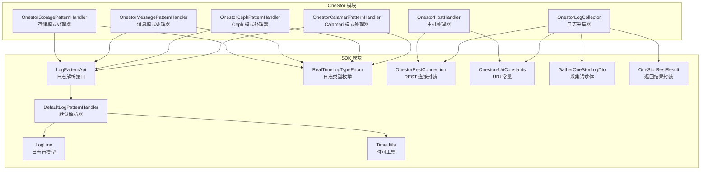
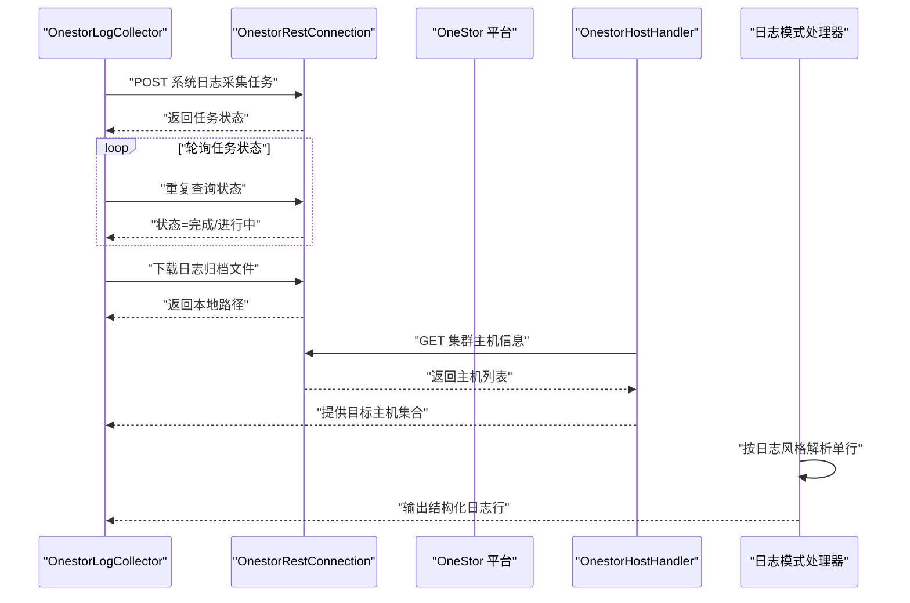
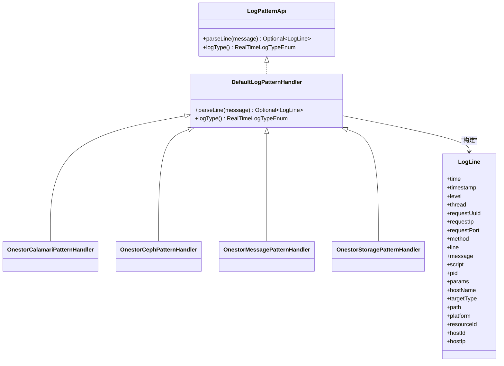
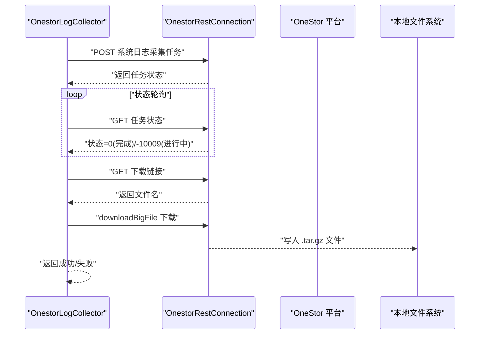
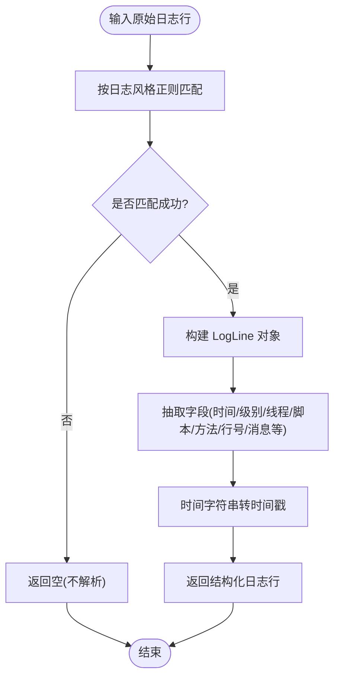
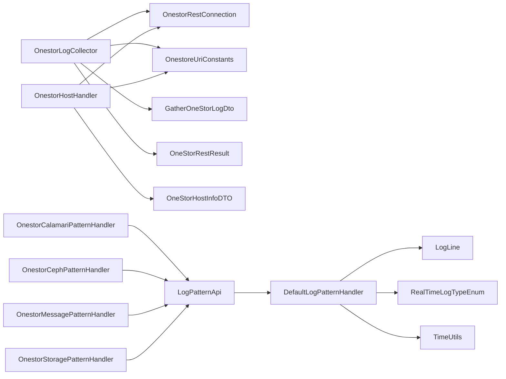

# 日志处理

<cite>
**本文引用的文件**
- [OnestorLogCollector.java](file://watcher-onestor/src/main/java/com/virtual/cloud/om/onestor/service/log/OnestorLogCollector.java)
- [OnestorHostHandler.java](file://watcher-onestor/src/main/java/com/virtual/cloud/om/onestor/service/OnestorHostHandler.java)
- [OnestorCalamariPatternHandler.java](file://watcher-onestor/src/main/java/com/virtual/cloud/om/onestor/service/OnestorCalamariPatternHandler.java)
- [OnestorCephPatternHandler.java](file://watcher-onestor/src/main/java/com/virtual/cloud/om/onestor/service/OnestorCephPatternHandler.java)
- [OnestorMessagePatternHandler.java](file://watcher-onestor/src/main/java/com/virtual/cloud/om/onestor/service/OnestorMessagePatternHandler.java)
- [OnestorStoragePatternHandler.java](file://watcher-onestor/src/main/java/com/virtual/cloud/om/onestor/service/OnestorStoragePatternHandler.java)
- [DefaultLogPatternHandler.java](file://watcher-sdk/src/main/java/com/virtual/cloud/om/sdk/api/DefaultLogPatternHandler.java)
- [LogPatternApi.java](file://watcher-sdk/src/main/java/com/virtual/cloud/om/sdk/api/LogPatternApi.java)
- [LogLine.java](file://watcher-sdk/src/main/java/com/virtual/cloud/om/sdk/dto/LogLine.java)
- [RealTimeLogTypeEnum.java](file://watcher-sdk/src/main/java/com/virtual/cloud/om/sdk/constant/RealTimeLogTypeEnum.java)
- [TimeUtils.java](file://watcher-sdk/src/main/java/com/virtual/cloud/om/sdk/utils/TimeUtils.java)
- [GatherOneStorLogDto.java](file://watcher-sdk/src/main/java/com/virtual/cloud/om/sdk/dto/GatherOneStorLogDto.java)
- [OneStorRestResult.java](file://watcher-sdk/src/main/java/com/virtual/cloud/om/sdk/dto/dataReport/onestor/OneStorRestResult.java)
- [OnestoreUriConstants.java](file://watcher-sdk/src/main/java/com/virtual/cloud/om/sdk/constant/uri/OnestoreUriConstants.java)
- [OnestorRestConnection.java](file://watcher-sdk/src/main/java/com/virtual/cloud/om/sdk/config/token/onestor/OnestorRestConnection.java)
- [OneStorHostInfoDTO.java](file://watcher-sdk/src/main/java/com/virtual/cloud/om/sdk/dto/OneStorHostInfoDTO.java)
</cite>

## 目录
1. [简介](#简介)
2. [项目结构](#项目结构)
3. [核心组件](#核心组件)
4. [架构总览](#架构总览)
5. [组件详解](#组件详解)
6. [依赖关系分析](#依赖关系分析)
7. [性能考量](#性能考量)
8. [故障排查指南](#故障排查指南)
9. [结论](#结论)
10. [附录](#附录)

## 简介
本技术文档围绕 OneStor 存储系统的日志处理能力展开，重点覆盖以下方面：
- 通用日志采集器：负责从 OneStor 平台批量拉取系统日志，并支持轮询等待任务完成与大文件下载。
- 主机处理器：负责从 OneStor 集群中枚举主机节点，生成可连接的 SSH 主机对象，支撑后续日志采集与处理。
- 多种日志模式处理器：针对 Calamari、Ceph、消息与存储四类典型日志，提供正则解析规则与字段抽取，统一输出结构化的日志行对象。
- 日志解析模型与类型体系：统一的日志行结构、实时日志类型枚举与时间戳转换工具，确保解析结果的一致性与可扩展性。

通过本文档，读者可以理解 OneStor 日志采集与解析的触发机制、轮转与下载流程、结构化存储思路、性能优化策略、错误处理与质量保障机制，并掌握最佳实践与故障排查方法。

## 项目结构
本仓库采用多模块组织方式，OneStor 日志处理相关代码主要分布在以下模块：
- watcher-onestor：OneStor 专属服务与处理器实现，包含日志采集器与各类日志模式处理器。
- watcher-sdk：跨平台 SDK，提供日志解析接口、模型、常量、REST 客户端与工具类。

图表来源
- [OnestorLogCollector.java:26-92](file://watcher-onestor/src/main/java/com/virtual/cloud/om/onestor/service/log/OnestorLogCollector.java#L26-L92)
- [OnestorHostHandler.java:29-71](file://watcher-onestor/src/main/java/com/virtual/cloud/om/onestor/service/OnestorHostHandler.java#L29-L71)
- [OnestorCalamariPatternHandler.java:17-57](file://watcher-onestor/src/main/java/com/virtual/cloud/om/onestor/service/OnestorCalamariPatternHandler.java#L17-L57)
- [OnestorCephPatternHandler.java:16-51](file://watcher-onestor/src/main/java/com/virtual/cloud/om/onestor/service/OnestorCephPatternHandler.java#L16-L51)
- [OnestorMessagePatternHandler.java:17-54](file://watcher-onestor/src/main/java/com/virtual/cloud/om/onestor/service/OnestorMessagePatternHandler.java#L17-L54)
- [OnestorStoragePatternHandler.java:16-51](file://watcher-onestor/src/main/java/com/virtual/cloud/om/onestor/service/OnestorStoragePatternHandler.java#L16-L51)
- [LogPatternApi.java:12-17](file://watcher-sdk/src/main/java/com/virtual/cloud/om/sdk/api/LogPatternApi.java#L12-L17)
- [DefaultLogPatternHandler.java:17-55](file://watcher-sdk/src/main/java/com/virtual/cloud/om/sdk/api/DefaultLogPatternHandler.java#L17-L55)
- [LogLine.java:6-55](file://watcher-sdk/src/main/java/com/virtual/cloud/om/sdk/dto/LogLine.java#L6-L55)
- [RealTimeLogTypeEnum.java:15-44](file://watcher-sdk/src/main/java/com/virtual/cloud/om/sdk/constant/RealTimeLogTypeEnum.java#L15-L44)
- [TimeUtils.java:23-35](file://watcher-sdk/src/main/java/com/virtual/cloud/om/sdk/utils/TimeUtils.java#L23-L35)
- [OnestorRestConnection.java:50-412](file://watcher-sdk/src/main/java/com/virtual/cloud/om/sdk/config/token/onestor/OnestorRestConnection.java#L50-L412)
- [OnestoreUriConstants.java:67-72](file://watcher-sdk/src/main/java/com/virtual/cloud/om/sdk/constant/uri/OnestoreUriConstants.java#L67-L72)
- [GatherOneStorLogDto.java:9-33](file://watcher-sdk/src/main/java/com/virtual/cloud/om/sdk/dto/GatherOneStorLogDto.java#L9-L33)
- [OneStorRestResult.java:11-15](file://watcher-sdk/src/main/java/com/virtual/cloud/om/sdk/dto/dataReport/onestor/OneStorRestResult.java#L11-L15)

章节来源
- [OnestorLogCollector.java:26-92](file://watcher-onestor/src/main/java/com/virtual/cloud/om/onestor/service/log/OnestorLogCollector.java#L26-L92)
- [OnestorHostHandler.java:29-71](file://watcher-onestor/src/main/java/com/virtual/cloud/om/onestor/service/OnestorHostHandler.java#L29-L71)
- [OnestorCalamariPatternHandler.java:17-57](file://watcher-onestor/src/main/java/com/virtual/cloud/om/onestor/service/OnestorCalamariPatternHandler.java#L17-L57)
- [OnestorCephPatternHandler.java:16-51](file://watcher-onestor/src/main/java/com/virtual/cloud/om/onestor/service/OnestorCephPatternHandler.java#L16-L51)
- [OnestorMessagePatternHandler.java:17-54](file://watcher-onestor/src/main/java/com/virtual/cloud/om/onestor/service/OnestorMessagePatternHandler.java#L17-L54)
- [OnestorStoragePatternHandler.java:16-51](file://watcher-onestor/src/main/java/com/virtual/cloud/om/onestor/service/OnestorStoragePatternHandler.java#L16-L51)
- [OnestorRestConnection.java:50-412](file://watcher-sdk/src/main/java/com/virtual/cloud/om/sdk/config/token/onestor/OnestorRestConnection.java#L50-L412)
- [OnestoreUriConstants.java:67-72](file://watcher-sdk/src/main/java/com/virtual/cloud/om/sdk/constant/uri/OnestoreUriConstants.java#L67-L72)
- [GatherOneStorLogDto.java:9-33](file://watcher-sdk/src/main/java/com/virtual/cloud/om/sdk/dto/GatherOneStorLogDto.java#L9-L33)
- [OneStorRestResult.java:11-15](file://watcher-sdk/src/main/java/com/virtual/cloud/om/sdk/dto/dataReport/onestor/OneStorRestResult.java#L11-L15)

## 核心组件
- 通用日志采集器：基于 OneStor REST 接口发起系统日志采集任务，轮询任务状态直至完成，随后下载打包后的日志归档文件。
- 主机处理器：从集群接口获取主机列表，按目标节点 IP 生成 SSH 主机对象，用于后续远程采集或运维操作。
- 日志模式处理器：针对不同日志风格（Calamari、Ceph、消息、存储）提供正则解析，抽取时间、级别、线程、脚本、方法、行号、消息等字段，统一输出结构化日志行。
- 解析接口与默认实现：通过统一接口约束解析行为，提供默认解析器作为通用模板，便于扩展特定日志风格。
- 数据模型与类型：日志行模型承载解析后的字段；日志类型枚举标识不同日志风格；时间工具负责字符串时间到时间戳的转换。

章节来源
- [OnestorLogCollector.java:31-86](file://watcher-onestor/src/main/java/com/virtual/cloud/om/onestor/service/log/OnestorLogCollector.java#L31-L86)
- [OnestorHostHandler.java:34-70](file://watcher-onestor/src/main/java/com/virtual/cloud/om/onestor/service/OnestorHostHandler.java#L34-L70)
- [OnestorCalamariPatternHandler.java:23-51](file://watcher-onestor/src/main/java/com/virtual/cloud/om/onestor/service/OnestorCalamariPatternHandler.java#L23-L51)
- [OnestorCephPatternHandler.java:22-45](file://watcher-onestor/src/main/java/com/virtual/cloud/om/onestor/service/OnestorCephPatternHandler.java#L22-L45)
- [OnestorMessagePatternHandler.java:23-47](file://watcher-onestor/src/main/java/com/virtual/cloud/om/onestor/service/OnestorMessagePatternHandler.java#L23-L47)
- [OnestorStoragePatternHandler.java:22-44](file://watcher-onestor/src/main/java/com/virtual/cloud/om/onestor/service/OnestorStoragePatternHandler.java#L22-L44)
- [DefaultLogPatternHandler.java:22-49](file://watcher-sdk/src/main/java/com/virtual/cloud/om/sdk/api/DefaultLogPatternHandler.java#L22-L49)
- [LogPatternApi.java:12-17](file://watcher-sdk/src/main/java/com/virtual/cloud/om/sdk/api/LogPatternApi.java#L12-L17)
- [LogLine.java:6-55](file://watcher-sdk/src/main/java/com/virtual/cloud/om/sdk/dto/LogLine.java#L6-L55)
- [RealTimeLogTypeEnum.java:15-44](file://watcher-sdk/src/main/java/com/virtual/cloud/om/sdk/constant/RealTimeLogTypeEnum.java#L15-L44)
- [TimeUtils.java:23-35](file://watcher-sdk/src/main/java/com/virtual/cloud/om/sdk/utils/TimeUtils.java#L23-L35)

## 架构总览
下图展示了 OneStor 日志处理的整体流程：采集器通过 REST 客户端向 OneStor 发起采集任务，轮询任务状态，完成后下载日志归档；主机处理器从集群接口获取主机信息；日志模式处理器对原始日志行进行解析，输出结构化日志行。

图表来源
- [OnestorLogCollector.java:31-86](file://watcher-onestor/src/main/java/com/virtual/cloud/om/onestor/service/log/OnestorLogCollector.java#L31-L86)
- [OnestorRestConnection.java:143-201](file://watcher-sdk/src/main/java/com/virtual/cloud/om/sdk/config/token/onestor/OnestorRestConnection.java#L143-L201)
- [OnestoreUriConstants.java:67-72](file://watcher-sdk/src/main/java/com/virtual/cloud/om/sdk/constant/uri/OnestoreUriConstants.java#L67-L72)
- [OnestorHostHandler.java:60-69](file://watcher-onestor/src/main/java/com/virtual/cloud/om/onestor/service/OnestorHostHandler.java#L60-L69)
- [OnestorCalamariPatternHandler.java:23-51](file://watcher-onestor/src/main/java/com/virtual/cloud/om/onestor/service/OnestorCalamariPatternHandler.java#L23-L51)
- [OnestorCephPatternHandler.java:22-45](file://watcher-onestor/src/main/java/com/virtual/cloud/om/onestor/service/OnestorCephPatternHandler.java#L22-L45)
- [OnestorMessagePatternHandler.java:23-47](file://watcher-onestor/src/main/java/com/virtual/cloud/om/onestor/service/OnestorMessagePatternHandler.java#L23-L47)
- [OnestorStoragePatternHandler.java:22-44](file://watcher-onestor/src/main/java/com/virtual/cloud/om/onestor/service/OnestorStoragePatternHandler.java#L22-L44)

## 组件详解

### 通用日志采集器（OnestorLogCollector）
职责与流程
- 计算采集时间窗口（当前时间前推 N 天），构造采集请求体，调用 OneStor 平台接口提交系统日志采集任务。
- 轮询任务状态，当状态码表示“已完成”时停止轮询；若状态码表示“已有任务”，则以固定间隔重试。
- 成功后解析返回的文件名，拼装下载链接，使用 REST 客户端下载大文件至指定目录，返回采集结果。

关键要点
- 时间窗口与模块历史：请求体包含开始/结束时间、语言、模块历史列表与节点列表。
- 任务状态轮询：依据返回结果中的状态字段判断是否继续轮询。
- 大文件下载：使用专用下载方法，自动创建目录、删除旧文件并写入新文件。

章节来源
- [OnestorLogCollector.java:31-86](file://watcher-onestor/src/main/java/com/virtual/cloud/om/onestor/service/log/OnestorLogCollector.java#L31-L86)
- [GatherOneStorLogDto.java:9-33](file://watcher-sdk/src/main/java/com/virtual/cloud/om/sdk/dto/GatherOneStorLogDto.java#L9-L33)
- [OneStorRestResult.java:11-15](file://watcher-sdk/src/main/java/com/virtual/cloud/om/sdk/dto/dataReport/onestor/OneStorRestResult.java#L11-L15)
- [OnestoreUriConstants.java:67-72](file://watcher-sdk/src/main/java/com/virtual/cloud/om/sdk/constant/uri/OnestoreUriConstants.java#L67-L72)
- [OnestorRestConnection.java:341-361](file://watcher-sdk/src/main/java/com/virtual/cloud/om/sdk/config/token/onestor/OnestorRestConnection.java#L341-L361)

### 主机处理器（OnestorHostHandler）
职责与流程
- 通过集群接口获取主机列表，将 OneStor 的主机信息映射为通用 SSH 主机对象，包含主机 IP、凭据、资源 ID、平台等。
- 提供查询主机 ID 集合的能力，便于后续按节点筛选采集范围。

关键要点
- 主机映射：从集群返回的主机列表中筛选目标节点，生成 SSH 主机对象。
- 角色与信息：接口会返回主机的角色与网络信息，便于后续按角色或网络属性过滤。

章节来源
- [OnestorHostHandler.java:34-70](file://watcher-onestor/src/main/java/com/virtual/cloud/om/onestor/service/OnestorHostHandler.java#L34-L70)
- [OneStorHostInfoDTO.java:8-26](file://watcher-sdk/src/main/java/com/virtual/cloud/om/sdk/dto/OneStorHostInfoDTO.java#L8-L26)
- [OnestorRestConnection.java:203-229](file://watcher-sdk/src/main/java/com/virtual/cloud/om/sdk/config/token/onestor/OnestorRestConnection.java#L203-L229)
- [OnestoreUriConstants.java:30-34](file://watcher-sdk/src/main/java/com/virtual/cloud/om/sdk/constant/uri/OnestoreUriConstants.java#L30-L34)

### 日志模式处理器（抽象与实现）
职责与设计
- 抽象层：DefaultLogPatternHandler 提供通用解析模板，定义标准字段抽取与时间戳转换。
- 扩展层：四种具体处理器分别针对 Calamari、Ceph、消息、存储日志风格，提供各自的正则表达式与字段映射。

解析规则概览
- Calamari：解析包含时间、级别、进程 ID、脚本、方法、行号与消息的复合日志。
- Ceph：解析以时间前缀开头的日志，其余部分作为消息体。
- 消息：解析包含主机名、线程、消息体的日志，时间由当天日期与给定时间串组合。
- 存储：解析带方括号上下文的时间与消息体。

章节来源
- [DefaultLogPatternHandler.java:22-49](file://watcher-sdk/src/main/java/com/virtual/cloud/om/sdk/api/DefaultLogPatternHandler.java#L22-L49)
- [OnestorCalamariPatternHandler.java:23-51](file://watcher-onestor/src/main/java/com/virtual/cloud/om/onestor/service/OnestorCalamariPatternHandler.java#L23-L51)
- [OnestorCephPatternHandler.java:22-45](file://watcher-onestor/src/main/java/com/virtual/cloud/om/onestor/service/OnestorCephPatternHandler.java#L22-L45)
- [OnestorMessagePatternHandler.java:23-47](file://watcher-onestor/src/main/java/com/virtual/cloud/om/onestor/service/OnestorMessagePatternHandler.java#L23-L47)
- [OnestorStoragePatternHandler.java:22-44](file://watcher-onestor/src/main/java/com/virtual/cloud/om/onestor/service/OnestorStoragePatternHandler.java#L22-L44)
- [LogLine.java:6-55](file://watcher-sdk/src/main/java/com/virtual/cloud/om/sdk/dto/LogLine.java#L6-L55)
- [TimeUtils.java:23-35](file://watcher-sdk/src/main/java/com/virtual/cloud/om/sdk/utils/TimeUtils.java#L23-L35)
- [RealTimeLogTypeEnum.java:15-44](file://watcher-sdk/src/main/java/com/virtual/cloud/om/sdk/constant/RealTimeLogTypeEnum.java#L15-L44)

### 类关系图（代码级）

图表来源
- [LogPatternApi.java:12-17](file://watcher-sdk/src/main/java/com/virtual/cloud/om/sdk/api/LogPatternApi.java#L12-L17)
- [DefaultLogPatternHandler.java:17-55](file://watcher-sdk/src/main/java/com/virtual/cloud/om/sdk/api/DefaultLogPatternHandler.java#L17-L55)
- [OnestorCalamariPatternHandler.java:17-57](file://watcher-onestor/src/main/java/com/virtual/cloud/om/onestor/service/OnestorCalamariPatternHandler.java#L17-L57)
- [OnestorCephPatternHandler.java:16-51](file://watcher-onestor/src/main/java/com/virtual/cloud/om/onestor/service/OnestorCephPatternHandler.java#L16-L51)
- [OnestorMessagePatternHandler.java:17-54](file://watcher-onestor/src/main/java/com/virtual/cloud/om/onestor/service/OnestorMessagePatternHandler.java#L17-L54)
- [OnestorStoragePatternHandler.java:16-51](file://watcher-onestor/src/main/java/com/virtual/cloud/om/onestor/service/OnestorStoragePatternHandler.java#L16-L51)
- [LogLine.java:6-55](file://watcher-sdk/src/main/java/com/virtual/cloud/om/sdk/dto/LogLine.java#L6-L55)

### 采集流程时序图

图表来源
- [OnestorLogCollector.java:31-86](file://watcher-onestor/src/main/java/com/virtual/cloud/om/onestor/service/log/OnestorLogCollector.java#L31-L86)
- [OnestorRestConnection.java:341-361](file://watcher-sdk/src/main/java/com/virtual/cloud/om/sdk/config/token/onestor/OnestorRestConnection.java#L341-L361)
- [OnestoreUriConstants.java:67-72](file://watcher-sdk/src/main/java/com/virtual/cloud/om/sdk/constant/uri/OnestoreUriConstants.java#L67-L72)

### 解析流程流程图

图表来源
- [OnestorCalamariPatternHandler.java:23-51](file://watcher-onestor/src/main/java/com/virtual/cloud/om/onestor/service/OnestorCalamariPatternHandler.java#L23-L51)
- [OnestorCephPatternHandler.java:22-45](file://watcher-onestor/src/main/java/com/virtual/cloud/om/onestor/service/OnestorCephPatternHandler.java#L22-L45)
- [OnestorMessagePatternHandler.java:23-47](file://watcher-onestor/src/main/java/com/virtual/cloud/om/onestor/service/OnestorMessagePatternHandler.java#L23-L47)
- [OnestorStoragePatternHandler.java:22-44](file://watcher-onestor/src/main/java/com/virtual/cloud/om/onestor/service/OnestorStoragePatternHandler.java#L22-L44)
- [DefaultLogPatternHandler.java:22-49](file://watcher-sdk/src/main/java/com/virtual/cloud/om/sdk/api/DefaultLogPatternHandler.java#L22-L49)
- [TimeUtils.java:23-35](file://watcher-sdk/src/main/java/com/virtual/cloud/om/sdk/utils/TimeUtils.java#L23-L35)

## 依赖关系分析
- OnestorLogCollector 依赖：
  - OnestorRestConnection：发起采集任务与下载文件。
  - OnestoreUriConstants：提供采集与下载接口路径。
  - GatherOneStorLogDto：构造采集请求体。
  - OneStorRestResult：解析采集任务返回结果。
- OnestorHostHandler 依赖：
  - OnestorRestConnection：获取集群主机信息。
  - OnestoreUriConstants：主机信息查询接口路径。
  - OneStorHostInfoDTO：主机信息数据模型。
- 日志模式处理器依赖：
  - LogPatternApi：统一解析接口。
  - DefaultLogPatternHandler：通用解析模板。
  - LogLine：结构化日志行。
  - RealTimeLogTypeEnum：日志类型标识。
  - TimeUtils：时间戳转换。

图表来源
- [OnestorLogCollector.java:28-29](file://watcher-onestor/src/main/java/com/virtual/cloud/om/onestor/service/log/OnestorLogCollector.java#L28-L29)
- [OnestorHostHandler.java:32-32](file://watcher-onestor/src/main/java/com/virtual/cloud/om/onestor/service/OnestorHostHandler.java#L32-L32)
- [OnestorCalamariPatternHandler.java:17-17](file://watcher-onestor/src/main/java/com/virtual/cloud/om/onestor/service/OnestorCalamariPatternHandler.java#L17-L17)
- [OnestorCephPatternHandler.java:16-16](file://watcher-onestor/src/main/java/com/virtual/cloud/om/onestor/service/OnestorCephPatternHandler.java#L16-L16)
- [OnestorMessagePatternHandler.java:17-17](file://watcher-onestor/src/main/java/com/virtual/cloud/om/onestor/service/OnestorMessagePatternHandler.java#L17-L17)
- [OnestorStoragePatternHandler.java:16-16](file://watcher-onestor/src/main/java/com/virtual/cloud/om/onestor/service/OnestorStoragePatternHandler.java#L16-L16)
- [DefaultLogPatternHandler.java:17-17](file://watcher-sdk/src/main/java/com/virtual/cloud/om/sdk/api/DefaultLogPatternHandler.java#L17-L17)
- [LogLine.java:6-55](file://watcher-sdk/src/main/java/com/virtual/cloud/om/sdk/dto/LogLine.java#L6-L55)
- [RealTimeLogTypeEnum.java:15-44](file://watcher-sdk/src/main/java/com/virtual/cloud/om/sdk/constant/RealTimeLogTypeEnum.java#L15-L44)
- [TimeUtils.java:23-35](file://watcher-sdk/src/main/java/com/virtual/cloud/om/sdk/utils/TimeUtils.java#L23-L35)
- [OnestorRestConnection.java:50-50](file://watcher-sdk/src/main/java/com/virtual/cloud/om/sdk/config/token/onestor/OnestorRestConnection.java#L50-L50)
- [OnestoreUriConstants.java:67-72](file://watcher-sdk/src/main/java/com/virtual/cloud/om/sdk/constant/uri/OnestoreUriConstants.java#L67-L72)
- [GatherOneStorLogDto.java:9-33](file://watcher-sdk/src/main/java/com/virtual/cloud/om/sdk/dto/GatherOneStorLogDto.java#L9-L33)
- [OneStorRestResult.java:11-15](file://watcher-sdk/src/main/java/com/virtual/cloud/om/sdk/dto/dataReport/onestor/OneStorRestResult.java#L11-L15)
- [OneStorHostInfoDTO.java:8-26](file://watcher-sdk/src/main/java/com/virtual/cloud/om/sdk/dto/OneStorHostInfoDTO.java#L8-L26)

## 性能考量
- 采集轮询策略：采集器采用固定间隔轮询任务状态，避免频繁请求导致平台压力；在任务进行中时以较短间隔重试，提高响应速度。
- 大文件下载：使用流式下载与本地文件写入，减少内存占用；下载前检查并清理旧文件，避免残留影响。
- REST 客户端与令牌缓存：REST 客户端内部维护令牌缓存与分布式锁，降低重复登录开销，提升并发稳定性。
- 正则解析效率：正则表达式针对常见日志风格优化，避免回溯过度；解析结果统一时间戳转换，便于后续排序与检索。
- 结构化存储建议：解析后的日志行应包含时间、级别、主机、模块、消息等关键字段，便于索引与查询；可结合时间维度进行分区存储。

## 故障排查指南
常见问题与定位步骤
- 采集任务状态异常
  - 现象：返回状态码非“完成”，且非“已有任务”。
  - 处理：记录错误日志并返回失败；检查 OneStor 平台接口可用性与权限。
  - 参考
    - [OnestorLogCollector.java:57-70](file://watcher-onestor/src/main/java/com/virtual/cloud/om/onestor/service/log/OnestorLogCollector.java#L57-L70)
    - [OneStorRestResult.java:11-15](file://watcher-sdk/src/main/java/com/virtual/cloud/om/sdk/dto/dataReport/onestor/OneStorRestResult.java#L11-L15)
- 令牌失效或 401/403
  - 现象：调用 REST 接口返回未授权。
  - 处理：清除缓存令牌并重新获取；更新请求头中的 Cookie 与 X-XSRF-TOKEN。
  - 参考
    - [OnestorRestConnection.java:153-173](file://watcher-sdk/src/main/java/com/virtual/cloud/om/sdk/config/token/onestor/OnestorRestConnection.java#L153-L173)
    - [OnestorRestConnection.java:158-169](file://watcher-sdk/src/main/java/com/virtual/cloud/om/sdk/config/token/onestor/OnestorRestConnection.java#L158-L169)
- 下载失败或文件损坏
  - 现象：下载后文件不存在或为空。
  - 处理：确认下载路径存在并具备写权限；检查下载链接与 Cookie；重试下载。
  - 参考
    - [OnestorRestConnection.java:341-361](file://watcher-sdk/src/main/java/com/virtual/cloud/om/sdk/config/token/onestor/OnestorRestConnection.java#L341-L361)
- 日志解析失败
  - 现象：解析返回空，日志未被结构化。
  - 处理：核对日志风格与对应处理器；检查正则表达式是否匹配；确认时间字符串格式。
  - 参考
    - [OnestorCalamariPatternHandler.java:23-51](file://watcher-onestor/src/main/java/com/virtual/cloud/om/onestor/service/OnestorCalamariPatternHandler.java#L23-L51)
    - [OnestorCephPatternHandler.java:22-45](file://watcher-onestor/src/main/java/com/virtual/cloud/om/onestor/service/OnestorCephPatternHandler.java#L22-L45)
    - [OnestorMessagePatternHandler.java:23-47](file://watcher-onestor/src/main/java/com/virtual/cloud/om/onestor/service/OnestorMessagePatternHandler.java#L23-L47)
    - [OnestorStoragePatternHandler.java:22-44](file://watcher-onestor/src/main/java/com/virtual/cloud/om/onestor/service/OnestorStoragePatternHandler.java#L22-L44)
    - [TimeUtils.java:23-35](file://watcher-sdk/src/main/java/com/virtual/cloud/om/sdk/utils/TimeUtils.java#L23-L35)

章节来源
- [OnestorLogCollector.java:57-70](file://watcher-onestor/src/main/java/com/virtual/cloud/om/onestor/service/log/OnestorLogCollector.java#L57-L70)
- [OnestorRestConnection.java:153-173](file://watcher-sdk/src/main/java/com/virtual/cloud/om/sdk/config/token/onestor/OnestorRestConnection.java#L153-L173)
- [OnestorRestConnection.java:341-361](file://watcher-sdk/src/main/java/com/virtual/cloud/om/sdk/config/token/onestor/OnestorRestConnection.java#L341-L361)
- [OnestorCalamariPatternHandler.java:23-51](file://watcher-onestor/src/main/java/com/virtual/cloud/om/onestor/service/OnestorCalamariPatternHandler.java#L23-L51)
- [OnestorCephPatternHandler.java:22-45](file://watcher-onestor/src/main/java/com/virtual/cloud/om/onestor/service/OnestorCephPatternHandler.java#L22-L45)
- [OnestorMessagePatternHandler.java:23-47](file://watcher-onestor/src/main/java/com/virtual/cloud/om/onestor/service/OnestorMessagePatternHandler.java#L23-L47)
- [OnestorStoragePatternHandler.java:22-44](file://watcher-onestor/src/main/java/com/virtual/cloud/om/onestor/service/OnestorStoragePatternHandler.java#L22-L44)
- [TimeUtils.java:23-35](file://watcher-sdk/src/main/java/com/virtual/cloud/om/sdk/utils/TimeUtils.java#L23-L35)

## 结论
OneStor 日志处理方案通过“采集器 + 主机处理器 + 多模式解析器”的分层设计，实现了从平台采集、主机发现到日志结构化的完整链路。借助统一的日志行模型与类型体系，能够稳定地适配多种日志风格，并为后续的数据存储与检索提供良好基础。建议在生产环境中结合令牌缓存、合理的轮询策略与完善的错误处理机制，持续优化采集与解析性能与可靠性。

## 附录
- 最佳实践
  - 合理设置采集时间窗口，避免过大窗口导致平台压力与下载体积膨胀。
  - 在解析阶段严格校验时间格式，确保时间戳转换的准确性。
  - 对于大规模日志，建议分批处理与异步入库，避免阻塞主线程。
  - 对解析失败的日志行进行采样与告警，辅助定位日志格式变化。
- 日志质量保证
  - 使用统一的字段命名与时间格式，确保下游系统可稳定消费。
  - 对关键字段（如主机、模块、级别）建立索引，提升查询效率。
  - 定期评估正则表达式的覆盖率与误判率，持续优化解析规则。