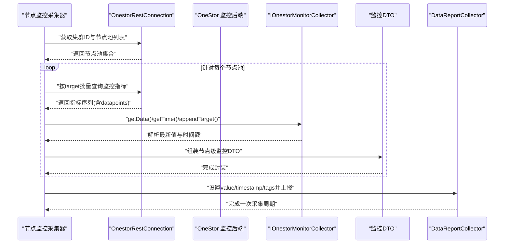
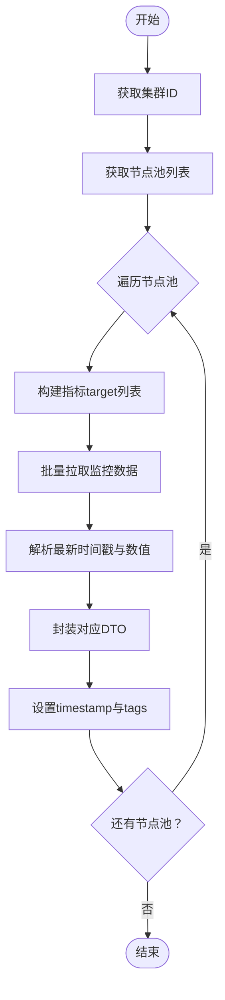
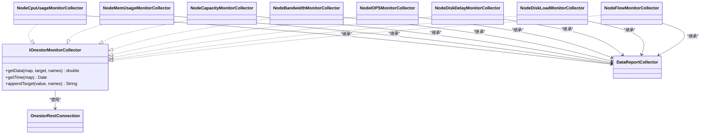

# 节点监控

<cite>
**本文引用的文件**
- [NodeCpuUsageMonitorCollector.java](file://watcher-onestor/src/main/java/com/virtual/cloud/om/onestor/service/report/monitor/node/NodeCpuUsageMonitorCollector.java)
- [NodeMemUsageMonitorCollector.java](file://watcher-onestor/src/main/java/com/virtual/cloud/om/onestor/service/report/monitor/node/NodeMemUsageMonitorCollector.java)
- [NodeCapacityMonitorCollector.java](file://watcher-onestor/src/main/java/com/virtual/cloud/om/onestor/service/report/monitor/node/NodeCapacityMonitorCollector.java)
- [NodeBandwidthMonitorCollector.java](file://watcher-onestor/src/main/java/com/virtual/cloud/om/onestor/service/report/monitor/node/NodeBandwidthMonitorCollector.java)
- [NodeIOPSMonitorCollector.java](file://watcher-onestor/src/main/java/com/virtual/cloud/om/onestor/service/report/monitor/node/NodeIOPSMonitorCollector.java)
- [NodeDiskDelayMonitorCollector.java](file://watcher-onestor/src/main/java/com/virtual/cloud/om/onestor/service/report/monitor/node/NodeDiskDelayMonitorCollector.java)
- [NodeDiskLoadMonitorCollector.java](file://watcher-onestor/src/main/java/com/virtual/cloud/om/onestor/service/report/monitor/node/NodeDiskLoadMonitorCollector.java)
- [NodeFlowMonitorCollector.java](file://watcher-onestor/src/main/java/com/virtual/cloud/om/onestor/service/report/monitor/node/NodeFlowMonitorCollector.java)
- [IOnestorMonitorCollector.java](file://watcher-onestor/src/main/java/com/virtual/cloud/om/onestor/service/report/monitor/IOnestorMonitorCollector.java)
- [OneStorNodePoolMonitorTargetEnum.java](file://watcher-sdk/src/main/java/com/virtual/cloud/om/sdk/constant/onestor/report/OneStorNodePoolMonitorTargetEnum.java)
- [DataReportTypeByMetricEnum.java](file://watcher-sdk/src/main/java/com/virtual/cloud/om/sdk/constant/DataReportTypeByMetricEnum.java)
- [OnestoreUriConstants.java](file://watcher-sdk/src/main/java/com/virtual/cloud/om/sdk/constant/uri/OnestoreUriConstants.java)
- [OnestorRestConnection.java](file://watcher-sdk/src/main/java/com/virtual/cloud/om/sdk/config/token/onestor/OnestorRestConnection.java)
- [DataReportCollector.java](file://watcher-sdk/src/main/java/com/virtual/cloud/om/sdk/api/DataReportCollector.java)
- [OneStorNodeCapacityMonitorReportDTO.java](file://watcher-sdk/src/main/java/com/virtual/cloud/om/sdk/dto/dataReport/onestor/monitor/node/OneStorNodeCapacityMonitorReportDTO.java)
- [OneStorNodeMemDTO.java](file://watcher-sdk/src/main/java/com/virtual/cloud/om/sdk/dto/dataReport/onestor/monitor/node/OneStorNodeMemDTO.java)
- [OneStorNodeBandwidthMonitorReportDTO.java](file://watcher-sdk/src/main/java/com/virtual/cloud/om/sdk/dto/dataReport/onestor/monitor/node/OneStorNodeBandwidthMonitorReportDTO.java)
- [OneStorNodeIOPSMonitorReportDTO.java](file://watcher-sdk/src/main/java/com/virtual/cloud/om/sdk/dto/dataReport/onestor/monitor/node/OneStorNodeIOPSMonitorReportDTO.java)
- [OneStorDiskDelayMonitorReportDTO.java](file://watcher-sdk/src/main/java/com/virtual/cloud/om/sdk/dto/dataReport/onestor/monitor/node/OneStorDiskDelayMonitorReportDTO.java)
- [OneStorNodeDiskLoadMonitorReportDTO.java](file://watcher-sdk/src/main/java/com/virtual/cloud/om/sdk/dto/dataReport/onestor/monitor/node/OneStorNodeDiskLoadMonitorReportDTO.java)
- [OneStorNodeFlowMonitorReportDTO.java](file://watcher-sdk/src/main/java/com/virtual/cloud/om/sdk/dto/dataReport/onestor/monitor/node/OneStorNodeFlowMonitorReportDTO.java)
</cite>

## 目录
1. [简介](#简介)
2. [项目结构](#项目结构)
3. [核心组件](#核心组件)
4. [架构总览](#架构总览)
5. [详细组件分析](#详细组件分析)
6. [依赖分析](#依赖分析)
7. [性能考虑](#性能考虑)
8. [故障排查指南](#故障排查指南)
9. [结论](#结论)
10. [附录](#附录)

## 简介
本技术文档围绕 OneStor 存储系统中的“节点监控”能力展开，系统性梳理了节点 CPU 使用率、内存使用率、容量、带宽、IOPS、磁盘延迟、磁盘负载与网络流量等八类监控指标的数据采集与上报流程。文档从设计思路、数据采集链路、性能指标解析方法、REST API 获取方式、节点间对比与资源分配分析、节点标识管理、监控数据聚合算法以及异常告警机制等方面进行深入说明，并给出配置参数、性能优化策略与故障诊断方法，帮助读者快速理解并高效运维。

## 项目结构
节点监控相关代码位于 watcher-onestor 模块下的 report/monitor/node 包中，统一继承自 SDK 的 DataReportCollector 抽象类并通过 OnestorRestConnection 访问 OneStor 监控后端，最终以 JSON 结构封装指标并上报。公共逻辑抽取在 IOnestorMonitorCollector 接口中，便于各监控采集器复用。

```mermaid
graph TB
subgraph "节点监控采集层"
NCU["NodeCpuUsageMonitorCollector"]
NME["NodeMemUsageMonitorCollector"]
NCA["NodeCapacityMonitorCollector"]
NBD["NodeBandwidthMonitorCollector"]
NOI["NodeIOPSMonitorCollector"]
NDD["NodeDiskDelayMonitorCollector"]
NDL["NodeDiskLoadMonitorCollector"]
NFL["NodeFlowMonitorCollector"]
end
subgraph "公共接口与工具"
IOC["IOnestorMonitorCollector"]
DRC["DataReportCollector"]
ORC["OnestorRestConnection"]
end
subgraph "SDK 常量与DTO"
TGT["OneStorNodePoolMonitorTargetEnum"]
MTYPE["DataReportTypeByMetricEnum"]
URI["OnestoreUriConstants"]
DTO1["OneStorNodeCapacityMonitorReportDTO"]
DTO2["OneStorNodeMemDTO"]
DTO3["OneStorNodeBandwidthMonitorReportDTO"]
DTO4["OneStorNodeIOPSMonitorReportDTO"]
DTO5["OneStorDiskDelayMonitorReportDTO"]
DTO6["OneStorNodeDiskLoadMonitorReportDTO"]
DTO7["OneStorNodeFlowMonitorReportDTO"]
end
NCU --> IOC
NME --> IOC
NCA --> IOC
NBD --> IOC
NOI --> IOC
NDD --> IOC
NDL --> IOC
NFL --> IOC
NCU --> DRC
NME --> DRC
NCA --> DRC
NBD --> DRC
NOI --> DRC
NDD --> DRC
NDL --> DRC
NFL --> DRC
IOC --> ORC
IOC --> TGT
IOC --> URI
IOC --> MTYPE
NCU --> DTO1
NME --> DTO2
NCA --> DTO1
NBD --> DTO3
NOI --> DTO4
NDD --> DTO5
NDL --> DTO6
NFL --> DTO7
```

图表来源
- [NodeCpuUsageMonitorCollector.java:33-79](file://watcher-onestor/src/main/java/com/virtual/cloud/om/onestor/service/report/monitor/node/NodeCpuUsageMonitorCollector.java#L33-L79)
- [NodeMemUsageMonitorCollector.java:35-79](file://watcher-onestor/src/main/java/com/virtual/cloud/om/onestor/service/report/monitor/node/NodeMemUsageMonitorCollector.java#L35-L79)
- [NodeCapacityMonitorCollector.java:33-78](file://watcher-onestor/src/main/java/com/virtual/cloud/om/onestor/service/report/monitor/node/NodeCapacityMonitorCollector.java#L33-L78)
- [NodeBandwidthMonitorCollector.java:35-92](file://watcher-onestor/src/main/java/com/virtual/cloud/om/onestor/service/report/monitor/node/NodeBandwidthMonitorCollector.java#L35-L92)
- [NodeIOPSMonitorCollector.java:35-90](file://watcher-onestor/src/main/java/com/virtual/cloud/om/onestor/service/report/monitor/node/NodeIOPSMonitorCollector.java#L35-L90)
- [NodeDiskDelayMonitorCollector.java:33-78](file://watcher-onestor/src/main/java/com/virtual/cloud/om/onestor/service/report/monitor/node/NodeDiskDelayMonitorCollector.java#L33-L78)
- [NodeDiskLoadMonitorCollector.java:33-78](file://watcher-onestor/src/main/java/com/virtual/cloud/om/onestor/service/report/monitor/node/NodeDiskLoadMonitorCollector.java#L33-L78)
- [NodeFlowMonitorCollector.java:33-84](file://watcher-onestor/src/main/java/com/virtual/cloud/om/onestor/service/report/monitor/node/NodeFlowMonitorCollector.java#L33-L84)
- [IOnestorMonitorCollector.java:16-53](file://watcher-onestor/src/main/java/com/virtual/cloud/om/onestor/service/report/monitor/IOnestorMonitorCollector.java#L16-L53)
- [DataReportCollector.java](file://watcher-sdk/src/main/java/com/virtual/cloud/om/sdk/api/DataReportCollector.java)
- [OnestorRestConnection.java](file://watcher-sdk/src/main/java/com/virtual/cloud/om/sdk/config/token/onestor/OnestorRestConnection.java)
- [OneStorNodePoolMonitorTargetEnum.java](file://watcher-sdk/src/main/java/com/virtual/cloud/om/sdk/constant/onestor/report/OneStorNodePoolMonitorTargetEnum.java)
- [DataReportTypeByMetricEnum.java](file://watcher-sdk/src/main/java/com/virtual/cloud/om/sdk/constant/DataReportTypeByMetricEnum.java)
- [OnestoreUriConstants.java](file://watcher-sdk/src/main/java/com/virtual/cloud/om/sdk/constant/uri/OnestoreUriConstants.java)

章节来源
- [NodeCpuUsageMonitorCollector.java:1-80](file://watcher-onestor/src/main/java/com/virtual/cloud/om/onestor/service/report/monitor/node/NodeCpuUsageMonitorCollector.java#L1-L80)
- [NodeMemUsageMonitorCollector.java:1-80](file://watcher-onestor/src/main/java/com/virtual/cloud/om/onestor/service/report/monitor/node/NodeMemUsageMonitorCollector.java#L1-L80)
- [NodeCapacityMonitorCollector.java:1-79](file://watcher-onestor/src/main/java/com/virtual/cloud/om/onestor/service/report/monitor/node/NodeCapacityMonitorCollector.java#L1-L79)
- [NodeBandwidthMonitorCollector.java:1-93](file://watcher-onestor/src/main/java/com/virtual/cloud/om/onestor/service/report/monitor/node/NodeBandwidthMonitorCollector.java#L1-L93)
- [NodeIOPSMonitorCollector.java:1-91](file://watcher-onestor/src/main/java/com/virtual/cloud/om/onestor/service/report/monitor/node/NodeIOPSMonitorCollector.java#L1-L91)
- [NodeDiskDelayMonitorCollector.java:1-79](file://watcher-onestor/src/main/java/com/virtual/cloud/om/onestor/service/report/monitor/node/NodeDiskDelayMonitorCollector.java#L1-L79)
- [NodeDiskLoadMonitorCollector.java:1-79](file://watcher-onestor/src/main/java/com/virtual/cloud/om/onestor/service/report/monitor/node/NodeDiskLoadMonitorCollector.java#L1-L79)
- [NodeFlowMonitorCollector.java:1-85](file://watcher-onestor/src/main/java/com/virtual/cloud/om/onestor/service/report/monitor/node/NodeFlowMonitorCollector.java#L1-L85)
- [IOnestorMonitorCollector.java:1-54](file://watcher-onestor/src/main/java/com/virtual/cloud/om/onestor/service/report/monitor/IOnestorMonitorCollector.java#L1-L54)

## 核心组件
- 统一抽象基类：DataReportCollector，负责通用的采集生命周期与上报框架。
- 节点监控采集器：八类节点级监控采集器分别面向 CPU 使用率、内存使用率、容量、带宽、IOPS、磁盘延迟、磁盘负载与网络流量。
- 公共接口：IOnestorMonitorCollector，提供数据提取、时间戳解析与 target 参数拼接的通用方法。
- 连接与常量：OnestorRestConnection 提供 REST 访问；OneStorNodePoolMonitorTargetEnum、OnestoreUriConstants、DataReportTypeByMetricEnum 提供监控目标、URI 与指标类型枚举。

章节来源
- [DataReportCollector.java](file://watcher-sdk/src/main/java/com/virtual/cloud/om/sdk/api/DataReportCollector.java)
- [IOnestorMonitorCollector.java:16-53](file://watcher-onestor/src/main/java/com/virtual/cloud/om/onestor/service/report/monitor/IOnestorMonitorCollector.java#L16-L53)
- [OnestorRestConnection.java](file://watcher-sdk/src/main/java/com/virtual/cloud/om/sdk/config/token/onestor/OnestorRestConnection.java)
- [OneStorNodePoolMonitorTargetEnum.java](file://watcher-sdk/src/main/java/com/virtual/cloud/om/sdk/constant/onestor/report/OneStorNodePoolMonitorTargetEnum.java)
- [OnestoreUriConstants.java](file://watcher-sdk/src/main/java/com/virtual/cloud/om/sdk/constant/uri/OnestoreUriConstants.java)
- [DataReportTypeByMetricEnum.java](file://watcher-sdk/src/main/java/com/virtual/cloud/om/sdk/constant/DataReportTypeByMetricEnum.java)

## 架构总览
下图展示了节点监控从采集到上报的整体流程：采集器通过 OnestorRestConnection 访问 OneStor 监控后端，按节点池维度拉取多指标 target，解析最新时间戳与数值，封装为对应 DTO 并以 JSON 形式上报。

图表来源
- [NodeCpuUsageMonitorCollector.java:36-66](file://watcher-onestor/src/main/java/com/virtual/cloud/om/onestor/service/report/monitor/node/NodeCpuUsageMonitorCollector.java#L36-L66)
- [NodeMemUsageMonitorCollector.java:38-66](file://watcher-onestor/src/main/java/com/virtual/cloud/om/onestor/service/report/monitor/node/NodeMemUsageMonitorCollector.java#L38-L66)
- [NodeCapacityMonitorCollector.java:36-65](file://watcher-onestor/src/main/java/com/virtual/cloud/om/onestor/service/report/monitor/node/NodeCapacityMonitorCollector.java#L36-L65)
- [NodeBandwidthMonitorCollector.java:38-78](file://watcher-onestor/src/main/java/com/virtual/cloud/om/onestor/service/report/monitor/node/NodeBandwidthMonitorCollector.java#L38-L78)
- [NodeIOPSMonitorCollector.java:38-77](file://watcher-onestor/src/main/java/com/virtual/cloud/om/onestor/service/report/monitor/node/NodeIOPSMonitorCollector.java#L38-L77)
- [NodeDiskDelayMonitorCollector.java:36-65](file://watcher-onestor/src/main/java/com/virtual/cloud/om/onestor/service/report/monitor/node/NodeDiskDelayMonitorCollector.java#L36-L65)
- [NodeDiskLoadMonitorCollector.java:36-65](file://watcher-onestor/src/main/java/com/virtual/cloud/om/onestor/service/report/monitor/node/NodeDiskLoadMonitorCollector.java#L36-L65)
- [NodeFlowMonitorCollector.java:36-71](file://watcher-onestor/src/main/java/com/virtual/cloud/om/onestor/service/report/monitor/node/NodeFlowMonitorCollector.java#L36-L71)
- [IOnestorMonitorCollector.java:20-52](file://watcher-onestor/src/main/java/com/virtual/cloud/om/onestor/service/report/monitor/IOnestorMonitorCollector.java#L20-L52)
- [OnestorRestConnection.java](file://watcher-sdk/src/main/java/com/virtual/cloud/om/sdk/config/token/onestor/OnestorRestConnection.java)
- [DataReportCollector.java](file://watcher-sdk/src/main/java/com/virtual/cloud/om/sdk/api/DataReportCollector.java)

## 详细组件分析

### 设计思路与职责划分
- 统一入口：所有节点监控采集器均实现 IOnestorMonitorCollector，共享数据解析与 target 拼接逻辑，降低重复代码。
- 聚焦节点池：采集器先获取节点池列表，再针对每个节点池按需拉取所需指标，确保按节点维度聚合。
- 指标封装：每类采集器封装专用 DTO，保证上报数据结构一致且语义清晰。
- 上报格式：统一以 JSON 结构封装，携带时间戳与标签，便于下游消费与可视化。

章节来源
- [IOnestorMonitorCollector.java:16-53](file://watcher-onestor/src/main/java/com/virtual/cloud/om/onestor/service/report/monitor/IOnestorMonitorCollector.java#L16-L53)
- [NodeCpuUsageMonitorCollector.java:33-79](file://watcher-onestor/src/main/java/com/virtual/cloud/om/onestor/service/report/monitor/node/NodeCpuUsageMonitorCollector.java#L33-L79)
- [NodeMemUsageMonitorCollector.java:35-79](file://watcher-onestor/src/main/java/com/virtual/cloud/om/onestor/service/report/monitor/node/NodeMemUsageMonitorCollector.java#L35-L79)
- [NodeCapacityMonitorCollector.java:33-78](file://watcher-onestor/src/main/java/com/virtual/cloud/om/onestor/service/report/monitor/node/NodeCapacityMonitorCollector.java#L33-L78)
- [NodeBandwidthMonitorCollector.java:35-92](file://watcher-onestor/src/main/java/com/virtual/cloud/om/onestor/service/report/monitor/node/NodeBandwidthMonitorCollector.java#L35-L92)
- [NodeIOPSMonitorCollector.java:35-90](file://watcher-onestor/src/main/java/com/virtual/cloud/om/onestor/service/report/monitor/node/NodeIOPSMonitorCollector.java#L35-L90)
- [NodeDiskDelayMonitorCollector.java:33-78](file://watcher-onestor/src/main/java/com/virtual/cloud/om/onestor/service/report/monitor/node/NodeDiskDelayMonitorCollector.java#L33-L78)
- [NodeDiskLoadMonitorCollector.java:33-78](file://watcher-onestor/src/main/java/com/virtual/cloud/om/onestor/service/report/monitor/node/NodeDiskLoadMonitorCollector.java#L33-L78)
- [NodeFlowMonitorCollector.java:33-84](file://watcher-onestor/src/main/java/com/virtual/cloud/om/onestor/service/report/monitor/node/NodeFlowMonitorCollector.java#L33-L84)

### 数据采集流程与性能指标解析
- 步骤一：获取集群 ID 与节点池列表。
- 步骤二：针对每个节点池，构造多个 target 并一次性批量查询，减少往返次数。
- 步骤三：解析最新时间戳与数值，若无数据则返回默认值。
- 步骤四：按指标类型封装 DTO 并设置时间戳与标签，统一上报。

图表来源
- [NodeCpuUsageMonitorCollector.java:36-66](file://watcher-onestor/src/main/java/com/virtual/cloud/om/onestor/service/report/monitor/node/NodeCpuUsageMonitorCollector.java#L36-L66)
- [NodeMemUsageMonitorCollector.java:38-66](file://watcher-onestor/src/main/java/com/virtual/cloud/om/onestor/service/report/monitor/node/NodeMemUsageMonitorCollector.java#L38-L66)
- [NodeCapacityMonitorCollector.java:36-65](file://watcher-onestor/src/main/java/com/virtual/cloud/om/onestor/service/report/monitor/node/NodeCapacityMonitorCollector.java#L36-L65)
- [NodeBandwidthMonitorCollector.java:38-78](file://watcher-onestor/src/main/java/com/virtual/cloud/om/onestor/service/report/monitor/node/NodeBandwidthMonitorCollector.java#L38-L78)
- [NodeIOPSMonitorCollector.java:38-77](file://watcher-onestor/src/main/java/com/virtual/cloud/om/onestor/service/report/monitor/node/NodeIOPSMonitorCollector.java#L38-L77)
- [NodeDiskDelayMonitorCollector.java:36-65](file://watcher-onestor/src/main/java/com/virtual/cloud/om/onestor/service/report/monitor/node/NodeDiskDelayMonitorCollector.java#L36-L65)
- [NodeDiskLoadMonitorCollector.java:36-65](file://watcher-onestor/src/main/java/com/virtual/cloud/om/onestor/service/report/monitor/node/NodeDiskLoadMonitorCollector.java#L36-L65)
- [NodeFlowMonitorCollector.java:36-71](file://watcher-onestor/src/main/java/com/virtual/cloud/om/onestor/service/report/monitor/node/NodeFlowMonitorCollector.java#L36-L71)
- [IOnestorMonitorCollector.java:20-52](file://watcher-onestor/src/main/java/com/virtual/cloud/om/onestor/service/report/monitor/IOnestorMonitorCollector.java#L20-L52)

章节来源
- [IOnestorMonitorCollector.java:20-52](file://watcher-onestor/src/main/java/com/virtual/cloud/om/onestor/service/report/monitor/IOnestorMonitorCollector.java#L20-L52)

### 节点标识管理
- 节点池维度：采集器以节点池名称作为关键标识，贯穿 target 拼接、数据解析与 DTO 字段。
- 时间戳一致性：通过解析各指标 datapoints 中的最新时间戳，确保同一上报批次内时间对齐。
- 标签透传：tags 参数用于区分环境、集群或业务域，便于后续筛选与聚合。

章节来源
- [NodeCpuUsageMonitorCollector.java:44-63](file://watcher-onestor/src/main/java/com/virtual/cloud/om/onestor/service/report/monitor/node/NodeCpuUsageMonitorCollector.java#L44-L63)
- [NodeMemUsageMonitorCollector.java:46-63](file://watcher-onestor/src/main/java/com/virtual/cloud/om/onestor/service/report/monitor/node/NodeMemUsageMonitorCollector.java#L46-L63)
- [NodeCapacityMonitorCollector.java:44-62](file://watcher-onestor/src/main/java/com/virtual/cloud/om/onestor/service/report/monitor/node/NodeCapacityMonitorCollector.java#L44-L62)
- [NodeBandwidthMonitorCollector.java:46-75](file://watcher-onestor/src/main/java/com/virtual/cloud/om/onestor/service/report/monitor/node/NodeBandwidthMonitorCollector.java#L46-L75)
- [NodeIOPSMonitorCollector.java:46-74](file://watcher-onestor/src/main/java/com/virtual/cloud/om/onestor/service/report/monitor/node/NodeIOPSMonitorCollector.java#L46-L74)
- [NodeDiskDelayMonitorCollector.java:44-61](file://watcher-onestor/src/main/java/com/virtual/cloud/om/onestor/service/report/monitor/node/NodeDiskDelayMonitorCollector.java#L44-L61)
- [NodeDiskLoadMonitorCollector.java:44-61](file://watcher-onestor/src/main/java/com/virtual/cloud/om/onestor/service/report/monitor/node/NodeDiskLoadMonitorCollector.java#L44-L61)
- [NodeFlowMonitorCollector.java:44-68](file://watcher-onestor/src/main/java/com/virtual/cloud/om/onestor/service/report/monitor/node/NodeFlowMonitorCollector.java#L44-L68)
- [IOnestorMonitorCollector.java:32-47](file://watcher-onestor/src/main/java/com/virtual/cloud/om/onestor/service/report/monitor/IOnestorMonitorCollector.java#L32-L47)

### 性能指标解析方法
- CPU 使用率：基于节点池维度的 CPU 使用比例，结合 total/used 容量计算资源占用。
- 内存使用率：基于节点池维度的内存使用比例。
- 容量：包含 total 与 used，支持节点池容量趋势分析。
- 带宽：包含存储读写与恢复带宽、文件系统读写带宽及节点池/文件系统总量。
- IOPS：包含存储读写、恢复与节点池/文件系统总量。
- 磁盘延迟：包含读写延迟指标。
- 磁盘负载：包含平均与最大 util 指标。
- 流量：包含存储与文件系统的读写与恢复流量。

章节来源
- [NodeCpuUsageMonitorCollector.java:53-59](file://watcher-onestor/src/main/java/com/virtual/cloud/om/onestor/service/report/monitor/node/NodeCpuUsageMonitorCollector.java#L53-L59)
- [NodeMemUsageMonitorCollector.java:56-59](file://watcher-onestor/src/main/java/com/virtual/cloud/om/onestor/service/report/monitor/node/NodeMemUsageMonitorCollector.java#L56-L59)
- [NodeCapacityMonitorCollector.java:53-58](file://watcher-onestor/src/main/java/com/virtual/cloud/om/onestor/service/report/monitor/node/NodeCapacityMonitorCollector.java#L53-L58)
- [NodeBandwidthMonitorCollector.java:61-71](file://watcher-onestor/src/main/java/com/virtual/cloud/om/onestor/service/report/monitor/node/NodeBandwidthMonitorCollector.java#L61-L71)
- [NodeIOPSMonitorCollector.java:60-70](file://watcher-onestor/src/main/java/com/virtual/cloud/om/onestor/service/report/monitor/node/NodeIOPSMonitorCollector.java#L60-L70)
- [NodeDiskDelayMonitorCollector.java:53-58](file://watcher-onestor/src/main/java/com/virtual/cloud/om/onestor/service/report/monitor/node/NodeDiskDelayMonitorCollector.java#L53-L58)
- [NodeDiskLoadMonitorCollector.java:53-58](file://watcher-onestor/src/main/java/com/virtual/cloud/om/onestor/service/report/monitor/node/NodeDiskLoadMonitorCollector.java#L53-L58)
- [NodeFlowMonitorCollector.java:56-64](file://watcher-onestor/src/main/java/com/virtual/cloud/om/onestor/service/report/monitor/node/NodeFlowMonitorCollector.java#L56-L64)

### REST API 获取节点级别监控数据
- 基础路径：通过 OnestoreUriConstants 中的节点池基础信息与监控查询 URI 拼装。
- 查询方式：按节点池名称拼接 target，支持批量查询多个指标，减少请求次数。
- 返回结构：OneStorRestResult 包含监控序列，采集器解析最新值与时间戳。
- 指标类型：由 DataReportTypeByMetricEnum 标识，上报时统一为 JSON。

章节来源
- [OnestoreUriConstants.java](file://watcher-sdk/src/main/java/com/virtual/cloud/om/sdk/constant/uri/OnestoreUriConstants.java)
- [DataReportTypeByMetricEnum.java](file://watcher-sdk/src/main/java/com/virtual/cloud/om/sdk/constant/DataReportTypeByMetricEnum.java)
- [OnestorRestConnection.java](file://watcher-sdk/src/main/java/com/virtual/cloud/om/sdk/config/token/onestor/OnestorRestConnection.java)
- [NodeCpuUsageMonitorCollector.java:39-51](file://watcher-onestor/src/main/java/com/virtual/cloud/om/onestor/service/report/monitor/node/NodeCpuUsageMonitorCollector.java#L39-L51)
- [NodeMemUsageMonitorCollector.java:41-54](file://watcher-onestor/src/main/java/com/virtual/cloud/om/onestor/service/report/monitor/node/NodeMemUsageMonitorCollector.java#L41-L54)
- [NodeCapacityMonitorCollector.java:39-51](file://watcher-onestor/src/main/java/com/virtual/cloud/om/onestor/service/report/monitor/node/NodeCapacityMonitorCollector.java#L39-L51)
- [NodeBandwidthMonitorCollector.java:48-59](file://watcher-onestor/src/main/java/com/virtual/cloud/om/onestor/service/report/monitor/node/NodeBandwidthMonitorCollector.java#L48-L59)
- [NodeIOPSMonitorCollector.java:48-58](file://watcher-onestor/src/main/java/com/virtual/cloud/om/onestor/service/report/monitor/node/NodeIOPSMonitorCollector.java#L48-L58)
- [NodeDiskDelayMonitorCollector.java:46-52](file://watcher-onestor/src/main/java/com/virtual/cloud/om/onestor/service/report/monitor/node/NodeDiskDelayMonitorCollector.java#L46-L52)
- [NodeDiskLoadMonitorCollector.java:46-52](file://watcher-onestor/src/main/java/com/virtual/cloud/om/onestor/service/report/monitor/node/NodeDiskLoadMonitorCollector.java#L46-L52)
- [NodeFlowMonitorCollector.java:46-54](file://watcher-onestor/src/main/java/com/virtual/cloud/om/onestor/service/report/monitor/node/NodeFlowMonitorCollector.java#L46-L54)

### 节点间性能对比与资源分配
- 对比维度：同一时间窗口内，按节点池维度对比 CPU 使用率、内存使用率、带宽/IOPS、磁盘延迟与负载等指标。
- 资源分配：结合容量 total/used 与带宽/IOPS 总量，评估节点池资源是否饱和，辅助调度与扩容决策。
- 聚合策略：建议按节点池维度进行算术平均或加权平均，关注峰值与尾部延迟，避免单点过载。

章节来源
- [NodeCpuUsageMonitorCollector.java:53-59](file://watcher-onestor/src/main/java/com/virtual/cloud/om/onestor/service/report/monitor/node/NodeCpuUsageMonitorCollector.java#L53-L59)
- [NodeMemUsageMonitorCollector.java:56-59](file://watcher-onestor/src/main/java/com/virtual/cloud/om/onestor/service/report/monitor/node/NodeMemUsageMonitorCollector.java#L56-L59)
- [NodeCapacityMonitorCollector.java:53-58](file://watcher-onestor/src/main/java/com/virtual/cloud/om/onestor/service/report/monitor/node/NodeCapacityMonitorCollector.java#L53-L58)
- [NodeBandwidthMonitorCollector.java:61-71](file://watcher-onestor/src/main/java/com/virtual/cloud/om/onestor/service/report/monitor/node/NodeBandwidthMonitorCollector.java#L61-L71)
- [NodeIOPSMonitorCollector.java:60-70](file://watcher-onestor/src/main/java/com/virtual/cloud/om/onestor/service/report/monitor/node/NodeIOPSMonitorCollector.java#L60-L70)
- [NodeDiskDelayMonitorCollector.java:53-58](file://watcher-onestor/src/main/java/com/virtual/cloud/om/onestor/service/report/monitor/node/NodeDiskDelayMonitorCollector.java#L53-L58)
- [NodeDiskLoadMonitorCollector.java:53-58](file://watcher-onestor/src/main/java/com/virtual/cloud/om/onestor/service/report/monitor/node/NodeDiskLoadMonitorCollector.java#L53-L58)
- [NodeFlowMonitorCollector.java:56-64](file://watcher-onestor/src/main/java/com/virtual/cloud/om/onestor/service/report/monitor/node/NodeFlowMonitorCollector.java#L56-L64)

### 异常告警机制
- 数据缺失：当某指标无 datapoints 或长度不足时，采集器返回默认值，避免空指针；可在上层策略中触发告警。
- 时间戳不一致：优先选择最长序列的时间戳作为基准，确保跨指标对齐；若序列为空，则回退当前时间。
- 告警阈值：建议基于历史分位数设定阈值，如 CPU 使用率超过阈值持续一段时间触发预警；带宽/IOPS 突增可触发容量风险告警。

章节来源
- [IOnestorMonitorCollector.java:20-47](file://watcher-onestor/src/main/java/com/virtual/cloud/om/onestor/service/report/monitor/IOnestorMonitorCollector.java#L20-L47)

### 配置参数与运行参数
- 连接参数：host、protocol、port、username、password 由 OnestorRestConnection 统一封装。
- 指标类型：由 DataReportTypeByMetricEnum 标识，决定上报通道与消费端处理逻辑。
- 标签参数：tags 用于区分环境、集群或业务域，便于多维分析。
- 批量查询：通过 appendTarget 拼接多个 target，减少请求次数，提升吞吐。

章节来源
- [OnestorRestConnection.java](file://watcher-sdk/src/main/java/com/virtual/cloud/om/sdk/config/token/onestor/OnestorRestConnection.java)
- [DataReportTypeByMetricEnum.java](file://watcher-sdk/src/main/java/com/virtual/cloud/om/sdk/constant/DataReportTypeByMetricEnum.java)
- [IOnestorMonitorCollector.java:48-52](file://watcher-onestor/src/main/java/com/virtual/cloud/om/onestor/service/report/monitor/IOnestorMonitorCollector.java#L48-L52)

### 性能优化策略
- 批量查询：每个节点池仅发起一次批量请求，合并多个 target，显著降低 RTT。
- 并行处理：对节点池列表采用并行流处理，充分利用多核 CPU。
- 缓存与去重：对相同 target 的查询结果进行缓存，避免重复拉取；对空序列进行快速失败。
- 合理采样：根据业务需求调整采集频率，避免高并发场景下对 OneStor 后端造成压力。

章节来源
- [NodeCpuUsageMonitorCollector.java:44-66](file://watcher-onestor/src/main/java/com/virtual/cloud/om/onestor/service/report/monitor/node/NodeCpuUsageMonitorCollector.java#L44-L66)
- [NodeMemUsageMonitorCollector.java:46-66](file://watcher-onestor/src/main/java/com/virtual/cloud/om/onestor/service/report/monitor/node/NodeMemUsageMonitorCollector.java#L46-L66)
- [NodeCapacityMonitorCollector.java:44-65](file://watcher-onestor/src/main/java/com/virtual/cloud/om/onestor/service/report/monitor/node/NodeCapacityMonitorCollector.java#L44-L65)
- [NodeBandwidthMonitorCollector.java:46-78](file://watcher-onestor/src/main/java/com/virtual/cloud/om/onestor/service/report/monitor/node/NodeBandwidthMonitorCollector.java#L46-L78)
- [NodeIOPSMonitorCollector.java:46-77](file://watcher-onestor/src/main/java/com/virtual/cloud/om/onestor/service/report/monitor/node/NodeIOPSMonitorCollector.java#L46-L77)
- [NodeDiskDelayMonitorCollector.java:44-65](file://watcher-onestor/src/main/java/com/virtual/cloud/om/onestor/service/report/monitor/node/NodeDiskDelayMonitorCollector.java#L44-L65)
- [NodeDiskLoadMonitorCollector.java:44-65](file://watcher-onestor/src/main/java/com/virtual/cloud/om/onestor/service/report/monitor/node/NodeDiskLoadMonitorCollector.java#L44-L65)
- [NodeFlowMonitorCollector.java:44-71](file://watcher-onestor/src/main/java/com/virtual/cloud/om/onestor/service/report/monitor/node/NodeFlowMonitorCollector.java#L44-L71)

## 依赖分析
- 组件耦合：各采集器强依赖 OnestorRestConnection 与 IOnestorMonitorCollector，弱依赖 DTO 与枚举类，保持良好内聚与低耦合。
- 外部依赖：依赖 OneStor 监控后端提供的 target 体系与 datapoints 结构；依赖 SDK 的统一上报框架。
- 循环依赖：未发现循环依赖迹象，接口与实现分离清晰。

图表来源
- [IOnestorMonitorCollector.java:16-53](file://watcher-onestor/src/main/java/com/virtual/cloud/om/onestor/service/report/monitor/IOnestorMonitorCollector.java#L16-L53)
- [DataReportCollector.java](file://watcher-sdk/src/main/java/com/virtual/cloud/om/sdk/api/DataReportCollector.java)
- [OnestorRestConnection.java](file://watcher-sdk/src/main/java/com/virtual/cloud/om/sdk/config/token/onestor/OnestorRestConnection.java)
- [NodeCpuUsageMonitorCollector.java:33-79](file://watcher-onestor/src/main/java/com/virtual/cloud/om/onestor/service/report/monitor/node/NodeCpuUsageMonitorCollector.java#L33-L79)
- [NodeMemUsageMonitorCollector.java:35-79](file://watcher-onestor/src/main/java/com/virtual/cloud/om/onestor/service/report/monitor/node/NodeMemUsageMonitorCollector.java#L35-L79)
- [NodeCapacityMonitorCollector.java:33-78](file://watcher-onestor/src/main/java/com/virtual/cloud/om/onestor/service/report/monitor/node/NodeCapacityMonitorCollector.java#L33-L78)
- [NodeBandwidthMonitorCollector.java:35-92](file://watcher-onestor/src/main/java/com/virtual/cloud/om/onestor/service/report/monitor/node/NodeBandwidthMonitorCollector.java#L35-L92)
- [NodeIOPSMonitorCollector.java:35-90](file://watcher-onestor/src/main/java/com/virtual/cloud/om/onestor/service/report/monitor/node/NodeIOPSMonitorCollector.java#L35-L90)
- [NodeDiskDelayMonitorCollector.java:33-78](file://watcher-onestor/src/main/java/com/virtual/cloud/om/onestor/service/report/monitor/node/NodeDiskDelayMonitorCollector.java#L33-L78)
- [NodeDiskLoadMonitorCollector.java:33-78](file://watcher-onestor/src/main/java/com/virtual/cloud/om/onestor/service/report/monitor/node/NodeDiskLoadMonitorCollector.java#L33-L78)
- [NodeFlowMonitorCollector.java:33-84](file://watcher-onestor/src/main/java/com/virtual/cloud/om/onestor/service/report/monitor/node/NodeFlowMonitorCollector.java#L33-L84)

## 性能考虑
- 批量化与并行化：每个节点池一次批量请求，节点池列表并行处理，显著降低网络开销与处理时延。
- 数据对齐：优先选择最长序列的时间戳，确保跨指标时间对齐，避免因数据缺失导致的统计偏差。
- 默认值策略：当指标无数据时返回默认值，保障报表连续性，但应在上层策略中识别并告警。
- 采样频率：根据业务 SLA 调整采集周期，避免高频采集对 OneStor 后端造成压力。

章节来源
- [NodeCpuUsageMonitorCollector.java:44-66](file://watcher-onestor/src/main/java/com/virtual/cloud/om/onestor/service/report/monitor/node/NodeCpuUsageMonitorCollector.java#L44-L66)
- [NodeMemUsageMonitorCollector.java:46-66](file://watcher-onestor/src/main/java/com/virtual/cloud/om/onestor/service/report/monitor/node/NodeMemUsageMonitorCollector.java#L46-L66)
- [NodeCapacityMonitorCollector.java:44-65](file://watcher-onestor/src/main/java/com/virtual/cloud/om/onestor/service/report/monitor/node/NodeCapacityMonitorCollector.java#L44-L65)
- [NodeBandwidthMonitorCollector.java:46-78](file://watcher-onestor/src/main/java/com/virtual/cloud/om/onestor/service/report/monitor/node/NodeBandwidthMonitorCollector.java#L46-L78)
- [NodeIOPSMonitorCollector.java:46-77](file://watcher-onestor/src/main/java/com/virtual/cloud/om/onestor/service/report/monitor/node/NodeIOPSMonitorCollector.java#L46-L77)
- [NodeDiskDelayMonitorCollector.java:44-65](file://watcher-onestor/src/main/java/com/virtual/cloud/om/onestor/service/report/monitor/node/NodeDiskDelayMonitorCollector.java#L44-L65)
- [NodeDiskLoadMonitorCollector.java:44-65](file://watcher-onestor/src/main/java/com/virtual/cloud/om/onestor/service/report/monitor/node/NodeDiskLoadMonitorCollector.java#L44-L65)
- [NodeFlowMonitorCollector.java:44-71](file://watcher-onestor/src/main/java/com/virtual/cloud/om/onestor/service/report/monitor/node/NodeFlowMonitorCollector.java#L44-L71)
- [IOnestorMonitorCollector.java:32-47](file://watcher-onestor/src/main/java/com/virtual/cloud/om/onestor/service/report/monitor/IOnestorMonitorCollector.java#L32-L47)

## 故障排查指南
- 无法获取节点池列表：检查 OnestorRestConnection 的认证参数与集群 ID 获取逻辑；确认网络连通性与权限。
- 指标无数据：检查 target 拼接是否正确，确认 OneStor 后端是否存在该 target；查看默认值策略是否被误判为正常。
- 时间戳异常：确认各指标序列长度，优先选择最长序列；若均为空，检查 OneStor 后端时间同步。
- 上报失败：检查 DataReportCollector 的上报通道配置与标签参数；确认 DTO 结构与指标类型匹配。

章节来源
- [OnestorRestConnection.java](file://watcher-sdk/src/main/java/com/virtual/cloud/om/sdk/config/token/onestor/OnestorRestConnection.java)
- [IOnestorMonitorCollector.java:20-52](file://watcher-onestor/src/main/java/com/virtual/cloud/om/onestor/service/report/monitor/IOnestorMonitorCollector.java#L20-L52)
- [DataReportCollector.java](file://watcher-sdk/src/main/java/com/virtual/cloud/om/sdk/api/DataReportCollector.java)

## 结论
本文档系统梳理了 OneStor 节点监控的八类采集器实现、数据采集流程、指标解析方法与上报机制，给出了节点标识管理、性能对比与资源分配分析、异常告警与优化策略，并提供了 REST API 获取方式与故障排查建议。通过批量化、并行化与时间戳对齐等手段，可在保证准确性的同时提升整体性能，满足大规模节点池的监控需求。

## 附录
- 关键 DTO 类型（按指标类别）
  - 容量与CPU/内存：OneStorNodeCapacityMonitorReportDTO
  - 内存使用率：OneStorNodeMemDTO
  - 带宽：OneStorNodeBandwidthMonitorReportDTO
  - IOPS：OneStorNodeIOPSMonitorReportDTO
  - 磁盘延迟：OneStorDiskDelayMonitorReportDTO
  - 磁盘负载：OneStorNodeDiskLoadMonitorReportDTO
  - 流量：OneStorNodeFlowMonitorReportDTO

章节来源
- [OneStorNodeCapacityMonitorReportDTO.java](file://watcher-sdk/src/main/java/com/virtual/cloud/om/sdk/dto/dataReport/onestor/monitor/node/OneStorNodeCapacityMonitorReportDTO.java)
- [OneStorNodeMemDTO.java](file://watcher-sdk/src/main/java/com/virtual/cloud/om/sdk/dto/dataReport/onestor/monitor/node/OneStorNodeMemDTO.java)
- [OneStorNodeBandwidthMonitorReportDTO.java](file://watcher-sdk/src/main/java/com/virtual/cloud/om/sdk/dto/dataReport/onestor/monitor/node/OneStorNodeBandwidthMonitorReportDTO.java)
- [OneStorNodeIOPSMonitorReportDTO.java](file://watcher-sdk/src/main/java/com/virtual/cloud/om/sdk/dto/dataReport/onestor/monitor/node/OneStorNodeIOPSMonitorReportDTO.java)
- [OneStorDiskDelayMonitorReportDTO.java](file://watcher-sdk/src/main/java/com/virtual/cloud/om/sdk/dto/dataReport/onestor/monitor/node/OneStorDiskDelayMonitorReportDTO.java)
- [OneStorNodeDiskLoadMonitorReportDTO.java](file://watcher-sdk/src/main/java/com/virtual/cloud/om/sdk/dto/dataReport/onestor/monitor/node/OneStorNodeDiskLoadMonitorReportDTO.java)
- [OneStorNodeFlowMonitorReportDTO.java](file://watcher-sdk/src/main/java/com/virtual/cloud/om/sdk/dto/dataReport/onestor/monitor/node/OneStorNodeFlowMonitorReportDTO.java)