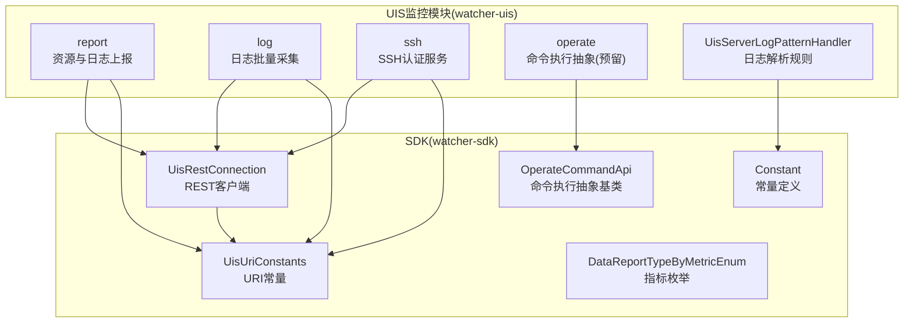
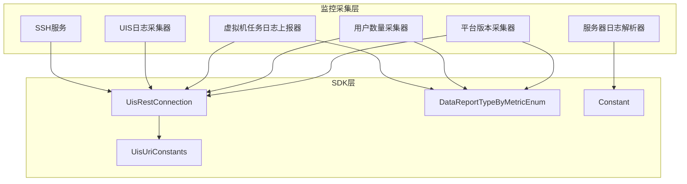
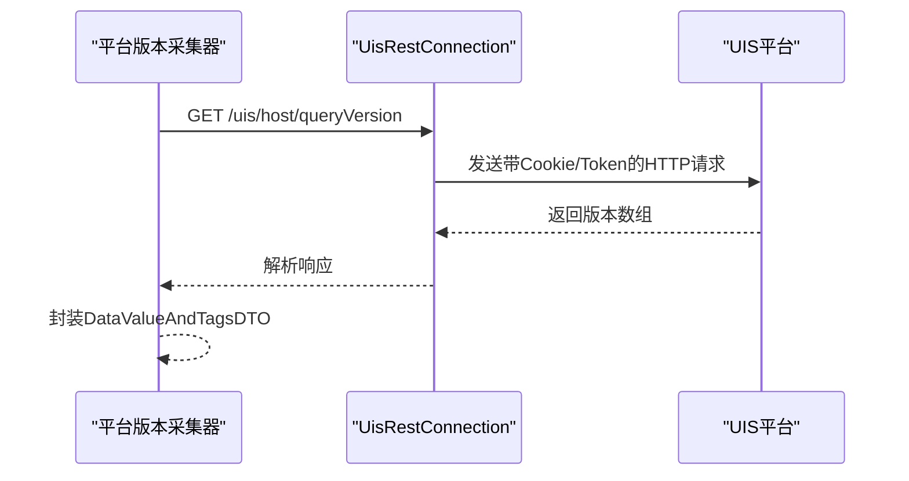
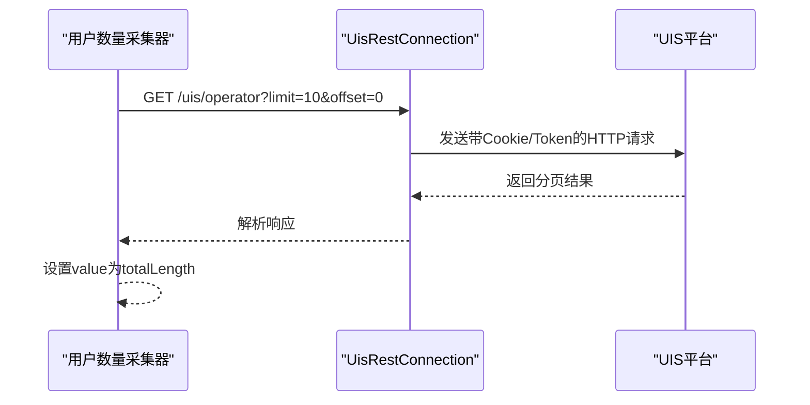
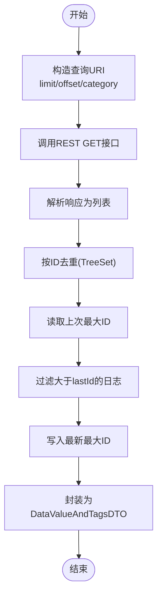
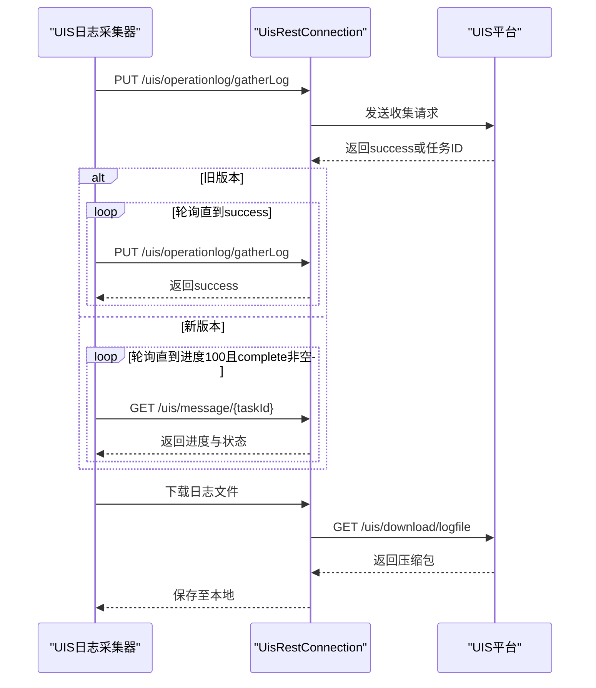
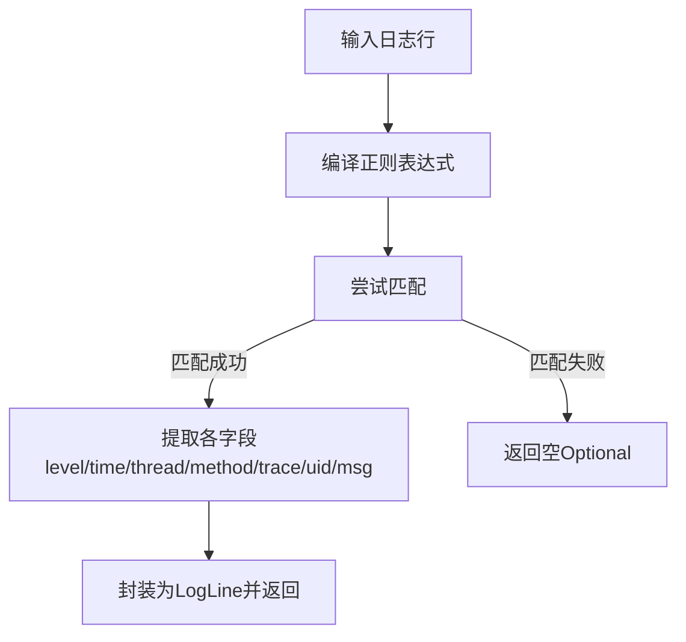
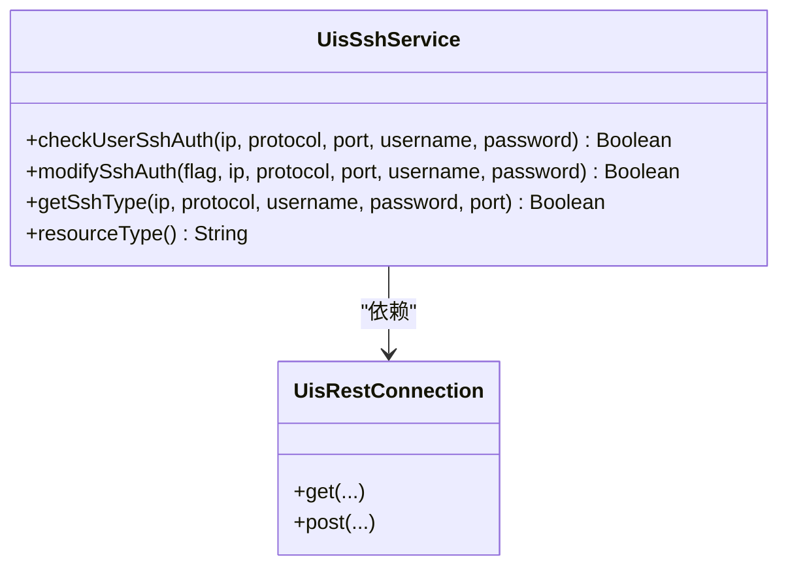
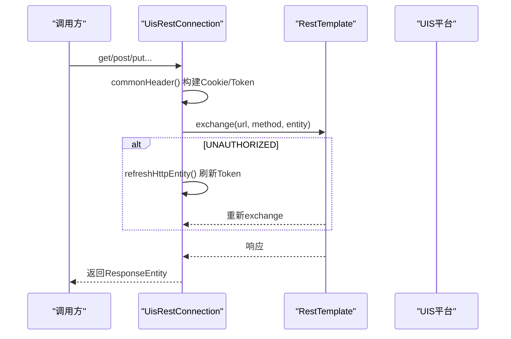
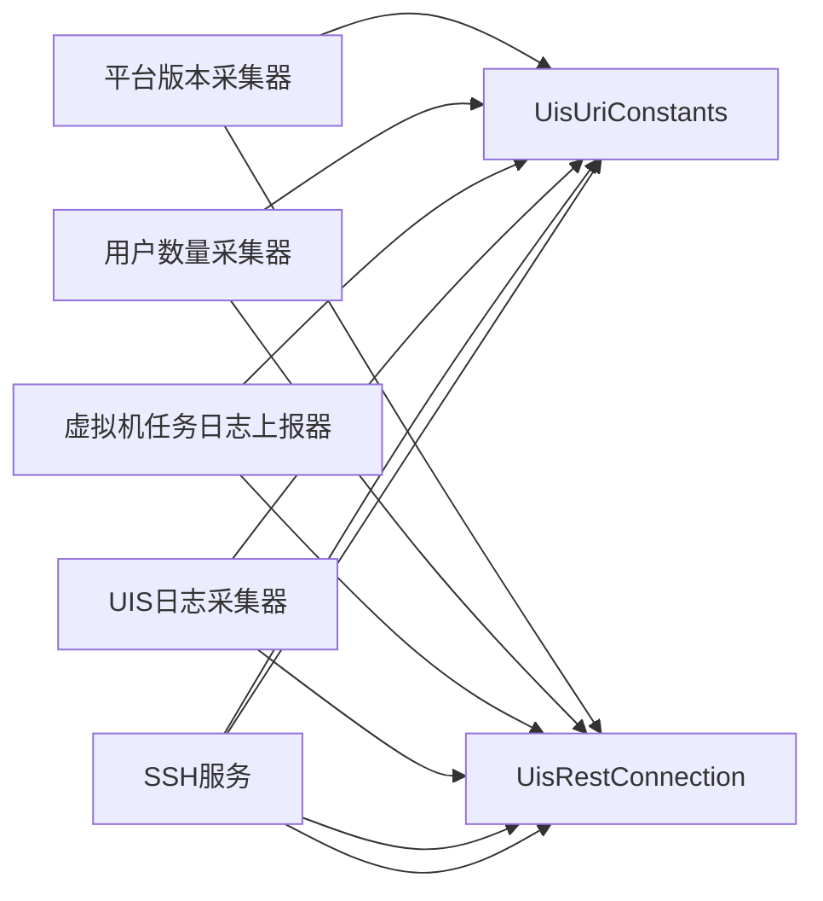

# UIS产品监控模块

<cite>
**本文引用的文件**
- [UisResourcePlatformVersionCollector.java](file://watcher-uis/src/main/java/com/virtual/cloud/om/uis/service/report/UisResourcePlatformVersionCollector.java)
- [UisResourceUserNumberCollector.java](file://watcher-uis/src/main/java/com/virtual/cloud/om/uis/service/report/UisResourceUserNumberCollector.java)
- [UisVmTaskLogReportCollector.java](file://watcher-uis/src/main/java/com/virtual/cloud/om/uis/service/report/UisVmTaskLogReportCollector.java)
- [UisLogCollector.java](file://watcher-uis/src/main/java/com/virtual/cloud/om/uis/service/log/UisLogCollector.java)
- [UisServerLogPatternHandler.java](file://watcher-uis/src/main/java/com/virtual/cloud/om/uis/service/UisServerLogPatternHandler.java)
- [UisSshService.java](file://watcher-uis/src/main/java/com/virtual/cloud/om/uis/service/ssh/UisSshService.java)
- [UisTestConnectionApi.java](file://watcher-uis/src/main/java/com/virtual/cloud/om/uis/service/UisTestConnectionApi.java)
- [UisUriConstants.java](file://watcher-sdk/src/main/java/com/virtual/cloud/om/sdk/constant/uri/UisUriConstants.java)
- [UisRestConnection.java](file://watcher-sdk/src/main/java/com/virtual/cloud/om/sdk/config/rest/uis/UisRestConnection.java)
- [DataReportTypeByMetricEnum.java](file://watcher-sdk/src/main/java/com/virtual/cloud/om/sdk/constant/DataReportTypeByMetricEnum.java)
- [Constant.java](file://watcher-sdk/src/main/java/com/virtual/cloud/om/sdk/constant/Constant.java)
- [OperateCommandApi.java](file://watcher-sdk/src/main/java/com/virtual/cloud/om/sdk/api/OperateCommandApi.java)
</cite>

## 目录
1. [简介](#简介)
2. [项目结构](#项目结构)
3. [核心组件](#核心组件)
4. [架构总览](#架构总览)
5. [详细组件分析](#详细组件分析)
6. [依赖关系分析](#依赖关系分析)
7. [性能考量](#性能考量)
8. [故障排查指南](#故障排查指南)
9. [结论](#结论)
10. [附录](#附录)

## 简介
本技术文档面向UIS（Unified Infrastructure System）监控模块，系统性阐述其资源监控、日志采集与解析、以及通过REST接口与CAS系统集成的机制。重点覆盖以下能力：
- 平台版本信息采集与用户数量统计
- 虚拟机任务操作日志的上报与去重策略
- 服务器日志解析规则与实时日志类型映射
- 日志批量采集流程（含异步轮询与下载）
- SSH认证检查与系统参数开关
- 与CAS系统的URI约定与数据共享边界
- 操作命令执行器的抽象与扩展点

## 项目结构
UIS监控模块位于watcher-uis子工程，围绕report、log、ssh、operate等包组织；SDK层提供统一的REST客户端、URI常量、指标枚举与工具类，支撑跨平台（UIS/CAS/Workspace/Onestor）的数据采集与上报。

图表来源
- [UisResourcePlatformVersionCollector.java:1-49](file://watcher-uis/src/main/java/com/virtual/cloud/om/uis/service/report/UisResourcePlatformVersionCollector.java#L1-L49)
- [UisLogCollector.java:1-113](file://watcher-uis/src/main/java/com/virtual/cloud/om/uis/service/log/UisLogCollector.java#L1-L113)
- [UisSshService.java:1-125](file://watcher-uis/src/main/java/com/virtual/cloud/om/uis/service/ssh/UisSshService.java#L1-L125)
- [UisServerLogPatternHandler.java:1-56](file://watcher-uis/src/main/java/com/virtual/cloud/om/uis/service/UisServerLogPatternHandler.java#L1-L56)
- [UisRestConnection.java:1-420](file://watcher-sdk/src/main/java/com/virtual/cloud/om/sdk/config/rest/uis/UisRestConnection.java#L1-L420)
- [UisUriConstants.java:1-90](file://watcher-sdk/src/main/java/com/virtual/cloud/om/sdk/constant/uri/UisUriConstants.java#L1-L90)
- [DataReportTypeByMetricEnum.java:85-92](file://watcher-sdk/src/main/java/com/virtual/cloud/om/sdk/constant/DataReportTypeByMetricEnum.java#L85-L92)
- [Constant.java:280-311](file://watcher-sdk/src/main/java/com/virtual/cloud/om/sdk/constant/Constant.java#L280-L311)
- [OperateCommandApi.java:24-60](file://watcher-sdk/src/main/java/com/virtual/cloud/om/sdk/api/OperateCommandApi.java#L24-L60)

章节来源
- [UisResourcePlatformVersionCollector.java:1-49](file://watcher-uis/src/main/java/com/virtual/cloud/om/uis/service/report/UisResourcePlatformVersionCollector.java#L1-L49)
- [UisResourceUserNumberCollector.java:1-53](file://watcher-uis/src/main/java/com/virtual/cloud/om/uis/service/report/UisResourceUserNumberCollector.java#L1-L53)
- [UisVmTaskLogReportCollector.java:1-77](file://watcher-uis/src/main/java/com/virtual/cloud/om/uis/service/report/UisVmTaskLogReportCollector.java#L1-L77)
- [UisLogCollector.java:1-113](file://watcher-uis/src/main/java/com/virtual/cloud/om/uis/service/log/UisLogCollector.java#L1-L113)
- [UisServerLogPatternHandler.java:1-56](file://watcher-uis/src/main/java/com/virtual/cloud/om/uis/service/UisServerLogPatternHandler.java#L1-L56)
- [UisSshService.java:1-125](file://watcher-uis/src/main/java/com/virtual/cloud/om/uis/service/ssh/UisSshService.java#L1-L125)
- [UisTestConnectionApi.java:1-36](file://watcher-uis/src/main/java/com/virtual/cloud/om/uis/service/UisTestConnectionApi.java#L1-L36)
- [UisUriConstants.java:1-90](file://watcher-sdk/src/main/java/com/virtual/cloud/om/sdk/constant/uri/UisUriConstants.java#L1-L90)
- [UisRestConnection.java:1-420](file://watcher-sdk/src/main/java/com/virtual/cloud/om/sdk/config/rest/uis/UisRestConnection.java#L1-L420)
- [DataReportTypeByMetricEnum.java:85-92](file://watcher-sdk/src/main/java/com/virtual/cloud/om/sdk/constant/DataReportTypeByMetricEnum.java#L85-L92)
- [Constant.java:280-311](file://watcher-sdk/src/main/java/com/virtual/cloud/om/sdk/constant/Constant.java#L280-L311)
- [OperateCommandApi.java:24-60](file://watcher-sdk/src/main/java/com/virtual/cloud/om/sdk/api/OperateCommandApi.java#L24-L60)

## 核心组件
- 平台版本采集器：从UIS查询平台版本号并以文本型指标上报。
- 用户数量采集器：分页查询操作员列表，取总数作为用户数指标。
- 虚拟机任务日志上报器：按条件查询操作日志，基于最大ID去重并上报JSON数据。
- UIS日志采集器：发起批量日志收集任务，兼容旧版同步与新版异步模式，最终下载压缩包。
- 服务器日志解析器：按UIS日志格式正则解析，输出标准日志模型。
- SSH服务：封装UIS侧SSH认证检查、启用状态查询与修改。
- REST连接器：统一构建带Cookie与Token的HTTP请求，支持大文件下载与缓存。
- 指标枚举：定义UIS资源用户数、UIS操作日志等指标类型。
- 常量：定义UIS日志路径、日志级别、导出路径等常量。
- 命令执行抽象：为后续扩展UIS侧命令下发提供抽象基类。

章节来源
- [UisResourcePlatformVersionCollector.java:23-48](file://watcher-uis/src/main/java/com/virtual/cloud/om/uis/service/report/UisResourcePlatformVersionCollector.java#L23-L48)
- [UisResourceUserNumberCollector.java:25-53](file://watcher-uis/src/main/java/com/virtual/cloud/om/uis/service/report/UisResourceUserNumberCollector.java#L25-L53)
- [UisVmTaskLogReportCollector.java:29-77](file://watcher-uis/src/main/java/com/virtual/cloud/om/uis/service/report/UisVmTaskLogReportCollector.java#L29-L77)
- [UisLogCollector.java:27-113](file://watcher-uis/src/main/java/com/virtual/cloud/om/uis/service/log/UisLogCollector.java#L27-L113)
- [UisServerLogPatternHandler.java:18-56](file://watcher-uis/src/main/java/com/virtual/cloud/om/uis/service/UisServerLogPatternHandler.java#L18-L56)
- [UisSshService.java:31-125](file://watcher-uis/src/main/java/com/virtual/cloud/om/uis/service/ssh/UisSshService.java#L31-L125)
- [UisRestConnection.java:42-420](file://watcher-sdk/src/main/java/com/virtual/cloud/om/sdk/config/rest/uis/UisRestConnection.java#L42-L420)
- [DataReportTypeByMetricEnum.java:85-92](file://watcher-sdk/src/main/java/com/virtual/cloud/om/sdk/constant/DataReportTypeByMetricEnum.java#L85-L92)
- [Constant.java:280-311](file://watcher-sdk/src/main/java/com/virtual/cloud/om/sdk/constant/Constant.java#L280-L311)
- [OperateCommandApi.java:28-60](file://watcher-sdk/src/main/java/com/virtual/cloud/om/sdk/api/OperateCommandApi.java#L28-L60)

## 架构总览
UIS监控模块通过SDK提供的REST客户端与UIS平台交互，遵循统一的URI常量与指标枚举，实现资源与日志数据的采集、解析与上报。CAS系统通过URI常量中的CAS前缀进行对接，形成统一的多平台监控体系。

图表来源
- [UisResourcePlatformVersionCollector.java:23-48](file://watcher-uis/src/main/java/com/virtual/cloud/om/uis/service/report/UisResourcePlatformVersionCollector.java#L23-L48)
- [UisResourceUserNumberCollector.java:25-53](file://watcher-uis/src/main/java/com/virtual/cloud/om/uis/service/report/UisResourceUserNumberCollector.java#L25-L53)
- [UisVmTaskLogReportCollector.java:29-77](file://watcher-uis/src/main/java/com/virtual/cloud/om/uis/service/report/UisVmTaskLogReportCollector.java#L29-L77)
- [UisLogCollector.java:27-113](file://watcher-uis/src/main/java/com/virtual/cloud/om/uis/service/log/UisLogCollector.java#L27-L113)
- [UisServerLogPatternHandler.java:18-56](file://watcher-uis/src/main/java/com/virtual/cloud/om/uis/service/UisServerLogPatternHandler.java#L18-L56)
- [UisSshService.java:31-125](file://watcher-uis/src/main/java/com/virtual/cloud/om/uis/service/ssh/UisSshService.java#L31-L125)
- [UisRestConnection.java:42-420](file://watcher-sdk/src/main/java/com/virtual/cloud/om/sdk/config/rest/uis/UisRestConnection.java#L42-L420)
- [UisUriConstants.java:7-90](file://watcher-sdk/src/main/java/com/virtual/cloud/om/sdk/constant/uri/UisUriConstants.java#L7-L90)
- [DataReportTypeByMetricEnum.java:85-92](file://watcher-sdk/src/main/java/com/virtual/cloud/om/sdk/constant/DataReportTypeByMetricEnum.java#L85-L92)
- [Constant.java:280-311](file://watcher-sdk/src/main/java/com/virtual/cloud/om/sdk/constant/Constant.java#L280-L311)

## 详细组件分析

### 平台版本信息采集器
- 功能：调用UIS版本查询接口，取首个元素作为版本号，以文本型指标上报。
- 关键点：使用统一REST客户端与URI常量，返回值封装为DataValueAndTagsDTO。
- 指标类型：uis_resource_plat_version（文本型）。

图表来源
- [UisResourcePlatformVersionCollector.java:26-37](file://watcher-uis/src/main/java/com/virtual/cloud/om/uis/service/report/UisResourcePlatformVersionCollector.java#L26-L37)
- [UisRestConnection.java:175-202](file://watcher-sdk/src/main/java/com/virtual/cloud/om/sdk/config/rest/uis/UisRestConnection.java#L175-L202)
- [UisUriConstants.java:25-25](file://watcher-sdk/src/main/java/com/virtual/cloud/om/sdk/constant/uri/UisUriConstants.java#L25-L25)

章节来源
- [UisResourcePlatformVersionCollector.java:23-48](file://watcher-uis/src/main/java/com/virtual/cloud/om/uis/service/report/UisResourcePlatformVersionCollector.java#L23-L48)
- [UisUriConstants.java:25-25](file://watcher-sdk/src/main/java/com/virtual/cloud/om/sdk/constant/uri/UisUriConstants.java#L25-L25)
- [UisRestConnection.java:175-202](file://watcher-sdk/src/main/java/com/virtual/cloud/om/sdk/config/rest/uis/UisRestConnection.java#L175-L202)
- [DataReportTypeByMetricEnum.java:85-92](file://watcher-sdk/src/main/java/com/virtual/cloud/om/sdk/constant/DataReportTypeByMetricEnum.java#L85-L92)

### 用户数量统计采集器
- 功能：分页查询操作员列表，取总数作为用户数量指标。
- 关键点：使用分页URI常量，校验RPC结果后提取totalLength。
- 指标类型：uis_resource_user_number（计数型）。

图表来源
- [UisResourceUserNumberCollector.java:29-42](file://watcher-uis/src/main/java/com/virtual/cloud/om/uis/service/report/UisResourceUserNumberCollector.java#L29-L42)
- [UisUriConstants.java:63-63](file://watcher-sdk/src/main/java/com/virtual/cloud/om/sdk/constant/uri/UisUriConstants.java#L63-L63)
- [UisRestConnection.java:175-202](file://watcher-sdk/src/main/java/com/virtual/cloud/om/sdk/config/rest/uis/UisRestConnection.java#L175-L202)

章节来源
- [UisResourceUserNumberCollector.java:25-53](file://watcher-uis/src/main/java/com/virtual/cloud/om/uis/service/report/UisResourceUserNumberCollector.java#L25-L53)
- [UisUriConstants.java:63-63](file://watcher-sdk/src/main/java/com/virtual/cloud/om/sdk/constant/uri/UisUriConstants.java#L63-L63)
- [UisRestConnection.java:175-202](file://watcher-sdk/src/main/java/com/virtual/cloud/om/sdk/config/rest/uis/UisRestConnection.java#L175-L202)
- [DataReportTypeByMetricEnum.java:85-92](file://watcher-sdk/src/main/java/com/virtual/cloud/om/sdk/constant/DataReportTypeByMetricEnum.java#L85-L92)

### 虚拟机任务日志上报器
- 功能：按条件查询虚拟机任务操作日志，去重后以JSON上报。
- 关键点：基于最大ID与参数存储的lastId对比，仅上报新增日志；指标类型为json。
- 数据结构：VmTaskLogDto列表封装为DataValueAndTagsDTO.value。

图表来源
- [UisVmTaskLogReportCollector.java:37-77](file://watcher-uis/src/main/java/com/virtual/cloud/om/uis/service/report/UisVmTaskLogReportCollector.java#L37-L77)

章节来源
- [UisVmTaskLogReportCollector.java:29-77](file://watcher-uis/src/main/java/com/virtual/cloud/om/uis/service/report/UisVmTaskLogReportCollector.java#L29-L77)
- [UisUriConstants.java:71-71](file://watcher-sdk/src/main/java/com/virtual/cloud/om/sdk/constant/uri/UisUriConstants.java#L71-L71)
- [DataReportTypeByMetricEnum.java:85-92](file://watcher-sdk/src/main/java/com/virtual/cloud/om/sdk/constant/DataReportTypeByMetricEnum.java#L85-L92)

### UIS日志采集器
- 功能：批量采集UIS主机日志，兼容旧版同步与新版异步模式，最终下载压缩包。
- 关键点：轮询收集状态直至完成；异步模式下通过消息ID查询进度；下载二进制文件。
- 输出：DownloadResultEnum.success/fail。

图表来源
- [UisLogCollector.java:30-81](file://watcher-uis/src/main/java/com/virtual/cloud/om/uis/service/log/UisLogCollector.java#L30-L81)
- [UisUriConstants.java:67-72](file://watcher-sdk/src/main/java/com/virtual/cloud/om/sdk/constant/uri/UisUriConstants.java#L67-L72)
- [UisRestConnection.java:362-391](file://watcher-sdk/src/main/java/com/virtual/cloud/om/sdk/config/rest/uis/UisRestConnection.java#L362-L391)

章节来源
- [UisLogCollector.java:27-113](file://watcher-uis/src/main/java/com/virtual/cloud/om/uis/service/log/UisLogCollector.java#L27-L113)
- [UisUriConstants.java:67-72](file://watcher-sdk/src/main/java/com/virtual/cloud/om/sdk/constant/uri/UisUriConstants.java#L67-L72)
- [UisRestConnection.java:362-391](file://watcher-sdk/src/main/java/com/virtual/cloud/om/sdk/config/rest/uis/UisRestConnection.java#L362-L391)

### 服务器日志解析器
- 功能：按UIS日志格式正则解析，提取级别、时间、线程、方法、请求UUID与消息。
- 关键点：DefaultLogPatternHandler实现，RealTimeLogTypeEnum.uis_server标识类型。

图表来源
- [UisServerLogPatternHandler.java:25-50](file://watcher-uis/src/main/java/com/virtual/cloud/om/uis/service/UisServerLogPatternHandler.java#L25-L50)
- [Constant.java:280-311](file://watcher-sdk/src/main/java/com/virtual/cloud/om/sdk/constant/Constant.java#L280-L311)

章节来源
- [UisServerLogPatternHandler.java:18-56](file://watcher-uis/src/main/java/com/virtual/cloud/om/uis/service/UisServerLogPatternHandler.java#L18-L56)
- [Constant.java:280-311](file://watcher-sdk/src/main/java/com/virtual/cloud/om/sdk/constant/Constant.java#L280-L311)

### SSH服务
- 功能：检查用户SSH权限、查询系统SSH开关、修改SSH开关。
- 关键点：登录接口用于权限校验；查询与修改分别调用对应URI；异常处理区分NOT_FOUND与其它错误。

图表来源
- [UisSshService.java:31-125](file://watcher-uis/src/main/java/com/virtual/cloud/om/uis/service/ssh/UisSshService.java#L31-L125)
- [UisRestConnection.java:175-228](file://watcher-sdk/src/main/java/com/virtual/cloud/om/sdk/config/rest/uis/UisRestConnection.java#L175-L228)
- [UisUriConstants.java:73-86](file://watcher-sdk/src/main/java/com/virtual/cloud/om/sdk/constant/uri/UisUriConstants.java#L73-L86)

章节来源
- [UisSshService.java:31-125](file://watcher-uis/src/main/java/com/virtual/cloud/om/uis/service/ssh/UisSshService.java#L31-L125)
- [UisUriConstants.java:73-86](file://watcher-sdk/src/main/java/com/virtual/cloud/om/sdk/constant/uri/UisUriConstants.java#L73-L86)
- [UisRestConnection.java:175-228](file://watcher-sdk/src/main/java/com/virtual/cloud/om/sdk/config/rest/uis/UisRestConnection.java#L175-L228)

### REST连接器
- 功能：统一构建HTTP请求头（含Cookie与Token），支持GET/POST/PUT/DELETE/PATCH，大文件下载，Cookie/JSESSIONID缓存。
- 关键点：基于OAuth2获取AC_TOKEN，结合JSESSIONID维持会话；异常处理UNAUTHORIZED自动刷新Token并重试。

图表来源
- [UisRestConnection.java:102-141](file://watcher-sdk/src/main/java/com/virtual/cloud/om/sdk/config/rest/uis/UisRestConnection.java#L102-L141)
- [UisRestConnection.java:335-350](file://watcher-sdk/src/main/java/com/virtual/cloud/om/sdk/config/rest/uis/UisRestConnection.java#L335-L350)
- [UisRestConnection.java:362-391](file://watcher-sdk/src/main/java/com/virtual/cloud/om/sdk/config/rest/uis/UisRestConnection.java#L362-L391)

章节来源
- [UisRestConnection.java:42-420](file://watcher-sdk/src/main/java/com/virtual/cloud/om/sdk/config/rest/uis/UisRestConnection.java#L42-L420)

### 指标枚举与常量
- 指标枚举：定义UIS资源用户数、UIS操作日志等指标类型，供采集器选择。
- 常量：定义UIS日志路径、导出路径、日志级别等，供日志解析与采集使用。

章节来源
- [DataReportTypeByMetricEnum.java:85-92](file://watcher-sdk/src/main/java/com/virtual/cloud/om/sdk/constant/DataReportTypeByMetricEnum.java#L85-L92)
- [Constant.java:280-311](file://watcher-sdk/src/main/java/com/virtual/cloud/om/sdk/constant/Constant.java#L280-L311)

### 操作命令执行器抽象
- 功能：为后续扩展UIS侧命令下发提供抽象基类，定义command入口与execute扩展点。
- 关键点：统一捕获异常并设置失败结果，便于上层统一处理。

章节来源
- [OperateCommandApi.java:28-60](file://watcher-sdk/src/main/java/com/virtual/cloud/om/sdk/api/OperateCommandApi.java#L28-L60)

## 依赖关系分析
- 组件耦合：UIS采集器均依赖UisRestConnection与UisUriConstants；日志解析依赖Constant中的日志级别与路径；SSH服务依赖UisUriConstants中的认证与系统配置接口。
- 外部依赖：SDK层负责统一REST调用与会话管理，避免各采集器重复实现。
- 潜在循环：当前未发现循环依赖；各采集器通过接口与常量解耦。

图表来源
- [UisResourcePlatformVersionCollector.java:23-48](file://watcher-uis/src/main/java/com/virtual/cloud/om/uis/service/report/UisResourcePlatformVersionCollector.java#L23-L48)
- [UisResourceUserNumberCollector.java:25-53](file://watcher-uis/src/main/java/com/virtual/cloud/om/uis/service/report/UisResourceUserNumberCollector.java#L25-L53)
- [UisVmTaskLogReportCollector.java:29-77](file://watcher-uis/src/main/java/com/virtual/cloud/om/uis/service/report/UisVmTaskLogReportCollector.java#L29-L77)
- [UisLogCollector.java:27-113](file://watcher-uis/src/main/java/com/virtual/cloud/om/uis/service/log/UisLogCollector.java#L27-L113)
- [UisSshService.java:31-125](file://watcher-uis/src/main/java/com/virtual/cloud/om/uis/service/ssh/UisSshService.java#L31-L125)
- [UisUriConstants.java:7-90](file://watcher-sdk/src/main/java/com/virtual/cloud/om/sdk/constant/uri/UisUriConstants.java#L7-L90)
- [UisRestConnection.java:42-420](file://watcher-sdk/src/main/java/com/virtual/cloud/om/sdk/config/rest/uis/UisRestConnection.java#L42-L420)

## 性能考量
- 会话复用：REST客户端通过内存缓存维护AC_TOKEN与JSESSIONID，减少重复鉴权开销。
- 异步日志采集：新版本UIS采用异步模式，通过轮询任务进度避免长时间阻塞。
- 批量查询：用户数量采用分页查询，避免一次性拉取过多数据。
- 文件下载：大文件下载采用流式写入，降低内存占用。

## 故障排查指南
- 登录失败：检查用户名/密码加密与URI拼接；确认NOT_FOUND与其它异常分支处理。
- 会话失效：UNAUTHORIZED触发自动刷新Token并重试；关注Cookie/JSESSIONID更新。
- 日志采集超时：确认异步任务ID是否存在，轮询间隔是否合理。
- SSH权限不足：确认返回的权限集合是否包含所需参数；必要时调用修改接口启用。

章节来源
- [UisTestConnectionApi.java:22-30](file://watcher-uis/src/main/java/com/virtual/cloud/om/uis/service/UisTestConnectionApi.java#L22-L30)
- [UisRestConnection.java:119-137](file://watcher-sdk/src/main/java/com/virtual/cloud/om/sdk/config/rest/uis/UisRestConnection.java#L119-L137)
- [UisLogCollector.java:54-69](file://watcher-uis/src/main/java/com/virtual/cloud/om/uis/service/log/UisLogCollector.java#L54-L69)
- [UisSshService.java:35-64](file://watcher-uis/src/main/java/com/virtual/cloud/om/uis/service/ssh/UisSshService.java#L35-L64)

## 结论
UIS监控模块通过SDK层统一REST访问与会话管理，围绕平台版本、用户数量、虚拟机任务日志与服务器日志解析构建了完整的采集链路，并提供了SSH认证与系统配置能力。CAS系统通过URI常量中的CAS前缀实现对接，形成统一的多平台监控体系。未来可在此基础上扩展UIS侧命令下发与告警联动。

## 附录
- 配置项建议
  - REST客户端启用开关：rest-client.uis.enable=true
  - 管理员账号：vdi.uis.admin.username/password
  - 日志导出路径：参考Constant中的导出路径常量
- 使用建议
  - 在生产环境确保Cookie/JSESSIONID缓存生效，避免频繁鉴权
  - 对于大量日志场景，合理设置轮询间隔与下载目录权限
  - 对虚拟机任务日志上报器，建议定期清理lastId参数，防止溢出