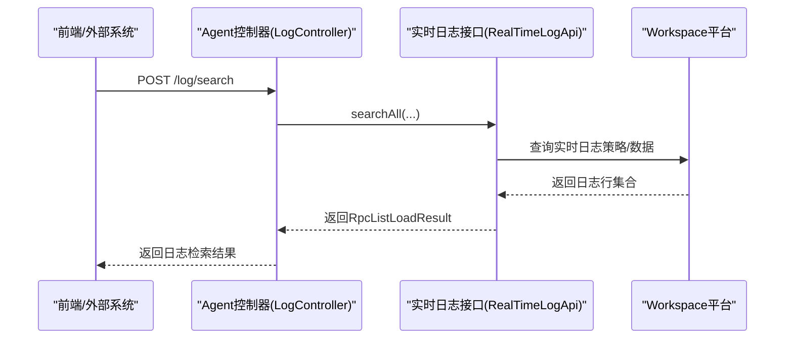
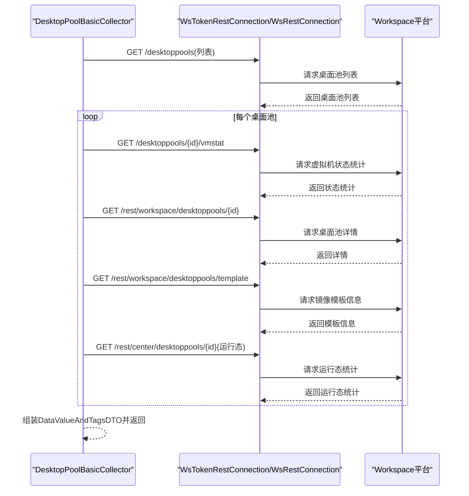
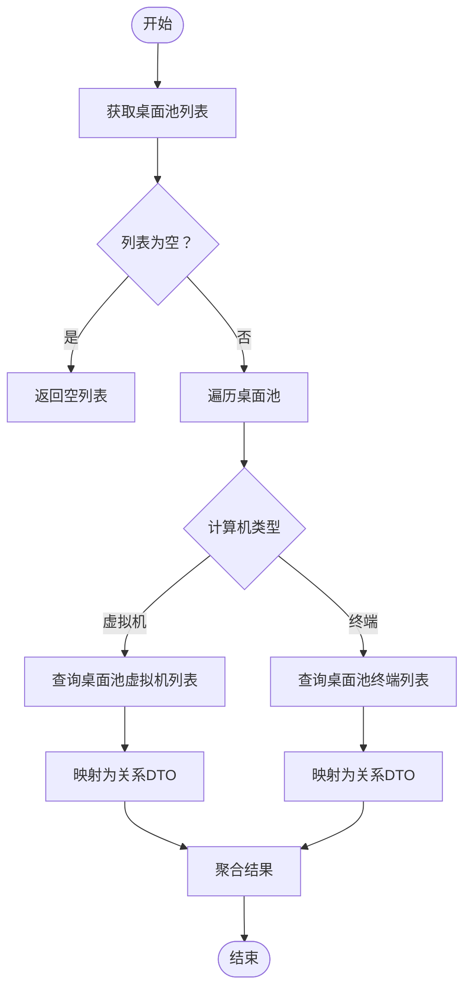
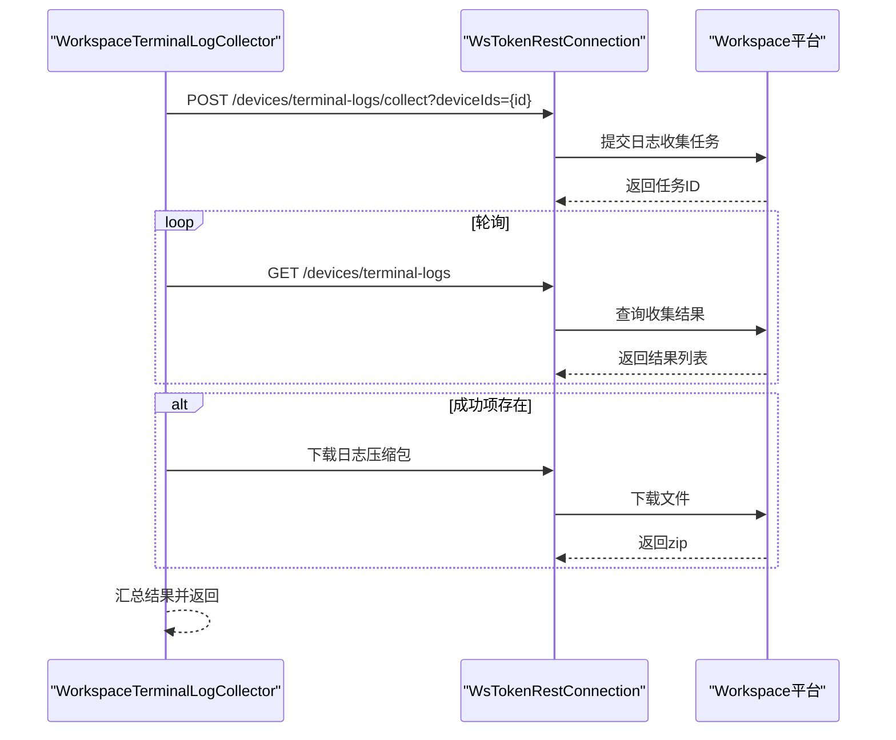
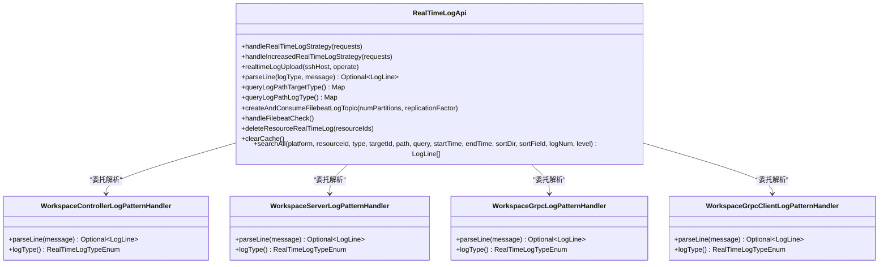
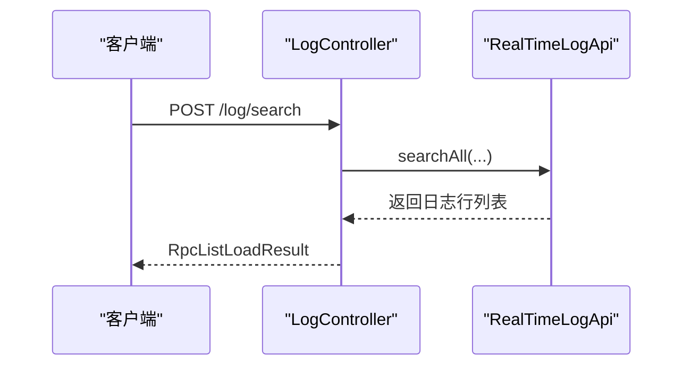
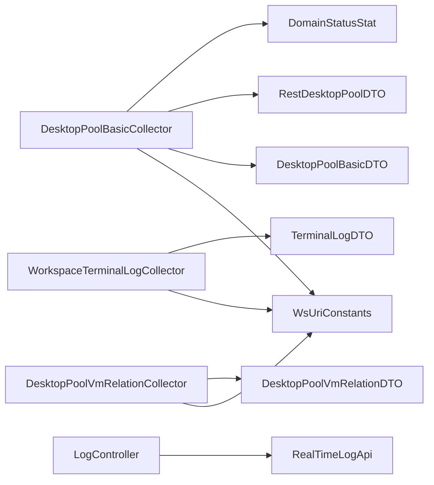

# Workspace产品监控模块

<cite>
**本文引用的文件**
- [DesktopPoolBasicCollector.java](file://watcher-workspace/src/main/java/com/virtual/cloud/om/workspace/service/report/DesktopPoolBasicCollector.java)
- [DesktopPoolVmRelationCollector.java](file://watcher-workspace/src/main/java/com/virtual/cloud/om/workspace/service/report/DesktopPoolVmRelationCollector.java)
- [WorkspaceTerminalLogCollector.java](file://watcher-workspace/src/main/java/com/virtual/cloud/om/workspace/service/batchlog/WorkspaceTerminalLogCollector.java)
- [WsUriConstants.java](file://watcher-sdk/src/main/java/com/virtual/cloud/om/sdk/constant/uri/WsUriConstants.java)
- [DesktopPoolBasicDTO.java](file://watcher-sdk/src/main/java/com/virtual/cloud/om/sdk/dto/dataReport/workspace/DesktopPoolBasicDTO.java)
- [DesktopPoolVmRelationDTO.java](file://watcher-sdk/src/main/java/com/virtual/cloud/om/sdk/dto/dataReport/workspace/DesktopPoolVmRelationDTO.java)
- [RestDesktopPoolDTO.java](file://watcher-sdk/src/main/java/com/virtual/cloud/om/sdk/dto/dataReport/workspace/RestDesktopPoolDTO.java)
- [DomainStatusStat.java](file://watcher-sdk/src/main/java/com/virtual/cloud/om/sdk/dto/dataReport/workspace/DomainStatusStat.java)
- [VdiDeviceDTO.java](file://watcher-sdk/src/main/java/com/virtual/cloud/om/sdk/dto/dataReport/workspace/VdiDeviceDTO.java)
- [LogBatchCollector.java](file://watcher-sdk/src/main/java/com/virtual/cloud/om/sdk/api/LogBatchCollector.java)
- [RealTimeLogApi.java](file://watcher-sdk/src/main/java/com/virtual/cloud/om/sdk/api/RealTimeLogApi.java)
- [RealTimeLogStrategyRequest.java](file://watcher-sdk/src/main/java/com/virtual/cloud/om/sdk/dto/RealTimeLogStrategyRequest.java)
- [TerminalLogDTO.java](file://watcher-sdk/src/main/java/com/virtual/cloud/om/sdk/dto/logBatch/TerminalLogDTO.java)
- [LogBatchTypeEnum.java](file://watcher-sdk/src/main/java/com/virtual/cloud/om/sdk/constant/LogBatchTypeEnum.java)
- [LogController.java](file://watcher-agent/src/main/java/com/virtual/cloud/om/agent/controller/LogController.java)
- [HomeController.java](file://watcher-agent/src/main/java/com/virtual/cloud/om/agent/controller/HomeController.java)
- [WorkspaceControllerLogPatternHandler.java](file://watcher-workspace/src/main/java/com/virtual/cloud/om/workspace/service/realtimelog/WorkspaceControllerLogPatternHandler.java)
- [WorkspaceServerLogPatternHandler.java](file://watcher-workspace/src/main/java/com/virtual/cloud/om/workspace/service/realtimelog/WorkspaceServerLogPatternHandler.java)
- [WorkspaceGrpcLogPatternHandler.java](file://watcher-workspace/src/main/java/com/virtual/cloud/om/workspace/service/realtimelog/WorkspaceGrpcLogPatternHandler.java)
- [WorkspaceGrpcClientLogPatternHandler.java](file://watcher-workspace/src/main/java/com/virtual/cloud/om/workspace/service/realtimelog/WorkspaceGrpcClientLogPatternHandler.java)
</cite>

## 目录
1. [简介](#简介)
2. [项目结构](#项目结构)
3. [核心组件](#核心组件)
4. [架构总览](#架构总览)
5. [详细组件分析](#详细组件分析)
6. [依赖分析](#依赖分析)
7. [性能考量](#性能考量)
8. [故障排查指南](#故障排查指南)
9. [结论](#结论)
10. [附录](#附录)

## 简介
本技术文档面向Workspace（虚拟桌面云）监控模块，系统性阐述监控体系的架构与实现，覆盖桌面池监控、终端设备监控、虚拟机资源关系监控以及平台版本统计等能力。同时，文档深入解析桌面池基础监控器的实现方式，包括资源使用情况、虚拟机与桌面池关系映射、性能指标采集流程；详解终端日志批量采集与下载流程；并给出Workspace实时日志解析器的实现要点与扩展指南，帮助开发者快速扩展监控能力。

## 项目结构
Workspace监控模块主要由以下子模块构成：
- watcher-workspace：Workspace业务侧监控实现，包含桌面池监控采集器、终端日志采集器、实时日志解析器等。
- watcher-sdk：跨组件通用SDK，定义URI常量、数据模型、采集接口、日志模型与枚举等。
- watcher-agent：Agent侧控制器，提供日志检索、测试连通性等REST接口。
- watcher-cas、watcher-onestor、watcher-uis：其他组件的日志解析器与服务，便于理解统一的日志处理范式。

```mermaid
graph TB
subgraph "Workspace监控"
A["DesktopPoolBasicCollector<br/>桌面池基础监控器"]
B["DesktopPoolVmRelationCollector<br/>桌面池-虚拟机关系监控器"]
C["WorkspaceTerminalLogCollector<br/>终端日志批量采集器"]
D["WorkspaceControllerLogPatternHandler<br/>控制器日志解析器"]
E["WorkspaceServerLogPatternHandler<br/>服务日志解析器"]
F["WorkspaceGrpcLogPatternHandler<br/>GRPC日志解析器"]
G["WorkspaceGrpcClientLogPatternHandler<br/>GRPC客户端日志解析器"]
end
subgraph "SDK"
H["WsUriConstants<br/>URI常量"]
I["DesktopPoolBasicDTO<br/>桌面池基础DTO"]
J["DesktopPoolVmRelationDTO<br/>桌面池-虚拟机关系DTO"]
K["RestDesktopPoolDTO<br/>REST桌面池DTO"]
L["DomainStatusStat<br/>虚拟机状态统计DTO"]
M["VdiDeviceDTO<br/>终端设备DTO"]
N["LogBatchCollector<br/>日志采集接口"]
O["RealTimeLogApi<br/>实时日志接口"]
P["TerminalLogDTO<br/>终端日志DTO"]
end
subgraph "Agent"
Q["LogController<br/>日志检索控制器"]
R["HomeController<br/>测试连通性控制器"]
end
A --> H
B --> H
C --> H
D --> O
E --> O
F --> O
G --> O
A --> I
A --> K
A --> L
B --> J
C --> P
Q --> O
R --> H
```

**图表来源**
- [DesktopPoolBasicCollector.java:32-150](file://watcher-workspace/src/main/java/com/virtual/cloud/om/workspace/service/report/DesktopPoolBasicCollector.java#L32-L150)
- [DesktopPoolVmRelationCollector.java:33-115](file://watcher-workspace/src/main/java/com/virtual/cloud/om/workspace/service/report/DesktopPoolVmRelationCollector.java#L33-L115)
- [WorkspaceTerminalLogCollector.java:31-153](file://watcher-workspace/src/main/java/com/virtual/cloud/om/workspace/service/batchlog/WorkspaceTerminalLogCollector.java#L31-L153)
- [WsUriConstants.java:1-91](file://watcher-sdk/src/main/java/com/virtual/cloud/om/sdk/constant/uri/WsUriConstants.java#L1-L91)
- [DesktopPoolBasicDTO.java:1-33](file://watcher-sdk/src/main/java/com/virtual/cloud/om/sdk/dto/dataReport/workspace/DesktopPoolBasicDTO.java#L1-L33)
- [DesktopPoolVmRelationDTO.java:1-16](file://watcher-sdk/src/main/java/com/virtual/cloud/om/sdk/dto/dataReport/workspace/DesktopPoolVmRelationDTO.java#L1-L16)
- [RestDesktopPoolDTO.java:1-77](file://watcher-sdk/src/main/java/com/virtual/cloud/om/sdk/dto/dataReport/workspace/RestDesktopPoolDTO.java#L1-L77)
- [DomainStatusStat.java:1-55](file://watcher-sdk/src/main/java/com/virtual/cloud/om/sdk/dto/dataReport/workspace/DomainStatusStat.java#L1-L55)
- [VdiDeviceDTO.java:1-301](file://watcher-sdk/src/main/java/com/virtual/cloud/om/sdk/dto/dataReport/workspace/VdiDeviceDTO.java#L1-L301)
- [LogBatchCollector.java:1-33](file://watcher-sdk/src/main/java/com/virtual/cloud/om/sdk/api/LogBatchCollector.java#L1-L33)
- [RealTimeLogApi.java:1-59](file://watcher-sdk/src/main/java/com/virtual/cloud/om/sdk/api/RealTimeLogApi.java#L1-L59)
- [TerminalLogDTO.java:1-30](file://watcher-sdk/src/main/java/com/virtual/cloud/om/sdk/dto/logBatch/TerminalLogDTO.java#L1-L30)
- [LogController.java:1-36](file://watcher-agent/src/main/java/com/virtual/cloud/om/agent/controller/LogController.java#L1-L36)
- [HomeController.java:40-71](file://watcher-agent/src/main/java/com/virtual/cloud/om/agent/controller/HomeController.java#L40-L71)

**章节来源**
- [DesktopPoolBasicCollector.java:1-150](file://watcher-workspace/src/main/java/com/virtual/cloud/om/workspace/service/report/DesktopPoolBasicCollector.java#L1-L150)
- [DesktopPoolVmRelationCollector.java:1-115](file://watcher-workspace/src/main/java/com/virtual/cloud/om/workspace/service/report/DesktopPoolVmRelationCollector.java#L1-L115)
- [WorkspaceTerminalLogCollector.java:1-153](file://watcher-workspace/src/main/java/com/virtual/cloud/om/workspace/service/batchlog/WorkspaceTerminalLogCollector.java#L1-L153)
- [WsUriConstants.java:1-91](file://watcher-sdk/src/main/java/com/virtual/cloud/om/sdk/constant/uri/WsUriConstants.java#L1-L91)
- [LogBatchCollector.java:1-33](file://watcher-sdk/src/main/java/com/virtual/cloud/om/sdk/api/LogBatchCollector.java#L1-L33)
- [RealTimeLogApi.java:1-59](file://watcher-sdk/src/main/java/com/virtual/cloud/om/sdk/api/RealTimeLogApi.java#L1-L59)
- [LogController.java:1-36](file://watcher-agent/src/main/java/com/virtual/cloud/om/agent/controller/LogController.java#L1-L36)
- [HomeController.java:40-71](file://watcher-agent/src/main/java/com/virtual/cloud/om/agent/controller/HomeController.java#L40-L71)

## 核心组件
- 桌面池基础监控器：负责采集桌面池基础信息、虚拟机状态统计、镜像模板信息及REST层的运行态统计。
- 桌面池-虚拟机关系监控器：负责建立桌面池与虚拟机或终端之间的映射关系。
- 终端日志批量采集器：负责按终端ID批量申请、轮询、下载终端日志。
- 实时日志接口与解析器：负责接收实时日志策略、解析不同组件日志格式并输出标准化日志行。
- Agent控制器：提供日志检索与平台连通性测试等REST接口。

**章节来源**
- [DesktopPoolBasicCollector.java:32-150](file://watcher-workspace/src/main/java/com/virtual/cloud/om/workspace/service/report/DesktopPoolBasicCollector.java#L32-L150)
- [DesktopPoolVmRelationCollector.java:33-115](file://watcher-workspace/src/main/java/com/virtual/cloud/om/workspace/service/report/DesktopPoolVmRelationCollector.java#L33-L115)
- [WorkspaceTerminalLogCollector.java:31-153](file://watcher-workspace/src/main/java/com/virtual/cloud/om/workspace/service/batchlog/WorkspaceTerminalLogCollector.java#L31-L153)
- [RealTimeLogApi.java:1-59](file://watcher-sdk/src/main/java/com/virtual/cloud/om/sdk/api/RealTimeLogApi.java#L1-L59)
- [LogController.java:20-36](file://watcher-agent/src/main/java/com/virtual/cloud/om/agent/controller/LogController.java#L20-L36)

## 架构总览
Workspace监控模块采用“采集器+SDK+控制器”的分层架构：
- 采集器层：在watcher-workspace中实现具体监控采集逻辑，通过SDK提供的URI常量与DTO进行平台交互。
- SDK层：提供统一的URI常量、数据模型、采集接口与日志模型，保证多组件一致性。
- 控制器层：在watcher-agent中提供REST接口，支撑前端与外部系统调用。

**图表来源**
- [LogController.java:27-34](file://watcher-agent/src/main/java/com/virtual/cloud/om/agent/controller/LogController.java#L27-L34)
- [RealTimeLogApi.java:57-58](file://watcher-sdk/src/main/java/com/virtual/cloud/om/sdk/api/RealTimeLogApi.java#L57-L58)

## 详细组件分析

### 桌面池基础监控器
该组件负责采集桌面池的基础属性、虚拟机状态统计、镜像模板信息以及REST层的运行态统计，并以JSON形式上报。

- 数据采集路径
  - 获取桌面池列表
  - 并发查询每个桌面池的虚拟机状态统计
  - 查询桌面池详情与镜像模板信息
  - 查询REST层的运行态统计（运行/暂停/异常/关闭/未知/总数）

- 关键实现要点
  - 使用异步并发请求提升采集效率
  - 对异常进行捕获与日志记录，避免整体失败
  - 将采集结果封装为DataValueAndTagsDTO并设置时间戳

**图表来源**
- [DesktopPoolBasicCollector.java:36-139](file://watcher-workspace/src/main/java/com/virtual/cloud/om/workspace/service/report/DesktopPoolBasicCollector.java#L36-L139)
- [WsUriConstants.java:44-91](file://watcher-sdk/src/main/java/com/virtual/cloud/om/sdk/constant/uri/WsUriConstants.java#L44-L91)
- [DomainStatusStat.java:1-55](file://watcher-sdk/src/main/java/com/virtual/cloud/om/sdk/dto/dataReport/workspace/DomainStatusStat.java#L1-L55)
- [RestDesktopPoolDTO.java:1-77](file://watcher-sdk/src/main/java/com/virtual/cloud/om/sdk/dto/dataReport/workspace/RestDesktopPoolDTO.java#L1-L77)

**章节来源**
- [DesktopPoolBasicCollector.java:32-150](file://watcher-workspace/src/main/java/com/virtual/cloud/om/workspace/service/report/DesktopPoolBasicCollector.java#L32-L150)
- [WsUriConstants.java:44-91](file://watcher-sdk/src/main/java/com/virtual/cloud/om/sdk/constant/uri/WsUriConstants.java#L44-L91)
- [DomainStatusStat.java:1-55](file://watcher-sdk/src/main/java/com/virtual/cloud/om/sdk/dto/dataReport/workspace/DomainStatusStat.java#L1-L55)
- [RestDesktopPoolDTO.java:1-77](file://watcher-sdk/src/main/java/com/virtual/cloud/om/sdk/dto/dataReport/workspace/RestDesktopPoolDTO.java#L1-L77)

### 桌面池-虚拟机关系监控器
该组件负责建立桌面池与虚拟机或终端之间的映射关系，支持不同计算机类型的桌面池分别处理。

- 数据采集路径
  - 获取桌面池列表
  - 根据计算机类型分支：
    - 虚拟机类型：查询桌面池下的虚拟机列表并映射为关系DTO
    - 终端类型：查询桌面池下的终端列表并映射为关系DTO

- 关键实现要点
  - 使用异步并发处理多个桌面池
  - 对异常进行捕获与日志记录
  - 将结果聚合为DataValueAndTagsDTO并返回

**图表来源**
- [DesktopPoolVmRelationCollector.java:36-104](file://watcher-workspace/src/main/java/com/virtual/cloud/om/workspace/service/report/DesktopPoolVmRelationCollector.java#L36-L104)
- [WsUriConstants.java:44-91](file://watcher-sdk/src/main/java/com/virtual/cloud/om/sdk/constant/uri/WsUriConstants.java#L44-L91)
- [DesktopPoolVmRelationDTO.java:1-16](file://watcher-sdk/src/main/java/com/virtual/cloud/om/sdk/dto/dataReport/workspace/DesktopPoolVmRelationDTO.java#L1-L16)
- [VdiDeviceDTO.java:1-301](file://watcher-sdk/src/main/java/com/virtual/cloud/om/sdk/dto/dataReport/workspace/VdiDeviceDTO.java#L1-L301)

**章节来源**
- [DesktopPoolVmRelationCollector.java:33-115](file://watcher-workspace/src/main/java/com/virtual/cloud/om/workspace/service/report/DesktopPoolVmRelationCollector.java#L33-L115)
- [WsUriConstants.java:44-91](file://watcher-sdk/src/main/java/com/virtual/cloud/om/sdk/constant/uri/WsUriConstants.java#L44-L91)
- [DesktopPoolVmRelationDTO.java:1-16](file://watcher-sdk/src/main/java/com/virtual/cloud/om/sdk/dto/dataReport/workspace/DesktopPoolVmRelationDTO.java#L1-L16)
- [VdiDeviceDTO.java:1-301](file://watcher-sdk/src/main/java/com/virtual/cloud/om/sdk/dto/dataReport/workspace/VdiDeviceDTO.java#L1-L301)

### 终端日志批量采集器
该组件负责按终端ID批量采集终端日志，支持轮询收集结果与下载压缩包。

- 数据采集路径
  - 为每个终端ID申请日志收集任务
  - 轮询收集结果，直到完成或超时
  - 对成功项执行下载，生成zip文件

- 关键实现要点
  - 使用异步并发处理多个终端
  - 对重复文件名进行去重处理
  - 根据成功/失败统计返回汇总结果

**图表来源**
- [WorkspaceTerminalLogCollector.java:34-97](file://watcher-workspace/src/main/java/com/virtual/cloud/om/workspace/service/batchlog/WorkspaceTerminalLogCollector.java#L34-L97)
- [WsUriConstants.java:21-32](file://watcher-sdk/src/main/java/com/virtual/cloud/om/sdk/constant/uri/WsUriConstants.java#L21-L32)
- [TerminalLogDTO.java:1-30](file://watcher-sdk/src/main/java/com/virtual/cloud/om/sdk/dto/logBatch/TerminalLogDTO.java#L1-L30)

**章节来源**
- [WorkspaceTerminalLogCollector.java:31-153](file://watcher-workspace/src/main/java/com/virtual/cloud/om/workspace/service/batchlog/WorkspaceTerminalLogCollector.java#L31-L153)
- [WsUriConstants.java:21-32](file://watcher-sdk/src/main/java/com/virtual/cloud/om/sdk/constant/uri/WsUriConstants.java#L21-L32)
- [TerminalLogDTO.java:1-30](file://watcher-sdk/src/main/java/com/virtual/cloud/om/sdk/dto/logBatch/TerminalLogDTO.java#L1-L30)

### Workspace实时日志解析器
该组件负责解析Workspace控制器、服务、GRPC及其客户端的日志格式，将其标准化为统一的LogLine对象，供实时日志接口使用。

- 解析流程
  - 依据不同日志类型定义正则表达式
  - 匹配成功后提取时间、级别、方法、消息等字段
  - 返回Optional<LogLine>，失败则返回空

- 扩展指南
  - 新增解析器时实现LogPatternApi并声明logType
  - 在RealTimeLogApi中维护解析器映射，确保策略下发后能正确解析

**图表来源**
- [RealTimeLogApi.java:1-59](file://watcher-sdk/src/main/java/com/virtual/cloud/om/sdk/api/RealTimeLogApi.java#L1-L59)
- [WorkspaceControllerLogPatternHandler.java:39-57](file://watcher-workspace/src/main/java/com/virtual/cloud/om/workspace/service/realtimelog/WorkspaceControllerLogPatternHandler.java#L39-L57)
- [WorkspaceServerLogPatternHandler.java](file://watcher-workspace/src/main/java/com/virtual/cloud/om/workspace/service/realtimelog/WorkspaceServerLogPatternHandler.java)
- [WorkspaceGrpcLogPatternHandler.java](file://watcher-workspace/src/main/java/com/virtual/cloud/om/workspace/service/realtimelog/WorkspaceGrpcLogPatternHandler.java)
- [WorkspaceGrpcClientLogPatternHandler.java](file://watcher-workspace/src/main/java/com/virtual/cloud/om/workspace/service/realtimelog/WorkspaceGrpcClientLogPatternHandler.java)

**章节来源**
- [RealTimeLogApi.java:1-59](file://watcher-sdk/src/main/java/com/virtual/cloud/om/sdk/api/RealTimeLogApi.java#L1-L59)
- [WorkspaceControllerLogPatternHandler.java:39-57](file://watcher-workspace/src/main/java/com/virtual/cloud/om/workspace/service/realtimelog/WorkspaceControllerLogPatternHandler.java#L39-L57)
- [WorkspaceServerLogPatternHandler.java](file://watcher-workspace/src/main/java/com/virtual/cloud/om/workspace/service/realtimelog/WorkspaceServerLogPatternHandler.java)
- [WorkspaceGrpcLogPatternHandler.java](file://watcher-workspace/src/main/java/com/virtual/cloud/om/workspace/service/realtimelog/WorkspaceGrpcLogPatternHandler.java)
- [WorkspaceGrpcClientLogPatternHandler.java](file://watcher-workspace/src/main/java/com/virtual/cloud/om/workspace/service/realtimelog/WorkspaceGrpcClientLogPatternHandler.java)

### Agent控制器与平台版本统计
- 日志检索控制器：提供POST /log/search接口，调用RealTimeLogApi进行在线日志检索。
- 测试连通性控制器：提供GET /workspace/desktoppools等接口，用于测试Workspace平台连通性与认证。

**图表来源**
- [LogController.java:27-34](file://watcher-agent/src/main/java/com/virtual/cloud/om/agent/controller/LogController.java#L27-L34)
- [RealTimeLogApi.java:57-58](file://watcher-sdk/src/main/java/com/virtual/cloud/om/sdk/api/RealTimeLogApi.java#L57-L58)

**章节来源**
- [LogController.java:1-36](file://watcher-agent/src/main/java/com/virtual/cloud/om/agent/controller/LogController.java#L1-L36)
- [HomeController.java:40-71](file://watcher-agent/src/main/java/com/virtual/cloud/om/agent/controller/HomeController.java#L40-L71)
- [WsUriConstants.java:37-42](file://watcher-sdk/src/main/java/com/virtual/cloud/om/sdk/constant/uri/WsUriConstants.java#L37-L42)

## 依赖分析
- 组件耦合
  - 采集器依赖SDK中的URI常量与DTO，降低与平台实现的耦合度。
  - 实时日志解析器通过接口抽象与RealTimeLogApi解耦，便于扩展新的日志类型。
- 外部依赖
  - 通过WsTokenRestConnection与WsRestConnection访问Workspace平台REST接口。
  - 日志采集器依赖平台提供的日志收集与下载接口。

**图表来源**
- [DesktopPoolBasicCollector.java:1-150](file://watcher-workspace/src/main/java/com/virtual/cloud/om/workspace/service/report/DesktopPoolBasicCollector.java#L1-L150)
- [DesktopPoolVmRelationCollector.java:1-115](file://watcher-workspace/src/main/java/com/virtual/cloud/om/workspace/service/report/DesktopPoolVmRelationCollector.java#L1-L115)
- [WorkspaceTerminalLogCollector.java:1-153](file://watcher-workspace/src/main/java/com/virtual/cloud/om/workspace/service/batchlog/WorkspaceTerminalLogCollector.java#L1-L153)
- [WsUriConstants.java:1-91](file://watcher-sdk/src/main/java/com/virtual/cloud/om/sdk/constant/uri/WsUriConstants.java#L1-L91)
- [DesktopPoolBasicDTO.java:1-33](file://watcher-sdk/src/main/java/com/virtual/cloud/om/sdk/dto/dataReport/workspace/DesktopPoolBasicDTO.java#L1-L33)
- [DesktopPoolVmRelationDTO.java:1-16](file://watcher-sdk/src/main/java/com/virtual/cloud/om/sdk/dto/dataReport/workspace/DesktopPoolVmRelationDTO.java#L1-L16)
- [RestDesktopPoolDTO.java:1-77](file://watcher-sdk/src/main/java/com/virtual/cloud/om/sdk/dto/dataReport/workspace/RestDesktopPoolDTO.java#L1-L77)
- [DomainStatusStat.java:1-55](file://watcher-sdk/src/main/java/com/virtual/cloud/om/sdk/dto/dataReport/workspace/DomainStatusStat.java#L1-L55)
- [TerminalLogDTO.java:1-30](file://watcher-sdk/src/main/java/com/virtual/cloud/om/sdk/dto/logBatch/TerminalLogDTO.java#L1-L30)
- [LogController.java:1-36](file://watcher-agent/src/main/java/com/virtual/cloud/om/agent/controller/LogController.java#L1-L36)
- [RealTimeLogApi.java:1-59](file://watcher-sdk/src/main/java/com/virtual/cloud/om/sdk/api/RealTimeLogApi.java#L1-L59)

**章节来源**
- [DesktopPoolBasicCollector.java:1-150](file://watcher-workspace/src/main/java/com/virtual/cloud/om/workspace/service/report/DesktopPoolBasicCollector.java#L1-L150)
- [DesktopPoolVmRelationCollector.java:1-115](file://watcher-workspace/src/main/java/com/virtual/cloud/om/workspace/service/report/DesktopPoolVmRelationCollector.java#L1-L115)
- [WorkspaceTerminalLogCollector.java:1-153](file://watcher-workspace/src/main/java/com/virtual/cloud/om/workspace/service/batchlog/WorkspaceTerminalLogCollector.java#L1-L153)
- [LogController.java:1-36](file://watcher-agent/src/main/java/com/virtual/cloud/om/agent/controller/LogController.java#L1-L36)
- [RealTimeLogApi.java:1-59](file://watcher-sdk/src/main/java/com/virtual/cloud/om/sdk/api/RealTimeLogApi.java#L1-L59)

## 性能考量
- 并发优化
  - 桌面池与终端采集均采用CompletableFuture并行化，显著缩短整体采集时间。
- 错误隔离
  - 单个桌面池或终端的异常不会影响其他对象的采集，提升系统鲁棒性。
- 结果去重
  - 终端日志下载阶段对同名文件进行去重，减少无效IO。
- 轮询节流
  - 日志收集结果轮询阶段增加短暂休眠，避免频繁查询导致平台压力。

[本节为通用指导，无需列出具体文件来源]

## 故障排查指南
- 采集失败
  - 检查平台连通性与认证信息是否正确
  - 查看采集器日志中的异常堆栈，定位具体URI与错误码
- 日志下载失败
  - 确认收集任务已完成且succNum为1
  - 检查下载路径权限与磁盘空间
- 实时日志解析异常
  - 新增日志类型时确认正则表达式与字段顺序一致
  - 核对RealTimeLogApi中解析器映射是否正确

**章节来源**
- [DesktopPoolBasicCollector.java:121-124](file://watcher-workspace/src/main/java/com/virtual/cloud/om/workspace/service/report/DesktopPoolBasicCollector.java#L121-L124)
- [WorkspaceTerminalLogCollector.java:48-52](file://watcher-workspace/src/main/java/com/virtual/cloud/om/workspace/service/batchlog/WorkspaceTerminalLogCollector.java#L48-L52)
- [RealTimeLogApi.java:1-59](file://watcher-sdk/src/main/java/com/virtual/cloud/om/sdk/api/RealTimeLogApi.java#L1-L59)

## 结论
Workspace监控模块通过采集器、SDK与控制器的协同，实现了桌面池、终端与平台资源的全链路监控。桌面池基础监控器与关系监控器提供了丰富的资源视图，终端日志批量采集器保障了问题定位能力，实时日志解析器则为统一的日志分析奠定了基础。建议在扩展新监控维度时遵循SDK契约与并发采集原则，确保系统稳定性与可维护性。

[本节为总结性内容，无需列出具体文件来源]

## 附录
- 配置与使用建议
  - 在Agent侧通过LogController的POST /log/search接口进行日志检索
  - 通过HomeController的GET /workspace/desktoppools接口进行平台连通性测试
  - 扩展日志解析器时，确保实现LogPatternApi并注册到RealTimeLogApi

**章节来源**
- [LogController.java:27-34](file://watcher-agent/src/main/java/com/virtual/cloud/om/agent/controller/LogController.java#L27-L34)
- [HomeController.java:52-58](file://watcher-agent/src/main/java/com/virtual/cloud/om/agent/controller/HomeController.java#L52-L58)
- [RealTimeLogApi.java:1-59](file://watcher-sdk/src/main/java/com/virtual/cloud/om/sdk/api/RealTimeLogApi.java#L1-L59)