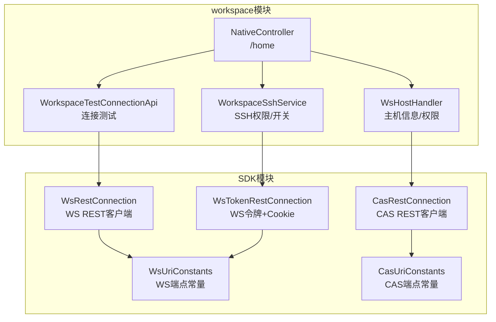
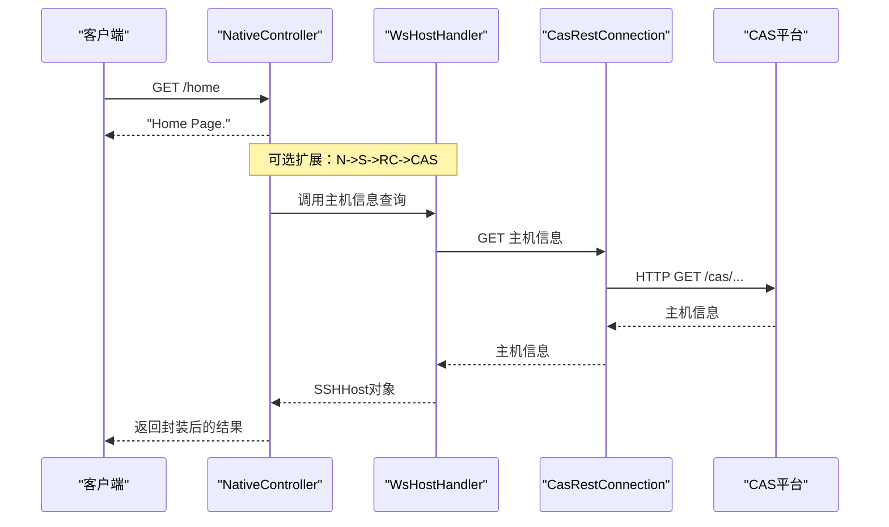
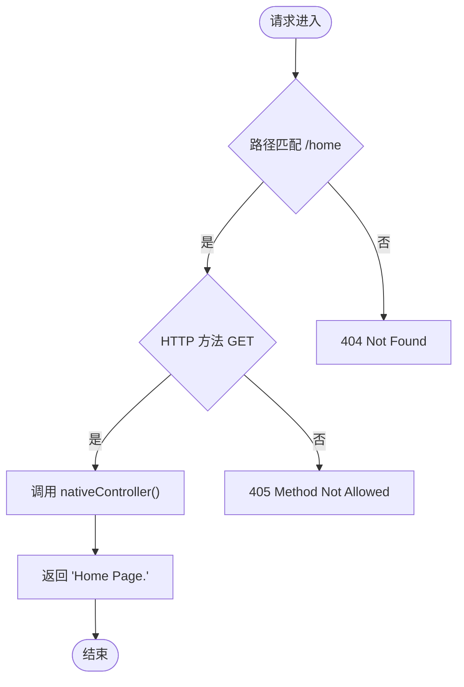
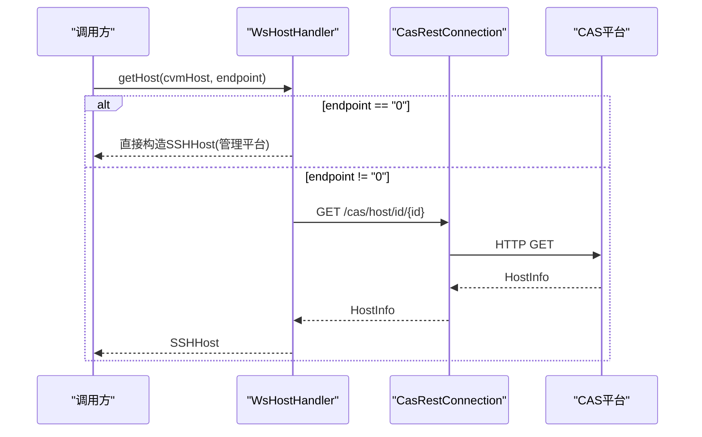
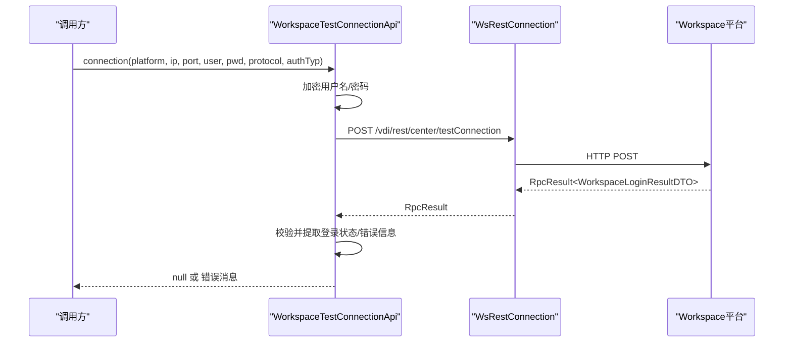
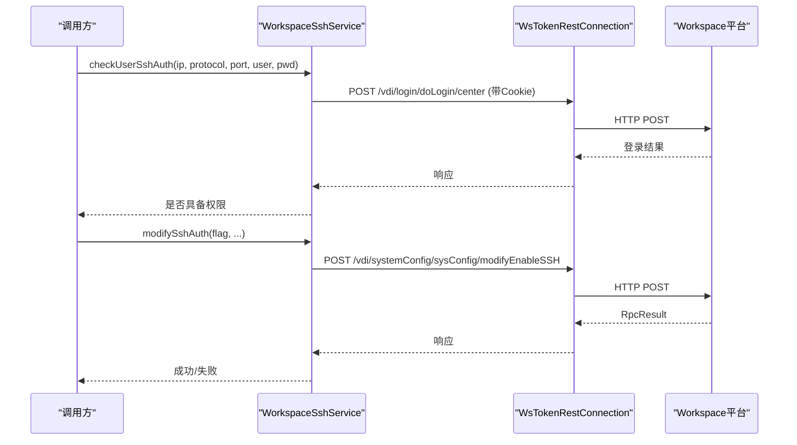
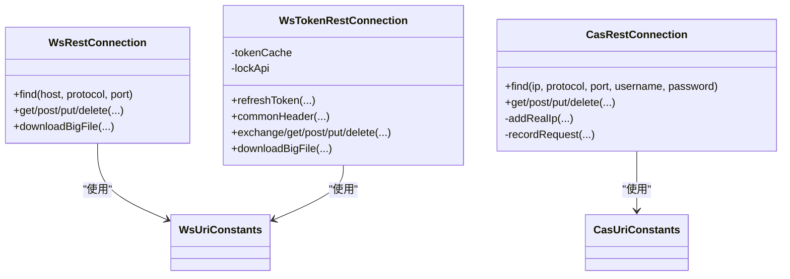
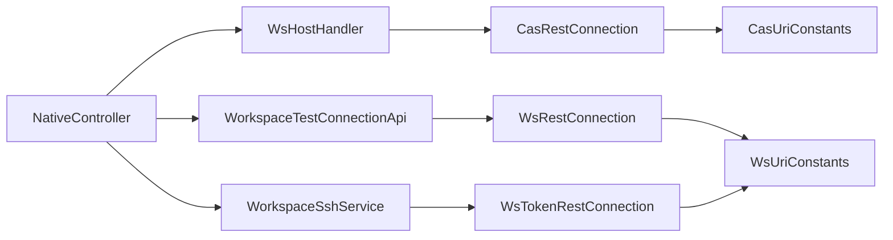

# Workspace原生控制器

<cite>
**本文引用的文件**
- [NativeController.java](file://watcher-workspace/src/main/java/com/virtual/cloud/om/workspace/web/NativeController.java)
- [WsHostHandler.java](file://watcher-workspace/src/main/java/com/virtual/cloud/om/workspace/service/WsHostHandler.java)
- [WorkspaceTestConnectionApi.java](file://watcher-workspace/src/main/java/com/virtual/cloud/om/workspace/service/WorkspaceTestConnectionApi.java)
- [WorkspaceSshService.java](file://watcher-workspace/src/main/java/com/virtual/cloud/om/workspace/service/ssh/WorkspaceSshService.java)
- [WsRestConnection.java](file://watcher-sdk/src/main/java/com/virtual/cloud/om/sdk/config/rest/workspace/WsRestConnection.java)
- [CasRestConnection.java](file://watcher-sdk/src/main/java/com/virtual/cloud/om/sdk/config/rest/cas/CasRestConnection.java)
- [WsTokenRestConnection.java](file://watcher-sdk/src/main/java/com/virtual/cloud/om/sdk/config/token/workspace/WsTokenRestConnection.java)
- [WsUriConstants.java](file://watcher-sdk/src/main/java/com/virtual/cloud/om/sdk/constant/uri/WsUriConstants.java)
- [CasUriConstants.java](file://watcher-sdk/src/main/java/com/virtual/cloud/om/sdk/constant/uri/CasUriConstants.java)
</cite>

## 目录
1. [简介](#简介)
2. [项目结构](#项目结构)
3. [核心组件](#核心组件)
4. [架构总览](#架构总览)
5. [详细组件分析](#详细组件分析)
6. [依赖关系分析](#依赖关系分析)
7. [性能考量](#性能考量)
8. [故障排查指南](#故障排查指南)
9. [结论](#结论)
10. [附录](#附录)

## 简介
本文件面向Workspace原生控制器（NativeController），系统性阐述其设计理念、实现架构与在Workspace监控体系中的定位。文档覆盖REST API设计原则、路由配置、参数校验与异常处理机制；说明控制器与业务服务层的交互模式与依赖注入方式；解释安全机制（认证、权限与访问控制）；给出性能优化建议（缓存、并发与资源管理）；提供扩展新API端点与业务功能的指南；并总结单元与集成测试最佳实践。

## 项目结构
- 控制器位于workspace模块的web包，当前仅提供一个基础首页端点。
- 业务服务位于workspace模块的service包，涵盖主机信息获取、连接测试、SSH权限等能力。
- SDK层提供统一的REST客户端抽象与URI常量，支撑跨平台（CAS/WS）调用与令牌管理。

图表来源
- [NativeController.java:1-19](file://watcher-workspace/src/main/java/com/virtual/cloud/om/workspace/web/NativeController.java#L1-L19)
- [WsHostHandler.java:1-63](file://watcher-workspace/src/main/java/com/virtual/cloud/om/workspace/service/WsHostHandler.java#L1-L63)
- [WorkspaceTestConnectionApi.java:1-44](file://watcher-workspace/src/main/java/com/virtual/cloud/om/workspace/service/WorkspaceTestConnectionApi.java#L1-L44)
- [WorkspaceSshService.java:1-126](file://watcher-workspace/src/main/java/com/virtual/cloud/om/workspace/service/ssh/WorkspaceSshService.java#L1-L126)
- [WsRestConnection.java:1-108](file://watcher-sdk/src/main/java/com/virtual/cloud/om/sdk/config/rest/workspace/WsRestConnection.java#L1-L108)
- [CasRestConnection.java:1-161](file://watcher-sdk/src/main/java/com/virtual/cloud/om/sdk/config/rest/cas/CasRestConnection.java#L1-L161)
- [WsTokenRestConnection.java:1-380](file://watcher-sdk/src/main/java/com/virtual/cloud/om/sdk/config/token/workspace/WsTokenRestConnection.java#L1-L380)
- [WsUriConstants.java:1-195](file://watcher-sdk/src/main/java/com/virtual/cloud/om/sdk/constant/uri/WsUriConstants.java#L1-L195)
- [CasUriConstants.java:1-822](file://watcher-sdk/src/main/java/com/virtual/cloud/om/sdk/constant/uri/CasUriConstants.java#L1-L822)

章节来源
- [NativeController.java:1-19](file://watcher-workspace/src/main/java/com/virtual/cloud/om/workspace/web/NativeController.java#L1-L19)

## 核心组件
- 原生控制器（NativeController）
  - 当前职责：提供基础首页端点“/home”。
  - 设计理念：最小可用，便于后续扩展与统一接入网关。
- 主机信息服务（WsHostHandler）
  - 负责从CAS平台查询主机信息，并转换为SSH连接所需对象。
  - 提供主机ID集合查询与平台标识。
- 连接测试服务（WorkspaceTestConnectionApi）
  - 对Workspace平台进行登录凭据连通性测试，返回错误信息或null。
- SSH权限服务（WorkspaceSshService）
  - 基于令牌与Cookie进行远程资源的SSH权限校验与开关。
- REST客户端与URI常量
  - WsRestConnection：WS平台REST调用封装。
  - CasRestConnection：CAS平台REST调用封装。
  - WsTokenRestConnection：WS令牌获取与Cookie维护，支持自动刷新与并发锁。
  - WsUriConstants/CasUriConstants：统一的端点常量，确保路径规范与一致性。

章节来源
- [WsHostHandler.java:25-62](file://watcher-workspace/src/main/java/com/virtual/cloud/om/workspace/service/WsHostHandler.java#L25-L62)
- [WorkspaceTestConnectionApi.java:20-43](file://watcher-workspace/src/main/java/com/virtual/cloud/om/workspace/service/WorkspaceTestConnectionApi.java#L20-L43)
- [WorkspaceSshService.java:27-125](file://watcher-workspace/src/main/java/com/virtual/cloud/om/workspace/service/ssh/WorkspaceSshService.java#L27-L125)
- [WsRestConnection.java:32-107](file://watcher-sdk/src/main/java/com/virtual/cloud/om/sdk/config/rest/workspace/WsRestConnection.java#L32-L107)
- [CasRestConnection.java:26-160](file://watcher-sdk/src/main/java/com/virtual/cloud/om/sdk/config/rest/cas/CasRestConnection.java#L26-L160)
- [WsTokenRestConnection.java:40-379](file://watcher-sdk/src/main/java/com/virtual/cloud/om/sdk/config/token/workspace/WsTokenRestConnection.java#L40-L379)
- [WsUriConstants.java:6-195](file://watcher-sdk/src/main/java/com/virtual/cloud/om/sdk/constant/uri/WsUriConstants.java#L6-L195)
- [CasUriConstants.java:8-822](file://watcher-sdk/src/main/java/com/virtual/cloud/om/sdk/constant/uri/CasUriConstants.java#L8-L822)

## 架构总览
- 控制器层：暴露REST端点，负责请求入口与响应封装。
- 服务层：封装业务逻辑，协调SDK层REST客户端完成跨平台调用。
- SDK层：抽象REST客户端、令牌管理与URI常量，屏蔽平台差异。
- 安全层：基于令牌与Cookie实现会话保持，必要时自动刷新。

图表来源
- [NativeController.java:10-17](file://watcher-workspace/src/main/java/com/virtual/cloud/om/workspace/web/NativeController.java#L10-L17)
- [WsHostHandler.java:31-44](file://watcher-workspace/src/main/java/com/virtual/cloud/om/workspace/service/WsHostHandler.java#L31-L44)
- [CasRestConnection.java:56-94](file://watcher-sdk/src/main/java/com/virtual/cloud/om/sdk/config/rest/cas/CasRestConnection.java#L56-L94)

## 详细组件分析

### 原生控制器（NativeController）
- 路由与方法
  - 请求映射：@RequestMapping("/home")，GET方法：nativeController()。
  - 响应：字符串“Home Page.”。
- 设计要点
  - 最小化实现，便于统一接入与后续扩展。
  - 可作为健康检查与欢迎页端点。
- 扩展建议
  - 新增端点时遵循REST风格命名与HTTP方法语义。
  - 使用统一响应封装与异常处理。

图表来源
- [NativeController.java:10-17](file://watcher-workspace/src/main/java/com/virtual/cloud/om/workspace/web/NativeController.java#L10-L17)

章节来源
- [NativeController.java:1-19](file://watcher-workspace/src/main/java/com/virtual/cloud/om/workspace/web/NativeController.java#L1-L19)

### 主机信息服务（WsHostHandler）
- 功能
  - 根据endpoint参数决定返回管理平台或CAS主机信息。
  - 查询主机ID集合，异常时返回空集。
- 交互流程
  - 若endpoint为特定值，构造SSHHost对象直接返回。
  - 否则拼装CAS URI常量，通过CasRestConnection发起GET请求，解析为HostInfo后转换为SSHHost。
- 平台标识
  - whoAreYou()返回workspace枚举，用于上报资源类型。

图表来源
- [WsHostHandler.java:31-44](file://watcher-workspace/src/main/java/com/virtual/cloud/om/workspace/service/WsHostHandler.java#L31-L44)
- [CasRestConnection.java:113-117](file://watcher-sdk/src/main/java/com/virtual/cloud/om/sdk/config/rest/cas/CasRestConnection.java#L113-L117)
- [CasUriConstants.java:98-103](file://watcher-sdk/src/main/java/com/virtual/cloud/om/sdk/constant/uri/CasUriConstants.java#L98-L103)

章节来源
- [WsHostHandler.java:25-62](file://watcher-workspace/src/main/java/com/virtual/cloud/om/workspace/service/WsHostHandler.java#L25-L62)

### 连接测试服务（WorkspaceTestConnectionApi）
- 功能
  - 对Workspace平台进行登录凭据测试，返回错误信息或null。
- 流程
  - 构造登录信息DTO，加密用户名与密码。
  - 通过WsRestConnection发起POST请求至测试端点。
  - 校验返回结果，提取登录状态与错误信息。
- 平台标识
  - platform()返回workspace枚举。

图表来源
- [WorkspaceTestConnectionApi.java:23-37](file://watcher-workspace/src/main/java/com/virtual/cloud/om/workspace/service/WorkspaceTestConnectionApi.java#L23-L37)
- [WsRestConnection.java:67-69](file://watcher-sdk/src/main/java/com/virtual/cloud/om/sdk/config/rest/workspace/WsRestConnection.java#L67-L69)
- [WsUriConstants.java:39-42](file://watcher-sdk/src/main/java/com/virtual/cloud/om/sdk/constant/uri/WsUriConstants.java#L39-L42)

章节来源
- [WorkspaceTestConnectionApi.java:17-43](file://watcher-workspace/src/main/java/com/virtual/cloud/om/workspace/service/WorkspaceTestConnectionApi.java#L17-L43)

### SSH权限服务（WorkspaceSshService）
- 功能
  - 校验用户SSH权限（含登录校验与权限判断）。
  - 修改SSH开关状态。
  - 查询当前SSH类型/开关状态。
- 交互
  - 使用WsTokenRestConnection携带Cookie访问WS端点。
  - 自动处理401并触发令牌刷新。
- 资源类型
  - resourceType()返回workspace标识。

图表来源
- [WorkspaceSshService.java:30-92](file://watcher-workspace/src/main/java/com/virtual/cloud/om/workspace/service/ssh/WorkspaceSshService.java#L30-L92)
- [WsTokenRestConnection.java:128-177](file://watcher-sdk/src/main/java/com/virtual/cloud/om/sdk/config/token/workspace/WsTokenRestConnection.java#L128-L177)
- [WsUriConstants.java:146-148](file://watcher-sdk/src/main/java/com/virtual/cloud/om/sdk/constant/uri/WsUriConstants.java#L146-L148)

章节来源
- [WorkspaceSshService.java:27-125](file://watcher-workspace/src/main/java/com/virtual/cloud/om/workspace/service/ssh/WorkspaceSshService.java#L27-L125)

### REST客户端与URI常量
- WsRestConnection
  - 封装GET/POST/PUT/DELETE/PATCH与文件下载。
  - 基于缓存的RestTemplate管理，按host+protocol+port索引。
- CasRestConnection
  - 针对CAS平台的REST调用，自动添加真实IP头，记录请求与耗时。
  - 处理409冲突码与异常转换。
- WsTokenRestConnection
  - 内存令牌缓存+分布式锁，避免并发重复刷新。
  - 自动处理401并重试，维护Cookie头。
  - 提供通用header构建与大文件下载。

图表来源
- [WsRestConnection.java:32-107](file://watcher-sdk/src/main/java/com/virtual/cloud/om/sdk/config/rest/workspace/WsRestConnection.java#L32-L107)
- [CasRestConnection.java:26-160](file://watcher-sdk/src/main/java/com/virtual/cloud/om/sdk/config/rest/cas/CasRestConnection.java#L26-L160)
- [WsTokenRestConnection.java:40-379](file://watcher-sdk/src/main/java/com/virtual/cloud/om/sdk/config/token/workspace/WsTokenRestConnection.java#L40-L379)
- [WsUriConstants.java:6-195](file://watcher-sdk/src/main/java/com/virtual/cloud/om/sdk/constant/uri/WsUriConstants.java#L6-L195)
- [CasUriConstants.java:8-822](file://watcher-sdk/src/main/java/com/virtual/cloud/om/sdk/constant/uri/CasUriConstants.java#L8-L822)

章节来源
- [WsRestConnection.java:32-107](file://watcher-sdk/src/main/java/com/virtual/cloud/om/sdk/config/rest/workspace/WsRestConnection.java#L32-L107)
- [CasRestConnection.java:26-160](file://watcher-sdk/src/main/java/com/virtual/cloud/om/sdk/config/rest/cas/CasRestConnection.java#L26-L160)
- [WsTokenRestConnection.java:40-379](file://watcher-sdk/src/main/java/com/virtual/cloud/om/sdk/config/token/workspace/WsTokenRestConnection.java#L40-L379)

## 依赖关系分析
- 控制器依赖服务层；服务层依赖SDK层REST客户端与URI常量。
- WsHostHandler依赖CasRestConnection与CasUriConstants。
- WorkspaceTestConnectionApi依赖WsRestConnection与WsUriConstants。
- WorkspaceSshService依赖WsTokenRestConnection与WsUriConstants。
- SDK层内部通过缓存与锁实现高可用与并发安全。

图表来源
- [NativeController.java:1-19](file://watcher-workspace/src/main/java/com/virtual/cloud/om/workspace/web/NativeController.java#L1-L19)
- [WsHostHandler.java:25-62](file://watcher-workspace/src/main/java/com/virtual/cloud/om/workspace/service/WsHostHandler.java#L25-L62)
- [WorkspaceTestConnectionApi.java:17-43](file://watcher-workspace/src/main/java/com/virtual/cloud/om/workspace/service/WorkspaceTestConnectionApi.java#L17-L43)
- [WorkspaceSshService.java:27-125](file://watcher-workspace/src/main/java/com/virtual/cloud/om/workspace/service/ssh/WorkspaceSshService.java#L27-L125)
- [WsRestConnection.java:32-107](file://watcher-sdk/src/main/java/com/virtual/cloud/om/sdk/config/rest/workspace/WsRestConnection.java#L32-L107)
- [CasRestConnection.java:26-160](file://watcher-sdk/src/main/java/com/virtual/cloud/om/sdk/config/rest/cas/CasRestConnection.java#L26-L160)
- [WsTokenRestConnection.java:40-379](file://watcher-sdk/src/main/java/com/virtual/cloud/om/sdk/config/token/workspace/WsTokenRestConnection.java#L40-L379)
- [WsUriConstants.java:6-195](file://watcher-sdk/src/main/java/com/virtual/cloud/om/sdk/constant/uri/WsUriConstants.java#L6-L195)
- [CasUriConstants.java:8-822](file://watcher-sdk/src/main/java/com/virtual/cloud/om/sdk/constant/uri/CasUriConstants.java#L8-L822)

## 性能考量
- 缓存策略
  - WsTokenRestConnection采用内存缓存存储令牌，降低重复登录开销。
  - CasRestConnection与WsRestConnection通过客户端缓存复用RestTemplate实例。
- 并发控制
  - 令牌刷新使用分布式锁，避免多线程/多实例同时刷新导致抖动。
- 资源管理
  - SDK层在destroy/close阶段释放资源，减少连接泄漏风险。
- 调用优化
  - 统一header构建与错误处理，减少重复逻辑。
  - 大文件下载采用流式写入，避免内存峰值。

章节来源
- [WsTokenRestConnection.java:44-121](file://watcher-sdk/src/main/java/com/virtual/cloud/om/sdk/config/token/workspace/WsTokenRestConnection.java#L44-L121)
- [CasRestConnection.java:37-44](file://watcher-sdk/src/main/java/com/virtual/cloud/om/sdk/config/rest/cas/CasRestConnection.java#L37-L44)
- [WsRestConnection.java:101-106](file://watcher-sdk/src/main/java/com/virtual/cloud/om/sdk/config/rest/workspace/WsRestConnection.java#L101-L106)

## 故障排查指南
- 401未授权
  - 触发令牌刷新并重试；若仍失败，检查凭据与平台配置。
- 409冲突
  - 解析错误码与消息，定位具体业务冲突原因。
- 连接不可用
  - 检查rest-client.ws.enable开关与目标平台可达性。
- 会话丢失
  - 确认Cookie头是否正确传递与更新。

章节来源
- [WsTokenRestConnection.java:142-177](file://watcher-sdk/src/main/java/com/virtual/cloud/om/sdk/config/token/workspace/WsTokenRestConnection.java#L142-L177)
- [CasRestConnection.java:74-93](file://watcher-sdk/src/main/java/com/virtual/cloud/om/sdk/config/rest/cas/CasRestConnection.java#L74-L93)
- [WsRestConnection.java:53-57](file://watcher-sdk/src/main/java/com/virtual/cloud/om/sdk/config/rest/workspace/WsRestConnection.java#L53-L57)

## 结论
NativeController以极简设计作为统一入口，结合服务层与SDK层实现对CAS/WS平台的稳定调用。通过令牌缓存、并发锁与统一URI常量，系统在安全性与性能之间取得平衡。建议在扩展新端点时严格遵循REST设计原则与统一异常处理，持续完善测试覆盖与可观测性。

## 附录

### REST API设计原则与规范
- URL路径规范
  - 使用名词复数形式，层级清晰，如“/vdi/rest/workspace/desktoppools”。
  - 参数通过路径或查询参数传递，避免过长路径。
- HTTP方法选择
  - GET：查询资源列表或单个资源。
  - POST：创建资源或触发动作。
  - PUT/DELETE：更新或删除资源。
  - PATCH：部分更新。
- 响应格式标准化
  - 统一使用JSON；成功返回标准结构，失败返回错误码与消息。
  - 大文件下载使用二进制流，设置正确的Content-Type。

章节来源
- [WsUriConstants.java:6-195](file://watcher-sdk/src/main/java/com/virtual/cloud/om/sdk/constant/uri/WsUriConstants.java#L6-L195)
- [CasUriConstants.java:8-822](file://watcher-sdk/src/main/java/com/virtual/cloud/om/sdk/constant/uri/CasUriConstants.java#L8-L822)

### 路由配置与参数校验
- 路由映射
  - 当前“/home”为单一端点；扩展时建议按资源域划分子路径。
- 参数校验
  - 对必填字段（平台、IP、端口、协议、用户名、密码）进行非空与格式校验。
  - 对endpoint等特殊参数进行白名单或范围校验。

章节来源
- [NativeController.java:10-17](file://watcher-workspace/src/main/java/com/virtual/cloud/om/workspace/web/NativeController.java#L10-L17)

### 异常处理机制
- 统一异常处理
  - SDK层捕获并转换为领域异常，控制器/服务层向上抛出或包装。
- 错误码与消息
  - 使用ErrorCodes枚举与国际化消息，保证一致性。

章节来源
- [CasRestConnection.java:68-93](file://watcher-sdk/src/main/java/com/virtual/cloud/om/sdk/config/rest/cas/CasRestConnection.java#L68-L93)
- [WsTokenRestConnection.java:141-177](file://watcher-sdk/src/main/java/com/virtual/cloud/om/sdk/config/token/workspace/WsTokenRestConnection.java#L141-L177)

### 安全机制实现
- 认证与权限
  - 使用令牌+Cookie维持会话；必要时自动刷新。
  - SSH权限校验与开关操作，确保最小权限原则。
- 访问控制
  - 通过URI常量集中管理端点，避免硬编码与越权访问。

章节来源
- [WorkspaceSshService.java:30-92](file://watcher-workspace/src/main/java/com/virtual/cloud/om/workspace/service/ssh/WorkspaceSshService.java#L30-L92)
- [WsTokenRestConnection.java:128-177](file://watcher-sdk/src/main/java/com/virtual/cloud/om/sdk/config/token/workspace/WsTokenRestConnection.java#L128-L177)

### 扩展指南
- 添加新端点
  - 在控制器新增方法，映射到合理路径与HTTP方法。
  - 在服务层实现业务逻辑，注入必要的SDK客户端。
  - 在URI常量中补充端点定义，保持一致性。
- 新增业务功能
  - 优先复用现有SDK客户端与缓存机制。
  - 明确异常与错误码，完善日志与监控埋点。

章节来源
- [NativeController.java:10-17](file://watcher-workspace/src/main/java/com/virtual/cloud/om/workspace/web/NativeController.java#L10-L17)
- [WsUriConstants.java:6-195](file://watcher-sdk/src/main/java/com/virtual/cloud/om/sdk/constant/uri/WsUriConstants.java#L6-L195)

### 测试最佳实践
- 单元测试
  - 对控制器方法进行请求/响应断言；对服务方法进行Mock SDK客户端。
- 集成测试
  - 模拟CAS/WS平台端点，验证令牌刷新、401重试与错误码转换。
- 性能测试
  - 压测令牌缓存命中率与并发刷新场景，评估锁粒度与超时时间。

[本节为通用指导，不直接分析具体文件]