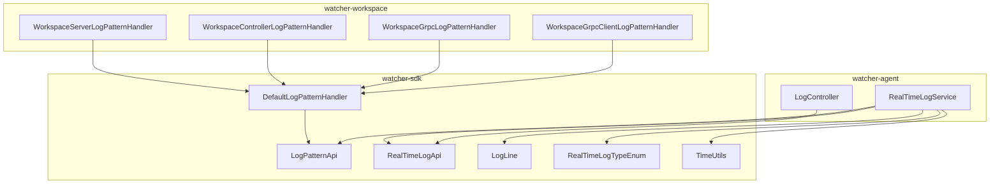
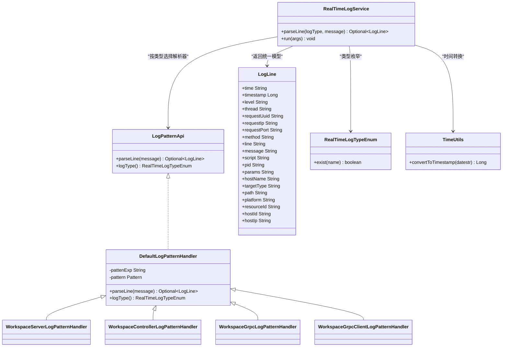
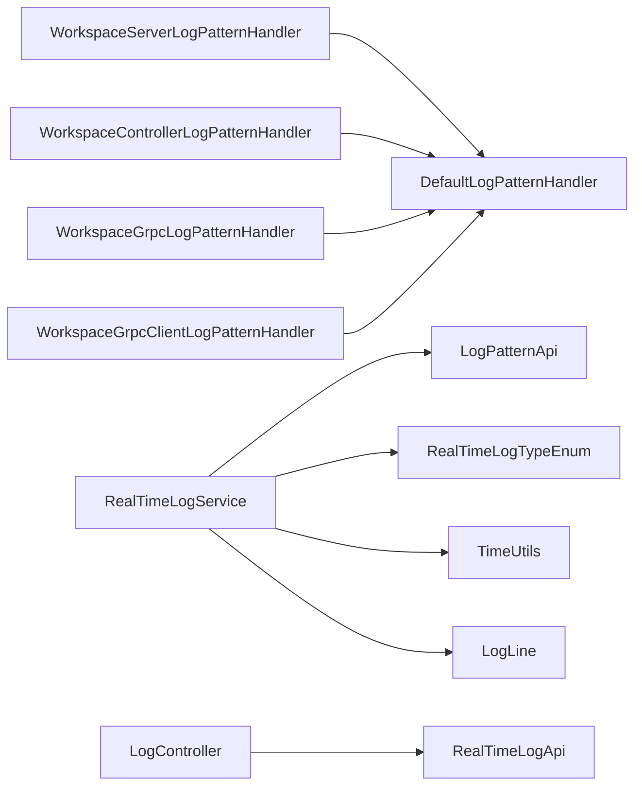

# Workspace实时日志处理

<cite>
**本文引用的文件**
- [WorkspaceServerLogPatternHandler.java](file://watcher-workspace/src/main/java/com/virtual/cloud/om/workspace/service/realtimelog/WorkspaceServerLogPatternHandler.java)
- [WorkspaceControllerLogPatternHandler.java](file://watcher-workspace/src/main/java/com/virtual/cloud/om/workspace/service/realtimelog/WorkspaceControllerLogPatternHandler.java)
- [WorkspaceGrpcLogPatternHandler.java](file://watcher-workspace/src/main/java/com/virtual/cloud/om/workspace/service/realtimelog/WorkspaceGrpcLogPatternHandler.java)
- [WorkspaceGrpcClientLogPatternHandler.java](file://watcher-workspace/src/main/java/com/virtual/cloud/om/workspace/service/realtimelog/WorkspaceGrpcClientLogPatternHandler.java)
- [DefaultLogPatternHandler.java](file://watcher-sdk/src/main/java/com/virtual/cloud/om/sdk/api/DefaultLogPatternHandler.java)
- [LogPatternApi.java](file://watcher-sdk/src/main/java/com/virtual/cloud/om/sdk/api/LogPatternApi.java)
- [RealTimeLogApi.java](file://watcher-sdk/src/main/java/com/virtual/cloud/om/sdk/api/RealTimeLogApi.java)
- [RealTimeLogService.java](file://watcher-agent/src/main/java/com/virtual/cloud/om/agent/service/logs/RealTimeLogService.java)
- [LogLine.java](file://watcher-sdk/src/main/java/com/virtual/cloud/om/sdk/dto/LogLine.java)
- [RealTimeLogTypeEnum.java](file://watcher-sdk/src/main/java/com/virtual/cloud/om/sdk/constant/RealTimeLogTypeEnum.java)
- [TimeUtils.java](file://watcher-sdk/src/main/java/com/virtual/cloud/om/sdk/utils/TimeUtils.java)
- [LogController.java](file://watcher-agent/src/main/java/com/virtual/cloud/om/agent/controller/LogController.java)
</cite>

## 目录
1. [简介](#简介)
2. [项目结构](#项目结构)
3. [核心组件](#核心组件)
4. [架构总览](#架构总览)
5. [详细组件分析](#详细组件分析)
6. [依赖关系分析](#依赖关系分析)
7. [性能考虑](#性能考虑)
8. [故障排查指南](#故障排查指南)
9. [结论](#结论)
10. [附录](#附录)

## 简介
本文件面向Workspace实时日志处理能力，系统性阐述实时日志解析器的架构设计与实现细节，重点覆盖以下方面：
- 服务器日志解析器与控制器日志解析器的实现原理与差异
- 日志模式匹配机制：正则表达式定义、字段提取与时间戳转换
- 性能优化策略：解析线程安全、默认解析器复用与可扩展性
- 配置与扩展：日志类型枚举、解析器注册与“others”兜底策略
- 与监控系统的集成：通过统一接口将解析结果推送至监控平台
- 错误恢复与容错：解析失败回退、未知类型处理
- 与批量日志采集的协调：避免重复处理与数据冲突

## 项目结构
围绕Workspace实时日志处理的相关模块分布于三个子工程：
- watcher-workspace：Workspace业务侧的日志解析器实现
- watcher-sdk：通用日志处理接口、数据模型与工具类
- watcher-agent：Agent侧的实时日志服务与对外接口

图表来源
- [WorkspaceServerLogPatternHandler.java:1-59](file://watcher-workspace/src/main/java/com/virtual/cloud/om/workspace/service/realtimelog/WorkspaceServerLogPatternHandler.java#L1-L59)
- [WorkspaceControllerLogPatternHandler.java:1-58](file://watcher-workspace/src/main/java/com/virtual/cloud/om/workspace/service/realtimelog/WorkspaceControllerLogPatternHandler.java#L1-L58)
- [WorkspaceGrpcLogPatternHandler.java:1-58](file://watcher-workspace/src/main/java/com/virtual/cloud/om/workspace/service/realtimelog/WorkspaceGrpcLogPatternHandler.java#L1-L58)
- [WorkspaceGrpcClientLogPatternHandler.java:1-58](file://watcher-workspace/src/main/java/com/virtual/cloud/om/workspace/service/realtimelog/WorkspaceGrpcClientLogPatternHandler.java#L1-L58)
- [DefaultLogPatternHandler.java:1-56](file://watcher-sdk/src/main/java/com/virtual/cloud/om/sdk/api/DefaultLogPatternHandler.java#L1-L56)
- [LogPatternApi.java:1-18](file://watcher-sdk/src/main/java/com/virtual/cloud/om/sdk/api/LogPatternApi.java#L1-L18)
- [RealTimeLogApi.java:1-59](file://watcher-sdk/src/main/java/com/virtual/cloud/om/sdk/api/RealTimeLogApi.java#L1-L59)
- [RealTimeLogService.java:1-279](file://watcher-agent/src/main/java/com/virtual/cloud/om/agent/service/logs/RealTimeLogService.java#L1-L279)
- [LogLine.java:1-56](file://watcher-sdk/src/main/java/com/virtual/cloud/om/sdk/dto/LogLine.java#L1-L56)
- [RealTimeLogTypeEnum.java:1-45](file://watcher-sdk/src/main/java/com/virtual/cloud/om/sdk/constant/RealTimeLogTypeEnum.java#L1-L45)
- [TimeUtils.java:1-37](file://watcher-sdk/src/main/java/com/virtual/cloud/om/sdk/utils/TimeUtils.java#L1-L37)
- [LogController.java:1-36](file://watcher-agent/src/main/java/com/virtual/cloud/om/agent/controller/LogController.java#L1-L36)

章节来源
- [WorkspaceServerLogPatternHandler.java:1-59](file://watcher-workspace/src/main/java/com/virtual/cloud/om/workspace/service/realtimelog/WorkspaceServerLogPatternHandler.java#L1-L59)
- [WorkspaceControllerLogPatternHandler.java:1-58](file://watcher-workspace/src/main/java/com/virtual/cloud/om/workspace/service/realtimelog/WorkspaceControllerLogPatternHandler.java#L1-L58)
- [WorkspaceGrpcLogPatternHandler.java:1-58](file://watcher-workspace/src/main/java/com/virtual/cloud/om/workspace/service/realtimelog/WorkspaceGrpcLogPatternHandler.java#L1-L58)
- [WorkspaceGrpcClientLogPatternHandler.java:1-58](file://watcher-workspace/src/main/java/com/virtual/cloud/om/workspace/service/realtimelog/WorkspaceGrpcClientLogPatternHandler.java#L1-L58)
- [DefaultLogPatternHandler.java:1-56](file://watcher-sdk/src/main/java/com/virtual/cloud/om/sdk/api/DefaultLogPatternHandler.java#L1-L56)
- [LogPatternApi.java:1-18](file://watcher-sdk/src/main/java/com/virtual/cloud/om/sdk/api/LogPatternApi.java#L1-L18)
- [RealTimeLogApi.java:1-59](file://watcher-sdk/src/main/java/com/virtual/cloud/om/sdk/api/RealTimeLogApi.java#L1-L59)
- [RealTimeLogService.java:1-279](file://watcher-agent/src/main/java/com/virtual/cloud/om/agent/service/logs/RealTimeLogService.java#L1-L279)
- [LogLine.java:1-56](file://watcher-sdk/src/main/java/com/virtual/cloud/om/sdk/dto/LogLine.java#L1-L56)
- [RealTimeLogTypeEnum.java:1-45](file://watcher-sdk/src/main/java/com/virtual/cloud/om/sdk/constant/RealTimeLogTypeEnum.java#L1-L45)
- [TimeUtils.java:1-37](file://watcher-sdk/src/main/java/com/virtual/cloud/om/sdk/utils/TimeUtils.java#L1-L37)
- [LogController.java:1-36](file://watcher-agent/src/main/java/com/virtual/cloud/om/agent/controller/LogController.java#L1-L36)

## 核心组件
- 日志解析接口与抽象基类
  - LogPatternApi：定义解析器契约，提供parseLine与logType两个方法
  - DefaultLogPatternHandler：提供通用正则与字段映射，作为Workspace多类解析器的基类
- Workspace专用解析器
  - WorkspaceServerLogPatternHandler：针对服务器日志格式的解析
  - WorkspaceControllerLogPatternHandler：针对控制器日志格式的解析
  - WorkspaceGrpcLogPatternHandler：针对gRPC服务日志格式的解析
  - WorkspaceGrpcClientLogPatternHandler：针对gRPC客户端日志格式的解析
- Agent侧实时日志服务
  - RealTimeLogService：负责解析器注册、按类型选择解析器、统一解析入口与日志检索接口
- 数据模型与工具
  - LogLine：统一的日志行数据模型
  - RealTimeLogTypeEnum：日志类型枚举，包含workspace_server、workspace_controller、workspace_grpc、workspace_grpc_client等
  - TimeUtils：时间字符串到时间戳的转换工具

章节来源
- [LogPatternApi.java:1-18](file://watcher-sdk/src/main/java/com/virtual/cloud/om/sdk/api/LogPatternApi.java#L1-L18)
- [DefaultLogPatternHandler.java:1-56](file://watcher-sdk/src/main/java/com/virtual/cloud/om/sdk/api/DefaultLogPatternHandler.java#L1-L56)
- [WorkspaceServerLogPatternHandler.java:1-59](file://watcher-workspace/src/main/java/com/virtual/cloud/om/workspace/service/realtimelog/WorkspaceServerLogPatternHandler.java#L1-L59)
- [WorkspaceControllerLogPatternHandler.java:1-58](file://watcher-workspace/src/main/java/com/virtual/cloud/om/workspace/service/realtimelog/WorkspaceControllerLogPatternHandler.java#L1-L58)
- [WorkspaceGrpcLogPatternHandler.java:1-58](file://watcher-workspace/src/main/java/com/virtual/cloud/om/workspace/service/realtimelog/WorkspaceGrpcLogPatternHandler.java#L1-L58)
- [WorkspaceGrpcClientLogPatternHandler.java:1-58](file://watcher-workspace/src/main/java/com/virtual/cloud/om/workspace/service/realtimelog/WorkspaceGrpcClientLogPatternHandler.java#L1-L58)
- [RealTimeLogService.java:1-279](file://watcher-agent/src/main/java/com/virtual/cloud/om/agent/service/logs/RealTimeLogService.java#L1-L279)
- [LogLine.java:1-56](file://watcher-sdk/src/main/java/com/virtual/cloud/om/sdk/dto/LogLine.java#L1-L56)
- [RealTimeLogTypeEnum.java:1-45](file://watcher-sdk/src/main/java/com/virtual/cloud/om/sdk/constant/RealTimeLogTypeEnum.java#L1-L45)
- [TimeUtils.java:1-37](file://watcher-sdk/src/main/java/com/virtual/cloud/om/sdk/utils/TimeUtils.java#L1-L37)

## 架构总览
实时日志处理采用“接口+抽象基类+具体实现”的分层设计：
- 接口层：LogPatternApi定义解析器标准
- 抽象层：DefaultLogPatternHandler提供通用正则与字段映射
- 业务层：Workspace各解析器针对不同日志格式进行差异化正则与字段抽取
- 服务层：RealTimeLogService集中管理解析器注册与选择，并提供统一解析入口
- 工具层：LogLine、RealTimeLogTypeEnum、TimeUtils支撑数据模型与类型/时间处理

图表来源
- [LogPatternApi.java:1-18](file://watcher-sdk/src/main/java/com/virtual/cloud/om/sdk/api/LogPatternApi.java#L1-L18)
- [DefaultLogPatternHandler.java:1-56](file://watcher-sdk/src/main/java/com/virtual/cloud/om/sdk/api/DefaultLogPatternHandler.java#L1-L56)
- [WorkspaceServerLogPatternHandler.java:1-59](file://watcher-workspace/src/main/java/com/virtual/cloud/om/workspace/service/realtimelog/WorkspaceServerLogPatternHandler.java#L1-L59)
- [WorkspaceControllerLogPatternHandler.java:1-58](file://watcher-workspace/src/main/java/com/virtual/cloud/om/workspace/service/realtimelog/WorkspaceControllerLogPatternHandler.java#L1-L58)
- [WorkspaceGrpcLogPatternHandler.java:1-58](file://watcher-workspace/src/main/java/com/virtual/cloud/om/workspace/service/realtimelog/WorkspaceGrpcLogPatternHandler.java#L1-L58)
- [WorkspaceGrpcClientLogPatternHandler.java:1-58](file://watcher-workspace/src/main/java/com/virtual/cloud/om/workspace/service/realtimelog/WorkspaceGrpcClientLogPatternHandler.java#L1-L58)
- [RealTimeLogService.java:1-279](file://watcher-agent/src/main/java/com/virtual/cloud/om/agent/service/logs/RealTimeLogService.java#L1-L279)
- [LogLine.java:1-56](file://watcher-sdk/src/main/java/com/virtual/cloud/om/sdk/dto/LogLine.java#L1-L56)
- [RealTimeLogTypeEnum.java:1-45](file://watcher-sdk/src/main/java/com/virtual/cloud/om/sdk/constant/RealTimeLogTypeEnum.java#L1-L45)
- [TimeUtils.java:1-37](file://watcher-sdk/src/main/java/com/virtual/cloud/om/sdk/utils/TimeUtils.java#L1-L37)

## 详细组件分析

### 服务器日志解析器（WorkspaceServerLogPatternHandler）
- 设计要点
  - 基于DefaultLogPatternHandler，重用通用正则与字段映射
  - 针对服务器日志格式定制差异化正则表达式，确保字段正确抽取
  - 通过logType返回workspace_server，用于服务层按类型路由
- 字段映射
  - 时间、级别、线程、请求UUID、请求IP、方法、行号、消息
- 性能与线程安全
  - DefaultLogPatternHandler的parseLine方法使用synchronized，保证并发安全
- 错误处理
  - 正则不匹配时返回Optional.empty，由上层统一处理

章节来源
- [WorkspaceServerLogPatternHandler.java:1-59](file://watcher-workspace/src/main/java/com/virtual/cloud/om/workspace/service/realtimelog/WorkspaceServerLogPatternHandler.java#L1-L59)
- [DefaultLogPatternHandler.java:1-56](file://watcher-sdk/src/main/java/com/virtual/cloud/om/sdk/api/DefaultLogPatternHandler.java#L1-L56)
- [LogLine.java:1-56](file://watcher-sdk/src/main/java/com/virtual/cloud/om/sdk/dto/LogLine.java#L1-L56)
- [RealTimeLogTypeEnum.java:1-45](file://watcher-sdk/src/main/java/com/virtual/cloud/om/sdk/constant/RealTimeLogTypeEnum.java#L1-L45)

### 控制器日志解析器（WorkspaceControllerLogPatternHandler）
- 设计要点
  - 与服务器解析器类似，但正则表达式适配控制器日志格式（含端口字段）
  - 通过logType返回workspace_controller
- 字段映射
  - 时间、级别、线程、请求UUID、请求IP、请求端口、方法、行号、消息
- 与服务器解析器对比
  - 控制器解析器在请求端口字段上存在差异，体现不同组件日志格式的差异化

章节来源
- [WorkspaceControllerLogPatternHandler.java:1-58](file://watcher-workspace/src/main/java/com/virtual/cloud/om/workspace/service/realtimelog/WorkspaceControllerLogPatternHandler.java#L1-L58)
- [DefaultLogPatternHandler.java:1-56](file://watcher-sdk/src/main/java/com/virtual/cloud/om/sdk/api/DefaultLogPatternHandler.java#L1-L56)
- [LogLine.java:1-56](file://watcher-sdk/src/main/java/com/virtual/cloud/om/sdk/dto/LogLine.java#L1-L56)
- [RealTimeLogTypeEnum.java:1-45](file://watcher-sdk/src/main/java/com/virtual/cloud/om/sdk/constant/RealTimeLogTypeEnum.java#L1-L45)

### gRPC相关解析器
- WorkspaceGrpcLogPatternHandler
  - 面向gRPC服务端日志格式，字段抽取与时间戳转换一致
- WorkspaceGrpcClientLogPatternHandler
  - 面向gRPC客户端日志格式，字段抽取与时间戳转换一致
- 共同点
  - 均继承DefaultLogPatternHandler，复用通用正则与字段映射
  - 通过logType分别返回workspace_grpc与workspace_grpc_client

章节来源
- [WorkspaceGrpcLogPatternHandler.java:1-58](file://watcher-workspace/src/main/java/com/virtual/cloud/om/workspace/service/realtimelog/WorkspaceGrpcLogPatternHandler.java#L1-L58)
- [WorkspaceGrpcClientLogPatternHandler.java:1-58](file://watcher-workspace/src/main/java/com/virtual/cloud/om/workspace/service/realtimelog/WorkspaceGrpcClientLogPatternHandler.java#L1-L58)
- [DefaultLogPatternHandler.java:1-56](file://watcher-sdk/src/main/java/com/virtual/cloud/om/sdk/api/DefaultLogPatternHandler.java#L1-L56)
- [LogLine.java:1-56](file://watcher-sdk/src/main/java/com/virtual/cloud/om/sdk/dto/LogLine.java#L1-L56)
- [RealTimeLogTypeEnum.java:1-45](file://watcher-sdk/src/main/java/com/virtual/cloud/om/sdk/constant/RealTimeLogTypeEnum.java#L1-L45)

### 默认解析器（DefaultLogPatternHandler）
- 设计要点
  - 提供通用正则表达式与字段映射，作为多类解析器的基类
  - parseLine方法加synchronized，确保并发安全
- 字段映射
  - 时间、级别、线程、请求UUID、请求IP、请求端口、方法、行号、消息
- 作用
  - 降低重复代码，统一字段命名与数据模型

章节来源
- [DefaultLogPatternHandler.java:1-56](file://watcher-sdk/src/main/java/com/virtual/cloud/om/sdk/api/DefaultLogPatternHandler.java#L1-L56)
- [LogLine.java:1-56](file://watcher-sdk/src/main/java/com/virtual/cloud/om/sdk/dto/LogLine.java#L1-L56)
- [TimeUtils.java:1-37](file://watcher-sdk/src/main/java/com/virtual/cloud/om/sdk/utils/TimeUtils.java#L1-L37)

### Agent侧实时日志服务（RealTimeLogService）
- 职责
  - 注册并维护LogPatternApi数组，构建logType到解析器的映射
  - 提供统一解析入口parseLine，按logType选择对应解析器
  - 提供日志检索接口searchAll（当前版本已禁用）
- 关键流程
  - 启动时扫描LogPatternApi实现，填充映射表
  - 解析时根据logType获取解析器，若为空则返回仅包含原始消息的LogLine
- 当前状态
  - 多处与Kafka、Elasticsearch、MongoDB相关的功能已标记为“已禁用”，表明实时日志采集与存储策略已调整

章节来源
- [RealTimeLogService.java:1-279](file://watcher-agent/src/main/java/com/virtual/cloud/om/agent/service/logs/RealTimeLogService.java#L1-L279)
- [LogPatternApi.java:1-18](file://watcher-sdk/src/main/java/com/virtual/cloud/om/sdk/api/LogPatternApi.java#L1-L18)
- [RealTimeLogApi.java:1-59](file://watcher-sdk/src/main/java/com/virtual/cloud/om/sdk/api/RealTimeLogApi.java#L1-L59)

### 数据模型与类型枚举
- LogLine
  - 统一承载解析后的日志字段，便于后续推送与存储
- RealTimeLogTypeEnum
  - 定义所有支持的日志类型，包含workspace_server、workspace_controller、workspace_grpc、workspace_grpc_client等
  - 提供exist方法用于类型存在性校验

章节来源
- [LogLine.java:1-56](file://watcher-sdk/src/main/java/com/virtual/cloud/om/sdk/dto/LogLine.java#L1-L56)
- [RealTimeLogTypeEnum.java:1-45](file://watcher-sdk/src/main/java/com/virtual/cloud/om/sdk/constant/RealTimeLogTypeEnum.java#L1-L45)

### 时间戳转换（TimeUtils）
- 功能
  - 将日志中的时间字符串转换为时间戳，兼容多种时间格式
- 使用场景
  - 在解析器中调用convertToTimestamp，为LogLine设置timestamp字段

章节来源
- [TimeUtils.java:1-37](file://watcher-sdk/src/main/java/com/virtual/cloud/om/sdk/utils/TimeUtils.java#L1-L37)

### 对外接口（LogController）
- 功能
  - 提供日志检索接口，调用RealTimeLogApi.searchAll完成在线检索
- 注意
  - 当前searchAll已禁用，返回空列表

章节来源
- [LogController.java:1-36](file://watcher-agent/src/main/java/com/virtual/cloud/om/agent/controller/LogController.java#L1-L36)
- [RealTimeLogApi.java:1-59](file://watcher-sdk/src/main/java/com/virtual/cloud/om/sdk/api/RealTimeLogApi.java#L1-L59)
- [RealTimeLogService.java:1-279](file://watcher-agent/src/main/java/com/virtual/cloud/om/agent/service/logs/RealTimeLogService.java#L1-L279)

## 依赖关系分析
- 组件耦合
  - Workspace解析器依赖DefaultLogPatternHandler，降低重复实现
  - RealTimeLogService依赖LogPatternApi数组，实现解析器的动态注册与选择
- 类型与工具
  - RealTimeLogService依赖RealTimeLogTypeEnum与TimeUtils，确保类型识别与时间转换
- 外部依赖现状
  - 多处与Kafka、Elasticsearch、MongoDB相关的功能已禁用，实时日志采集与存储策略已调整

图表来源
- [WorkspaceServerLogPatternHandler.java:1-59](file://watcher-workspace/src/main/java/com/virtual/cloud/om/workspace/service/realtimelog/WorkspaceServerLogPatternHandler.java#L1-L59)
- [WorkspaceControllerLogPatternHandler.java:1-58](file://watcher-workspace/src/main/java/com/virtual/cloud/om/workspace/service/realtimelog/WorkspaceControllerLogPatternHandler.java#L1-L58)
- [WorkspaceGrpcLogPatternHandler.java:1-58](file://watcher-workspace/src/main/java/com/virtual/cloud/om/workspace/service/realtimelog/WorkspaceGrpcLogPatternHandler.java#L1-L58)
- [WorkspaceGrpcClientLogPatternHandler.java:1-58](file://watcher-workspace/src/main/java/com/virtual/cloud/om/workspace/service/realtimelog/WorkspaceGrpcClientLogPatternHandler.java#L1-L58)
- [DefaultLogPatternHandler.java:1-56](file://watcher-sdk/src/main/java/com/virtual/cloud/om/sdk/api/DefaultLogPatternHandler.java#L1-L56)
- [RealTimeLogService.java:1-279](file://watcher-agent/src/main/java/com/virtual/cloud/om/agent/service/logs/RealTimeLogService.java#L1-L279)
- [LogPatternApi.java:1-18](file://watcher-sdk/src/main/java/com/virtual/cloud/om/sdk/api/LogPatternApi.java#L1-L18)
- [RealTimeLogTypeEnum.java:1-45](file://watcher-sdk/src/main/java/com/virtual/cloud/om/sdk/constant/RealTimeLogTypeEnum.java#L1-L45)
- [TimeUtils.java:1-37](file://watcher-sdk/src/main/java/com/virtual/cloud/om/sdk/utils/TimeUtils.java#L1-L37)
- [LogLine.java:1-56](file://watcher-sdk/src/main/java/com/virtual/cloud/om/sdk/dto/LogLine.java#L1-L56)
- [LogController.java:1-36](file://watcher-agent/src/main/java/com/virtual/cloud/om/agent/controller/LogController.java#L1-L36)
- [RealTimeLogApi.java:1-59](file://watcher-sdk/src/main/java/com/virtual/cloud/om/sdk/api/RealTimeLogApi.java#L1-L59)

章节来源
- [RealTimeLogService.java:1-279](file://watcher-agent/src/main/java/com/virtual/cloud/om/agent/service/logs/RealTimeLogService.java#L1-L279)
- [LogPatternApi.java:1-18](file://watcher-sdk/src/main/java/com/virtual/cloud/om/sdk/api/LogPatternApi.java#L1-L18)
- [RealTimeLogTypeEnum.java:1-45](file://watcher-sdk/src/main/java/com/virtual/cloud/om/sdk/constant/RealTimeLogTypeEnum.java#L1-L45)
- [TimeUtils.java:1-37](file://watcher-sdk/src/main/java/com/virtual/cloud/om/sdk/utils/TimeUtils.java#L1-L37)
- [LogLine.java:1-56](file://watcher-sdk/src/main/java/com/virtual/cloud/om/sdk/dto/LogLine.java#L1-L56)
- [LogController.java:1-36](file://watcher-agent/src/main/java/com/virtual/cloud/om/agent/controller/LogController.java#L1-L36)
- [RealTimeLogApi.java:1-59](file://watcher-sdk/src/main/java/com/virtual/cloud/om/sdk/api/RealTimeLogApi.java#L1-L59)

## 性能考虑
- 解析线程安全
  - DefaultLogPatternHandler的parseLine方法使用synchronized，避免多线程并发修改正则对象导致的竞态条件
- 默认解析器复用
  - 多个Workspace解析器继承DefaultLogPatternHandler，减少正则编译与字段映射的重复实现
- 可扩展性
  - 通过LogPatternApi与RealTimeLogService的映射机制，新增解析器无需改动核心逻辑
- 当前限制
  - 多处与Kafka、Elasticsearch、MongoDB相关的功能已禁用，实时日志采集与存储策略已调整，可能影响整体吞吐与持久化能力

章节来源
- [DefaultLogPatternHandler.java:1-56](file://watcher-sdk/src/main/java/com/virtual/cloud/om/sdk/api/DefaultLogPatternHandler.java#L1-L56)
- [RealTimeLogService.java:1-279](file://watcher-agent/src/main/java/com/virtual/cloud/om/agent/service/logs/RealTimeLogService.java#L1-L279)

## 故障排查指南
- 解析失败
  - 若正则不匹配，解析器返回Optional.empty；RealTimeLogService在未找到对应解析器时会返回仅包含原始消息的LogLine
- 未知日志类型
  - RealTimeLogService按logType查找解析器，若不存在则回退到others_类型（通过枚举存在性校验与映射实现）
- 时间戳转换异常
  - TimeUtils在转换失败时记录告警并返回null，需检查日志时间格式是否符合预期
- 接口禁用
  - searchAll、实时日志上传、FileBeat部署等功能已禁用，需关注当前版本的实时日志处理策略

章节来源
- [RealTimeLogService.java:1-279](file://watcher-agent/src/main/java/com/virtual/cloud/om/agent/service/logs/RealTimeLogService.java#L1-L279)
- [RealTimeLogTypeEnum.java:1-45](file://watcher-sdk/src/main/java/com/virtual/cloud/om/sdk/constant/RealTimeLogTypeEnum.java#L1-L45)
- [TimeUtils.java:1-37](file://watcher-sdk/src/main/java/com/virtual/cloud/om/sdk/utils/TimeUtils.java#L1-L37)

## 结论
Workspace实时日志处理以接口+抽象基类+具体实现的分层设计为核心，通过统一的数据模型与类型枚举，实现了对服务器、控制器、gRPC等多类日志格式的高效解析。DefaultLogPatternHandler提供了通用正则与字段映射，确保解析逻辑的一致性与可维护性。尽管当前版本中与Kafka、Elasticsearch、MongoDB相关的功能已禁用，但解析器与服务层仍保持良好的扩展性与线程安全性，便于后续与监控平台集成与性能优化。

## 附录
- 自定义日志格式支持与解析模板扩展
  - 新增解析器：实现LogPatternApi或继承DefaultLogPatternHandler，定义差异化正则与字段映射
  - 注册与选择：RealTimeLogService在启动时自动注册LogPatternApi实现，按logType进行选择
  - 类型枚举：在RealTimeLogTypeEnum中添加新类型，并确保exist方法可用
- 实时日志与监控系统集成
  - 通过RealTimeLogApi提供的统一接口，将解析后的LogLine推送至监控平台
  - 当前searchAll已禁用，建议结合实际需求评估替代方案
- 与批量日志采集的协调
  - 当前版本中批量采集相关功能已禁用，避免重复处理与数据冲突问题
  - 如需恢复批量采集，请评估与实时解析的协调机制与去重策略

章节来源
- [LogPatternApi.java:1-18](file://watcher-sdk/src/main/java/com/virtual/cloud/om/sdk/api/LogPatternApi.java#L1-L18)
- [DefaultLogPatternHandler.java:1-56](file://watcher-sdk/src/main/java/com/virtual/cloud/om/sdk/api/DefaultLogPatternHandler.java#L1-L56)
- [RealTimeLogService.java:1-279](file://watcher-agent/src/main/java/com/virtual/cloud/om/agent/service/logs/RealTimeLogService.java#L1-L279)
- [RealTimeLogTypeEnum.java:1-45](file://watcher-sdk/src/main/java/com/virtual/cloud/om/sdk/constant/RealTimeLogTypeEnum.java#L1-L45)
- [RealTimeLogApi.java:1-59](file://watcher-sdk/src/main/java/com/virtual/cloud/om/sdk/api/RealTimeLogApi.java#L1-L59)