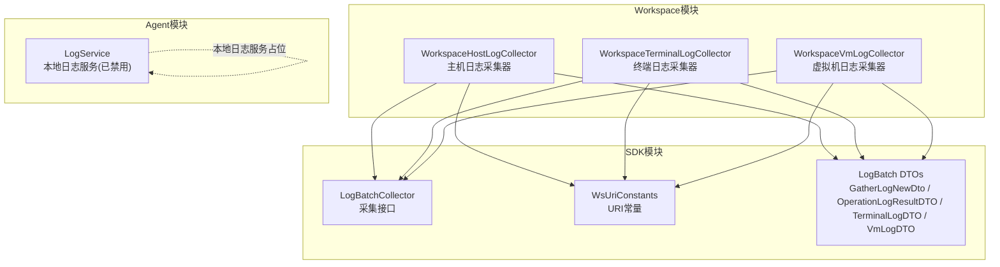
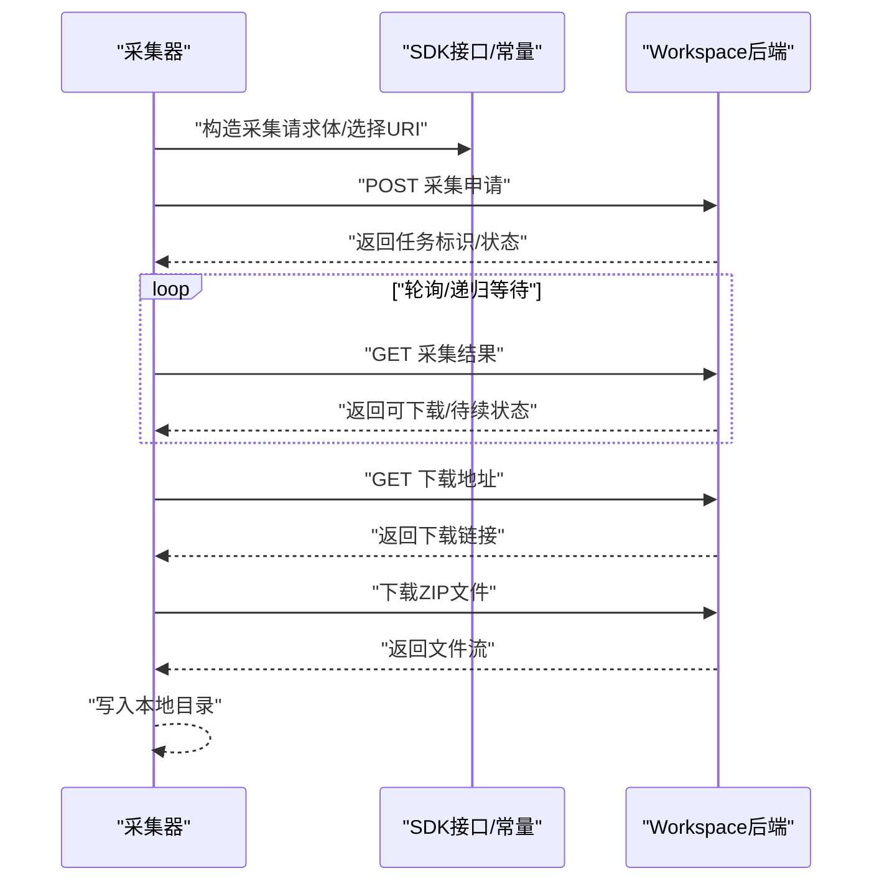
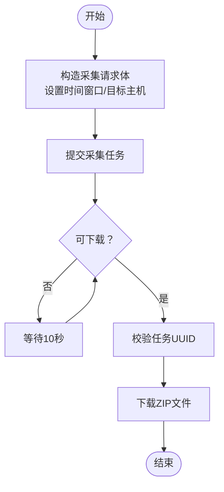
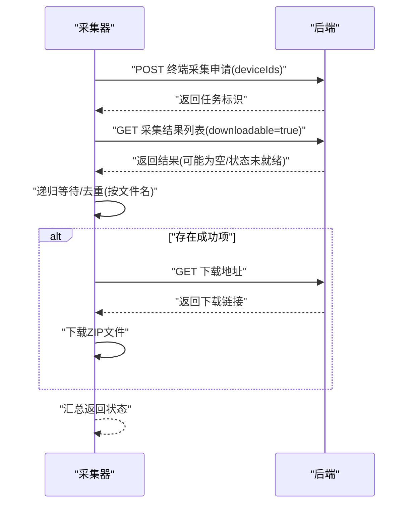
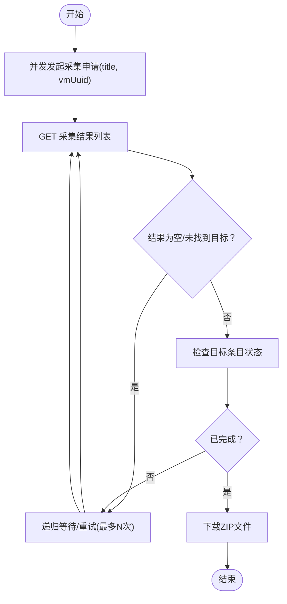
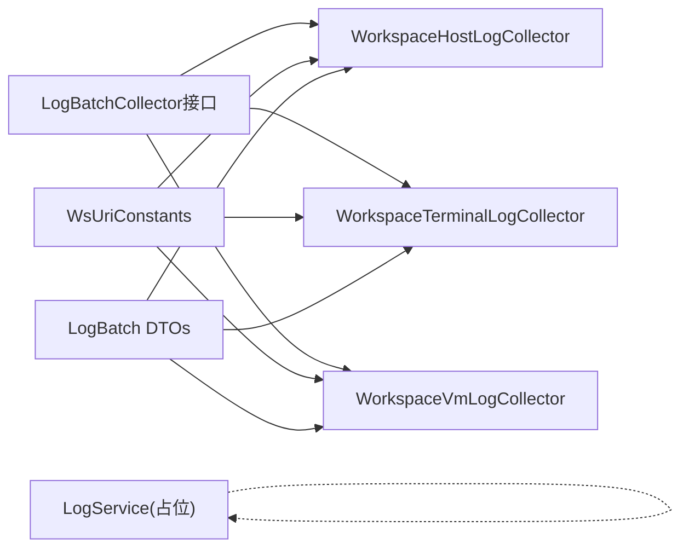

# Workspace日志监控

<cite>
**本文引用的文件**
- [WorkspaceHostLogCollector.java](file://watcher-workspace/src/main/java/com/virtual/cloud/om/workspace/service/batchlog/WorkspaceHostLogCollector.java)
- [WorkspaceTerminalLogCollector.java](file://watcher-workspace/src/main/java/com/virtual/cloud/om/workspace/service/batchlog/WorkspaceTerminalLogCollector.java)
- [WorkspaceVmLogCollector.java](file://watcher-workspace/src/main/java/com/virtual/cloud/om/workspace/service/batchlog/WorkspaceVmLogCollector.java)
- [LogBatchCollector.java](file://watcher-sdk/src/main/java/com/virtual/cloud/om/sdk/api/LogBatchCollector.java)
- [WsUriConstants.java](file://watcher-sdk/src/main/java/com/virtual/cloud/om/sdk/constant/uri/WsUriConstants.java)
- [LogBatchTargetsQueryDTO.java](file://watcher-sdk/src/main/java/com/virtual/cloud/om/sdk/dto/logBatch/LogBatchTargetsQueryDTO.java)
- [GatherLogNewDto.java](file://watcher-sdk/src/main/java/com/virtual/cloud/om/sdk/dto/logBatch/GatherLogNewDto.java)
- [OperationLogResultDTO.java](file://watcher-sdk/src/main/java/com/virtual/cloud/om/sdk/dto/logBatch/OperationLogResultDTO.java)
- [TerminalLogDTO.java](file://watcher-sdk/src/main/java/com/virtual/cloud/om/sdk/dto/logBatch/TerminalLogDTO.java)
- [VmLogDTO.java](file://watcher-sdk/src/main/java/com/virtual/cloud/om/sdk/dto/logBatch/VmLogDTO.java)
- [LogService.java](file://watcher-agent/src/main/java/com/virtual/cloud/om/agent/service/logs/LogService.java)
</cite>

## 目录
1. [简介](#简介)
2. [项目结构](#项目结构)
3. [核心组件](#核心组件)
4. [架构总览](#架构总览)
5. [详细组件分析](#详细组件分析)
6. [依赖关系分析](#依赖关系分析)
7. [性能考量](#性能考量)
8. [故障排查指南](#故障排查指南)
9. [结论](#结论)
10. [附录](#附录)

## 简介
本技术文档聚焦于Workspace平台的日志监控能力，围绕三类批量日志采集器展开：主机日志采集器、终端日志采集器与虚拟机日志采集器。文档将深入解析各采集器的实现架构、触发机制、数据传输协议与存储策略；明确不同日志类型的采集范围与处理流程（主机系统日志、终端操作日志、虚拟机运行日志）；给出采集配置要点（采集时间窗口、目标筛选、存储路径等）；并阐述日志预处理与格式化思路、错误处理与重试策略，以及与告警系统的集成方式。

## 项目结构
Workspace日志监控位于独立模块中，采用“采集器 + SDK + 接口常量 + DTO模型”的分层组织方式：
- 采集器实现：位于workspace模块，分别针对主机、终端、虚拟机三类日志提供批量采集逻辑
- SDK接口与常量：位于sdk模块，统一对外暴露采集接口、URI常量与数据传输对象
- Agent侧日志服务：位于agent模块，提供本地日志服务占位实现（当前版本禁用）

**图表来源**
- [WorkspaceHostLogCollector.java:30-94](file://watcher-workspace/src/main/java/com/virtual/cloud/om/workspace/service/batchlog/WorkspaceHostLogCollector.java#L30-L94)
- [WorkspaceTerminalLogCollector.java:31-152](file://watcher-workspace/src/main/java/com/virtual/cloud/om/workspace/service/batchlog/WorkspaceTerminalLogCollector.java#L31-L152)
- [WorkspaceVmLogCollector.java:33-151](file://watcher-workspace/src/main/java/com/virtual/cloud/om/workspace/service/batchlog/WorkspaceVmLogCollector.java#L33-L151)
- [LogBatchCollector.java:6-32](file://watcher-sdk/src/main/java/com/virtual/cloud/om/sdk/api/LogBatchCollector.java#L6-L32)
- [WsUriConstants.java:6-35](file://watcher-sdk/src/main/java/com/virtual/cloud/om/sdk/constant/uri/WsUriConstants.java#L6-L35)
- [LogService.java:17-50](file://watcher-agent/src/main/java/com/virtual/cloud/om/agent/service/logs/LogService.java#L17-L50)

**章节来源**
- [WorkspaceHostLogCollector.java:1-95](file://watcher-workspace/src/main/java/com/virtual/cloud/om/workspace/service/batchlog/WorkspaceHostLogCollector.java#L1-L95)
- [WorkspaceTerminalLogCollector.java:1-153](file://watcher-workspace/src/main/java/com/virtual/cloud/om/workspace/service/batchlog/WorkspaceTerminalLogCollector.java#L1-L153)
- [WorkspaceVmLogCollector.java:1-153](file://watcher-workspace/src/main/java/com/virtual/cloud/om/workspace/service/batchlog/WorkspaceVmLogCollector.java#L1-L153)
- [LogBatchCollector.java:1-33](file://watcher-sdk/src/main/java/com/virtual/cloud/om/sdk/api/LogBatchCollector.java#L1-L33)
- [WsUriConstants.java:1-195](file://watcher-sdk/src/main/java/com/virtual/cloud/om/sdk/constant/uri/WsUriConstants.java#L1-L195)
- [LogService.java:1-51](file://watcher-agent/src/main/java/com/virtual/cloud/om/agent/service/logs/LogService.java#L1-L51)

## 核心组件
- 采集接口：统一定义download方法与日志类型枚举，约束各采集器行为
- 采集器实现：
  - 主机日志采集器：面向主机节点树形目标，提交采集任务后轮询结果，最终下载打包日志
  - 终端日志采集器：对每个终端并发发起采集申请，聚合结果后按文件名去重并下载
  - 虚拟机日志采集器：对每台虚拟机并发发起采集申请，等待采集完成后再下载
- 数据传输对象：封装采集请求体、采集结果与下载元信息
- URI常量：集中管理各采集与下载接口路径
- 本地日志服务：当前版本处于占位状态，未启用持久化

**章节来源**
- [LogBatchCollector.java:6-32](file://watcher-sdk/src/main/java/com/virtual/cloud/om/sdk/api/LogBatchCollector.java#L6-L32)
- [WorkspaceHostLogCollector.java:33-88](file://watcher-workspace/src/main/java/com/virtual/cloud/om/workspace/service/batchlog/WorkspaceHostLogCollector.java#L33-L88)
- [WorkspaceTerminalLogCollector.java:34-96](file://watcher-workspace/src/main/java/com/virtual/cloud/om/workspace/service/batchlog/WorkspaceTerminalLogCollector.java#L34-L96)
- [WorkspaceVmLogCollector.java:36-89](file://watcher-workspace/src/main/java/com/virtual/cloud/om/workspace/service/batchlog/WorkspaceVmLogCollector.java#L36-L89)
- [WsUriConstants.java:6-35](file://watcher-sdk/src/main/java/com/virtual/cloud/om/sdk/constant/uri/WsUriConstants.java#L6-L35)
- [LogService.java:17-50](file://watcher-agent/src/main/java/com/virtual/cloud/om/agent/service/logs/LogService.java#L17-L50)

## 架构总览
整体架构遵循“采集器 → SDK接口/常量 → 远程服务”的分层设计。采集器通过统一的REST连接封装向Workspace后端发起采集与下载请求，并以ZIP包形式落盘到指定目录。

**图表来源**
- [WorkspaceHostLogCollector.java:34-87](file://watcher-workspace/src/main/java/com/virtual/cloud/om/workspace/service/batchlog/WorkspaceHostLogCollector.java#L34-L87)
- [WorkspaceTerminalLogCollector.java:34-96](file://watcher-workspace/src/main/java/com/virtual/cloud/om/workspace/service/batchlog/WorkspaceTerminalLogCollector.java#L34-L96)
- [WorkspaceVmLogCollector.java:36-89](file://watcher-workspace/src/main/java/com/virtual/cloud/om/workspace/service/batchlog/WorkspaceVmLogCollector.java#L36-L89)
- [WsUriConstants.java:6-35](file://watcher-sdk/src/main/java/com/virtual/cloud/om/sdk/constant/uri/WsUriConstants.java#L6-L35)

## 详细组件分析

### 主机日志采集器（WorkspaceHostLogCollector）
- 触发机制：接收目标主机树形节点集合，构造采集请求体并提交采集任务
- 结果轮询：持续查询采集结果，直到可下载状态或超时
- 下载策略：校验任务UUID一致性后，下载打包ZIP文件
- 返回结果：成功/失败/部分成功（由具体实现决定）

**图表来源**
- [WorkspaceHostLogCollector.java:34-87](file://watcher-workspace/src/main/java/com/virtual/cloud/om/workspace/service/batchlog/WorkspaceHostLogCollector.java#L34-L87)

**章节来源**
- [WorkspaceHostLogCollector.java:33-88](file://watcher-workspace/src/main/java/com/virtual/cloud/om/workspace/service/batchlog/WorkspaceHostLogCollector.java#L33-L88)
- [GatherLogNewDto.java:8-14](file://watcher-sdk/src/main/java/com/virtual/cloud/om/sdk/dto/logBatch/GatherLogNewDto.java#L8-L14)
- [OperationLogResultDTO.java:12-41](file://watcher-sdk/src/main/java/com/virtual/cloud/om/sdk/dto/logBatch/OperationLogResultDTO.java#L12-L41)
- [WsUriConstants.java:7-12](file://watcher-sdk/src/main/java/com/virtual/cloud/om/sdk/constant/uri/WsUriConstants.java#L7-L12)

### 终端日志采集器（WorkspaceTerminalLogCollector）
- 并发策略：对每个终端目标异步发起采集申请，聚合结果后按文件名去重
- 结果递归：若结果为空或状态字段缺失，进行有限次数递归查询
- 下载策略：仅对采集成功的日志执行下载
- 返回结果：综合多个目标的成功/失败情况，返回整体状态

**图表来源**
- [WorkspaceTerminalLogCollector.java:34-96](file://watcher-workspace/src/main/java/com/virtual/cloud/om/workspace/service/batchlog/WorkspaceTerminalLogCollector.java#L34-L96)
- [TerminalLogDTO.java:12-29](file://watcher-sdk/src/main/java/com/virtual/cloud/om/sdk/dto/logBatch/TerminalLogDTO.java#L12-L29)
- [WsUriConstants.java:21-26](file://watcher-sdk/src/main/java/com/virtual/cloud/om/sdk/constant/uri/WsUriConstants.java#L21-L26)

**章节来源**
- [WorkspaceTerminalLogCollector.java:34-146](file://watcher-workspace/src/main/java/com/virtual/cloud/om/workspace/service/batchlog/WorkspaceTerminalLogCollector.java#L34-L146)
- [TerminalLogDTO.java:12-29](file://watcher-sdk/src/main/java/com/virtual/cloud/om/sdk/dto/logBatch/TerminalLogDTO.java#L12-L29)
- [WsUriConstants.java:21-26](file://watcher-sdk/src/main/java/com/virtual/cloud/om/sdk/constant/uri/WsUriConstants.java#L21-L26)

### 虚拟机日志采集器（WorkspaceVmLogCollector）
- 并发策略：对每个虚拟机目标异步发起采集申请，等待采集完成
- 结果递归：按标题匹配目标日志条目，若状态未完成则继续轮询
- 下载策略：仅对采集成功的日志执行下载
- 返回结果：综合多个目标的成功/失败情况，返回整体状态

**图表来源**
- [WorkspaceVmLogCollector.java:36-89](file://watcher-workspace/src/main/java/com/virtual/cloud/om/workspace/service/batchlog/WorkspaceVmLogCollector.java#L36-L89)
- [VmLogDTO.java:12-27](file://watcher-sdk/src/main/java/com/virtual/cloud/om/sdk/dto/logBatch/VmLogDTO.java#L12-L27)
- [WsUriConstants.java:14-19](file://watcher-sdk/src/main/java/com/virtual/cloud/om/sdk/constant/uri/WsUriConstants.java#L14-L19)

**章节来源**
- [WorkspaceVmLogCollector.java:36-145](file://watcher-workspace/src/main/java/com/virtual/cloud/om/workspace/service/batchlog/WorkspaceVmLogCollector.java#L36-L145)
- [VmLogDTO.java:12-27](file://watcher-sdk/src/main/java/com/virtual/cloud/om/sdk/dto/logBatch/VmLogDTO.java#L12-L27)
- [WsUriConstants.java:14-19](file://watcher-sdk/src/main/java/com/virtual/cloud/om/sdk/constant/uri/WsUriConstants.java#L14-L19)

### 数据模型与传输协议
- 请求体模型
  - 主机采集：GatherLogNewDto，包含时间窗口、采集数量、目标主机树、目标类型标记
  - 终端/虚拟机采集：通过URI参数传递设备ID或虚拟机标识
- 响应模型
  - 主机采集结果：OperationLogResultDTO，包含可下载标志、随机UUID、时间窗口、目标主机列表等
  - 终端采集结果：TerminalLogDTO，包含任务名、设备ID、文件名、状态、计数、时间戳等
  - 虚拟机采集结果：VmLogDTO，包含标题、IP、文件名、状态、描述、时间戳等
- 传输协议
  - 采集申请：HTTP POST
  - 结果查询：HTTP GET
  - 文件下载：HTTP GET（后端返回下载链接，采集器直接下载）

**章节来源**
- [GatherLogNewDto.java:8-14](file://watcher-sdk/src/main/java/com/virtual/cloud/om/sdk/dto/logBatch/GatherLogNewDto.java#L8-L14)
- [OperationLogResultDTO.java:12-41](file://watcher-sdk/src/main/java/com/virtual/cloud/om/sdk/dto/logBatch/OperationLogResultDTO.java#L12-L41)
- [TerminalLogDTO.java:12-29](file://watcher-sdk/src/main/java/com/virtual/cloud/om/sdk/dto/logBatch/TerminalLogDTO.java#L12-L29)
- [VmLogDTO.java:12-27](file://watcher-sdk/src/main/java/com/virtual/cloud/om/sdk/dto/logBatch/VmLogDTO.java#L12-L27)
- [WsUriConstants.java:6-35](file://watcher-sdk/src/main/java/com/virtual/cloud/om/sdk/constant/uri/WsUriConstants.java#L6-L35)

### 日志采集范围与处理流程
- 主机系统日志
  - 采集范围：主机节点树形目标，按时间窗口与数量限制收集
  - 处理流程：提交任务 → 轮询结果 → 可下载后下载ZIP
- 终端操作日志
  - 采集范围：指定终端设备集合，按设备ID批量采集
  - 处理流程：并发申请 → 递归查询 → 去重 → 成功项下载
- 虚拟机运行日志
  - 采集范围：指定虚拟机集合，按标题与UUID匹配
  - 处理流程：并发申请 → 递归等待完成 → 成功项下载

**章节来源**
- [WorkspaceHostLogCollector.java:33-88](file://watcher-workspace/src/main/java/com/virtual/cloud/om/workspace/service/batchlog/WorkspaceHostLogCollector.java#L33-L88)
- [WorkspaceTerminalLogCollector.java:34-96](file://watcher-workspace/src/main/java/com/virtual/cloud/om/workspace/service/batchlog/WorkspaceTerminalLogCollector.java#L34-L96)
- [WorkspaceVmLogCollector.java:36-89](file://watcher-workspace/src/main/java/com/virtual/cloud/om/workspace/service/batchlog/WorkspaceVmLogCollector.java#L36-L89)

### 日志采集配置
- 采集时间窗口：主机采集请求体包含时间字段，用于限定日志时间范围
- 目标筛选：LogBatchTargetsQueryDTO提供标题与ID，终端/虚拟机采集通过URI参数传入
- 存储路径：download方法接收日志目录路径与票据号，采集器在该目录下按类型子目录存放ZIP文件
- 并发与重试：终端/虚拟机采集器采用异步并发与递归等待策略，避免阻塞

**章节来源**
- [GatherLogNewDto.java:8-14](file://watcher-sdk/src/main/java/com/virtual/cloud/om/sdk/dto/logBatch/GatherLogNewDto.java#L8-L14)
- [LogBatchTargetsQueryDTO.java:6-11](file://watcher-sdk/src/main/java/com/virtual/cloud/om/sdk/dto/logBatch/LogBatchTargetsQueryDTO.java#L6-L11)
- [WorkspaceTerminalLogCollector.java:34-96](file://watcher-workspace/src/main/java/com/virtual/cloud/om/workspace/service/batchlog/WorkspaceTerminalLogCollector.java#L34-L96)
- [WorkspaceVmLogCollector.java:36-89](file://watcher-workspace/src/main/java/com/virtual/cloud/om/workspace/service/batchlog/WorkspaceVmLogCollector.java#L36-L89)

### 日志数据预处理与格式化
- 预处理阶段
  - 终端日志：按文件名分组并去重，确保同一文件仅保留一个采集记录
  - 虚拟机日志：按标题匹配目标条目，等待状态完成后再处理
- 格式化输出
  - 采集器将后端返回的ZIP文件直接写入本地目录，便于后续统一处理
  - 本地日志服务当前处于占位状态，未启用持久化

**章节来源**
- [WorkspaceTerminalLogCollector.java:65-73](file://watcher-workspace/src/main/java/com/virtual/cloud/om/workspace/service/batchlog/WorkspaceTerminalLogCollector.java#L65-L73)
- [WorkspaceVmLogCollector.java:58-76](file://watcher-workspace/src/main/java/com/virtual/cloud/om/workspace/service/batchlog/WorkspaceVmLogCollector.java#L58-L76)
- [LogService.java:17-50](file://watcher-agent/src/main/java/com/virtual/cloud/om/agent/service/logs/LogService.java#L17-L50)

### 错误处理与重试机制
- 异常捕获：采集器在调用后端接口时使用统一结果校验工具，异常将被记录并影响最终状态
- 重试策略：
  - 主机日志：固定周期轮询，直至可下载
  - 终端日志：递归查询，限定最大次数，避免无限等待
  - 虚拟机日志：按状态轮询，限定最大次数，按标题匹配目标条目
- 返回状态：综合多个目标的成功/失败，返回整体状态（成功/部分成功/失败）

**章节来源**
- [WorkspaceHostLogCollector.java:58-71](file://watcher-workspace/src/main/java/com/virtual/cloud/om/workspace/service/batchlog/WorkspaceHostLogCollector.java#L58-L71)
- [WorkspaceTerminalLogCollector.java:112-145](file://watcher-workspace/src/main/java/com/virtual/cloud/om/workspace/service/batchlog/WorkspaceTerminalLogCollector.java#L112-L145)
- [WorkspaceVmLogCollector.java:106-145](file://watcher-workspace/src/main/java/com/virtual/cloud/om/workspace/service/batchlog/WorkspaceVmLogCollector.java#L106-L145)

### 与告警系统的集成
- 告警接口：SDK提供告警相关URI常量，可用于查询实时告警与各类告警列表
- 集成建议：
  - 在日志采集完成后，结合采集结果与日志内容，触发相应告警事件
  - 利用告警URI进行告警状态查询与联动处理

**章节来源**
- [WsUriConstants.java:160-169](file://watcher-sdk/src/main/java/com/virtual/cloud/om/sdk/constant/uri/WsUriConstants.java#L160-L169)

## 依赖关系分析
- 采集器依赖SDK接口与URI常量，确保与后端服务的契约一致
- DTO模型作为数据载体，贯穿采集、结果与下载环节
- 本地日志服务当前未启用，不影响采集链路

**图表来源**
- [LogBatchCollector.java:6-32](file://watcher-sdk/src/main/java/com/virtual/cloud/om/sdk/api/LogBatchCollector.java#L6-L32)
- [WorkspaceHostLogCollector.java:30-94](file://watcher-workspace/src/main/java/com/virtual/cloud/om/workspace/service/batchlog/WorkspaceHostLogCollector.java#L30-L94)
- [WorkspaceTerminalLogCollector.java:31-152](file://watcher-workspace/src/main/java/com/virtual/cloud/om/workspace/service/batchlog/WorkspaceTerminalLogCollector.java#L31-L152)
- [WorkspaceVmLogCollector.java:33-151](file://watcher-workspace/src/main/java/com/virtual/cloud/om/workspace/service/batchlog/WorkspaceVmLogCollector.java#L33-L151)
- [WsUriConstants.java:6-35](file://watcher-sdk/src/main/java/com/virtual/cloud/om/sdk/constant/uri/WsUriConstants.java#L6-L35)
- [LogService.java:17-50](file://watcher-agent/src/main/java/com/virtual/cloud/om/agent/service/logs/LogService.java#L17-L50)

**章节来源**
- [LogBatchCollector.java:1-33](file://watcher-sdk/src/main/java/com/virtual/cloud/om/sdk/api/LogBatchCollector.java#L1-L33)
- [WorkspaceHostLogCollector.java:1-95](file://watcher-workspace/src/main/java/com/virtual/cloud/om/workspace/service/batchlog/WorkspaceHostLogCollector.java#L1-L95)
- [WorkspaceTerminalLogCollector.java:1-153](file://watcher-workspace/src/main/java/com/virtual/cloud/om/workspace/service/batchlog/WorkspaceTerminalLogCollector.java#L1-L153)
- [WorkspaceVmLogCollector.java:1-153](file://watcher-workspace/src/main/java/com/virtual/cloud/om/workspace/service/batchlog/WorkspaceVmLogCollector.java#L1-L153)
- [WsUriConstants.java:1-195](file://watcher-sdk/src/main/java/com/virtual/cloud/om/sdk/constant/uri/WsUriConstants.java#L1-L195)
- [LogService.java:1-51](file://watcher-agent/src/main/java/com/virtual/cloud/om/agent/service/logs/LogService.java#L1-L51)

## 性能考量
- 并发优化：终端与虚拟机采集器采用异步并发，显著缩短整体采集时间
- 轮询节流：主机采集器固定周期轮询，避免频繁请求；终端/虚拟机采集器递归等待，限制最大次数
- I/O优化：直接下载ZIP文件至本地目录，减少中间处理步骤
- 扩展性：通过SDK接口与URI常量抽象，便于新增采集类型与后端变更

## 故障排查指南
- 采集申请失败
  - 检查后端返回状态与异常日志，确认网络连通与认证信息
  - 核对目标ID与URI参数是否正确
- 结果查询为空或状态缺失
  - 终端采集器会进行有限次数递归等待；如仍为空，需检查目标是否存在或权限是否足够
- 采集完成但未下载
  - 校验下载链接有效性与权限；确认本地目录写入权限
- 返回状态为部分成功
  - 检查个别目标的采集结果与下载日志，定位失败原因并重试

**章节来源**
- [WorkspaceHostLogCollector.java:58-71](file://watcher-workspace/src/main/java/com/virtual/cloud/om/workspace/service/batchlog/WorkspaceHostLogCollector.java#L58-L71)
- [WorkspaceTerminalLogCollector.java:112-145](file://watcher-workspace/src/main/java/com/virtual/cloud/om/workspace/service/batchlog/WorkspaceTerminalLogCollector.java#L112-L145)
- [WorkspaceVmLogCollector.java:106-145](file://watcher-workspace/src/main/java/com/virtual/cloud/om/workspace/service/batchlog/WorkspaceVmLogCollector.java#L106-L145)

## 结论
Workspace日志监控通过三类采集器实现了对主机、终端与虚拟机日志的统一采集与下载。采集器遵循SDK契约，采用并发与递归策略提升效率与稳定性；通过ZIP文件落盘与后续处理流程，满足日志归档与分析需求。当前本地日志服务处于占位状态，不影响采集链路；建议在采集完成后结合日志内容与告警接口实现告警联动。

## 附录
- 关键URI一览
  - 主机日志：采集、结果查询、下载
  - 终端日志：采集、结果列表、下载
  - 虚拟机日志：采集、结果列表、下载
- 建议的后续增强
  - 启用本地日志服务，支持日志持久化与查询
  - 引入日志过滤规则与标签体系，提升检索效率
  - 扩展采集类型与后端适配器，覆盖更多场景

**章节来源**
- [WsUriConstants.java:6-35](file://watcher-sdk/src/main/java/com/virtual/cloud/om/sdk/constant/uri/WsUriConstants.java#L6-L35)