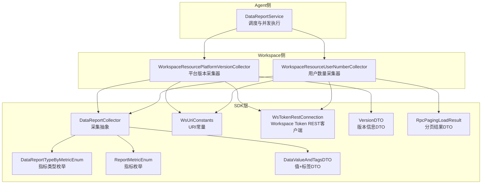
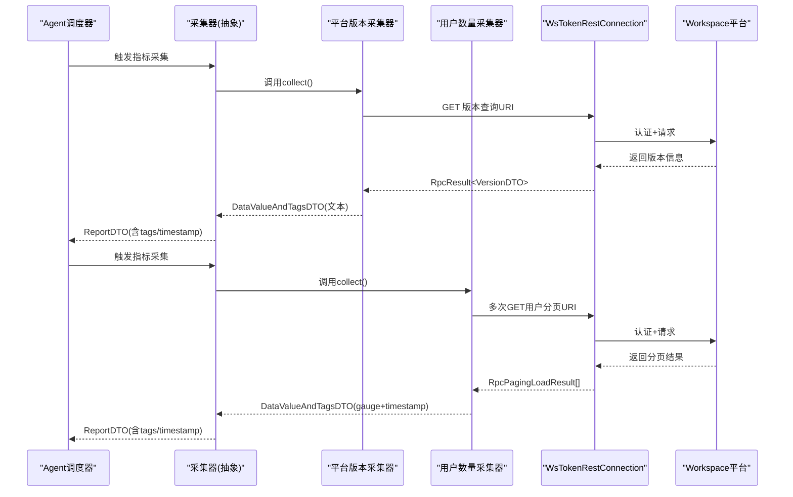
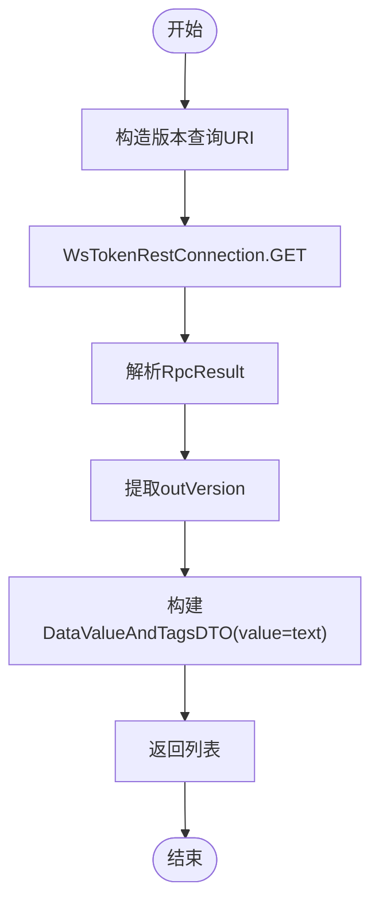
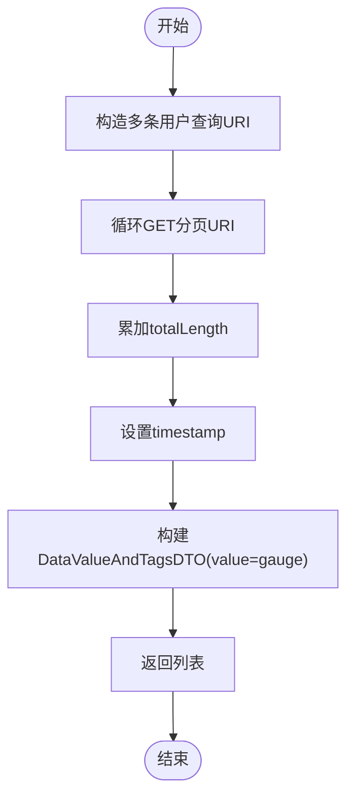
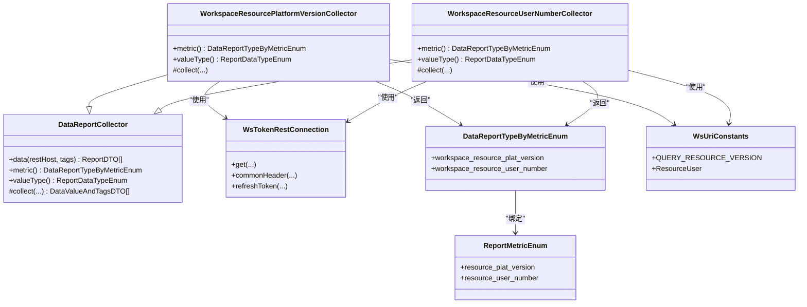

# Workspace资源监控

<cite>
**本文引用的文件**
- [WorkspaceResourcePlatformVersionCollector.java](file://watcher-workspace/src/main/java/com/virtual/cloud/om/workspace/service/report/WorkspaceResourcePlatformVersionCollector.java)
- [WorkspaceResourceUserNumberCollector.java](file://watcher-workspace/src/main/java/com/virtual/cloud/om/workspace/service/report/WorkspaceResourceUserNumberCollector.java)
- [WsUriConstants.java](file://watcher-sdk/src/main/java/com/virtual/cloud/om/sdk/constant/uri/WsUriConstants.java)
- [WsTokenRestConnection.java](file://watcher-sdk/src/main/java/com/virtual/cloud/om/sdk/config/token/workspace/WsTokenRestConnection.java)
- [DataReportTypeByMetricEnum.java](file://watcher-sdk/src/main/java/com/virtual/cloud/om/sdk/constant/DataReportTypeByMetricEnum.java)
- [ReportMetricEnum.java](file://watcher-sdk/src/main/java/com/virtual/cloud/om/sdk/constant/report/ReportMetricEnum.java)
- [DataReportCollector.java](file://watcher-sdk/src/main/java/com/virtual/cloud/om/sdk/api/DataReportCollector.java)
- [VersionDTO.java](file://watcher-sdk/src/main/java/com/virtual/cloud/om/sdk/dto/dataReport/workspace/VersionDTO.java)
- [RpcPagingLoadResult.java](file://watcher-sdk/src/main/java/com/virtual/cloud/om/sdk/dto/RpcPagingLoadResult.java)
- [WsUserTypeEnum.java](file://watcher-sdk/src/main/java/com/virtual/cloud/om/sdk/constant/WsUserTypeEnum.java)
- [DataValueAndTagsDTO.java](file://watcher-sdk/src/main/java/com/virtual/cloud/om/sdk/dto/dataReport/DataValueAndTagsDTO.java)
- [DataReportService.java](file://watcher-agent/src/main/java/com/virtual/cloud/om/agent/service/report/DataReportService.java)
</cite>

## 目录
1. [简介](#简介)
2. [项目结构](#项目结构)
3. [核心组件](#核心组件)
4. [架构总览](#架构总览)
5. [详细组件分析](#详细组件分析)
6. [依赖分析](#依赖分析)
7. [性能考虑](#性能考虑)
8. [故障排查指南](#故障排查指南)
9. [结论](#结论)
10. [附录](#附录)

## 简介
本技术文档聚焦于Workspace资源监控功能，围绕两个核心采集器展开：平台版本监控器WorkspaceResourcePlatformVersionCollector与用户数量监控器WorkspaceResourceUserNumberCollector。前者负责采集并上报Workspace平台的版本信息，支撑版本分布与升级状态分析；后者负责统计用户规模与来源构成，支持用户画像与活跃度分析。文档将深入解析采集策略、数据模型、处理流程、关键指标与性能优化建议，并给出可操作的排障指引。

## 项目结构
- Workspace侧监控采集器位于watcher-workspace模块，分别实现平台版本与用户数量两类指标。
- SDK层提供统一的采集抽象、指标枚举、URI常量、REST客户端与数据传输对象。
- Agent侧通过调度器按策略并发触发各类采集器，统一组装上报数据。

图表来源
- [DataReportService.java:186-273](file://watcher-agent/src/main/java/com/virtual/cloud/om/agent/service/report/DataReportService.java#L186-L273)
- [DataReportCollector.java:1-118](file://watcher-sdk/src/main/java/com/virtual/cloud/om/sdk/api/DataReportCollector.java#L1-L118)
- [DataReportTypeByMetricEnum.java:1-190](file://watcher-sdk/src/main/java/com/virtual/cloud/om/sdk/constant/DataReportTypeByMetricEnum.java#L1-L190)
- [ReportMetricEnum.java:1-118](file://watcher-sdk/src/main/java/com/virtual/cloud/om/sdk/constant/report/ReportMetricEnum.java#L1-L118)
- [WsUriConstants.java:1-195](file://watcher-sdk/src/main/java/com/virtual/cloud/om/sdk/constant/uri/WsUriConstants.java#L1-L195)
- [WsTokenRestConnection.java:1-380](file://watcher-sdk/src/main/java/com/virtual/cloud/om/sdk/config/token/workspace/WsTokenRestConnection.java#L1-L380)
- [VersionDTO.java:1-30](file://watcher-sdk/src/main/java/com/virtual/cloud/om/sdk/dto/dataReport/workspace/VersionDTO.java#L1-L30)
- [RpcPagingLoadResult.java:1-80](file://watcher-sdk/src/main/java/com/virtual/cloud/om/sdk/dto/RpcPagingLoadResult.java#L1-L80)
- [DataValueAndTagsDTO.java:1-17](file://watcher-sdk/src/main/java/com/virtual/cloud/om/sdk/dto/dataReport/DataValueAndTagsDTO.java#L1-L17)
- [WorkspaceResourcePlatformVersionCollector.java:1-51](file://watcher-workspace/src/main/java/com/virtual/cloud/om/workspace/service/report/WorkspaceResourcePlatformVersionCollector.java#L1-L51)
- [WorkspaceResourceUserNumberCollector.java:1-62](file://watcher-workspace/src/main/java/com/virtual/cloud/om/workspace/service/report/WorkspaceResourceUserNumberCollector.java#L1-L62)

章节来源
- [WorkspaceResourcePlatformVersionCollector.java:1-51](file://watcher-workspace/src/main/java/com/virtual/cloud/om/workspace/service/report/WorkspaceResourcePlatformVersionCollector.java#L1-L51)
- [WorkspaceResourceUserNumberCollector.java:1-62](file://watcher-workspace/src/main/java/com/virtual/cloud/om/workspace/service/report/WorkspaceResourceUserNumberCollector.java#L1-L62)
- [WsUriConstants.java:1-195](file://watcher-sdk/src/main/java/com/virtual/cloud/om/sdk/constant/uri/WsUriConstants.java#L1-L195)
- [WsTokenRestConnection.java:1-380](file://watcher-sdk/src/main/java/com/virtual/cloud/om/sdk/config/token/workspace/WsTokenRestConnection.java#L1-L380)
- [DataReportTypeByMetricEnum.java:1-190](file://watcher-sdk/src/main/java/com/virtual/cloud/om/sdk/constant/DataReportTypeByMetricEnum.java#L1-L190)
- [ReportMetricEnum.java:1-118](file://watcher-sdk/src/main/java/com/virtual/cloud/om/sdk/constant/report/ReportMetricEnum.java#L1-L118)
- [DataReportCollector.java:1-118](file://watcher-sdk/src/main/java/com/virtual/cloud/om/sdk/api/DataReportCollector.java#L1-L118)
- [VersionDTO.java:1-30](file://watcher-sdk/src/main/java/com/virtual/cloud/om/sdk/dto/dataReport/workspace/VersionDTO.java#L1-L30)
- [RpcPagingLoadResult.java:1-80](file://watcher-sdk/src/main/java/com/virtual/cloud/om/sdk/dto/RpcPagingLoadResult.java#L1-L80)
- [WsUserTypeEnum.java:1-20](file://watcher-sdk/src/main/java/com/virtual/cloud/om/sdk/constant/WsUserTypeEnum.java#L1-L20)
- [DataValueAndTagsDTO.java:1-17](file://watcher-sdk/src/main/java/com/virtual/cloud/om/sdk/dto/dataReport/DataValueAndTagsDTO.java#L1-L17)
- [DataReportService.java:186-273](file://watcher-agent/src/main/java/com/virtual/cloud/om/agent/service/report/DataReportService.java#L186-L273)

## 核心组件
- 平台版本监控器WorkspaceResourcePlatformVersionCollector
  - 职责：从Workspace平台查询版本信息，输出文本型指标（版本号）。
  - 关键点：使用带Token的REST客户端访问版本查询URI，封装为DataValueAndTagsDTO并返回。
- 用户数量监控器WorkspaceResourceUserNumberCollector
  - 职责：统计本地用户、域用户、LDAP用户及管理员总数，输出计量型指标（gauge）。
  - 关键点：构造多条URI进行分页查询，累加totalLength得到总量；设置timestamp用于时间序列分析。

章节来源
- [WorkspaceResourcePlatformVersionCollector.java:23-50](file://watcher-workspace/src/main/java/com/virtual/cloud/om/workspace/service/report/WorkspaceResourcePlatformVersionCollector.java#L23-L50)
- [WorkspaceResourceUserNumberCollector.java:25-61](file://watcher-workspace/src/main/java/com/virtual/cloud/om/workspace/service/report/WorkspaceResourceUserNumberCollector.java#L25-L61)

## 架构总览
下图展示了从Agent调度到具体采集器的数据流与交互关系：

图表来源
- [DataReportService.java:186-273](file://watcher-agent/src/main/java/com/virtual/cloud/om/agent/service/report/DataReportService.java#L186-L273)
- [DataReportCollector.java:48-86](file://watcher-sdk/src/main/java/com/virtual/cloud/om/sdk/api/DataReportCollector.java#L48-L86)
- [WorkspaceResourcePlatformVersionCollector.java:26-39](file://watcher-workspace/src/main/java/com/virtual/cloud/om/workspace/service/report/WorkspaceResourcePlatformVersionCollector.java#L26-L39)
- [WorkspaceResourceUserNumberCollector.java:30-49](file://watcher-workspace/src/main/java/com/virtual/cloud/om/workspace/service/report/WorkspaceResourceUserNumberCollector.java#L30-L49)
- [WsTokenRestConnection.java:128-177](file://watcher-sdk/src/main/java/com/virtual/cloud/om/sdk/config/token/workspace/WsTokenRestConnection.java#L128-L177)
- [WsUriConstants.java:37-174](file://watcher-sdk/src/main/java/com/virtual/cloud/om/sdk/constant/uri/WsUriConstants.java#L37-L174)

## 详细组件分析

### 平台版本监控器 WorkspaceResourcePlatformVersionCollector
- 实现要点
  - 使用WsTokenRestConnection发起GET请求至WsUriConstants.QUERY_RESOURCE_VERSION。
  - 解析RpcResult<VersionDTO>，提取outVersion作为指标值。
  - 将value、tags封装为DataValueAndTagsDTO，返回单元素列表。
  - 指标类型为workspace_resource_plat_version，值类型为text。
- 数据模型
  - VersionDTO包含外部版本号、CAS外部版本号、ONESTOR外部版本号、编译版本号、公司品牌等字段；采集器仅使用outVersion。
- 关键流程

图表来源
- [WorkspaceResourcePlatformVersionCollector.java:26-39](file://watcher-workspace/src/main/java/com/virtual/cloud/om/workspace/service/report/WorkspaceResourcePlatformVersionCollector.java#L26-L39)
- [WsTokenRestConnection.java:179-214](file://watcher-sdk/src/main/java/com/virtual/cloud/om/sdk/config/token/workspace/WsTokenRestConnection.java#L179-L214)
- [WsUriConstants.java:37-37](file://watcher-sdk/src/main/java/com/virtual/cloud/om/sdk/constant/uri/WsUriConstants.java#L37-L37)
- [VersionDTO.java:15-16](file://watcher-sdk/src/main/java/com/virtual/cloud/om/sdk/dto/dataReport/workspace/VersionDTO.java#L15-L16)

章节来源
- [WorkspaceResourcePlatformVersionCollector.java:23-50](file://watcher-workspace/src/main/java/com/virtual/cloud/om/workspace/service/report/WorkspaceResourcePlatformVersionCollector.java#L23-L50)
- [WsUriConstants.java:37-37](file://watcher-sdk/src/main/java/com/virtual/cloud/om/sdk/constant/uri/WsUriConstants.java#L37-L37)
- [WsTokenRestConnection.java:179-214](file://watcher-sdk/src/main/java/com/virtual/cloud/om/sdk/config/token/workspace/WsTokenRestConnection.java#L179-L214)
- [VersionDTO.java:1-30](file://watcher-sdk/src/main/java/com/virtual/cloud/om/sdk/dto/dataReport/workspace/VersionDTO.java#L1-L30)

### 用户数量监控器 WorkspaceResourceUserNumberCollector
- 实现要点
  - 针对三类普通用户（本地、域、LDAP）与管理员，构造多条URI进行查询。
  - 使用WsUriConstants.ResourceUser.QUERY_USER与OPERATOR，分页拉取，累加totalLength。
  - 设置timestamp为采集时刻，返回gauge型指标。
- 数据模型
  - RpcPagingLoadResult提供offset、totalLength、totalPages等字段，采集器仅使用totalLength。
- 关键流程

图表来源
- [WorkspaceResourceUserNumberCollector.java:30-49](file://watcher-workspace/src/main/java/com/virtual/cloud/om/workspace/service/report/WorkspaceResourceUserNumberCollector.java#L30-L49)
- [WsUriConstants.java:171-174](file://watcher-sdk/src/main/java/com/virtual/cloud/om/sdk/constant/uri/WsUriConstants.java#L171-L174)
- [WsTokenRestConnection.java:179-214](file://watcher-sdk/src/main/java/com/virtual/cloud/om/sdk/config/token/workspace/WsTokenRestConnection.java#L179-L214)
- [RpcPagingLoadResult.java:67-68](file://watcher-sdk/src/main/java/com/virtual/cloud/om/sdk/dto/RpcPagingLoadResult.java#L67-L68)
- [WsUserTypeEnum.java:6-10](file://watcher-sdk/src/main/java/com/virtual/cloud/om/sdk/constant/WsUserTypeEnum.java#L6-L10)

章节来源
- [WorkspaceResourceUserNumberCollector.java:25-61](file://watcher-workspace/src/main/java/com/virtual/cloud/om/workspace/service/report/WorkspaceResourceUserNumberCollector.java#L25-L61)
- [WsUriConstants.java:171-174](file://watcher-sdk/src/main/java/com/virtual/cloud/om/sdk/constant/uri/WsUriConstants.java#L171-L174)
- [RpcPagingLoadResult.java:1-80](file://watcher-sdk/src/main/java/com/virtual/cloud/om/sdk/dto/RpcPagingLoadResult.java#L1-L80)
- [WsUserTypeEnum.java:1-20](file://watcher-sdk/src/main/java/com/virtual/cloud/om/sdk/constant/WsUserTypeEnum.java#L1-L20)

### 采集策略与数据聚合
- 采集策略
  - 平台版本：一次性查询，返回单一文本值。
  - 用户数量：多URI聚合，基于分页结果的总数累加。
- 时间窗口与聚合
  - 用户数量采集器显式设置timestamp，便于后续按时间窗口聚合。
  - Agent侧按策略并发调度，统一在DataReportCollector.data中统一时戳。
- 指标类型
  - 平台版本：text（适合分组统计与版本分布）。
  - 用户数量：gauge（适合趋势与对比分析）。

章节来源
- [DataReportCollector.java:48-86](file://watcher-sdk/src/main/java/com/virtual/cloud/om/sdk/api/DataReportCollector.java#L48-L86)
- [WorkspaceResourcePlatformVersionCollector.java:41-49](file://watcher-workspace/src/main/java/com/virtual/cloud/om/workspace/service/report/WorkspaceResourcePlatformVersionCollector.java#L41-L49)
- [WorkspaceResourceUserNumberCollector.java:52-60](file://watcher-workspace/src/main/java/com/virtual/cloud/om/workspace/service/report/WorkspaceResourceUserNumberCollector.java#L52-L60)

## 依赖分析
- 指标枚举与类型绑定
  - DataReportTypeByMetricEnum中定义了workspace_resource_plat_version与workspace_resource_user_number两类指标，明确其metric与platform绑定关系。
  - ReportMetricEnum中定义了resource_plat_version与resource_user_number两类指标语义。
- 采集器与枚举的耦合
  - 采集器通过metric()方法返回DataReportTypeByMetricEnum项，确保Agent侧能正确路由到具体实现。
- REST客户端与认证
  - WsTokenRestConnection提供统一的HTTP方法封装与Cookie令牌管理，自动处理401刷新逻辑，降低采集器复杂度。

图表来源
- [DataReportCollector.java:1-118](file://watcher-sdk/src/main/java/com/virtual/cloud/om/sdk/api/DataReportCollector.java#L1-L118)
- [WorkspaceResourcePlatformVersionCollector.java:1-51](file://watcher-workspace/src/main/java/com/virtual/cloud/om/workspace/service/report/WorkspaceResourcePlatformVersionCollector.java#L1-L51)
- [WorkspaceResourceUserNumberCollector.java:1-62](file://watcher-workspace/src/main/java/com/virtual/cloud/om/workspace/service/report/WorkspaceResourceUserNumberCollector.java#L1-L62)
- [WsTokenRestConnection.java:1-380](file://watcher-sdk/src/main/java/com/virtual/cloud/om/sdk/config/token/workspace/WsTokenRestConnection.java#L1-L380)
- [DataReportTypeByMetricEnum.java:95-97](file://watcher-sdk/src/main/java/com/virtual/cloud/om/sdk/constant/DataReportTypeByMetricEnum.java#L95-L97)
- [ReportMetricEnum.java:20-57](file://watcher-sdk/src/main/java/com/virtual/cloud/om/sdk/constant/report/ReportMetricEnum.java#L20-L57)
- [WsUriConstants.java:37-174](file://watcher-sdk/src/main/java/com/virtual/cloud/om/sdk/constant/uri/WsUriConstants.java#L37-L174)

章节来源
- [DataReportTypeByMetricEnum.java:1-190](file://watcher-sdk/src/main/java/com/virtual/cloud/om/sdk/constant/DataReportTypeByMetricEnum.java#L1-L190)
- [ReportMetricEnum.java:1-118](file://watcher-sdk/src/main/java/com/virtual/cloud/om/sdk/constant/report/ReportMetricEnum.java#L1-L118)
- [WsTokenRestConnection.java:1-380](file://watcher-sdk/src/main/java/com/virtual/cloud/om/sdk/config/token/workspace/WsTokenRestConnection.java#L1-L380)
- [WsUriConstants.java:1-195](file://watcher-sdk/src/main/java/com/virtual/cloud/om/sdk/constant/uri/WsUriConstants.java#L1-L195)

## 性能考虑
- 并发调度
  - Agent侧通过DataReportService按策略并发执行采集器，减少整体采集时延。
- Token缓存与锁
  - WsTokenRestConnection采用内存缓存与分布式锁机制避免重复登录与并发刷新，提升稳定性与吞吐。
- 分页查询优化
  - 用户数量采集器使用小批量limit（示例为10），通过totalLength直接累加，避免全量拉取带来的压力。
- 上报统一时戳
  - DataReportCollector在data方法内统一时戳，保证时间序列一致性与可比性。

章节来源
- [DataReportService.java:186-273](file://watcher-agent/src/main/java/com/virtual/cloud/om/agent/service/report/DataReportService.java#L186-L273)
- [WsTokenRestConnection.java:54-121](file://watcher-sdk/src/main/java/com/virtual/cloud/om/sdk/config/token/workspace/WsTokenRestConnection.java#L54-L121)
- [WorkspaceResourceUserNumberCollector.java:34-45](file://watcher-workspace/src/main/java/com/virtual/cloud/om/workspace/service/report/WorkspaceResourceUserNumberCollector.java#L34-L45)
- [DataReportCollector.java:48-86](file://watcher-sdk/src/main/java/com/virtual/cloud/om/sdk/api/DataReportCollector.java#L48-L86)

## 故障排查指南
- 401未授权
  - 现象：调用REST接口返回401。
  - 处理：WsTokenRestConnection在捕获UNAUTHORIZED时主动清理缓存并刷新Token后重试。
- URI不匹配或路径错误
  - 现象：NOT_FOUND或路径异常。
  - 处理：确认WsUriConstants中URI拼写与平台一致；必要时检查协议、端口与主机配置。
- 结果为空或总数为0
  - 现象：用户数量为0或版本号为空。
  - 排查：确认用户查询URI参数（offset、limit、userType）与平台实际接口一致；确认平台存在目标用户类型。
- 采集耗时过长
  - 现象：单次采集耗时较长。
  - 排查：检查网络延迟、平台响应时间；适当调整分页大小与并发度；关注Token刷新频率。

章节来源
- [WsTokenRestConnection.java:128-177](file://watcher-sdk/src/main/java/com/virtual/cloud/om/sdk/config/token/workspace/WsTokenRestConnection.java#L128-L177)
- [WsUriConstants.java:37-174](file://watcher-sdk/src/main/java/com/virtual/cloud/om/sdk/constant/uri/WsUriConstants.java#L37-L174)
- [WorkspaceResourceUserNumberCollector.java:34-45](file://watcher-workspace/src/main/java/com/virtual/cloud/om/workspace/service/report/WorkspaceResourceUserNumberCollector.java#L34-L45)
- [WorkspaceResourcePlatformVersionCollector.java:30-35](file://watcher-workspace/src/main/java/com/virtual/cloud/om/workspace/service/report/WorkspaceResourcePlatformVersionCollector.java#L30-L35)

## 结论
Workspace资源监控通过标准化的采集抽象与统一的指标枚举，实现了平台版本与用户数量两类关键指标的稳定采集。平台版本采集器以轻量查询支撑版本分布与升级趋势分析；用户数量采集器以多源聚合支撑用户画像与规模趋势分析。结合Agent侧并发调度与SDK层的REST客户端能力，整体具备良好的扩展性与可维护性。

## 附录

### 关键指标说明
- 平台版本（workspace_resource_plat_version）
  - 类型：text
  - 含义：Workspace平台外部版本号，用于版本分布统计与升级状态追踪。
  - 计算：从VersionDTO中提取outVersion。
- 用户数量（workspace_resource_user_number）
  - 类型：gauge
  - 含义：普通用户（本地、域、LDAP）与管理员的总人数，支持时间序列趋势分析。
  - 计算：对本地、域、LDAP用户与管理员的分页查询结果累加totalLength。

章节来源
- [DataReportTypeByMetricEnum.java:88-97](file://watcher-sdk/src/main/java/com/virtual/cloud/om/sdk/constant/DataReportTypeByMetricEnum.java#L88-L97)
- [ReportMetricEnum.java:20-57](file://watcher-sdk/src/main/java/com/virtual/cloud/om/sdk/constant/report/ReportMetricEnum.java#L20-L57)
- [VersionDTO.java:15-16](file://watcher-sdk/src/main/java/com/virtual/cloud/om/sdk/dto/dataReport/workspace/VersionDTO.java#L15-L16)
- [RpcPagingLoadResult.java:67-68](file://watcher-sdk/src/main/java/com/virtual/cloud/om/sdk/dto/RpcPagingLoadResult.java#L67-L68)