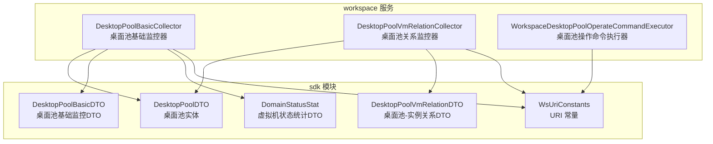
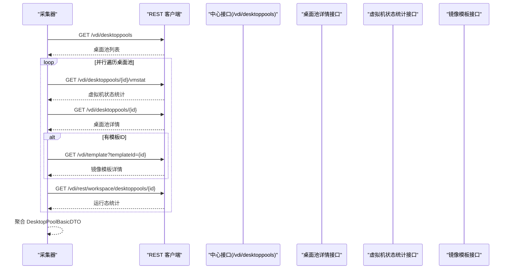
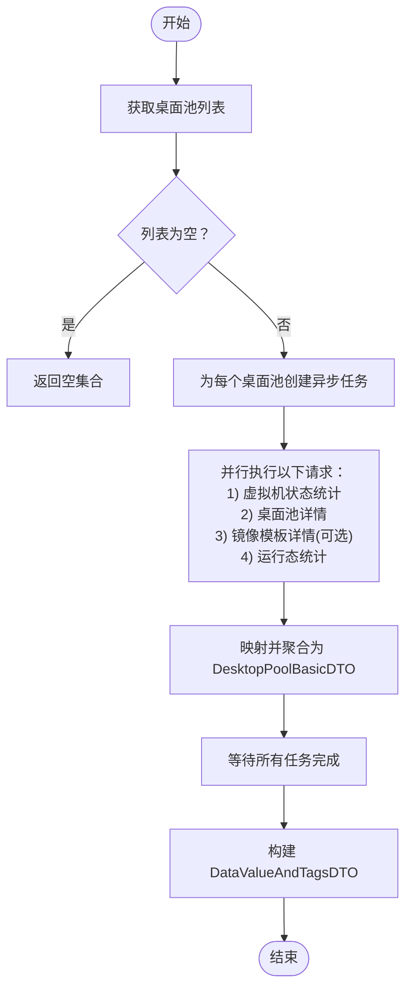
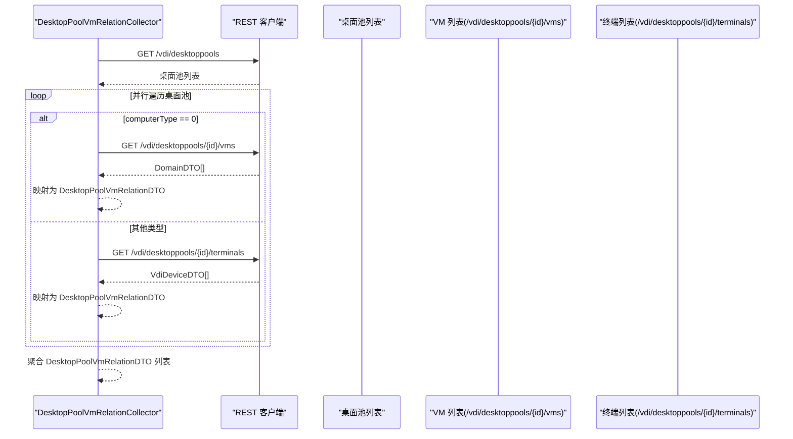
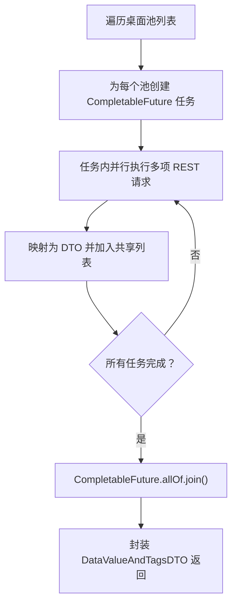
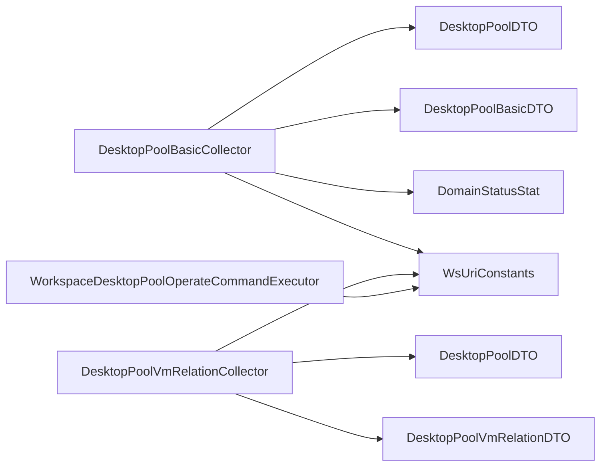

# 桌面池监控

<cite>
**本文引用的文件**
- [DesktopPoolBasicCollector.java](file://watcher-workspace/src/main/java/com/virtual/cloud/om/workspace/service/report/DesktopPoolBasicCollector.java)
- [DesktopPoolVmRelationCollector.java](file://watcher-workspace/src/main/java/com/virtual/cloud/om/workspace/service/report/DesktopPoolVmRelationCollector.java)
- [DesktopPoolDTO.java](file://watcher-sdk/src/main/java/com/virtual/cloud/om/sdk/dto/dataReport/workspace/DesktopPoolDTO.java)
- [DesktopPoolBasicDTO.java](file://watcher-sdk/src/main/java/com/virtual/cloud/om/sdk/dto/dataReport/workspace/DesktopPoolBasicDTO.java)
- [DesktopPoolVmRelationDTO.java](file://watcher-sdk/src/main/java/com/virtual/cloud/om/sdk/dto/dataReport/workspace/DesktopPoolVmRelationDTO.java)
- [DomainStatusStat.java](file://watcher-sdk/src/main/java/com/virtual/cloud/om/sdk/dto/dataReport/workspace/DomainStatusStat.java)
- [WsUriConstants.java](file://watcher-sdk/src/main/java/com/virtual/cloud/om/sdk/constant/uri/WsUriConstants.java)
- [WorkspaceDesktopPoolOperateCommandExecutor.java](file://watcher-workspace/src/main/java/com/virtual/cloud/om/workspace/service/operate/WorkspaceDesktopPoolOperateCommandExecutor.java)
</cite>

## 目录
1. [简介](#简介)
2. [项目结构](#项目结构)
3. [核心组件](#核心组件)
4. [架构总览](#架构总览)
5. [详细组件分析](#详细组件分析)
6. [依赖分析](#依赖分析)
7. [性能考虑](#性能考虑)
8. [故障排查指南](#故障排查指南)
9. [结论](#结论)
10. [附录](#附录)

## 简介
本技术文档围绕桌面池监控能力展开，重点解析两个采集器的实现原理与工作机制：
- 桌面池基础监控器 DesktopPoolBasicCollector：负责桌面池列表获取、虚拟机状态统计、模板信息查询与资源分配模式分析，并输出聚合后的基础监控数据。
- 桌面池与虚拟机关系监控器 DesktopPoolVmRelationCollector：负责建立桌面池与虚拟机或终端之间的映射关系，输出“桌面池-实例”关系数据。

同时，文档梳理了核心数据结构 DesktopPoolBasicDTO、DesktopPoolDTO、DomainStatusStat 的作用与字段含义，给出基于 REST API 的调用路径与示例，解释异步并发处理机制（CompletableFuture）对监控效率的提升，并总结监控指标的计算与聚合策略。

## 项目结构
桌面池监控相关代码位于 workspace 服务与 SDK 公共模块中：
- workspace 服务：提供具体的采集器实现与操作命令执行器。
- sdk 模块：提供统一的 DTO、URI 常量与通用工具。

图表来源
- [DesktopPoolBasicCollector.java:32-150](file://watcher-workspace/src/main/java/com/virtual/cloud/om/workspace/service/report/DesktopPoolBasicCollector.java#L32-L150)
- [DesktopPoolVmRelationCollector.java:33-116](file://watcher-workspace/src/main/java/com/virtual/cloud/om/workspace/service/report/DesktopPoolVmRelationCollector.java#L33-L116)
- [DesktopPoolDTO.java:13-225](file://watcher-sdk/src/main/java/com/virtual/cloud/om/sdk/dto/dataReport/workspace/DesktopPoolDTO.java#L13-L225)
- [DesktopPoolBasicDTO.java:9-50](file://watcher-sdk/src/main/java/com/virtual/cloud/om/sdk/dto/dataReport/workspace/DesktopPoolBasicDTO.java#L9-L50)
- [DesktopPoolVmRelationDTO.java:9-17](file://watcher-sdk/src/main/java/com/virtual/cloud/om/sdk/dto/dataReport/workspace/DesktopPoolVmRelationDTO.java#L9-L17)
- [DomainStatusStat.java:11-55](file://watcher-sdk/src/main/java/com/virtual/cloud/om/sdk/dto/dataReport/workspace/DomainStatusStat.java#L11-L55)
- [WsUriConstants.java:44-127](file://watcher-sdk/src/main/java/com/virtual/cloud/om/sdk/constant/uri/WsUriConstants.java#L44-L127)

章节来源
- [DesktopPoolBasicCollector.java:32-150](file://watcher-workspace/src/main/java/com/virtual/cloud/om/workspace/service/report/DesktopPoolBasicCollector.java#L32-L150)
- [DesktopPoolVmRelationCollector.java:33-116](file://watcher-workspace/src/main/java/com/virtual/cloud/om/workspace/service/report/DesktopPoolVmRelationCollector.java#L33-L116)
- [DesktopPoolDTO.java:13-225](file://watcher-sdk/src/main/java/com/virtual/cloud/om/sdk/dto/dataReport/workspace/DesktopPoolDTO.java#L13-L225)
- [DesktopPoolBasicDTO.java:9-50](file://watcher-sdk/src/main/java/com/virtual/cloud/om/sdk/dto/dataReport/workspace/DesktopPoolBasicDTO.java#L9-L50)
- [DesktopPoolVmRelationDTO.java:9-17](file://watcher-sdk/src/main/java/com/virtual/cloud/om/sdk/dto/dataReport/workspace/DesktopPoolVmRelationDTO.java#L9-L17)
- [DomainStatusStat.java:11-55](file://watcher-sdk/src/main/java/com/virtual/cloud/om/sdk/dto/dataReport/workspace/DomainStatusStat.java#L11-L55)
- [WsUriConstants.java:44-127](file://watcher-sdk/src/main/java/com/virtual/cloud/om/sdk/constant/uri/WsUriConstants.java#L44-L127)

## 核心组件
- 桌面池基础监控器 DesktopPoolBasicCollector
  - 功能：拉取桌面池列表，对每个桌面池并行查询虚拟机状态统计、桌面池详情、镜像模板信息与运行态统计，最终聚合为 DesktopPoolBasicDTO 列表。
  - 并发模型：使用 CompletableFuture 对每个桌面池异步采集，全部完成后合并结果。
  - 输出：DataValueAndTagsDTO，value 为 DesktopPoolBasicDTO 列表，tags 与时间戳由采集器统一填充。
- 桌面池与虚拟机关系监控器 DesktopPoolVmRelationCollector
  - 功能：拉取桌面池列表，按 computerType 区分处理：VM 类型查询 vms，终端类型查询 terminals，生成 DesktopPoolVmRelationDTO 列表。
  - 并发模型：同样采用 CompletableFuture 并行处理各桌面池，聚合结果。
  - 输出：DataValueAndTagsDTO，value 为 DesktopPoolVmRelationDTO 列表。

章节来源
- [DesktopPoolBasicCollector.java:36-139](file://watcher-workspace/src/main/java/com/virtual/cloud/om/workspace/service/report/DesktopPoolBasicCollector.java#L36-L139)
- [DesktopPoolVmRelationCollector.java:36-104](file://watcher-workspace/src/main/java/com/virtual/cloud/om/workspace/service/report/DesktopPoolVmRelationCollector.java#L36-L104)

## 架构总览
桌面池监控的数据流从采集器开始，通过统一的 REST 客户端访问 Workspace/Center 接口，拉取桌面池列表与各桌面池的子资源，再进行数据聚合与输出。

图表来源
- [DesktopPoolBasicCollector.java:42-120](file://watcher-workspace/src/main/java/com/virtual/cloud/om/workspace/service/report/DesktopPoolBasicCollector.java#L42-L120)
- [WsUriConstants.java:48-103](file://watcher-sdk/src/main/java/com/virtual/cloud/om/sdk/constant/uri/WsUriConstants.java#L48-L103)

## 详细组件分析

### DesktopPoolBasicCollector 实现原理
- 列表获取：调用桌面池列表接口，获取所有桌面池。
- 并行采集：
  - 对每个桌面池并行发起以下请求：
    - 查询虚拟机状态统计：/vdi/desktoppools/{id}/vmstat → DomainStatusStat
    - 查询桌面池详情：/vdi/desktoppools/{id} → DesktopPoolDTO
    - 若存在模板ID，则查询镜像模板详情：/vdi/template?templateId={id} → ImageResponseDTO
    - 查询运行态统计：/vdi/rest/workspace/desktoppools/{id} → RestDesktopPoolDTO
  - 将上述结果映射到 DesktopPoolBasicDTO 字段。
- 结果聚合：使用 CompletableFuture.allOf 并行等待所有任务完成，合并为 DesktopPoolBasicDTO 列表，封装为 DataValueAndTagsDTO 返回。

图表来源
- [DesktopPoolBasicCollector.java:36-139](file://watcher-workspace/src/main/java/com/virtual/cloud/om/workspace/service/report/DesktopPoolBasicCollector.java#L36-L139)

章节来源
- [DesktopPoolBasicCollector.java:36-139](file://watcher-workspace/src/main/java/com/virtual/cloud/om/workspace/service/report/DesktopPoolBasicCollector.java#L36-L139)
- [WsUriConstants.java:48-103](file://watcher-sdk/src/main/java/com/virtual/cloud/om/sdk/constant/uri/WsUriConstants.java#L48-L103)
- [DesktopPoolDTO.java:13-225](file://watcher-sdk/src/main/java/com/virtual/cloud/om/sdk/dto/dataReport/workspace/DesktopPoolDTO.java#L13-L225)
- [DesktopPoolBasicDTO.java:9-50](file://watcher-sdk/src/main/java/com/virtual/cloud/om/sdk/dto/dataReport/workspace/DesktopPoolBasicDTO.java#L9-L50)
- [DomainStatusStat.java:11-55](file://watcher-sdk/src/main/java/com/virtual/cloud/om/sdk/dto/dataReport/workspace/DomainStatusStat.java#L11-L55)

### DesktopPoolVmRelationCollector 实现原理
- 列表获取：调用桌面池列表接口，获取所有桌面池。
- 并行采集：
  - 对每个桌面池根据 computerType 分支：
    - computerType == 0：查询桌面池下虚拟机列表 /vdi/desktoppools/{id}/vms → DomainDTO 列表
    - 否则：查询桌面池下终端列表 /vdi/desktoppools/{id}/terminals → VdiDeviceDTO 列表
  - 将结果映射为 DesktopPoolVmRelationDTO（desktopPoolId、computerType、vmUuid），vmUuid 对于 VM 使用 DomainDTO.uuid，对于终端使用 VdiDeviceDTO.id。
- 结果聚合：CompletableFuture.allOf 并行等待，合并为 DesktopPoolVmRelationDTO 列表，封装为 DataValueAndTagsDTO 返回。

图表来源
- [DesktopPoolVmRelationCollector.java:36-104](file://watcher-workspace/src/main/java/com/virtual/cloud/om/workspace/service/report/DesktopPoolVmRelationCollector.java#L36-L104)
- [WsUriConstants.java:95-103](file://watcher-sdk/src/main/java/com/virtual/cloud/om/sdk/constant/uri/WsUriConstants.java#L95-L103)

章节来源
- [DesktopPoolVmRelationCollector.java:36-104](file://watcher-workspace/src/main/java/com/virtual/cloud/om/workspace/service/report/DesktopPoolVmRelationCollector.java#L36-L104)
- [WsUriConstants.java:95-103](file://watcher-sdk/src/main/java/com/virtual/cloud/om/sdk/constant/uri/WsUriConstants.java#L95-L103)
- [DesktopPoolVmRelationDTO.java:9-17](file://watcher-sdk/src/main/java/com/virtual/cloud/om/sdk/dto/dataReport/workspace/DesktopPoolVmRelationDTO.java#L9-L17)

### 数据模型与字段说明
- DesktopPoolDTO（桌面池实体）
  - 描述：桌面池的完整元数据，包含分配模式、目标类型、集群/主机信息、模板信息、用户类型、计算机类型、授权策略、分组等。
  - 关键字段：id、assignMode、targetType、clusterName、hostNameList、vmTemplateId、computerType、userType、maxVmNum、storagePoolName、secondStoragePoolName、vmNum、runningNum、pausedNum、abnormalNum、unknownNum、shutOffNum 等。
- DesktopPoolBasicDTO（桌面池基础监控DTO）
  - 描述：采集器输出的基础监控聚合对象，包含桌面池标识、分配/目标/计算机类型、用户类型、集群/前缀/容量、存储池、模板信息、运行态统计与分配/在线统计。
  - 关键字段：desktopPoolId、name、assignMode、computerType、userType、targetType、clusterName、desktopNamePrefix、maxVmNum、storagePoolName、secondStoragePoolName、cvkName、templateName、templateCpu、templateMemory、runningNum、pausedNum、abnormalNum、unknownNum、shutOffNum、vmNum、allocationNum、noAllocationNum、onlineNumber。
- DomainStatusStat（虚拟机状态统计DTO）
  - 描述：虚拟机状态统计聚合，包含运行、暂停、异常、未知、关机、在线、已分配、未分配等计数。
  - 关键字段：running、paused、abnormal、unknown、shutOff、onlineNumber、allocationNum、noAllocationNum。
- DesktopPoolVmRelationDTO（桌面池-实例关系DTO）
  - 描述：记录桌面池与具体实例（VM 或 终端）的映射关系。
  - 关键字段：desktopPoolId、computerType、vmUuid。

章节来源
- [DesktopPoolDTO.java:13-225](file://watcher-sdk/src/main/java/com/virtual/cloud/om/sdk/dto/dataReport/workspace/DesktopPoolDTO.java#L13-L225)
- [DesktopPoolBasicDTO.java:9-50](file://watcher-sdk/src/main/java/com/virtual/cloud/om/sdk/dto/dataReport/workspace/DesktopPoolBasicDTO.java#L9-L50)
- [DomainStatusStat.java:11-55](file://watcher-sdk/src/main/java/com/virtual/cloud/om/sdk/dto/dataReport/workspace/DomainStatusStat.java#L11-L55)
- [DesktopPoolVmRelationDTO.java:9-17](file://watcher-sdk/src/main/java/com/virtual/cloud/om/sdk/dto/dataReport/workspace/DesktopPoolVmRelationDTO.java#L9-L17)

### REST API 使用示例（路径与用途）
以下为桌面池监控涉及的关键 REST 接口路径与用途（以 URI 常量为准）：
- 获取桌面池列表
  - 路径：/vdi/desktoppools
  - 用途：采集器首次拉取所有桌面池的基本信息。
- 查询桌面池某项统计
  - 路径：/vdi/desktoppools/{id}/vmstat
  - 用途：获取 DomainStatusStat，包含在线、已分配、未分配等统计。
- 查询桌面池详情
  - 路径：/vdi/desktoppools/{id}
  - 用途：获取 DesktopPoolDTO，用于补充基础信息与模板ID。
- 查询镜像模板详情
  - 路径：/vdi/template?templateId={id}
  - 用途：根据模板ID查询镜像标题、CPU、内存等信息，填充到 DesktopPoolBasicDTO。
- 查询运行态统计
  - 路径：/vdi/rest/workspace/desktoppools/{id}
  - 用途：获取运行、暂停、异常、未知、关机等状态的数量。
- 查询桌面池下虚拟机
  - 路径：/vdi/desktoppools/{id}/vms
  - 用途：VM 类型桌面池的关系映射。
- 查询桌面池下终端
  - 路径：/vdi/desktoppools/{id}/terminals
  - 用途：终端类型桌面池的关系映射。

章节来源
- [WsUriConstants.java:48-103](file://watcher-sdk/src/main/java/com/virtual/cloud/om/sdk/constant/uri/WsUriConstants.java#L48-L103)

### 异步并发处理机制（CompletableFuture）
- 并行策略：对桌面池列表进行流式转换，为每个桌面池创建一个 CompletableFuture 任务，内部并行执行多项子请求。
- 等待与聚合：使用 CompletableFuture.allOf 收敛所有任务，join 等待全部完成，随后将结果合并到共享列表中。
- 错误处理：在 whenCompleteAsync 中捕获 AppException 并记录错误日志，避免单个任务失败影响整体流程。

图表来源
- [DesktopPoolBasicCollector.java:53-134](file://watcher-workspace/src/main/java/com/virtual/cloud/om/workspace/service/report/DesktopPoolBasicCollector.java#L53-L134)
- [DesktopPoolVmRelationCollector.java:52-99](file://watcher-workspace/src/main/java/com/virtual/cloud/om/workspace/service/report/DesktopPoolVmRelationCollector.java#L52-L99)

章节来源
- [DesktopPoolBasicCollector.java:53-134](file://watcher-workspace/src/main/java/com/virtual/cloud/om/workspace/service/report/DesktopPoolBasicCollector.java#L53-L134)
- [DesktopPoolVmRelationCollector.java:52-99](file://watcher-workspace/src/main/java/com/virtual/cloud/om/workspace/service/report/DesktopPoolVmRelationCollector.java#L52-L99)

### 指标计算与数据聚合策略
- 虚拟机状态统计
  - 来源：/vdi/desktoppools/{id}/vmstat → DomainStatusStat
  - 字段映射：将 running/paused/abnormal/unknown/shutOff 映射到 DesktopPoolBasicDTO 的对应运行态计数字段。
- 分配与在线统计
  - 字段映射：noAllocationNum、allocationNum、onlineNumber 直接来自 DomainStatusStat。
- 模板信息
  - 来源：/vdi/template?templateId={id} → ImageResponseDTO
  - 字段映射：title 映射为 templateName，cpu/memory 映射为 templateCpu/templateMemory。
- 运行态统计
  - 来源：/vdi/rest/workspace/desktoppools/{id} → RestDesktopPoolDTO
  - 字段映射：runningNum/pausedNum/abnormalNum/unknownNum/shutOffNum/vmNum。
- 关系映射
  - VM 类型：vmUuid 取自 DomainDTO.uuid
  - 终端类型：vmUuid 取自 VdiDeviceDTO.id

章节来源
- [DesktopPoolBasicCollector.java:63-120](file://watcher-workspace/src/main/java/com/virtual/cloud/om/workspace/service/report/DesktopPoolBasicCollector.java#L63-L120)
- [DesktopPoolVmRelationCollector.java:56-85](file://watcher-workspace/src/main/java/com/virtual/cloud/om/workspace/service/report/DesktopPoolVmRelationCollector.java#L56-L85)
- [DomainStatusStat.java:11-55](file://watcher-sdk/src/main/java/com/virtual/cloud/om/sdk/dto/dataReport/workspace/DomainStatusStat.java#L11-L55)

## 依赖分析
- 组件耦合
  - 两个采集器均继承自 DataReportCollector，复用统一的采集框架与标签/时间戳封装。
  - 两者均依赖 WsTokenRestConnection（或 WsRestConnection）进行 REST 调用。
  - 两者均依赖 WsUriConstants 提供的 URI 常量，保证接口路径一致性。
- 外部依赖
  - SDK 提供的 DTO 与 URI 常量，确保数据结构与接口契约稳定。
- 潜在风险
  - 当桌面池数量较多时，CompletableFuture 数量级增大，需关注线程池与网络并发限制。
  - 某些接口可能返回空数据或异常，需在 whenCompleteAsync 中做好容错与日志记录。

图表来源
- [DesktopPoolBasicCollector.java:32-150](file://watcher-workspace/src/main/java/com/virtual/cloud/om/workspace/service/report/DesktopPoolBasicCollector.java#L32-L150)
- [DesktopPoolVmRelationCollector.java:33-116](file://watcher-workspace/src/main/java/com/virtual/cloud/om/workspace/service/report/DesktopPoolVmRelationCollector.java#L33-L116)
- [WorkspaceDesktopPoolOperateCommandExecutor.java:194-303](file://watcher-workspace/src/main/java/com/virtual/cloud/om/workspace/service/operate/WorkspaceDesktopPoolOperateCommandExecutor.java#L194-L303)
- [WsUriConstants.java:44-127](file://watcher-sdk/src/main/java/com/virtual/cloud/om/sdk/constant/uri/WsUriConstants.java#L44-L127)

章节来源
- [DesktopPoolBasicCollector.java:32-150](file://watcher-workspace/src/main/java/com/virtual/cloud/om/workspace/service/report/DesktopPoolBasicCollector.java#L32-L150)
- [DesktopPoolVmRelationCollector.java:33-116](file://watcher-workspace/src/main/java/com/virtual/cloud/om/workspace/service/report/DesktopPoolVmRelationCollector.java#L33-L116)
- [WorkspaceDesktopPoolOperateCommandExecutor.java:194-303](file://watcher-workspace/src/main/java/com/virtual/cloud/om/workspace/service/operate/WorkspaceDesktopPoolOperateCommandExecutor.java#L194-L303)

## 性能考虑
- 并发优化
  - 使用 CompletableFuture 并行处理每个桌面池的多路请求，显著降低总体采集耗时。
  - 建议结合线程池配置与限流策略，避免对被监控系统造成过大压力。
- 数据聚合
  - 采集器内部使用 CopyOnWrite 列表收集结果，减少并发写入冲突。
- 错误隔离
  - whenCompleteAsync 中对 AppException 进行日志记录，不影响其他任务执行。

## 故障排查指南
- 常见问题
  - 接口返回空列表：确认桌面池是否存在、URI 是否正确、鉴权信息是否有效。
  - 模板信息缺失：检查 vmTemplateId 是否为空，镜像接口是否可用。
  - 终端类型关系为空：确认 computerType 是否非 0，终端接口返回是否正常。
- 日志定位
  - 采集器在 whenCompleteAsync 中记录 AppException 错误日志，便于定位具体资源与错误原因。
- 操作命令联动
  - 桌面池操作命令执行器会调用相同 URI 常量进行状态刷新与目标刷新，可作为接口连通性验证的参考。

章节来源
- [DesktopPoolBasicCollector.java:125-132](file://watcher-workspace/src/main/java/com/virtual/cloud/om/workspace/service/report/DesktopPoolBasicCollector.java#L125-L132)
- [DesktopPoolVmRelationCollector.java:90-97](file://watcher-workspace/src/main/java/com/virtual/cloud/om/workspace/service/report/DesktopPoolVmRelationCollector.java#L90-L97)
- [WorkspaceDesktopPoolOperateCommandExecutor.java:194-303](file://watcher-workspace/src/main/java/com/virtual/cloud/om/workspace/service/operate/WorkspaceDesktopPoolOperateCommandExecutor.java#L194-L303)

## 结论
桌面池监控通过两个采集器分别覆盖“基础指标聚合”和“关系映射”，借助 CompletableFuture 实现高并发采集，配合 SDK 的统一 DTO 与 URI 常量，形成清晰、可维护、可扩展的监控体系。在大规模桌面池场景下，建议结合线程池与限流策略进一步优化吞吐与稳定性。

## 附录
- 关键 URI 常量一览（节选）
  - 桌面池列表：/vdi/desktoppools
  - 虚拟机状态统计：/vdi/desktoppools/{id}/vmstat
  - 桌面池详情：/vdi/desktoppools/{id}
  - 镜像模板详情：/vdi/template?templateId={id}
  - 运行态统计：/vdi/rest/workspace/desktoppools/{id}
  - VM 列表：/vdi/desktoppools/{id}/vms
  - 终端列表：/vdi/desktoppools/{id}/terminals

章节来源
- [WsUriConstants.java:48-103](file://watcher-sdk/src/main/java/com/virtual/cloud/om/sdk/constant/uri/WsUriConstants.java#L48-L103)