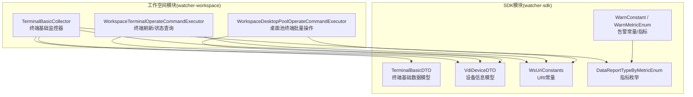
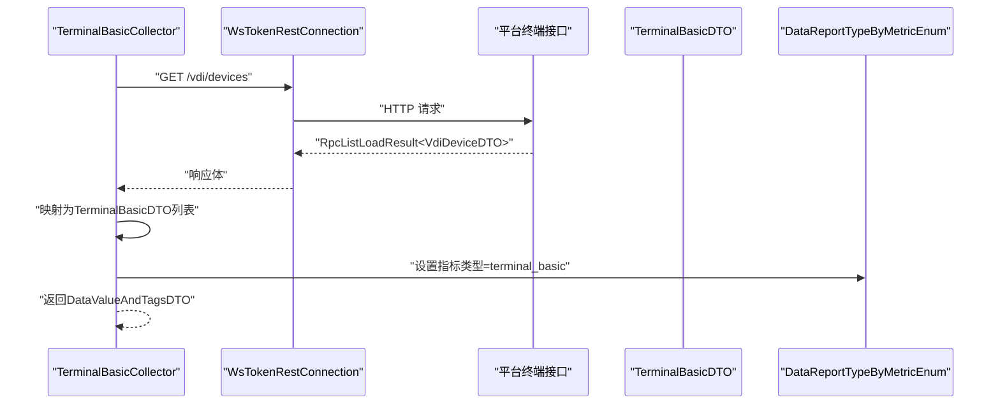
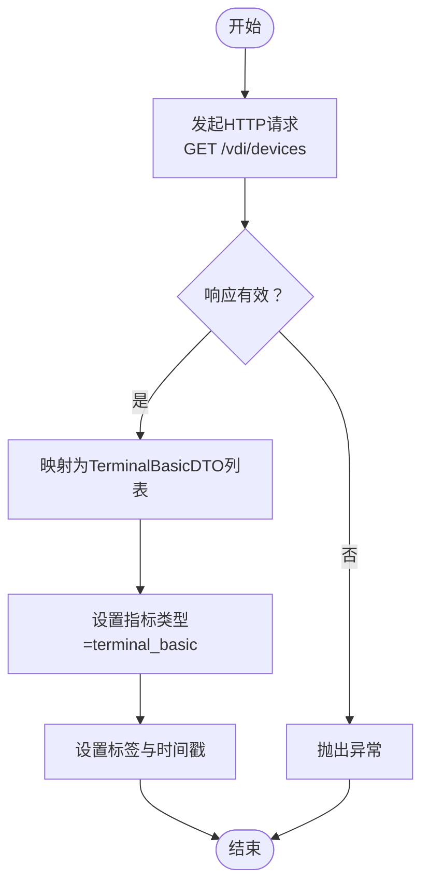
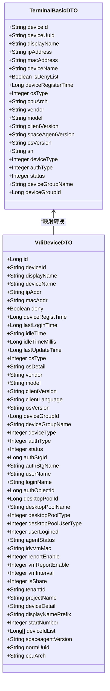
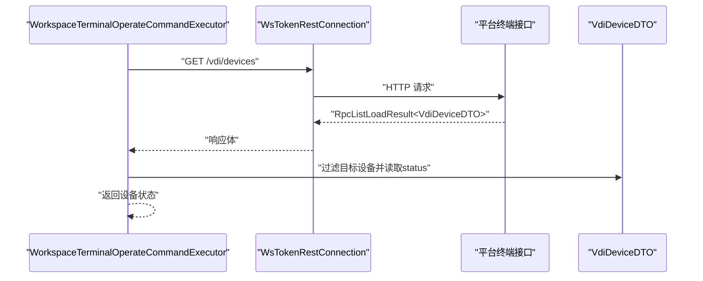
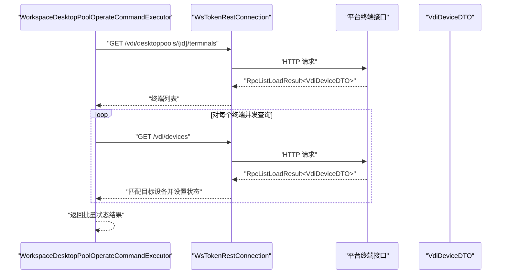
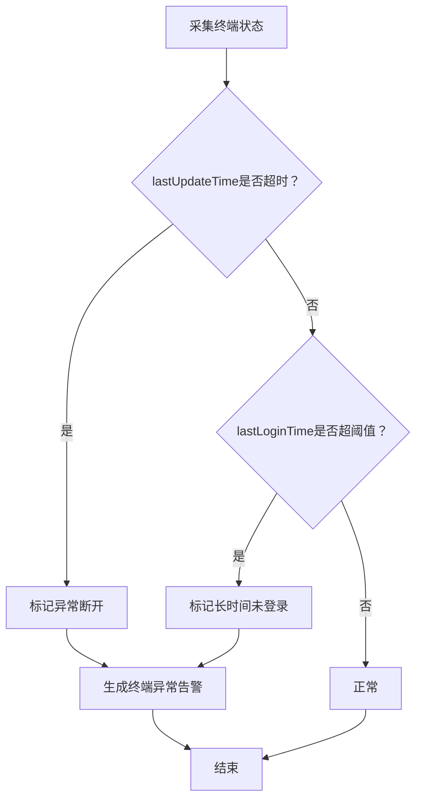
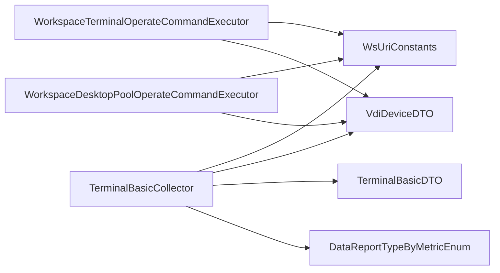

# 终端设备监控

<cite>
**本文引用的文件**
- [TerminalBasicCollector.java](file://watcher-workspace/src/main/java/com/virtual/cloud/om/workspace/service/report/TerminalBasicCollector.java)
- [TerminalBasicDTO.java](file://watcher-sdk/src/main/java/com/virtual/cloud/om/sdk/dto/dataReport/workspace/TerminalBasicDTO.java)
- [VdiDeviceDTO.java](file://watcher-sdk/src/main/java/com/virtual/cloud/om/sdk/dto/dataReport/workspace/VdiDeviceDTO.java)
- [WsUriConstants.java](file://watcher-sdk/src/main/java/com/virtual/cloud/om/sdk/constant/uri/WsUriConstants.java)
- [DataReportTypeByMetricEnum.java](file://watcher-sdk/src/main/java/com/virtual/cloud/om/sdk/constant/DataReportTypeByMetricEnum.java)
- [WorkspaceTerminalOperateCommandExecutor.java](file://watcher-workspace/src/main/java/com/virtual/cloud/om/workspace/service/operate/WorkspaceTerminalOperateCommandExecutor.java)
- [WorkspaceDesktopPoolOperateCommandExecutor.java](file://watcher-workspace/src/main/java/com/virtual/cloud/om/workspace/service/operate/WorkspaceDesktopPoolOperateCommandExecutor.java)
- [WarnConstant.java](file://watcher-sdk/src/main/java/com/virtual/cloud/om/sdk/constant/warn/WarnConstant.java)
- [WarnMetricEnum.java](file://watcher-sdk/src/main/java/com/virtual/cloud/om/sdk/constant/WarnMetricEnum.java)
</cite>

## 目录
1. [简介](#简介)
2. [项目结构](#项目结构)
3. [核心组件](#核心组件)
4. [架构总览](#架构总览)
5. [详细组件分析](#详细组件分析)
6. [依赖分析](#依赖分析)
7. [性能考虑](#性能考虑)
8. [故障排查指南](#故障排查指南)
9. [结论](#结论)
10. [附录](#附录)

## 简介
本技术文档围绕“终端设备监控”功能展开，重点阐述 TerminalBasicCollector 终端基础监控器的设计与实现，覆盖以下主题：
- 终端连接状态监控、使用频率统计与资源占用分析
- 终端生命周期管理：注册、在线状态跟踪、离线检测
- 监控数据采集流程：从终端连接信息获取到状态统计的完整过程
- 终端设备信息数据模型：终端ID、IP地址、MAC地址、连接时间等关键字段
- 监控指标计算方法：活跃终端数、平均会话时长、终端负载率等
- 异常检测与告警机制：异常断开与长时间未登录的识别与处理

## 项目结构
终端监控相关代码主要分布在以下模块：
- watcher-workspace：负责终端监控数据采集与操作命令执行
- watcher-sdk：提供统一的数据模型、URI常量、指标枚举与告警常量

图表来源
- [TerminalBasicCollector.java:34-96](file://watcher-workspace/src/main/java/com/virtual/cloud/om/workspace/service/report/TerminalBasicCollector.java#L34-L96)
- [WorkspaceTerminalOperateCommandExecutor.java:49-83](file://watcher-workspace/src/main/java/com/virtual/cloud/om/workspace/service/operate/WorkspaceTerminalOperateCommandExecutor.java#L49-L83)
- [WorkspaceDesktopPoolOperateCommandExecutor.java:131-292](file://watcher-workspace/src/main/java/com/virtual/cloud/om/workspace/service/operate/WorkspaceDesktopPoolOperateCommandExecutor.java#L131-L292)
- [TerminalBasicDTO.java:1-53](file://watcher-sdk/src/main/java/com/virtual/cloud/om/sdk/dto/dataReport/workspace/TerminalBasicDTO.java#L1-L53)
- [VdiDeviceDTO.java:1-301](file://watcher-sdk/src/main/java/com/virtual/cloud/om/sdk/dto/dataReport/workspace/VdiDeviceDTO.java#L1-L301)
- [WsUriConstants.java:34-35](file://watcher-sdk/src/main/java/com/virtual/cloud/om/sdk/constant/uri/WsUriConstants.java#L34-L35)
- [DataReportTypeByMetricEnum.java:24-24](file://watcher-sdk/src/main/java/com/virtual/cloud/om/sdk/constant/DataReportTypeByMetricEnum.java#L24-L24)
- [WarnConstant.java:1-93](file://watcher-sdk/src/main/java/com/virtual/cloud/om/sdk/constant/warn/WarnConstant.java#L1-L93)
- [WarnMetricEnum.java:1-20](file://watcher-sdk/src/main/java/com/virtual/cloud/om/sdk/constant/WarnMetricEnum.java#L1-L20)

章节来源
- [TerminalBasicCollector.java:34-96](file://watcher-workspace/src/main/java/com/virtual/cloud/om/workspace/service/report/TerminalBasicCollector.java#L34-L96)
- [TerminalBasicDTO.java:1-53](file://watcher-sdk/src/main/java/com/virtual/cloud/om/sdk/dto/dataReport/workspace/TerminalBasicDTO.java#L1-L53)
- [VdiDeviceDTO.java:1-301](file://watcher-sdk/src/main/java/com/virtual/cloud/om/sdk/dto/dataReport/workspace/VdiDeviceDTO.java#L1-L301)
- [WsUriConstants.java:34-35](file://watcher-sdk/src/main/java/com/virtual/cloud/om/sdk/constant/uri/WsUriConstants.java#L34-L35)
- [DataReportTypeByMetricEnum.java:24-24](file://watcher-sdk/src/main/java/com/virtual/cloud/om/sdk/constant/DataReportTypeByMetricEnum.java#L24-L24)
- [WorkspaceTerminalOperateCommandExecutor.java:49-83](file://watcher-workspace/src/main/java/com/virtual/cloud/om/workspace/service/operate/WorkspaceTerminalOperateCommandExecutor.java#L49-L83)
- [WorkspaceDesktopPoolOperateCommandExecutor.java:131-292](file://watcher-workspace/src/main/java/com/virtual/cloud/om/workspace/service/operate/WorkspaceDesktopPoolOperateCommandExecutor.java#L131-L292)
- [WarnConstant.java:1-93](file://watcher-sdk/src/main/java/com/virtual/cloud/om/sdk/constant/warn/WarnConstant.java#L1-L93)
- [WarnMetricEnum.java:1-20](file://watcher-sdk/src/main/java/com/virtual/cloud/om/sdk/constant/WarnMetricEnum.java#L1-L20)

## 核心组件
- TerminalBasicCollector：终端基础监控器，负责从平台拉取终端设备列表并转换为标准终端基础数据模型，用于上报与后续统计分析。
- TerminalBasicDTO：终端基础数据模型，包含设备ID、设备UUID、显示名称、IP/MAC、注册时间、操作系统类型、CPU架构、厂商、型号、版本、SN、设备类型、认证类型、在线状态、分组信息等。
- VdiDeviceDTO：平台侧设备信息模型，包含更丰富的设备属性与状态字段，供采集器映射为标准模型。
- WsUriConstants：终端相关接口URI常量，如终端基础查询接口。
- DataReportTypeByMetricEnum：终端基础指标枚举，标识终端基本信息上报指标类型。
- WorkspaceTerminalOperateCommandExecutor：终端操作命令执行器，支持刷新终端状态、查询在线状态等。
- WorkspaceDesktopPoolOperateCommandExecutor：桌面池终端批量操作执行器，支持批量查询终端状态。
- WarnConstant / WarnMetricEnum：告警常量与指标枚举，定义终端异常告警类型与事件源。

章节来源
- [TerminalBasicCollector.java:34-96](file://watcher-workspace/src/main/java/com/virtual/cloud/om/workspace/service/report/TerminalBasicCollector.java#L34-L96)
- [TerminalBasicDTO.java:1-53](file://watcher-sdk/src/main/java/com/virtual/cloud/om/sdk/dto/dataReport/workspace/TerminalBasicDTO.java#L1-L53)
- [VdiDeviceDTO.java:1-301](file://watcher-sdk/src/main/java/com/virtual/cloud/om/sdk/dto/dataReport/workspace/VdiDeviceDTO.java#L1-L301)
- [WsUriConstants.java:34-35](file://watcher-sdk/src/main/java/com/virtual/cloud/om/sdk/constant/uri/WsUriConstants.java#L34-L35)
- [DataReportTypeByMetricEnum.java:24-24](file://watcher-sdk/src/main/java/com/virtual/cloud/om/sdk/constant/DataReportTypeByMetricEnum.java#L24-L24)
- [WorkspaceTerminalOperateCommandExecutor.java:49-83](file://watcher-workspace/src/main/java/com/virtual/cloud/om/workspace/service/operate/WorkspaceTerminalOperateCommandExecutor.java#L49-L83)
- [WorkspaceDesktopPoolOperateCommandExecutor.java:131-292](file://watcher-workspace/src/main/java/com/virtual/cloud/om/workspace/service/operate/WorkspaceDesktopPoolOperateCommandExecutor.java#L131-L292)
- [WarnConstant.java:1-93](file://watcher-sdk/src/main/java/com/virtual/cloud/om/sdk/constant/warn/WarnConstant.java#L1-L93)
- [WarnMetricEnum.java:1-20](file://watcher-sdk/src/main/java/com/virtual/cloud/om/sdk/constant/WarnMetricEnum.java#L1-L20)

## 架构总览
终端监控整体架构由“采集-转换-上报-查询-告警”构成，核心流程如下：

图表来源
- [TerminalBasicCollector.java:34-96](file://watcher-workspace/src/main/java/com/virtual/cloud/om/workspace/service/report/TerminalBasicCollector.java#L34-L96)
- [WsUriConstants.java:34-35](file://watcher-sdk/src/main/java/com/virtual/cloud/om/sdk/constant/uri/WsUriConstants.java#L34-L35)
- [DataReportTypeByMetricEnum.java:24-24](file://watcher-sdk/src/main/java/com/virtual/cloud/om/sdk/constant/DataReportTypeByMetricEnum.java#L24-L24)

## 详细组件分析

### TerminalBasicCollector 组件分析
- 职责：通过平台REST接口获取终端设备列表，转换为标准终端基础数据模型，并设置指标类型与数据标签。
- 关键流程：
  - 发起请求：使用 WsUriConstants.QUERY_TERMINAL_BASIC 获取终端列表
  - 结果校验：对响应进行校验，确保数据可用
  - 数据映射：将 VdiDeviceDTO 映射为 TerminalBasicDTO，填充设备ID、UUID、IP/MAC、注册时间、OS类型、CPU架构、厂商、型号、版本、SN、设备类型、认证类型、在线状态、分组信息等
  - 指标设置：设置指标类型为 terminal_basic，数据类型为 json
  - 时间戳：记录采集时间

图表来源
- [TerminalBasicCollector.java:34-96](file://watcher-workspace/src/main/java/com/virtual/cloud/om/workspace/service/report/TerminalBasicCollector.java#L34-L96)
- [WsUriConstants.java:34-35](file://watcher-sdk/src/main/java/com/virtual/cloud/om/sdk/constant/uri/WsUriConstants.java#L34-L35)
- [DataReportTypeByMetricEnum.java:24-24](file://watcher-sdk/src/main/java/com/virtual/cloud/om/sdk/constant/DataReportTypeByMetricEnum.java#L24-L24)

章节来源
- [TerminalBasicCollector.java:34-96](file://watcher-workspace/src/main/java/com/virtual/cloud/om/workspace/service/report/TerminalBasicCollector.java#L34-L96)

### 终端设备信息数据模型
- TerminalBasicDTO 字段概览（节选）：
  - 设备ID、设备UUID、显示名称、IP地址、MAC地址、设备名称
  - 黑名单标记、注册时间、操作系统类型、CPU架构、厂商、型号
  - 客户端版本、SpaceAgent版本、OS版本、SN、设备类型、认证类型
  - 在线状态、设备分组名称与ID
- VdiDeviceDTO 字段概览（节选）：
  - 基础字段：id、deviceId、displayName、deviceName、ipAddr、macAddr、deny、deviceRegistTime、lastLoginTime、idleTime、idleTimeMillis、lastUpdateTime
  - 系统与硬件：osType、osDetail、vendor、model、clientVersion、clientLanguage、osVersion、cpuArch、sn
  - 分组与授权：deviceGroupId、deviceGroupName、authStgId、authStgName、userName、loginName、authObjectId
  - 桌面池关联：desktopPoolId、desktopPoolName、desktopPoolType、desktopPoolUserType
  - 用户登录态：userLogined
  - 其他：agentStatus、idvVmMac、reportEnable、vmReportEnable、vmInterval、isShare、tenantId、projectName、deviceDetail、displayNamePrefix、startNumber、deviceIdList、spaceagentVersion、normUuid

图表来源
- [TerminalBasicDTO.java:1-53](file://watcher-sdk/src/main/java/com/virtual/cloud/om/sdk/dto/dataReport/workspace/TerminalBasicDTO.java#L1-L53)
- [VdiDeviceDTO.java:1-301](file://watcher-sdk/src/main/java/com/virtual/cloud/om/sdk/dto/dataReport/workspace/VdiDeviceDTO.java#L1-L301)

章节来源
- [TerminalBasicDTO.java:1-53](file://watcher-sdk/src/main/java/com/virtual/cloud/om/sdk/dto/dataReport/workspace/TerminalBasicDTO.java#L1-L53)
- [VdiDeviceDTO.java:1-301](file://watcher-sdk/src/main/java/com/virtual/cloud/om/sdk/dto/dataReport/workspace/VdiDeviceDTO.java#L1-L301)

### 终端生命周期管理与状态跟踪
- 注册与上线：终端注册时间 deviceRegistTime 与在线状态 status 反映设备注册与上线情况
- 在线状态跟踪：status 字段表示在线/离线，支持通过终端刷新命令查询与更新
- 离线检测：结合 lastUpdateTime 与 lastLoginTime 判断长时间无心跳或未登录的终端

图表来源
- [WorkspaceTerminalOperateCommandExecutor.java:49-83](file://watcher-workspace/src/main/java/com/virtual/cloud/om/workspace/service/operate/WorkspaceTerminalOperateCommandExecutor.java#L49-L83)
- [WsUriConstants.java:34-35](file://watcher-sdk/src/main/java/com/virtual/cloud/om/sdk/constant/uri/WsUriConstants.java#L34-L35)
- [VdiDeviceDTO.java:1-301](file://watcher-sdk/src/main/java/com/virtual/cloud/om/sdk/dto/dataReport/workspace/VdiDeviceDTO.java#L1-L301)

章节来源
- [WorkspaceTerminalOperateCommandExecutor.java:49-83](file://watcher-workspace/src/main/java/com/virtual/cloud/om/workspace/service/operate/WorkspaceTerminalOperateCommandExecutor.java#L49-L83)
- [VdiDeviceDTO.java:1-301](file://watcher-sdk/src/main/java/com/virtual/cloud/om/sdk/dto/dataReport/workspace/VdiDeviceDTO.java#L1-L301)

### 批量终端状态查询与并发优化
- 桌面池场景：对池内终端进行并发查询，提升批量状态刷新效率
- 并发策略：使用 CompletableFuture 并行请求各终端状态，聚合结果后返回

图表来源
- [WorkspaceDesktopPoolOperateCommandExecutor.java:131-292](file://watcher-workspace/src/main/java/com/virtual/cloud/om/workspace/service/operate/WorkspaceDesktopPoolOperateCommandExecutor.java#L131-L292)
- [WsUriConstants.java:34-35](file://watcher-sdk/src/main/java/com/virtual/cloud/om/sdk/constant/uri/WsUriConstants.java#L34-L35)
- [VdiDeviceDTO.java:1-301](file://watcher-sdk/src/main/java/com/virtual/cloud/om/sdk/dto/dataReport/workspace/VdiDeviceDTO.java#L1-L301)

章节来源
- [WorkspaceDesktopPoolOperateCommandExecutor.java:131-292](file://watcher-workspace/src/main/java/com/virtual/cloud/om/workspace/service/operate/WorkspaceDesktopPoolOperateCommandExecutor.java#L131-L292)

### 监控指标计算方法
- 活跃终端数：基于 status=在线 的终端计数
- 平均会话时长：可基于 lastLoginTime 与当前时间差计算，或结合平台提供的 idleTimeMillis 字段进行评估
- 终端负载率：结合平台资源上报能力（vmReportEnable、vmInterval、agentStatus 等）与资源监控数据进行综合评估

章节来源
- [VdiDeviceDTO.java:1-301](file://watcher-sdk/src/main/java/com/virtual/cloud/om/sdk/dto/dataReport/workspace/VdiDeviceDTO.java#L1-L301)
- [TerminalBasicDTO.java:1-53](file://watcher-sdk/src/main/java/com/virtual/cloud/om/sdk/dto/dataReport/workspace/TerminalBasicDTO.java#L1-L53)

### 异常检测与告警机制
- 告警类型：终端异常告警（TERMINAL_WARN_TYPE），事件源为“终端”
- 告警指标：terminal_alarms
- 告警触发建议：
  - 异常断开：当 lastUpdateTime 长时间未更新或 status 非法波动
  - 长时间未登录：lastLoginTime 与当前时间差超过阈值（如 7 天）
  - 设备异常：agentStatus 异常、资源上报异常（vmReportEnable/interval）

图表来源
- [WarnConstant.java:1-93](file://watcher-sdk/src/main/java/com/virtual/cloud/om/sdk/constant/warn/WarnConstant.java#L1-L93)
- [WarnMetricEnum.java:1-20](file://watcher-sdk/src/main/java/com/virtual/cloud/om/sdk/constant/WarnMetricEnum.java#L1-L20)
- [VdiDeviceDTO.java:1-301](file://watcher-sdk/src/main/java/com/virtual/cloud/om/sdk/dto/dataReport/workspace/VdiDeviceDTO.java#L1-L301)

章节来源
- [WarnConstant.java:1-93](file://watcher-sdk/src/main/java/com/virtual/cloud/om/sdk/constant/warn/WarnConstant.java#L1-L93)
- [WarnMetricEnum.java:1-20](file://watcher-sdk/src/main/java/com/virtual/cloud/om/sdk/constant/WarnMetricEnum.java#L1-L20)
- [VdiDeviceDTO.java:1-301](file://watcher-sdk/src/main/java/com/virtual/cloud/om/sdk/dto/dataReport/workspace/VdiDeviceDTO.java#L1-L301)

## 依赖分析
- TerminalBasicCollector 依赖：
  - WsTokenRestConnection：发起HTTP请求
  - WsUriConstants：终端查询URI
  - VdiDeviceDTO：平台侧设备模型
  - TerminalBasicDTO：标准上报模型
  - DataReportTypeByMetricEnum：指标类型
- 操作命令执行器依赖：
  - WsTokenRestConnection：终端状态查询
  - WsUriConstants：终端查询URI
  - VdiDeviceDTO：设备状态数据

图表来源
- [TerminalBasicCollector.java:34-96](file://watcher-workspace/src/main/java/com/virtual/cloud/om/workspace/service/report/TerminalBasicCollector.java#L34-L96)
- [WorkspaceTerminalOperateCommandExecutor.java:49-83](file://watcher-workspace/src/main/java/com/virtual/cloud/om/workspace/service/operate/WorkspaceTerminalOperateCommandExecutor.java#L49-L83)
- [WorkspaceDesktopPoolOperateCommandExecutor.java:131-292](file://watcher-workspace/src/main/java/com/virtual/cloud/om/workspace/service/operate/WorkspaceDesktopPoolOperateCommandExecutor.java#L131-L292)
- [WsUriConstants.java:34-35](file://watcher-sdk/src/main/java/com/virtual/cloud/om/sdk/constant/uri/WsUriConstants.java#L34-L35)
- [DataReportTypeByMetricEnum.java:24-24](file://watcher-sdk/src/main/java/com/virtual/cloud/om/sdk/constant/DataReportTypeByMetricEnum.java#L24-L24)

章节来源
- [TerminalBasicCollector.java:34-96](file://watcher-workspace/src/main/java/com/virtual/cloud/om/workspace/service/report/TerminalBasicCollector.java#L34-L96)
- [WorkspaceTerminalOperateCommandExecutor.java:49-83](file://watcher-workspace/src/main/java/com/virtual/cloud/om/workspace/service/operate/WorkspaceTerminalOperateCommandExecutor.java#L49-L83)
- [WorkspaceDesktopPoolOperateCommandExecutor.java:131-292](file://watcher-workspace/src/main/java/com/virtual/cloud/om/workspace/service/operate/WorkspaceDesktopPoolOperateCommandExecutor.java#L131-L292)

## 性能考虑
- 并发查询：桌面池场景使用 CompletableFuture 并行查询，减少总体等待时间
- 数据映射：在内存中进行轻量级对象映射，避免额外序列化开销
- 指标上报：统一指标类型与数据类型，便于下游聚合与存储

## 故障排查指南
- HTTP响应异常：检查 WsTokenRestConnection 返回状态与错误码，定位网络或鉴权问题
- 响应数据为空：确认平台终端接口可用性与权限配置
- 状态不一致：核对 status、lastUpdateTime、lastLoginTime 字段，排查心跳与登录流程
- 告警未触发：检查告警阈值与事件源配置，确认终端异常场景是否满足条件

章节来源
- [TerminalBasicCollector.java:34-96](file://watcher-workspace/src/main/java/com/virtual/cloud/om/workspace/service/report/TerminalBasicCollector.java#L34-L96)
- [WorkspaceTerminalOperateCommandExecutor.java:49-83](file://watcher-workspace/src/main/java/com/virtual/cloud/om/workspace/service/operate/WorkspaceTerminalOperateCommandExecutor.java#L49-L83)
- [WorkspaceDesktopPoolOperateCommandExecutor.java:131-292](file://watcher-workspace/src/main/java/com/virtual/cloud/om/workspace/service/operate/WorkspaceDesktopPoolOperateCommandExecutor.java#L131-L292)

## 结论
TerminalBasicCollector 作为终端设备监控的核心采集器，通过标准化的数据模型与统一的指标类型，实现了对终端设备的全生命周期监控与状态跟踪。配合操作命令执行器的批量查询能力与告警机制，能够有效支撑活跃终端数、平均会话时长、终端负载率等关键指标的统计与异常检测。

## 附录
- 终端基础指标枚举：terminal_basic
- 终端告警指标：terminal_alarms
- 终端告警类型：TERMINAL_WARN_TYPE
- 终端事件源：TERMINAL_SRC

章节来源
- [DataReportTypeByMetricEnum.java:24-24](file://watcher-sdk/src/main/java/com/virtual/cloud/om/sdk/constant/DataReportTypeByMetricEnum.java#L24-L24)
- [WarnMetricEnum.java:1-20](file://watcher-sdk/src/main/java/com/virtual/cloud/om/sdk/constant/WarnMetricEnum.java#L1-L20)
- [WarnConstant.java:1-93](file://watcher-sdk/src/main/java/com/virtual/cloud/om/sdk/constant/warn/WarnConstant.java#L1-L93)