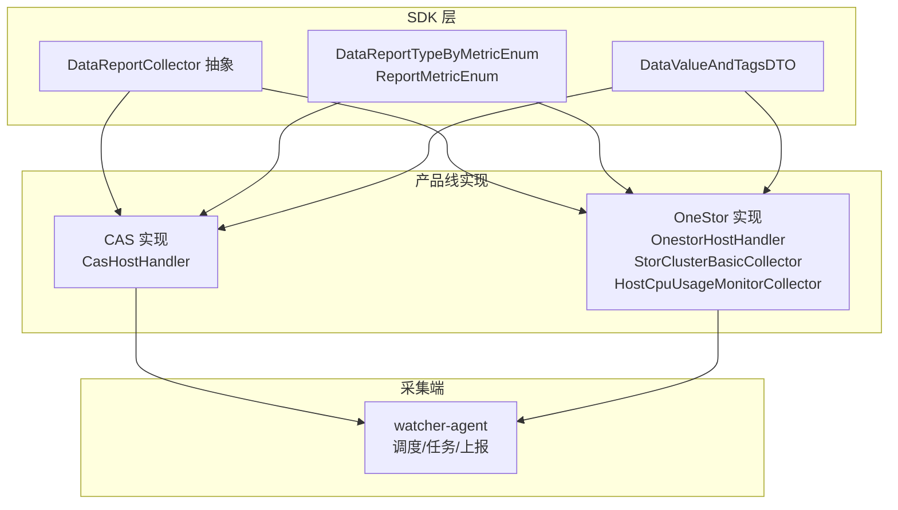
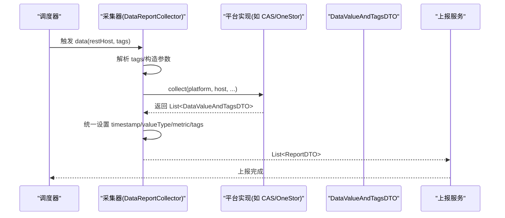
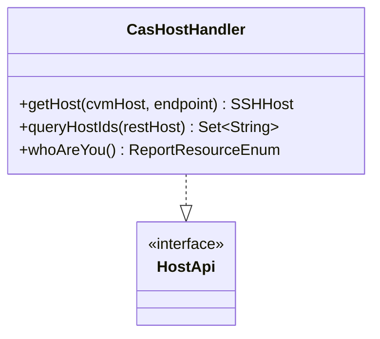
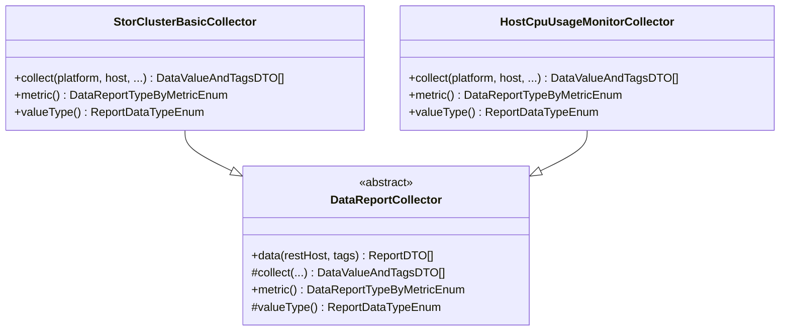
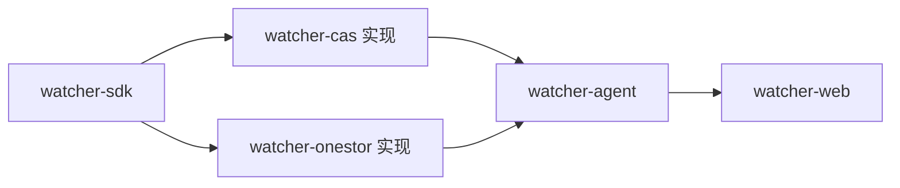

# 产品线监控模块

<cite>
**本文引用的文件**   
- [watcher-cas 模块](file://watcher-cas/pom.xml)
- [watcher-onestor 模块](file://watcher-onestor/pom.xml)
- [watcher-sdk 模块](file://watcher-sdk/pom.xml)
- [watcher-agent 模块](file://watcher-agent/pom.xml)
- [watcher-web 模块](file://watcher-web/pom.xml)
- [CasHostHandler.java](file://watcher-cas/src/main/java/com/virtual/cloud/om/cas/service/CasHostHandler.java)
- [OnestorHostHandler.java](file://watcher-onestor/src/main/java/com/virtual/cloud/om/onestor/service/OnestorHostHandler.java)
- [DataReportCollector.java](file://watcher-sdk/src/main/java/com/virtual/cloud/om/sdk/api/DataReportCollector.java)
- [DataValueAndTagsDTO.java](file://watcher-sdk/src/main/java/com/virtual/cloud/om/sdk/dto/dataReport/DataValueAndTagsDTO.java)
- [DataReportTypeByMetricEnum.java](file://watcher-sdk/src/main/java/com/virtual/cloud/om/sdk/constant/DataReportTypeByMetricEnum.java)
- [ReportMetricEnum.java](file://watcher-sdk/src/main/java/com/virtual/cloud/om/sdk/constant/report/ReportMetricEnum.java)
- [StorClusterBasicCollector.java](file://watcher-onestor/src/main/java/com/virtual/cloud/om/onestor/service/clusterBasic/StorClusterBasicCollector.java)
- [HostCpuUsageMonitorCollector.java](file://watcher-onestor/src/main/java/com/virtual/cloud/om/onestor/service/report/monitor/host/HostCpuUsageMonitorCollector.java)
</cite>

## 目录
1. [简介](#简介)
2. [项目结构](#项目结构)
3. [核心组件](#核心组件)
4. [架构总览](#架构总览)
5. [详细组件分析](#详细组件分析)
6. [依赖分析](#依赖分析)
7. [性能考虑](#性能考虑)
8. [故障排查指南](#故障排查指南)
9. [结论](#结论)
10. [附录](#附录)

## 简介
本技术文档面向产品线监控模块，系统性梳理 CAS、UIS、Workspace、OneStor 四条产品线的监控能力与实现方式，重点覆盖以下方面：
- CAS 产品线：主机性能监控、主机基础信息采集、平台版本监控、虚拟机资源统计
- UIS 产品线：用户资源监控、平台版本统计、系统性能指标采集（基于 SDK 能力）
- Workspace 产品线：桌面池监控、终端设备监控、资源利用率分析（基于 SDK 能力）
- OneStor 存储监控：存储集群监控、磁盘池监控、主机性能监控、存储容量统计

同时，文档总结各产品线监控模块的共同设计模式：采集器实现、日志解析规则、指标计算逻辑、数据上报机制，并给出扩展新监控模块与定制指标/采集策略的实践指引。

## 项目结构
整体采用多模块分层组织：
- watcher-sdk：监控采集与上报的通用 SDK，定义采集器抽象、指标枚举、数据 DTO、REST 连接等
- watcher-cas：CAS 产品线监控实现，包含主机信息、日志解析处理器、报告采集器等
- watcher-onestor：OneStor 存储监控实现，包含集群/主机/磁盘池等维度的采集器
- watcher-agent：采集端服务，负责调度、任务编排、指标上报、日志解析等
- watcher-web：前端控制台，用于配置、查看与运维

图表来源
- [watcher-sdk 模块](file://watcher-sdk/pom.xml)
- [watcher-cas 模块](file://watcher-cas/pom.xml)
- [watcher-onestor 模块](file://watcher-onestor/pom.xml)
- [watcher-agent 模块](file://watcher-agent/pom.xml)

章节来源
- [watcher-sdk 模块](file://watcher-sdk/pom.xml)
- [watcher-cas 模块](file://watcher-cas/pom.xml)
- [watcher-onestor 模块](file://watcher-onestor/pom.xml)
- [watcher-agent 模块](file://watcher-agent/pom.xml)

## 核心组件
- 采集器抽象与上报流程：通过 DataReportCollector 统一封装采集入口、时间戳处理、value/tags/timestamp 组装与上报格式转换
- 指标枚举与平台绑定：DataReportTypeByMetricEnum 将“策略指标”与“平台实现”解耦，支持按指标+平台或指标+聚合维度选择具体实现
- 数据载体：DataValueAndTagsDTO 定义 data.value、data.tags、data.timestamp 的统一结构
- 平台主机抽象：HostApi 接口统一不同平台的主机发现与 SSH 凭据转换

章节来源
- [DataReportCollector.java:1-118](file://watcher-sdk/src/main/java/com/virtual/cloud/om/sdk/api/DataReportCollector.java#L1-L118)
- [DataReportTypeByMetricEnum.java:1-190](file://watcher-sdk/src/main/java/com/virtual/cloud/om/sdk/constant/DataReportTypeByMetricEnum.java#L1-L190)
- [ReportMetricEnum.java:1-118](file://watcher-sdk/src/main/java/com/virtual/cloud/om/sdk/constant/report/ReportMetricEnum.java#L1-L118)
- [DataValueAndTagsDTO.java:1-17](file://watcher-sdk/src/main/java/com/virtual/cloud/om/sdk/dto/dataReport/DataValueAndTagsDTO.java#L1-L17)

## 架构总览
监控模块遵循“SDK 抽象 + 产品线实现 + 采集端调度”的分层架构。采集器以指标枚举为契约，按需选择具体实现；实现类通过 REST/SSH 等方式采集目标平台数据，最终以统一 DTO 上报。

图表来源
- [DataReportCollector.java:48-86](file://watcher-sdk/src/main/java/com/virtual/cloud/om/sdk/api/DataReportCollector.java#L48-L86)

## 详细组件分析

### CAS 产品线监控
- 主机信息与凭据转换：CasHostHandler 实现 HostApi，支持从管理平台查询主机列表与按 endpoint 获取 SSH 凭据
- 日志解析：CAS 提供多种日志解析处理器（如 Catalina、Viragent、Libvirt 等），用于提取业务指标与告警
- 平台版本监控：通过指标枚举中的平台版本项，结合实现类返回版本信息
- 虚拟机资源统计：依托 SDK 的主机/集群/域等维度指标，按需扩展采集器

图表来源
- [CasHostHandler.java:26-60](file://watcher-cas/src/main/java/com/virtual/cloud/om/cas/service/CasHostHandler.java#L26-L60)

章节来源
- [CasHostHandler.java:1-61](file://watcher-cas/src/main/java/com/virtual/cloud/om/cas/service/CasHostHandler.java#L1-L61)

### OneStor 存储监控
- 集群基本信息：StorClusterBasicCollector 通过 REST 获取集群基础信息并封装为 JSON 列表
- 主机 CPU 使用率：HostCpuUsageMonitorCollector 逐主机拉取监控指标，组装为 JSON 报告
- 采集器通用流程：继承 DataReportCollector，实现 collect(metric/valueType) 与指标枚举映射

图表来源
- [StorClusterBasicCollector.java:33-77](file://watcher-onestor/src/main/java/com/virtual/cloud/om/onestor/service/clusterBasic/StorClusterBasicCollector.java#L33-L77)
- [HostCpuUsageMonitorCollector.java:35-80](file://watcher-onestor/src/main/java/com/virtual/cloud/om/onestor/service/report/monitor/host/HostCpuUsageMonitorCollector.java#L35-L80)
- [DataReportCollector.java:19-118](file://watcher-sdk/src/main/java/com/virtual/cloud/om/sdk/api/DataReportCollector.java#L19-L118)

章节来源
- [StorClusterBasicCollector.java:1-77](file://watcher-onestor/src/main/java/com/virtual/cloud/om/onestor/service/clusterBasic/StorClusterBasicCollector.java#L1-L77)
- [HostCpuUsageMonitorCollector.java:1-80](file://watcher-onestor/src/main/java/com/virtual/cloud/om/onestor/service/report/monitor/host/HostCpuUsageMonitorCollector.java#L1-L80)

### UIS 产品线监控（基于 SDK 能力）
- 用户资源监控：通过资源用户数量指标，结合实现类返回用户规模统计
- 平台版本统计：通过平台版本指标，返回 UIS 平台版本信息
- 系统性能指标采集：依托 SDK 的主机/集群/域等维度指标，按需扩展采集器

章节来源
- [DataReportTypeByMetricEnum.java:86-97](file://watcher-sdk/src/main/java/com/virtual/cloud/om/sdk/constant/DataReportTypeByMetricEnum.java#L86-L97)

### Workspace 产品线监控（基于 SDK 能力）
- 桌面池监控：桌面池基本信息、桌面池与虚拟机映射关系
- 终端设备监控：终端基本信息
- 资源利用率分析：主机/集群/域维度的 CPU、内存、磁盘、网络等利用率 TopN 与概要信息

章节来源
- [DataReportTypeByMetricEnum.java:22-24](file://watcher-sdk/src/main/java/com/virtual/cloud/om/sdk/constant/DataReportTypeByMetricEnum.java#L22-L24)
- [DataReportTypeByMetricEnum.java:28-31](file://watcher-sdk/src/main/java/com/virtual/cloud/om/sdk/constant/DataReportTypeByMetricEnum.java#L28-L31)
- [DataReportTypeByMetricEnum.java:62-71](file://watcher-sdk/src/main/java/com/virtual/cloud/om/sdk/constant/DataReportTypeByMetricEnum.java#L62-L71)

### 共同设计模式与实现要点

#### 采集器实现
- 继承 DataReportCollector，实现 collect(...) 与 metric()/valueType()，确保上报格式一致
- 在 collect 中调用平台 REST/SSH 接口，解析响应为 DataValueAndTagsDTO 列表
- 通过 DataReportTypeByMetricEnum 与 ReportMetricEnum 解耦策略与实现

章节来源
- [DataReportCollector.java:101-118](file://watcher-sdk/src/main/java/com/virtual/cloud/om/sdk/api/DataReportCollector.java#L101-L118)
- [DataReportTypeByMetricEnum.java:177-186](file://watcher-sdk/src/main/java/com/virtual/cloud/om/sdk/constant/DataReportTypeByMetricEnum.java#L177-L186)
- [ReportMetricEnum.java:1-118](file://watcher-sdk/src/main/java/com/virtual/cloud/om/sdk/constant/report/ReportMetricEnum.java#L1-L118)

#### 日志解析规则
- CAS 提供多类日志解析处理器，分别针对不同组件日志进行模式匹配与指标抽取
- OneStor 提供日志采集器，用于收集存储侧日志并解析

章节来源
- [watcher-cas 模块](file://watcher-cas/pom.xml)
- [watcher-onestor 模块](file://watcher-onestor/pom.xml)

#### 指标计算逻辑
- 指标枚举集中定义静态指标与动态指标，便于统一治理与扩展
- 通过 ReportSeparateEnum 支持按 host/cluster/domain 等维度聚合

章节来源
- [ReportMetricEnum.java:114-116](file://watcher-sdk/src/main/java/com/virtual/cloud/om/sdk/constant/report/ReportMetricEnum.java#L114-L116)
- [DataReportTypeByMetricEnum.java:1-190](file://watcher-sdk/src/main/java/com/virtual/cloud/om/sdk/constant/DataReportTypeByMetricEnum.java#L1-L190)

#### 数据上报机制
- DataReportCollector.data(...) 统一处理采集时长、空值回退、timestamp 补齐与 DTO 转换
- 上报数据结构包含 metric、type、tags、value、timestamp

章节来源
- [DataReportCollector.java:48-86](file://watcher-sdk/src/main/java/com/virtual/cloud/om/sdk/api/DataReportCollector.java#L48-L86)
- [DataValueAndTagsDTO.java:9-16](file://watcher-sdk/src/main/java/com/virtual/cloud/om/sdk/dto/dataReport/DataValueAndTagsDTO.java#L9-L16)

## 依赖分析
- watcher-sdk 为所有产品线实现提供统一抽象与契约
- watcher-cas、watcher-onestor 分别实现 HostApi 与各类采集器
- watcher-agent 负责任务调度与上报执行
- watcher-web 作为前端控制台，配合后端 API 进行配置与展示

图表来源
- [watcher-sdk 模块](file://watcher-sdk/pom.xml)
- [watcher-cas 模块](file://watcher-cas/pom.xml)
- [watcher-onestor 模块](file://watcher-onestor/pom.xml)
- [watcher-agent 模块](file://watcher-agent/pom.xml)
- [watcher-web 模块](file://watcher-web/pom.xml)

章节来源
- [watcher-sdk 模块](file://watcher-sdk/pom.xml)
- [watcher-cas 模块](file://watcher-cas/pom.xml)
- [watcher-onestor 模块](file://watcher-onestor/pom.xml)
- [watcher-agent 模块](file://watcher-agent/pom.xml)
- [watcher-web 模块](file://watcher-web/pom.xml)

## 性能考虑
- 批量与并发：采集器可利用并行流对多主机/多指标进行并行采集，减少总耗时
- 时间戳一致性：统一在采集端补齐 timestamp，避免跨平台时间差异导致的异常
- 空值处理：当采集为空时，DataReportCollector.data(...) 自动返回空列表，保证上报稳定性
- 资源复用：REST/SSH 连接应复用与限流，避免频繁建立连接造成抖动

章节来源
- [HostCpuUsageMonitorCollector.java:47-66](file://watcher-onestor/src/main/java/com/virtual/cloud/om/onestor/service/report/monitor/host/HostCpuUsageMonitorCollector.java#L47-L66)
- [DataReportCollector.java:62-84](file://watcher-sdk/src/main/java/com/virtual/cloud/om/sdk/api/DataReportCollector.java#L62-L84)

## 故障排查指南
- 采集失败：检查 REST/SSH 连接参数、认证信息与目标平台可达性
- 指标缺失：确认 DataReportTypeByMetricEnum 是否正确映射到平台实现，且实现类未过滤掉空结果
- 上报异常：核对 ReportDataTypeEnum 与 value 结构是否匹配，确保 DataValueAndTagsDTO 字段完整
- 平台主机发现：确认 HostApi 实现的 endpoint 解析与主机 ID 映射逻辑

章节来源
- [CasHostHandler.java:32-54](file://watcher-cas/src/main/java/com/virtual/cloud/om/cas/service/CasHostHandler.java#L32-L54)
- [OnestorHostHandler.java:34-52](file://watcher-onestor/src/main/java/com/virtual/cloud/om/onestor/service/OnestorHostHandler.java#L34-L52)
- [DataReportCollector.java:48-86](file://watcher-sdk/src/main/java/com/virtual/cloud/om/sdk/api/DataReportCollector.java#L48-L86)

## 结论
本监控体系以 SDK 为核心，通过指标枚举与采集器抽象实现“策略—实现—平台”的灵活解耦；CAS/OneStor 已具备主机、集群、存储等多维监控能力，UIS/Workspace 可基于相同框架快速扩展。建议在新增产品线时：
- 明确指标与平台映射，完善 DataReportTypeByMetricEnum
- 编写采集器实现，遵循 DataReportCollector 的统一流程
- 设计合理的日志解析规则与指标计算逻辑
- 关注性能与稳定性，做好并发与空值处理

## 附录

### 开发新监控模块步骤（以 OneStor 为例）
- 步骤 1：确定指标与平台映射
  - 在 DataReportTypeByMetricEnum 中注册新指标与平台映射
  - 参考路径：[DataReportTypeByMetricEnum.java:106-155](file://watcher-sdk/src/main/java/com/virtual/cloud/om/sdk/constant/DataReportTypeByMetricEnum.java#L106-L155)
- 步骤 2：实现采集器
  - 继承 DataReportCollector，实现 collect(...) 与 metric()/valueType()
  - 参考路径：[StorClusterBasicCollector.java:33-77](file://watcher-onestor/src/main/java/com/virtual/cloud/om/onestor/service/clusterBasic/StorClusterBasicCollector.java#L33-L77)
- 步骤 3：对接平台 REST/SSH
  - 使用 OnestorRestConnection 或 SSH 工具获取原始数据
  - 参考路径：[HostCpuUsageMonitorCollector.java:38-67](file://watcher-onestor/src/main/java/com/virtual/cloud/om/onestor/service/report/monitor/host/HostCpuUsageMonitorCollector.java#L38-L67)
- 步骤 4：封装为 DataValueAndTagsDTO
  - 参考路径：[DataValueAndTagsDTO.java:9-16](file://watcher-sdk/src/main/java/com/virtual/cloud/om/sdk/dto/dataReport/DataValueAndTagsDTO.java#L9-L16)
- 步骤 5：验证与测试
  - 使用 DataReportCollector.data(...) 流程验证输出结构与时间戳

### 定制特定监控指标与采集策略
- 指标扩展：在 ReportMetricEnum 中新增静态/动态指标
  - 参考路径：[ReportMetricEnum.java:9-118](file://watcher-sdk/src/main/java/com/virtual/cloud/om/sdk/constant/report/ReportMetricEnum.java#L9-L118)
- 聚合维度：通过 ReportSeparateEnum 支持 host/cluster/domain 等维度
  - 参考路径：[DataReportTypeByMetricEnum.java:1-190](file://watcher-sdk/src/main/java/com/virtual/cloud/om/sdk/constant/DataReportTypeByMetricEnum.java#L1-L190)
- 采集策略：根据平台特性选择 REST/SSH/日志解析，必要时引入缓存与限流