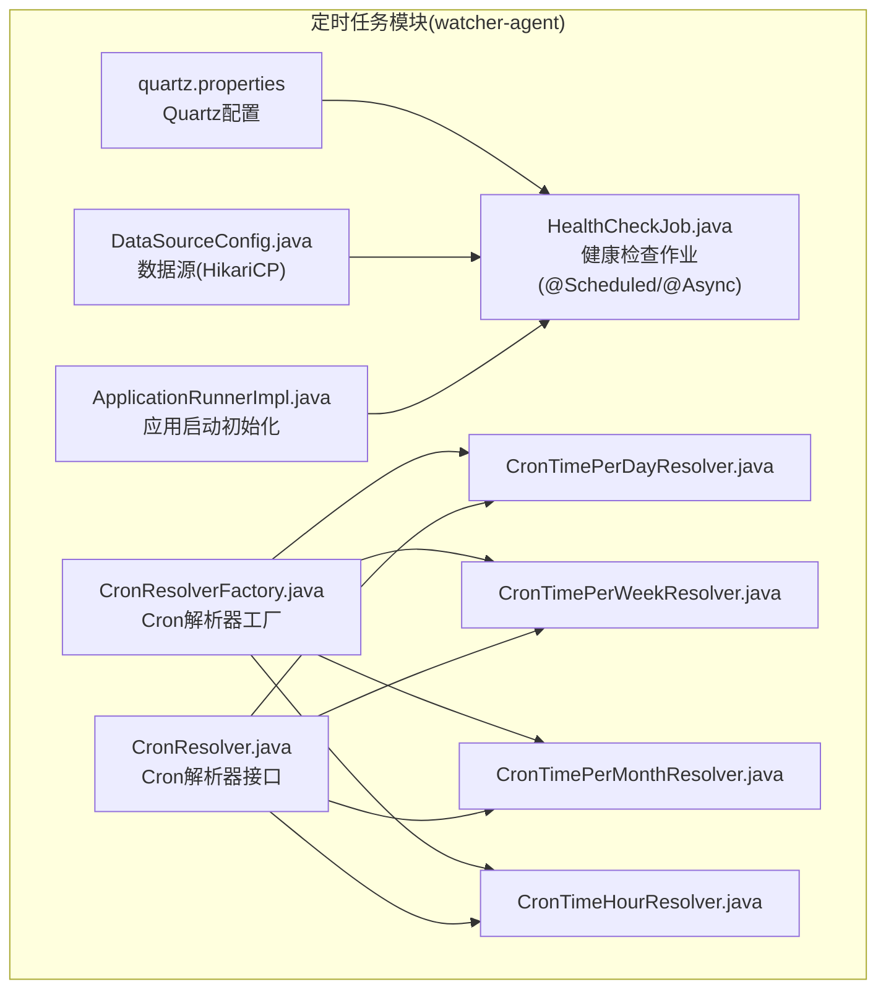
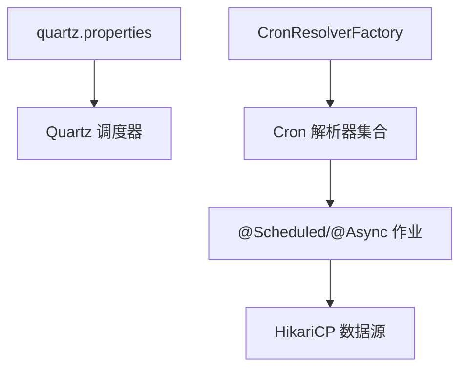
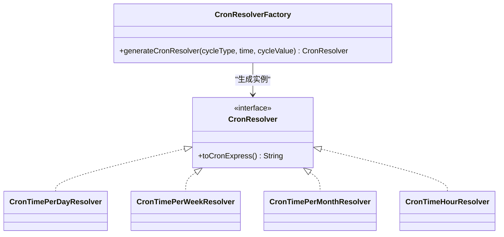
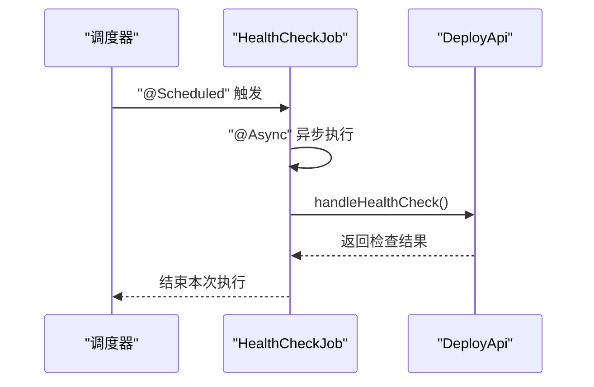
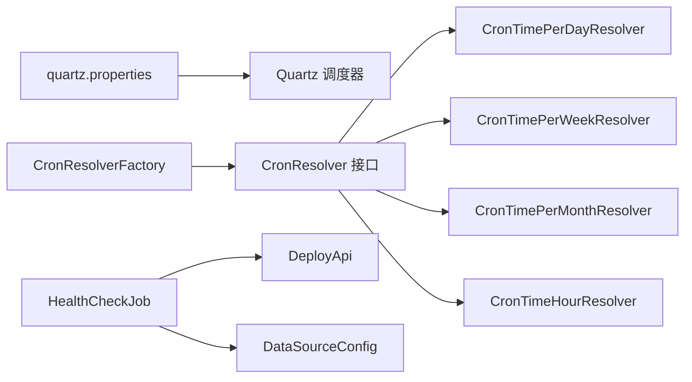

# 定时任务调度系统

<cite>
**本文引用的文件**
- [quartz.properties](file://watcher-agent/src/main/resources/quartz.properties)
- [HealthCheckJob.java](file://watcher-agent/src/main/java/com/virtual/cloud/om/agent/task/job/HealthCheckJob.java)
- [CronResolverFactory.java](file://watcher-agent/src/main/java/com/virtual/cloud/om/agent/task/cron/CronResolverFactory.java)
- [CronResolver.java](file://watcher-agent/src/main/java/com/virtual/cloud/om/agent/task/cron/CronResolver.java)
- [CronTimePerDayResolver.java](file://watcher-agent/src/main/java/com/virtual/cloud/om/agent/task/cron/CronTimePerDayResolver.java)
- [CronTimePerWeekResolver.java](file://watcher-agent/src/main/java/com/virtual/cloud/om/agent/task/cron/CronTimePerWeekResolver.java)
- [CronTimePerMonthResolver.java](file://watcher-agent/src/main/java/com/virtual/cloud/om/agent/task/cron/CronTimePerMonthResolver.java)
- [CronTimeHourResolver.java](file://watcher-agent/src/main/java/com/virtual/cloud/om/agent/task/cron/CronTimeHourResolver.java)
- [DataSourceConfig.java](file://watcher-agent/src/main/java/com/virtual/cloud/om/agent/config/DataSourceConfig.java)
- [ApplicationRunnerImpl.java](file://watcher-agent/src/main/java/com/virtual/cloud/om/agent/config/ApplicationRunnerImpl.java)
</cite>

## 目录
1. [简介](#简介)
2. [项目结构](#项目结构)
3. [核心组件](#核心组件)
4. [架构总览](#架构总览)
5. [详细组件分析](#详细组件分析)
6. [依赖关系分析](#依赖关系分析)
7. [性能考虑](#性能考虑)
8. [故障排查指南](#故障排查指南)
9. [结论](#结论)
10. [附录：配置与使用指南](#附录配置与使用指南)

## 简介
本技术文档面向“定时任务调度系统”，聚焦于以下方面：
- Quartz 调度框架的集成与配置（线程池、JobStore、集群）
- Cron 表达式解析器的实现原理（CronResolverFactory 设计模式、多策略解析器、表达式校验）
- 健康检查作业（HealthCheckJob）的实现（执行监控、状态检查、异常处理）
- 定时任务生命周期管理（注册、调度、结果反馈、资源清理）
- 性能优化与故障恢复策略
- 具体配置示例与使用指南（新增任务、周期配置、状态监控）

## 项目结构
本系统以 Spring Boot 为基础，定时任务相关代码主要位于 watcher-agent 模块中，涉及 Quartz 配置、Cron 解析器、健康检查作业以及数据源配置等。

图表来源
- [quartz.properties:1-45](file://watcher-agent/src/main/resources/quartz.properties#L1-L45)
- [HealthCheckJob.java:1-35](file://watcher-agent/src/main/java/com/virtual/cloud/om/agent/task/job/HealthCheckJob.java#L1-L35)
- [CronResolverFactory.java:1-45](file://watcher-agent/src/main/java/com/virtual/cloud/om/agent/task/cron/CronResolverFactory.java#L1-L45)
- [CronResolver.java:1-23](file://watcher-agent/src/main/java/com/virtual/cloud/om/agent/task/cron/CronResolver.java#L1-L23)
- [CronTimePerDayResolver.java:1-55](file://watcher-agent/src/main/java/com/virtual/cloud/om/agent/task/cron/CronTimePerDayResolver.java#L1-L55)
- [CronTimePerWeekResolver.java:1-64](file://watcher-agent/src/main/java/com/virtual/cloud/om/agent/task/cron/CronTimePerWeekResolver.java#L1-L64)
- [CronTimePerMonthResolver.java:1-55](file://watcher-agent/src/main/java/com/virtual/cloud/om/agent/task/cron/CronTimePerMonthResolver.java#L1-L55)
- [CronTimeHourResolver.java:1-38](file://watcher-agent/src/main/java/com/virtual/cloud/om/agent/task/cron/CronTimeHourResolver.java#L1-L38)
- [DataSourceConfig.java:1-47](file://watcher-agent/src/main/java/com/virtual/cloud/om/agent/config/DataSourceConfig.java#L1-L47)
- [ApplicationRunnerImpl.java:1-121](file://watcher-agent/src/main/java/com/virtual/cloud/om/agent/config/ApplicationRunnerImpl.java#L1-L121)

章节来源
- [quartz.properties:1-45](file://watcher-agent/src/main/resources/quartz.properties#L1-L45)
- [HealthCheckJob.java:1-35](file://watcher-agent/src/main/java/com/virtual/cloud/om/agent/task/job/HealthCheckJob.java#L1-L35)
- [CronResolverFactory.java:1-45](file://watcher-agent/src/main/java/com/virtual/cloud/om/agent/task/cron/CronResolverFactory.java#L1-L45)
- [CronResolver.java:1-23](file://watcher-agent/src/main/java/com/virtual/cloud/om/agent/task/cron/CronResolver.java#L1-L23)
- [CronTimePerDayResolver.java:1-55](file://watcher-agent/src/main/java/com/virtual/cloud/om/agent/task/cron/CronTimePerDayResolver.java#L1-L55)
- [CronTimePerWeekResolver.java:1-64](file://watcher-agent/src/main/java/com/virtual/cloud/om/agent/task/cron/CronTimePerWeekResolver.java#L1-L64)
- [CronTimePerMonthResolver.java:1-55](file://watcher-agent/src/main/java/com/virtual/cloud/om/agent/task/cron/CronTimePerMonthResolver.java#L1-L55)
- [CronTimeHourResolver.java:1-38](file://watcher-agent/src/main/java/com/virtual/cloud/om/agent/task/cron/CronTimeHourResolver.java#L1-L38)
- [DataSourceConfig.java:1-47](file://watcher-agent/src/main/java/com/virtual/cloud/om/agent/config/DataSourceConfig.java#L1-L47)
- [ApplicationRunnerImpl.java:1-121](file://watcher-agent/src/main/java/com/virtual/cloud/om/agent/config/ApplicationRunnerImpl.java#L1-L121)

## 核心组件
- Quartz 调度配置：通过 quartz.properties 设置线程池大小、JobStore 类型、集群开关等。
- Cron 解析器体系：基于工厂模式生成不同周期类型的 Cron 解析器，统一输出标准 Cron 表达式。
- 健康检查作业：使用 Spring 的 @Scheduled 与 @Async 注解实现异步定期健康检查。
- 数据源配置：HikariCP 连接池配置，支持 MariaDB 驱动及连接参数。
- 应用启动初始化：在应用启动阶段完成基础数据初始化。

章节来源
- [quartz.properties:15-45](file://watcher-agent/src/main/resources/quartz.properties#L15-L45)
- [CronResolverFactory.java:23-43](file://watcher-agent/src/main/java/com/virtual/cloud/om/agent/task/cron/CronResolverFactory.java#L23-L43)
- [HealthCheckJob.java:29-33](file://watcher-agent/src/main/java/com/virtual/cloud/om/agent/task/job/HealthCheckJob.java#L29-L33)
- [DataSourceConfig.java:27-45](file://watcher-agent/src/main/java/com/virtual/cloud/om/agent/config/DataSourceConfig.java#L27-L45)
- [ApplicationRunnerImpl.java:39-62](file://watcher-agent/src/main/java/com/virtual/cloud/om/agent/config/ApplicationRunnerImpl.java#L39-L62)

## 架构总览
下图展示了定时任务调度系统的关键交互：Quartz 从配置加载调度器；Cron 解析器将业务周期转换为 Cron 表达式；健康检查作业由 Quartz 或 Spring 定时框架调度执行；数据源为作业执行提供数据库访问能力。

图表来源
- [quartz.properties:15-45](file://watcher-agent/src/main/resources/quartz.properties#L15-L45)
- [CronResolverFactory.java:23-43](file://watcher-agent/src/main/java/com/virtual/cloud/om/agent/task/cron/CronResolverFactory.java#L23-L43)
- [HealthCheckJob.java:29-33](file://watcher-agent/src/main/java/com/virtual/cloud/om/agent/task/job/HealthCheckJob.java#L29-L33)
- [DataSourceConfig.java:27-45](file://watcher-agent/src/main/java/com/virtual/cloud/om/agent/config/DataSourceConfig.java#L27-L45)

## 详细组件分析

### Quartz 集成与配置
- 线程池：设置线程数量，控制并发执行能力。
- JobStore：可选内存存储或持久化存储（如 MongoDB/JDBC），用于保存作业与触发器元数据。
- 集群：可通过 isClustered 开启集群模式，确保多节点一致性。
- 属性文件位置：resources/quartz.properties。

建议实践
- 在生产环境启用持久化 JobStore 并开启集群模式。
- 合理设置线程池大小，避免过载或资源浪费。
- 对 Cron 表达式进行严格校验，防止无效调度。

章节来源
- [quartz.properties:15-45](file://watcher-agent/src/main/resources/quartz.properties#L15-L45)

### Cron 解析器体系与工厂模式
CronResolver 接口定义了统一的 toCronExpress 方法；CronResolverFactory 根据任务周期类型动态生成具体解析器实例，形成策略模式。

图表来源
- [CronResolver.java:7-22](file://watcher-agent/src/main/java/com/virtual/cloud/om/agent/task/cron/CronResolver.java#L7-L22)
- [CronResolverFactory.java:23-43](file://watcher-agent/src/main/java/com/virtual/cloud/om/agent/task/cron/CronResolverFactory.java#L23-L43)
- [CronTimePerDayResolver.java:11-55](file://watcher-agent/src/main/java/com/virtual/cloud/om/agent/task/cron/CronTimePerDayResolver.java#L11-L55)
- [CronTimePerWeekResolver.java:12-64](file://watcher-agent/src/main/java/com/virtual/cloud/om/agent/task/cron/CronTimePerWeekResolver.java#L12-L64)
- [CronTimePerMonthResolver.java:11-55](file://watcher-agent/src/main/java/com/virtual/cloud/om/agent/task/cron/CronTimePerMonthResolver.java#L11-L55)
- [CronTimeHourResolver.java:9-38](file://watcher-agent/src/main/java/com/virtual/cloud/om/agent/task/cron/CronTimeHourResolver.java#L9-L38)

策略选择与表达式生成要点
- 按天：固定时间点每日执行。
- 按周：指定星期几与时间。
- 按月：指定每月某一日与时间。
- 小时：按小时间隔执行。
- 秒/分钟：按秒/分钟间隔执行。
- 工厂返回空表示未知周期类型，需记录日志并拒绝调度。

章节来源
- [CronResolverFactory.java:23-43](file://watcher-agent/src/main/java/com/virtual/cloud/om/agent/task/cron/CronResolverFactory.java#L23-L43)
- [CronTimePerDayResolver.java:21-53](file://watcher-agent/src/main/java/com/virtual/cloud/om/agent/task/cron/CronTimePerDayResolver.java#L21-L53)
- [CronTimePerWeekResolver.java:22-61](file://watcher-agent/src/main/java/com/virtual/cloud/om/agent/task/cron/CronTimePerWeekResolver.java#L22-L61)
- [CronTimePerMonthResolver.java:21-52](file://watcher-agent/src/main/java/com/virtual/cloud/om/agent/task/cron/CronTimePerMonthResolver.java#L21-L52)
- [CronTimeHourResolver.java:19-35](file://watcher-agent/src/main/java/com/virtual/cloud/om/agent/task/cron/CronTimeHourResolver.java#L19-L35)

### 健康检查作业（HealthCheckJob）
该作业通过 @Async 异步执行，@Scheduled 固定频率触发，调用 DeployApi 执行健康检查逻辑。

图表来源
- [HealthCheckJob.java:29-33](file://watcher-agent/src/main/java/com/virtual/cloud/om/agent/task/job/HealthCheckJob.java#L29-L33)

执行监控与异常处理
- 初始延迟与固定周期：首次延迟与重复周期由注解参数控制。
- 异常捕获：建议在业务方法内增加 try-catch 并记录错误日志，避免影响调度线程。
- 结果反馈：将检查结果写入日志或上报指标系统，便于运维监控。

章节来源
- [HealthCheckJob.java:26-33](file://watcher-agent/src/main/java/com/virtual/cloud/om/agent/task/job/HealthCheckJob.java#L26-L33)

### 数据源与连接池配置
- 使用 HikariCP 作为连接池，配置 JDBC URL、用户名、密码、驱动类名。
- 连接池参数：最大池大小、最小空闲、连接超时、空闲超时、最大生存时间。
- MariaDB 特性：关闭 SSL、允许公钥检索、设置时区。

章节来源
- [DataSourceConfig.java:18-45](file://watcher-agent/src/main/java/com/virtual/cloud/om/agent/config/DataSourceConfig.java#L18-L45)

### 应用启动初始化
- 在 ApplicationRunner 中完成代理唯一码、系统用户、步骤状态、密码策略等初始化。
- 异常保护：每个初始化步骤独立 try-catch，避免单点失败阻塞启动。

章节来源
- [ApplicationRunnerImpl.java:39-62](file://watcher-agent/src/main/java/com/virtual/cloud/om/agent/config/ApplicationRunnerImpl.java#L39-L62)
- [ApplicationRunnerImpl.java:64-76](file://watcher-agent/src/main/java/com/virtual/cloud/om/agent/config/ApplicationRunnerImpl.java#L64-L76)
- [ApplicationRunnerImpl.java:78-89](file://watcher-agent/src/main/java/com/virtual/cloud/om/agent/config/ApplicationRunnerImpl.java#L78-L89)
- [ApplicationRunnerImpl.java:91-100](file://watcher-agent/src/main/java/com/virtual/cloud/om/agent/config/ApplicationRunnerImpl.java#L91-L100)
- [ApplicationRunnerImpl.java:102-119](file://watcher-agent/src/main/java/com/virtual/cloud/om/agent/config/ApplicationRunnerImpl.java#L102-L119)

## 依赖关系分析
- Quartz 依赖 quartz.properties 进行初始化。
- Cron 解析器依赖工厂生成，统一对外暴露 toCronExpress。
- 健康检查作业依赖 DeployApi，且受 Spring 定时框架控制。
- 数据源为所有需要数据库访问的任务提供连接。

图表来源
- [quartz.properties:15-45](file://watcher-agent/src/main/resources/quartz.properties#L15-L45)
- [CronResolverFactory.java:23-43](file://watcher-agent/src/main/java/com/virtual/cloud/om/agent/task/cron/CronResolverFactory.java#L23-L43)
- [CronResolver.java:7-22](file://watcher-agent/src/main/java/com/virtual/cloud/om/agent/task/cron/CronResolver.java#L7-L22)
- [CronTimePerDayResolver.java:11-55](file://watcher-agent/src/main/java/com/virtual/cloud/om/agent/task/cron/CronTimePerDayResolver.java#L11-L55)
- [CronTimePerWeekResolver.java:12-64](file://watcher-agent/src/main/java/com/virtual/cloud/om/agent/task/cron/CronTimePerWeekResolver.java#L12-L64)
- [CronTimePerMonthResolver.java:11-55](file://watcher-agent/src/main/java/com/virtual/cloud/om/agent/task/cron/CronTimePerMonthResolver.java#L11-L55)
- [CronTimeHourResolver.java:9-38](file://watcher-agent/src/main/java/com/virtual/cloud/om/agent/task/cron/CronTimeHourResolver.java#L9-L38)
- [HealthCheckJob.java:19-24](file://watcher-agent/src/main/java/com/virtual/cloud/om/agent/task/job/HealthCheckJob.java#L19-L24)
- [DataSourceConfig.java:27-45](file://watcher-agent/src/main/java/com/virtual/cloud/om/agent/config/DataSourceConfig.java#L27-L45)

## 性能考虑
- 线程池规模：根据 CPU 核数与 I/O 密集程度调整线程数，避免上下文切换开销过大。
- Cron 表达式复杂度：尽量使用简单规则，减少表达式解析与调度计算成本。
- 异步执行：对耗时操作使用 @Async，避免阻塞调度线程。
- 连接池优化：合理设置最大池大小与空闲超时，降低连接建立/销毁成本。
- 集群一致性：启用集群模式并使用持久化 JobStore，确保跨节点一致与容错。

## 故障排查指南
常见问题与定位思路
- 作业未执行
  - 检查 Quartz 配置是否正确加载。
  - 确认 Cron 表达式是否有效。
  - 查看调度器日志与异常堆栈。
- 周期不生效
  - 核对周期类型与解析器生成逻辑。
  - 检查时间格式与分隔符是否符合解析器要求。
- 健康检查异常
  - 在业务方法内增加异常捕获与日志记录。
  - 关注 DeployApi 的可用性与网络连通性。
- 数据库连接失败
  - 校验 JDBC URL、用户名、密码与驱动类名。
  - 检查连接池参数与数据库服务状态。

章节来源
- [quartz.properties:15-45](file://watcher-agent/src/main/resources/quartz.properties#L15-L45)
- [CronResolverFactory.java:39-42](file://watcher-agent/src/main/java/com/virtual/cloud/om/agent/task/cron/CronResolverFactory.java#L39-L42)
- [HealthCheckJob.java:29-33](file://watcher-agent/src/main/java/com/virtual/cloud/om/agent/task/job/HealthCheckJob.java#L29-L33)
- [DataSourceConfig.java:27-45](file://watcher-agent/src/main/java/com/virtual/cloud/om/agent/config/DataSourceConfig.java#L27-L45)

## 结论
本系统通过 Quartz 与 Spring 定时框架结合，配合 Cron 解析器工厂模式，实现了灵活、可扩展的定时任务调度能力。健康检查作业与数据源配置完善，满足生产环境的可靠性与性能需求。建议在生产中启用集群与持久化、严格校验 Cron 表达式、并完善异常处理与监控告警。

## 附录：配置与使用指南

### 如何创建新的定时任务
- 定义作业类：实现业务逻辑，必要时注入 DAO/Service。
- 配置 Cron 表达式：使用 CronResolverFactory 生成对应解析器，调用 toCronExpress 获取表达式。
- 注册到调度器：通过 Quartz API 或 Spring 定时注解注册作业与触发器。
- 监控与反馈：记录执行日志，上报指标，异常时及时告警。

章节来源
- [CronResolverFactory.java:23-43](file://watcher-agent/src/main/java/com/virtual/cloud/om/agent/task/cron/CronResolverFactory.java#L23-L43)
- [CronResolver.java:21-22](file://watcher-agent/src/main/java/com/virtual/cloud/om/agent/task/cron/CronResolver.java#L21-L22)

### 如何配置执行周期
- 按天：使用按天解析器，时间格式为 HH:mm:ss。
- 按周：指定星期几与时间，注意周起始日映射。
- 按月：指定日期与时间。
- 小时/分钟/秒：指定间隔值，生成相应 Cron 表达式。

章节来源
- [CronTimePerDayResolver.java:17-18](file://watcher-agent/src/main/java/com/virtual/cloud/om/agent/task/cron/CronTimePerDayResolver.java#L17-L18)
- [CronTimePerWeekResolver.java:18-19](file://watcher-agent/src/main/java/com/virtual/cloud/om/agent/task/cron/CronTimePerWeekResolver.java#L18-L19)
- [CronTimePerMonthResolver.java:17-18](file://watcher-agent/src/main/java/com/virtual/cloud/om/agent/task/cron/CronTimePerMonthResolver.java#L17-L18)
- [CronTimeHourResolver.java:15-16](file://watcher-agent/src/main/java/com/virtual/cloud/om/agent/task/cron/CronTimeHourResolver.java#L15-L16)

### 如何监控任务状态
- 日志：在作业与解析器中记录关键事件与异常。
- 指标：将执行次数、耗时、失败率等指标上报监控系统。
- 健康检查：通过 HealthCheckJob 定期上报系统健康状态。

章节来源
- [HealthCheckJob.java:29-33](file://watcher-agent/src/main/java/com/virtual/cloud/om/agent/task/job/HealthCheckJob.java#L29-L33)

### 配置示例（路径参考）
- Quartz 线程池与 JobStore：参考 [quartz.properties:15-45](file://watcher-agent/src/main/resources/quartz.properties#L15-L45)
- 数据源与连接池：参考 [DataSourceConfig.java:27-45](file://watcher-agent/src/main/java/com/virtual/cloud/om/agent/config/DataSourceConfig.java#L27-L45)
- 健康检查作业：参考 [HealthCheckJob.java:29-33](file://watcher-agent/src/main/java/com/virtual/cloud/om/agent/task/job/HealthCheckJob.java#L29-L33)
- Cron 解析器工厂：参考 [CronResolverFactory.java:23-43](file://watcher-agent/src/main/java/com/virtual/cloud/om/agent/task/cron/CronResolverFactory.java#L23-L43)