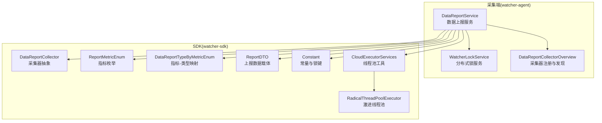
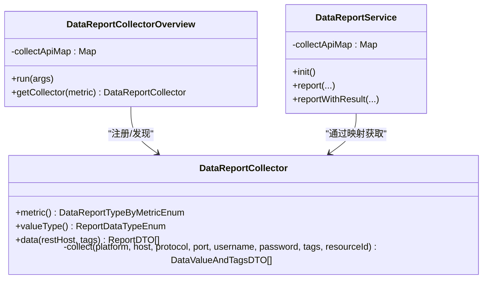
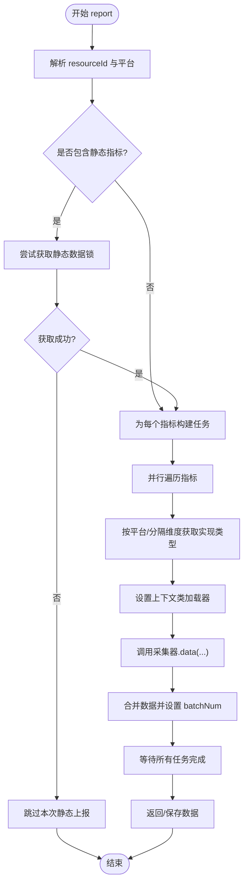
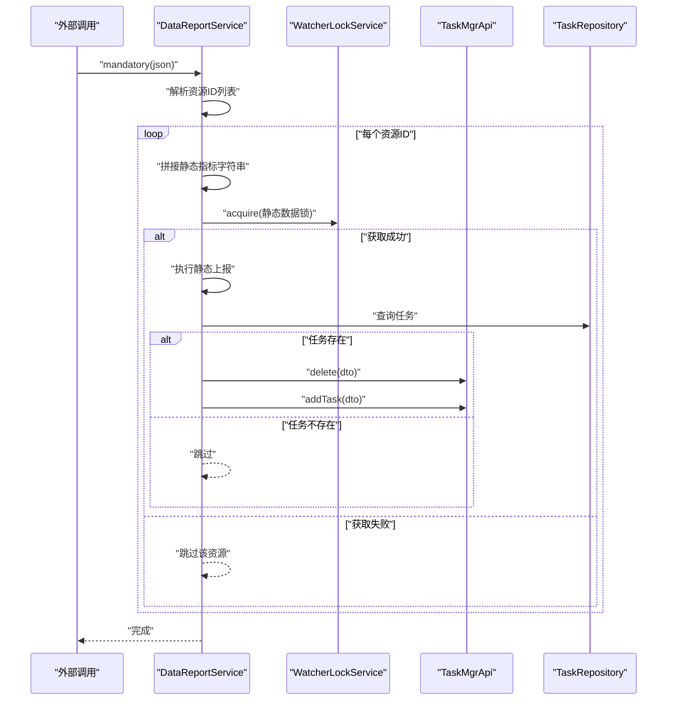
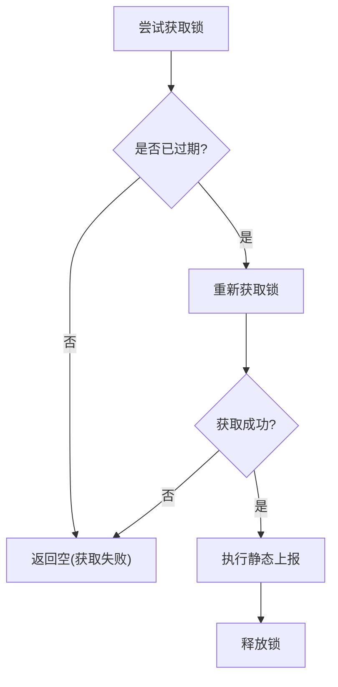
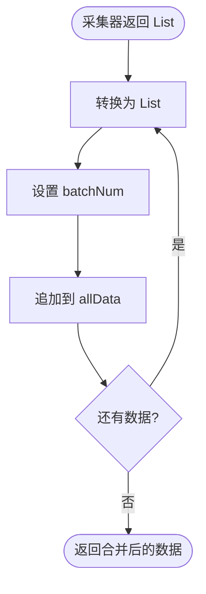
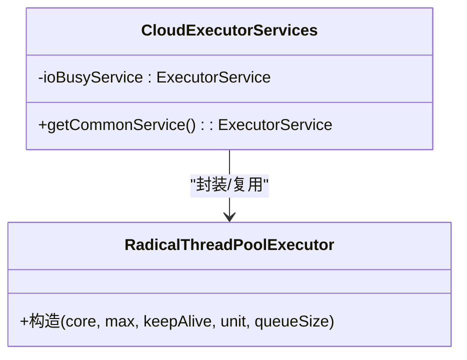
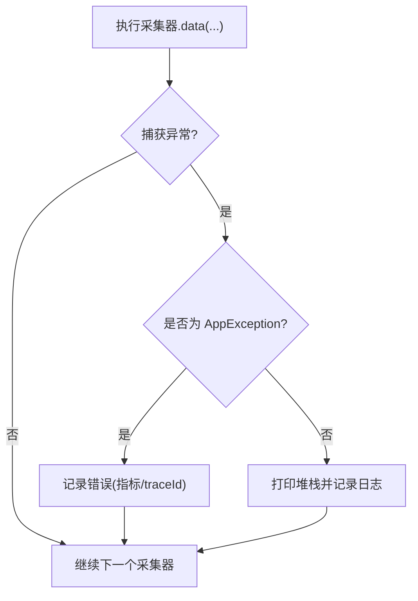
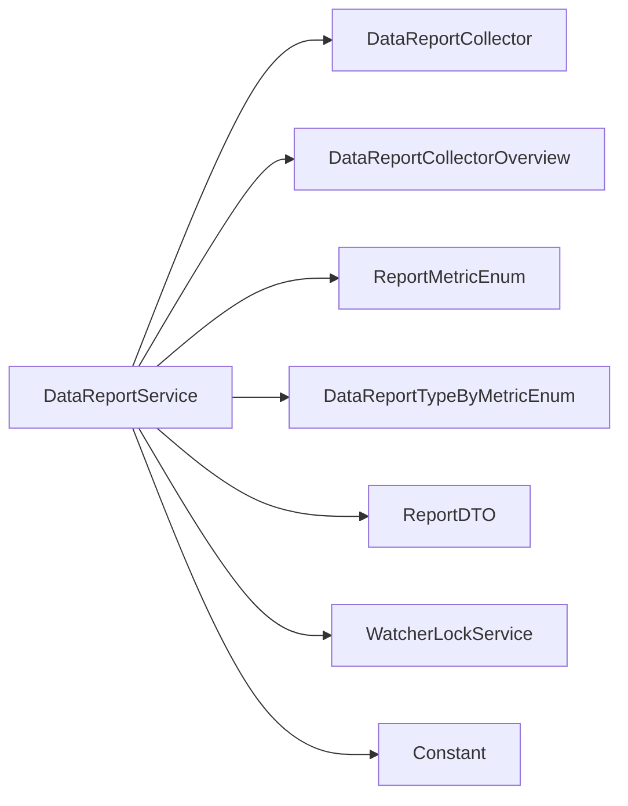

# 数据报告服务

<cite>
**本文引用的文件**
- [DataReportService.java](file://watcher-agent/src/main/java/com/virtual/cloud/om/agent/service/report/DataReportService.java)
- [DataReportCollector.java](file://watcher-sdk/src/main/java/com/virtual/cloud/om/sdk/api/DataReportCollector.java)
- [ReportMetricEnum.java](file://watcher-sdk/src/main/java/com/virtual/cloud/om/sdk/constant/report/ReportMetricEnum.java)
- [DataReportTypeByMetricEnum.java](file://watcher-sdk/src/main/java/com/virtual/cloud/om/sdk/constant/DataReportTypeByMetricEnum.java)
- [ReportDTO.java](file://watcher-sdk/src/main/java/com/virtual/cloud/om/sdk/dto/dataReport/workspace/ReportDTO.java)
- [Constant.java](file://watcher-sdk/src/main/java/com/virtual/cloud/om/sdk/constant/Constant.java)
- [WatcherLockService.java](file://watcher-agent/src/main/java/com/virtual/cloud/om/agent/service/lock/WatcherLockService.java)
- [CloudExecutorServices.java](file://watcher-sdk/src/main/java/com/virtual/cloud/om/sdk/concurrent/CloudExecutorServices.java)
- [RadicalThreadPoolExecutor.java](file://watcher-sdk/src/main/java/com/virtual/cloud/om/sdk/concurrent/RadicalThreadPoolExecutor.java)
- [DataReportCollectorOverview.java](file://watcher-agent/src/main/java/com/virtual/cloud/om/agent/service/DataReportCollectorOverview.java)
</cite>

## 目录
1. [简介](#简介)
2. [项目结构](#项目结构)
3. [核心组件](#核心组件)
4. [架构总览](#架构总览)
5. [组件详解](#组件详解)
6. [依赖关系分析](#依赖关系分析)
7. [性能考量](#性能考量)
8. [故障排查指南](#故障排查指南)
9. [结论](#结论)
10. [附录](#附录)

## 简介
本技术文档围绕数据报告服务展开，重点解析 DataReportService 的核心架构设计，包括：
- 数据采集器工厂模式的实现与扩展机制
- 并发数据处理与 CompletableFuture 异步流水线
- 错误处理与异常恢复策略
- 强制上报（mandatory）工作原理：静态数据采集流程、分布式锁机制与任务重试逻辑
- 数据上报的异步处理架构：线程池管理与上下文类加载器处理
- 数据转换与批处理机制：批次编号生成、数据合并策略与内存优化
- 配置示例与使用指南：如何注册新采集器、配置采集参数与监控采集性能
- 数据质量保证与异常恢复策略

## 项目结构
数据报告服务主要分布在以下模块：
- watcher-agent：采集端服务，负责调度上报、并发执行、分布式锁与任务编排
- watcher-sdk：SDK 公共能力，包括采集器抽象、枚举常量、DTO、线程池与工具类



**图表来源**
- [DataReportService.java:50-79](file://watcher-agent/src/main/java/com/virtual/cloud/om/agent/service/report/DataReportService.java#L50-L79)
- [WatcherLockService.java:18-69](file://watcher-agent/src/main/java/com/virtual/cloud/om/agent/service/lock/WatcherLockService.java#L18-L69)
- [DataReportCollectorOverview.java:22-44](file://watcher-agent/src/main/java/com/virtual/cloud/om/agent/service/DataReportCollectorOverview.java#L22-L44)
- [DataReportCollector.java:18-118](file://watcher-sdk/src/main/java/com/virtual/cloud/om/sdk/api/DataReportCollector.java#L18-L118)
- [ReportMetricEnum.java:9-117](file://watcher-sdk/src/main/java/com/virtual/cloud/om/sdk/constant/report/ReportMetricEnum.java#L9-L117)
- [DataReportTypeByMetricEnum.java:21-189](file://watcher-sdk/src/main/java/com/virtual/cloud/om/sdk/constant/DataReportTypeByMetricEnum.java#L21-L189)
- [ReportDTO.java:11-24](file://watcher-sdk/src/main/java/com/virtual/cloud/om/sdk/dto/dataReport/workspace/ReportDTO.java#L11-L24)
- [Constant.java:184-187](file://watcher-sdk/src/main/java/com/virtual/cloud/om/sdk/constant/Constant.java#L184-L187)
- [CloudExecutorServices.java:19-42](file://watcher-sdk/src/main/java/com/virtual/cloud/om/sdk/concurrent/CloudExecutorServices.java#L19-L42)
- [RadicalThreadPoolExecutor.java:18-31](file://watcher-sdk/src/main/java/com/virtual/cloud/om/sdk/concurrent/RadicalThreadPoolExecutor.java#L18-L31)

**章节来源**
- [DataReportService.java:50-79](file://watcher-agent/src/main/java/com/virtual/cloud/om/agent/service/report/DataReportService.java#L50-L79)
- [DataReportCollectorOverview.java:22-44](file://watcher-agent/src/main/java/com/virtual/cloud/om/agent/service/DataReportCollectorOverview.java#L22-L44)

## 核心组件
- DataReportService：采集端核心服务，负责指标解析、平台识别、并发采集、批次编号生成、数据合并与错误上报
- DataReportCollector：采集器抽象基类，定义采集入口、数据转换与类型约束
- ReportMetricEnum：指标枚举，区分静态与动态指标，并提供静态指标筛选
- DataReportTypeByMetricEnum：指标到具体实现类型的映射，支持按平台与分隔维度选择
- ReportDTO：上报数据载体，包含指标、类型、标签、批次号、值与时间戳
- Constant：常量定义，含分布式锁键等
- WatcherLockService：分布式锁服务（MySQL 单机版），基于内存 Map 实现
- CloudExecutorServices / RadicalThreadPoolExecutor：线程池工具与激进线程池，保障 IO 密集型任务并发与稳定性

**章节来源**
- [DataReportService.java:50-79](file://watcher-agent/src/main/java/com/virtual/cloud/om/agent/service/report/DataReportService.java#L50-L79)
- [DataReportCollector.java:18-118](file://watcher-sdk/src/main/java/com/virtual/cloud/om/sdk/api/DataReportCollector.java#L18-L118)
- [ReportMetricEnum.java:9-117](file://watcher-sdk/src/main/java/com/virtual/cloud/om/sdk/constant/report/ReportMetricEnum.java#L9-L117)
- [DataReportTypeByMetricEnum.java:21-189](file://watcher-sdk/src/main/java/com/virtual/cloud/om/sdk/constant/DataReportTypeByMetricEnum.java#L21-L189)
- [ReportDTO.java:11-24](file://watcher-sdk/src/main/java/com/virtual/cloud/om/sdk/dto/dataReport/workspace/ReportDTO.java#L11-L24)
- [Constant.java:184-187](file://watcher-sdk/src/main/java/com/virtual/cloud/om/sdk/constant/Constant.java#L184-L187)
- [WatcherLockService.java:18-69](file://watcher-agent/src/main/java/com/virtual/cloud/om/agent/service/lock/WatcherLockService.java#L18-L69)
- [CloudExecutorServices.java:19-42](file://watcher-sdk/src/main/java/com/virtual/cloud/om/sdk/concurrent/CloudExecutorServices.java#L19-L42)
- [RadicalThreadPoolExecutor.java:18-31](file://watcher-sdk/src/main/java/com/virtual/cloud/om/sdk/concurrent/RadicalThreadPoolExecutor.java#L18-L31)

## 架构总览
数据报告服务采用“策略+工厂”的架构：
- 指标层：ReportMetricEnum 定义可采集指标集合
- 映射层：DataReportTypeByMetricEnum 将指标映射到具体实现类型（支持按平台与分隔维度）
- 工厂层：DataReportCollectorOverview 注册并维护采集器映射
- 执行层：DataReportService 解析资源、平台与指标，构建并发采集流水线，生成批次号并合并结果

```mermaid
sequenceDiagram
participant Caller as "调用方"
participant Service as "DataReportService"
participant Factory as "DataReportCollectorOverview"
participant Collector as "DataReportCollector"
participant Lock as "WatcherLockService"
Caller->>Service : "report(tags, metrics)"
Service->>Service : "解析 resourceId 与平台"
alt "存在静态指标"
Service->>Lock : "acquire(静态数据锁)"
Lock-->>Service : "返回 token 或空"
alt "获取锁成功"
Service->>Service : "report(..., ifStatic=true)"
else "获取锁失败"
Service-->>Caller : "跳过本次静态上报"
exit
end
end
Service->>Factory : "按指标查找采集器"
Factory-->>Service : "返回 DataReportCollector 列表"
par "并发采集"
Service->>Collector : "data(restHost, tags)"
Collector-->>Service : "返回 ReportDTO 列表"
end
Service->>Service : "合并数据并设置 batchNum"
Service-->>Caller : "返回/保存数据"
```

**图表来源**
- [DataReportService.java:115-140](file://watcher-agent/src/main/java/com/virtual/cloud/om/agent/service/report/DataReportService.java#L115-L140)
- [DataReportService.java:166-230](file://watcher-agent/src/main/java/com/virtual/cloud/om/agent/service/report/DataReportService.java#L166-L230)
- [DataReportCollectorOverview.java:22-44](file://watcher-agent/src/main/java/com/virtual/cloud/om/agent/service/DataReportCollectorOverview.java#L22-L44)
- [WatcherLockService.java:33-47](file://watcher-agent/src/main/java/com/virtual/cloud/om/agent/service/lock/WatcherLockService.java#L33-L47)

## 组件详解

### 工厂模式与采集器注册
- DataReportCollectorOverview 在应用启动时扫描所有 DataReportCollector 实现，按指标名建立映射，便于运行时快速定位采集器
- DataReportService 在初始化阶段也建立本地映射，加速运行时查找



**图表来源**
- [DataReportCollector.java:18-118](file://watcher-sdk/src/main/java/com/virtual/cloud/om/sdk/api/DataReportCollector.java#L18-L118)
- [DataReportCollectorOverview.java:22-44](file://watcher-agent/src/main/java/com/virtual/cloud/om/agent/service/DataReportCollectorOverview.java#L22-L44)
- [DataReportService.java:76-79](file://watcher-agent/src/main/java/com/virtual/cloud/om/agent/service/report/DataReportService.java#L76-L79)

**章节来源**
- [DataReportCollectorOverview.java:22-44](file://watcher-agent/src/main/java/com/virtual/cloud/om/agent/service/DataReportCollectorOverview.java#L22-L44)
- [DataReportService.java:76-79](file://watcher-agent/src/main/java/com/virtual/cloud/om/agent/service/report/DataReportService.java#L76-L79)

### 并发数据处理与 CompletableFuture 异步流水线
- DataReportService 对每个指标创建一个 CompletableFuture，内部再对每个实现类型创建子任务
- 子任务在 ForkJoinPool 中执行，为避免 TCCL 问题，显式设置上下文类加载器
- 使用 CopyOnWriteArrayList 作为并发容器，降低写入竞争；最终合并所有结果



**图表来源**
- [DataReportService.java:115-140](file://watcher-agent/src/main/java/com/virtual/cloud/om/agent/service/report/DataReportService.java#L115-L140)
- [DataReportService.java:166-230](file://watcher-agent/src/main/java/com/virtual/cloud/om/agent/service/report/DataReportService.java#L166-L230)
- [DataReportService.java:188-229](file://watcher-agent/src/main/java/com/virtual/cloud/om/agent/service/report/DataReportService.java#L188-L229)

**章节来源**
- [DataReportService.java:166-230](file://watcher-agent/src/main/java/com/virtual/cloud/om/agent/service/report/DataReportService.java#L166-L230)

### 强制上报（mandatory）工作原理
- mandatory 接口接收资源 ID 列表与静态指标集合，逐个资源执行静态数据上报
- 对每个静态指标，先尝试获取分布式锁，若已有任务在执行则跳过，避免重复上报
- 成功获取锁后执行静态上报，随后刷新对应任务状态（删除旧任务并新增）



**图表来源**
- [DataReportService.java:89-110](file://watcher-agent/src/main/java/com/virtual/cloud/om/agent/service/report/DataReportService.java#L89-L110)
- [Constant.java:184-187](file://watcher-sdk/src/main/java/com/virtual/cloud/om/sdk/constant/Constant.java#L184-L187)
- [WatcherLockService.java:33-47](file://watcher-agent/src/main/java/com/virtual/cloud/om/agent/service/lock/WatcherLockService.java#L33-L47)

**章节来源**
- [DataReportService.java:89-110](file://watcher-agent/src/main/java/com/virtual/cloud/om/agent/service/report/DataReportService.java#L89-L110)
- [Constant.java:184-187](file://watcher-sdk/src/main/java/com/virtual/cloud/om/sdk/constant/Constant.java#L184-L187)
- [WatcherLockService.java:33-47](file://watcher-agent/src/main/java/com/virtual/cloud/om/agent/service/lock/WatcherLockService.java#L33-L47)

### 分布式锁机制与任务重试逻辑
- 使用 WatcherLockService 提供的 acquire/release/refresh 接口实现分布式锁
- 锁键格式为常量定义，过期时间设置为 30 分钟
- 若获取失败，表示其他实例正在执行相同资源的静态数据上报，直接跳过当前请求，避免重复与冲突



**图表来源**
- [WatcherLockService.java:33-69](file://watcher-agent/src/main/java/com/virtual/cloud/om/agent/service/lock/WatcherLockService.java#L33-L69)
- [Constant.java:184-187](file://watcher-sdk/src/main/java/com/virtual/cloud/om/sdk/constant/Constant.java#L184-L187)

**章节来源**
- [WatcherLockService.java:33-69](file://watcher-agent/src/main/java/com/virtual/cloud/om/agent/service/lock/WatcherLockService.java#L33-L69)
- [Constant.java:184-187](file://watcher-sdk/src/main/java/com/virtual/cloud/om/sdk/constant/Constant.java#L184-L187)

### 数据转换与批处理机制
- 批次编号 batchNum 基于秒级时间戳换算为分钟粒度，便于下游聚合与去重
- 采集器返回的 DataValueAndTagsDTO 转换为 ReportDTO，统一设置时间戳与标签
- 使用 CopyOnWriteArrayList 作为并发容器，减少写入竞争；最终合并到 allData
- 内存优化：仅在必要时复制数据，避免不必要的拷贝



**图表来源**
- [DataReportCollector.java:61-85](file://watcher-sdk/src/main/java/com/virtual/cloud/om/sdk/api/DataReportCollector.java#L61-L85)
- [DataReportService.java:121-122](file://watcher-agent/src/main/java/com/virtual/cloud/om/agent/service/report/DataReportService.java#L121-L122)
- [DataReportService.java:207-209](file://watcher-agent/src/main/java/com/virtual/cloud/om/agent/service/report/DataReportService.java#L207-L209)

**章节来源**
- [DataReportCollector.java:61-85](file://watcher-sdk/src/main/java/com/virtual/cloud/om/sdk/api/DataReportCollector.java#L61-L85)
- [DataReportService.java:121-122](file://watcher-agent/src/main/java/com/virtual/cloud/om/agent/service/report/DataReportService.java#L121-L122)
- [DataReportService.java:207-209](file://watcher-agent/src/main/java/com/virtual/cloud/om/agent/service/report/DataReportService.java#L207-L209)

### 线程池管理与上下文类加载器处理
- DataReportService 在并发采集前捕获调用线程的 TCCL，并在子任务中显式设置，避免 JAXB 等类加载问题
- 线程池工具 CloudExecutorServices 提供通用 IO 密集型任务执行器，RadicalThreadPoolExecutor 采用激进策略以提升并发吞吐



**图表来源**
- [CloudExecutorServices.java:19-42](file://watcher-sdk/src/main/java/com/virtual/cloud/om/sdk/concurrent/CloudExecutorServices.java#L19-L42)
- [RadicalThreadPoolExecutor.java:18-31](file://watcher-sdk/src/main/java/com/virtual/cloud/om/sdk/concurrent/RadicalThreadPoolExecutor.java#L18-L31)
- [DataReportService.java:197-197](file://watcher-agent/src/main/java/com/virtual/cloud/om/agent/service/report/DataReportService.java#L197-L197)

**章节来源**
- [CloudExecutorServices.java:19-42](file://watcher-sdk/src/main/java/com/virtual/cloud/om/sdk/concurrent/CloudExecutorServices.java#L19-L42)
- [RadicalThreadPoolExecutor.java:18-31](file://watcher-sdk/src/main/java/com/virtual/cloud/om/sdk/concurrent/RadicalThreadPoolExecutor.java#L18-L31)
- [DataReportService.java:197-197](file://watcher-agent/src/main/java/com/virtual/cloud/om/agent/service/report/DataReportService.java#L197-L197)

### 错误处理与异常恢复策略
- 对采集器抛出的 AppException 进行分类处理，非 watcher 场景下记录错误信息
- 使用 CopyOnWriteArrayList 收集错误，避免并发写入问题
- 上报异常接口支持记录错误详情与追踪标识，便于定位问题



**图表来源**
- [DataReportService.java:210-218](file://watcher-agent/src/main/java/com/virtual/cloud/om/agent/service/report/DataReportService.java#L210-L218)
- [DataReportService.java:271-279](file://watcher-agent/src/main/java/com/virtual/cloud/om/agent/service/report/DataReportService.java#L271-L279)

**章节来源**
- [DataReportService.java:210-218](file://watcher-agent/src/main/java/com/virtual/cloud/om/agent/service/report/DataReportService.java#L210-L218)
- [DataReportService.java:271-279](file://watcher-agent/src/main/java/com/virtual/cloud/om/agent/service/report/DataReportService.java#L271-L279)

## 依赖关系分析
- DataReportService 依赖 DataReportCollector 抽象与其实现，通过 DataReportCollectorOverview 进行注册与发现
- 指标与实现类型映射由 DataReportTypeByMetricEnum 提供，支持按平台与分隔维度选择
- 上报数据载体 ReportDTO 与指标类型 ReportDataTypeEnum 定义了数据结构与语义
- 分布式锁由 WatcherLockService 提供，常量定义位于 Constant



**图表来源**
- [DataReportService.java:50-79](file://watcher-agent/src/main/java/com/virtual/cloud/om/agent/service/report/DataReportService.java#L50-L79)
- [DataReportCollector.java:18-118](file://watcher-sdk/src/main/java/com/virtual/cloud/om/sdk/api/DataReportCollector.java#L18-L118)
- [DataReportCollectorOverview.java:22-44](file://watcher-agent/src/main/java/com/virtual/cloud/om/agent/service/DataReportCollectorOverview.java#L22-L44)
- [ReportMetricEnum.java:9-117](file://watcher-sdk/src/main/java/com/virtual/cloud/om/sdk/constant/report/ReportMetricEnum.java#L9-L117)
- [DataReportTypeByMetricEnum.java:21-189](file://watcher-sdk/src/main/java/com/virtual/cloud/om/sdk/constant/DataReportTypeByMetricEnum.java#L21-L189)
- [ReportDTO.java:11-24](file://watcher-sdk/src/main/java/com/virtual/cloud/om/sdk/dto/dataReport/workspace/ReportDTO.java#L11-L24)
- [WatcherLockService.java:18-69](file://watcher-agent/src/main/java/com/virtual/cloud/om/agent/service/lock/WatcherLockService.java#L18-L69)
- [Constant.java:184-187](file://watcher-sdk/src/main/java/com/virtual/cloud/om/sdk/constant/Constant.java#L184-L187)

**章节来源**
- [DataReportService.java:50-79](file://watcher-agent/src/main/java/com/virtual/cloud/om/agent/service/report/DataReportService.java#L50-L79)
- [DataReportCollector.java:18-118](file://watcher-sdk/src/main/java/com/virtual/cloud/om/sdk/api/DataReportCollector.java#L18-L118)
- [DataReportCollectorOverview.java:22-44](file://watcher-agent/src/main/java/com/virtual/cloud/om/agent/service/DataReportCollectorOverview.java#L22-L44)
- [ReportMetricEnum.java:9-117](file://watcher-sdk/src/main/java/com/virtual/cloud/om/sdk/constant/report/ReportMetricEnum.java#L9-L117)
- [DataReportTypeByMetricEnum.java:21-189](file://watcher-sdk/src/main/java/com/virtual/cloud/om/sdk/constant/DataReportTypeByMetricEnum.java#L21-L189)
- [ReportDTO.java:11-24](file://watcher-sdk/src/main/java/com/virtual/cloud/om/sdk/dto/dataReport/workspace/ReportDTO.java#L11-L24)
- [WatcherLockService.java:18-69](file://watcher-agent/src/main/java/com/virtual/cloud/om/agent/service/lock/WatcherLockService.java#L18-L69)
- [Constant.java:184-187](file://watcher-sdk/src/main/java/com/virtual/cloud/om/sdk/constant/Constant.java#L184-L187)

## 性能考量
- 并发模型：使用 CompletableFuture 并行执行指标与实现类型，充分利用多核 CPU
- 线程池：激进线程池 RadialThreadPoolExecutor 在核心线程满载后优先扩容线程，避免频繁阻塞队列切换
- 内存优化：CopyOnWriteArrayList 适合读多写少场景，减少写入锁竞争
- 类加载：显式设置 TCCL 避免 ForkJoinPool 子线程缺失导致的类加载异常
- 批次编号：按分钟粒度生成 batchNum，便于下游聚合与限流控制

[本节为通用性能建议，无需特定文件引用]

## 故障排查指南
- 上报失败但未抛出异常：检查采集器返回值是否为空，确认是否正确设置时间戳与标签
- 并发写入异常：确认使用 CopyOnWriteArrayList，避免在迭代过程中修改集合
- 类加载失败：确认已在子任务中设置上下文类加载器
- 锁竞争：静态数据上报时检查锁键与过期时间，避免长时间持有锁
- 错误上报：通过 reportError 接口记录错误详情与 traceId，便于定位问题

**章节来源**
- [DataReportService.java:210-218](file://watcher-agent/src/main/java/com/virtual/cloud/om/agent/service/report/DataReportService.java#L210-L218)
- [DataReportService.java:271-279](file://watcher-agent/src/main/java/com/virtual/cloud/om/agent/service/report/DataReportService.java#L271-L279)
- [DataReportService.java:309-332](file://watcher-agent/src/main/java/com/virtual/cloud/om/agent/service/report/DataReportService.java#L309-L332)

## 结论
数据报告服务通过“策略+工厂”模式实现了高扩展性与高并发的数据采集能力。借助 CompletableFuture 异步流水线、激进线程池与严格的错误处理机制，系统在保证性能的同时具备良好的稳定性与可观测性。强制上报与分布式锁机制有效避免了重复与冲突，结合批次编号与数据合并策略，满足大规模资源的高效上报需求。

[本节为总结性内容，无需特定文件引用]

## 附录

### 使用指南与配置示例
- 注册新的数据采集器
  - 新建实现类继承 DataReportCollector，实现指标与值类型声明以及采集逻辑
  - 确保实现类被 Spring 扫描并注入，以便 DataReportCollectorOverview 与 DataReportService 能够发现
  - 参考路径：
    - [DataReportCollector.java:18-118](file://watcher-sdk/src/main/java/com/virtual/cloud/om/sdk/api/DataReportCollector.java#L18-L118)
    - [DataReportCollectorOverview.java:22-44](file://watcher-agent/src/main/java/com/virtual/cloud/om/agent/service/DataReportCollectorOverview.java#L22-L44)
    - [DataReportService.java:76-79](file://watcher-agent/src/main/java/com/virtual/cloud/om/agent/service/report/DataReportService.java#L76-L79)

- 配置采集参数
  - 指标选择：通过 metrics 参数传入 ReportMetricEnum 名称，多个指标以分号分隔
  - 资源标签：tags 中包含 resourceId 等关键标识，采集器通过 getId 方法解析
  - 参考路径：
    - [ReportMetricEnum.java:9-117](file://watcher-sdk/src/main/java/com/virtual/cloud/om/sdk/constant/report/ReportMetricEnum.java#L9-L117)
    - [DataReportCollector.java:27-39](file://watcher-sdk/src/main/java/com/virtual/cloud/om/sdk/api/DataReportCollector.java#L27-L39)

- 监控采集性能
  - 关注日志中的采集耗时与批次号，评估并发与线程池配置
  - 参考路径：
    - [DataReportService.java:52-60](file://watcher-agent/src/main/java/com/virtual/cloud/om/agent/service/report/DataReportService.java#L52-L60)
    - [DataReportService.java:121-122](file://watcher-agent/src/main/java/com/virtual/cloud/om/agent/service/report/DataReportService.java#L121-L122)

- 强制上报（mandatory）
  - 调用 mandatory 接口，传入资源 ID 列表与静态指标集合
  - 参考路径：
    - [DataReportService.java:89-110](file://watcher-agent/src/main/java/com/virtual/cloud/om/agent/service/report/DataReportService.java#L89-L110)
    - [Constant.java:184-187](file://watcher-sdk/src/main/java/com/virtual/cloud/om/sdk/constant/Constant.java#L184-L187)
    - [WatcherLockService.java:33-47](file://watcher-agent/src/main/java/com/virtual/cloud/om/agent/service/lock/WatcherLockService.java#L33-L47)

- 线程池与上下文类加载器
  - 使用 CloudExecutorServices 获取通用线程池；在子任务中设置 TCCL
  - 参考路径：
    - [CloudExecutorServices.java:19-42](file://watcher-sdk/src/main/java/com/virtual/cloud/om/sdk/concurrent/CloudExecutorServices.java#L19-L42)
    - [RadicalThreadPoolExecutor.java:18-31](file://watcher-sdk/src/main/java/com/virtual/cloud/om/sdk/concurrent/RadicalThreadPoolExecutor.java#L18-L31)
    - [DataReportService.java:197-197](file://watcher-agent/src/main/java/com/virtual/cloud/om/agent/service/report/DataReportService.java#L197-L197)