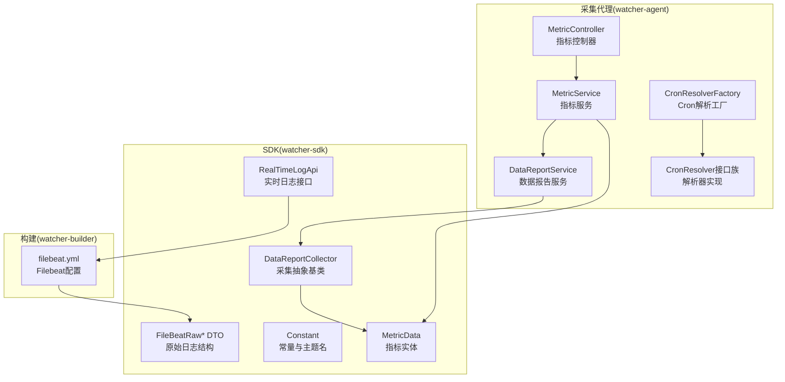
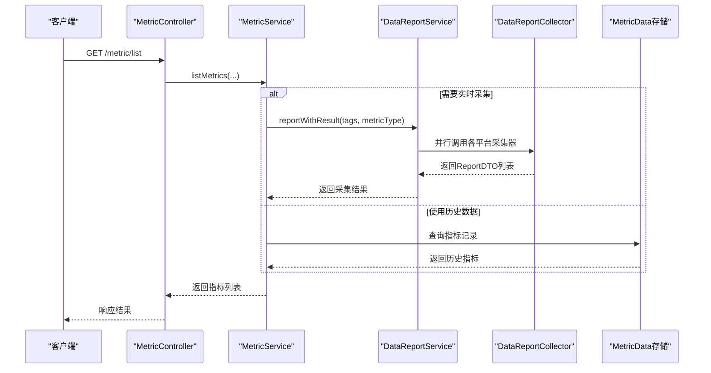
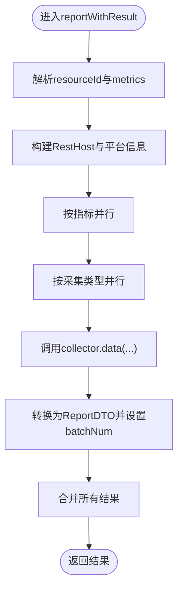
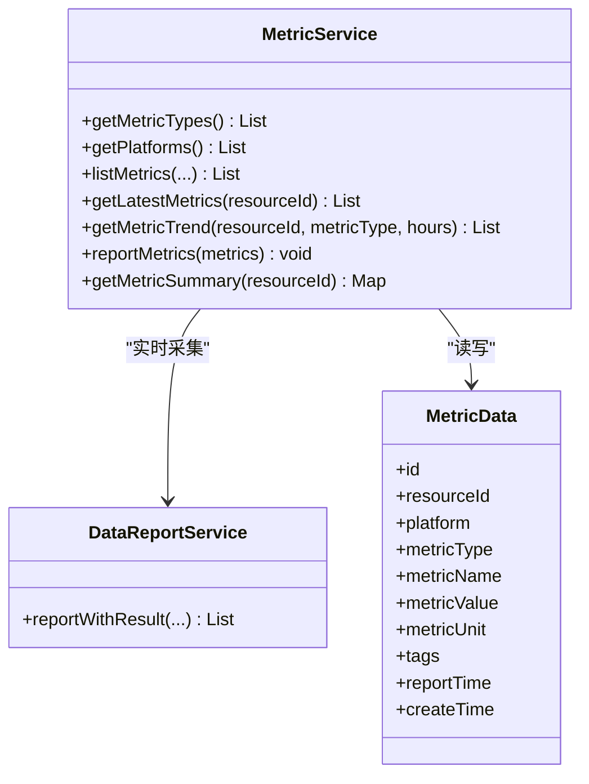
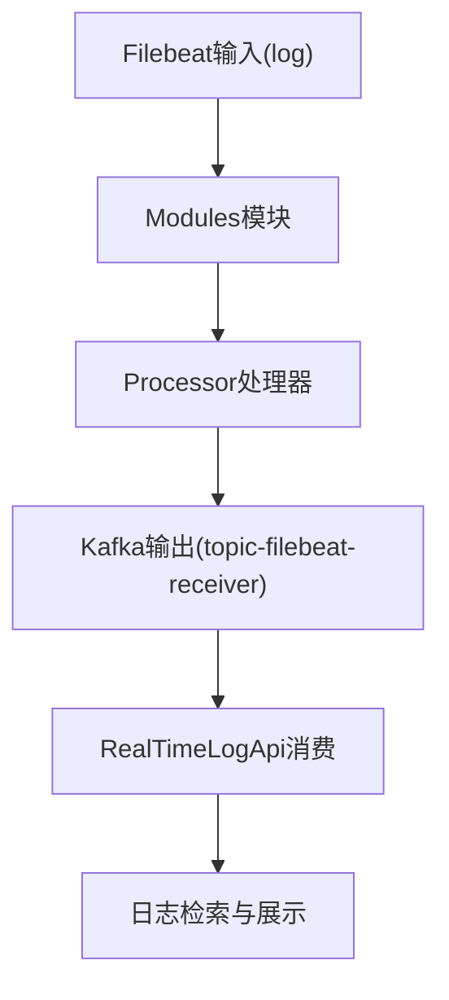
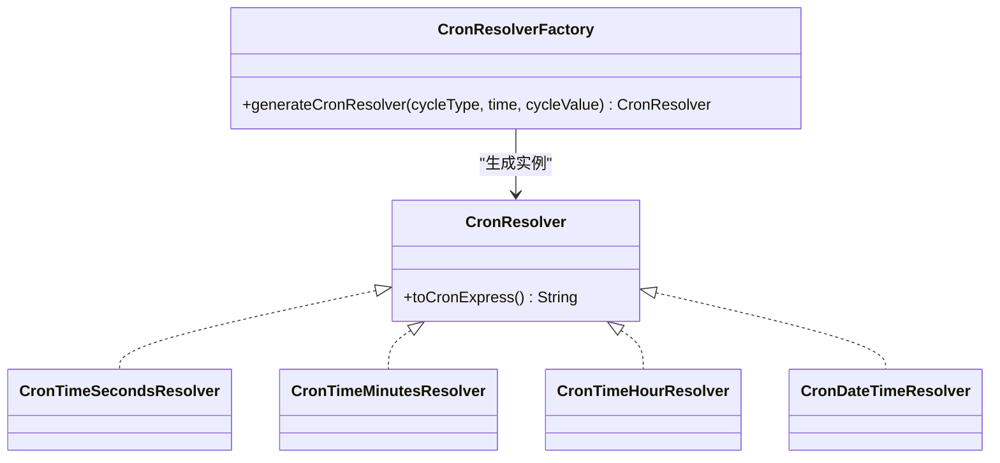
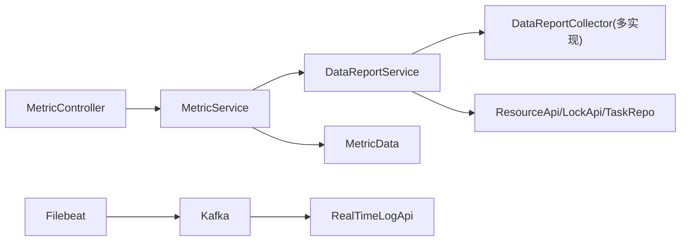

# 数据采集系统

<cite>
**本文引用的文件**
- [DataReportService.java](file://watcher-agent/src/main/java/com/virtual/cloud/om/agent/service/report/DataReportService.java)
- [DataReportCollector.java](file://watcher-sdk/src/main/java/com/virtual/cloud/om/sdk/api/DataReportCollector.java)
- [MetricService.java](file://watcher-agent/src/main/java/com/virtual/cloud/om/agent/service/report/MetricService.java)
- [MetricController.java](file://watcher-agent/src/main/java/com/virtual/cloud/om/agent/controller/MetricController.java)
- [MetricData.java](file://watcher-sdk/src/main/java/com/virtual/cloud/om/sdk/entity/mysql/MetricData.java)
- [application.properties](file://watcher-agent/src/main/resources/application.properties)
- [CronResolver.java](file://watcher-agent/src/main/java/com/virtual/cloud/om/agent/task/cron/CronResolver.java)
- [CronResolverFactory.java](file://watcher-agent/src/main/java/com/virtual/cloud/om/agent/task/cron/CronResolverFactory.java)
- [CronTimeSecondsResolver.java](file://watcher-agent/src/main/java/com/virtual/cloud/om/agent/task/cron/CronTimeSecondsResolver.java)
- [CronTimeMinutesResolver.java](file://watcher-agent/src/main/java/com/virtual/cloud/om/agent/task/cron/CronTimeMinutesResolver.java)
- [CronTimeHourResolver.java](file://watcher-agent/src/main/java/com/virtual/cloud/om/agent/task/cron/CronTimeHourResolver.java)
- [CronDateTimeResolver.java](file://watcher-agent/src/main/java/com/virtual/cloud/om/agent/task/cron/CronDateTimeResolver.java)
- [filebeat.yml](file://watcher-builder/assembly/components/filebeat/filebeat-8.0.1-linux-x86_64/filebeat.yml)
- [FileBeatRaw.java](file://watcher-sdk/src/main/java/com/virtual/cloud/om/sdk/dto/FileBeatRaw.java)
- [FileBeatRawLog.java](file://watcher-sdk/src/main/java/com/virtual/cloud/om/sdk/dto/FileBeatRawLog.java)
- [FileBeatRawLogFile.java](file://watcher-sdk/src/main/java/com/virtual/cloud/om/sdk/dto/FileBeatRawLogFile.java)
- [RealTimeLogApi.java](file://watcher-sdk/src/main/java/com/virtual/cloud/om/sdk/api/RealTimeLogApi.java)
- [Constant.java](file://watcher-sdk/src/main/java/com/virtual/cloud/om/sdk/constant/Constant.java)
</cite>

## 目录
1. [引言](#引言)
2. [项目结构](#项目结构)
3. [核心组件](#核心组件)
4. [架构总览](#架构总览)
5. [详细组件分析](#详细组件分析)
6. [依赖分析](#依赖分析)
7. [性能考虑](#性能考虑)
8. [故障排查指南](#故障排查指南)
9. [结论](#结论)
10. [附录](#附录)

## 引言
本技术文档面向数据采集系统，重点覆盖以下方面：
- 数据报告服务（DataReportService）的设计架构、数据采集流程、批量处理机制与数据转换逻辑
- 指标服务（MetricService）的实现原理、指标计算与聚合策略、缓存机制与持久化
- 日志采集系统架构（基于Filebeat），包括配置、解析规则、实时处理与批量收集
- 定时任务调度系统（Cron解析与任务工厂），包括表达式生成、执行监控与异常处理
- 性能优化策略（并发、内存与资源控制）、配置示例与使用指南、数据质量保障与重试策略

## 项目结构
本仓库采用多模块结构，数据采集相关的关键模块如下：
- watcher-agent：采集代理服务，提供指标采集、日志采集、定时任务调度等能力
- watcher-sdk：SDK层，定义采集接口、数据模型、常量与工具类
- watcher-builder：打包构建，包含Filebeat组件与配置样例
- watcher-uis、watcher-cas、watcher-onestor、watcher-workspace：各平台采集器实现（通过DataReportCollector扩展）

图表来源
- [DataReportService.java:1-334](file://watcher-agent/src/main/java/com/virtual/cloud/om/agent/service/report/DataReportService.java#L1-L334)
- [MetricService.java:1-266](file://watcher-agent/src/main/java/com/virtual/cloud/om/agent/service/report/MetricService.java#L1-L266)
- [MetricController.java:1-103](file://watcher-agent/src/main/java/com/virtual/cloud/om/agent/controller/MetricController.java#L1-L103)
- [DataReportCollector.java:1-118](file://watcher-sdk/src/main/java/com/virtual/cloud/om/sdk/api/DataReportCollector.java#L1-L118)
- [MetricData.java:1-43](file://watcher-sdk/src/main/java/com/virtual/cloud/om/sdk/entity/mysql/MetricData.java#L1-L43)
- [CronResolverFactory.java:1-35](file://watcher-agent/src/main/java/com/virtual/cloud/om/agent/task/cron/CronResolverFactory.java#L1-L35)
- [CronResolver.java:1-22](file://watcher-agent/src/main/java/com/virtual/cloud/om/agent/task/cron/CronResolver.java#L1-L22)
- [filebeat.yml:1-231](file://watcher-builder/assembly/components/filebeat/filebeat-8.0.1-linux-x86_64/filebeat.yml#L1-L231)
- [FileBeatRaw.java:1-19](file://watcher-sdk/src/main/java/com/virtual/cloud/om/sdk/dto/FileBeatRaw.java#L1-L19)
- [FileBeatRawLog.java:1-15](file://watcher-sdk/src/main/java/com/virtual/cloud/om/sdk/dto/FileBeatRawLog.java#L1-L15)
- [FileBeatRawLogFile.java:1-14](file://watcher-sdk/src/main/java/com/virtual/cloud/om/sdk/dto/FileBeatRawLogFile.java#L1-L14)
- [RealTimeLogApi.java:47-58](file://watcher-sdk/src/main/java/com/virtual/cloud/om/sdk/api/RealTimeLogApi.java#L47-L58)

章节来源
- [application.properties:1-80](file://watcher-agent/src/main/resources/application.properties#L1-L80)

## 核心组件
- 数据报告服务（DataReportService）
  - 负责按指标维度并行采集、批量组装与错误归集；支持静态数据强制上报与分布式锁保护
  - 通过上下文类加载器修复（TCCL）确保异步线程可正确加载JAXB等依赖
- 指标服务（MetricService）
  - 对外提供指标查询、趋势分析、最新指标与汇总统计；支持实时采集与数据库回退
  - 将DataReportService采集结果映射为统一的指标实体并持久化
- 定时任务调度（Cron解析）
  - 工厂根据周期类型与周期值生成对应Cron解析器，输出标准Cron表达式
- 日志采集（Filebeat）
  - 提供输入、模块、输出与处理器配置样例，支持Kafka输出与日志路径配置

章节来源
- [DataReportService.java:115-296](file://watcher-agent/src/main/java/com/virtual/cloud/om/agent/service/report/DataReportService.java#L115-L296)
- [MetricService.java:65-226](file://watcher-agent/src/main/java/com/virtual/cloud/om/agent/service/report/MetricService.java#L65-L226)
- [CronResolverFactory.java:23-35](file://watcher-agent/src/main/java/com/virtual/cloud/om/agent/task/cron/CronResolverFactory.java#L23-L35)
- [filebeat.yml:15-162](file://watcher-builder/assembly/components/filebeat/filebeat-8.0.1-linux-x86_64/filebeat.yml#L15-L162)

## 架构总览
系统以“采集代理”为核心，围绕指标与日志两条主线展开：
- 指标采集链路：MetricController → MetricService → DataReportService → DataReportCollector（多平台实现）
- 日志采集链路：Filebeat输入 → 解析 → 输出到Kafka → RealTimeLogApi消费
- 定时调度：Cron解析工厂生成Cron表达式，驱动采集任务执行

图表来源
- [MetricController.java:41-57](file://watcher-agent/src/main/java/com/virtual/cloud/om/agent/controller/MetricController.java#L41-L57)
- [MetricService.java:70-113](file://watcher-agent/src/main/java/com/virtual/cloud/om/agent/service/report/MetricService.java#L70-L113)
- [DataReportService.java:159-230](file://watcher-agent/src/main/java/com/virtual/cloud/om/agent/service/report/DataReportService.java#L159-L230)
- [DataReportCollector.java:48-86](file://watcher-sdk/src/main/java/com/virtual/cloud/om/sdk/api/DataReportCollector.java#L48-L86)

## 详细组件分析

### 数据报告服务（DataReportService）
- 设计要点
  - 通过注解注入多个DataReportCollector实例，并在初始化时建立按指标名的映射表
  - 支持静态数据强制上报，使用分布式锁避免并发重复执行
  - 采集过程采用CompletableFuture并行化，先按指标维度并行，再按采集类型并行，最后合并结果
  - 为每个采集任务生成唯一traceId，便于问题定位
  - 修复异步线程的上下文类加载器，避免JAXB等类找不到
- 批量处理机制
  - 每分钟生成一个batchNum，用于标识批次
  - 采集完成后统一设置批次号并写入日志
- 数据转换逻辑
  - 将DataReportCollector返回的DataValueAndTagsDTO集合转换为ReportDTO列表
  - 若采集结果为空，构造空值占位DTO，保证对外接口一致性
  - 时间戳若为空，默认使用采集开始时间

图表来源
- [DataReportService.java:159-230](file://watcher-agent/src/main/java/com/virtual/cloud/om/agent/service/report/DataReportService.java#L159-L230)
- [DataReportCollector.java:48-86](file://watcher-sdk/src/main/java/com/virtual/cloud/om/sdk/api/DataReportCollector.java#L48-L86)

章节来源
- [DataReportService.java:76-79](file://watcher-agent/src/main/java/com/virtual/cloud/om/agent/service/report/DataReportService.java#L76-L79)
- [DataReportService.java:121-140](file://watcher-agent/src/main/java/com/virtual/cloud/om/agent/service/report/DataReportService.java#L121-L140)
- [DataReportService.java:186-230](file://watcher-agent/src/main/java/com/virtual/cloud/om/agent/service/report/DataReportService.java#L186-L230)
- [DataReportService.java:252-296](file://watcher-agent/src/main/java/com/virtual/cloud/om/agent/service/report/DataReportService.java#L252-L296)

### 指标服务（MetricService）
- 实现原理
  - 指标类型与平台枚举来源于SDK常量，支持动态查询
  - 实时采集：当请求包含resourceId与metricType时，直接调用DataReportService进行实时采集
  - 历史查询：根据条件构造LambdaQueryWrapper，从数据库查询指标记录
  - 最新指标与趋势：按资源与指标类型取最新或指定小时内的趋势数据
  - 上报持久化：接收前端上报的指标数据，补全必要字段后插入数据库
- 缓存机制
  - 当前实现未见专用缓存层；建议在高频查询场景引入Redis或本地缓存，结合标签与时间窗口做LRU淘汰
- 聚合策略
  - 采集阶段由各DataReportCollector负责聚合；MetricService主要负责结果映射与存储

图表来源
- [MetricService.java:35-264](file://watcher-agent/src/main/java/com/virtual/cloud/om/agent/service/report/MetricService.java#L35-L264)
- [DataReportService.java:159-230](file://watcher-agent/src/main/java/com/virtual/cloud/om/agent/service/report/DataReportService.java#L159-L230)
- [MetricData.java:14-42](file://watcher-sdk/src/main/java/com/virtual/cloud/om/sdk/entity/mysql/MetricData.java#L14-L42)

章节来源
- [MetricService.java:35-63](file://watcher-agent/src/main/java/com/virtual/cloud/om/agent/service/report/MetricService.java#L35-L63)
- [MetricService.java:70-113](file://watcher-agent/src/main/java/com/virtual/cloud/om/agent/service/report/MetricService.java#L70-L113)
- [MetricService.java:163-207](file://watcher-agent/src/main/java/com/virtual/cloud/om/agent/service/report/MetricService.java#L163-L207)
- [MetricService.java:212-226](file://watcher-agent/src/main/java/com/virtual/cloud/om/agent/service/report/MetricService.java#L212-L226)
- [MetricController.java:29-101](file://watcher-agent/src/main/java/com/virtual/cloud/om/agent/controller/MetricController.java#L29-L101)

### 日志采集系统（Filebeat）
- 架构设计
  - 输入：log类型，支持glob路径匹配与正则过滤
  - 模块：通过modules.d目录加载模块配置
  - 输出：默认配置为Kafka输出，topic为“topic-filebeat-receiver”
  - 处理器：可选添加主机元数据、容器/云环境元数据等
- 配置示例
  - filebeat.inputs中启用log类型，配置paths为实际日志路径
  - filebeat.config.modules中指定modules.d目录及自动重载
  - output.kafka配置hosts与topic
- 实时日志处理
  - RealTimeLogApi提供创建/消费Filebeat主题、查询日志路径与类型、清理缓存等接口
  - 采集端通过Kafka将日志流接入后端进行检索与展示

图表来源
- [filebeat.yml:15-162](file://watcher-builder/assembly/components/filebeat/filebeat-8.0.1-linux-x86_64/filebeat.yml#L15-L162)
- [RealTimeLogApi.java:47-58](file://watcher-sdk/src/main/java/com/virtual/cloud/om/sdk/api/RealTimeLogApi.java#L47-L58)
- [Constant.java:23-25](file://watcher-sdk/src/main/java/com/virtual/cloud/om/sdk/constant/Constant.java#L23-L25)

章节来源
- [filebeat.yml:15-162](file://watcher-builder/assembly/components/filebeat/filebeat-8.0.1-linux-x86_64/filebeat.yml#L15-L162)
- [RealTimeLogApi.java:47-58](file://watcher-sdk/src/main/java/com/virtual/cloud/om/sdk/api/RealTimeLogApi.java#L47-L58)
- [Constant.java:23-25](file://watcher-sdk/src/main/java/com/virtual/cloud/om/sdk/constant/Constant.java#L23-L25)

### 定时任务调度系统（Cron解析）
- 设计要点
  - CronResolver接口定义统一的表达式生成方法
  - CronResolverFactory根据周期类型与周期值选择具体解析器
  - 支持一次性、每日、每周、每月、每小时、每分钟与秒级间隔等模式
- 执行监控与异常处理
  - 解析器内部对异常进行捕获与日志记录，便于定位配置问题
  - 建议在上层任务调度框架中结合Cron表达式进行任务注册与状态监控

图表来源
- [CronResolver.java:7-21](file://watcher-agent/src/main/java/com/virtual/cloud/om/agent/task/cron/CronResolver.java#L7-L21)
- [CronResolverFactory.java:23-35](file://watcher-agent/src/main/java/com/virtual/cloud/om/agent/task/cron/CronResolverFactory.java#L23-L35)
- [CronTimeSecondsResolver.java:19-36](file://watcher-agent/src/main/java/com/virtual/cloud/om/agent/task/cron/CronTimeSecondsResolver.java#L19-L36)
- [CronTimeMinutesResolver.java:19-36](file://watcher-agent/src/main/java/com/virtual/cloud/om/agent/task/cron/CronTimeMinutesResolver.java#L19-L36)
- [CronTimeHourResolver.java:19-36](file://watcher-agent/src/main/java/com/virtual/cloud/om/agent/task/cron/CronTimeHourResolver.java#L19-L36)
- [CronDateTimeResolver.java:6-20](file://watcher-agent/src/main/java/com/virtual/cloud/om/agent/task/cron/CronDateTimeResolver.java#L6-L20)

章节来源
- [CronResolverFactory.java:23-35](file://watcher-agent/src/main/java/com/virtual/cloud/om/agent/task/cron/CronResolverFactory.java#L23-L35)
- [CronTimeSecondsResolver.java:19-36](file://watcher-agent/src/main/java/com/virtual/cloud/om/agent/task/cron/CronTimeSecondsResolver.java#L19-L36)
- [CronTimeMinutesResolver.java:19-36](file://watcher-agent/src/main/java/com/virtual/cloud/om/agent/task/cron/CronTimeMinutesResolver.java#L19-L36)
- [CronTimeHourResolver.java:19-36](file://watcher-agent/src/main/java/com/virtual/cloud/om/agent/task/cron/CronTimeHourResolver.java#L19-L36)
- [CronDateTimeResolver.java:6-20](file://watcher-agent/src/main/java/com/virtual/cloud/om/agent/task/cron/CronDateTimeResolver.java#L6-L20)

## 依赖分析
- 组件耦合
  - MetricController依赖MetricService；MetricService依赖DataReportService与数据库访问层
  - DataReportService依赖ResourceApi、LockApi、TaskRepository、TaskMgrApi以及DataReportCollector集合
  - DataReportCollector为抽象基类，具体实现分布在各平台模块
- 外部依赖
  - 应用配置禁用了中间件与插件模块，MySQL单机版作为默认运行形态
  - Filebeat配置指向Kafka输出，RealTimeLogApi提供日志主题管理接口

图表来源
- [MetricController.java:26-27](file://watcher-agent/src/main/java/com/virtual/cloud/om/agent/controller/MetricController.java#L26-L27)
- [MetricService.java:28-30](file://watcher-agent/src/main/java/com/virtual/cloud/om/agent/service/report/MetricService.java#L28-L30)
- [DataReportService.java:51-58](file://watcher-agent/src/main/java/com/virtual/cloud/om/agent/service/report/DataReportService.java#L51-L58)
- [application.properties:14-29](file://watcher-agent/src/main/resources/application.properties#L14-L29)
- [filebeat.yml:132-134](file://watcher-builder/assembly/components/filebeat/filebeat-8.0.1-linux-x86_64/filebeat.yml#L132-L134)
- [RealTimeLogApi.java:47-58](file://watcher-sdk/src/main/java/com/virtual/cloud/om/sdk/api/RealTimeLogApi.java#L47-L58)

章节来源
- [application.properties:14-29](file://watcher-agent/src/main/resources/application.properties#L14-L29)

## 性能考虑
- 并发处理
  - DataReportService采用两级CompletableFuture并行：先按指标并行，再按采集类型并行，显著提升吞吐
  - 建议根据CPU核数与IO特性调整并行度，避免过度竞争
- 内存管理
  - 使用CopyOnWriteArrayList与Guava Lists的并发安全集合，降低锁粒度
  - 采集结果在内存中聚合后再统一写入，减少频繁IO
- 资源控制
  - 静态数据强制上报使用分布式锁，避免重复执行造成资源浪费
  - 建议为采集器设置超时与重试上限，防止个别平台阻塞整体流程
- 缓存与持久化
  - 指标查询建议引入缓存；历史数据查询使用分页与索引优化
  - 指标上报批量入库，减少事务开销

[本节为通用性能指导，不直接分析具体文件]

## 故障排查指南
- 指标采集失败
  - 检查DataReportService中的异常归集与traceId，定位具体采集器与指标
  - 确认ResourceApi返回的平台信息是否为空，避免平台解析失败
- 日志采集异常
  - 核对filebeat.yml中inputs.paths与modules.d配置是否正确
  - 确认Kafka输出hosts与topic一致，检查RealTimeLogApi的主题创建与消费状态
- 定时任务未触发
  - 使用CronResolverFactory生成表达式，验证周期类型与周期值
  - 检查应用配置中quartz开关状态（当前为禁用）

章节来源
- [DataReportService.java:210-218](file://watcher-agent/src/main/java/com/virtual/cloud/om/agent/service/report/DataReportService.java#L210-L218)
- [DataReportService.java:176-178](file://watcher-agent/src/main/java/com/virtual/cloud/om/agent/service/report/DataReportService.java#L176-L178)
- [filebeat.yml:132-134](file://watcher-builder/assembly/components/filebeat/filebeat-8.0.1-linux-x86_64/filebeat.yml#L132-L134)
- [RealTimeLogApi.java:47-58](file://watcher-sdk/src/main/java/com/virtual/cloud/om/sdk/api/RealTimeLogApi.java#L47-L58)
- [application.properties:20-20](file://watcher-agent/src/main/resources/application.properties#L20-L20)

## 结论
本系统通过清晰的职责划分与可扩展的采集器架构，实现了高并发、低耦合的数据采集能力。指标与日志两条主线分别采用并行采集与消息队列解耦，配合Cron调度与分布式锁，满足生产环境的稳定性与可维护性要求。建议后续在高频查询场景引入缓存、完善异常重试与熔断机制，并持续优化采集器的超时与限流策略。

[本节为总结性内容，不直接分析具体文件]

## 附录

### 配置示例与使用指南
- 新增采集任务
  - 在对应平台模块新增DataReportCollector实现，实现collect与metric/valueType方法
  - 确保实现类被Spring扫描并纳入DataReportService的collectApiMap
- 调整采集频率
  - 使用CronResolverFactory生成Cron表达式，结合任务调度框架注册任务
  - 参考解析器族：秒级、分钟级、小时级、每日、每周、每月
- 优化采集性能
  - 控制并行度，避免过多线程争抢
  - 为采集器设置超时与最大重试次数
  - 对静态数据强制上报使用分布式锁，避免重复执行

章节来源
- [CronResolverFactory.java:23-35](file://watcher-agent/src/main/java/com/virtual/cloud/om/agent/task/cron/CronResolverFactory.java#L23-L35)
- [CronTimeSecondsResolver.java:19-36](file://watcher-agent/src/main/java/com/virtual/cloud/om/agent/task/cron/CronTimeSecondsResolver.java#L19-L36)
- [CronTimeMinutesResolver.java:19-36](file://watcher-agent/src/main/java/com/virtual/cloud/om/agent/task/cron/CronTimeMinutesResolver.java#L19-L36)
- [CronTimeHourResolver.java:19-36](file://watcher-agent/src/main/java/com/virtual/cloud/om/agent/task/cron/CronTimeHourResolver.java#L19-L36)
- [application.properties:14-29](file://watcher-agent/src/main/resources/application.properties#L14-L29)

### 数据质量保障与重试策略
- 数据质量
  - 采集器返回空值时，DataReportService会构造占位DTO，保证对外接口一致性
  - 时间戳缺失时统一回填采集开始时间，避免空值影响下游
- 重试策略
  - 建议在采集器内部对瞬时异常进行指数退避重试
  - 对于不可恢复异常，通过ReportErrorDTO上报至管理中心，便于人工干预

章节来源
- [DataReportService.java:210-218](file://watcher-agent/src/main/java/com/virtual/cloud/om/agent/service/report/DataReportService.java#L210-L218)
- [DataReportService.java:81-84](file://watcher-agent/src/main/java/com/virtual/cloud/om/agent/service/report/DataReportService.java#L81-L84)