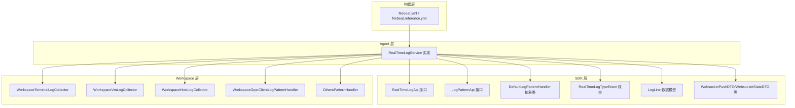
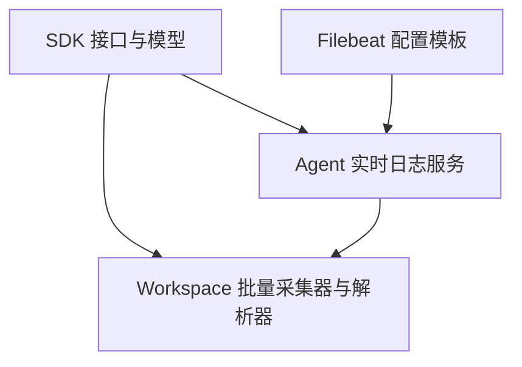
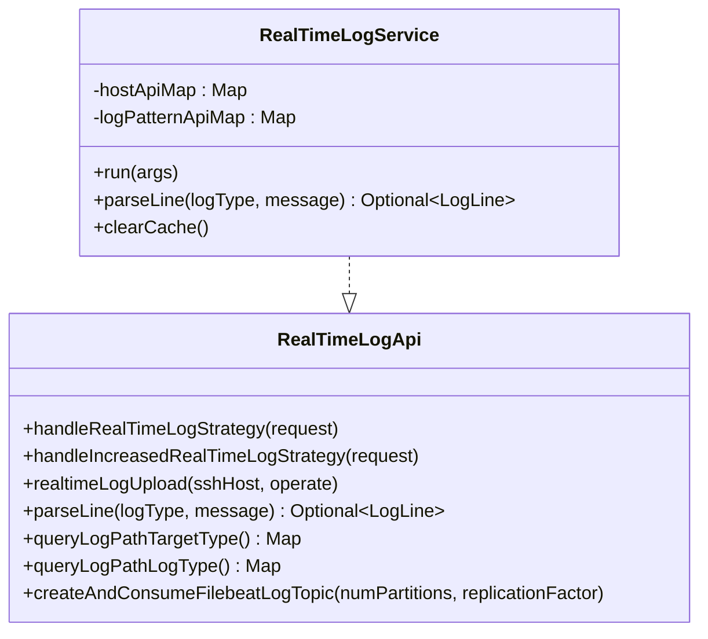
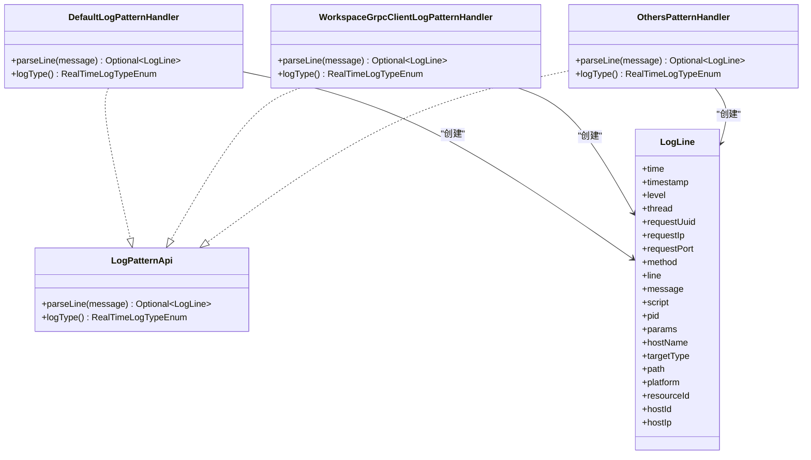
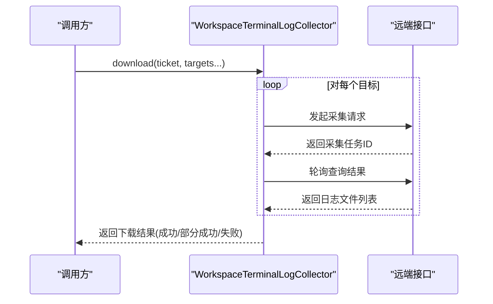
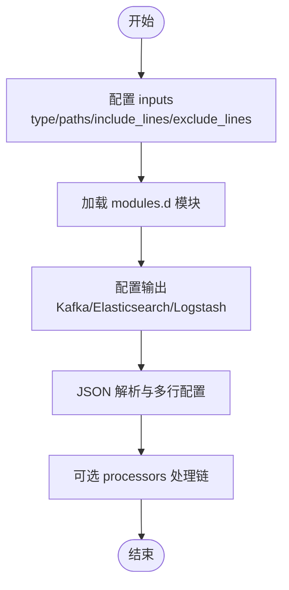
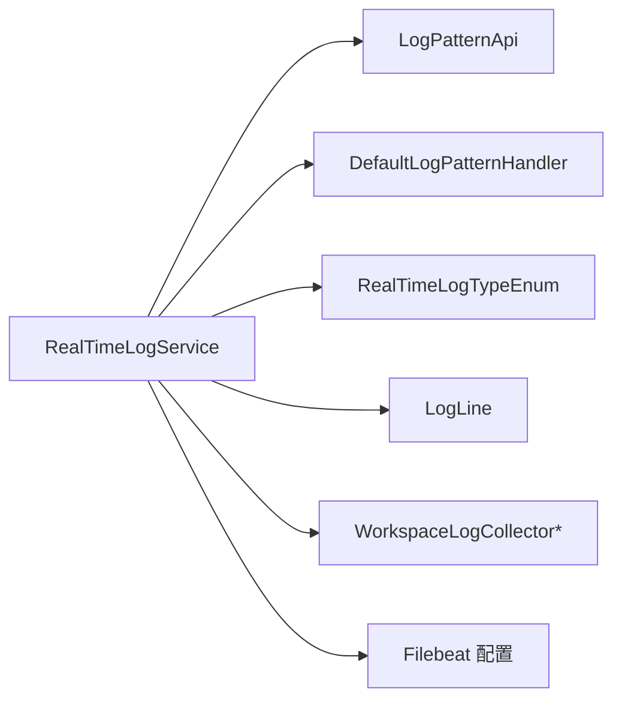

# 日志采集系统

<cite>
**本文引用的文件**
- [RealTimeLogService.java](file://watcher-agent/src/main/java/com/virtual/cloud/om/agent/service/logs/RealTimeLogService.java)
- [RealTimeLogApi.java](file://watcher-sdk/src/main/java/com/virtual/cloud/om/sdk/api/RealTimeLogApi.java)
- [LogPatternApi.java](file://watcher-sdk/src/main/java/com/virtual/cloud/om/sdk/api/LogPatternApi.java)
- [DefaultLogPatternHandler.java](file://watcher-sdk/src/main/java/com/virtual/cloud/om/sdk/api/DefaultLogPatternHandler.java)
- [WorkspaceGrpcClientLogPatternHandler.java](file://watcher-workspace/src/main/java/com/virtual/cloud/om/workspace/service/realtimelog/WorkspaceGrpcClientLogPatternHandler.java)
- [OthersPatternHandler.java](file://watcher-workspace/src/main/java/com/virtual/cloud/om/workspace/service/realtimelog/OthersPatternHandler.java)
- [LogLine.java](file://watcher-sdk/src/main/java/com/virtual/cloud/om/sdk/dto/LogLine.java)
- [RealTimeLogTypeEnum.java](file://watcher-sdk/src/main/java/com/virtual/cloud/om/sdk/constant/RealTimeLogTypeEnum.java)
- [RealTimeLogStrategyRequest.java](file://watcher-sdk/src/main/java/com/virtual/cloud/om/sdk/dto/RealTimeLogStrategyRequest.java)
- [WebsocketPushDTO.java](file://watcher-sdk/src/main/java/com/virtual/cloud/om/sdk/dto/websocket/WebsocketPushDTO.java)
- [WebsocketStateDTO.java](file://watcher-sdk/src/main/java/com/virtual/cloud/om/sdk/dto/websocket/WebsocketStateDTO.java)
- [WebsocketHostLimitDTO.java](file://watcher-sdk/src/main/java/com/virtual/cloud/om/sdk/dto/websocket/WebsocketHostLimitDTO.java)
- [WebsocketAuthDTO.java](file://watcher-sdk/src/main/java/com/virtual/cloud/om/sdk/dto/websocket/WebsocketAuthDTO.java)
- [WebsocketPushTypeEnum.java](file://watcher-sdk/src/main/java/com/virtual/cloud/om/sdk/constant/WebsocketPushTypeEnum.java)
- [LogBatchCollector.java](file://watcher-sdk/src/main/java/com/virtual/cloud/om/sdk/api/LogBatchCollector.java)
- [WorkspaceTerminalLogCollector.java](file://watcher-workspace/src/main/java/com/virtual/cloud/om/workspace/service/batchlog/WorkspaceTerminalLogCollector.java)
- [WorkspaceVmLogCollector.java](file://watcher-workspace/src/main/java/com/virtual/cloud/om/workspace/service/batchlog/WorkspaceVmLogCollector.java)
- [WorkspaceHostLogCollector.java](file://watcher-workspace/src/main/java/com/virtual/cloud/om/workspace/service/batchlog/WorkspaceHostLogCollector.java)
- [FileBeatRaw.java](file://watcher-sdk/src/main/java/com/virtual/cloud/om/sdk/dto/FileBeatRaw.java)
- [FileBeatRawFields.java](file://watcher-sdk/src/main/java/com/virtual/cloud/om/sdk/dto/FileBeatRawFields.java)
- [filebeat.yml](file://watcher-builder/assembly/components/filebeat/filebeat-8.0.1-linux-x86_64/filebeat.yml)
- [filebeat.reference.yml](file://watcher-builder/assembly/components/filebeat/filebeat-8.0.1-linux-x86_64/filebeat.reference.yml)
</cite>

## 目录
1. [引言](#引言)
2. [项目结构](#项目结构)
3. [核心组件](#核心组件)
4. [架构总览](#架构总览)
5. [详细组件分析](#详细组件分析)
6. [依赖分析](#依赖分析)
7. [性能考虑](#性能考虑)
8. [故障排查指南](#故障排查指南)
9. [结论](#结论)
10. [附录](#附录)

## 引言
本技术文档围绕日志采集系统展开，重点覆盖以下方面：
- 批量日志收集：采集目标、下载流程与结果枚举
- 日志解析规则与数据格式转换：统一的解析接口、默认解析器与特定平台处理器
- 实时日志服务：策略下发、解析与上传能力现状与限制
- Filebeat 配置系统：输入、模块、输出与常用选项
- 性能优化策略：并发、缓冲、压缩与限速
- 配置示例与使用指南：新增采集任务、过滤规则与性能优化
- 质量保障与重试策略：错误处理与失败重试建议

## 项目结构
日志采集系统由三大层面构成：
- SDK 层：定义日志解析接口、数据模型、常量与通用工具
- Agent 层：实现实时日志服务，当前已移除 Kafka/Elasticsearch/MongoDB 等外部依赖
- Workspace 层：提供批量日志采集器与平台特定解析器
- 构建层：打包并提供 Filebeat 配置模板

**图表来源**
- [RealTimeLogService.java:40-279](file://watcher-agent/src/main/java/com/virtual/cloud/om/agent/service/logs/RealTimeLogService.java#L40-L279)
- [RealTimeLogApi.java:15-49](file://watcher-sdk/src/main/java/com/virtual/cloud/om/sdk/api/RealTimeLogApi.java#L15-L49)
- [LogPatternApi.java:12-17](file://watcher-sdk/src/main/java/com/virtual/cloud/om/sdk/api/LogPatternApi.java#L12-L17)
- [DefaultLogPatternHandler.java:17-56](file://watcher-sdk/src/main/java/com/virtual/cloud/om/sdk/api/DefaultLogPatternHandler.java#L17-L56)
- [RealTimeLogTypeEnum.java:15-44](file://watcher-sdk/src/main/java/com/virtual/cloud/om/sdk/constant/RealTimeLogTypeEnum.java#L15-L44)
- [LogLine.java:6-56](file://watcher-sdk/src/main/java/com/virtual/cloud/om/sdk/dto/LogLine.java#L6-L56)
- [WebsocketPushDTO.java:10-13](file://watcher-sdk/src/main/java/com/virtual/cloud/om/sdk/dto/websocket/WebsocketPushDTO.java#L10-L13)
- [WorkspaceTerminalLogCollector.java:31-127](file://watcher-workspace/src/main/java/com/virtual/cloud/om/workspace/service/batchlog/WorkspaceTerminalLogCollector.java#L31-L127)
- [WorkspaceVmLogCollector.java:33-34](file://watcher-workspace/src/main/java/com/virtual/cloud/om/workspace/service/batchlog/WorkspaceVmLogCollector.java#L33-L34)
- [WorkspaceHostLogCollector.java:30-31](file://watcher-workspace/src/main/java/com/virtual/cloud/om/workspace/service/batchlog/WorkspaceHostLogCollector.java#L30-L31)
- [WorkspaceGrpcClientLogPatternHandler.java:19-37](file://watcher-workspace/src/main/java/com/virtual/cloud/om/workspace/service/realtimelog/WorkspaceGrpcClientLogPatternHandler.java#L19-L37)
- [OthersPatternHandler.java:17-28](file://watcher-workspace/src/main/java/com/virtual/cloud/om/workspace/service/realtimelog/OthersPatternHandler.java#L17-L28)
- [filebeat.yml:15-231](file://watcher-builder/assembly/components/filebeat/filebeat-8.0.1-linux-x86_64/filebeat.yml#L15-L231)
- [filebeat.reference.yml:2473-2787](file://watcher-builder/assembly/components/filebeat/filebeat-8.0.1-linux-x86_64/filebeat.reference.yml#L2473-L2787)

**章节来源**
- [RealTimeLogService.java:40-279](file://watcher-agent/src/main/java/com/virtual/cloud/om/agent/service/logs/RealTimeLogService.java#L40-L279)
- [filebeat.yml:15-231](file://watcher-builder/assembly/components/filebeat/filebeat-8.0.1-linux-x86_64/filebeat.yml#L15-L231)

## 核心组件
- 实时日志服务（RealTimeLogService）
  - 提供策略处理、解析与上传接口，默认实现中已显式禁用 Kafka、Elasticsearch、MongoDB 等依赖相关功能
  - 维护日志类型到解析器的映射，支持按日志类型选择解析器
- 日志解析接口与默认解析器（LogPatternApi/DefaultLogPatternHandler）
  - 定义统一的解析入口与默认解析规则，支持按类型扩展
- 平台特定解析器（WorkspaceGrpcClientLogPatternHandler/OthersPatternHandler）
  - 针对特定日志风格进行正则匹配与字段抽取
- 批量日志采集器（Workspace*LogCollector）
  - 基于 SDK 的 LogBatchCollector 接口，面向不同目标（主机/虚拟机/终端）执行采集
- Filebeat 配置（filebeat.yml/reference）
  - 输入、模块、输出与常用选项，用于本地日志采集与转发

**章节来源**
- [RealTimeLogService.java:115-137](file://watcher-agent/src/main/java/com/virtual/cloud/om/agent/service/logs/RealTimeLogService.java#L115-L137)
- [LogPatternApi.java:12-17](file://watcher-sdk/src/main/java/com/virtual/cloud/om/sdk/api/LogPatternApi.java#L12-L17)
- [DefaultLogPatternHandler.java:17-56](file://watcher-sdk/src/main/java/com/virtual/cloud/om/sdk/api/DefaultLogPatternHandler.java#L17-L56)
- [WorkspaceGrpcClientLogPatternHandler.java:19-37](file://watcher-workspace/src/main/java/com/virtual/cloud/om/workspace/service/realtimelog/WorkspaceGrpcClientLogPatternHandler.java#L19-L37)
- [OthersPatternHandler.java:17-28](file://watcher-workspace/src/main/java/com/virtual/cloud/om/workspace/service/realtimelog/OthersPatternHandler.java#L17-L28)
- [LogBatchCollector.java:6-18](file://watcher-sdk/src/main/java/com/virtual/cloud/om/sdk/api/LogBatchCollector.java#L6-L18)
- [WorkspaceTerminalLogCollector.java:31-127](file://watcher-workspace/src/main/java/com/virtual/cloud/om/workspace/service/batchlog/WorkspaceTerminalLogCollector.java#L31-L127)
- [WorkspaceVmLogCollector.java:33-34](file://watcher-workspace/src/main/java/com/virtual/cloud/om/workspace/service/batchlog/WorkspaceVmLogCollector.java#L33-L34)
- [WorkspaceHostLogCollector.java:30-31](file://watcher-workspace/src/main/java/com/virtual/cloud/om/workspace/service/batchlog/WorkspaceHostLogCollector.java#L30-L31)
- [filebeat.yml:15-231](file://watcher-builder/assembly/components/filebeat/filebeat-8.0.1-linux-x86_64/filebeat.yml#L15-L231)

## 架构总览
系统采用“SDK 定义 + Agent 实现 + Workspace 扩展 + 构建层配置”的分层设计。Agent 层负责策略与解析，Workspace 层提供采集器与解析器扩展点，构建层提供 Filebeat 配置模板。

**图表来源**
- [RealTimeLogService.java:40-279](file://watcher-agent/src/main/java/com/virtual/cloud/om/agent/service/logs/RealTimeLogService.java#L40-L279)
- [LogPatternApi.java:12-17](file://watcher-sdk/src/main/java/com/virtual/cloud/om/sdk/api/LogPatternApi.java#L12-L17)
- [DefaultLogPatternHandler.java:17-56](file://watcher-sdk/src/main/java/com/virtual/cloud/om/sdk/api/DefaultLogPatternHandler.java#L17-L56)
- [WorkspaceTerminalLogCollector.java:31-127](file://watcher-workspace/src/main/java/com/virtual/cloud/om/workspace/service/batchlog/WorkspaceTerminalLogCollector.java#L31-L127)
- [filebeat.yml:15-231](file://watcher-builder/assembly/components/filebeat/filebeat-8.0.1-linux-x86_64/filebeat.yml#L15-L231)

## 详细组件分析

### 实时日志服务（RealTimeLogService）
- 角色与职责
  - 实现 RealTimeLogApi，提供策略处理、解析与上传等接口
  - 当前实现中，所有与 Kafka、Elasticsearch、MongoDB 相关的功能均被显式禁用或返回空结果
- 关键行为
  - 策略转换与解析器选择：根据请求中的日志类型选择对应解析器
  - 上传与部署：当前禁用 Filebeat 部署与上传
  - 元数据与搜索：日志元数据刷新、日志搜索在当前实现中被禁用
- 适用场景
  - 在不依赖 Kafka/Elasticsearch/MongoDB 的环境中，仍可利用解析器与策略映射能力进行日志解析与后续处理

**图表来源**
- [RealTimeLogApi.java:15-49](file://watcher-sdk/src/main/java/com/virtual/cloud/om/sdk/api/RealTimeLogApi.java#L15-L49)
- [RealTimeLogService.java:40-279](file://watcher-agent/src/main/java/com/virtual/cloud/om/agent/service/logs/RealTimeLogService.java#L40-L279)

**章节来源**
- [RealTimeLogService.java:115-137](file://watcher-agent/src/main/java/com/virtual/cloud/om/agent/service/logs/RealTimeLogService.java#L115-L137)
- [RealTimeLogService.java:180-184](file://watcher-agent/src/main/java/com/virtual/cloud/om/agent/service/logs/RealTimeLogService.java#L180-L184)
- [RealTimeLogService.java:208-229](file://watcher-agent/src/main/java/com/virtual/cloud/om/agent/service/logs/RealTimeLogService.java#L208-L229)

### 日志解析规则与数据格式转换
- 接口与抽象类
  - LogPatternApi：定义解析入口
  - DefaultLogPatternHandler：提供默认正则解析与字段映射
- 平台特定解析器
  - WorkspaceGrpcClientLogPatternHandler：针对特定日志风格进行字段抽取
  - OthersPatternHandler：作为兜底解析器
- 数据模型
  - LogLine：统一的日志行模型，包含时间、级别、线程、请求信息、消息体等字段

**图表来源**
- [LogPatternApi.java:12-17](file://watcher-sdk/src/main/java/com/virtual/cloud/om/sdk/api/LogPatternApi.java#L12-L17)
- [DefaultLogPatternHandler.java:17-56](file://watcher-sdk/src/main/java/com/virtual/cloud/om/sdk/api/DefaultLogPatternHandler.java#L17-L56)
- [WorkspaceGrpcClientLogPatternHandler.java:19-37](file://watcher-workspace/src/main/java/com/virtual/cloud/om/workspace/service/realtimelog/WorkspaceGrpcClientLogPatternHandler.java#L19-L37)
- [OthersPatternHandler.java:17-28](file://watcher-workspace/src/main/java/com/virtual/cloud/om/workspace/service/realtimelog/OthersPatternHandler.java#L17-L28)
- [LogLine.java:6-56](file://watcher-sdk/src/main/java/com/virtual/cloud/om/sdk/dto/LogLine.java#L6-L56)

**章节来源**
- [DefaultLogPatternHandler.java:22-49](file://watcher-sdk/src/main/java/com/virtual/cloud/om/sdk/api/DefaultLogPatternHandler.java#L22-L49)
- [WorkspaceGrpcClientLogPatternHandler.java:25-37](file://watcher-workspace/src/main/java/com/virtual/cloud/om/workspace/service/realtimelog/WorkspaceGrpcClientLogPatternHandler.java#L25-L37)
- [OthersPatternHandler.java:19-27](file://watcher-workspace/src/main/java/com/virtual/cloud/om/workspace/service/realtimelog/OthersPatternHandler.java#L19-L27)
- [LogLine.java:8-54](file://watcher-sdk/src/main/java/com/virtual/cloud/om/sdk/dto/LogLine.java#L8-L54)

### 批量日志采集（WorkspaceLogCollector）
- 接口与实现
  - LogBatchCollector：定义下载与日志类型枚举
  - WorkspaceTerminalLogCollector/VmLogCollector/HostLogCollector：分别面向终端、虚拟机与主机的目标执行采集
- 下载流程要点
  - 并发下载：基于 CompletableFuture 并行处理多个目标
  - 结果判定：DownloadResultEnum（成功/部分成功/失败）
  - 递归轮询：在某些实现中通过轮询等待采集完成

**图表来源**
- [LogBatchCollector.java:6-18](file://watcher-sdk/src/main/java/com/virtual/cloud/om/sdk/api/LogBatchCollector.java#L6-L18)
- [WorkspaceTerminalLogCollector.java:35-127](file://watcher-workspace/src/main/java/com/virtual/cloud/om/workspace/service/batchlog/WorkspaceTerminalLogCollector.java#L35-L127)

**章节来源**
- [LogBatchCollector.java:20-31](file://watcher-sdk/src/main/java/com/virtual/cloud/om/sdk/api/LogBatchCollector.java#L20-L31)
- [WorkspaceTerminalLogCollector.java:35-127](file://watcher-workspace/src/main/java/com/virtual/cloud/om/workspace/service/batchlog/WorkspaceTerminalLogCollector.java#L35-L127)
- [WorkspaceVmLogCollector.java:33-34](file://watcher-workspace/src/main/java/com/virtual/cloud/om/workspace/service/batchlog/WorkspaceVmLogCollector.java#L33-L34)
- [WorkspaceHostLogCollector.java:30-31](file://watcher-workspace/src/main/java/com/virtual/cloud/om/workspace/service/batchlog/WorkspaceHostLogCollector.java#L30-L31)

### Filebeat 配置系统
- 输入（inputs）
  - 类型：filestream/log/stdin 等
  - 路径：支持通配符与递归模式
  - 过滤：include_lines/exclude_lines
  - 缓冲：harvester_buffer_size
  - 最大事件大小：max_bytes
- 模块（modules）
  - 通过 modules.d 加载预置模块
- 输出（outputs）
  - Kafka：指定 hosts 与 topic
  - Elasticsearch/Logstash：可选配置
- 常用选项
  - fields/fields_under_root：自定义字段
  - ignore_older/scan_frequency：扫描与忽略策略
  - JSON 解析与多行（multiline）：message_key/keys_under_root/overwrite_keys/expand_keys/add_error_key
  - processors：可选的事件处理链

**图表来源**
- [filebeat.yml:15-231](file://watcher-builder/assembly/components/filebeat/filebeat-8.0.1-linux-x86_64/filebeat.yml#L15-L231)
- [filebeat.reference.yml:2473-2787](file://watcher-builder/assembly/components/filebeat/filebeat-8.0.1-linux-x86_64/filebeat.reference.yml#L2473-L2787)

**章节来源**
- [filebeat.yml:15-231](file://watcher-builder/assembly/components/filebeat/filebeat-8.0.1-linux-x86_64/filebeat.yml#L15-L231)
- [filebeat.reference.yml:2473-2787](file://watcher-builder/assembly/components/filebeat/filebeat-8.0.1-linux-x86_64/filebeat.reference.yml#L2473-L2787)

## 依赖分析
- 组件耦合
  - RealTimeLogService 依赖 SDK 的接口与模型，并通过注解注入解析器数组
  - Workspace 层的采集器与解析器通过 SDK 接口解耦
- 外部依赖现状
  - Agent 层已明确禁用 Kafka、Elasticsearch、MongoDB 等依赖
  - 构建层提供 Filebeat 配置模板，便于在目标节点部署采集

**图表来源**
- [RealTimeLogService.java:40-279](file://watcher-agent/src/main/java/com/virtual/cloud/om/agent/service/logs/RealTimeLogService.java#L40-L279)
- [LogPatternApi.java:12-17](file://watcher-sdk/src/main/java/com/virtual/cloud/om/sdk/api/LogPatternApi.java#L12-L17)
- [DefaultLogPatternHandler.java:17-56](file://watcher-sdk/src/main/java/com/virtual/cloud/om/sdk/api/DefaultLogPatternHandler.java#L17-L56)
- [RealTimeLogTypeEnum.java:15-44](file://watcher-sdk/src/main/java/com/virtual/cloud/om/sdk/constant/RealTimeLogTypeEnum.java#L15-L44)
- [LogLine.java:6-56](file://watcher-sdk/src/main/java/com/virtual/cloud/om/sdk/dto/LogLine.java#L6-L56)
- [WorkspaceTerminalLogCollector.java:31-127](file://watcher-workspace/src/main/java/com/virtual/cloud/om/workspace/service/batchlog/WorkspaceTerminalLogCollector.java#L31-L127)
- [filebeat.yml:15-231](file://watcher-builder/assembly/components/filebeat/filebeat-8.0.1-linux-x86_64/filebeat.yml#L15-L231)

**章节来源**
- [RealTimeLogService.java:66-69](file://watcher-agent/src/main/java/com/virtual/cloud/om/agent/service/logs/RealTimeLogService.java#L66-L69)
- [RealTimeLogService.java:188-197](file://watcher-agent/src/main/java/com/virtual/cloud/om/agent/service/logs/RealTimeLogService.java#L188-L197)

## 性能考虑
- 并发与异步
  - 批量采集使用 CompletableFuture 并行处理多个目标，提升吞吐
- 缓冲与大小控制
  - Filebeat harvester_buffer_size 控制单个收割器的缓冲区大小
  - max_bytes 控制单条事件最大字节数，避免超大日志导致内存压力
- 扫描频率与忽略策略
  - scan_frequency 控制目录扫描频率
  - ignore_older 控制忽略过旧文件的时间阈值
- JSON 与多行
  - keys_under_root/overwrite_keys/expand_keys 可减少嵌套层级与字段冲突
  - multiline 配置用于合并跨行日志，避免频繁事件拆分
- 输出与网络
  - Kafka 输出的分区与副本数影响吞吐与可靠性
  - 合理设置重试与批大小以平衡延迟与带宽占用

**章节来源**
- [WorkspaceTerminalLogCollector.java:40-46](file://watcher-workspace/src/main/java/com/virtual/cloud/om/workspace/service/batchlog/WorkspaceTerminalLogCollector.java#L40-L46)
- [filebeat.yml:15-231](file://watcher-builder/assembly/components/filebeat/filebeat-8.0.1-linux-x86_64/filebeat.yml#L15-L231)
- [filebeat.reference.yml:2555-2566](file://watcher-builder/assembly/components/filebeat/filebeat-8.0.1-linux-x86_64/filebeat.reference.yml#L2555-L2566)
- [filebeat.reference.yml:2580-2598](file://watcher-builder/assembly/components/filebeat/filebeat-8.0.1-linux-x86_64/filebeat.reference.yml#L2580-L2598)
- [filebeat.reference.yml:2605-2614](file://watcher-builder/assembly/components/filebeat/filebeat-8.0.1-linux-x86_64/filebeat.reference.yml#L2605-L2614)

## 故障排查指南
- 实时日志服务相关
  - 若发现策略处理、上传或搜索为空或被禁用，请确认 Agent 层实现是否处于“禁用外部依赖”状态
  - 解析器选择：若未指定日志类型，将回退到 others_ 类型解析器
- 批量采集相关
  - 下载结果枚举：区分成功/部分成功/失败，结合目标数量与异常日志定位问题
  - 轮询等待：确保轮询次数与间隔合理，避免过早中断
- Filebeat 相关
  - 路径与权限：确认 paths 是否正确且具备读取权限
  - 过滤规则：include_lines/exclude_lines 与 ignore_older 配置是否符合预期
  - 输出连通性：Kafka 主机与 topic 是否可达
- WebSocket 相关
  - 认证与心跳：校验 WebsocketAuthDTO 中的 token、心跳与 watcherCode
  - 状态推送：WebsocketPushDTO 与 WebsocketStateDTO 用于状态反馈

**章节来源**
- [RealTimeLogService.java:115-137](file://watcher-agent/src/main/java/com/virtual/cloud/om/agent/service/logs/RealTimeLogService.java#L115-L137)
- [RealTimeLogService.java:208-229](file://watcher-agent/src/main/java/com/virtual/cloud/om/agent/service/logs/RealTimeLogService.java#L208-L229)
- [LogBatchCollector.java:20-31](file://watcher-sdk/src/main/java/com/virtual/cloud/om/sdk/api/LogBatchCollector.java#L20-L31)
- [WorkspaceTerminalLogCollector.java:112-127](file://watcher-workspace/src/main/java/com/virtual/cloud/om/workspace/service/batchlog/WorkspaceTerminalLogCollector.java#L112-L127)
- [WebsocketAuthDTO.java:15-22](file://watcher-sdk/src/main/java/com/virtual/cloud/om/sdk/dto/websocket/WebsocketAuthDTO.java#L15-L22)
- [WebsocketPushDTO.java:10-13](file://watcher-sdk/src/main/java/com/virtual/cloud/om/sdk/dto/websocket/WebsocketPushDTO.java#L10-L13)
- [WebsocketStateDTO.java:15-23](file://watcher-sdk/src/main/java/com/virtual/cloud/om/sdk/dto/websocket/WebsocketStateDTO.java#L15-L23)

## 结论
- 该日志采集系统以 SDK 为核心，Agent 层提供解析与策略处理能力，Workspace 层扩展采集器与解析器，构建层提供 Filebeat 配置模板
- 当前 Agent 层已移除对 Kafka、Elasticsearch、MongoDB 的依赖，适合在受限环境下运行
- 批量采集通过并发与轮询机制提升效率；Filebeat 提供丰富的输入/输出与解析选项
- 建议在生产环境结合实际日志特征完善解析器与过滤规则，并根据流量规模调整 Filebeat 与输出配置

## 附录

### 配置示例与使用指南
- 新增日志采集任务
  - 在 RealTimeLogStrategyRequest 中设置 platform、tags 与 logs（含 logPath/targetType），Agent 将据此生成策略并选择解析器
- 设置日志过滤规则
  - 使用 Filebeat 的 include_lines/exclude_lines 与 ignore_older 控制采集范围与频率
- 优化采集性能
  - 调整 harvester_buffer_size、max_bytes、scan_frequency
  - 合理配置 Kafka 输出的分区与副本数，确保吞吐与可靠性平衡

**章节来源**
- [RealTimeLogStrategyRequest.java:12-19](file://watcher-sdk/src/main/java/com/virtual/cloud/om/sdk/dto/RealTimeLogStrategyRequest.java#L12-L19)
- [filebeat.yml:32-38](file://watcher-builder/assembly/components/filebeat/filebeat-8.0.1-linux-x86_64/filebeat.yml#L32-L38)
- [filebeat.reference.yml:2555-2566](file://watcher-builder/assembly/components/filebeat/filebeat-8.0.1-linux-x86_64/filebeat.reference.yml#L2555-L2566)
- [filebeat.reference.yml:2605-2614](file://watcher-builder/assembly/components/filebeat/filebeat-8.0.1-linux-x86_64/filebeat.reference.yml#L2605-L2614)

### 日志质量保证与重试策略
- 日志质量
  - 使用 keys_under_root/overwrite_keys/expand_keys 减少字段冲突与嵌套层级
  - 合理配置 multiline，确保堆栈与长日志完整
- 重试策略
  - 批量采集：在下载失败时记录失败目标并进行局部重试
  - Filebeat：通过输出重试与批处理参数优化传输稳定性

**章节来源**
- [filebeat.reference.yml:2580-2598](file://watcher-builder/assembly/components/filebeat/filebeat-8.0.1-linux-x86_64/filebeat.reference.yml#L2580-L2598)
- [filebeat.reference.yml:2605-2614](file://watcher-builder/assembly/components/filebeat/filebeat-8.0.1-linux-x86_64/filebeat.reference.yml#L2605-L2614)
- [WorkspaceTerminalLogCollector.java:40-46](file://watcher-workspace/src/main/java/com/virtual/cloud/om/workspace/service/batchlog/WorkspaceTerminalLogCollector.java#L40-L46)