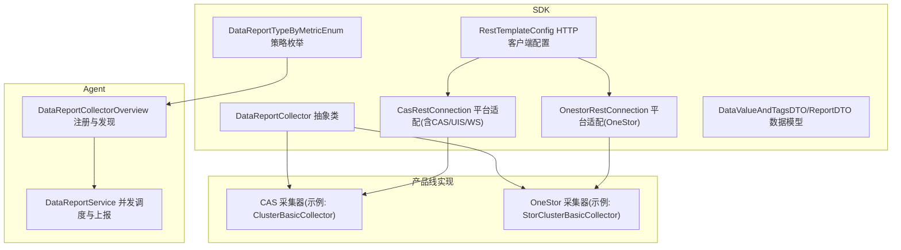
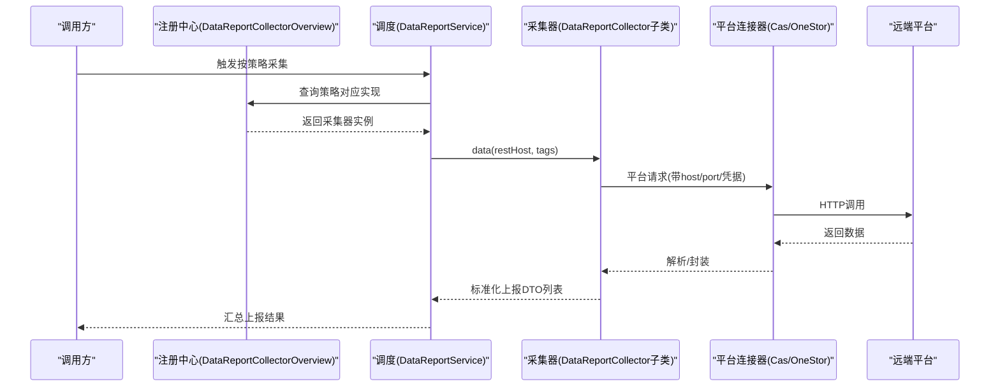
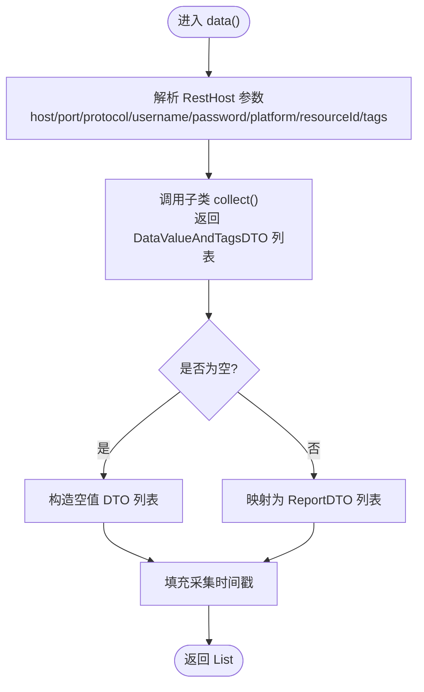
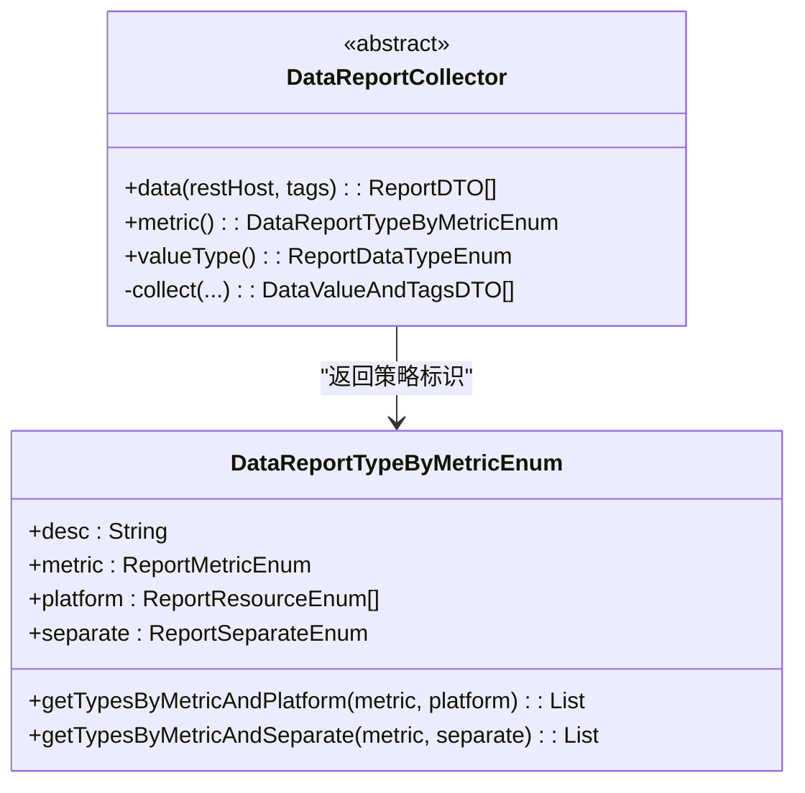
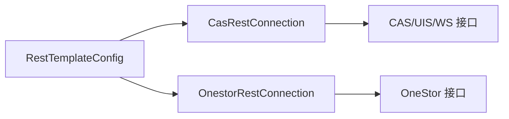
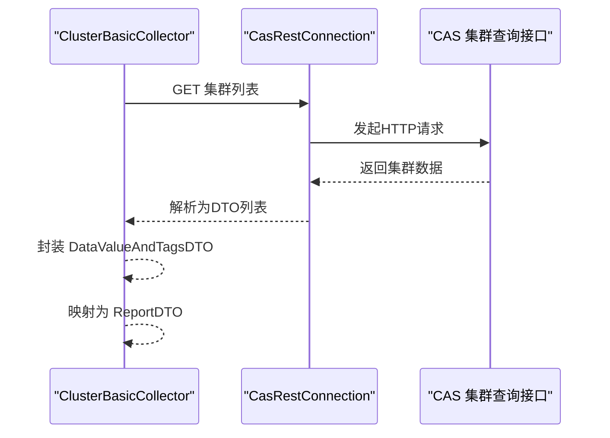
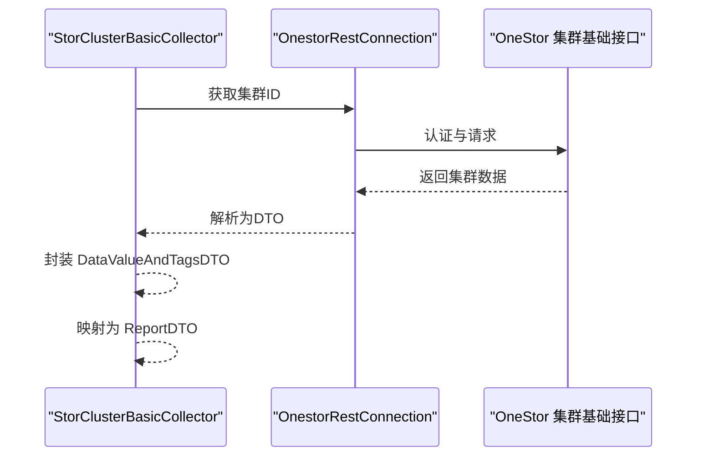
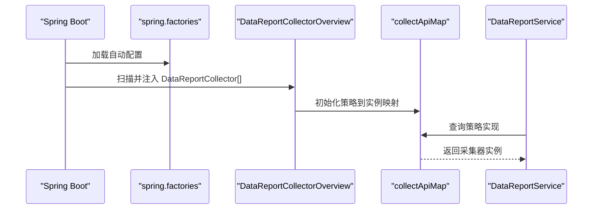
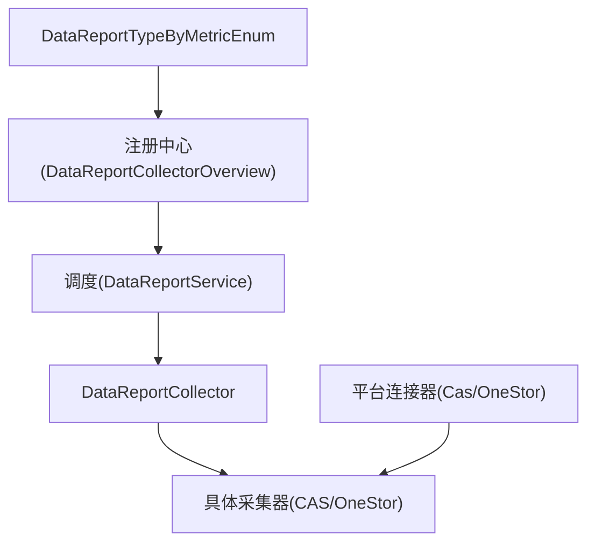

# 采集器插件系统

<cite>
**本文引用的文件**
- [DataReportCollector.java](file://watcher-sdk/src/main/java/com/virtual/cloud/om/sdk/api/DataReportCollector.java)
- [WarnReportCollector.java](file://watcher-sdk/src/main/java/com/virtual/cloud/om/sdk/api/WarnReportCollector.java)
- [LogBatchCollector.java](file://watcher-sdk/src/main/java/com/virtual/cloud/om/sdk/api/LogBatchCollector.java)
- [DataReportTypeByMetricEnum.java](file://watcher-sdk/src/main/java/com/virtual/cloud/om/sdk/constant/DataReportTypeByMetricEnum.java)
- [DataValueAndTagsDTO.java](file://watcher-sdk/src/main/java/com/virtual/cloud/om/sdk/dto/dataReport/DataValueAndTagsDTO.java)
- [ReportDTO.java](file://watcher-sdk/src/main/java/com/virtual/cloud/om/sdk/dto/dataReport/workspace/ReportDTO.java)
- [spring.factories](file://watcher-sdk/src/main/resources/META-INF/spring.factories)
- [RestTemplateConfig.java](file://watcher-sdk/src/main/java/com/virtual/cloud/om/sdk/config/rest/RestTemplateConfig.java)
- [CasRestConnection.java](file://watcher-sdk/src/main/java/com/virtual/cloud/om/sdk/config/rest/cas/CasRestConnection.java)
- [OnestorRestConnection.java](file://watcher-sdk/src/main/java/com/virtual/cloud/om/sdk/config/token/onestor/OnestorRestConnection.java)
- [ClusterBasicCollector.java](file://watcher-cas/src/main/java/com/virtual/cloud/om/cas/service/report/ClusterBasicCollector.java)
- [StorClusterBasicCollector.java](file://watcher-onestor/src/main/java/com/virtual/cloud/om/onestor/service/clusterBasic/StorClusterBasicCollector.java)
- [CasResourcePlatformVersionCollector.java](file://watcher-cas/src/main/java/com/virtual/cloud/om/cas/service/report/CasResourcePlatformVersionCollector.java)
- [DataReportCollectorOverview.java](file://watcher-agent/src/main/java/com/virtual/cloud/om/agent/service/DataReportCollectorOverview.java)
- [DataReportService.java](file://watcher-agent/src/main/java/com/virtual/cloud/om/agent/service/report/DataReportService.java)
</cite>

## 目录
1. [简介](#简介)
2. [项目结构](#项目结构)
3. [核心组件](#核心组件)
4. [架构总览](#架构总览)
5. [组件详解](#组件详解)
6. [依赖关系分析](#依赖关系分析)
7. [性能考量](#性能考量)
8. [故障排查指南](#故障排查指南)
9. [结论](#结论)
10. [附录：开发与测试指南](#附录开发与测试指南)

## 简介
本文件面向“采集器插件系统”，系统以统一抽象类为核心，通过平台适配层与REST连接管理，实现多产品线（CAS、UIS、Workspace、OneStor）的数据采集标准化输出。系统采用Spring容器自动装配与枚举驱动的策略分发，结合线程池与异步并发，确保高吞吐与可扩展性；同时提供告警采集与批量日志采集能力，覆盖运行期监控与运维支撑。

## 项目结构
- SDK层：定义采集抽象、数据模型、常量与HTTP连接配置，形成跨产品线的通用能力。
- 产品线模块：按产品线实现具体采集器，复用SDK抽象与平台连接。
- Agent层：负责采集器注册、策略解析、并发调度与上报整合。

图示来源
- [DataReportCollector.java:19-118](file://watcher-sdk/src/main/java/com/virtual/cloud/om/sdk/api/DataReportCollector.java#L19-L118)
- [DataReportTypeByMetricEnum.java:21-190](file://watcher-sdk/src/main/java/com/virtual/cloud/om/sdk/constant/DataReportTypeByMetricEnum.java#L21-L190)
- [RestTemplateConfig.java:42-152](file://watcher-sdk/src/main/java/com/virtual/cloud/om/sdk/config/rest/RestTemplateConfig.java#L42-L152)
- [CasRestConnection.java:26-161](file://watcher-sdk/src/main/java/com/virtual/cloud/om/sdk/config/rest/cas/CasRestConnection.java#L26-L161)
- [OnestorRestConnection.java:47-413](file://watcher-sdk/src/main/java/com/virtual/cloud/om/sdk/config/token/onestor/OnestorRestConnection.java#L47-L413)
- [ClusterBasicCollector.java:25-73](file://watcher-cas/src/main/java/com/virtual/cloud/om/cas/service/report/ClusterBasicCollector.java#L25-L73)
- [StorClusterBasicCollector.java:30-77](file://watcher-onestor/src/main/java/com/virtual/cloud/om/onestor/service/clusterBasic/StorClusterBasicCollector.java#L30-L77)
- [DataReportCollectorOverview.java:22-45](file://watcher-agent/src/main/java/com/virtual/cloud/om/agent/service/DataReportCollectorOverview.java#L22-L45)
- [DataReportService.java:186-201](file://watcher-agent/src/main/java/com/virtual/cloud/om/agent/service/report/DataReportService.java#L186-L201)

章节来源
- [spring.factories:1-10](file://watcher-sdk/src/main/resources/META-INF/spring.factories#L1-L10)

## 核心组件
- DataReportCollector 抽象类：定义统一采集入口、标准化输出与平台参数透传，屏蔽产品线差异。
- DataReportTypeByMetricEnum 策略枚举：将“策略名+平台”映射到具体采集实现，支持按策略聚合或按分离维度选择实现。
- 平台连接器：CasRestConnection、OnestorRestConnection 提供HTTP访问、认证与重试、异常转换、端口适配等。
- 数据模型：DataValueAndTagsDTO、ReportDTO 统一采集值、标签与上报结构。
- 注册与发现：DataReportCollectorOverview 在启动时扫描并登记所有采集器，按策略快速定位实现。
- 并发调度：DataReportService 按策略与平台组合并发执行，提升整体吞吐。

章节来源
- [DataReportCollector.java:19-118](file://watcher-sdk/src/main/java/com/virtual/cloud/om/sdk/api/DataReportCollector.java#L19-L118)
- [DataReportTypeByMetricEnum.java:21-190](file://watcher-sdk/src/main/java/com/virtual/cloud/om/sdk/constant/DataReportTypeByMetricEnum.java#L21-L190)
- [DataValueAndTagsDTO.java:9-16](file://watcher-sdk/src/main/java/com/virtual/cloud/om/sdk/dto/dataReport/DataValueAndTagsDTO.java#L9-L16)
- [ReportDTO.java:11-24](file://watcher-sdk/src/main/java/com/virtual/cloud/om/sdk/dto/dataReport/workspace/ReportDTO.java#L11-L24)
- [DataReportCollectorOverview.java:22-45](file://watcher-agent/src/main/java/com/virtual/cloud/om/agent/service/DataReportCollectorOverview.java#L22-L45)
- [DataReportService.java:186-201](file://watcher-agent/src/main/java/com/virtual/cloud/om/agent/service/report/DataReportService.java#L186-L201)

## 架构总览
系统采用“抽象+平台适配+策略分发+并发执行”的分层架构，确保采集逻辑与平台细节解耦，策略与实现松耦合。

图示来源
- [DataReportCollectorOverview.java:32-44](file://watcher-agent/src/main/java/com/virtual/cloud/om/agent/service/DataReportCollectorOverview.java#L32-L44)
- [DataReportService.java:186-201](file://watcher-agent/src/main/java/com/virtual/cloud/om/agent/service/report/DataReportService.java#L186-L201)
- [DataReportCollector.java:48-86](file://watcher-sdk/src/main/java/com/virtual/cloud/om/sdk/api/DataReportCollector.java#L48-L86)
- [CasRestConnection.java:113-139](file://watcher-sdk/src/main/java/com/virtual/cloud/om/sdk/config/rest/cas/CasRestConnection.java#L113-L139)
- [OnestorRestConnection.java:191-229](file://watcher-sdk/src/main/java/com/virtual/cloud/om/sdk/config/token/onestor/OnestorRestConnection.java#L191-L229)

## 组件详解

### 抽象采集器 DataReportCollector
- 设计要点
  - 统一入口：data(RestHost, tags) 负责日志、耗时统计与标准化输出。
  - 平台适配：collect(...) 由子类实现，接收平台、主机、协议、端口、用户名、密码、标签与资源ID。
  - 输出规范：返回 List<ReportDTO>，统一包含指标名、值类型、标签、时间戳与值。
- 关键行为
  - 若采集为空，仍生成空值占位DTO，保证上报一致性。
  - 未显式设置时间戳时，回填采集时刻，确保下游一致性。
- 复杂度
  - 单次采集为O(n)遍历与映射，主要受子类collect实现与网络RTT影响。

图示来源
- [DataReportCollector.java:48-86](file://watcher-sdk/src/main/java/com/virtual/cloud/om/sdk/api/DataReportCollector.java#L48-L86)

章节来源
- [DataReportCollector.java:19-118](file://watcher-sdk/src/main/java/com/virtual/cloud/om/sdk/api/DataReportCollector.java#L19-L118)
- [DataValueAndTagsDTO.java:9-16](file://watcher-sdk/src/main/java/com/virtual/cloud/om/sdk/dto/dataReport/DataValueAndTagsDTO.java#L9-L16)
- [ReportDTO.java:11-24](file://watcher-sdk/src/main/java/com/virtual/cloud/om/sdk/dto/dataReport/workspace/ReportDTO.java#L11-L24)

### 策略枚举与分发 DataReportTypeByMetricEnum
- 设计要点
  - 将“策略名 + 平台”映射到具体实现，支持同一策略在不同平台的差异化实现。
  - 提供按策略+平台、策略+分离维度的查询方法，兼容单一或聚合实现。
- 使用方式
  - 采集器在启动时注册到注册中心，按策略名快速定位实现。
  - 调度层根据策略与平台组合并发选择实现。

图示来源
- [DataReportTypeByMetricEnum.java:21-190](file://watcher-sdk/src/main/java/com/virtual/cloud/om/sdk/constant/DataReportTypeByMetricEnum.java#L21-L190)
- [DataReportCollector.java:109-117](file://watcher-sdk/src/main/java/com/virtual/cloud/om/sdk/api/DataReportCollector.java#L109-L117)

章节来源
- [DataReportTypeByMetricEnum.java:21-190](file://watcher-sdk/src/main/java/com/virtual/cloud/om/sdk/constant/DataReportTypeByMetricEnum.java#L21-L190)
- [DataReportCollectorOverview.java:22-45](file://watcher-agent/src/main/java/com/virtual/cloud/om/agent/service/DataReportCollectorOverview.java#L22-L45)

### 平台连接器与HTTP配置
- RestTemplateConfig
  - 自定义HttpClient连接池、超时、SSL信任与消息转换器，提供稳定可靠的HTTP传输。
  - 配置JAXB运行时，兼容JDK 17环境。
- CasRestConnection
  - 统一CAS/UIS/Workspace平台端口适配、请求头注入（真实IP）、错误码转换与重试策略。
- OnestorRestConnection
  - 基于令牌的认证流程，内存级令牌缓存与分布式锁保护刷新，自动处理401/403并重试。

图示来源
- [RestTemplateConfig.java:42-152](file://watcher-sdk/src/main/java/com/virtual/cloud/om/sdk/config/rest/RestTemplateConfig.java#L42-L152)
- [CasRestConnection.java:26-161](file://watcher-sdk/src/main/java/com/virtual/cloud/om/sdk/config/rest/cas/CasRestConnection.java#L26-L161)
- [OnestorRestConnection.java:47-413](file://watcher-sdk/src/main/java/com/virtual/cloud/om/sdk/config/token/onestor/OnestorRestConnection.java#L47-L413)

章节来源
- [RestTemplateConfig.java:42-152](file://watcher-sdk/src/main/java/com/virtual/cloud/om/sdk/config/rest/RestTemplateConfig.java#L42-L152)
- [CasRestConnection.java:26-161](file://watcher-sdk/src/main/java/com/virtual/cloud/om/sdk/config/rest/cas/CasRestConnection.java#L26-L161)
- [OnestorRestConnection.java:47-413](file://watcher-sdk/src/main/java/com/virtual/cloud/om/sdk/config/token/onestor/OnestorRestConnection.java#L47-L413)

### 产品线采集器实现模式

#### CAS 采集器示例：ClusterBasicCollector
- 功能：拉取集群基础信息，封装为JSON值并标注标签。
- 关键点：通过CasRestConnection发起GET请求，异常转业务异常，最终返回List<DataValueAndTagsDTO>，由父类映射为ReportDTO。

图示来源
- [ClusterBasicCollector.java:31-61](file://watcher-cas/src/main/java/com/virtual/cloud/om/cas/service/report/ClusterBasicCollector.java#L31-L61)
- [CasRestConnection.java:113-117](file://watcher-sdk/src/main/java/com/virtual/cloud/om/sdk/config/rest/cas/CasRestConnection.java#L113-L117)

章节来源
- [ClusterBasicCollector.java:25-73](file://watcher-cas/src/main/java/com/virtual/cloud/om/cas/service/report/ClusterBasicCollector.java#L25-L73)

#### OneStor 采集器示例：StorClusterBasicCollector
- 功能：获取集群ID并查询集群基础信息，封装为JSON值。
- 关键点：依赖OnestorRestConnection进行令牌获取与请求头注入，异常处理与空值保护。

图示来源
- [StorClusterBasicCollector.java:38-65](file://watcher-onestor/src/main/java/com/virtual/cloud/om/onestor/service/clusterBasic/StorClusterBasicCollector.java#L38-L65)
- [OnestorRestConnection.java:191-229](file://watcher-sdk/src/main/java/com/virtual/cloud/om/sdk/config/token/onestor/OnestorRestConnection.java#L191-L229)

章节来源
- [StorClusterBasicCollector.java:30-77](file://watcher-onestor/src/main/java/com/virtual/cloud/om/onestor/service/clusterBasic/StorClusterBasicCollector.java#L30-L77)

#### 版本号采集器示例：CasResourcePlatformVersionCollector
- 功能：采集CAS平台版本号，返回文本值。
- 关键点：继承DataReportCollector，实现metric/valueType，使用CasRestConnection获取版本信息。

章节来源
- [CasResourcePlatformVersionCollector.java:22-47](file://watcher-cas/src/main/java/com/virtual/cloud/om/cas/service/report/CasResourcePlatformVersionCollector.java#L22-L47)

### 注册与发现机制
- Spring自动装配：SDK通过spring.factories声明RestTemplate与连接器配置，确保连接器可用。
- 注册中心：DataReportCollectorOverview在应用启动时收集所有DataReportCollector实现，构建“策略名 -> 采集器实例”的映射。
- 使用：DataReportService按策略与平台查询实现，若未找到则抛出未找到异常。

图示来源
- [spring.factories:1-10](file://watcher-sdk/src/main/resources/META-INF/spring.factories#L1-L10)
- [DataReportCollectorOverview.java:22-45](file://watcher-agent/src/main/java/com/virtual/cloud/om/agent/service/DataReportCollectorOverview.java#L22-L45)
- [DataReportService.java:186-201](file://watcher-agent/src/main/java/com/virtual/cloud/om/agent/service/report/DataReportService.java#L186-L201)

章节来源
- [spring.factories:1-10](file://watcher-sdk/src/main/resources/META-INF/spring.factories#L1-L10)
- [DataReportCollectorOverview.java:22-45](file://watcher-agent/src/main/java/com/virtual/cloud/om/agent/service/DataReportCollectorOverview.java#L22-L45)

### 告警与日志采集
- 告警采集抽象：WarnReportCollector 定义告警采集的统一入口与策略标识。
- 批量日志采集：LogBatchCollector 定义批量下载接口与类型枚举，支持多平台与多目标。

章节来源
- [WarnReportCollector.java:13-79](file://watcher-sdk/src/main/java/com/virtual/cloud/om/sdk/api/WarnReportCollector.java#L13-L79)
- [LogBatchCollector.java:6-33](file://watcher-sdk/src/main/java/com/virtual/cloud/om/sdk/api/LogBatchCollector.java#L6-L33)

## 依赖关系分析
- 松耦合
  - 采集器仅依赖抽象与平台连接器，不直接依赖具体平台实现。
  - 策略枚举与注册中心解耦实现类，便于扩展。
- 外部依赖
  - HTTP客户端、SSL上下文、JAXB运行时、分布式锁（令牌刷新场景）。
- 循环依赖风险
  - 通过接口与抽象隔离，避免循环依赖；连接器内部通过缓存与锁避免竞争问题。

图示来源
- [DataReportCollector.java:19-118](file://watcher-sdk/src/main/java/com/virtual/cloud/om/sdk/api/DataReportCollector.java#L19-L118)
- [DataReportTypeByMetricEnum.java:21-190](file://watcher-sdk/src/main/java/com/virtual/cloud/om/sdk/constant/DataReportTypeByMetricEnum.java#L21-L190)
- [DataReportCollectorOverview.java:22-45](file://watcher-agent/src/main/java/com/virtual/cloud/om/agent/service/DataReportCollectorOverview.java#L22-L45)
- [DataReportService.java:186-201](file://watcher-agent/src/main/java/com/virtual/cloud/om/agent/service/report/DataReportService.java#L186-L201)
- [CasRestConnection.java:26-161](file://watcher-sdk/src/main/java/com/virtual/cloud/om/sdk/config/rest/cas/CasRestConnection.java#L26-L161)
- [OnestorRestConnection.java:47-413](file://watcher-sdk/src/main/java/com/virtual/cloud/om/sdk/config/token/onestor/OnestorRestConnection.java#L47-L413)

## 性能考量
- 并发与线程池
  - 调度层按策略并发执行，充分利用多采集器并行能力。
- HTTP连接池
  - 连接池最大连接数与路由上限、SOCKET配置、超时策略已优化，减少连接抖动与阻塞。
- 令牌与缓存
  - OneStor令牌采用内存缓存+分布式锁刷新，降低重复登录开销与并发冲突。
- 序列化与消息转换
  - 指定JAXB与JSON转换器，避免默认实现差异导致的性能波动。

章节来源
- [RestTemplateConfig.java:42-152](file://watcher-sdk/src/main/java/com/virtual/cloud/om/sdk/config/rest/RestTemplateConfig.java#L42-L152)
- [OnestorRestConnection.java:47-413](file://watcher-sdk/src/main/java/com/virtual/cloud/om/sdk/config/token/onestor/OnestorRestConnection.java#L47-L413)
- [DataReportService.java:186-201](file://watcher-agent/src/main/java/com/virtual/cloud/om/agent/service/report/DataReportService.java#L186-L201)

## 故障排查指南
- 常见异常与定位
  - HTTP 401/403：OneStor连接器会清除缓存令牌并重试，检查用户名密码与令牌有效期。
  - 超时/重试：查看连接池配置与超时参数，确认网络连通性与远端响应时间。
  - 未找到实现：确认策略名与平台组合是否正确，以及采集器是否被注册中心收录。
- 日志与追踪
  - 采集器入口记录开始/结束时间与耗时，便于定位慢采集项。
  - 平台连接器记录请求URL、方法、头与体，便于复现问题。
- 建议排查步骤
  - 校验采集器是否被Spring扫描并注册。
  - 校验策略枚举与平台映射是否一致。
  - 校验平台连接器端口与协议配置。
  - 校验令牌/认证流程与缓存状态。

章节来源
- [OnestorRestConnection.java:143-189](file://watcher-sdk/src/main/java/com/virtual/cloud/om/sdk/config/token/onestor/OnestorRestConnection.java#L143-L189)
- [CasRestConnection.java:56-94](file://watcher-sdk/src/main/java/com/virtual/cloud/om/sdk/config/rest/cas/CasRestConnection.java#L56-L94)
- [DataReportCollector.java:48-86](file://watcher-sdk/src/main/java/com/virtual/cloud/om/sdk/api/DataReportCollector.java#L48-L86)

## 结论
该采集器插件系统通过抽象采集器、策略枚举与平台连接器，实现了多产品线的统一采集框架。配合注册中心与并发调度，系统具备良好的可扩展性与性能表现。建议在新增采集器时遵循统一抽象与数据模型，确保与策略枚举及注册机制协同工作。

## 附录：开发与测试指南

### 开发新采集器插件
- 步骤
  - 新建类继承 DataReportCollector，实现 collect(...) 与 metric()/valueType()。
  - 在产品线模块中实现具体采集逻辑，使用对应平台连接器发起请求。
  - 确保返回 List<DataValueAndTagsDTO>，并在异常时抛出业务异常。
  - 在策略枚举中补充策略与平台映射，或复用现有映射。
- 参考实现
  - CAS：ClusterBasicCollector
  - OneStor：StorClusterBasicCollector
  - 版本号：CasResourcePlatformVersionCollector

章节来源
- [ClusterBasicCollector.java:25-73](file://watcher-cas/src/main/java/com/virtual/cloud/om/cas/service/report/ClusterBasicCollector.java#L25-L73)
- [StorClusterBasicCollector.java:30-77](file://watcher-onestor/src/main/java/com/virtual/cloud/om/onestor/service/clusterBasic/StorClusterBasicCollector.java#L30-L77)
- [CasResourcePlatformVersionCollector.java:22-47](file://watcher-cas/src/main/java/com/virtual/cloud/om/cas/service/report/CasResourcePlatformVersionCollector.java#L22-L47)

### 配置管理与执行频率
- 配置项
  - 平台连接器启用开关（如 rest-client.cas.enable、rest-client.onestor.enable），通过 ConditionalOnProperty 控制装配。
  - HTTP客户端超时与连接池参数在 RestTemplateConfig 中集中配置。
- 执行频率
  - 通过调度层按策略并发触发，频率由上层调度策略控制，采集器无需感知。

章节来源
- [CasRestConnection.java:26-28](file://watcher-sdk/src/main/java/com/virtual/cloud/om/sdk/config/rest/cas/CasRestConnection.java#L26-L28)
- [OnestorRestConnection.java:47-49](file://watcher-sdk/src/main/java/com/virtual/cloud/om/sdk/config/token/onestor/OnestorRestConnection.java#L47-L49)
- [RestTemplateConfig.java:42-152](file://watcher-sdk/src/main/java/com/virtual/cloud/om/sdk/config/rest/RestTemplateConfig.java#L42-L152)

### 测试策略
- 单元测试
  - 对 collect(...) 方法进行Mock平台连接器，验证返回值结构与标签处理。
  - 对策略枚举查询方法进行边界测试（空集合、唯一实现、聚合实现）。
- 集成测试
  - 搭建最小化远端平台Mock，验证HTTP交互、认证流程与异常转换。
- 性能测试
  - 并发压测采集器，观察连接池占用、超时与错误率。
  - 对慢采集项进行链路追踪与日志分析。

### 性能监控与故障诊断
- 监控点
  - 采集耗时、错误率、令牌刷新次数、连接池使用率。
- 诊断手段
  - 查看采集器日志与平台连接器请求日志，定位异常URL与错误码。
  - 校验策略映射与注册中心映射，确保实现命中正确。