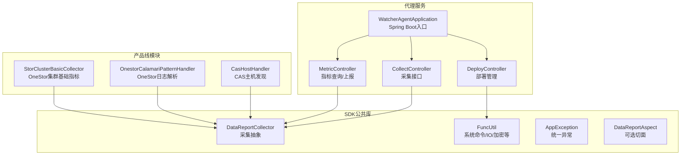
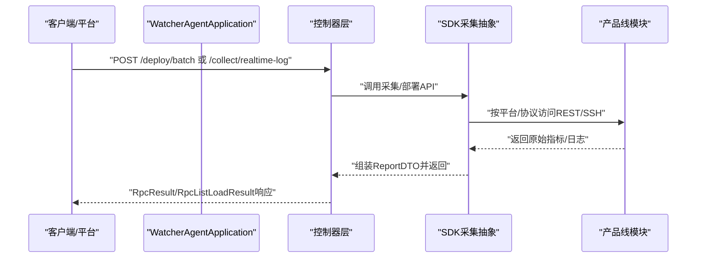
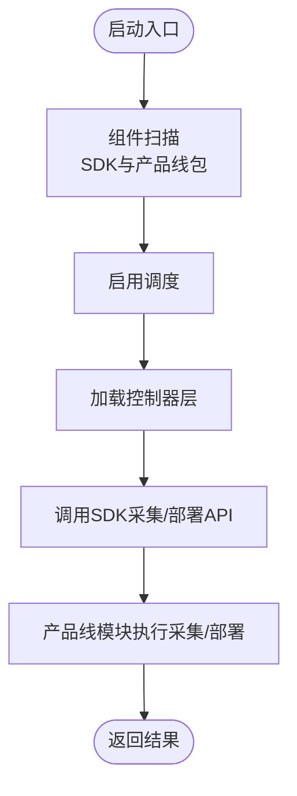
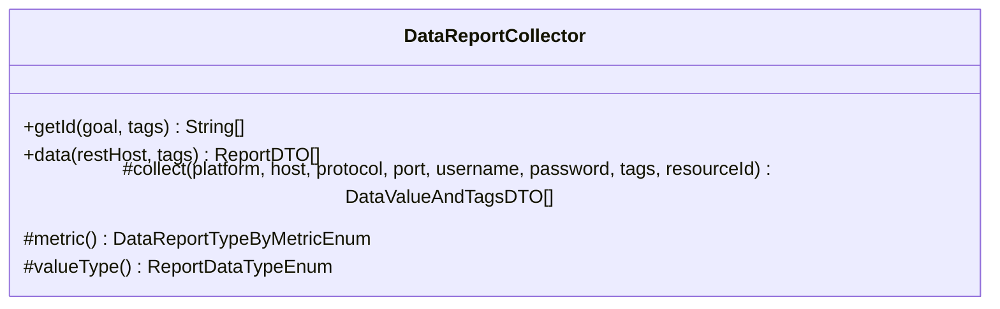
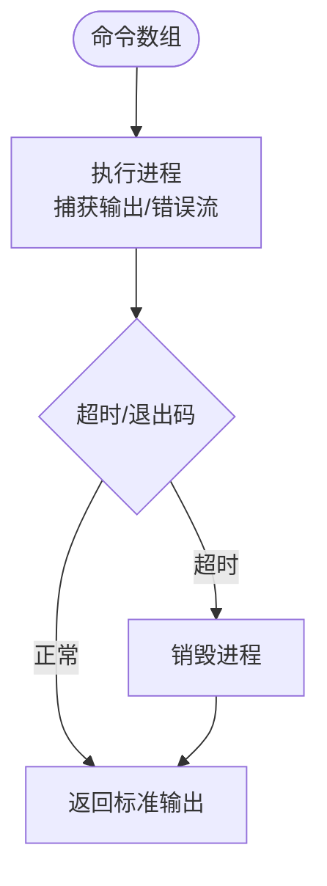
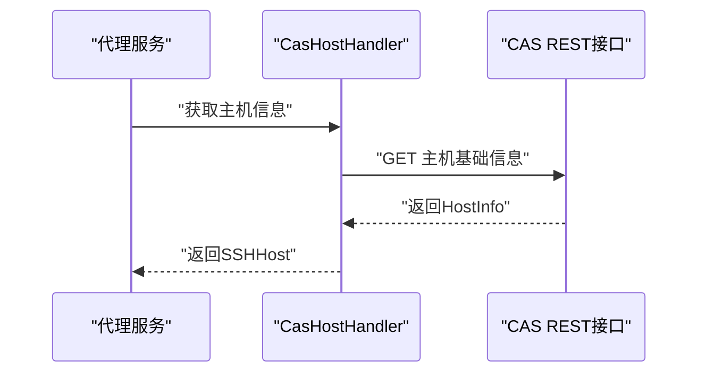
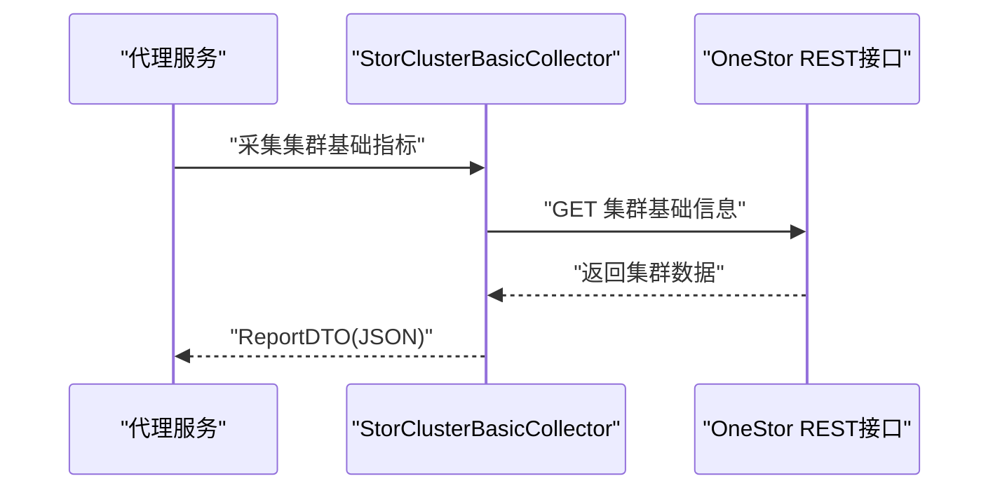
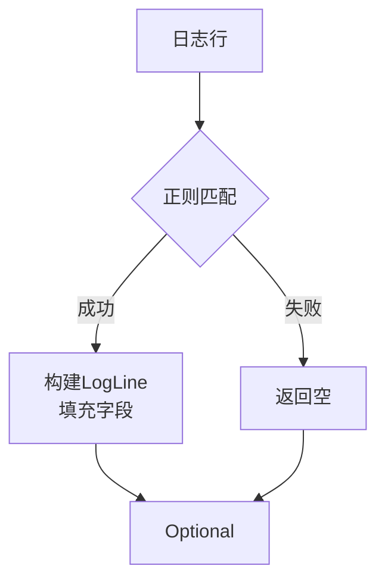
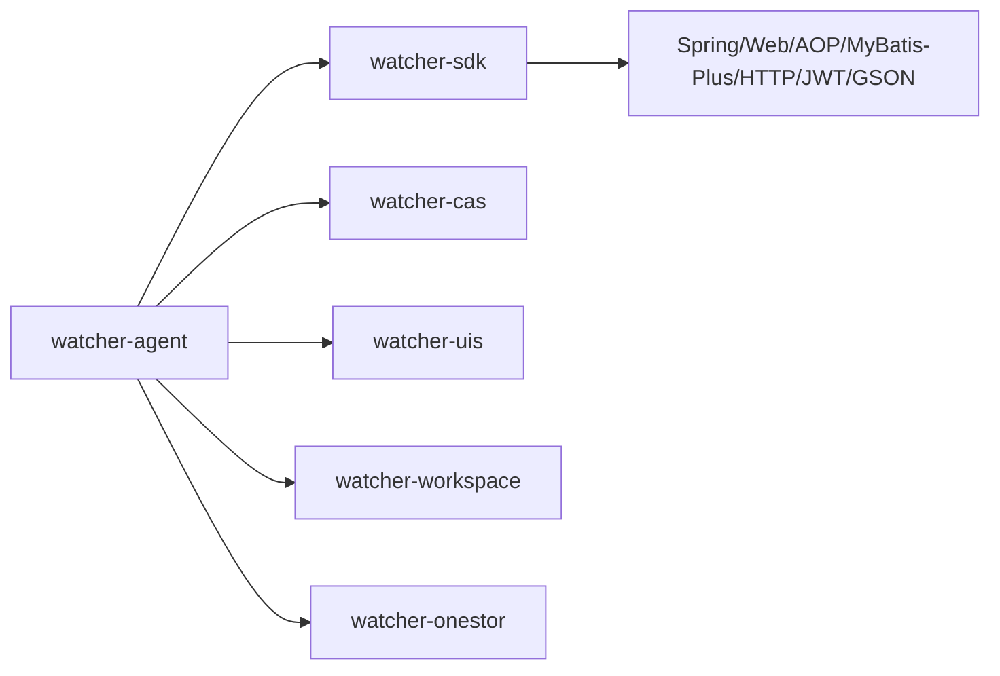

# 核心模块详解

<cite>
**本文引用的文件**
- [WatcherAgentApplication.java](file://watcher-agent/src/main/java/com/virtual/cloud/om/agent/WatcherAgentApplication.java)
- [pom.xml（agent）](file://watcher-agent/pom.xml)
- [CollectController.java](file://watcher-agent/src/main/java/com/virtual/cloud/om/agent/controller/CollectController.java)
- [DeployController.java](file://watcher-agent/src/main/java/com/virtual/cloud/om/agent/controller/DeployController.java)
- [MetricController.java](file://watcher-agent/src/main/java/com/virtual/cloud/om/agent/controller/MetricController.java)
- [DataReportCollector.java](file://watcher-sdk/src/main/java/com/virtual/cloud/om/sdk/api/DataReportCollector.java)
- [DataReportAspect.java](file://watcher-sdk/src/main/java/com/virtual/cloud/om/sdk/aop/DataReportAspect.java)
- [AppException.java](file://watcher-sdk/src/main/java/com/virtual/cloud/om/sdk/exception/AppException.java)
- [FuncUtil.java](file://watcher-sdk/src/main/java/com/virtual/cloud/om/sdk/utils/FuncUtil.java)
- [pom.xml（sdk）](file://watcher-sdk/pom.xml)
- [CasHostHandler.java](file://watcher-cas/src/main/java/com/virtual/cloud/om/cas/service/CasHostHandler.java)
- [pom.xml（cas）](file://watcher-cas/pom.xml)
- [OnestorCalamariPatternHandler.java](file://watcher-onestor/src/main/java/com/virtual/cloud/om/onestor/service/OnestorCalamariPatternHandler.java)
- [StorClusterBasicCollector.java](file://watcher-onestor/src/main/java/com/virtual/cloud/om/onestor/service/clusterBasic/StorClusterBasicCollector.java)
- [pom.xml（onestor）](file://watcher-onestor/pom.xml)
- [pom.xml（uis）](file://watcher-uis/pom.xml)
- [pom.xml（workspace）](file://watcher-workspace/pom.xml)
</cite>

## 目录
1. [简介](#简介)
2. [项目结构](#项目结构)
3. [核心组件](#核心组件)
4. [架构总览](#架构总览)
5. [详细组件分析](#详细组件分析)
6. [依赖分析](#依赖分析)
7. [性能考量](#性能考量)
8. [故障排查指南](#故障排查指南)
9. [结论](#结论)
10. [附录](#附录)

## 简介
本文件面向ShowTime监控系统的“核心模块”，聚焦以下目标：
- 监控代理服务（watcher-agent）的启动流程、数据采集架构、部署管理与定时任务调度机制
- SDK公共组件的设计理念：数据采集抽象层、DTO数据传输对象、工具类库与异常处理机制
- 各产品线监控模块（CAS、UIS、Workspace、OneStor）的监控策略、指标采集逻辑与日志解析规则
- 扩展新监控模块与自定义采集器的实践路径
- 模块间依赖关系、集成方式与独立开发/测试建议

## 项目结构
ShowTime采用多模块聚合工程，核心由“代理服务”“SDK公共库”及“产品线监控模块”构成：
- watcher-agent：Spring Boot应用，承载HTTP接口、定时任务、部署管理与采集编排
- watcher-sdk：跨产品线的公共能力（采集抽象、DTO、工具、异常、REST连接等）
- watcher-cas/uis/workspace/onestor：各产品线监控实现，复用SDK能力

图表来源
- [WatcherAgentApplication.java:14-27](file://watcher-agent/src/main/java/com/virtual/cloud/om/agent/WatcherAgentApplication.java#L14-L27)
- [CollectController.java:30-66](file://watcher-agent/src/main/java/com/virtual/cloud/om/agent/controller/CollectController.java#L30-L66)
- [DeployController.java:34-324](file://watcher-agent/src/main/java/com/virtual/cloud/om/agent/controller/DeployController.java#L34-L324)
- [MetricController.java:19-102](file://watcher-agent/src/main/java/com/virtual/cloud/om/agent/controller/MetricController.java#L19-L102)
- [DataReportCollector.java:18-118](file://watcher-sdk/src/main/java/com/virtual/cloud/om/sdk/api/DataReportCollector.java#L18-L118)
- [FuncUtil.java:51-859](file://watcher-sdk/src/main/java/com/virtual/cloud/om/sdk/utils/FuncUtil.java#L51-L859)
- [AppException.java:12-63](file://watcher-sdk/src/main/java/com/virtual/cloud/om/sdk/exception/AppException.java#L12-L63)
- [CasHostHandler.java:25-60](file://watcher-cas/src/main/java/com/virtual/cloud/om/cas/service/CasHostHandler.java#L25-L60)
- [OnestorCalamariPatternHandler.java:16-57](file://watcher-onestor/src/main/java/com/virtual/cloud/om/onestor/service/OnestorCalamariPatternHandler.java#L16-L57)
- [StorClusterBasicCollector.java:30-76](file://watcher-onestor/src/main/java/com/virtual/cloud/om/onestor/service/clusterBasic/StorClusterBasicCollector.java#L30-L76)

章节来源
- [WatcherAgentApplication.java:14-27](file://watcher-agent/src/main/java/com/virtual/cloud/om/agent/WatcherAgentApplication.java#L14-L27)
- [pom.xml（agent）:14-136](file://watcher-agent/pom.xml#L14-L136)

## 核心组件
- 代理服务入口与扫描范围
  - Spring Boot入口类启用调度与Mapper扫描，并通过组件扫描覆盖SDK与各产品线包路径，确保控制器、服务、采集器被自动装配
  - 参考：[入口类定义:14-27](file://watcher-agent/src/main/java/com/virtual/cloud/om/agent/WatcherAgentApplication.java#L14-L27)，[依赖声明:23-50](file://watcher-agent/pom.xml#L23-L50)

- 控制器层
  - 采集接口：提供实时日志策略下发、资源同步、批量部署等REST接口
    - 参考：[采集控制器:30-66](file://watcher-agent/src/main/java/com/virtual/cloud/om/agent/controller/CollectController.java#L30-L66)
  - 部署管理：多节点/单节点部署、组件服务管理、网络配置、路由管理、节点刷新等
    - 参考：[部署控制器:34-324](file://watcher-agent/src/main/java/com/virtual/cloud/om/agent/controller/DeployController.java#L34-L324)
  - 指标查询：支持指标类型/平台查询、列表分页、最新指标、趋势、上报与汇总
    - 参考：[指标控制器:19-102](file://watcher-agent/src/main/java/com/virtual/cloud/om/agent/controller/MetricController.java#L19-L102)

- SDK公共组件
  - 采集抽象层：统一采集流程、标签解析、上报DTO组装与时间戳处理
    - 参考：[采集抽象:18-118](file://watcher-sdk/src/main/java/com/virtual/cloud/om/sdk/api/DataReportCollector.java#L18-L118)
  - 工具类库：系统命令执行、XML序列化、IP转换、MD5计算、DES加解密等
    - 参考：[工具类:51-859](file://watcher-sdk/src/main/java/com/virtual/cloud/om/sdk/utils/FuncUtil.java#L51-L859)
  - 异常体系：统一错误码与国际化消息封装
    - 参考：[异常定义:12-63](file://watcher-sdk/src/main/java/com/virtual/cloud/om/sdk/exception/AppException.java#L12-L63)

章节来源
- [WatcherAgentApplication.java:14-27](file://watcher-agent/src/main/java/com/virtual/cloud/om/agent/WatcherAgentApplication.java#L14-L27)
- [CollectController.java:30-66](file://watcher-agent/src/main/java/com/virtual/cloud/om/agent/controller/CollectController.java#L30-L66)
- [DeployController.java:34-324](file://watcher-agent/src/main/java/com/virtual/cloud/om/agent/controller/DeployController.java#L34-L324)
- [MetricController.java:19-102](file://watcher-agent/src/main/java/com/virtual/cloud/om/agent/controller/MetricController.java#L19-L102)
- [DataReportCollector.java:18-118](file://watcher-sdk/src/main/java/com/virtual/cloud/om/sdk/api/DataReportCollector.java#L18-L118)
- [FuncUtil.java:51-859](file://watcher-sdk/src/main/java/com/virtual/cloud/om/sdk/utils/FuncUtil.java#L51-L859)
- [AppException.java:12-63](file://watcher-sdk/src/main/java/com/virtual/cloud/om/sdk/exception/AppException.java#L12-L63)

## 架构总览
下图展示代理服务如何通过控制器编排SDK采集抽象与产品线模块，完成部署、采集与上报闭环。

图表来源
- [WatcherAgentApplication.java:14-27](file://watcher-agent/src/main/java/com/virtual/cloud/om/agent/WatcherAgentApplication.java#L14-L27)
- [CollectController.java:30-66](file://watcher-agent/src/main/java/com/virtual/cloud/om/agent/controller/CollectController.java#L30-L66)
- [DeployController.java:34-324](file://watcher-agent/src/main/java/com/virtual/cloud/om/agent/controller/DeployController.java#L34-L324)
- [DataReportCollector.java:18-118](file://watcher-sdk/src/main/java/com/virtual/cloud/om/sdk/api/DataReportCollector.java#L18-L118)

## 详细组件分析

### 监控代理服务（watcher-agent）
- 启动流程
  - 入口类启用调度与Mapper扫描，组件扫描覆盖SDK与各产品线包，确保自动装配
  - 参考：[入口类:14-27](file://watcher-agent/src/main/java/com/virtual/cloud/om/agent/WatcherAgentApplication.java#L14-L27)，[依赖聚合:23-50](file://watcher-agent/pom.xml#L23-L50)

- 数据采集架构
  - 控制器层负责接收请求，委派至SDK采集抽象与产品线模块
  - 采集抽象统一处理标签解析、时间戳与DTO组装
  - 参考：[采集控制器:30-66](file://watcher-agent/src/main/java/com/virtual/cloud/om/agent/controller/CollectController.java#L30-L66)，[采集抽象:18-118](file://watcher-sdk/src/main/java/com/virtual/cloud/om/sdk/api/DataReportCollector.java#L18-L118)

- 部署管理功能
  - 支持批量/单节点部署、组件服务管理、网络配置、路由管理、节点刷新与keepalived通知
  - 使用工具类执行系统命令，保证网络变更与服务重启
  - 参考：[部署控制器:34-324](file://watcher-agent/src/main/java/com/virtual/cloud/om/agent/controller/DeployController.java#L34-L324)，[工具类:51-859](file://watcher-sdk/src/main/java/com/virtual/cloud/om/sdk/utils/FuncUtil.java#L51-L859)

- 定时任务调度机制
  - 应用启用调度注解，结合Quartz自动配置排除，避免重复调度
  - 参考：[入口类启用调度:17-16](file://watcher-agent/src/main/java/com/virtual/cloud/om/agent/WatcherAgentApplication.java#L17-L16)，[Quartz排除:14-16](file://watcher-agent/pom.xml#L14-L16)

图表来源
- [WatcherAgentApplication.java:14-27](file://watcher-agent/src/main/java/com/virtual/cloud/om/agent/WatcherAgentApplication.java#L14-L27)
- [pom.xml（agent）:14-16](file://watcher-agent/pom.xml#L14-L16)

章节来源
- [WatcherAgentApplication.java:14-27](file://watcher-agent/src/main/java/com/virtual/cloud/om/agent/WatcherAgentApplication.java#L14-L27)
- [pom.xml（agent）:14-16](file://watcher-agent/pom.xml#L14-L16)
- [CollectController.java:30-66](file://watcher-agent/src/main/java/com/virtual/cloud/om/agent/controller/CollectController.java#L30-L66)
- [DeployController.java:34-324](file://watcher-agent/src/main/java/com/virtual/cloud/om/agent/controller/DeployController.java#L34-L324)
- [MetricController.java:19-102](file://watcher-agent/src/main/java/com/virtual/cloud/om/agent/controller/MetricController.java#L19-L102)

### SDK公共组件

#### 数据采集抽象层（DataReportCollector）
- 设计要点
  - 统一采集流程：解析标签、调用具体采集实现、组装ReportDTO、填充时间戳
  - 抽象方法：采集实现、指标类型枚举、值类型枚举
  - 参考：[采集抽象:18-118](file://watcher-sdk/src/main/java/com/virtual/cloud/om/sdk/api/DataReportCollector.java#L18-L118)

图表来源
- [DataReportCollector.java:18-118](file://watcher-sdk/src/main/java/com/virtual/cloud/om/sdk/api/DataReportCollector.java#L18-L118)

章节来源
- [DataReportCollector.java:18-118](file://watcher-sdk/src/main/java/com/virtual/cloud/om/sdk/api/DataReportCollector.java#L18-L118)

#### DTO数据传输对象
- 说明
  - SDK中包含大量DTO用于采集、日志、部署、告警等场景的数据传输
  - 产品线模块通过继承/组合这些DTO实现特定业务
  - 参考：[SDK DTO集合概览](file://watcher-sdk/src/main/java/com/virtual/cloud/om/sdk/dto/)

章节来源
- [pom.xml（sdk）:14-160](file://watcher-sdk/pom.xml#L14-L160)

#### 工具类库（FuncUtil）
- 能力
  - 系统命令执行、超时控制、错误流捕获
  - XML序列化/反序列化、IP与MD5工具
  - DES对称加解密、整数/长整形转换
  - 参考：[工具类:51-859](file://watcher-sdk/src/main/java/com/virtual/cloud/om/sdk/utils/FuncUtil.java#L51-L859)

图表来源
- [FuncUtil.java:250-458](file://watcher-sdk/src/main/java/com/virtual/cloud/om/sdk/utils/FuncUtil.java#L250-L458)

章节来源
- [FuncUtil.java:51-859](file://watcher-sdk/src/main/java/com/virtual/cloud/om/sdk/utils/FuncUtil.java#L51-L859)

#### 异常处理机制（AppException）
- 设计
  - 统一错误码与国际化消息，支持构造时注入数据占位符
  - 参考：[异常定义:12-63](file://watcher-sdk/src/main/java/com/virtual/cloud/om/sdk/exception/AppException.java#L12-L63)

章节来源
- [AppException.java:12-63](file://watcher-sdk/src/main/java/com/virtual/cloud/om/sdk/exception/AppException.java#L12-L63)

### 产品线监控模块

#### CAS模块（主机发现与资源识别）
- 能力
  - 通过REST连接获取主机基本信息，构建SSHHost供后续采集使用
  - 实现HostApi接口，返回资源类型标识
  - 参考：[主机处理器:25-60](file://watcher-cas/src/main/java/com/virtual/cloud/om/cas/service/CasHostHandler.java#L25-L60)

图表来源
- [CasHostHandler.java:31-42](file://watcher-cas/src/main/java/com/virtual/cloud/om/cas/service/CasHostHandler.java#L31-L42)

章节来源
- [CasHostHandler.java:25-60](file://watcher-cas/src/main/java/com/virtual/cloud/om/cas/service/CasHostHandler.java#L25-L60)
- [pom.xml（cas）:14-27](file://watcher-cas/pom.xml#L14-L27)

#### OneStor模块（指标采集与日志解析）
- 指标采集
  - 通过REST连接获取集群基础信息，组装JSON值并上报
  - 参考：[集群基础采集器:30-76](file://watcher-onestor/src/main/java/com/virtual/cloud/om/onestor/service/clusterBasic/StorClusterBasicCollector.java#L30-L76)

图表来源
- [StorClusterBasicCollector.java:38-65](file://watcher-onestor/src/main/java/com/virtual/cloud/om/onestor/service/clusterBasic/StorClusterBasicCollector.java#L38-L65)

- 日志解析
  - 基于正则表达式解析Calamari日志，提取时间、级别、PID、脚本、方法、行号与消息
  - 参考：[日志解析器:16-57](file://watcher-onestor/src/main/java/com/virtual/cloud/om/onestor/service/OnestorCalamariPatternHandler.java#L16-L57)

图表来源
- [OnestorCalamariPatternHandler.java:23-51](file://watcher-onestor/src/main/java/com/virtual/cloud/om/onestor/service/OnestorCalamariPatternHandler.java#L23-L51)

章节来源
- [StorClusterBasicCollector.java:30-76](file://watcher-onestor/src/main/java/com/virtual/cloud/om/onestor/service/clusterBasic/StorClusterBasicCollector.java#L30-L76)
- [OnestorCalamariPatternHandler.java:16-57](file://watcher-onestor/src/main/java/com/virtual/cloud/om/onestor/service/OnestorCalamariPatternHandler.java#L16-L57)
- [pom.xml（onestor）:14-27](file://watcher-onestor/pom.xml#L14-L27)

#### UIS与Workspace模块
- UIS模块
  - 提供UIS相关监控能力，依赖SDK
  - 参考：[模块POM:14-27](file://watcher-uis/pom.xml#L14-L27)
- Workspace模块
  - 提供Workspace相关监控能力，依赖SDK
  - 参考：[模块POM:14-30](file://watcher-workspace/pom.xml#L14-L30)

章节来源
- [pom.xml（uis）:14-27](file://watcher-uis/pom.xml#L14-L27)
- [pom.xml（workspace）:14-30](file://watcher-workspace/pom.xml#L14-L30)

## 依赖分析
- 代理服务依赖SDK与各产品线模块，形成“上层编排、底层实现”的分层
- SDK内部依赖Spring Web/AOP、MyBatis-Plus、HTTP客户端、JWT/GSON等
- 产品线模块仅依赖SDK，保持低耦合与可替换性

图表来源
- [pom.xml（agent）:23-50](file://watcher-agent/pom.xml#L23-L50)
- [pom.xml（sdk）:17-160](file://watcher-sdk/pom.xml#L17-L160)
- [pom.xml（cas）:14-27](file://watcher-cas/pom.xml#L14-L27)
- [pom.xml（uis）:14-27](file://watcher-uis/pom.xml#L14-L27)
- [pom.xml（workspace）:14-30](file://watcher-workspace/pom.xml#L14-L30)
- [pom.xml（onestor）:14-27](file://watcher-onestor/pom.xml#L14-L27)

章节来源
- [pom.xml（agent）:23-50](file://watcher-agent/pom.xml#L23-L50)
- [pom.xml（sdk）:17-160](file://watcher-sdk/pom.xml#L17-L160)

## 性能考量
- 采集抽象层统一处理时间戳与空值，减少重复逻辑
- 工具类对系统命令执行提供超时控制与错误流捕获，避免阻塞
- 建议
  - 控制采集并发度，避免对远端系统造成压力
  - 对大体量日志解析采用流式处理与分批上报
  - 合理设置网络配置与路由变更的重试与回滚策略

## 故障排查指南
- 统一异常
  - 使用AppException进行错误包装，便于前端/平台侧统一处理
  - 参考：[异常定义:12-63](file://watcher-sdk/src/main/java/com/virtual/cloud/om/sdk/exception/AppException.java#L12-L63)
- 命令执行问题
  - 使用FuncUtil.runCommand系列方法，关注超时与退出码
  - 参考：[命令执行:250-458](file://watcher-sdk/src/main/java/com/virtual/cloud/om/sdk/utils/FuncUtil.java#L250-L458)
- 部署失败定位
  - 部署控制器在异常时更新数据中心步骤，便于定位阶段
  - 参考：[部署控制器异常分支:56-60](file://watcher-agent/src/main/java/com/virtual/cloud/om/agent/controller/DeployController.java#L56-L60)

章节来源
- [AppException.java:12-63](file://watcher-sdk/src/main/java/com/virtual/cloud/om/sdk/exception/AppException.java#L12-L63)
- [FuncUtil.java:250-458](file://watcher-sdk/src/main/java/com/virtual/cloud/om/sdk/utils/FuncUtil.java#L250-L458)
- [DeployController.java:56-60](file://watcher-agent/src/main/java/com/virtual/cloud/om/agent/controller/DeployController.java#L56-L60)

## 结论
ShowTime核心模块通过“代理服务+SDK+产品线模块”的分层设计，实现了高内聚、低耦合的监控体系。代理服务负责编排与调度，SDK提供统一采集抽象与工具库，产品线模块专注于各自领域的指标与日志处理。该架构便于扩展新模块与自定义采集器，同时具备良好的可维护性与可测试性。

## 附录

### 扩展新监控模块与自定义采集器实践
- 新增采集器
  - 继承SDK采集抽象，实现采集方法与指标类型枚举
  - 在产品线模块中注册为Spring组件，即可被代理服务统一调度
  - 参考：[采集抽象:18-118](file://watcher-sdk/src/main/java/com/virtual/cloud/om/sdk/api/DataReportCollector.java#L18-L118)
- 自定义日志解析
  - 实现日志解析接口，编写正则表达式匹配关键字段
  - 参考：[日志解析器:16-57](file://watcher-onestor/src/main/java/com/virtual/cloud/om/onestor/service/OnestorCalamariPatternHandler.java#L16-L57)
- 部署与网络配置
  - 使用工具类执行系统命令，注意超时与错误处理
  - 参考：[部署控制器:34-324](file://watcher-agent/src/main/java/com/virtual/cloud/om/agent/controller/DeployController.java#L34-L324)，[工具类:51-859](file://watcher-sdk/src/main/java/com/virtual/cloud/om/sdk/utils/FuncUtil.java#L51-L859)

章节来源
- [DataReportCollector.java:18-118](file://watcher-sdk/src/main/java/com/virtual/cloud/om/sdk/api/DataReportCollector.java#L18-L118)
- [OnestorCalamariPatternHandler.java:16-57](file://watcher-onestor/src/main/java/com/virtual/cloud/om/onestor/service/OnestorCalamariPatternHandler.java#L16-L57)
- [DeployController.java:34-324](file://watcher-agent/src/main/java/com/virtual/cloud/om/agent/controller/DeployController.java#L34-L324)
- [FuncUtil.java:51-859](file://watcher-sdk/src/main/java/com/virtual/cloud/om/sdk/utils/FuncUtil.java#L51-L859)