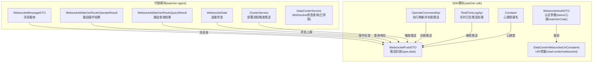
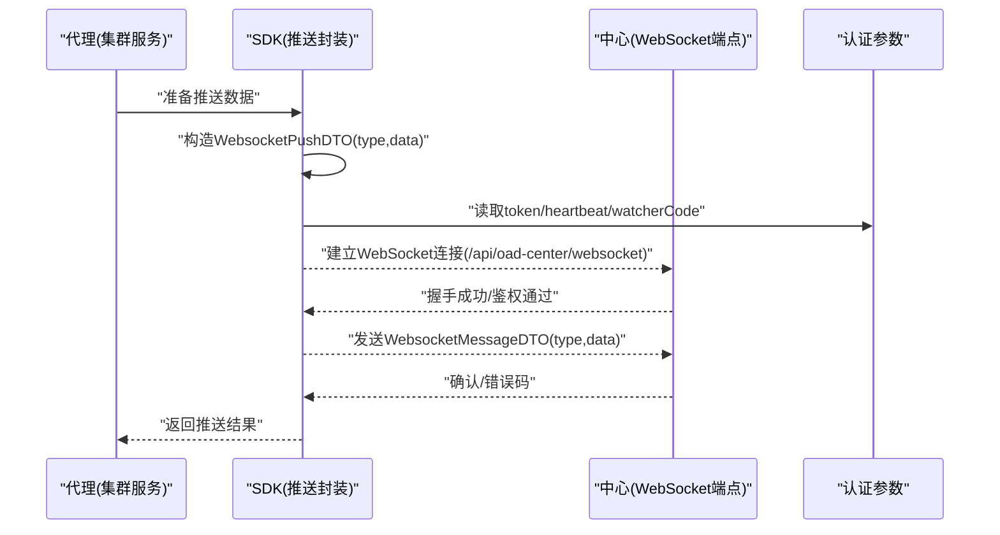
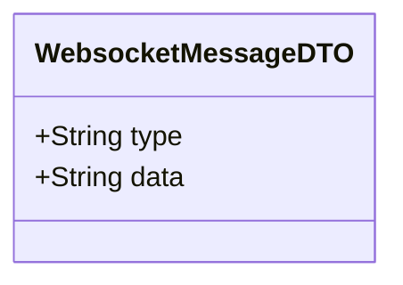
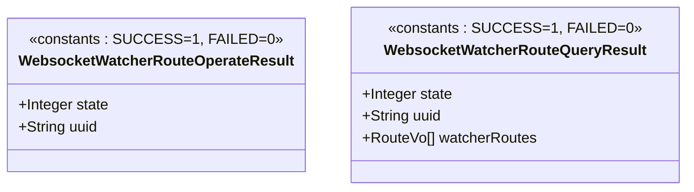
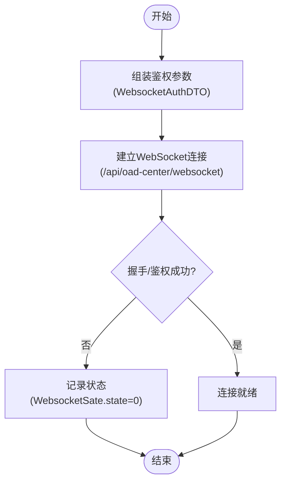
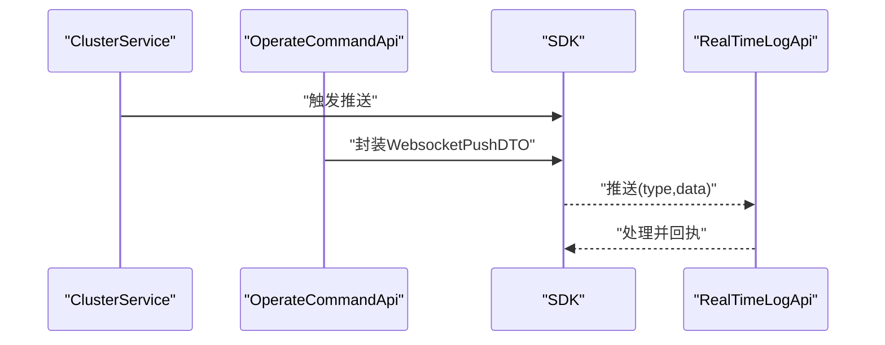
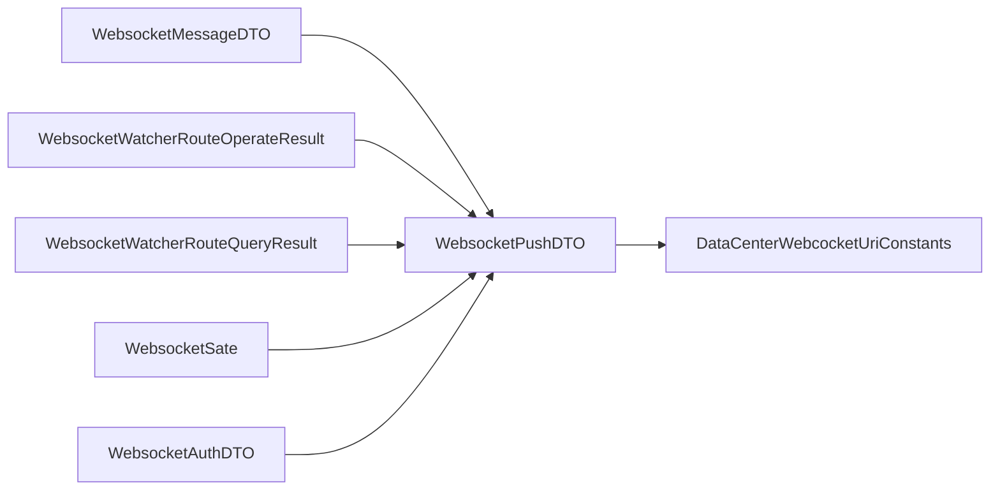

# WebSocket实时通信

<cite>
**本文引用的文件**
- [WebsocketMessageDTO.java](file://watcher-agent/src/main/java/com/virtual/cloud/om/agent/dto/WebsocketMessageDTO.java)
- [WebsocketWatcherRouteOperateResult.java](file://watcher-agent/src/main/java/com/virtual/cloud/om/agent/dto/WebsocketWatcherRouteOperateResult.java)
- [WebsocketWatcherRouteQueryResult.java](file://watcher-agent/src/main/java/com/virtual/cloud/om/agent/dto/WebsocketWatcherRouteQueryResult.java)
- [WebsocketSate.java](file://watcher-agent/src/main/java/com/virtual/cloud/om/agent/entity/WebsocketSate.java)
- [WebsocketAuthDTO.java](file://watcher-sdk/src/main/java/com/virtual/cloud/om/sdk/dto/websocket/WebsocketAuthDTO.java)
- [WebsocketPushDTO.java](file://watcher-sdk/src/main/java/com/virtual/cloud/om/sdk/dto/websocket/WebsocketPushDTO.java)
- [DataCenterWebcocketUriConstants.java](file://watcher-sdk/src/main/java/com/virtual/cloud/om/sdk/constant/uri/DataCenterWebcocketUriConstants.java)
- [OperateCommandApi.java](file://watcher-sdk/src/main/java/com/virtual/cloud/om/sdk/api/OperateCommandApi.java)
- [RealTimeLogApi.java](file://watcher-sdk/src/main/java/com/virtual/cloud/om/sdk/api/RealTimeLogApi.java)
- [DataCenterService.java](file://watcher-agent/src/main/java/com/virtual/cloud/om/agent/service/datacenter/DataCenterService.java)
- [ClusterService.java](file://watcher-agent/src/main/java/com/virtual/cloud/om/agent/service/deploy/ClusterService.java)
- [Constant.java](file://watcher-sdk/src/main/java/com/virtual/cloud/om/sdk/constant/Constant.java)
</cite>

## 目录
1. [简介](#简介)
2. [项目结构](#项目结构)
3. [核心组件](#核心组件)
4. [架构总览](#架构总览)
5. [详细组件分析](#详细组件分析)
6. [依赖分析](#依赖分析)
7. [性能考量](#性能考量)
8. [故障排查指南](#故障排查指南)
9. [结论](#结论)
10. [附录](#附录)

## 简介
本文件聚焦于监控代理的WebSocket实时通信能力，系统性梳理消息协议、路由操作与查询结果模型、连接状态与安全参数、以及服务端推送与客户端订阅机制。通过对仓库中实际存在的DTO与常量定义进行解析，给出可落地的实现建议与最佳实践，帮助开发者快速集成与稳定运行。

## 项目结构
围绕WebSocket实时通信的关键代码主要分布在两个模块：
- watcher-agent：代理侧的数据传输与状态封装（消息DTO、路由操作/查询结果、连接状态实体）
- watcher-sdk：SDK侧的推送封装、认证参数、URI常量与业务API对接

图表来源
- [WebsocketMessageDTO.java:1-23](file://watcher-agent/src/main/java/com/virtual/cloud/om/agent/dto/WebsocketMessageDTO.java#L1-L23)
- [WebsocketWatcherRouteOperateResult.java:1-14](file://watcher-agent/src/main/java/com/virtual/cloud/om/agent/dto/WebsocketWatcherRouteOperateResult.java#L1-L14)
- [WebsocketWatcherRouteQueryResult.java:1-17](file://watcher-agent/src/main/java/com/virtual/cloud/om/agent/dto/WebsocketWatcherRouteQueryResult.java#L1-L17)
- [WebsocketSate.java:1-29](file://watcher-agent/src/main/java/com/virtual/cloud/om/agent/entity/WebsocketSate.java#L1-L29)
- [WebsocketAuthDTO.java:1-23](file://watcher-sdk/src/main/java/com/virtual/cloud/om/sdk/dto/websocket/WebsocketAuthDTO.java#L1-L23)
- [WebsocketPushDTO.java:1-14](file://watcher-sdk/src/main/java/com/virtual/cloud/om/sdk/dto/websocket/WebsocketPushDTO.java#L1-L14)
- [DataCenterWebcocketUriConstants.java:1-14](file://watcher-sdk/src/main/java/com/virtual/cloud/om/sdk/constant/uri/DataCenterWebcocketUriConstants.java#L1-L14)
- [OperateCommandApi.java:1-120](file://watcher-sdk/src/main/java/com/virtual/cloud/om/sdk/api/OperateCommandApi.java#L1-L120)
- [RealTimeLogApi.java:1-120](file://watcher-sdk/src/main/java/com/virtual/cloud/om/sdk/api/RealTimeLogApi.java#L1-L120)
- [DataCenterService.java:1-150](file://watcher-agent/src/main/java/com/virtual/cloud/om/agent/service/datacenter/DataCenterService.java#L1-L150)
- [ClusterService.java:1-200](file://watcher-agent/src/main/java/com/virtual/cloud/om/agent/service/deploy/ClusterService.java#L1-L200)
- [Constant.java:1-200](file://watcher-sdk/src/main/java/com/virtual/cloud/om/sdk/constant/Constant.java#L1-L200)

章节来源
- [WebsocketMessageDTO.java:1-23](file://watcher-agent/src/main/java/com/virtual/cloud/om/agent/dto/WebsocketMessageDTO.java#L1-L23)
- [WebsocketAuthDTO.java:1-23](file://watcher-sdk/src/main/java/com/virtual/cloud/om/sdk/dto/websocket/WebsocketAuthDTO.java#L1-L23)
- [DataCenterWebcocketUriConstants.java:1-14](file://watcher-sdk/src/main/java/com/virtual/cloud/om/sdk/constant/uri/DataCenterWebcocketUriConstants.java#L1-L14)

## 核心组件
- 消息载体：WebsocketMessageDTO，承载type与data字段，用于在代理与中心之间传递任意JSON字符串内容。
- 路由操作结果：WebsocketWatcherRouteOperateResult，包含state与uuid，用于反馈路由操作的成功或失败状态。
- 路由查询结果：WebsocketWatcherRouteQueryResult，包含state、uuid与watcherRoutes列表，用于返回查询到的路由配置集合。
- 连接状态：WebsocketSate，包含id、state与message，用于描述WebSocket连接的当前状态与附加信息。
- 认证参数：WebsocketAuthDTO，包含token、heartbeat与watcherCode，作为连接建立时的鉴权与心跳周期参数。
- 推送封装：WebsocketPushDTO，以type与data的形式封装推送内容，配合枚举类型区分推送类别。
- URI常量：DataCenterWebcocketUriConstants，定义WebSocket接入路径与SSH通道路径。

章节来源
- [WebsocketMessageDTO.java:1-23](file://watcher-agent/src/main/java/com/virtual/cloud/om/agent/dto/WebsocketMessageDTO.java#L1-L23)
- [WebsocketWatcherRouteOperateResult.java:1-14](file://watcher-agent/src/main/java/com/virtual/cloud/om/agent/dto/WebsocketWatcherRouteOperateResult.java#L1-L14)
- [WebsocketWatcherRouteQueryResult.java:1-17](file://watcher-agent/src/main/java/com/virtual/cloud/om/agent/dto/WebsocketWatcherRouteQueryResult.java#L1-L17)
- [WebsocketSate.java:1-29](file://watcher-agent/src/main/java/com/virtual/cloud/om/agent/entity/WebsocketSate.java#L1-L29)
- [WebsocketAuthDTO.java:1-23](file://watcher-sdk/src/main/java/com/virtual/cloud/om/sdk/dto/websocket/WebsocketAuthDTO.java#L1-L23)
- [WebsocketPushDTO.java:1-14](file://watcher-sdk/src/main/java/com/virtual/cloud/om/sdk/dto/websocket/WebsocketPushDTO.java#L1-L14)
- [DataCenterWebcocketUriConstants.java:1-14](file://watcher-sdk/src/main/java/com/virtual/cloud/om/sdk/constant/uri/DataCenterWebcocketUriConstants.java#L1-L14)

## 架构总览
下图展示从代理侧发起推送、经由SDK封装、到中心端接收的整体链路，以及认证参数与URI常量在其中的作用。

图表来源
- [ClusterService.java:120-135](file://watcher-agent/src/main/java/com/virtual/cloud/om/agent/service/deploy/ClusterService.java#L120-L135)
- [OperateCommandApi.java:70-90](file://watcher-sdk/src/main/java/com/virtual/cloud/om/sdk/api/OperateCommandApi.java#L70-L90)
- [WebsocketPushDTO.java:1-14](file://watcher-sdk/src/main/java/com/virtual/cloud/om/sdk/dto/websocket/WebsocketPushDTO.java#L1-L14)
- [WebsocketAuthDTO.java:1-23](file://watcher-sdk/src/main/java/com/virtual/cloud/om/sdk/dto/websocket/WebsocketAuthDTO.java#L1-L23)
- [DataCenterWebcocketUriConstants.java:8-13](file://watcher-sdk/src/main/java/com/virtual/cloud/om/sdk/constant/uri/DataCenterWebcocketUriConstants.java#L8-L13)

## 详细组件分析

### 消息协议设计
- 消息载体：WebsocketMessageDTO
  - 字段：type（消息类型）、data（消息内容，建议为JSON字符串）
  - 用途：统一承载各类推送与回传消息
- 数据序列化机制
  - 建议采用JSON序列化，确保type与data的可解析性
  - data字段承载复杂对象时，应保证双方约定一致的schema
- 消息类型定义
  - type由业务方约定，例如“route.query”、“route.operate”、“status.update”等
  - 建议在SDK层提供枚举或常量集中管理type值，避免魔法字符串

图表来源
- [WebsocketMessageDTO.java:15-22](file://watcher-agent/src/main/java/com/virtual/cloud/om/agent/dto/WebsocketMessageDTO.java#L15-L22)

章节来源
- [WebsocketMessageDTO.java:1-23](file://watcher-agent/src/main/java/com/virtual/cloud/om/agent/dto/WebsocketMessageDTO.java#L1-L23)

### 路由操作与查询结果
- 路由操作结果：WebsocketWatcherRouteOperateResult
  - 字段：state（状态：成功/失败）、uuid（操作唯一标识）
  - 用途：对路由变更类操作进行反馈
- 路由查询结果：WebsocketWatcherRouteQueryResult
  - 字段：state、uuid、watcherRoutes（路由列表）
  - 用途：对路由查询请求返回结果集

图表来源
- [WebsocketWatcherRouteOperateResult.java:6-13](file://watcher-agent/src/main/java/com/virtual/cloud/om/agent/dto/WebsocketWatcherRouteOperateResult.java#L6-L13)
- [WebsocketWatcherRouteQueryResult.java:9-16](file://watcher-agent/src/main/java/com/virtual/cloud/om/agent/dto/WebsocketWatcherRouteQueryResult.java#L9-L16)

章节来源
- [WebsocketWatcherRouteOperateResult.java:1-14](file://watcher-agent/src/main/java/com/virtual/cloud/om/agent/dto/WebsocketWatcherRouteOperateResult.java#L1-L14)
- [WebsocketWatcherRouteQueryResult.java:1-17](file://watcher-agent/src/main/java/com/virtual/cloud/om/agent/dto/WebsocketWatcherRouteQueryResult.java#L1-L17)

### 连接状态与建立流程
- 连接状态：WebsocketSate
  - 字段：id（连接标识）、state（状态码）、message（附加信息）
  - 用途：描述WebSocket连接的当前状态
- 连接建立与鉴权
  - 鉴权参数：WebsocketAuthDTO（token、heartbeat、watcherCode）
  - 接入URI：DataCenterWebcocketUriConstants（/api/oad-center/websocket）
- 状态查询现状
  - DataCenterService中存在WebSocket状态查询逻辑，但当前已被标记为“已禁用”，返回默认状态

图表来源
- [WebsocketAuthDTO.java:15-22](file://watcher-sdk/src/main/java/com/virtual/cloud/om/sdk/dto/websocket/WebsocketAuthDTO.java#L15-L22)
- [DataCenterWebcocketUriConstants.java:11-12](file://watcher-sdk/src/main/java/com/virtual/cloud/om/sdk/constant/uri/DataCenterWebcocketUriConstants.java#L11-L12)
- [DataCenterService.java:41-47](file://watcher-agent/src/main/java/com/virtual/cloud/om/agent/service/datacenter/DataCenterService.java#L41-L47)
- [WebsocketSate.java:20-28](file://watcher-agent/src/main/java/com/virtual/cloud/om/agent/entity/WebsocketSate.java#L20-L28)

章节来源
- [WebsocketSate.java:1-29](file://watcher-agent/src/main/java/com/virtual/cloud/om/agent/entity/WebsocketSate.java#L1-L29)
- [WebsocketAuthDTO.java:1-23](file://watcher-sdk/src/main/java/com/virtual/cloud/om/sdk/dto/websocket/WebsocketAuthDTO.java#L1-L23)
- [DataCenterWebcocketUriConstants.java:1-14](file://watcher-sdk/src/main/java/com/virtual/cloud/om/sdk/constant/uri/DataCenterWebcocketUriConstants.java#L1-L14)
- [DataCenterService.java:41-47](file://watcher-agent/src/main/java/com/virtual/cloud/om/agent/service/datacenter/DataCenterService.java#L41-L47)

### 实时监控数据推送
- 推送封装：WebsocketPushDTO
  - 结构：type（推送类型枚举）、data（推送数据）
  - 用途：统一推送载体，便于中心端按类型分发处理
- 触发场景
  - ClusterService在特定部署步骤中会触发WebSocket上报
  - OperateCommandApi在执行刷新后封装推送DTO返回
  - RealTimeLogApi负责接收WebSocket推送并处理日志实时上报逻辑

图表来源
- [ClusterService.java:124-128](file://watcher-agent/src/main/java/com/virtual/cloud/om/agent/service/deploy/ClusterService.java#L124-L128)
- [OperateCommandApi.java:78-88](file://watcher-sdk/src/main/java/com/virtual/cloud/om/sdk/api/OperateCommandApi.java#L78-L88)
- [WebsocketPushDTO.java:10-13](file://watcher-sdk/src/main/java/com/virtual/cloud/om/sdk/dto/websocket/WebsocketPushDTO.java#L10-L13)
- [RealTimeLogApi.java:16-20](file://watcher-sdk/src/main/java/com/virtual/cloud/om/sdk/api/RealTimeLogApi.java#L16-L20)

章节来源
- [OperateCommandApi.java:70-90](file://watcher-sdk/src/main/java/com/virtual/cloud/om/sdk/api/OperateCommandApi.java#L70-L90)
- [RealTimeLogApi.java:1-120](file://watcher-sdk/src/main/java/com/virtual/cloud/om/sdk/api/RealTimeLogApi.java#L1-L120)
- [ClusterService.java:124-128](file://watcher-agent/src/main/java/com/virtual/cloud/om/agent/service/deploy/ClusterService.java#L124-L128)

### 安全与访问控制
- 连接认证
  - 使用WebsocketAuthDTO中的token进行鉴权
  - 建议结合watcherCode进行设备/租户维度的访问控制
- 心跳与保活
  - heartbeat字段用于声明心跳周期（毫秒）
  - SDK中存在“websocket”心跳锁键名，可用于分布式锁或节流控制
- 访问控制
  - 建议在中心端基于token与watcherCode进行权限校验
  - 对非法连接或异常流量实施限速与熔断

章节来源
- [WebsocketAuthDTO.java:17-21](file://watcher-sdk/src/main/java/com/virtual/cloud/om/sdk/dto/websocket/WebsocketAuthDTO.java#L17-L21)
- [Constant.java:120-125](file://watcher-sdk/src/main/java/com/virtual/cloud/om/sdk/constant/Constant.java#L120-L125)

## 依赖分析
- 组件耦合
  - 代理侧DTO与SDK推送封装解耦，通过URI常量与鉴权参数对接
  - 路由结果与连接状态作为中间态，服务于上层业务API
- 外部依赖
  - WebSocket端点路径由DataCenterWebcocketUriConstants集中管理
  - 推送封装与URI常量共同决定消息的传输路径与格式

图表来源
- [WebsocketMessageDTO.java:15-22](file://watcher-agent/src/main/java/com/virtual/cloud/om/agent/dto/WebsocketMessageDTO.java#L15-L22)
- [WebsocketWatcherRouteOperateResult.java:6-13](file://watcher-agent/src/main/java/com/virtual/cloud/om/agent/dto/WebsocketWatcherRouteOperateResult.java#L6-L13)
- [WebsocketWatcherRouteQueryResult.java:9-16](file://watcher-agent/src/main/java/com/virtual/cloud/om/agent/dto/WebsocketWatcherRouteQueryResult.java#L9-L16)
- [WebsocketSate.java:20-28](file://watcher-agent/src/main/java/com/virtual/cloud/om/agent/entity/WebsocketSate.java#L20-L28)
- [WebsocketAuthDTO.java:15-22](file://watcher-sdk/src/main/java/com/virtual/cloud/om/sdk/dto/websocket/WebsocketAuthDTO.java#L15-L22)
- [WebsocketPushDTO.java:10-13](file://watcher-sdk/src/main/java/com/virtual/cloud/om/sdk/dto/websocket/WebsocketPushDTO.java#L10-L13)
- [DataCenterWebcocketUriConstants.java:11-12](file://watcher-sdk/src/main/java/com/virtual/cloud/om/sdk/constant/uri/DataCenterWebcocketUriConstants.java#L11-L12)

## 性能考量
- 序列化成本
  - data字段建议使用紧凑JSON，避免冗余字段
  - 对高频推送场景，可考虑批量合并或压缩策略
- 心跳与保活
  - 合理设置heartbeat周期，避免过于频繁的心跳造成网络压力
  - 在SDK层引入心跳锁，防止重复保活请求
- 连接管理
  - 对异常断线进行指数退避重连，避免雪崩效应
  - 在代理侧记录WebsocketSate，便于定位连接问题

章节来源
- [Constant.java:120-125](file://watcher-sdk/src/main/java/com/virtual/cloud/om/sdk/constant/Constant.java#L120-L125)
- [WebsocketSate.java:20-28](file://watcher-agent/src/main/java/com/virtual/cloud/om/agent/entity/WebsocketSate.java#L20-L28)

## 故障排查指南
- 连接无法建立
  - 检查token是否有效、watcherCode是否匹配
  - 确认URI路径与中心端一致（/api/oad-center/websocket）
- 鉴权失败
  - 核对WebsocketAuthDTO参数完整性
  - 查看中心端日志，确认鉴权拦截规则
- 心跳异常
  - 检查heartbeat配置是否合理
  - 关注心跳锁状态，避免并发心跳导致的资源竞争
- 状态查询无效
  - DataCenterService中WebSocket状态查询功能当前已禁用，需评估启用或替换为其他健康检查方式

章节来源
- [WebsocketAuthDTO.java:17-21](file://watcher-sdk/src/main/java/com/virtual/cloud/om/sdk/dto/websocket/WebsocketAuthDTO.java#L17-L21)
- [DataCenterWebcocketUriConstants.java:11-12](file://watcher-sdk/src/main/java/com/virtual/cloud/om/sdk/constant/uri/DataCenterWebcocketUriConstants.java#L11-L12)
- [DataCenterService.java:41-47](file://watcher-agent/src/main/java/com/virtual/cloud/om/agent/service/datacenter/DataCenterService.java#L41-L47)

## 结论
本仓库提供了WebSocket实时通信的基础模型：消息载体、路由操作/查询结果、连接状态、认证参数与推送封装，并通过URI常量与业务API形成闭环。建议在此基础上完善心跳保活、异常恢复与安全策略，确保在高并发与不稳定网络环境下仍能稳定推送实时监控数据。

## 附录
- 客户端集成要点
  - 建立连接前先组装WebsocketAuthDTO，携带token、heartbeat与watcherCode
  - 使用DataCenterWebcocketUriConstants提供的路径建立WebSocket连接
  - 根据WebsocketPushDTO的type字段解析data内容，实现订阅与展示
- 常见问题
  - 若收到状态查询无效提示，请参考DataCenterService中的禁用说明并评估替代方案
  - 如遇推送延迟，检查heartbeat与网络质量，必要时降低推送频率或启用批量合并