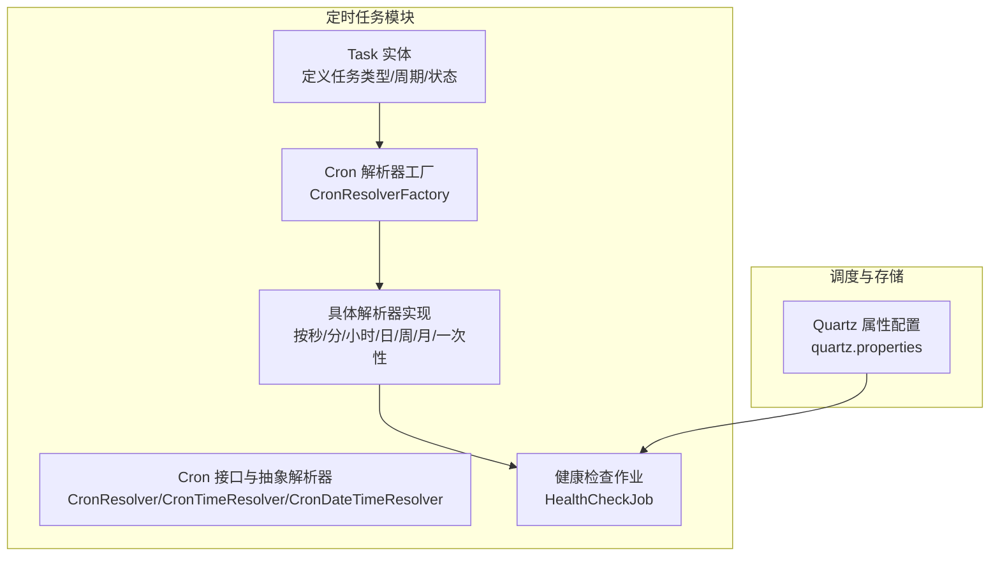
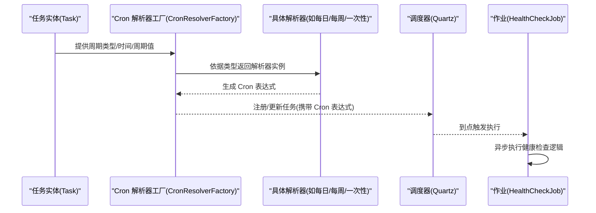
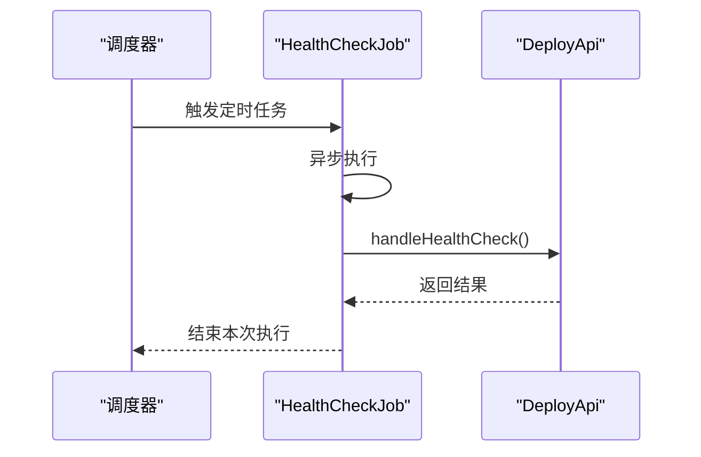
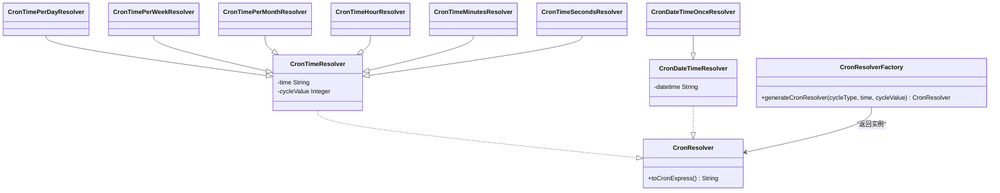
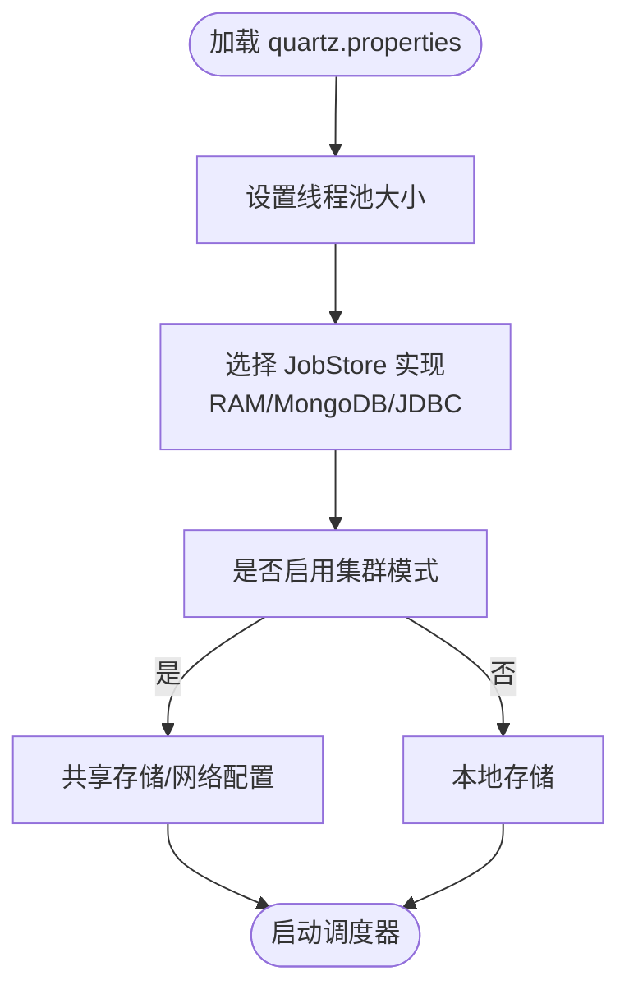
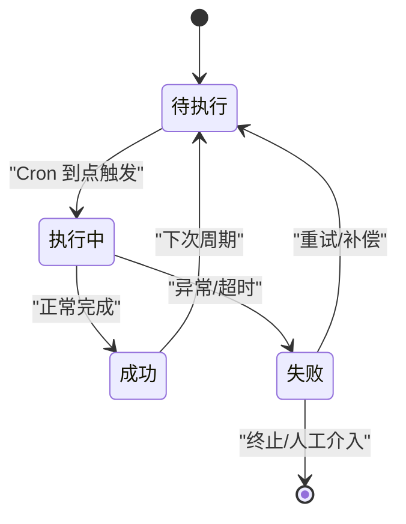
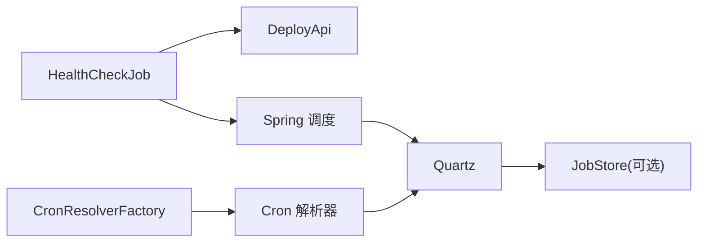

# 定时任务系统

<cite>
**本文引用的文件**
- [HealthCheckJob.java](file://watcher-agent/src/main/java/com/virtual/cloud/om/agent/task/job/HealthCheckJob.java)
- [CronResolverFactory.java](file://watcher-agent/src/main/java/com/virtual/cloud/om/agent/task/cron/CronResolverFactory.java)
- [CronResolver.java](file://watcher-agent/src/main/java/com/virtual/cloud/om/agent/task/cron/CronResolver.java)
- [CronTimeResolver.java](file://watcher-agent/src/main/java/com/virtual/cloud/om/agent/task/cron/CronTimeResolver.java)
- [CronDateTimeResolver.java](file://watcher-agent/src/main/java/com/virtual/cloud/om/agent/task/cron/CronDateTimeResolver.java)
- [CronDateTimeOnceResolver.java](file://watcher-agent/src/main/java/com/virtual/cloud/om/agent/task/cron/CronDateTimeOnceResolver.java)
- [CronTimePerDayResolver.java](file://watcher-agent/src/main/java/com/virtual/cloud/om/agent/task/cron/CronTimePerDayResolver.java)
- [CronTimePerWeekResolver.java](file://watcher-agent/src/main/java/com/virtual/cloud/om/agent/task/cron/CronTimePerWeekResolver.java)
- [CronTimePerMonthResolver.java](file://watcher-agent/src/main/java/com/virtual/cloud/om/agent/task/cron/CronTimePerMonthResolver.java)
- [CronTimeHourResolver.java](file://watcher-agent/src/main/java/com/virtual/cloud/om/agent/task/cron/CronTimeHourResolver.java)
- [CronTimeMinutesResolver.java](file://watcher-agent/src/main/java/com/virtual/cloud/om/agent/task/cron/CronTimeMinutesResolver.java)
- [CronTimeSecondsResolver.java](file://watcher-agent/src/main/java/com/virtual/cloud/om/agent/task/cron/CronTimeSecondsResolver.java)
- [Task.java](file://watcher-agent/src/main/java/com/virtual/cloud/om/agent/entity/Task.java)
- [quartz.properties](file://watcher-agent/src/main/resources/quartz.properties)
</cite>

## 目录
1. [简介](#简介)
2. [项目结构](#项目结构)
3. [核心组件](#核心组件)
4. [架构总览](#架构总览)
5. [详细组件分析](#详细组件分析)
6. [依赖分析](#依赖分析)
7. [性能考虑](#性能考虑)
8. [故障排查指南](#故障排查指南)
9. [结论](#结论)
10. [附录](#附录)

## 简介
本文件面向监控代理的定时任务系统，围绕以下主题展开：HealthCheckJob 的健康检查机制（执行频率、检查逻辑与异常处理）、CronResolverFactory 的 Cron 表达式解析工厂模式（不同解析器的实现与选择策略）、Quartz 调度器的配置与管理（任务持久化、并发控制与集群部署）、定时任务生命周期管理（从注册、执行监控到异常恢复），以及自定义定时任务的开发指南（任务类编写规范、Cron 配置与参数传递）。同时提供性能优化建议与监控指标说明。

## 项目结构
定时任务系统主要位于 watcher-agent 模块下，涉及任务实体、Cron 解析器与健康检查作业等核心文件。Quartz 的配置位于资源目录中，用于定义线程池大小、JobStore 类型及集群开关等。

图表来源
- [Task.java:1-148](file://watcher-agent/src/main/java/com/virtual/cloud/om/agent/entity/Task.java#L1-L148)
- [CronResolverFactory.java:1-45](file://watcher-agent/src/main/java/com/virtual/cloud/om/agent/task/cron/CronResolverFactory.java#L1-L45)
- [CronResolver.java:1-23](file://watcher-agent/src/main/java/com/virtual/cloud/om/agent/task/cron/CronResolver.java#L1-L23)
- [CronTimeResolver.java:1-21](file://watcher-agent/src/main/java/com/virtual/cloud/om/agent/task/cron/CronTimeResolver.java#L1-L21)
- [CronDateTimeResolver.java:1-21](file://watcher-agent/src/main/java/com/virtual/cloud/om/agent/task/cron/CronDateTimeResolver.java#L1-L21)
- [HealthCheckJob.java:1-35](file://watcher-agent/src/main/java/com/virtual/cloud/om/agent/task/job/HealthCheckJob.java#L1-L35)
- [quartz.properties:1-45](file://watcher-agent/src/main/resources/quartz.properties#L1-L45)

章节来源
- [HealthCheckJob.java:1-35](file://watcher-agent/src/main/java/com/virtual/cloud/om/agent/task/job/HealthCheckJob.java#L1-L35)
- [CronResolverFactory.java:1-45](file://watcher-agent/src/main/java/com/virtual/cloud/om/agent/task/cron/CronResolverFactory.java#L1-L45)
- [quartz.properties:1-45](file://watcher-agent/src/main/resources/quartz.properties#L1-L45)

## 核心组件
- 任务实体 Task：定义任务类型、周期类型、执行时间、状态等字段，并提供转换为 DTO 的方法，便于跨模块传递。
- Cron 解析接口与抽象解析器：统一 Cron 表达式生成的契约与通用行为，派生出按时间粒度与一次性两类解析器。
- Cron 解析器工厂：根据任务周期类型与参数动态选择合适的解析器实例。
- 健康检查作业 HealthCheckJob：基于 Spring Scheduled 注解的异步定时任务，定期调用后端接口进行健康上报。

章节来源
- [Task.java:1-148](file://watcher-agent/src/main/java/com/virtual/cloud/om/agent/entity/Task.java#L1-L148)
- [CronResolver.java:1-23](file://watcher-agent/src/main/java/com/virtual/cloud/om/agent/task/cron/CronResolver.java#L1-L23)
- [CronTimeResolver.java:1-21](file://watcher-agent/src/main/java/com/virtual/cloud/om/agent/task/cron/CronTimeResolver.java#L1-L21)
- [CronDateTimeResolver.java:1-21](file://watcher-agent/src/main/java/com/virtual/cloud/om/agent/task/cron/CronDateTimeResolver.java#L1-L21)
- [CronResolverFactory.java:1-45](file://watcher-agent/src/main/java/com/virtual/cloud/om/agent/task/cron/CronResolverFactory.java#L1-L45)
- [HealthCheckJob.java:1-35](file://watcher-agent/src/main/java/com/virtual/cloud/om/agent/task/job/HealthCheckJob.java#L1-L35)

## 架构总览
定时任务系统采用“任务实体 + Cron 解析器 + 工厂 + 作业”的分层设计。工厂根据任务周期类型选择对应解析器，生成标准 Cron 表达式；作业通过 Spring 或 Quartz 执行；Quartz 配置决定任务持久化、并发与集群能力。

图表来源
- [CronResolverFactory.java:23-43](file://watcher-agent/src/main/java/com/virtual/cloud/om/agent/task/cron/CronResolverFactory.java#L23-L43)
- [CronTimePerDayResolver.java:21-53](file://watcher-agent/src/main/java/com/virtual/cloud/om/agent/task/cron/CronTimePerDayResolver.java#L21-L53)
- [CronTimePerWeekResolver.java:22-61](file://watcher-agent/src/main/java/com/virtual/cloud/om/agent/task/cron/CronTimePerWeekResolver.java#L22-L61)
- [CronDateTimeOnceResolver.java:21-59](file://watcher-agent/src/main/java/com/virtual/cloud/om/agent/task/cron/CronDateTimeOnceResolver.java#L21-L59)
- [HealthCheckJob.java:29-33](file://watcher-agent/src/main/java/com/virtual/cloud/om/agent/task/job/HealthCheckJob.java#L29-L33)

## 详细组件分析

### HealthCheckJob 健康检查机制
- 执行频率：使用固定延迟与固定速率组合，初始延迟为 60 秒，之后每 120 秒执行一次。
- 检查逻辑：在异步线程中调用 DeployApi 的健康检查接口，避免阻塞主线程。
- 异常处理策略：未见显式 try-catch 包裹，建议在业务侧补充重试与熔断策略，确保单次失败不影响后续调度。

图表来源
- [HealthCheckJob.java:29-33](file://watcher-agent/src/main/java/com/virtual/cloud/om/agent/task/job/HealthCheckJob.java#L29-L33)

章节来源
- [HealthCheckJob.java:1-35](file://watcher-agent/src/main/java/com/virtual/cloud/om/agent/task/job/HealthCheckJob.java#L1-L35)

### CronResolverFactory 工厂模式与解析器族
- 工厂职责：根据任务周期类型与参数返回对应的解析器实例，支持一次性、每日、每周、每月、小时、分钟、秒等类型。
- 解析器族：
  - CronTimeResolver：按时间粒度（秒/分/小时/日/周/月）生成 Cron 表达式。
  - CronDateTimeResolver：按指定日期时间一次性生成 Cron 表达式。
  - CronDateTimeOnceResolver：一次性任务专用，解析“年-月-日 时:分:秒”格式。
  - CronTimePerDayResolver/CronTimePerWeekResolver/CronTimePerMonthResolver：分别生成“日/周/月”维度的 Cron 表达式。
  - CronTimeHourResolver/CronTimeMinutesResolver/CronTimeSecondsResolver：生成固定间隔的 Cron 表达式片段。
- 选择策略：工厂通过类型枚举与参数校验，返回具体解析器；若未知类型则记录警告并返回空。

图表来源
- [CronResolver.java:7-22](file://watcher-agent/src/main/java/com/virtual/cloud/om/agent/task/cron/CronResolver.java#L7-L22)
- [CronTimeResolver.java:6-20](file://watcher-agent/src/main/java/com/virtual/cloud/om/agent/task/cron/CronTimeResolver.java#L6-L20)
- [CronDateTimeResolver.java:6-20](file://watcher-agent/src/main/java/com/virtual/cloud/om/agent/task/cron/CronDateTimeResolver.java#L6-L20)
- [CronDateTimeOnceResolver.java:11-61](file://watcher-agent/src/main/java/com/virtual/cloud/om/agent/task/cron/CronDateTimeOnceResolver.java#L11-L61)
- [CronTimePerDayResolver.java:11-54](file://watcher-agent/src/main/java/com/virtual/cloud/om/agent/task/cron/CronTimePerDayResolver.java#L11-L54)
- [CronTimePerWeekResolver.java:12-63](file://watcher-agent/src/main/java/com/virtual/cloud/om/agent/task/cron/CronTimePerWeekResolver.java#L12-L63)
- [CronTimePerMonthResolver.java:11-54](file://watcher-agent/src/main/java/com/virtual/cloud/om/agent/task/cron/CronTimePerMonthResolver.java#L11-L54)
- [CronTimeHourResolver.java:9-37](file://watcher-agent/src/main/java/com/virtual/cloud/om/agent/task/cron/CronTimeHourResolver.java#L9-L37)
- [CronTimeMinutesResolver.java:9-37](file://watcher-agent/src/main/java/com/virtual/cloud/om/agent/task/cron/CronTimeMinutesResolver.java#L9-L37)
- [CronTimeSecondsResolver.java:9-37](file://watcher-agent/src/main/java/com/virtual/cloud/om/agent/task/cron/CronTimeSecondsResolver.java#L9-L37)
- [CronResolverFactory.java:23-43](file://watcher-agent/src/main/java/com/virtual/cloud/om/agent/task/cron/CronResolverFactory.java#L23-L43)

章节来源
- [CronResolverFactory.java:1-45](file://watcher-agent/src/main/java/com/virtual/cloud/om/agent/task/cron/CronResolverFactory.java#L1-L45)
- [CronResolver.java:1-23](file://watcher-agent/src/main/java/com/virtual/cloud/om/agent/task/cron/CronResolver.java#L1-L23)
- [CronTimeResolver.java:1-21](file://watcher-agent/src/main/java/com/virtual/cloud/om/agent/task/cron/CronTimeResolver.java#L1-L21)
- [CronDateTimeResolver.java:1-21](file://watcher-agent/src/main/java/com/virtual/cloud/om/agent/task/cron/CronDateTimeResolver.java#L1-L21)
- [CronDateTimeOnceResolver.java:1-62](file://watcher-agent/src/main/java/com/virtual/cloud/om/agent/task/cron/CronDateTimeOnceResolver.java#L1-L62)
- [CronTimePerDayResolver.java:1-55](file://watcher-agent/src/main/java/com/virtual/cloud/om/agent/task/cron/CronTimePerDayResolver.java#L1-L55)
- [CronTimePerWeekResolver.java:1-64](file://watcher-agent/src/main/java/com/virtual/cloud/om/agent/task/cron/CronTimePerWeekResolver.java#L1-L64)
- [CronTimePerMonthResolver.java:1-55](file://watcher-agent/src/main/java/com/virtual/cloud/om/agent/task/cron/CronTimePerMonthResolver.java#L1-L55)
- [CronTimeHourResolver.java:1-38](file://watcher-agent/src/main/java/com/virtual/cloud/om/agent/task/cron/CronTimeHourResolver.java#L1-L38)
- [CronTimeMinutesResolver.java:1-38](file://watcher-agent/src/main/java/com/virtual/cloud/om/agent/task/cron/CronTimeMinutesResolver.java#L1-L38)
- [CronTimeSecondsResolver.java:1-38](file://watcher-agent/src/main/java/com/virtual/cloud/om/agent/task/cron/CronTimeSecondsResolver.java#L1-L38)

### Quartz 调度器配置与管理
- 线程池：线程数默认 10，可根据任务并发需求调整。
- JobStore：当前示例中保留了 MongoDB 与 JDBC 的注释配置项，实际启用需在工程中开启相应实现。
- 集群：isClustered 默认关闭，如需多节点部署，应开启并确保共享存储与网络连通。
- 其他：misfireThreshold、threadPool 等参数可按场景微调。

图表来源
- [quartz.properties:15-40](file://watcher-agent/src/main/resources/quartz.properties#L15-L40)

章节来源
- [quartz.properties:1-45](file://watcher-agent/src/main/resources/quartz.properties#L1-L45)

### 定时任务生命周期管理
- 任务注册：由任务实体与解析器共同决定 Cron 表达式，随后注册至调度器。
- 执行监控：调度器按表达式触发，作业执行期间可结合日志与指标进行观测。
- 异常恢复：建议在作业层增加重试、熔断与降级策略；对持久化存储（如数据库/消息队列）失败时，采用幂等与补偿机制。

[此图为概念性流程图，无需图表来源]

## 依赖分析
- 组件内聚与耦合：
  - CronResolverFactory 对具体解析器存在直接依赖，但通过接口隔离，便于扩展新类型。
  - HealthCheckJob 仅依赖 DeployApi，耦合度低，便于替换与测试。
- 外部依赖：
  - Quartz：用于任务调度与持久化（取决于 JobStore 实现）。
  - Spring：提供 @Async 与 @Scheduled 支持。
- 潜在风险：
  - 未知周期类型的日志警告可能掩盖真实问题，建议引入更严格的校验与告警。
  - Quartz 集群未启用时，多实例部署将导致重复执行，需谨慎评估。

图表来源
- [HealthCheckJob.java:29-33](file://watcher-agent/src/main/java/com/virtual/cloud/om/agent/task/job/HealthCheckJob.java#L29-L33)
- [CronResolverFactory.java:23-43](file://watcher-agent/src/main/java/com/virtual/cloud/om/agent/task/cron/CronResolverFactory.java#L23-L43)
- [quartz.properties:15-40](file://watcher-agent/src/main/resources/quartz.properties#L15-L40)

章节来源
- [HealthCheckJob.java:1-35](file://watcher-agent/src/main/java/com/virtual/cloud/om/agent/task/job/HealthCheckJob.java#L1-L35)
- [CronResolverFactory.java:1-45](file://watcher-agent/src/main/java/com/virtual/cloud/om/agent/task/cron/CronResolverFactory.java#L1-L45)
- [quartz.properties:1-45](file://watcher-agent/src/main/resources/quartz.properties#L1-L45)

## 性能考虑
- 线程池与并发：
  - 合理设置 Quartz 线程池大小，避免过多并发导致上下文切换开销增大。
  - 对 CPU 密集型任务与 IO 密集型任务分离，减少相互影响。
- 存储与持久化：
  - 若使用 MongoDB/JDBC JobStore，需关注写入延迟与锁竞争，必要时拆分表/集合或引入缓存。
- 集群与去重：
  - 启用集群模式并确保共享存储，避免多实例重复执行。
- 调度精度：
  - Cron 表达式尽量使用整点/整分等规则，降低边界抖动带来的误差。
- 指标与可观测性：
  - 记录任务开始/结束时间、耗时、失败次数与重试次数，结合外部监控平台进行可视化。

[本节为通用建议，无需章节来源]

## 故障排查指南
- 健康检查未触发：
  - 检查 HealthCheckJob 的 @Scheduled 参数与线程池是否正常。
  - 确认 DeployApi 可用性与网络连通性。
- Cron 表达式解析失败：
  - 核对周期类型与输入格式（如 HH:mm:ss 或 yyyy-MM-dd HH:mm:ss）。
  - 查看工厂日志中的未知类型警告，确认任务实体字段是否正确。
- Quartz 任务未执行或重复执行：
  - 检查 isClustered 是否按需开启。
  - 核对 JobStore 实现与连接配置。
- 异常恢复：
  - 在作业层增加重试与熔断；对持久化失败的任务建立补偿队列与幂等校验。

章节来源
- [HealthCheckJob.java:29-33](file://watcher-agent/src/main/java/com/virtual/cloud/om/agent/task/job/HealthCheckJob.java#L29-L33)
- [CronResolverFactory.java:39-42](file://watcher-agent/src/main/java/com/virtual/cloud/om/agent/task/cron/CronResolverFactory.java#L39-L42)
- [quartz.properties:15-40](file://watcher-agent/src/main/resources/quartz.properties#L15-L40)

## 结论
本系统以清晰的工厂与解析器体系支撑多样化的 Cron 表达式生成，并通过 Quartz 实现稳定的调度与持久化基础。HealthCheckJob 作为典型示例展示了异步定时任务的实践方式。建议在生产环境中完善异常恢复、指标监控与集群配置，以获得更高的可靠性与可维护性。

[本节为总结性内容，无需章节来源]

## 附录

### 自定义定时任务开发指南
- 任务类编写规范：
  - 使用 @Component/@Service 等注解声明为 Spring 管理的 Bean。
  - 将耗时逻辑放入异步方法（如 @Async），避免阻塞调度线程。
  - 对外暴露幂等接口，支持重试与补偿。
- Cron 表达式配置：
  - 优先使用 CronResolverFactory 生成表达式，确保格式与边界条件正确。
  - 对一次性任务使用 CronDateTimeOnceResolver，对周期性任务选择对应粒度解析器。
- 任务参数传递：
  - 通过任务实体 Task 的字段（如 cycleType、cycleTime、cycleDay、data 等）承载配置。
  - 将复杂参数序列化为 JSON 并在作业中反序列化，注意版本兼容与校验。

章节来源
- [Task.java:104-136](file://watcher-agent/src/main/java/com/virtual/cloud/om/agent/entity/Task.java#L104-L136)
- [CronResolverFactory.java:23-43](file://watcher-agent/src/main/java/com/virtual/cloud/om/agent/task/cron/CronResolverFactory.java#L23-L43)
- [CronDateTimeOnceResolver.java:21-59](file://watcher-agent/src/main/java/com/virtual/cloud/om/agent/task/cron/CronDateTimeOnceResolver.java#L21-L59)
- [CronTimePerDayResolver.java:21-53](file://watcher-agent/src/main/java/com/virtual/cloud/om/agent/task/cron/CronTimePerDayResolver.java#L21-L53)
- [CronTimePerWeekResolver.java:22-61](file://watcher-agent/src/main/java/com/virtual/cloud/om/agent/task/cron/CronTimePerWeekResolver.java#L22-L61)
- [CronTimePerMonthResolver.java:21-53](file://watcher-agent/src/main/java/com/virtual/cloud/om/agent/task/cron/CronTimePerMonthResolver.java#L21-L53)
- [CronTimeHourResolver.java:19-36](file://watcher-agent/src/main/java/com/virtual/cloud/om/agent/task/cron/CronTimeHourResolver.java#L19-L36)
- [CronTimeMinutesResolver.java:19-36](file://watcher-agent/src/main/java/com/virtual/cloud/om/agent/task/cron/CronTimeMinutesResolver.java#L19-L36)
- [CronTimeSecondsResolver.java:19-36](file://watcher-agent/src/main/java/com/virtual/cloud/om/agent/task/cron/CronTimeSecondsResolver.java#L19-L36)