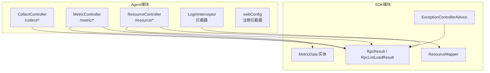
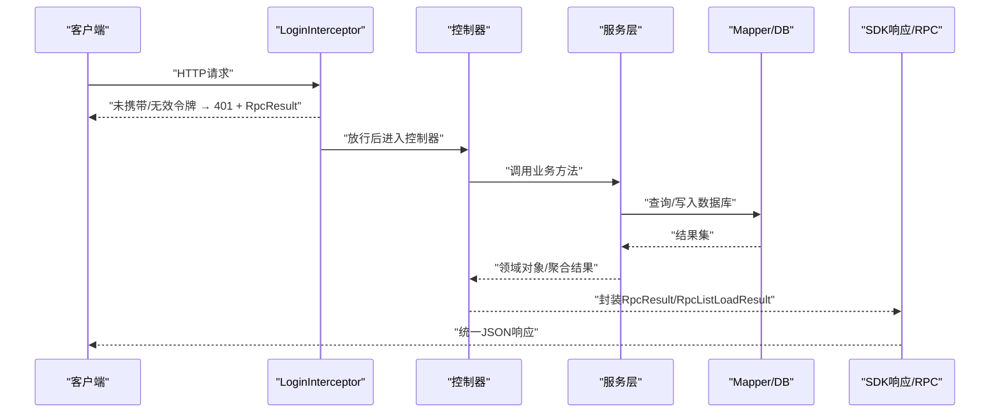
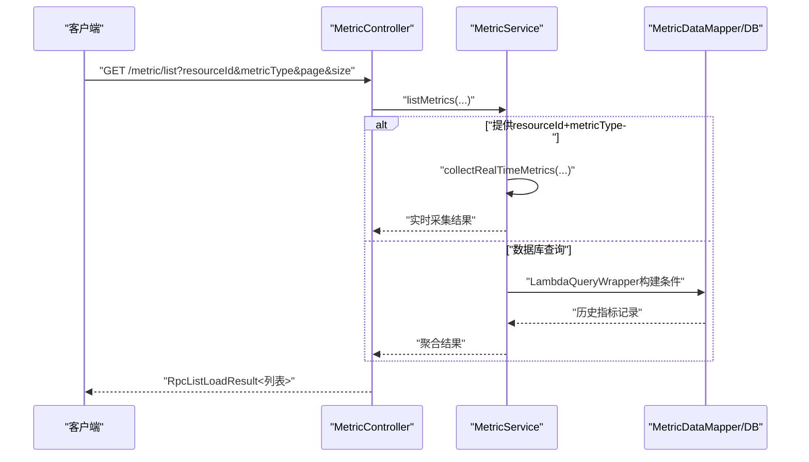
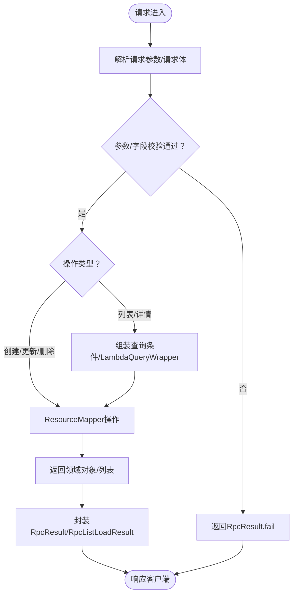
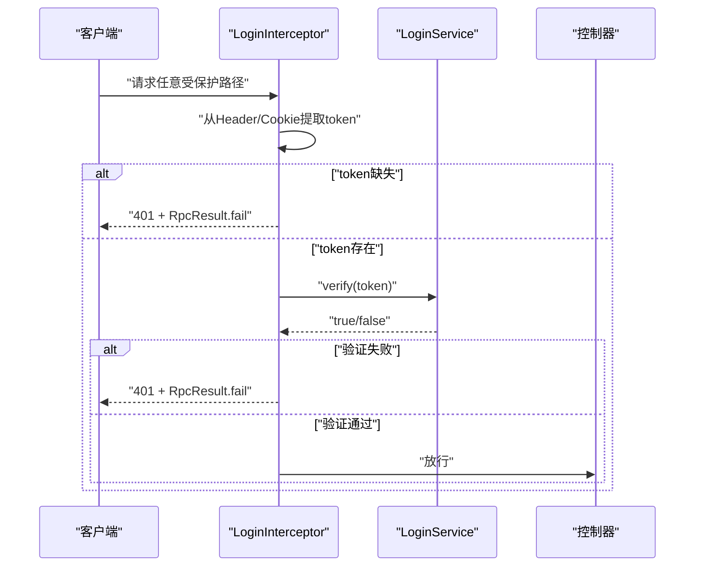
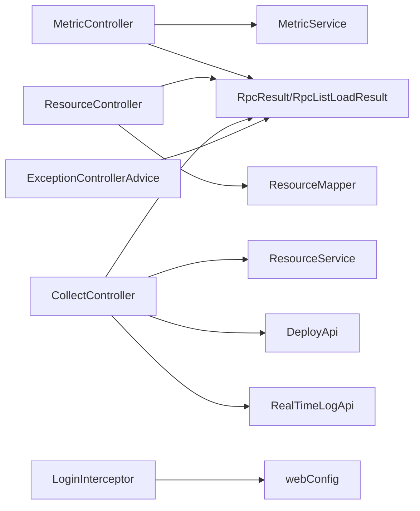

# HTTP接口控制器

<cite>
**本文引用的文件**
- [CollectController.java](file://watcher-agent/src/main/java/com/virtual/cloud/om/agent/controller/CollectController.java)
- [MetricController.java](file://watcher-agent/src/main/java/com/virtual/cloud/om/agent/controller/MetricController.java)
- [ResourceController.java](file://watcher-agent/src/main/java/com/virtual/cloud/om/agent/controller/ResourceController.java)
- [LoginInterceptor.java](file://watcher-agent/src/main/java/com/virtual/cloud/om/agent/config/LoginInterceptor.java)
- [webConfig.java](file://watcher-agent/src/main/java/com/virtual/cloud/om/agent/filter/webConfig.java)
- [RpcResult.java](file://watcher-sdk/src/main/java/com/virtual/cloud/om/sdk/dto/RpcResult.java)
- [RpcListLoadResult.java](file://watcher-sdk/src/main/java/com/virtual/cloud/om/sdk/dto/RpcListLoadResult.java)
- [ExceptionControllerAdvice.java](file://watcher-sdk/src/main/java/com/virtual/cloud/om/sdk/exception/ExceptionControllerAdvice.java)
- [MetricService.java](file://watcher-agent/src/main/java/com/virtual/cloud/om/agent/service/report/MetricService.java)
- [ResourceService.java](file://watcher-agent/src/main/java/com/virtual/cloud/om/agent/service/resource/ResourceService.java)
- [MetricData.java](file://watcher-sdk/src/main/java/com/virtual/cloud/om/sdk/entity/mysql/MetricData.java)
- [ResourceMapper.java](file://watcher-sdk/src/main/java/com/virtual/cloud/om/sdk/mapper/ResourceMapper.java)
</cite>

## 目录
1. [简介](#简介)
2. [项目结构](#项目结构)
3. [核心组件](#核心组件)
4. [架构总览](#架构总览)
5. [详细组件分析](#详细组件分析)
6. [依赖分析](#依赖分析)
7. [性能考量](#性能考量)
8. [故障排查指南](#故障排查指南)
9. [结论](#结论)
10. [附录](#附录)

## 简介
本文件面向HTTP接口控制器子系统，聚焦以下控制器与配套能力：
- CollectController：采集类接口，负责实时日志策略下发、资源同步与批量部署等。
- MetricController：指标查询接口，支持类型枚举、平台枚举、列表查询、最新指标、趋势查询、指标上报与资源指标汇总。
- ResourceController：资源管理接口，支持资源列表、详情、创建、批量创建、更新、删除以及状态变更（可用性、远程SSH权限）。

同时，文档覆盖：
- 安全认证机制（基于拦截器的令牌校验与放行规则）
- 错误处理与异常响应格式（统一RpcResult/RpcListLoadResult）
- 性能优化策略（分页、查询条件裁剪、服务层聚合）
- 使用示例与集成指南（端点、参数、响应格式）

## 项目结构
控制器位于Agent模块，统一通过@RestController暴露REST接口；响应体采用SDK提供的统一RPC封装；全局异常由SDK的ControllerAdvice统一处理；安全拦截在Agent模块配置。

图表来源
- [CollectController.java:27-66](file://watcher-agent/src/main/java/com/virtual/cloud/om/agent/controller/CollectController.java#L27-L66)
- [MetricController.java:19-102](file://watcher-agent/src/main/java/com/virtual/cloud/om/agent/controller/MetricController.java#L19-L102)
- [ResourceController.java:24-234](file://watcher-agent/src/main/java/com/virtual/cloud/om/agent/controller/ResourceController.java#L24-L234)
- [LoginInterceptor.java:29-99](file://watcher-agent/src/main/java/com/virtual/cloud/om/agent/config/LoginInterceptor.java#L29-L99)
- [webConfig.java:12-37](file://watcher-agent/src/main/java/com/virtual/cloud/om/agent/filter/webConfig.java#L12-L37)
- [RpcResult.java:3-87](file://watcher-sdk/src/main/java/com/virtual/cloud/om/sdk/dto/RpcResult.java#L3-L87)
- [RpcListLoadResult.java:10-56](file://watcher-sdk/src/main/java/com/virtual/cloud/om/sdk/dto/RpcListLoadResult.java#L10-L56)
- [ExceptionControllerAdvice.java:25-95](file://watcher-sdk/src/main/java/com/virtual/cloud/om/sdk/exception/ExceptionControllerAdvice.java#L25-L95)
- [MetricData.java:14-42](file://watcher-sdk/src/main/java/com/virtual/cloud/om/sdk/entity/mysql/MetricData.java#L14-L42)
- [ResourceMapper.java:10-13](file://watcher-sdk/src/main/java/com/virtual/cloud/om/sdk/mapper/ResourceMapper.java#L10-L13)

章节来源
- [CollectController.java:27-66](file://watcher-agent/src/main/java/com/virtual/cloud/om/agent/controller/CollectController.java#L27-L66)
- [MetricController.java:19-102](file://watcher-agent/src/main/java/com/virtual/cloud/om/agent/controller/MetricController.java#L19-L102)
- [ResourceController.java:24-234](file://watcher-agent/src/main/java/com/virtual/cloud/om/agent/controller/ResourceController.java#L24-L234)
- [webConfig.java:12-37](file://watcher-agent/src/main/java/com/virtual/cloud/om/agent/filter/webConfig.java#L12-L37)

## 核心组件
- CollectController：提供实时日志策略下发、资源同步、批量部署等接口，内部委托至对应服务或SDK API。
- MetricController：提供指标类型/平台枚举、指标列表查询（支持分页与条件过滤）、最新指标、趋势、上报与汇总。
- ResourceController：提供资源CRUD与状态更新，含加密字段处理与幂等插入/更新。
- 登录拦截器与Web配置：统一从请求头或Cookie读取令牌，对特定路径放行。
- SDK统一响应体：RpcResult用于单对象/状态返回，RpcListLoadResult用于分页列表返回。
- 全局异常处理：统一捕获参数校验、非法状态、空指针等异常，映射到标准错误码与消息。

章节来源
- [CollectController.java:45-65](file://watcher-agent/src/main/java/com/virtual/cloud/om/agent/controller/CollectController.java#L45-L65)
- [MetricController.java:29-101](file://watcher-agent/src/main/java/com/virtual/cloud/om/agent/controller/MetricController.java#L29-L101)
- [ResourceController.java:34-233](file://watcher-agent/src/main/java/com/virtual/cloud/om/agent/controller/ResourceController.java#L34-L233)
- [LoginInterceptor.java:36-72](file://watcher-agent/src/main/java/com/virtual/cloud/om/agent/config/LoginInterceptor.java#L36-L72)
- [webConfig.java:19-36](file://watcher-agent/src/main/java/com/virtual/cloud/om/agent/filter/webConfig.java#L19-L36)
- [RpcResult.java:15-45](file://watcher-sdk/src/main/java/com/virtual/cloud/om/sdk/dto/RpcResult.java#L15-L45)
- [RpcListLoadResult.java:40-46](file://watcher-sdk/src/main/java/com/virtual/cloud/om/sdk/dto/RpcListLoadResult.java#L40-L46)
- [ExceptionControllerAdvice.java:35-87](file://watcher-sdk/src/main/java/com/virtual/cloud/om/sdk/exception/ExceptionControllerAdvice.java#L35-L87)

## 架构总览
下图展示控制器、服务层、SDK响应与拦截器的整体交互：

图表来源
- [LoginInterceptor.java:36-72](file://watcher-agent/src/main/java/com/virtual/cloud/om/agent/config/LoginInterceptor.java#L36-L72)
- [MetricController.java:41-57](file://watcher-agent/src/main/java/com/virtual/cloud/om/agent/controller/MetricController.java#L41-L57)
- [ResourceController.java:34-54](file://watcher-agent/src/main/java/com/virtual/cloud/om/agent/controller/ResourceController.java#L34-L54)
- [CollectController.java:47-65](file://watcher-agent/src/main/java/com/virtual/cloud/om/agent/controller/CollectController.java#L47-L65)
- [RpcResult.java:15-45](file://watcher-sdk/src/main/java/com/virtual/cloud/om/sdk/dto/RpcResult.java#L15-L45)
- [RpcListLoadResult.java:40-46](file://watcher-sdk/src/main/java/com/virtual/cloud/om/sdk/dto/RpcListLoadResult.java#L40-L46)

## 详细组件分析

### CollectController：采集接口
- 接口概览
  - POST /collect/realtime-log：接收实时日志策略请求列表，调用SDK RealTimeLogApi处理，返回统一成功响应。
  - POST /collect/resources：接收资源DTO列表，委托ResourceService进行资源同步，返回统一成功响应。
  - POST /collect/batch：接收批量部署参数，设置掩码后调用DeployApi执行部署，返回统一成功响应。
- 参数与响应
  - 请求体为JSON数组或对象，具体见各方法签名与SDK DTO。
  - 成功统一返回RpcResult.success，失败由上层异常处理或显式分支返回错误。
- 设计要点
  - 控制器仅做编排与参数透传，核心业务逻辑下沉至服务层或SDK API。
  - 便于扩展新的采集场景，只需新增端点并接入相应服务。

章节来源
- [CollectController.java:45-65](file://watcher-agent/src/main/java/com/virtual/cloud/om/agent/controller/CollectController.java#L45-L65)

### MetricController：指标查询与上报
- 接口概览
  - GET /metric/types：返回支持的指标类型列表（code/name/desc/static）。
  - GET /metric/platforms：返回支持的平台类型列表（code/name）。
  - GET /metric/list：指标列表查询，支持按resourceId、platform、metricType、startTime、endTime过滤，分页page/size。
  - GET /metric/latest/{resourceId}：查询资源最新指标集合。
  - GET /metric/trend/{resourceId}/{metricType}：查询指标趋势，小时数hours默认1。
  - POST /metric/report：上报指标数据列表，入库并返回统一结果。
  - GET /metric/summary/{resourceId}：返回资源指标汇总（总数、最近上报时间等）。
- 参数与响应
  - 列表查询使用@RequestParam，分页参数默认值明确；列表返回RpcListLoadResult。
  - 其余接口返回RpcResult，data可为列表或对象。
- 服务层逻辑要点
  - 当提供resourceId与metricType时，走实时采集流程；否则走数据库查询。
  - 最新指标与趋势分别按资源与类型聚合查询。
  - 上报时自动补全主键、创建/上报时间等字段。

图表来源
- [MetricController.java:41-57](file://watcher-agent/src/main/java/com/virtual/cloud/om/agent/controller/MetricController.java#L41-L57)
- [MetricService.java:70-113](file://watcher-agent/src/main/java/com/virtual/cloud/om/agent/service/report/MetricService.java#L70-L113)
- [MetricService.java:118-158](file://watcher-agent/src/main/java/com/virtual/cloud/om/agent/service/report/MetricService.java#L118-L158)

章节来源
- [MetricController.java:29-101](file://watcher-agent/src/main/java/com/virtual/cloud/om/agent/controller/MetricController.java#L29-L101)
- [MetricService.java:32-81](file://watcher-agent/src/main/java/com/virtual/cloud/om/agent/service/report/MetricService.java#L32-L81)
- [MetricService.java:159-207](file://watcher-agent/src/main/java/com/virtual/cloud/om/agent/service/report/MetricService.java#L159-L207)
- [MetricService.java:209-226](file://watcher-agent/src/main/java/com/virtual/cloud/om/agent/service/report/MetricService.java#L209-L226)
- [MetricService.java:235-264](file://watcher-agent/src/main/java/com/virtual/cloud/om/agent/service/report/MetricService.java#L235-L264)
- [MetricData.java:14-42](file://watcher-sdk/src/main/java/com/virtual/cloud/om/sdk/entity/mysql/MetricData.java#L14-L42)

### ResourceController：资源管理
- 接口概览
  - GET /resource/list：按platform、resourceName、ipAddress过滤，分页返回。
  - GET /resource/detail/{id}：查询资源详情，不存在返回错误。
  - POST /resource/create：创建资源，自动填充默认值与加密字段，返回统一结果。
  - POST /resource/batchCreate：批量创建/更新，幂等处理。
  - PUT /resource/update：按DTO更新字段，存在性校验。
  - DELETE /resource/delete/{id}：删除资源。
  - PUT /resource/usable/{id}：更新可用状态usable。
  - PUT /resource/remote/{id}：更新远程SSH权限remote，并维护结束时间。
- 参数与响应
  - 列表查询使用@RequestParam，分页默认page=0,size=10。
  - 创建/更新/删除均返回RpcResult，data为Void。
- 安全与一致性
  - 密码等敏感字段通过SM4工具进行加解密存储。
  - 批量创建/更新采用“存在即更新，不存在即插入”的幂等策略。

图表来源
- [ResourceController.java:34-233](file://watcher-agent/src/main/java/com/virtual/cloud/om/agent/controller/ResourceController.java#L34-L233)
- [ResourceMapper.java:10-13](file://watcher-sdk/src/main/java/com/virtual/cloud/om/sdk/mapper/ResourceMapper.java#L10-L13)

章节来源
- [ResourceController.java:34-233](file://watcher-agent/src/main/java/com/virtual/cloud/om/agent/controller/ResourceController.java#L34-L233)
- [ResourceMapper.java:10-13](file://watcher-sdk/src/main/java/com/virtual/cloud/om/sdk/mapper/ResourceMapper.java#L10-L13)

### 安全认证与权限控制
- 认证机制
  - 拦截器优先从请求头读取token，若无则尝试从Cookie中读取名为常量TOKEN_NAME的令牌。
  - 若未携带有效token，返回401状态与RpcResult封装的错误信息。
  - 放行路径包括登录、Swagger、部分采集与日志相关端点、部署刷新等。
- 权限控制
  - 当前拦截器未对具体资源/角色进行细粒度鉴权，仅做令牌有效性校验。
  - 如需细化权限，可在拦截器中扩展角色/资源访问控制逻辑。

图表来源
- [LoginInterceptor.java:36-72](file://watcher-agent/src/main/java/com/virtual/cloud/om/agent/config/LoginInterceptor.java#L36-L72)
- [webConfig.java:19-36](file://watcher-agent/src/main/java/com/virtual/cloud/om/agent/filter/webConfig.java#L19-L36)

章节来源
- [LoginInterceptor.java:36-72](file://watcher-agent/src/main/java/com/virtual/cloud/om/agent/config/LoginInterceptor.java#L36-L72)
- [webConfig.java:19-36](file://watcher-agent/src/main/java/com/virtual/cloud/om/agent/filter/webConfig.java#L19-L36)

### 错误处理与异常响应格式
- 统一响应体
  - RpcResult：通用成功/失败/部分成功/错误封装，支持泛型data。
  - RpcListLoadResult：分页列表封装，继承自StateResult。
- 全局异常处理
  - 参数校验失败：返回RpcResult.fail并携带错误码与消息。
  - 非法状态、空指针：统一转为FAILURE状态与对应错误码。
  - 未知异常：返回UNKNOWN_ERROR并国际化消息。
- 控制器内异常
  - 指标查询/上报等接口在捕获异常时返回RpcResult.fail，避免泄露内部异常细节。

章节来源
- [RpcResult.java:15-45](file://watcher-sdk/src/main/java/com/virtual/cloud/om/sdk/dto/RpcResult.java#L15-L45)
- [RpcListLoadResult.java:40-46](file://watcher-sdk/src/main/java/com/virtual/cloud/om/sdk/dto/RpcListLoadResult.java#L40-L46)
- [ExceptionControllerAdvice.java:35-87](file://watcher-sdk/src/main/java/com/virtual/cloud/om/sdk/exception/ExceptionControllerAdvice.java#L35-L87)
- [MetricController.java:82-91](file://watcher-agent/src/main/java/com/virtual/cloud/om/agent/controller/MetricController.java#L82-L91)

## 依赖分析
- 控制器与服务层
  - MetricController依赖MetricService；ResourceController依赖ResourceMapper；CollectController依赖ResourceService/DeployApi/RealTimeLogApi。
- 响应与异常
  - 所有控制器返回统一RpcResult/RpcListLoadResult；异常由ExceptionControllerAdvice集中处理。
- 安全
  - LoginInterceptor在webConfig中注册为全局拦截器，对/**生效，放行指定路径。

图表来源
- [MetricController.java:26-27](file://watcher-agent/src/main/java/com/virtual/cloud/om/agent/controller/MetricController.java#L26-L27)
- [ResourceController.java:31-32](file://watcher-agent/src/main/java/com/virtual/cloud/om/agent/controller/ResourceController.java#L31-L32)
- [CollectController.java:32-39](file://watcher-agent/src/main/java/com/virtual/cloud/om/agent/controller/CollectController.java#L32-L39)
- [LoginInterceptor.java:31-32](file://watcher-agent/src/main/java/com/virtual/cloud/om/agent/config/LoginInterceptor.java#L31-L32)
- [webConfig.java:14-17](file://watcher-agent/src/main/java/com/virtual/cloud/om/agent/filter/webConfig.java#L14-L17)
- [RpcResult.java:3-87](file://watcher-sdk/src/main/java/com/virtual/cloud/om/sdk/dto/RpcResult.java#L3-L87)
- [RpcListLoadResult.java:10-56](file://watcher-sdk/src/main/java/com/virtual/cloud/om/sdk/dto/RpcListLoadResult.java#L10-L56)
- [ExceptionControllerAdvice.java:25-95](file://watcher-sdk/src/main/java/com/virtual/cloud/om/sdk/exception/ExceptionControllerAdvice.java#L25-L95)

章节来源
- [MetricController.java:26-27](file://watcher-agent/src/main/java/com/virtual/cloud/om/agent/controller/MetricController.java#L26-L27)
- [ResourceController.java:31-32](file://watcher-agent/src/main/java/com/virtual/cloud/om/agent/controller/ResourceController.java#L31-L32)
- [CollectController.java:32-39](file://watcher-agent/src/main/java/com/virtual/cloud/om/agent/controller/CollectController.java#L32-L39)
- [webConfig.java:14-17](file://watcher-agent/src/main/java/com/virtual/cloud/om/agent/filter/webConfig.java#L14-L17)

## 性能考量
- 分页与查询裁剪
  - 列表接口提供page/size参数，默认合理限制（如MetricController默认size=100），建议客户端按需设置，避免一次性拉取过多数据。
  - 查询条件尽量提供resourceId、metricType等关键字段以减少全表扫描。
- 实时采集与数据库回退
  - 当提供resourceId+metricType时走实时采集，否则回退到数据库查询；建议在高频查询场景下结合缓存策略（如热点指标缓存）降低重复计算。
- 写入优化
  - 指标上报时批量入库，减少事务开销；字段补全在服务层完成，避免控制器重复逻辑。
- 加密与IO
  - 敏感字段加解密在服务层完成，注意CPU开销；建议在批量导入时合并加密批次。

[本节为通用性能建议，不直接分析具体文件]

## 故障排查指南
- 401未授权
  - 检查请求头是否携带token，或Cookie中是否存在常量TOKEN_NAME；确认LoginInterceptor放行路径是否覆盖当前端点。
- 参数校验失败
  - 关注ExceptionControllerAdvice对参数校验异常的处理，查看返回的错误码与消息，修正请求参数。
- 资源不存在
  - ResourceController在查询详情或更新状态时，若资源不存在会返回失败；请确认resourceId是否正确。
- 指标上报失败
  - MetricController在上报异常时会返回失败；检查请求体格式与服务端日志定位问题。

章节来源
- [LoginInterceptor.java:36-72](file://watcher-agent/src/main/java/com/virtual/cloud/om/agent/config/LoginInterceptor.java#L36-L72)
- [ExceptionControllerAdvice.java:35-87](file://watcher-sdk/src/main/java/com/virtual/cloud/om/sdk/exception/ExceptionControllerAdvice.java#L35-L87)
- [ResourceController.java:58-64](file://watcher-agent/src/main/java/com/virtual/cloud/om/agent/controller/ResourceController.java#L58-L64)
- [MetricController.java:82-91](file://watcher-agent/src/main/java/com/virtual/cloud/om/agent/controller/MetricController.java#L82-L91)

## 结论
本子系统通过清晰的REST接口划分、统一的响应封装与拦截器认证机制，提供了采集、指标查询与资源管理的核心能力。配合服务层的数据聚合与异常处理，整体具备良好的可维护性与扩展性。建议在生产环境中结合缓存与限流策略进一步提升性能与稳定性。

[本节为总结性内容，不直接分析具体文件]

## 附录

### API使用示例与集成指南
- 采集接口
  - 实时日志策略下发：POST /collect/realtime-log，请求体为策略列表，返回RpcResult.success。
  - 资源同步：POST /collect/resources，请求体为资源DTO列表，返回RpcResult.success。
  - 批量部署：POST /collect/batch，请求体为部署参数，返回RpcResult.success。
- 指标接口
  - 获取指标类型：GET /metric/types
  - 获取平台类型：GET /metric/platforms
  - 列表查询：GET /metric/list?resourceId=&platform=&metricType=&startTime=&endTime=&page=&size=
  - 最新指标：GET /metric/latest/{resourceId}
  - 趋势查询：GET /metric/trend/{resourceId}/{metricType}?hours=1
  - 上报指标：POST /metric/report，请求体为指标数据列表
  - 资源指标汇总：GET /metric/summary/{resourceId}
- 资源接口
  - 列表：GET /resource/list?platform=&resourceName=&ipAddress=&page=&size=
  - 详情：GET /resource/detail/{id}
  - 创建：POST /resource/create，请求体为ResourceDTO
  - 批量创建：POST /resource/batchCreate，请求体为ResourceDTO[]
  - 更新：PUT /resource/update，请求体为ResourceDTO
  - 删除：DELETE /resource/delete/{id}
  - 更新可用状态：PUT /resource/usable/{id}?usable=1
  - 更新远程SSH权限：PUT /resource/remote/{id}?remote=1

章节来源
- [CollectController.java:45-65](file://watcher-agent/src/main/java/com/virtual/cloud/om/agent/controller/CollectController.java#L45-L65)
- [MetricController.java:29-101](file://watcher-agent/src/main/java/com/virtual/cloud/om/agent/controller/MetricController.java#L29-L101)
- [ResourceController.java:34-233](file://watcher-agent/src/main/java/com/virtual/cloud/om/agent/controller/ResourceController.java#L34-L233)