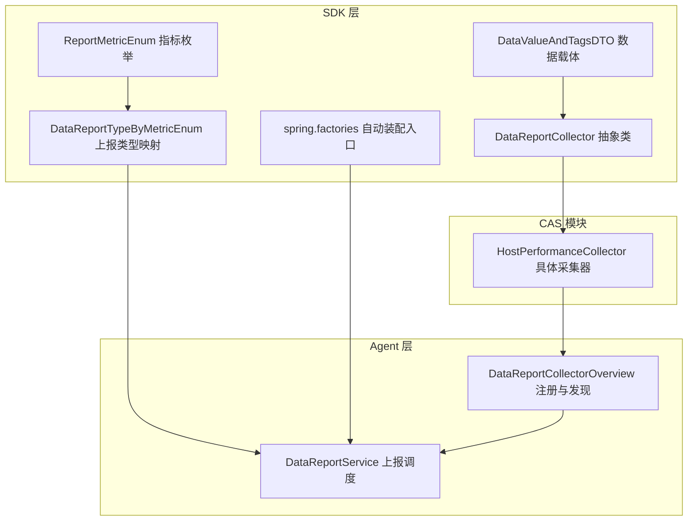
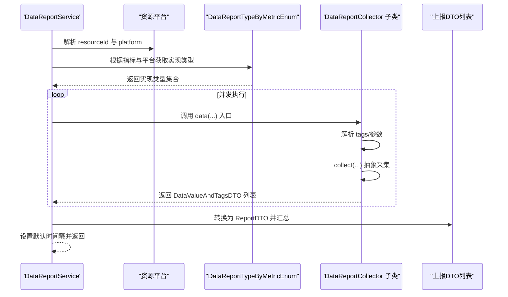
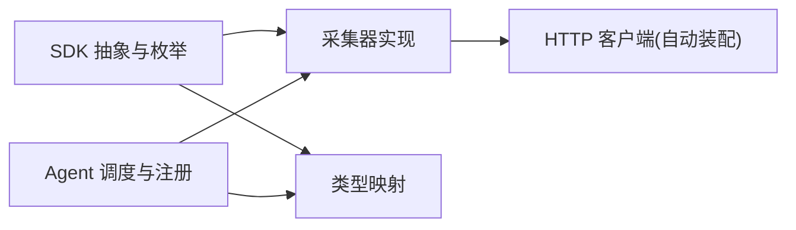
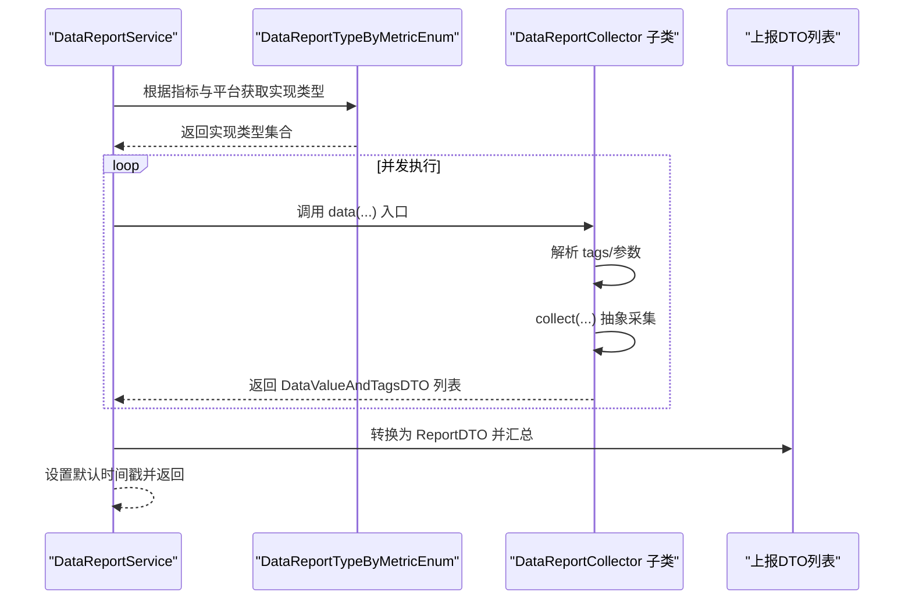

# 扩展开发指南

<cite>
**本文引用的文件**
- [DataReportCollector.java](file://watcher-sdk/src/main/java/com/virtual/cloud/om/sdk/api/DataReportCollector.java)
- [HostPerformanceCollector.java](file://watcher-cas/src/main/java/com/virtual/cloud/om/cas/service/report/HostPerformanceCollector.java)
- [ReportMetricEnum.java](file://watcher-sdk/src/main/java/com/virtual/cloud/om/sdk/constant/report/ReportMetricEnum.java)
- [DataReportTypeByMetricEnum.java](file://watcher-sdk/src/main/java/com/virtual/cloud/om/sdk/constant/DataReportTypeByMetricEnum.java)
- [DataReportService.java](file://watcher-agent/src/main/java/com/virtual/cloud/om/agent/service/report/DataReportService.java)
- [DataReportCollectorOverview.java](file://watcher-agent/src/main/java/com/virtual/cloud/om/agent/service/DataReportCollectorOverview.java)
- [spring.factories](file://watcher-sdk/src/main/resources/META-INF/spring.factories)
- [DataValueAndTagsDTO.java](file://watcher-sdk/src/main/java/com/virtual/cloud/om/sdk/dto/dataReport/DataValueAndTagsDTO.java)
</cite>

## 目录
1. [简介](#简介)
2. [项目结构](#项目结构)
3. [核心组件](#核心组件)
4. [架构总览](#架构总览)
5. [详细组件分析](#详细组件分析)
6. [依赖分析](#依赖分析)
7. [性能考虑](#性能考虑)
8. [故障排查指南](#故障排查指南)
9. [结论](#结论)
10. [附录](#附录)

## 简介
本指南面向需要为数据采集架构扩展开发新采集器的工程师，目标是帮助你快速、正确地实现符合规范的数据采集器，并将其无缝接入现有的采集与上报体系。内容涵盖：
- 实现 DataReportCollector 接口的步骤与模板
- 采集器注册与配置机制（Spring 容器自动装配与依赖注入）
- 指标枚举 ReportMetricEnum 的扩展方法与采集逻辑配置
- 开发最佳实践（性能、错误处理、日志）
- 测试策略与调试技巧（单元测试与集成测试）
- 部署与监控运维建议
- 参考实现：CAS 模块 HostPerformanceCollector 的开发模式

## 项目结构
围绕采集器扩展，涉及以下关键模块与文件：
- SDK 层：定义采集器抽象、指标枚举、上报类型映射、通用 DTO 与 Spring 自动装配入口
- CAS 模块：提供具体采集器实现示例
- Agent 层：负责采集器实例的注册、调度与并发上报

图表来源
- [DataReportCollector.java:1-118](file://watcher-sdk/src/main/java/com/virtual/cloud/om/sdk/api/DataReportCollector.java#L1-L118)
- [ReportMetricEnum.java:1-118](file://watcher-sdk/src/main/java/com/virtual/cloud/om/sdk/constant/report/ReportMetricEnum.java#L1-L118)
- [DataReportTypeByMetricEnum.java:1-190](file://watcher-sdk/src/main/java/com/virtual/cloud/om/sdk/constant/DataReportTypeByMetricEnum.java#L1-L190)
- [DataValueAndTagsDTO.java:1-17](file://watcher-sdk/src/main/java/com/virtual/cloud/om/sdk/dto/dataReport/DataValueAndTagsDTO.java#L1-L17)
- [spring.factories:1-10](file://watcher-sdk/src/main/resources/META-INF/spring.factories#L1-L10)
- [HostPerformanceCollector.java:1-68](file://watcher-cas/src/main/java/com/virtual/cloud/om/cas/service/report/HostPerformanceCollector.java#L1-L68)
- [DataReportService.java:1-200](file://watcher-agent/src/main/java/com/virtual/cloud/om/agent/service/report/DataReportService.java#L1-L200)
- [DataReportCollectorOverview.java:1-45](file://watcher-agent/src/main/java/com/virtual/cloud/om/agent/service/DataReportCollectorOverview.java#L1-L45)

章节来源
- [DataReportCollector.java:1-118](file://watcher-sdk/src/main/java/com/virtual/cloud/om/sdk/api/DataReportCollector.java#L1-L118)
- [ReportMetricEnum.java:1-118](file://watcher-sdk/src/main/java/com/virtual/cloud/om/sdk/constant/report/ReportMetricEnum.java#L1-L118)
- [DataReportTypeByMetricEnum.java:1-190](file://watcher-sdk/src/main/java/com/virtual/cloud/om/sdk/constant/DataReportTypeByMetricEnum.java#L1-L190)
- [DataValueAndTagsDTO.java:1-17](file://watcher-sdk/src/main/java/com/virtual/cloud/om/sdk/dto/dataReport/DataValueAndTagsDTO.java#L1-L17)
- [spring.factories:1-10](file://watcher-sdk/src/main/resources/META-INF/spring.factories#L1-L10)
- [HostPerformanceCollector.java:1-68](file://watcher-cas/src/main/java/com/virtual/cloud/om/cas/service/report/HostPerformanceCollector.java#L1-L68)
- [DataReportService.java:1-200](file://watcher-agent/src/main/java/com/virtual/cloud/om/agent/service/report/DataReportService.java#L1-L200)
- [DataReportCollectorOverview.java:1-45](file://watcher-agent/src/main/java/com/virtual/cloud/om/agent/service/DataReportCollectorOverview.java#L1-L45)

## 核心组件
- DataReportCollector 抽象类：定义采集器骨架，封装采集流程、日志与时间戳处理，暴露 metric 与 valueType 两个抽象方法供子类实现；提供 data(...) 统一入口，将采集结果转换为上报 DTO 列表。
- ReportMetricEnum：定义所有可采集的指标类型，包含描述与是否静态指标标记。
- DataReportTypeByMetricEnum：建立指标与资源平台之间的映射关系，支持按平台或分隔维度（如 host/domain/cluster）选择具体实现。
- DataValueAndTagsDTO：承载单条采集数据的值、标签与时间戳。
- HostPerformanceCollector：CAS 模块中基于 DataReportCollector 的具体实现，展示如何解析 tags、调用远端接口并返回空结果（用于演示扩展模式）。
- DataReportService：Agent 层的采集调度与并发上报核心，负责根据指标与平台选择采集器、并发执行并汇总结果。
- DataReportCollectorOverview：在应用启动时扫描并注册所有 DataReportCollector 实例，建立 metric 到采集器的映射。

章节来源
- [DataReportCollector.java:1-118](file://watcher-sdk/src/main/java/com/virtual/cloud/om/sdk/api/DataReportCollector.java#L1-L118)
- [ReportMetricEnum.java:1-118](file://watcher-sdk/src/main/java/com/virtual/cloud/om/sdk/constant/report/ReportMetricEnum.java#L1-L118)
- [DataReportTypeByMetricEnum.java:1-190](file://watcher-sdk/src/main/java/com/virtual/cloud/om/sdk/constant/DataReportTypeByMetricEnum.java#L1-L190)
- [DataValueAndTagsDTO.java:1-17](file://watcher-sdk/src/main/java/com/virtual/cloud/om/sdk/dto/dataReport/DataValueAndTagsDTO.java#L1-L17)
- [HostPerformanceCollector.java:1-68](file://watcher-cas/src/main/java/com/virtual/cloud/om/cas/service/report/HostPerformanceCollector.java#L1-L68)
- [DataReportService.java:1-200](file://watcher-agent/src/main/java/com/virtual/cloud/om/agent/service/report/DataReportService.java#L1-L200)
- [DataReportCollectorOverview.java:1-45](file://watcher-agent/src/main/java/com/virtual/cloud/om/agent/service/DataReportCollectorOverview.java#L1-L45)

## 架构总览
采集器从“策略下发”到“数据上报”的整体流程如下：

图表来源
- [DataReportService.java:163-201](file://watcher-agent/src/main/java/com/virtual/cloud/om/agent/service/report/DataReportService.java#L163-L201)
- [DataReportTypeByMetricEnum.java:177-186](file://watcher-sdk/src/main/java/com/virtual/cloud/om/sdk/constant/DataReportTypeByMetricEnum.java#L177-L186)
- [DataReportCollector.java:48-86](file://watcher-sdk/src/main/java/com/virtual/cloud/om/sdk/api/DataReportCollector.java#L48-L86)

章节来源
- [DataReportService.java:163-201](file://watcher-agent/src/main/java/com/virtual/cloud/om/agent/service/report/DataReportService.java#L163-L201)
- [DataReportTypeByMetricEnum.java:177-186](file://watcher-sdk/src/main/java/com/virtual/cloud/om/sdk/constant/DataReportTypeByMetricEnum.java#L177-L186)
- [DataReportCollector.java:48-86](file://watcher-sdk/src/main/java/com/virtual/cloud/om/sdk/api/DataReportCollector.java#L48-L86)

## 详细组件分析

### 实现 DataReportCollector 的步骤与模板
- 步骤概览
  1) 新建类继承 DataReportCollector，并标注为 Spring 组件（如 @Service）。
  2) 在构造函数中注入所需的远程连接或工具（如 CAS 的 REST 客户端）。
  3) 实现 metric()：返回该采集器对应的指标枚举项。
  4) 实现 valueType()：返回上报值类型（如 json、number、string 等）。
  5) 实现 collect(...)：从远端获取原始数据，组装为 DataValueAndTagsDTO 列表；若无数据则返回空列表。
  6) 使用 getId(...) 解析 tags 中的目标 ID（如 hostIds），并在异常时抛出业务异常以便上层统一处理。
  7) 保持线程安全与幂等性，避免副作用；必要时进行超时控制与重试策略。

- 代码模板路径
  - 抽象类骨架与入口：[DataReportCollector.java:1-118](file://watcher-sdk/src/main/java/com/virtual/cloud/om/sdk/api/DataReportCollector.java#L1-L118)
  - 数据载体 DTO：[DataValueAndTagsDTO.java:1-17](file://watcher-sdk/src/main/java/com/virtual/cloud/om/sdk/dto/dataReport/DataValueAndTagsDTO.java#L1-L17)
  - 参考实现（CAS）：[HostPerformanceCollector.java:1-68](file://watcher-cas/src/main/java/com/virtual/cloud/om/cas/service/report/HostPerformanceCollector.java#L1-L68)

- 关键点说明
  - data(...) 方法已内置日志、耗时统计、空值兜底与时间戳填充逻辑，子类无需重复实现。
  - collect(...) 是纯采集逻辑，应尽量无状态、可重入。
  - metric() 与 valueType() 必须与 ReportMetricEnum 和 ReportDataTypeEnum 对齐。

章节来源
- [DataReportCollector.java:1-118](file://watcher-sdk/src/main/java/com/virtual/cloud/om/sdk/api/DataReportCollector.java#L1-L118)
- [DataValueAndTagsDTO.java:1-17](file://watcher-sdk/src/main/java/com/virtual/cloud/om/sdk/dto/dataReport/DataValueAndTagsDTO.java#L1-L17)
- [HostPerformanceCollector.java:1-68](file://watcher-cas/src/main/java/com/virtual/cloud/om/cas/service/report/HostPerformanceCollector.java#L1-L68)

### 采集器注册与配置机制（Spring 自动装配与依赖注入）
- 自动装配入口
  - SDK 提供 spring.factories，声明若干 RestTemplate 与 Token 客户端的自动配置类，确保采集器运行时具备 HTTP 客户端能力。
  - 参考：[spring.factories:1-10](file://watcher-sdk/src/main/resources/META-INF/spring.factories#L1-L10)

- 采集器注册与发现
  - Agent 启动时通过 ApplicationRunner 扫描所有 DataReportCollector 实例，构建 metric 到采集器的映射表。
  - 参考：[DataReportCollectorOverview.java:1-45](file://watcher-agent/src/main/java/com/virtual/cloud/om/agent/service/DataReportCollectorOverview.java#L1-L45)

- 依赖注入
  - 采集器实现类通过构造函数注入所需依赖（如 CAS REST 客户端），确保线程安全与可测试性。
  - 参考：[HostPerformanceCollector.java:33-33](file://watcher-cas/src/main/java/com/virtual/cloud/om/cas/service/report/HostPerformanceCollector.java#L33-L33)

- 上报调度
  - DataReportService 在运行期根据指标与平台选择实现类型，使用 CompletableFuture 并发执行，最终汇总为上报 DTO。
  - 参考：[DataReportService.java:163-201](file://watcher-agent/src/main/java/com/virtual/cloud/om/agent/service/report/DataReportService.java#L163-L201)

章节来源
- [spring.factories:1-10](file://watcher-sdk/src/main/resources/META-INF/spring.factories#L1-L10)
- [DataReportCollectorOverview.java:1-45](file://watcher-agent/src/main/java/com/virtual/cloud/om/agent/service/DataReportCollectorOverview.java#L1-L45)
- [HostPerformanceCollector.java:33-33](file://watcher-cas/src/main/java/com/virtual/cloud/om/cas/service/report/HostPerformanceCollector.java#L33-L33)
- [DataReportService.java:163-201](file://watcher-agent/src/main/java/com/virtual/cloud/om/agent/service/report/DataReportService.java#L163-L201)

### 指标枚举扩展与采集逻辑配置（ReportMetricEnum）
- 扩展步骤
  1) 在 ReportMetricEnum 中新增枚举常量，设置描述与是否静态指标标记。
  2) 在 DataReportTypeByMetricEnum 中为该指标配置适用的资源平台与分隔维度（host/domain/cluster/all），确保能被正确路由到具体实现。
  3) 若存在多个平台实现同一指标，需明确平台数组；若仅一个平台实现，可置空平台数组以简化匹配。
  4) 若需要按分隔维度拆分（如 host/domain/cluster），请设置 separate 字段并保证唯一性，否则将回退到全量匹配。

- 参考路径
  - 指标枚举定义：[ReportMetricEnum.java:1-118](file://watcher-sdk/src/main/java/com/virtual/cloud/om/sdk/constant/report/ReportMetricEnum.java#L1-L118)
  - 类型映射定义：[DataReportTypeByMetricEnum.java:1-190](file://watcher-sdk/src/main/java/com/virtual/cloud/om/sdk/constant/DataReportTypeByMetricEnum.java#L1-L190)

- 匹配逻辑
  - getTypesByMetricAndPlatform：按指标+平台精确匹配实现类型。
  - getTypesByMetricAndSeparate：按指标+分隔维度优先匹配唯一实现，否则回退到该指标的所有实现。
  - 参考：[DataReportTypeByMetricEnum.java:177-186](file://watcher-sdk/src/main/java/com/virtual/cloud/om/sdk/constant/DataReportTypeByMetricEnum.java#L177-L186)

章节来源
- [ReportMetricEnum.java:1-118](file://watcher-sdk/src/main/java/com/virtual/cloud/om/sdk/constant/report/ReportMetricEnum.java#L1-L118)
- [DataReportTypeByMetricEnum.java:1-190](file://watcher-sdk/src/main/java/com/virtual/cloud/om/sdk/constant/DataReportTypeByMetricEnum.java#L1-L190)
- [DataReportTypeByMetricEnum.java:177-186](file://watcher-sdk/src/main/java/com/virtual/cloud/om/sdk/constant/DataReportTypeByMetricEnum.java#L177-L186)

### 开发最佳实践
- 性能优化
  - 使用 CompletableFuture 并发执行多个实现类型，减少整体等待时间。
  - 控制线程上下文类加载器，避免 JAXB 等依赖在 ForkJoinPool 工作者线程中找不到实现。
  - 对远端请求设置合理超时与重试策略，避免阻塞主线程。
  - 参考：[DataReportService.java:188-201](file://watcher-agent/src/main/java/com/virtual/cloud/om/agent/service/report/DataReportService.java#L188-L201)

- 错误处理
  - 在采集器内部捕获远端异常并包装为业务异常，便于上层统一处理与告警。
  - 对空数据返回空列表，避免空指针传播。
  - 参考：[HostPerformanceCollector.java:47-50](file://watcher-cas/src/main/java/com/virtual/cloud/om/cas/service/report/HostPerformanceCollector.java#L47-L50)

- 日志记录
  - 使用统一入口日志记录开始/结束与耗时，便于问题定位。
  - 对关键分支（如空数据、异常）增加日志输出。
  - 参考：[DataReportCollector.java:52-60](file://watcher-sdk/src/main/java/com/virtual/cloud/om/sdk/api/DataReportCollector.java#L52-L60)

- 并发与线程安全
  - 避免在采集器内维护可变共享状态；使用不可变对象与无副作用函数。
  - 对外部依赖进行连接池化与超时控制。

章节来源
- [DataReportService.java:188-201](file://watcher-agent/src/main/java/com/virtual/cloud/om/agent/service/report/DataReportService.java#L188-L201)
- [HostPerformanceCollector.java:47-50](file://watcher-cas/src/main/java/com/virtual/cloud/om/cas/service/report/HostPerformanceCollector.java#L47-L50)
- [DataReportCollector.java:52-60](file://watcher-sdk/src/main/java/com/virtual/cloud/om/sdk/api/DataReportCollector.java#L52-L60)

### 测试策略与调试技巧
- 单元测试
  - 针对 collect(...) 方法：使用 Mockito 模拟远端客户端，传入不同 tags 与参数，断言返回的 DataValueAndTagsDTO 列表结构与内容。
  - 针对 metric()/valueType()：验证返回值与枚举定义一致。
  - 针对 getId(...)：构造多种 tags 场景，验证 ID 解析逻辑。
  - 参考：[DataReportCollector.java:27-39](file://watcher-sdk/src/main/java/com/virtual/cloud/om/sdk/api/DataReportCollector.java#L27-L39)

- 集成测试
  - 在 DataReportService 中构造真实指标与平台组合，验证并发执行与结果汇总。
  - 使用占位实现（返回空列表）验证调度链路与异常路径。
  - 参考：[DataReportService.java:163-201](file://watcher-agent/src/main/java/com/virtual/cloud/om/agent/service/report/DataReportService.java#L163-L201)

- 调试技巧
  - 打开采集器入口日志，观察开始/结束与耗时。
  - 在异常分支打印远端 URL 与错误消息，便于快速定位。
  - 使用最小化 tags 与 resourceId 进行复现，逐步扩大范围。
  - 参考：[DataReportCollector.java:52-60](file://watcher-sdk/src/main/java/com/virtual/cloud/om/sdk/api/DataReportCollector.java#L52-L60)，[HostPerformanceCollector.java:47-50](file://watcher-cas/src/main/java/com/virtual/cloud/om/cas/service/report/HostPerformanceCollector.java#L47-L50)

章节来源
- [DataReportCollector.java:27-39](file://watcher-sdk/src/main/java/com/virtual/cloud/om/sdk/api/DataReportCollector.java#L27-L39)
- [DataReportService.java:163-201](file://watcher-agent/src/main/java/com/virtual/cloud/om/agent/service/report/DataReportService.java#L163-L201)
- [HostPerformanceCollector.java:47-50](file://watcher-cas/src/main/java/com/virtual/cloud/om/cas/service/report/HostPerformanceCollector.java#L47-L50)

### 完整开发示例：CAS 模块 HostPerformanceCollector
- 实现要点
  - 继承 DataReportCollector，使用 @Service 注解。
  - 构造函数注入 CAS REST 客户端。
  - 从 tags 中解析 hostIds，拼接远端 URL 并发起 GET 请求。
  - 捕获异常并抛出业务异常，返回空列表作为兜底。
  - 实现 metric() 与 valueType()，分别指向 host_performance 与 json。
  - 参考：[HostPerformanceCollector.java:1-68](file://watcher-cas/src/main/java/com/virtual/cloud/om/cas/service/report/HostPerformanceCollector.java#L1-L68)

- 与 SDK 的对接
  - 通过 spring.factories 提供的自动配置，采集器可直接使用 RestTemplate 与 Token 客户端。
  - 参考：[spring.factories:1-10](file://watcher-sdk/src/main/resources/META-INF/spring.factories#L1-L10)

章节来源
- [HostPerformanceCollector.java:1-68](file://watcher-cas/src/main/java/com/virtual/cloud/om/cas/service/report/HostPerformanceCollector.java#L1-L68)
- [spring.factories:1-10](file://watcher-sdk/src/main/resources/META-INF/spring.factories#L1-L10)

## 依赖分析
- 组件耦合
  - 采集器实现类依赖 SDK 的抽象类与枚举；Agent 层依赖采集器接口与映射关系。
  - DataReportService 与 DataReportCollectorOverview 之间通过接口解耦，便于扩展与替换。
- 外部依赖
  - HTTP 客户端（RestTemplate）由 spring.factories 自动装配。
  - 并发执行依赖 JDK CompletableFuture 与线程池。
- 循环依赖
  - 当前结构未见循环依赖；若新增跨模块依赖，需谨慎设计边界。

图表来源
- [DataReportCollector.java:1-118](file://watcher-sdk/src/main/java/com/virtual/cloud/om/sdk/api/DataReportCollector.java#L1-L118)
- [DataReportTypeByMetricEnum.java:1-190](file://watcher-sdk/src/main/java/com/virtual/cloud/om/sdk/constant/DataReportTypeByMetricEnum.java#L1-L190)
- [DataReportService.java:1-200](file://watcher-agent/src/main/java/com/virtual/cloud/om/agent/service/report/DataReportService.java#L1-L200)
- [spring.factories:1-10](file://watcher-sdk/src/main/resources/META-INF/spring.factories#L1-L10)

章节来源
- [DataReportCollector.java:1-118](file://watcher-sdk/src/main/java/com/virtual/cloud/om/sdk/api/DataReportCollector.java#L1-L118)
- [DataReportTypeByMetricEnum.java:1-190](file://watcher-sdk/src/main/java/com/virtual/cloud/om/sdk/constant/DataReportTypeByMetricEnum.java#L1-L190)
- [DataReportService.java:1-200](file://watcher-agent/src/main/java/com/virtual/cloud/om/agent/service/report/DataReportService.java#L1-L200)
- [spring.factories:1-10](file://watcher-sdk/src/main/resources/META-INF/spring.factories#L1-L10)

## 性能考虑
- 并发模型
  - 使用 CompletableFuture 并行执行多个实现类型，显著降低总耗时。
  - 注意线程上下文类加载器设置，避免序列化/反序列化失败。
- 资源控制
  - 对远端请求设置超时与最大重试次数，防止雪崩。
  - 合理配置线程池大小与队列长度，避免内存压力。
- 数据处理
  - 尽量在采集阶段做轻量级转换，避免在并发路径中进行昂贵计算。
  - 对空数据快速返回，减少无效处理。

## 故障排查指南
- 常见问题
  - 采集器未被发现：检查是否正确标注为 Spring 组件，确认 spring.factories 是否生效。
  - 平台为空：确认 resourceId 对应的平台解析成功，否则直接返回空结果。
  - 并发异常：检查线程上下文类加载器设置与第三方库的线程安全。
  - 上报失败：查看采集器异常日志与远端 URL，定位具体接口与参数。
- 定位方法
  - 启用 DEBUG 日志，观察 data(...) 入口与 collect(...) 执行过程。
  - 使用最小化输入复现实例，逐步扩大范围。
  - 参考：[DataReportCollector.java:52-60](file://watcher-sdk/src/main/java/com/virtual/cloud/om/sdk/api/DataReportCollector.java#L52-L60)，[DataReportService.java:163-201](file://watcher-agent/src/main/java/com/virtual/cloud/om/agent/service/report/DataReportService.java#L163-L201)

章节来源
- [DataReportCollector.java:52-60](file://watcher-sdk/src/main/java/com/virtual/cloud/om/sdk/api/DataReportCollector.java#L52-L60)
- [DataReportService.java:163-201](file://watcher-agent/src/main/java/com/virtual/cloud/om/agent/service/report/DataReportService.java#L163-L201)

## 结论
通过遵循 SDK 的抽象与枚举约定、利用 Spring 的自动装配与 Agent 的注册发现机制，开发者可以快速扩展新的数据采集器。建议在实现时严格遵守性能与错误处理最佳实践，并结合单元与集成测试保障质量。扩展完成后，只需在 ReportMetricEnum 与 DataReportTypeByMetricEnum 中完成指标与平台映射，即可无缝接入现有上报调度体系。

## 附录
- 关键流程图：采集器从“策略下发”到“数据上报”的时序

图表来源
- [DataReportService.java:163-201](file://watcher-agent/src/main/java/com/virtual/cloud/om/agent/service/report/DataReportService.java#L163-L201)
- [DataReportTypeByMetricEnum.java:177-186](file://watcher-sdk/src/main/java/com/virtual/cloud/om/sdk/constant/DataReportTypeByMetricEnum.java#L177-L186)
- [DataReportCollector.java:48-86](file://watcher-sdk/src/main/java/com/virtual/cloud/om/sdk/api/DataReportCollector.java#L48-L86)