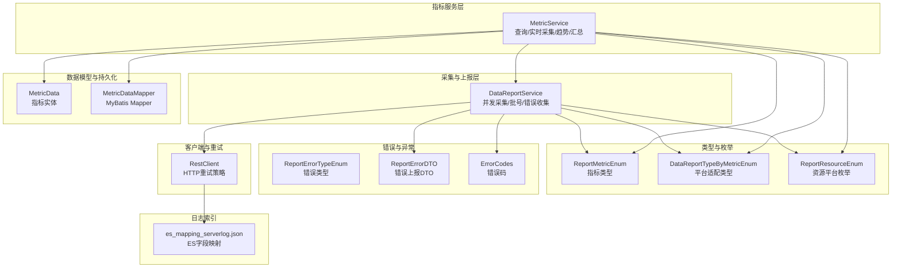
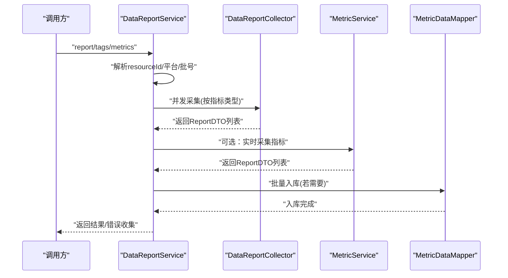
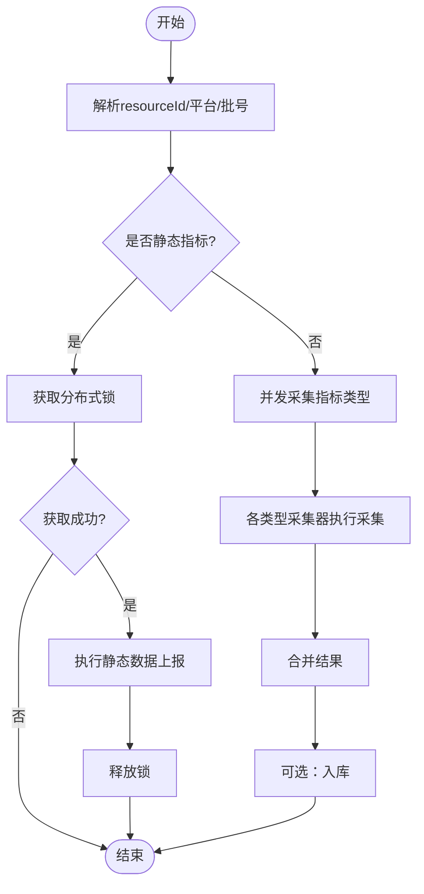
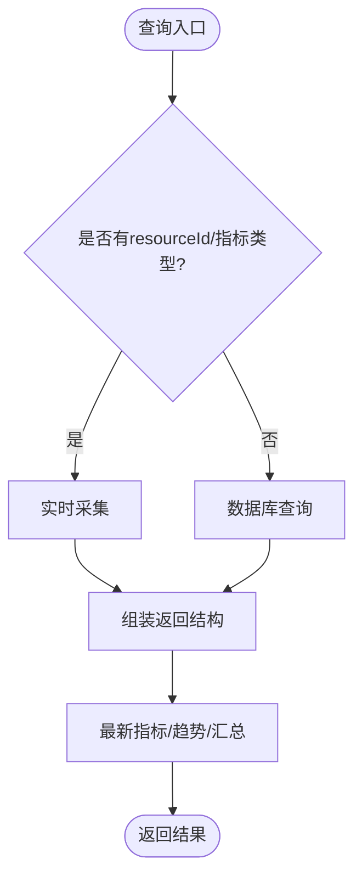
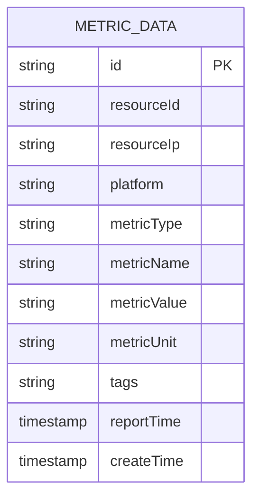
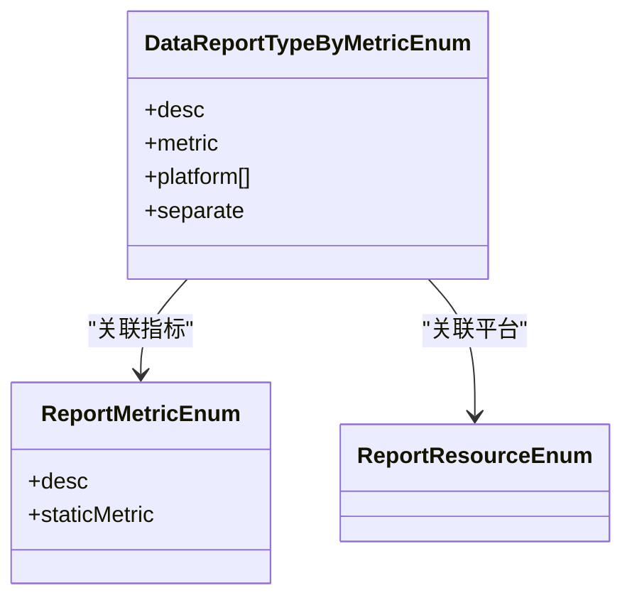
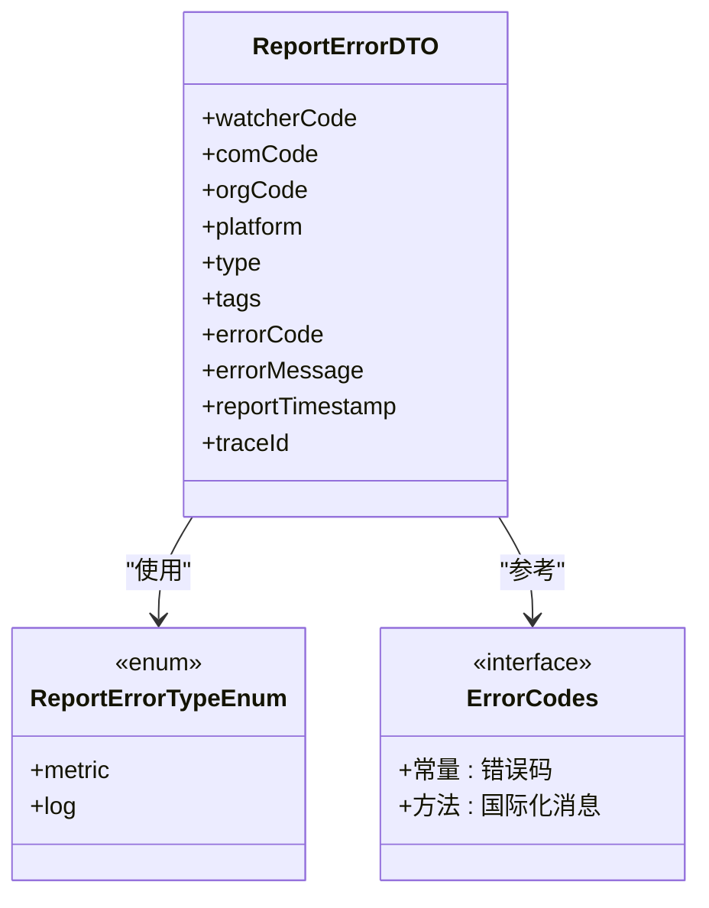
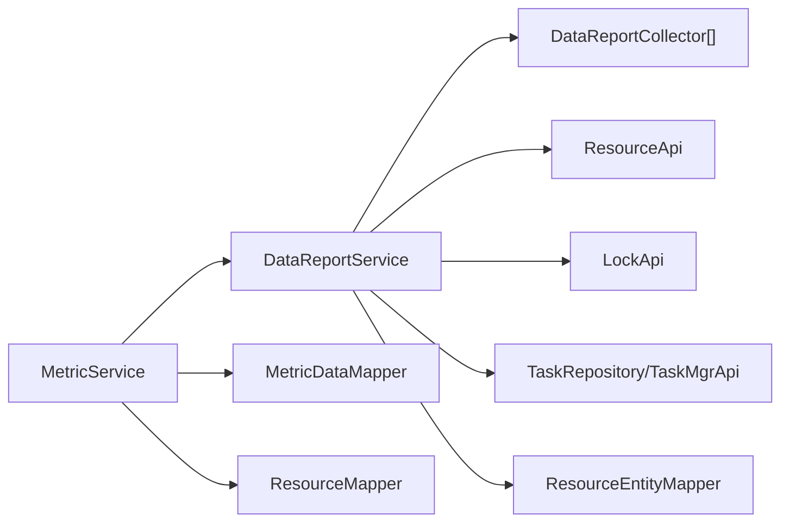

# 数据处理服务

<cite>
**本文引用的文件**   
- [DataReportService.java](file://watcher-agent/src/main/java/com/virtual/cloud/om/agent/service/report/DataReportService.java)
- [MetricService.java](file://watcher-agent/src/main/java/com/virtual/cloud/om/agent/service/report/MetricService.java)
- [MetricData.java](file://watcher-sdk/src/main/java/com/virtual/cloud/om/sdk/entity/mysql/MetricData.java)
- [MetricDataMapper.java](file://watcher-sdk/src/main/java/com/virtual/cloud/om/sdk/mapper/MetricDataMapper.java)
- [DataReportTypeByMetricEnum.java](file://watcher-sdk/src/main/java/com/virtual/cloud/om/sdk/constant/DataReportTypeByMetricEnum.java)
- [ReportMetricEnum.java](file://watcher-sdk/src/main/java/com/virtual/cloud/om/sdk/constant/report/ReportMetricEnum.java)
- [ReportErrorTypeEnum.java](file://watcher-sdk/src/main/java/com/virtual/cloud/om/sdk/constant/report/ReportErrorTypeEnum.java)
- [ReportErrorDTO.java](file://watcher-sdk/src/main/java/com/virtual/cloud/om/sdk/dto/dataReport/ReportErrorDTO.java)
- [RestClient.java](file://watcher-sdk/src/main/java/com/virtual/cloud/om/sdk/config/rest/workspace/cache/RestClient.java)
- [ErrorCodes.java](file://watcher-sdk/src/main/java/com/virtual/cloud/om/sdk/exception/ErrorCodes.java)
- [es_mapping_serverlog.json](file://watcher-agent/src/main/resources/es_mapping_serverlog.json)
</cite>

## 目录
1. [简介](#简介)
2. [项目结构](#项目结构)
3. [核心组件](#核心组件)
4. [架构总览](#架构总览)
5. [组件详解](#组件详解)
6. [依赖关系分析](#依赖关系分析)
7. [性能考量](#性能考量)
8. [故障排查指南](#故障排查指南)
9. [结论](#结论)
10. [附录](#附录)

## 简介
本文件面向“数据处理服务子系统”，聚焦以下目标：
- 全流程梳理：从原始采集数据到标准化报告的完整转换链路
- 指标服务：MetricService 的指标计算与聚合、时间序列处理、缓存策略与性能优化
- 质量保障：数据验证与清洗机制，确保上报数据质量与一致性
- 存储与查询：数据存储与查询优化策略（索引、分页、批量写入）
- 错误处理与重试：异常上报、重试与恢复策略
- 监控与日志：最佳实践与可观测性建议
- 性能调优与扩展：吞吐与延迟优化、横向扩展建议

## 项目结构
围绕数据处理服务的关键模块与文件组织如下：
- 采集与上报层：DataReportService 负责并发采集、批号管理、错误收集与上报
- 指标服务层：MetricService 负责指标查询、实时采集、趋势与汇总统计
- 数据模型与持久化：MetricData 实体与 MetricDataMapper 映射
- 类型与枚举：ReportMetricEnum、DataReportTypeByMetricEnum、ReportResourceEnum
- 错误与异常：ReportErrorDTO、ReportErrorTypeEnum、ErrorCodes
- 客户端与重试：RestClient 自定义重试策略
- 日志索引：es_mapping_serverlog.json（用于日志检索）

**图表来源**
- [DataReportService.java:1-334](file://watcher-agent/src/main/java/com/virtual/cloud/om/agent/service/report/DataReportService.java#L1-L334)
- [MetricService.java:1-266](file://watcher-agent/src/main/java/com/virtual/cloud/om/agent/service/report/MetricService.java#L1-L266)
- [MetricData.java:1-43](file://watcher-sdk/src/main/java/com/virtual/cloud/om/sdk/entity/mysql/MetricData.java#L1-L43)
- [MetricDataMapper.java:1-14](file://watcher-sdk/src/main/java/com/virtual/cloud/om/sdk/mapper/MetricDataMapper.java#L1-L14)
- [DataReportTypeByMetricEnum.java:1-190](file://watcher-sdk/src/main/java/com/virtual/cloud/om/sdk/constant/DataReportTypeByMetricEnum.java#L1-L190)
- [ReportMetricEnum.java:1-118](file://watcher-sdk/src/main/java/com/virtual/cloud/om/sdk/constant/report/ReportMetricEnum.java#L1-L118)
- [ReportResourceEnum.java:1-7](file://watcher-sdk/src/main/java/com/virtual/cloud/om/sdk/constant/ReportResourceEnum.java#L1-L7)
- [ReportErrorTypeEnum.java:1-7](file://watcher-sdk/src/main/java/com/virtual/cloud/om/sdk/constant/report/ReportErrorTypeEnum.java#L1-L7)
- [ReportErrorDTO.java:1-20](file://watcher-sdk/src/main/java/com/virtual/cloud/om/sdk/dto/dataReport/ReportErrorDTO.java#L1-L20)
- [RestClient.java:108-121](file://watcher-sdk/src/main/java/com/virtual/cloud/om/sdk/config/rest/workspace/cache/RestClient.java#L108-L121)
- [es_mapping_serverlog.json:113-154](file://watcher-agent/src/main/resources/es_mapping_serverlog.json#L113-L154)

**章节来源**
- [DataReportService.java:1-334](file://watcher-agent/src/main/java/com/virtual/cloud/om/agent/service/report/DataReportService.java#L1-L334)
- [MetricService.java:1-266](file://watcher-agent/src/main/java/com/virtual/cloud/om/agent/service/report/MetricService.java#L1-L266)
- [MetricData.java:1-43](file://watcher-sdk/src/main/java/com/virtual/cloud/om/sdk/entity/mysql/MetricData.java#L1-L43)
- [MetricDataMapper.java:1-14](file://watcher-sdk/src/main/java/com/virtual/cloud/om/sdk/mapper/MetricDataMapper.java#L1-L14)
- [DataReportTypeByMetricEnum.java:1-190](file://watcher-sdk/src/main/java/com/virtual/cloud/om/sdk/constant/DataReportTypeByMetricEnum.java#L1-L190)
- [ReportMetricEnum.java:1-118](file://watcher-sdk/src/main/java/com/virtual/cloud/om/sdk/constant/report/ReportMetricEnum.java#L1-L118)
- [ReportResourceEnum.java:1-7](file://watcher-sdk/src/main/java/com/virtual/cloud/om/sdk/constant/ReportResourceEnum.java#L1-L7)
- [ReportErrorTypeEnum.java:1-7](file://watcher-sdk/src/main/java/com/virtual/cloud/om/sdk/constant/report/ReportErrorTypeEnum.java#L1-L7)
- [ReportErrorDTO.java:1-20](file://watcher-sdk/src/main/java/com/virtual/cloud/om/sdk/dto/dataReport/ReportErrorDTO.java#L1-L20)
- [RestClient.java:108-121](file://watcher-sdk/src/main/java/com/virtual/cloud/om/sdk/config/rest/workspace/cache/RestClient.java#L108-L121)
- [es_mapping_serverlog.json:113-154](file://watcher-agent/src/main/resources/es_mapping_serverlog.json#L113-L154)

## 核心组件
- DataReportService：负责并发采集、批号生成、平台解析、错误收集与上报；支持静态与动态指标的差异化处理
- MetricService：负责指标查询、实时采集、趋势与汇总统计；封装数据库访问与聚合逻辑
- MetricData/MetricDataMapper：指标实体与持久化接口，支撑指标入库与查询
- 类型与枚举：ReportMetricEnum、DataReportTypeByMetricEnum、ReportResourceEnum，统一指标与平台适配
- 错误与异常：ReportErrorDTO、ReportErrorTypeEnum、ErrorCodes，统一错误上报与错误码
- RestClient：HTTP 客户端重试策略，提升外部调用稳定性
- ES 日志映射：es_mapping_serverlog.json，规范日志字段映射以提升检索效率

**章节来源**
- [DataReportService.java:44-140](file://watcher-agent/src/main/java/com/virtual/cloud/om/agent/service/report/DataReportService.java#L44-L140)
- [MetricService.java:20-81](file://watcher-agent/src/main/java/com/virtual/cloud/om/agent/service/report/MetricService.java#L20-L81)
- [MetricData.java:11-42](file://watcher-sdk/src/main/java/com/virtual/cloud/om/sdk/entity/mysql/MetricData.java#L11-L42)
- [MetricDataMapper.java:7-13](file://watcher-sdk/src/main/java/com/virtual/cloud/om/sdk/mapper/MetricDataMapper.java#L7-L13)
- [ReportMetricEnum.java:9-118](file://watcher-sdk/src/main/java/com/virtual/cloud/om/sdk/constant/report/ReportMetricEnum.java#L9-L118)
- [DataReportTypeByMetricEnum.java:21-190](file://watcher-sdk/src/main/java/com/virtual/cloud/om/sdk/constant/DataReportTypeByMetricEnum.java#L21-L190)
- [ReportResourceEnum.java:3-6](file://watcher-sdk/src/main/java/com/virtual/cloud/om/sdk/constant/ReportResourceEnum.java#L3-L6)
- [ReportErrorTypeEnum.java:3-7](file://watcher-sdk/src/main/java/com/virtual/cloud/om/sdk/constant/report/ReportErrorTypeEnum.java#L3-L7)
- [ReportErrorDTO.java:9-20](file://watcher-sdk/src/main/java/com/virtual/cloud/om/sdk/dto/dataReport/ReportErrorDTO.java#L9-L20)
- [RestClient.java:108-121](file://watcher-sdk/src/main/java/com/virtual/cloud/om/sdk/config/rest/workspace/cache/RestClient.java#L108-L121)
- [es_mapping_serverlog.json:113-154](file://watcher-agent/src/main/resources/es_mapping_serverlog.json#L113-L154)

## 架构总览
数据处理服务采用“采集-上报-存储-查询”的分层架构，核心流程如下：

**图表来源**
- [DataReportService.java:115-296](file://watcher-agent/src/main/java/com/virtual/cloud/om/agent/service/report/DataReportService.java#L115-L296)
- [MetricService.java:66-113](file://watcher-agent/src/main/java/com/virtual/cloud/om/agent/service/report/MetricService.java#L66-L113)
- [MetricDataMapper.java:7-13](file://watcher-sdk/src/main/java/com/virtual/cloud/om/sdk/mapper/MetricDataMapper.java#L7-L13)

## 组件详解

### DataReportService：采集与上报主流程
- 并发采集：基于 CompletableFuture 并行执行不同指标类型的采集，内部再按类型并发执行，提升吞吐
- 批号管理：按分钟级生成 batchNum，便于后续去重与溯源
- 静态数据强制上报：通过分布式锁控制静态数据上报的互斥，避免重复与冲突
- 错误收集与上报：捕获 AppException 并收集到 ReportError 列表，支持后续上报
- 平台解析：根据 resourceId 解析平台类型，选择合适的 DataReportTypeByMetricEnum
- 上报异常：提供 reportError 方法，构造 ReportErrorDTO 并记录日志

**图表来源**
- [DataReportService.java:115-140](file://watcher-agent/src/main/java/com/virtual/cloud/om/agent/service/report/DataReportService.java#L115-L140)
- [DataReportService.java:235-296](file://watcher-agent/src/main/java/com/virtual/cloud/om/agent/service/report/DataReportService.java#L235-L296)

**章节来源**
- [DataReportService.java:44-140](file://watcher-agent/src/main/java/com/virtual/cloud/om/agent/service/report/DataReportService.java#L44-L140)
- [DataReportService.java:145-230](file://watcher-agent/src/main/java/com/virtual/cloud/om/agent/service/report/DataReportService.java#L145-L230)
- [DataReportService.java:235-296](file://watcher-agent/src/main/java/com/virtual/cloud/om/agent/service/report/DataReportService.java#L235-L296)
- [DataReportService.java:306-333](file://watcher-agent/src/main/java/com/virtual/cloud/om/agent/service/report/DataReportService.java#L306-L333)

### MetricService：指标查询与聚合
- 指标类型与平台：提供 getMetricTypes、getPlatforms，统一对外暴露指标与平台信息
- 实时采集：当传入 resourceId 与 metricType 时，调用 DataReportService.reportWithResult 实时采集
- 数据库查询：支持按 resourceId、platform、metricType、时间范围等条件查询
- 最新指标：遍历 DataReportTypeByMetricEnum 的所有类型，取每种类型的最新记录
- 趋势数据：按时间升序返回指定小时内的指标序列
- 汇总统计：统计总量与最近上报时间，辅助前端展示

**图表来源**
- [MetricService.java:66-113](file://watcher-agent/src/main/java/com/virtual/cloud/om/agent/service/report/MetricService.java#L66-L113)
- [MetricService.java:118-158](file://watcher-agent/src/main/java/com/virtual/cloud/om/agent/service/report/MetricService.java#L118-L158)
- [MetricService.java:163-207](file://watcher-agent/src/main/java/com/virtual/cloud/om/agent/service/report/MetricService.java#L163-L207)
- [MetricService.java:212-226](file://watcher-agent/src/main/java/com/virtual/cloud/om/agent/service/report/MetricService.java#L212-L226)

**章节来源**
- [MetricService.java:20-81](file://watcher-agent/src/main/java/com/virtual/cloud/om/agent/service/report/MetricService.java#L20-L81)
- [MetricService.java:118-207](file://watcher-agent/src/main/java/com/virtual/cloud/om/agent/service/report/MetricService.java#L118-L207)
- [MetricService.java:212-266](file://watcher-agent/src/main/java/com/virtual/cloud/om/agent/service/report/MetricService.java#L212-L266)

### 数据模型与持久化：MetricData 与 Mapper
- 实体字段：包含 resourceId、platform、metricType、metricName、metricValue、metricUnit、tags、reportTime、createTime 等
- MyBatis Mapper：继承 BaseMapper，提供标准 CRUD 能力
- 使用场景：入库、查询、排序、分页

**图表来源**
- [MetricData.java:14-42](file://watcher-sdk/src/main/java/com/virtual/cloud/om/sdk/entity/mysql/MetricData.java#L14-L42)
- [MetricDataMapper.java:10-13](file://watcher-sdk/src/main/java/com/virtual/cloud/om/sdk/mapper/MetricDataMapper.java#L10-L13)

**章节来源**
- [MetricData.java:11-42](file://watcher-sdk/src/main/java/com/virtual/cloud/om/sdk/entity/mysql/MetricData.java#L11-L42)
- [MetricDataMapper.java:7-13](file://watcher-sdk/src/main/java/com/virtual/cloud/om/sdk/mapper/MetricDataMapper.java#L7-L13)

### 类型与平台适配：枚举体系
- ReportMetricEnum：指标类型与静态标志位，区分静态与动态指标
- DataReportTypeByMetricEnum：指标类型与平台的适配关系，支持同一指标在不同平台的不同实现
- ReportResourceEnum：资源平台枚举，如 cas、workspace、onestor、hccAgent 等

**图表来源**
- [ReportMetricEnum.java:9-118](file://watcher-sdk/src/main/java/com/virtual/cloud/om/sdk/constant/report/ReportMetricEnum.java#L9-L118)
- [DataReportTypeByMetricEnum.java:21-190](file://watcher-sdk/src/main/java/com/virtual/cloud/om/sdk/constant/DataReportTypeByMetricEnum.java#L21-L190)
- [ReportResourceEnum.java:3-6](file://watcher-sdk/src/main/java/com/virtual/cloud/om/sdk/constant/ReportResourceEnum.java#L3-L6)

**章节来源**
- [ReportMetricEnum.java:9-118](file://watcher-sdk/src/main/java/com/virtual/cloud/om/sdk/constant/report/ReportMetricEnum.java#L9-L118)
- [DataReportTypeByMetricEnum.java:21-190](file://watcher-sdk/src/main/java/com/virtual/cloud/om/sdk/constant/DataReportTypeByMetricEnum.java#L21-L190)
- [ReportResourceEnum.java:3-6](file://watcher-sdk/src/main/java/com/virtual/cloud/om/sdk/constant/ReportResourceEnum.java#L3-L6)

### 错误处理与异常：统一上报与错误码
- ReportErrorDTO：封装错误上报所需字段（watcherCode、comCode、orgCode、platform、type、tags、errorCode、errorMessage、reportTimestamp、traceId）
- ReportErrorTypeEnum：错误类型（metric、log）
- ErrorCodes：集中定义错误码与国际化消息，便于统一处理与定位问题

**图表来源**
- [ReportErrorDTO.java:9-20](file://watcher-sdk/src/main/java/com/virtual/cloud/om/sdk/dto/dataReport/ReportErrorDTO.java#L9-L20)
- [ReportErrorTypeEnum.java:3-7](file://watcher-sdk/src/main/java/com/virtual/cloud/om/sdk/constant/report/ReportErrorTypeEnum.java#L3-L7)
- [ErrorCodes.java:68-189](file://watcher-sdk/src/main/java/com/virtual/cloud/om/sdk/exception/ErrorCodes.java#L68-L189)

**章节来源**
- [ReportErrorDTO.java:1-20](file://watcher-sdk/src/main/java/com/virtual/cloud/om/sdk/dto/dataReport/ReportErrorDTO.java#L1-L20)
- [ReportErrorTypeEnum.java:1-7](file://watcher-sdk/src/main/java/com/virtual/cloud/om/sdk/constant/report/ReportErrorTypeEnum.java#L1-L7)
- [ErrorCodes.java:68-189](file://watcher-sdk/src/main/java/com/virtual/cloud/om/sdk/exception/ErrorCodes.java#L68-L189)

### 客户端与重试：RestClient
- 自定义重试策略：针对 NoHttpResponseException 进行最多 3 次重试，提升外部调用稳定性
- 连接池与配置：设置连接管理器、凭证提供者、默认请求配置

**章节来源**
- [RestClient.java:108-121](file://watcher-sdk/src/main/java/com/virtual/cloud/om/sdk/config/rest/workspace/cache/RestClient.java#L108-L121)

### 日志索引：es_mapping_serverlog.json
- 字段映射：为日志检索提供 keyword 类型字段，限制长度，提升查询性能
- 分片与副本：定义索引分片与副本数量，平衡性能与可靠性

**章节来源**
- [es_mapping_serverlog.json:113-154](file://watcher-agent/src/main/resources/es_mapping_serverlog.json#L113-L154)

## 依赖关系分析
- DataReportService 依赖：
  - DataReportCollector（通过 collectApiMap 动态装配）
  - ResourceApi（解析平台）
  - LockApi（静态数据上报互斥）
  - TaskRepository/TaskMgrApi（静态数据上报后任务调度）
  - ResourceEntityMapper（异常上报时查询资源）
- MetricService 依赖：
  - MetricDataMapper（查询与入库）
  - ResourceMapper（资源存在性校验）
  - DataReportService（实时采集）

**图表来源**
- [DataReportService.java:51-84](file://watcher-agent/src/main/java/com/virtual/cloud/om/agent/service/report/DataReportService.java#L51-L84)
- [MetricService.java:28-30](file://watcher-agent/src/main/java/com/virtual/cloud/om/agent/service/report/MetricService.java#L28-L30)

**章节来源**
- [DataReportService.java:51-84](file://watcher-agent/src/main/java/com/virtual/cloud/om/agent/service/report/DataReportService.java#L51-L84)
- [MetricService.java:28-30](file://watcher-agent/src/main/java/com/virtual/cloud/om/agent/service/report/MetricService.java#L28-L30)

## 性能考量
- 并发采集：使用 CompletableFuture 并行执行指标类型采集，减少整体等待时间
- 批号与去重：按分钟生成 batchNum，便于后续去重与溯源
- 静态数据互斥：通过分布式锁避免重复上报，降低资源消耗
- 数据库查询：按条件组合查询，使用时间范围与排序，建议在 reportTime、resourceId、metricType 上建立复合索引
- 入库策略：批量插入或分批入库，结合数据库事务与幂等 ID 控制重复
- 客户端重试：合理设置重试次数与退避策略，避免雪崩效应
- 日志检索：利用 ES 的 keyword 字段与映射，减少字段解析开销

[本节为通用性能指导，不直接分析具体文件，故无“章节来源”]

## 故障排查指南
- 异常上报：DataReportService.reportError 支持构造 ReportErrorDTO 并记录日志，便于定位问题
- 错误码：ErrorCodes 提供统一错误码与国际化消息，便于快速定位问题类别
- 采集失败：检查 DataReportCollector 是否正确装配，平台解析是否成功
- 数据缺失：确认 MetricService 的查询条件与时间范围，检查数据库索引与数据完整性
- 日志检索：检查 es_mapping_serverlog.json 的字段映射，确保检索字段一致

**章节来源**
- [DataReportService.java:306-333](file://watcher-agent/src/main/java/com/virtual/cloud/om/agent/service/report/DataReportService.java#L306-L333)
- [ErrorCodes.java:68-189](file://watcher-sdk/src/main/java/com/virtual/cloud/om/sdk/exception/ErrorCodes.java#L68-L189)
- [es_mapping_serverlog.json:113-154](file://watcher-agent/src/main/resources/es_mapping_serverlog.json#L113-L154)

## 结论
数据处理服务通过 DataReportService 与 MetricService 的协同，实现了从原始采集到标准化报告的高效闭环。借助枚举体系与平台适配，系统具备良好的扩展性；通过并发采集、批号管理与分布式锁，兼顾了性能与一致性。配合统一的错误上报与错误码体系、合理的数据库与日志索引策略，能够满足大规模场景下的数据处理需求。

[本节为总结性内容，不直接分析具体文件，故无“章节来源”]

## 附录
- 关键流程图与类图已在相应章节中给出，便于理解组件交互与数据流
- 建议在生产环境中为高频查询字段建立复合索引，并结合分页与缓存策略进一步优化性能

[本节为补充说明，不直接分析具体文件，故无“章节来源”]