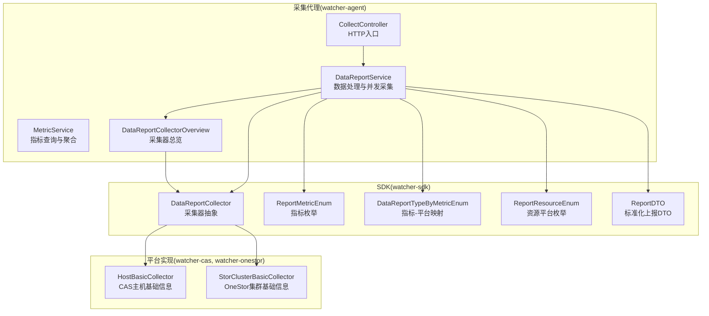
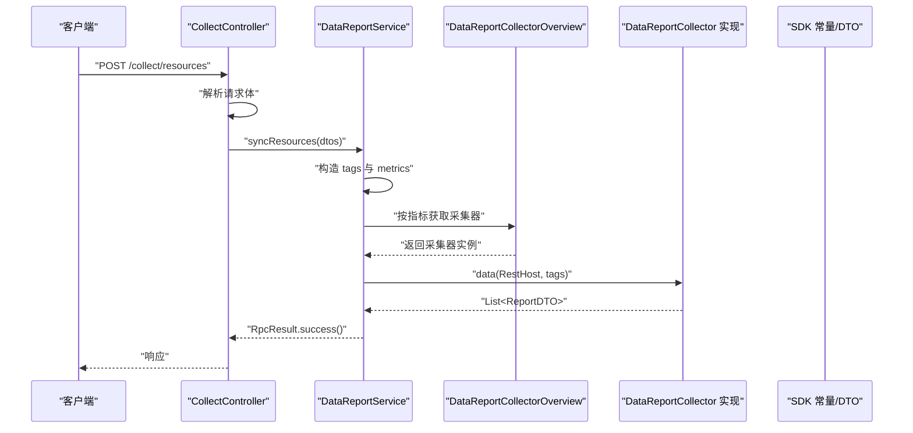
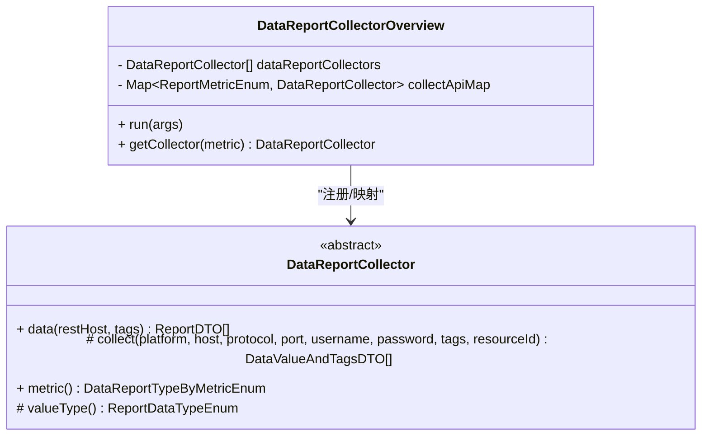
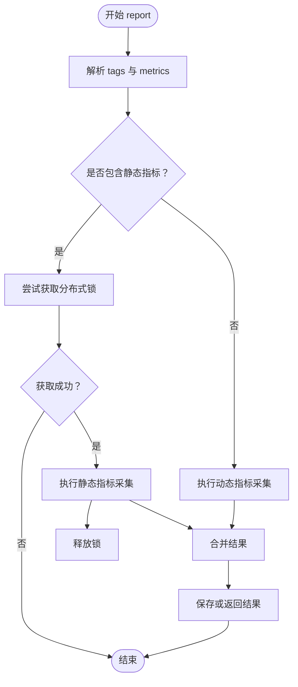
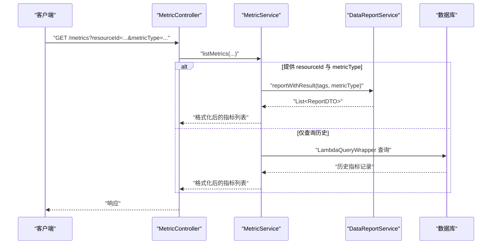
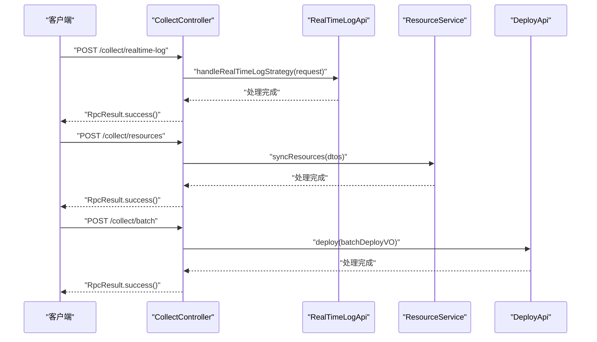
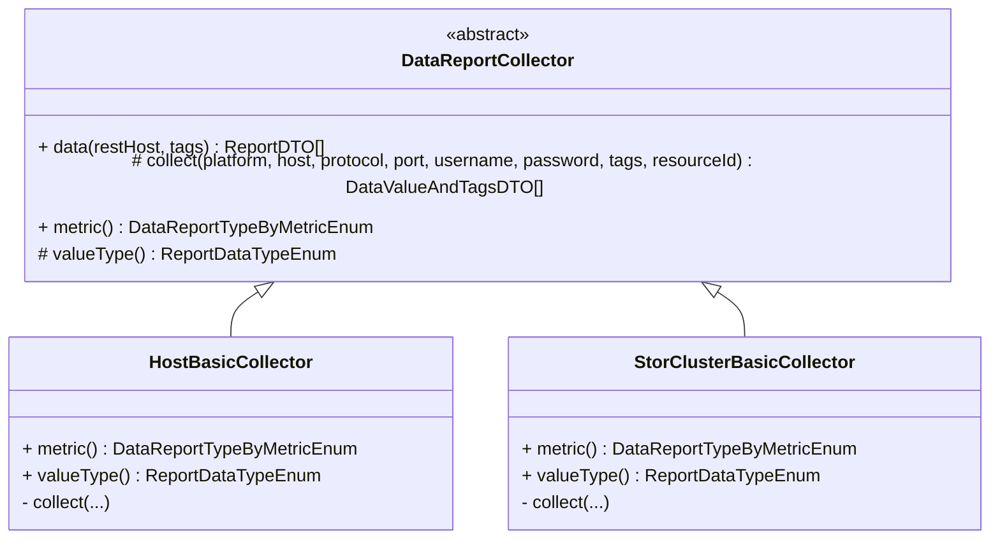
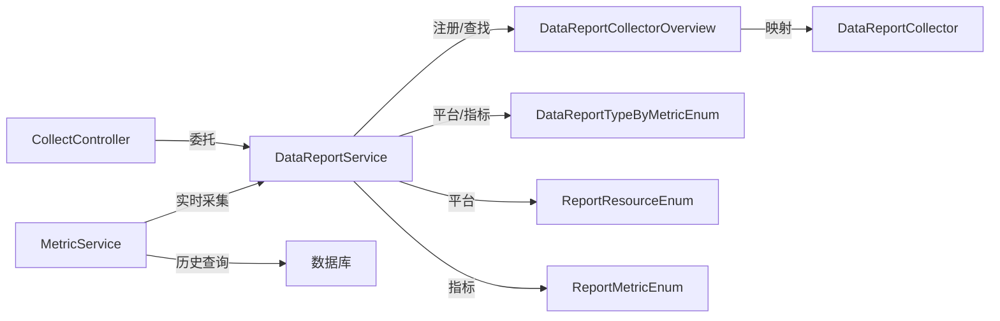

# 数据采集架构

<cite>
**本文引用的文件**
- [DataReportCollectorOverview.java](file://watcher-agent/src/main/java/com/virtual/cloud/om/agent/service/DataReportCollectorOverview.java)
- [DataReportService.java](file://watcher-agent/src/main/java/com/virtual/cloud/om/agent/service/report/DataReportService.java)
- [MetricService.java](file://watcher-agent/src/main/java/com/virtual/cloud/om/agent/service/report/MetricService.java)
- [CollectController.java](file://watcher-agent/src/main/java/com/virtual/cloud/om/agent/controller/CollectController.java)
- [DataReportCollector.java](file://watcher-sdk/src/main/java/com/virtual/cloud/om/sdk/api/DataReportCollector.java)
- [DataReportTypeByMetricEnum.java](file://watcher-sdk/src/main/java/com/virtual/cloud/om/sdk/constant/DataReportTypeByMetricEnum.java)
- [ReportMetricEnum.java](file://watcher-sdk/src/main/java/com/virtual/cloud/om/sdk/constant/report/ReportMetricEnum.java)
- [ReportDTO.java](file://watcher-sdk/src/main/java/com/virtual/cloud/om/sdk/dto/dataReport/workspace/ReportDTO.java)
- [ReportResourceEnum.java](file://watcher-sdk/src/main/java/com/virtual/cloud/om/sdk/constant/ReportResourceEnum.java)
- [HostBasicCollector.java](file://watcher-cas/src/main/java/com/virtual/cloud/om/cas/service/report/HostBasicCollector.java)
- [StorClusterBasicCollector.java](file://watcher-onestor/src/main/java/com/virtual/cloud/om/onestor/service/clusterBasic/StorClusterBasicCollector.java)
</cite>

## 目录
1. [简介](#简介)
2. [项目结构](#项目结构)
3. [核心组件](#核心组件)
4. [架构总览](#架构总览)
5. [详细组件分析](#详细组件分析)
6. [依赖分析](#依赖分析)
7. [性能考虑](#性能考虑)
8. [故障排查指南](#故障排查指南)
9. [结论](#结论)
10. [附录：扩展新采集器开发指南](#附录扩展新采集器开发指南)

## 简介
本技术文档围绕监控代理的数据采集架构，系统性阐述以下内容：
- DataReportCollectorOverview 作为采集器总览的设计模式与动态加载机制
- DataReportService 的数据处理流程：从原始采集、并发调度、标准化输出到错误上报
- MetricService 的指标计算与聚合逻辑：实时采集、数据库查询、趋势分析与缓存策略
- CollectController 的 HTTP 接口设计：请求接收、参数解析、业务委托与响应封装
- 扩展新采集器的开发指南：实现 DataReportCollector 接口、注册到总览、配置定时任务
- 性能优化策略与错误处理机制

## 项目结构
本仓库采用多模块结构，数据采集相关代码主要分布在以下模块：
- watcher-agent：采集代理服务，包含控制器、服务层、定时任务等
- watcher-sdk：SDK 层，提供采集器抽象、常量、DTO、工具等
- watcher-cas：CAS 平台采集器实现
- watcher-onestor：OneStor 存储平台采集器实现

**图表来源**
- [CollectController.java:1-67](file://watcher-agent/src/main/java/com/virtual/cloud/om/agent/controller/CollectController.java#L1-67)
- [DataReportService.java:1-334](file://watcher-agent/src/main/java/com/virtual/cloud/om/agent/service/report/DataReportService.java#L1-334)
- [MetricService.java:1-266](file://watcher-agent/src/main/java/com/virtual/cloud/om/agent/service/report/MetricService.java#L1-266)
- [DataReportCollectorOverview.java:1-46](file://watcher-agent/src/main/java/com/virtual/cloud/om/agent/service/DataReportCollectorOverview.java#L1-46)
- [DataReportCollector.java:1-118](file://watcher-sdk/src/main/java/com/virtual/cloud/om/sdk/api/DataReportCollector.java#L1-118)
- [ReportMetricEnum.java:1-118](file://watcher-sdk/src/main/java/com/virtual/cloud/om/sdk/constant/report/ReportMetricEnum.java#L1-118)
- [DataReportTypeByMetricEnum.java:1-190](file://watcher-sdk/src/main/java/com/virtual/cloud/om/sdk/constant/DataReportTypeByMetricEnum.java#L1-190)
- [ReportResourceEnum.java:1-7](file://watcher-sdk/src/main/java/com/virtual/cloud/om/sdk/constant/ReportResourceEnum.java#L1-7)
- [ReportDTO.java:1-25](file://watcher-sdk/src/main/java/com/virtual/cloud/om/sdk/dto/dataReport/workspace/ReportDTO.java#L1-25)
- [HostBasicCollector.java:1-126](file://watcher-cas/src/main/java/com/virtual/cloud/om/cas/service/report/HostBasicCollector.java#L1-126)
- [StorClusterBasicCollector.java:1-77](file://watcher-onestor/src/main/java/com/virtual/cloud/om/onestor/service/clusterBasic/StorClusterBasicCollector.java#L1-77)

**章节来源**
- [CollectController.java:1-67](file://watcher-agent/src/main/java/com/virtual/cloud/om/agent/controller/CollectController.java#L1-67)
- [DataReportService.java:1-334](file://watcher-agent/src/main/java/com/virtual/cloud/om/agent/service/report/DataReportService.java#L1-334)
- [MetricService.java:1-266](file://watcher-agent/src/main/java/com/virtual/cloud/om/agent/service/report/MetricService.java#L1-266)
- [DataReportCollectorOverview.java:1-46](file://watcher-agent/src/main/java/com/virtual/cloud/om/agent/service/DataReportCollectorOverview.java#L1-46)

## 核心组件
- DataReportCollectorOverview：在应用启动阶段扫描并注册所有 DataReportCollector 实现，构建“指标枚举 → 采集器实例”的映射表，提供按指标获取采集器的能力。
- DataReportService：负责数据采集的编排与执行，包括静态/动态指标区分、并发采集、上下文类加载器设置、错误收集与上报、批量编号等。
- MetricService：提供指标查询、实时采集、数据库查询、最新指标与趋势分析能力，支持分页与时间范围过滤。
- CollectController：对外暴露 HTTP 接口，接收实时日志策略、资源同步、批量部署等请求，内部委托给相应服务处理。

**章节来源**
- [DataReportCollectorOverview.java:18-46](file://watcher-agent/src/main/java/com/virtual/cloud/om/agent/service/DataReportCollectorOverview.java#L18-46)
- [DataReportService.java:44-334](file://watcher-agent/src/main/java/com/virtual/cloud/om/agent/service/report/DataReportService.java#L44-334)
- [MetricService.java:20-266](file://watcher-agent/src/main/java/com/virtual/cloud/om/agent/service/report/MetricService.java#L20-266)
- [CollectController.java:23-67](file://watcher-agent/src/main/java/com/virtual/cloud/om/agent/controller/CollectController.java#L23-67)

## 架构总览
整体架构遵循“抽象接口 + 多实现 + 总览注册 + 服务编排”的模式：
- 抽象层：DataReportCollector 定义采集器规范，ReportMetricEnum/ReportResourceEnum/DataReportTypeByMetricEnum 定义指标、平台与映射规则
- 实现层：各平台（CAS、OneStor 等）实现具体采集逻辑
- 注册层：DataReportCollectorOverview 在启动时自动装配并注册所有采集器
- 编排层：DataReportService 根据指标与平台选择合适的采集器实现，进行并发采集与结果标准化
- 对外层：CollectController 提供 HTTP 入口，封装 RPC 响应

**图表来源**
- [CollectController.java:45-58](file://watcher-agent/src/main/java/com/virtual/cloud/om/agent/controller/CollectController.java#L45-58)
- [DataReportService.java:115-140](file://watcher-agent/src/main/java/com/virtual/cloud/om/agent/service/report/DataReportService.java#L115-140)
- [DataReportCollectorOverview.java:32-44](file://watcher-agent/src/main/java/com/virtual/cloud/om/agent/service/DataReportCollectorOverview.java#L32-44)
- [DataReportCollector.java:48-86](file://watcher-sdk/src/main/java/com/virtual/cloud/om/sdk/api/DataReportCollector.java#L48-86)
- [ReportDTO.java:11-24](file://watcher-sdk/src/main/java/com/virtual/cloud/om/sdk/dto/dataReport/workspace/ReportDTO.java#L11-24)

## 详细组件分析

### DataReportCollectorOverview 设计模式与动态加载
- 设计要点
  - 使用 Spring 的 ApplicationRunner 在应用启动后扫描所有 DataReportCollector 实例
  - 将实例按指标枚举映射到 Map 中，便于后续按指标快速定位采集器
  - 提供按 ReportMetricEnum 获取采集器的方法，并在未找到时抛出统一异常
- 动态加载机制
  - 通过 @Resource 注入数组，Spring 自动注入所有实现类
  - 启动阶段遍历数组，将每个采集器与其 metric() 返回值建立映射
- 适用场景
  - 支持多平台、多指标的统一调度
  - 便于扩展新的采集器实现，无需修改调度逻辑

**图表来源**
- [DataReportCollectorOverview.java:22-46](file://watcher-agent/src/main/java/com/virtual/cloud/om/agent/service/DataReportCollectorOverview.java#L22-46)
- [DataReportCollector.java:18-118](file://watcher-sdk/src/main/java/com/virtual/cloud/om/sdk/api/DataReportCollector.java#L18-118)

**章节来源**
- [DataReportCollectorOverview.java:18-46](file://watcher-agent/src/main/java/com/virtual/cloud/om/agent/service/DataReportCollectorOverview.java#L18-46)

### DataReportService 数据处理流程
- 关键流程
  - 参数解析：从 tags 中提取 resourceId；解析 metrics 字符串为枚举数组
  - 静态/动态区分：若包含静态指标，先尝试获取分布式锁，避免重复执行
  - 平台识别：根据 resourceId 获取 RestHost 与平台类型，若平台为空直接返回空结果
  - 并发采集：按指标并行调度，每个指标内部按平台类型进一步并行
  - 结果标准化：将 DataValueAndTagsDTO 转换为 ReportDTO，填充批次号、时间戳等
  - 错误收集：捕获采集器异常，记录 TraceId 与指标信息，便于追踪
- 并发与上下文
  - 使用 ForkJoinPool 与 CompletableFuture 实现多指标、多类型的并行采集
  - 设置线程上下文类加载器，确保 JAXB 等依赖正确加载
- 批次与锁
  - 以秒级时间戳生成 batchNum，用于批次标识
  - 静态指标使用分布式锁，防止同一资源在同一周期内重复采集

**图表来源**
- [DataReportService.java:115-140](file://watcher-agent/src/main/java/com/virtual/cloud/om/agent/service/report/DataReportService.java#L115-140)
- [DataReportService.java:235-296](file://watcher-agent/src/main/java/com/virtual/cloud/om/agent/service/report/DataReportService.java#L235-296)

**章节来源**
- [DataReportService.java:86-296](file://watcher-agent/src/main/java/com/virtual/cloud/om/agent/service/report/DataReportService.java#L86-296)

### MetricService 指标计算与聚合
- 能力概览
  - 指标类型与平台查询：返回可采集的指标与平台列表
  - 实时采集：当提供 resourceId 与 metricType 时，调用 DataReportService 实时采集并格式化返回
  - 数据库查询：支持按资源、平台、指标类型、时间范围查询历史数据，支持分页排序
  - 最新指标与趋势：查询某资源最新各类指标与指定指标的趋势数据
  - 汇总统计：统计资源指标总数与最后上报时间
- 缓存策略
  - 优先走实时采集（当提供 resourceId+metricType），减少数据库压力
  - 历史查询使用数据库分页与排序，避免一次性加载大量数据
- 复杂度分析
  - 实时采集复杂度取决于指标数量与平台类型数量（通常较小）
  - 历史查询复杂度与查询条件与数据量相关，建议合理设置时间范围与分页大小

**图表来源**
- [MetricService.java:70-113](file://watcher-agent/src/main/java/com/virtual/cloud/om/agent/service/report/MetricService.java#L70-113)
- [MetricService.java:118-158](file://watcher-agent/src/main/java/com/virtual/cloud/om/agent/service/report/MetricService.java#L118-158)
- [DataReportService.java:145-161](file://watcher-agent/src/main/java/com/virtual/cloud/om/agent/service/report/DataReportService.java#L145-161)

**章节来源**
- [MetricService.java:35-266](file://watcher-agent/src/main/java/com/virtual/cloud/om/agent/service/report/MetricService.java#L35-266)

### CollectController HTTP 接口设计
- 接口清单
  - POST /collect/realtime-log：接收实时日志策略请求，委托 RealTimeLogApi 处理
  - POST /collect/resources：接收资源同步请求，委托 ResourceService 处理
  - POST /collect/batch：接收批量部署请求，委托 DeployApi 处理
- 请求/响应
  - 请求体使用 DTO 对象，响应统一使用 RpcResult 包装
  - 控制器不直接处理业务细节，仅做参数解析与委托
- 可扩展性
  - 新增接口只需新增方法与 DTO，保持控制器薄层职责

**图表来源**
- [CollectController.java:45-65](file://watcher-agent/src/main/java/com/virtual/cloud/om/agent/controller/CollectController.java#L45-65)

**章节来源**
- [CollectController.java:23-67](file://watcher-agent/src/main/java/com/virtual/cloud/om/agent/controller/CollectController.java#L23-67)

### 采集器实现示例与接口规范
- DataReportCollector 规范
  - data(RestHost, tags)：统一入口，负责采集、转换与标准化输出
  - collect(...)：抽象方法，子类实现具体采集逻辑
  - metric()：返回 DataReportTypeByMetricEnum，用于与平台映射
  - valueType()：返回 ReportDataTypeEnum，决定 value 类型
- 平台实现示例
  - HostBasicCollector（CAS）：通过 REST 接口获取主机基础信息，组装为 JSON 值
  - StorClusterBasicCollector（OneStor）：通过 REST 接口获取集群基础信息，组装为 JSON 值
- 标准化输出
  - ReportDTO：包含指标类型、值类型、标签、批次号、值与时间戳

**图表来源**
- [DataReportCollector.java:18-118](file://watcher-sdk/src/main/java/com/virtual/cloud/om/sdk/api/DataReportCollector.java#L18-118)
- [HostBasicCollector.java:26-126](file://watcher-cas/src/main/java/com/virtual/cloud/om/cas/service/report/HostBasicCollector.java#L26-126)
- [StorClusterBasicCollector.java:26-77](file://watcher-onestor/src/main/java/com/virtual/cloud/om/onestor/service/clusterBasic/StorClusterBasicCollector.java#L26-77)

**章节来源**
- [DataReportCollector.java:18-118](file://watcher-sdk/src/main/java/com/virtual/cloud/om/sdk/api/DataReportCollector.java#L18-118)
- [HostBasicCollector.java:26-126](file://watcher-cas/src/main/java/com/virtual/cloud/om/cas/service/report/HostBasicCollector.java#L26-126)
- [StorClusterBasicCollector.java:26-77](file://watcher-onestor/src/main/java/com/virtual/cloud/om/onestor/service/clusterBasic/StorClusterBasicCollector.java#L26-77)

## 依赖分析
- 组件耦合
  - CollectController 依赖外部 API（RealTimeLogApi、DeployApi）与内部服务（ResourceService、DataCenterService）
  - DataReportService 依赖 SDK 常量、ResourceApi、LockApi、TaskRepository、TaskMgrApi、StrategyService
  - DataReportCollectorOverview 依赖 SDK 的 DataReportCollector 接口与枚举
  - MetricService 依赖 DataReportService、数据库 Mapper 与 Resource Mapper
- 映射关系
  - ReportMetricEnum → DataReportTypeByMetricEnum（多对多映射，受平台限制）
  - DataReportTypeByMetricEnum → DataReportCollector 实例（通过总览注册）

**图表来源**
- [CollectController.java:32-43](file://watcher-agent/src/main/java/com/virtual/cloud/om/agent/controller/CollectController.java#L32-43)
- [DataReportService.java:51-84](file://watcher-agent/src/main/java/com/virtual/cloud/om/agent/service/report/DataReportService.java#L51-84)
- [DataReportCollectorOverview.java:25-35](file://watcher-agent/src/main/java/com/virtual/cloud/om/agent/service/DataReportCollectorOverview.java#L25-35)
- [DataReportTypeByMetricEnum.java:169-186](file://watcher-sdk/src/main/java/com/virtual/cloud/om/sdk/constant/DataReportTypeByMetricEnum.java#L169-186)
- [ReportMetricEnum.java:9-118](file://watcher-sdk/src/main/java/com/virtual/cloud/om/sdk/constant/report/ReportMetricEnum.java#L9-118)
- [ReportResourceEnum.java:3-6](file://watcher-sdk/src/main/java/com/virtual/cloud/om/sdk/constant/ReportResourceEnum.java#L3-6)

**章节来源**
- [DataReportTypeByMetricEnum.java:169-186](file://watcher-sdk/src/main/java/com/virtual/cloud/om/sdk/constant/DataReportTypeByMetricEnum.java#L169-186)
- [ReportMetricEnum.java:9-118](file://watcher-sdk/src/main/java/com/virtual/cloud/om/sdk/constant/report/ReportMetricEnum.java#L9-118)
- [ReportResourceEnum.java:3-6](file://watcher-sdk/src/main/java/com/virtual/cloud/om/sdk/constant/ReportResourceEnum.java#L3-6)

## 性能考虑
- 并发采集
  - 使用 CompletableFuture 并行执行多指标、多平台类型采集，显著降低整体耗时
  - 注意线程池与上下文类加载器设置，避免 JAXB 等类加载问题
- 批次与锁
  - 静态指标使用分布式锁，避免重复采集；批次号按分钟粒度生成，便于去重与追踪
- 数据库访问
  - 优先实时采集，减少历史查询压力；历史查询建议限定时间范围与分页
- 序列化与对象复用
  - 使用 CopyOnWriteArrayList 与不可变集合减少锁竞争
  - 合理复用 DTO，避免频繁创建大对象

[本节为通用性能指导，不直接分析具体文件]

## 故障排查指南
- 常见异常与定位
  - 资源 ID 缺失：当 tags 中无法解析 resourceId 时抛出统一异常，检查请求参数
  - 采集器缺失：按指标查找采集器失败时抛出异常，检查指标枚举与平台映射
  - 平台为空：根据 resourceId 解析平台失败，检查资源平台配置
  - 采集器异常：捕获 AppException 并记录 TraceId，便于定位具体指标与采集器
- 日志与追踪
  - DataReportService 输出详细的采集日志，包含指标、批次号、TraceId
  - MetricService 在实时采集失败时记录错误日志并返回空列表，避免中断
- 错误上报
  - DataReportService 提供 reportError 方法，封装错误信息并记录日志

**章节来源**
- [DataReportService.java:115-140](file://watcher-agent/src/main/java/com/virtual/cloud/om/agent/service/report/DataReportService.java#L115-140)
- [DataReportService.java:206-218](file://watcher-agent/src/main/java/com/virtual/cloud/om/agent/service/report/DataReportService.java#L206-218)
- [DataReportService.java:309-332](file://watcher-agent/src/main/java/com/virtual/cloud/om/agent/service/report/DataReportService.java#L309-332)

## 结论
本架构通过“抽象接口 + 多实现 + 总览注册 + 服务编排”的设计，实现了高扩展、高性能、易维护的数据采集体系：
- DataReportCollectorOverview 提供动态注册与快速查找
- DataReportService 负责并发采集与标准化输出
- MetricService 提供实时与历史双通道的指标服务
- CollectController 保持薄层职责，便于扩展更多采集接口

[本节为总结性内容，不直接分析具体文件]

## 附录：扩展新采集器开发指南
- 实现步骤
  1) 实现 DataReportCollector 抽象类
     - 在 collect(...) 中编写具体采集逻辑，返回 DataValueAndTagsDTO 列表
     - 在 metric() 中返回 DataReportTypeByMetricEnum
     - 在 valueType() 中返回 ReportDataTypeEnum
  2) 在 SDK 中完善指标与平台映射
     - 在 ReportMetricEnum 中添加新的指标枚举项
     - 在 DataReportTypeByMetricEnum 中添加指标与平台的映射关系
  3) 注册到采集器总览
     - 采集器实现需标注为 Spring 组件，随应用启动被 DataReportCollectorOverview 自动发现与注册
  4) 配置定时任务（可选）
     - 若需要定时采集，可在任务模块中新增对应 Cron 任务，调用 DataReportService.report(...) 或 reportWithResult(...)
- 开发示例参考
  - CAS 主机基础信息采集器：HostBasicCollector
  - OneStor 集群基础信息采集器：StorClusterBasicCollector

**章节来源**
- [DataReportCollector.java:18-118](file://watcher-sdk/src/main/java/com/virtual/cloud/om/sdk/api/DataReportCollector.java#L18-118)
- [ReportMetricEnum.java:9-118](file://watcher-sdk/src/main/java/com/virtual/cloud/om/sdk/constant/report/ReportMetricEnum.java#L9-118)
- [DataReportTypeByMetricEnum.java:169-186](file://watcher-sdk/src/main/java/com/virtual/cloud/om/sdk/constant/DataReportTypeByMetricEnum.java#L169-186)
- [HostBasicCollector.java:26-126](file://watcher-cas/src/main/java/com/virtual/cloud/om/cas/service/report/HostBasicCollector.java#L26-126)
- [StorClusterBasicCollector.java:26-77](file://watcher-onestor/src/main/java/com/virtual/cloud/om/onestor/service/clusterBasic/StorClusterBasicCollector.java#L26-77)