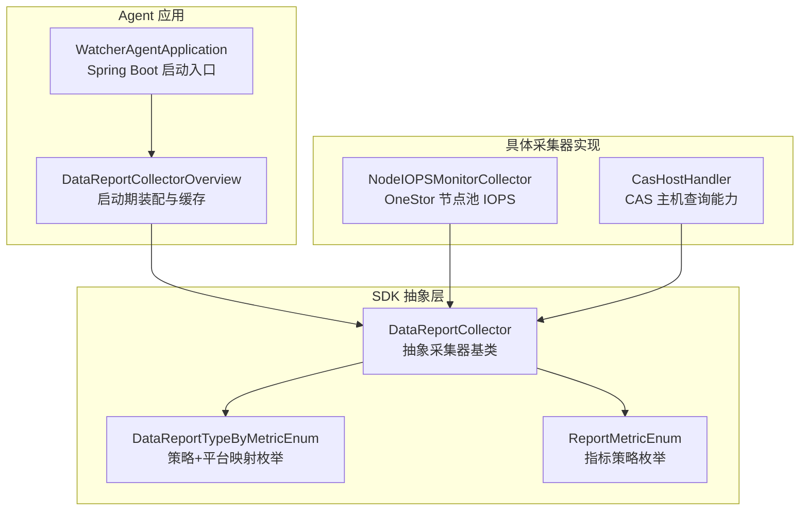
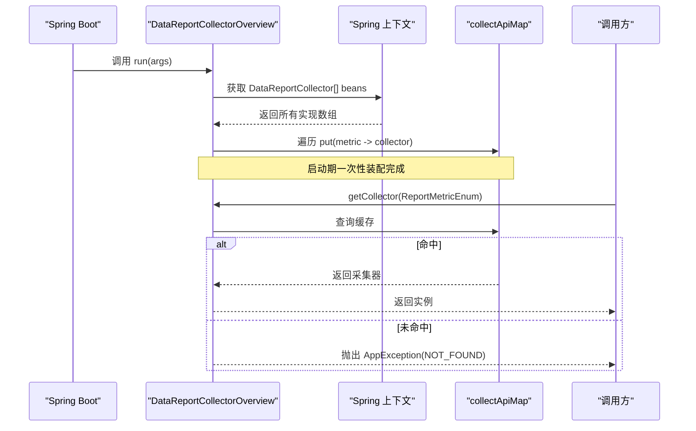
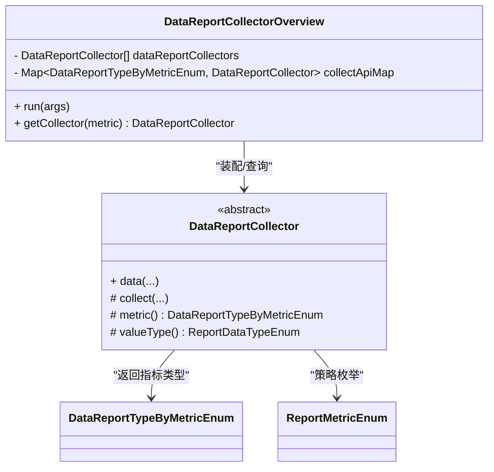
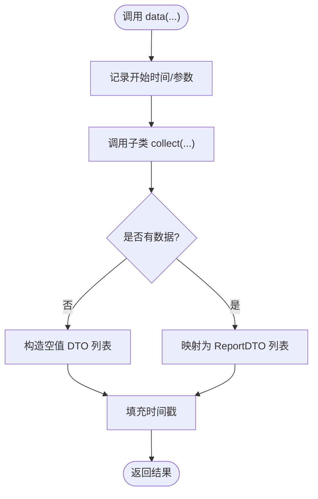
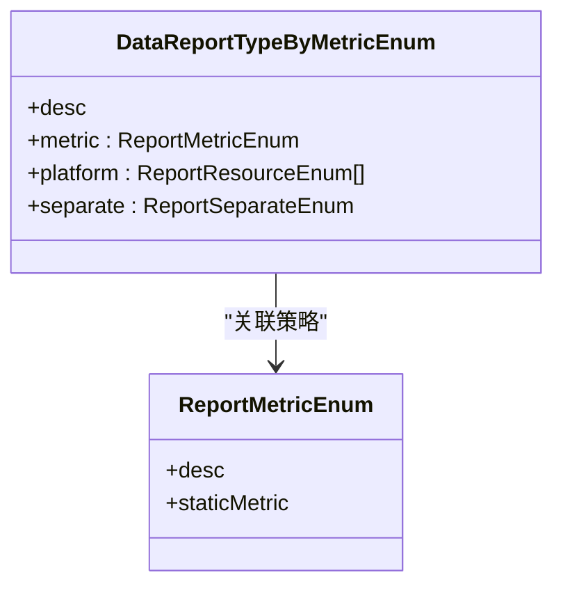
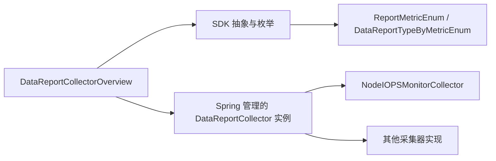

# 采集器总览管理

<cite>
**本文引用的文件**
- [DataReportCollectorOverview.java](file://watcher-agent/src/main/java/com/virtual/cloud/om/agent/service/DataReportCollectorOverview.java)
- [DataReportCollector.java](file://watcher-sdk/src/main/java/com/virtual/cloud/om/sdk/api/DataReportCollector.java)
- [DataReportTypeByMetricEnum.java](file://watcher-sdk/src/main/java/com/virtual/cloud/om/sdk/constant/DataReportTypeByMetricEnum.java)
- [ReportMetricEnum.java](file://watcher-sdk/src/main/java/com/virtual/cloud/om/sdk/constant/report/ReportMetricEnum.java)
- [AppException.java](file://watcher-sdk/src/main/java/com/virtual/cloud/om/sdk/exception/AppException.java)
- [ErrorCodes.java](file://watcher-sdk/src/main/java/com/virtual/cloud/om/sdk/exception/ErrorCodes.java)
- [ExceptionControllerAdvice.java](file://watcher-sdk/src/main/java/com/virtual/cloud/om/sdk/exception/ExceptionControllerAdvice.java)
- [WatcherAgentApplication.java](file://watcher-agent/src/main/java/com/virtual/cloud/om/agent/WatcherAgentApplication.java)
- [NodeIOPSMonitorCollector.java](file://watcher-onestor/src/main/java/com/virtual/cloud/om/onestor/service/report/monitor/node/NodeIOPSMonitorCollector.java)
- [CasHostHandler.java](file://watcher-cas/src/main/java/com/virtual/cloud/om/cas/service/CasHostHandler.java)
</cite>

## 目录
1. [简介](#简介)
2. [项目结构](#项目结构)
3. [核心组件](#核心组件)
4. [架构总览](#架构总览)
5. [详细组件分析](#详细组件分析)
6. [依赖分析](#依赖分析)
7. [性能考量](#性能考量)
8. [故障排查指南](#故障排查指南)
9. [结论](#结论)
10. [附录：扩展新采集器开发指南](#附录扩展新采集器开发指南)

## 简介
本文件面向“采集器总览管理”子系统，围绕 DataReportCollectorOverview 的设计与实现进行深入解析，重点涵盖：
- 基于 Spring Boot ApplicationRunner 的启动期自动装配机制
- 动态加载所有 DataReportCollector 实现类并建立映射关系
- ConcurrentHashMap 的线程安全设计与性能优势
- getCollector 查找逻辑与异常处理机制
- 扩展新采集器的完整开发流程（实现接口、配置 metric、注册到 Spring 容器）
- 生命周期管理与错误恢复策略

## 项目结构
采集器总览管理位于 agent 子系统中，核心类 DataReportCollectorOverview 在应用启动阶段扫描并缓存所有采集器实现；采集器抽象基类 DataReportCollector 定义了统一的数据采集协议；枚举层 DataReportTypeByMetricEnum 和 ReportMetricEnum 将“指标策略”与“资源平台实现”解耦。

图表来源
- [WatcherAgentApplication.java](file://watcher-agent/src/main/java/com/virtual/cloud/om/agent/WatcherAgentApplication.java)
- [DataReportCollectorOverview.java](file://watcher-agent/src/main/java/com/virtual/cloud/om/agent/service/DataReportCollectorOverview.java)
- [DataReportCollector.java](file://watcher-sdk/src/main/java/com/virtual/cloud/om/sdk/api/DataReportCollector.java)
- [DataReportTypeByMetricEnum.java](file://watcher-sdk/src/main/java/com/virtual/cloud/om/sdk/constant/DataReportTypeByMetricEnum.java)
- [ReportMetricEnum.java](file://watcher-sdk/src/main/java/com/virtual/cloud/om/sdk/constant/report/ReportMetricEnum.java)
- [NodeIOPSMonitorCollector.java](file://watcher-onestor/src/main/java/com/virtual/cloud/om/onestor/service/report/monitor/node/NodeIOPSMonitorCollector.java)
- [CasHostHandler.java](file://watcher-cas/src/main/java/com/virtual/cloud/om/cas/service/CasHostHandler.java)

章节来源
- [WatcherAgentApplication.java](file://watcher-agent/src/main/java/com/virtual/cloud/om/agent/WatcherAgentApplication.java)
- [DataReportCollectorOverview.java](file://watcher-agent/src/main/java/com/virtual/cloud/om/agent/service/DataReportCollectorOverview.java)

## 核心组件
- DataReportCollectorOverview：在应用启动时扫描所有 DataReportCollector 实现，并按指标策略构建并发安全的映射表，提供运行时快速查找。
- DataReportCollector：抽象采集器，定义统一的 data(...) 协议与抽象的 metric()/valueType() 接口，子类只需实现采集细节。
- DataReportTypeByMetricEnum / ReportMetricEnum：将“指标策略”与“资源平台实现”解耦，支持同一策略在不同平台的差异化实现。
- 异常体系：AppException + ErrorCodes + ExceptionControllerAdvice 统一错误码与国际化消息输出。

章节来源
- [DataReportCollectorOverview.java](file://watcher-agent/src/main/java/com/virtual/cloud/om/agent/service/DataReportCollectorOverview.java)
- [DataReportCollector.java](file://watcher-sdk/src/main/java/com/virtual/cloud/om/sdk/api/DataReportCollector.java)
- [DataReportTypeByMetricEnum.java](file://watcher-sdk/src/main/java/com/virtual/cloud/om/sdk/constant/DataReportTypeByMetricEnum.java)
- [ReportMetricEnum.java](file://watcher-sdk/src/main/java/com/virtual/cloud/om/sdk/constant/report/ReportMetricEnum.java)
- [AppException.java](file://watcher-sdk/src/main/java/com/virtual/cloud/om/sdk/exception/AppException.java)
- [ErrorCodes.java](file://watcher-sdk/src/main/java/com/virtual/cloud/om/sdk/exception/ErrorCodes.java)
- [ExceptionControllerAdvice.java](file://watcher-sdk/src/main/java/com/virtual/cloud/om/sdk/exception/ExceptionControllerAdvice.java)

## 架构总览
DataReportCollectorOverview 作为“采集器总览”，在 Spring Boot 启动阶段通过 ApplicationRunner 注入所有 DataReportCollector 实例，将其注册到 ConcurrentHashMap 中，key 为指标策略枚举，value 为具体采集器实例。运行时通过 getCollector(ReportMetricEnum) 快速定位采集器，若未找到则抛出 AppException(NOT_FOUND)，由全局异常控制器统一包装响应。

图表来源
- [DataReportCollectorOverview.java](file://watcher-agent/src/main/java/com/virtual/cloud/om/agent/service/DataReportCollectorOverview.java)
- [AppException.java](file://watcher-sdk/src/main/java/com/virtual/cloud/om/sdk/exception/AppException.java)
- [ErrorCodes.java](file://watcher-sdk/src/main/java/com/virtual/cloud/om/sdk/exception/ErrorCodes.java)

## 详细组件分析

### DataReportCollectorOverview 设计与实现
- 启动期装配：实现 ApplicationRunner，在 run(ApplicationArguments) 中遍历注入的 DataReportCollector 数组，按 metric() 结果放入 ConcurrentHashMap。
- 并发安全：使用 ConcurrentHashMap 保证多线程下的读写安全，避免锁竞争，提升查找性能。
- 运行时查询：getCollector(ReportMetricEnum) 使用 Optional 包裹查询结果，未命中时抛出 AppException(NOT_FOUND)，便于上层统一处理。

图表来源
- [DataReportCollectorOverview.java](file://watcher-agent/src/main/java/com/virtual/cloud/om/agent/service/DataReportCollectorOverview.java)
- [DataReportCollector.java](file://watcher-sdk/src/main/java/com/virtual/cloud/om/sdk/api/DataReportCollector.java)
- [DataReportTypeByMetricEnum.java](file://watcher-sdk/src/main/java/com/virtual/cloud/om/sdk/constant/DataReportTypeByMetricEnum.java)
- [ReportMetricEnum.java](file://watcher-sdk/src/main/java/com/virtual/cloud/om/sdk/constant/report/ReportMetricEnum.java)

章节来源
- [DataReportCollectorOverview.java](file://watcher-agent/src/main/java/com/virtual/cloud/om/agent/service/DataReportCollectorOverview.java)

### DataReportCollector 抽象协议
- 统一入口：data(RestHost, tags) 负责采集前后的日志记录、时间戳处理与空结果兜底。
- 抽象采集：collect(...) 由子类实现，负责实际拉取数据并封装为 DataValueAndTagsDTO 列表。
- 类型约定：metric() 返回 DataReportTypeByMetricEnum，valueType() 返回 ReportDataTypeEnum，用于上报结构的 data.type 与 data.value 类型约束。

图表来源
- [DataReportCollector.java](file://watcher-sdk/src/main/java/com/virtual/cloud/om/sdk/api/DataReportCollector.java)

章节来源
- [DataReportCollector.java](file://watcher-sdk/src/main/java/com/virtual/cloud/om/sdk/api/DataReportCollector.java)

### 指标策略与平台映射
- ReportMetricEnum：定义“指标策略”的枚举集合，如 host_cpu_usage、mem_usage、disk_iops 等。
- DataReportTypeByMetricEnum：将“指标策略 + 资源平台”映射为具体实现类，支持同一策略在不同平台的差异化实现，同时保留“无平台限定”的通用实现。

图表来源
- [ReportMetricEnum.java](file://watcher-sdk/src/main/java/com/virtual/cloud/om/sdk/constant/report/ReportMetricEnum.java)
- [DataReportTypeByMetricEnum.java](file://watcher-sdk/src/main/java/com/virtual/cloud/om/sdk/constant/DataReportTypeByMetricEnum.java)

章节来源
- [ReportMetricEnum.java](file://watcher-sdk/src/main/java/com/virtual/cloud/om/sdk/constant/report/ReportMetricEnum.java)
- [DataReportTypeByMetricEnum.java](file://watcher-sdk/src/main/java/com/virtual/cloud/om/sdk/constant/DataReportTypeByMetricEnum.java)

### 具体采集器示例
- NodeIOPSMonitorCollector：继承 DataReportCollector，实现 metric() 与 valueType()，并在 collect(...) 中拉取 OneStor 节点池 IOPS 监控数据。
- CasHostHandler：虽然非 DataReportCollector，但展示了资源平台能力的实现方式，体现“平台能力”与“采集器实现”的分层。

章节来源
- [NodeIOPSMonitorCollector.java](file://watcher-onestor/src/main/java/com/virtual/cloud/om/onestor/service/report/monitor/node/NodeIOPSMonitorCollector.java)
- [CasHostHandler.java](file://watcher-cas/src/main/java/com/virtual/cloud/om/cas/service/CasHostHandler.java)

## 依赖分析
- 组件耦合
  - DataReportCollectorOverview 仅依赖 SDK 的抽象接口与枚举，不依赖具体实现，具备高内聚、低耦合特性。
  - 具体采集器实现通过 Spring 组件化注册，遵循“面向接口编程”的原则。
- 外部依赖
  - Spring Boot 自动装配与 ApplicationRunner 生命周期
  - Guava、Hutool 等工具库用于集合与字符串处理
  - 日志框架用于采集过程的可观测性

图表来源
- [DataReportCollectorOverview.java](file://watcher-agent/src/main/java/com/virtual/cloud/om/agent/service/DataReportCollectorOverview.java)
- [DataReportCollector.java](file://watcher-sdk/src/main/java/com/virtual/cloud/om/sdk/api/DataReportCollector.java)
- [DataReportTypeByMetricEnum.java](file://watcher-sdk/src/main/java/com/virtual/cloud/om/sdk/constant/DataReportTypeByMetricEnum.java)
- [ReportMetricEnum.java](file://watcher-sdk/src/main/java/com/virtual/cloud/om/sdk/constant/report/ReportMetricEnum.java)
- [NodeIOPSMonitorCollector.java](file://watcher-onestor/src/main/java/com/virtual/cloud/om/onestor/service/report/monitor/node/NodeIOPSMonitorCollector.java)

章节来源
- [DataReportCollectorOverview.java](file://watcher-agent/src/main/java/com/virtual/cloud/om/agent/service/DataReportCollectorOverview.java)
- [DataReportCollector.java](file://watcher-sdk/src/main/java/com/virtual/cloud/om/sdk/api/DataReportCollector.java)

## 性能考量
- ConcurrentHashMap 选择
  - 优点：读多写少场景下无锁读、高并发安全、避免显式同步开销
  - 注意：写入时的原子性与弱一致性的迭代视图，适合“只增不删”的启动期装配与运行期查询
- 启动期装配
  - 将所有实现一次性注册到内存映射，运行时 O(1) 查找，避免每次调用时的反射或容器查询
- 流式处理
  - 启动期使用 Stream 遍历数组，简洁高效；注意避免在热路径重复创建流

章节来源
- [DataReportCollectorOverview.java](file://watcher-agent/src/main/java/com/virtual/cloud/om/agent/service/DataReportCollectorOverview.java)

## 故障排查指南
- 未找到采集器
  - 现象：调用 getCollector(ReportMetricEnum) 抛出 AppException(NOT_FOUND)
  - 可能原因：该指标策略未实现或未被 Spring 扫描到
  - 处理建议：检查实现类是否标注 @Service 或等效组件注解；确认组件扫描路径包含实现类所在包
- 全局异常处理
  - ExceptionControllerAdvice 将 AppException 映射为 RpcResult.fail，统一返回错误码与国际化消息
  - 建议：结合日志定位具体错误来源，必要时扩展 ErrorCodes 新增错误码

章节来源
- [DataReportCollectorOverview.java](file://watcher-agent/src/main/java/com/virtual/cloud/om/agent/service/DataReportCollectorOverview.java)
- [AppException.java](file://watcher-sdk/src/main/java/com/virtual/cloud/om/sdk/exception/AppException.java)
- [ErrorCodes.java](file://watcher-sdk/src/main/java/com/virtual/cloud/om/sdk/exception/ErrorCodes.java)
- [ExceptionControllerAdvice.java](file://watcher-sdk/src/main/java/com/virtual/cloud/om/sdk/exception/ExceptionControllerAdvice.java)

## 结论
DataReportCollectorOverview 通过 ApplicationRunner 在启动期完成采集器的动态装配与缓存，结合 ConcurrentHashMap 提供高性能的运行时查询；配合 DataReportCollector 抽象协议与枚举层的策略/平台映射，实现了采集器的可插拔与可扩展。异常体系与全局异常控制器确保了错误的统一处理与可观测性。整体设计满足高并发、低耦合、易扩展的要求。

## 附录：扩展新采集器开发指南
- 实现接口
  - 新建类继承 DataReportCollector，实现以下方法：
    - metric()：返回 DataReportTypeByMetricEnum 常量，标识该实现所属的指标策略
    - valueType()：返回 ReportDataTypeEnum，决定 data.value 的类型
    - collect(...)：实现具体采集逻辑，返回 DataValueAndTagsDTO 列表
- 配置指标枚举
  - 若需要新增指标策略，可在 ReportMetricEnum 中添加条目
  - 若需要新增“策略+平台”的组合实现，可在 DataReportTypeByMetricEnum 中添加条目
- 注册到 Spring 容器
  - 确保实现类被 Spring 组件扫描到（例如使用 @Service），并放置在正确的扫描路径下
- 生命周期管理
  - 启动期：由 DataReportCollectorOverview 通过 ApplicationRunner 自动装配
  - 运行期：通过 getCollector(ReportMetricEnum) 获取实例，执行 data(...) 完成采集
- 错误恢复策略
  - 采集失败时，DataReportCollector.data(...) 会记录日志并返回空值兜底，避免中断上报流程
  - 全局异常控制器将 AppException 统一包装为 RpcResult.fail，便于前端展示与重试

章节来源
- [DataReportCollector.java](file://watcher-sdk/src/main/java/com/virtual/cloud/om/sdk/api/DataReportCollector.java)
- [DataReportTypeByMetricEnum.java](file://watcher-sdk/src/main/java/com/virtual/cloud/om/sdk/constant/DataReportTypeByMetricEnum.java)
- [ReportMetricEnum.java](file://watcher-sdk/src/main/java/com/virtual/cloud/om/sdk/constant/report/ReportMetricEnum.java)
- [NodeIOPSMonitorCollector.java](file://watcher-onestor/src/main/java/com/virtual/cloud/om/onestor/service/report/monitor/node/NodeIOPSMonitorCollector.java)