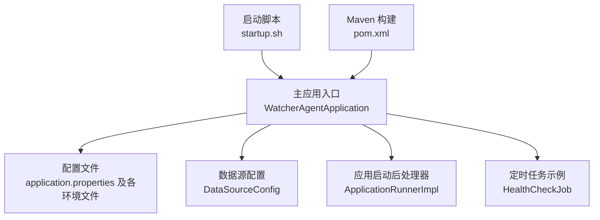
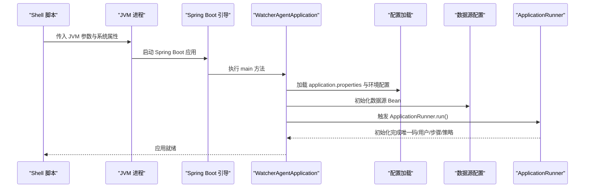
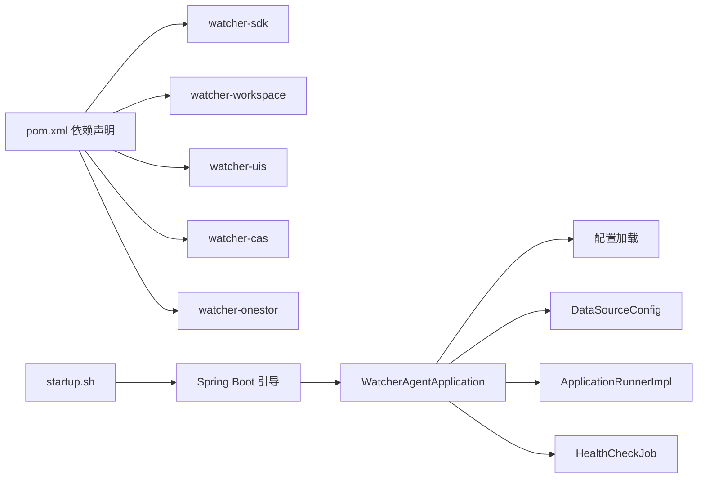

# 服务启动配置

<cite>
**本文引用的文件**
- [WatcherAgentApplication.java](file://watcher-agent/src/main/java/com/virtual/cloud/om/agent/WatcherAgentApplication.java)
- [application.properties](file://watcher-agent/src/main/resources/application.properties)
- [application-dev.properties](file://watcher-agent/src/main/resources/application-dev.properties)
- [application-prod.properties](file://watcher-agent/src/main/resources/application-prod.properties)
- [application-local.properties](file://watcher-agent/src/main/resources/application-local.properties)
- [application-test.properties](file://watcher-agent/src/main/resources/application-test.properties)
- [startup.sh](file://watcher-builder/assembly/bin/startup.sh)
- [DataSourceConfig.java](file://watcher-agent/src/main/java/com/virtual/cloud/om/agent/config/DataSourceConfig.java)
- [ApplicationRunnerImpl.java](file://watcher-agent/src/main/java/com/virtual/cloud/om/agent/config/ApplicationRunnerImpl.java)
- [HealthCheckJob.java](file://watcher-agent/src/main/java/com/virtual/cloud/om/agent/task/job/HealthCheckJob.java)
- [pom.xml](file://watcher-agent/pom.xml)
</cite>

## 目录
1. [简介](#简介)
2. [项目结构](#项目结构)
3. [核心组件](#核心组件)
4. [架构总览](#架构总览)
5. [详细组件分析](#详细组件分析)
6. [依赖关系分析](#依赖关系分析)
7. [性能考虑](#性能考虑)
8. [故障排查指南](#故障排查指南)
9. [结论](#结论)
10. [附录](#附录)

## 简介
本文件面向监控代理服务的启动与运行配置，围绕 WatcherAgentApplication 主类的 Spring Boot 启动配置进行系统化说明，涵盖：
- @SpringBootApplication 的 exclude 与 scanBasePackages 配置
- @EnableScheduling 定时任务调度启用
- @MapperScan MyBatis Mapper 接口扫描
- 不同环境配置文件的差异与覆盖规则
- 启动参数、JVM 参数与常见问题排查
- 定时任务与数据源初始化流程

## 项目结构
监控代理服务位于 watcher-agent 模块，采用多模块聚合结构，主应用入口通过 Spring Boot 启动，配置文件按环境分层管理，启动脚本统一在构建产物中提供。

图表来源
- [WatcherAgentApplication.java:14-18](file://watcher-agent/src/main/java/com/virtual/cloud/om/agent/WatcherAgentApplication.java#L14-L18)
- [application.properties:1-80](file://watcher-agent/src/main/resources/application.properties#L1-L80)
- [DataSourceConfig.java:15-46](file://watcher-agent/src/main/java/com/virtual/cloud/om/agent/config/DataSourceConfig.java#L15-L46)
- [ApplicationRunnerImpl.java:24-62](file://watcher-agent/src/main/java/com/virtual/cloud/om/agent/config/ApplicationRunnerImpl.java#L24-L62)
- [HealthCheckJob.java:15-34](file://watcher-agent/src/main/java/com/virtual/cloud/om/agent/task/job/HealthCheckJob.java#L15-L34)
- [startup.sh:78](file://watcher-builder/assembly/bin/startup.sh#L78)
- [pom.xml:14-136](file://watcher-agent/pom.xml#L14-L136)

章节来源
- [WatcherAgentApplication.java:14-18](file://watcher-agent/src/main/java/com/virtual/cloud/om/agent/WatcherAgentApplication.java#L14-L18)
- [application.properties:1-80](file://watcher-agent/src/main/resources/application.properties#L1-L80)
- [startup.sh:78](file://watcher-builder/assembly/bin/startup.sh#L78)
- [pom.xml:14-136](file://watcher-agent/pom.xml#L14-L136)

## 核心组件
- 主类与启动配置
  - @SpringBootApplication(exclude = QuartzAutoConfiguration.class) 显式排除 Quartz 自动配置，避免与现有调度体系冲突。
  - scanBasePackages 指定扫描范围覆盖 onestor、sdk、cas、uis、workspace、agent 等模块，确保跨模块组件被正确发现与装配。
  - @EnableScheduling 启用基于注解的定时任务。
  - @MapperScan("com.virtual.cloud.om.sdk.mapper") 扫描 SDK 模块中的 MyBatis Mapper 接口。
- 配置文件
  - application.properties 提供基础通用配置与默认激活环境。
  - application-{env}.properties 提供开发/测试/生产等环境差异化配置。
- 数据源与连接池
  - DataSourceConfig 使用 HikariCP，配置 MariaDB 驱动与连接参数，设置连接池大小与超时策略。
- 应用启动后初始化
  - ApplicationRunnerImpl 在应用启动后执行初始化逻辑，如生成代理唯一码、系统用户、步骤状态与密码策略。
- 定时任务
  - HealthCheckJob 展示了 @Async 与 @Scheduled 的组合使用，定期执行健康检查。

章节来源
- [WatcherAgentApplication.java:14-18](file://watcher-agent/src/main/java/com/virtual/cloud/om/agent/WatcherAgentApplication.java#L14-L18)
- [DataSourceConfig.java:15-46](file://watcher-agent/src/main/java/com/virtual/cloud/om/agent/config/DataSourceConfig.java#L15-L46)
- [ApplicationRunnerImpl.java:24-62](file://watcher-agent/src/main/java/com/virtual/cloud/om/agent/config/ApplicationRunnerImpl.java#L24-L62)
- [HealthCheckJob.java:15-34](file://watcher-agent/src/main/java/com/virtual/cloud/om/agent/task/job/HealthCheckJob.java#L15-L34)

## 架构总览
下图展示从启动脚本到应用主类、配置加载与初始化的整体流程：

图表来源
- [startup.sh:78](file://watcher-builder/assembly/bin/startup.sh#L78)
- [WatcherAgentApplication.java:24-27](file://watcher-agent/src/main/java/com/virtual/cloud/om/agent/WatcherAgentApplication.java#L24-L27)
- [application.properties:1-80](file://watcher-agent/src/main/resources/application.properties#L1-L80)
- [DataSourceConfig.java:27-45](file://watcher-agent/src/main/java/com/virtual/cloud/om/agent/config/DataSourceConfig.java#L27-L45)
- [ApplicationRunnerImpl.java:39-62](file://watcher-agent/src/main/java/com/virtual/cloud/om/agent/config/ApplicationRunnerImpl.java#L39-L62)

## 详细组件分析

### 主类与启动配置
- @SpringBootApplication(exclude = QuartzAutoConfiguration.class)
  - 明确排除 Quartz 自动配置，避免与项目内调度机制重复或冲突。
- scanBasePackages
  - 覆盖 onestor、sdk、cas、uis、workspace、agent 等模块包路径，确保跨模块组件被扫描与装配。
- @EnableScheduling
  - 启用基于注解的定时任务，结合 @Scheduled 与 @Async 实现异步调度。
- @MapperScan("com.virtual.cloud.om.sdk.mapper")
  - 指定 MyBatis Mapper 接口扫描路径，确保 SQL 映射正确加载。

章节来源
- [WatcherAgentApplication.java:14-18](file://watcher-agent/src/main/java/com/virtual/cloud/om/agent/WatcherAgentApplication.java#L14-L18)

### 配置文件与环境差异
- application.properties（基础配置）
  - 指定 server 端口、上下文路径、应用名称、watcher.home 等基础信息。
  - 开启 Actuator 管理端点，设置中间件与插件模块开关，关闭 ES/Kafka/MongoDB/ClickHouse/Quartz 等组件。
  - 配置 MySQL 数据源与 MyBatis-Plus 参数，设置插件服务地址占位符。
- application-dev.properties（开发环境）
  - 激活 dev 环境标识，配置 MongoDB、Kafka、ES、ClickHouse 等中间件连接信息。
  - 设置 rest-client.*.enable 开关与各插件服务端口变量，支持通过环境变量覆盖。
- application-test.properties（测试环境）
  - 类似 dev，但指向测试集群地址与账号配置。
- application-prod.properties（生产环境）
  - 激活 prod 环境标识，配置生产集群中间件连接信息与端口变量。
  - 设置批处理日志根路径等生产相关参数。

章节来源
- [application.properties:1-80](file://watcher-agent/src/main/resources/application.properties#L1-L80)
- [application-dev.properties:1-72](file://watcher-agent/src/main/resources/application-dev.properties#L1-L72)
- [application-test.properties:1-66](file://watcher-agent/src/main/resources/application-test.properties#L1-L66)
- [application-prod.properties:1-70](file://watcher-agent/src/main/resources/application-prod.properties#L1-L70)

### 启动脚本与启动参数
- 启动脚本位置与职责
  - startup.sh 负责检测 Java 版本、准备日志目录、设置 GC 与内存参数，并以 nohup 方式启动 agent.jar。
- 关键 JVM 与系统参数
  - -Dloader.path：指定动态加载路径（lib、plugins、conf）。
  - -Dspring.profiles.active：设置激活的 Spring Profile（如 prod）。
  - -Dspring.config.location：指定外部配置目录。
  - -Dwatcher.home：设置 watcher 根目录。
  - -Djdk.crypto.KeyAgreement.legacyKDF=true：兼容加密协议。
  - -noverify：跳过字节码验证（可选）。
  - -Xdebug -Xrunjdwp：开启远程调试（可选）。
  - -Xmx/-Xms：堆大小设置（示例值见脚本）。
  - -Xloggc、-XX:+HeapDumpOnOutOfMemoryError：GC 日志与 OOM 堆转储路径。
- 运行方式
  - 使用 nohup 后台启动，输出错误日志至 ERROR_OUT 文件，进程标志用于进程识别。

章节来源
- [startup.sh:78](file://watcher-builder/assembly/bin/startup.sh#L78)

### 数据源配置与连接池
- DataSourceConfig
  - 使用 HikariCP 作为连接池，设置 JDBC URL、用户名、密码与驱动（MariaDB）。
  - 连接池参数：最大池大小、最小空闲、连接超时、空闲超时、最大生存时间。
  - MariaDB 连接属性：禁用 SSL、允许公钥检索、设置时区。

章节来源
- [DataSourceConfig.java:15-46](file://watcher-agent/src/main/java/com/virtual/cloud/om/agent/config/DataSourceConfig.java#L15-L46)

### 应用启动后初始化
- ApplicationRunnerImpl.run()
  - 依次执行：初始化代理唯一码、系统用户、步骤状态、密码策略。
  - 使用 Mapper 接口访问数据库，插入或更新必要初始数据。
  - 异常被捕获并打印，保证应用启动不中断。

章节来源
- [ApplicationRunnerImpl.java:24-62](file://watcher-agent/src/main/java/com/virtual/cloud/om/agent/config/ApplicationRunnerImpl.java#L24-L62)

### 定时任务
- HealthCheckJob
  - 使用 @Async 异步执行，@Scheduled 固定速率与初始延迟配置。
  - 定期调用 DeployApi 执行健康检查，体现定时任务与业务 API 的集成。

章节来源
- [HealthCheckJob.java:15-34](file://watcher-agent/src/main/java/com/virtual/cloud/om/agent/task/job/HealthCheckJob.java#L15-L34)

## 依赖关系分析
- 模块依赖
  - watcher-agent 依赖 watcher-sdk、watcher-workspace、watcher-uis、watcher-cas、watcher-onestor 等模块。
  - Maven 插件负责打包与资源复制，最终生成 agent.jar 并输出 conf 目录。
- 启动依赖链
  - 启动脚本 -> Spring Boot 引导 -> 主类 -> 配置加载 -> 数据源 -> 初始化器 -> 定时任务。

图表来源
- [pom.xml:24-50](file://watcher-agent/pom.xml#L24-L50)
- [startup.sh:78](file://watcher-builder/assembly/bin/startup.sh#L78)
- [WatcherAgentApplication.java:24-27](file://watcher-agent/src/main/java/com/virtual/cloud/om/agent/WatcherAgentApplication.java#L24-L27)

章节来源
- [pom.xml:24-50](file://watcher-agent/pom.xml#L24-L50)
- [startup.sh:78](file://watcher-builder/assembly/bin/startup.sh#L78)

## 性能考虑
- JVM 参数建议
  - 堆大小：根据实际负载调整 -Xmx 与 -Xms，避免频繁 Full GC。
  - GC 日志：开启 -Xloggc 并配合 GC 日志轮转参数，便于定位 GC 抖动。
  - OOM 堆转储：启用 -XX:+HeapDumpOnOutOfMemoryError，收集异常现场。
  - 连接池：合理设置 HikariCP 最大池大小与超时，避免连接泄漏与饥饿。
- 定时任务
  - 使用 @Async 与合适的调度间隔，避免阻塞主线程；对耗时任务拆分或限流。
- 配置加载
  - 将敏感配置置于外部配置目录并通过 -Dspring.config.location 指定，减少打包耦合。

## 故障排查指南
- 启动失败（找不到 Java 或版本过低）
  - 现象：脚本报错提示未安装 Java 或版本低于要求。
  - 处理：安装 JDK 1.8+，确认 PATH 或 JAVA_HOME 正确。
- 配置未生效
  - 现象：期望的环境配置未加载。
  - 处理：确认 -Dspring.profiles.active 与 -Dspring.config.location 是否正确；检查 application-{env}.properties 是否存在且命名规范。
- 数据库连接异常
  - 现象：应用启动时报数据库连接失败。
  - 处理：核对 spring.datasource.* 配置与网络连通性；检查 MariaDB 驱动与连接属性。
- 定时任务未执行
  - 现象：@Scheduled 注解的任务未触发。
  - 处理：确认 @EnableScheduling 已启用；检查 @Async 与线程池配置；验证任务类被 Spring 管理。
- 初始化失败
  - 现象：ApplicationRunnerImpl 初始化阶段抛出异常。
  - 处理：查看错误日志，确认数据库表结构与权限；逐个捕获异常分支定位问题。

章节来源
- [startup.sh:78](file://watcher-builder/assembly/bin/startup.sh#L78)
- [application.properties:1-80](file://watcher-agent/src/main/resources/application.properties#L1-L80)
- [DataSourceConfig.java:15-46](file://watcher-agent/src/main/java/com/virtual/cloud/om/agent/config/DataSourceConfig.java#L15-L46)
- [ApplicationRunnerImpl.java:39-62](file://watcher-agent/src/main/java/com/virtual/cloud/om/agent/config/ApplicationRunnerImpl.java#L39-L62)
- [HealthCheckJob.java:29-33](file://watcher-agent/src/main/java/com/virtual/cloud/om/agent/task/job/HealthCheckJob.java#L29-L33)

## 结论
本文系统梳理了监控代理服务的启动配置，明确了主类的 Spring Boot 启动参数、包扫描范围、定时任务与 MyBatis Mapper 扫描策略，以及不同环境配置文件的差异与覆盖规则。结合启动脚本参数与数据源配置，可帮助运维与开发人员快速部署、调优与排障。

## 附录

### 配置文件优先级与覆盖规则
- 激活 profile 与配置位置
  - 通过 -Dspring.profiles.active 指定激活的环境（如 dev/test/prod/local），对应加载 application-{profile}.properties。
  - 通过 -Dspring.config.location 指定外部配置目录，优先于 jar 内 resources。
- 覆盖顺序（从高到低）
  - 命令行参数（-Dspring.config.location、-Dspring.profiles.active 等）
  - 外部配置目录（spring.config.location 指向的目录）
  - application.properties（jar 内 resources）
  - application-{profile}.properties（jar 内 resources）

章节来源
- [application.properties:1-80](file://watcher-agent/src/main/resources/application.properties#L1-L80)
- [application-dev.properties:1-72](file://watcher-agent/src/main/resources/application-dev.properties#L1-L72)
- [application-test.properties:1-66](file://watcher-agent/src/main/resources/application-test.properties#L1-L66)
- [application-prod.properties:1-70](file://watcher-agent/src/main/resources/application-prod.properties#L1-L70)
- [startup.sh:78](file://watcher-builder/assembly/bin/startup.sh#L78)