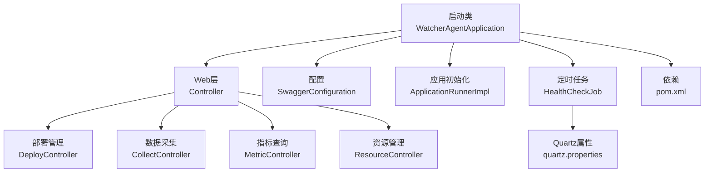
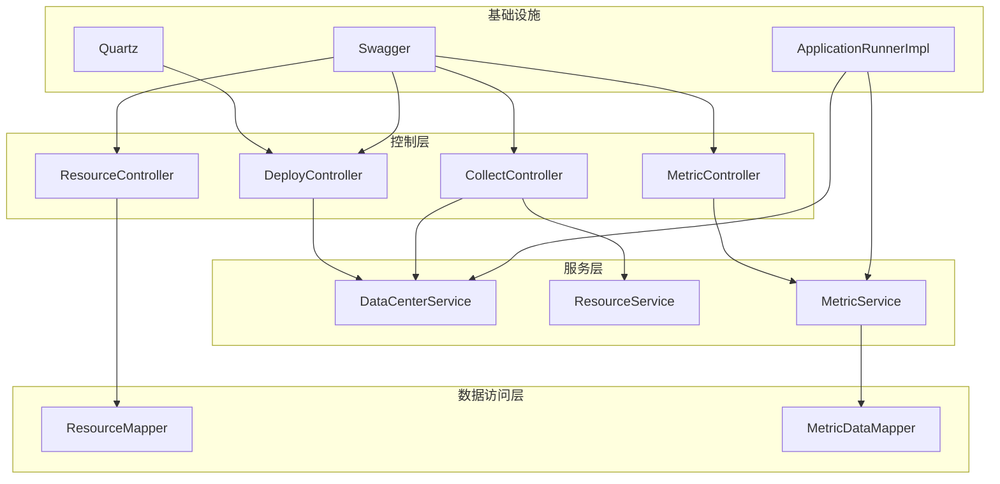
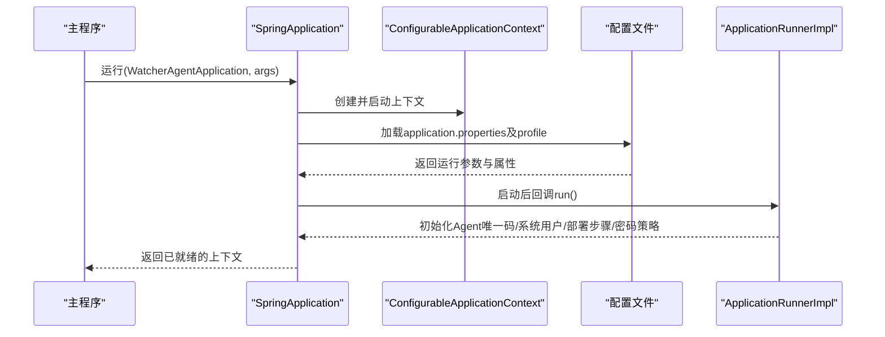
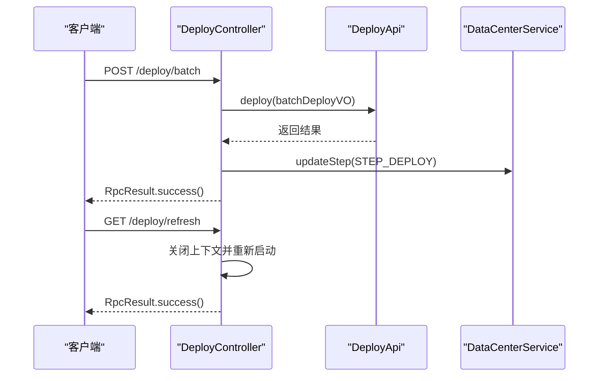
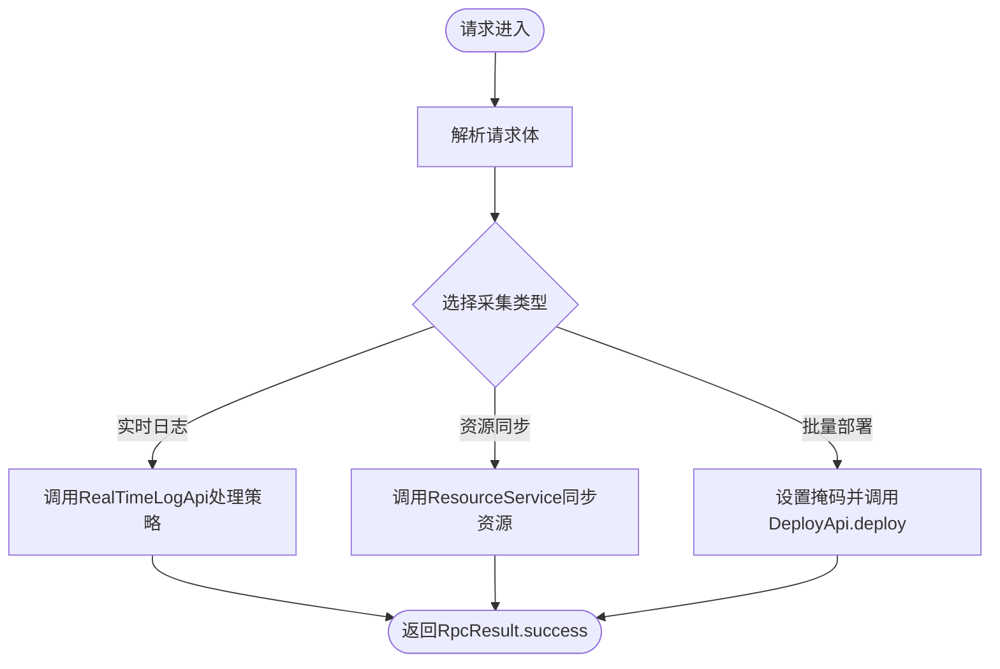
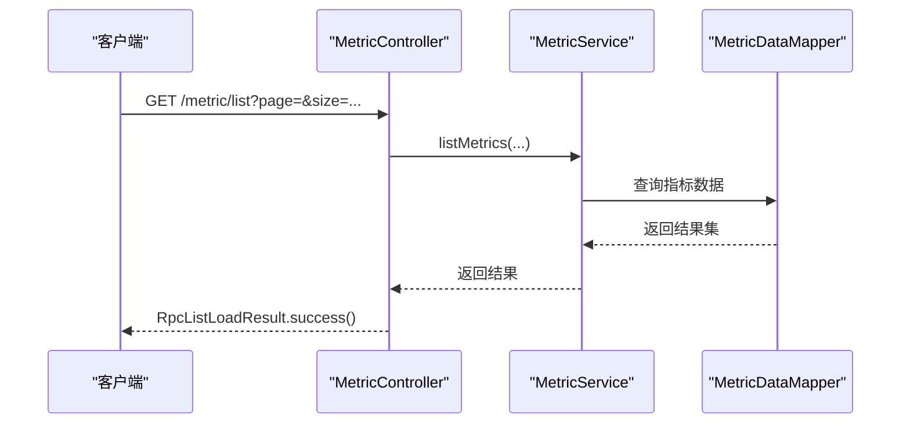
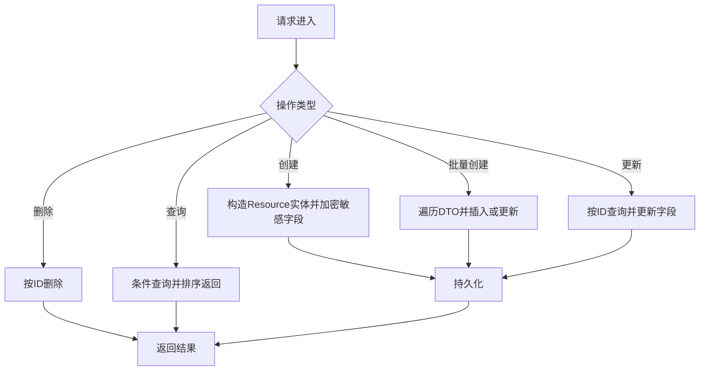
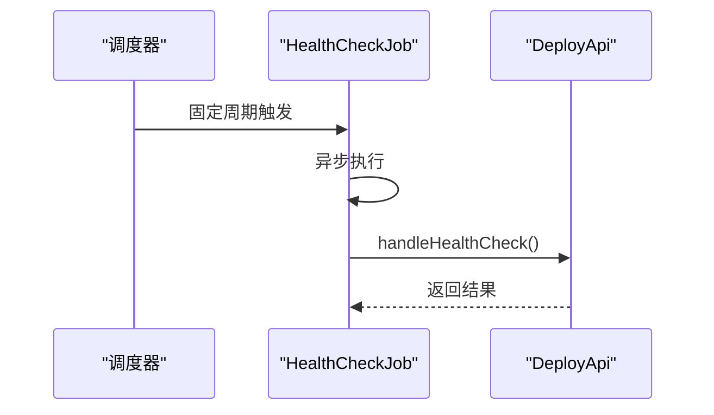
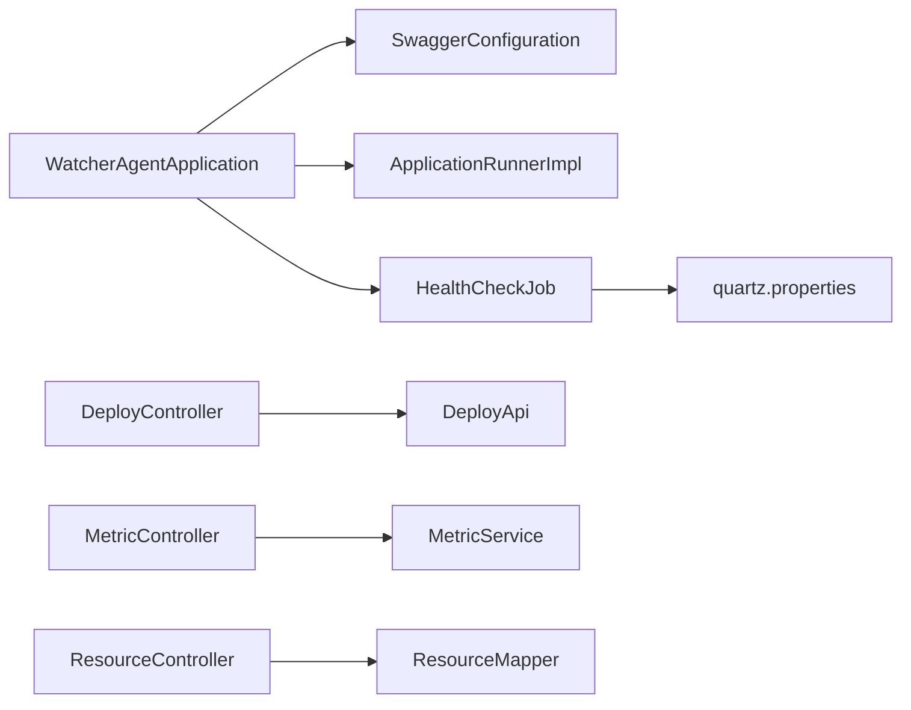

# 监控代理服务

<cite>
**本文引用的文件**
- [WatcherAgentApplication.java](file://watcher-agent/src/main/java/com/virtual/cloud/om/agent/WatcherAgentApplication.java)
- [pom.xml](file://watcher-agent/pom.xml)
- [application.properties](file://watcher-agent/src/main/resources/application.properties)
- [application-dev.properties](file://watcher-agent/src/main/resources/application-dev.properties)
- [application-prod.properties](file://watcher-agent/src/main/resources/application-prod.properties)
- [DeployController.java](file://watcher-agent/src/main/java/com/virtual/cloud/om/agent/controller/DeployController.java)
- [CollectController.java](file://watcher-agent/src/main/java/com/virtual/cloud/om/agent/controller/CollectController.java)
- [MetricController.java](file://watcher-agent/src/main/java/com/virtual/cloud/om/agent/controller/MetricController.java)
- [ResourceController.java](file://watcher-agent/src/main/java/com/virtual/cloud/om/agent/controller/ResourceController.java)
- [ApplicationRunnerImpl.java](file://watcher-agent/src/main/java/com/virtual/cloud/om/agent/config/ApplicationRunnerImpl.java)
- [quartz.properties](file://watcher-agent/src/main/resources/quartz.properties)
- [SwaggerConfiguration.java](file://watcher-agent/src/main/java/com/virtual/cloud/om/agent/config/SwaggerConfiguration.java)
- [HealthCheckJob.java](file://watcher-agent/src/main/java/com/virtual/cloud/om/agent/task/job/HealthCheckJob.java)
</cite>

## 目录
1. [简介](#简介)
2. [项目结构](#项目结构)
3. [核心组件](#核心组件)
4. [架构总览](#架构总览)
5. [详细组件分析](#详细组件分析)
6. [依赖分析](#依赖分析)
7. [性能考虑](#性能考虑)
8. [故障排查指南](#故障排查指南)
9. [结论](#结论)
10. [附录](#附录)

## 简介
本文件面向监控代理服务（watcher-agent），系统性梳理其启动流程与Spring Boot配置、核心架构设计（数据采集、部署管理、定时任务调度、WebSocket实时通信）、控制器职责划分，并提供扩展新采集器、配置定时任务与处理WebSocket消息的实践路径。同时给出服务启动参数、配置文件说明与常见问题排查建议。

## 项目结构
watcher-agent采用标准Spring Boot工程结构，核心入口类位于com虚拟云om.agent包下，控制器、配置、任务与资源文件分层组织。主要特性包括：
- 启动类启用定时任务与MyBatis Mapper扫描，排除Quartz自动装配以自管调度。
- 控制器按功能域拆分：部署管理、数据采集、指标查询、资源管理等。
- 使用Quartz配置文件进行线程池与作业存储配置；通过Swagger生成API文档。
- Maven聚合依赖包含SDK、工作空间、UI、CAS、OneStor等模块，以及Web、Actuator、WebSocket等基础设施。

**图表来源**
- [WatcherAgentApplication.java:14-27](file://watcher-agent/src/main/java/com/virtual/cloud/om/agent/WatcherAgentApplication.java#L14-L27)
- [SwaggerConfiguration.java:21-37](file://watcher-agent/src/main/java/com/virtual/cloud/om/agent/config/SwaggerConfiguration.java#L21-L37)
- [ApplicationRunnerImpl.java:24-62](file://watcher-agent/src/main/java/com/virtual/cloud/om/agent/config/ApplicationRunnerImpl.java#L24-L62)
- [HealthCheckJob.java:15-34](file://watcher-agent/src/main/java/com/virtual/cloud/om/agent/task/job/HealthCheckJob.java#L15-L34)
- [quartz.properties:1-45](file://watcher-agent/src/main/resources/quartz.properties#L1-L45)
- [pom.xml:14-136](file://watcher-agent/pom.xml#L14-L136)

**章节来源**
- [WatcherAgentApplication.java:14-27](file://watcher-agent/src/main/java/com/virtual/cloud/om/agent/WatcherAgentApplication.java#L14-L27)
- [pom.xml:14-136](file://watcher-agent/pom.xml#L14-L136)

## 核心组件
- 启动类与Spring Boot配置
  - 启用定时任务与MyBatis Mapper扫描，排除Quartz自动装配，自定义扫描包范围。
  - 主函数启动上下文并保存引用，便于远程刷新应用。
- 应用初始化器
  - 在应用启动后执行一次性初始化：生成Agent唯一码、初始化系统用户、部署步骤与密码策略。
- 定时任务
  - 健康检查任务每2分钟执行一次，异步调度，调用部署API执行健康检查逻辑。
- Quartz配置
  - 提供线程池大小、集群模式等基础配置项，用于作业调度。
- Swagger配置
  - 生成REST API文档，限定扫描包范围，便于联调与测试。

**章节来源**
- [WatcherAgentApplication.java:14-27](file://watcher-agent/src/main/java/com/virtual/cloud/om/agent/WatcherAgentApplication.java#L14-L27)
- [ApplicationRunnerImpl.java:24-120](file://watcher-agent/src/main/java/com/virtual/cloud/om/agent/config/ApplicationRunnerImpl.java#L24-L120)
- [HealthCheckJob.java:15-34](file://watcher-agent/src/main/java/com/virtual/cloud/om/agent/task/job/HealthCheckJob.java#L15-L34)
- [quartz.properties:1-45](file://watcher-agent/src/main/resources/quartz.properties#L1-L45)
- [SwaggerConfiguration.java:21-49](file://watcher-agent/src/main/java/com/virtual/cloud/om/agent/config/SwaggerConfiguration.java#L21-L49)

## 架构总览
监控代理服务围绕“控制器-服务-数据访问”三层展开，结合定时任务与WebSocket能力，形成完整的采集、上报与运维闭环。

**图表来源**
- [DeployController.java:36-324](file://watcher-agent/src/main/java/com/virtual/cloud/om/agent/controller/DeployController.java#L36-L324)
- [CollectController.java:30-66](file://watcher-agent/src/main/java/com/virtual/cloud/om/agent/controller/CollectController.java#L30-L66)
- [MetricController.java:24-102](file://watcher-agent/src/main/java/com/virtual/cloud/om/agent/controller/MetricController.java#L24-L102)
- [ResourceController.java:28-234](file://watcher-agent/src/main/java/com/virtual/cloud/om/agent/controller/ResourceController.java#L28-L234)
- [ApplicationRunnerImpl.java:24-120](file://watcher-agent/src/main/java/com/virtual/cloud/om/agent/config/ApplicationRunnerImpl.java#L24-L120)
- [SwaggerConfiguration.java:21-49](file://watcher-agent/src/main/java/com/virtual/cloud/om/agent/config/SwaggerConfiguration.java#L21-L49)

## 详细组件分析

### 启动流程与Spring Boot配置
- 启动类注解解析
  - @SpringBootApplication(exclude = QuartzAutoConfiguration.class)：显式排除Quartz自动配置，避免与自定义调度冲突。
  - @EnableScheduling：启用基于注解的定时任务。
  - @MapperScan("com.virtual.cloud.om.sdk.mapper")：指定MyBatis Mapper扫描包，确保SQL映射加载。
  - scanBasePackages：限定组件扫描范围，减少启动开销。
- 上下文管理
  - 保存args与上下文引用，支持远程刷新应用。
- 配置文件要点
  - application.properties：端口、上下文路径、Actuator暴露、中间件开关、数据库连接、MyBatis-Plus配置、插件服务地址、批采集日志目录等。
  - application-dev/prod：按环境覆盖MongoDB/Kafka/ES/ClickHouse等外部组件配置，以及各插件服务地址与端口变量。

**图表来源**
- [WatcherAgentApplication.java:24-27](file://watcher-agent/src/main/java/com/virtual/cloud/om/agent/WatcherAgentApplication.java#L24-L27)
- [ApplicationRunnerImpl.java:39-62](file://watcher-agent/src/main/java/com/virtual/cloud/om/agent/config/ApplicationRunnerImpl.java#L39-L62)
- [application.properties:1-80](file://watcher-agent/src/main/resources/application.properties#L1-L80)

**章节来源**
- [WatcherAgentApplication.java:14-27](file://watcher-agent/src/main/java/com/virtual/cloud/om/agent/WatcherAgentApplication.java#L14-L27)
- [application.properties:1-80](file://watcher-agent/src/main/resources/application.properties#L1-L80)
- [application-dev.properties:1-72](file://watcher-agent/src/main/resources/application-dev.properties#L1-L72)
- [application-prod.properties:1-70](file://watcher-agent/src/main/resources/application-prod.properties#L1-L70)

### 部署管理功能（DeployController）
- 职责边界
  - 支持单节点/多节点部署、组件服务管理、节点状态查询、网络配置与路由管理、重启应用、主机信息查询等。
- 关键接口
  - POST /deploy/batch：批量部署
  - POST /deploy/single：单节点部署
  - GET /deploy：查询部署状态
  - PUT /deploy/manage：组件服务管理
  - GET /deploy/refresh：刷新应用（关闭并重新启动）
  - GET /deploy/host：查询主机信息
  - GET /deploy/localIps：查询本地IP集合
  - PUT /deploy/keepalived/notify/{masterOrBackup}：主备通知
  - PUT /deploy/step：更新部署步骤
  - GET/POST /deploy/network：配置/查询本地网卡
  - PUT /deploy/network：编辑外网网卡
  - GET /deploy/network/master：检查是否为主节点
  - GET /deploy/network/config/nodes：获取所有节点网络配置
  - GET /deploy/network/config/node：获取指定节点网络配置
  - GET /deploy/network/wifis：获取WiFi列表
  - POST /deploy/route：路由增删改查与连通性检测

**图表来源**
- [DeployController.java:46-102](file://watcher-agent/src/main/java/com/virtual/cloud/om/agent/controller/DeployController.java#L46-L102)
- [DeployController.java:118-137](file://watcher-agent/src/main/java/com/virtual/cloud/om/agent/controller/DeployController.java#L118-L137)

**章节来源**
- [DeployController.java:36-324](file://watcher-agent/src/main/java/com/virtual/cloud/om/agent/controller/DeployController.java#L36-L324)

### 数据采集功能（CollectController）
- 职责边界
  - 提供实时日志上报策略下发、资源同步与批量部署入口。
- 关键接口
  - POST /collect/realtime-log：接收实时日志策略并委托RealTimeLogApi处理
  - POST /collect/resources：批量同步资源到资源服务
  - POST /collect/batch：批量部署入口（设置掩码并调用DeployApi）

**图表来源**
- [CollectController.java:45-65](file://watcher-agent/src/main/java/com/virtual/cloud/om/agent/controller/CollectController.java#L45-L65)

**章节来源**
- [CollectController.java:30-66](file://watcher-agent/src/main/java/com/virtual/cloud/om/agent/controller/CollectController.java#L30-L66)

### 指标查询功能（MetricController）
- 职责边界
  - 提供指标类型、平台类型查询，指标列表、最新值、趋势、汇总查询，以及指标数据上报接口。
- 关键接口
  - GET /metric/types：查询支持的指标类型
  - GET /metric/platforms：查询支持的平台类型
  - GET /metric/list：分页查询指标列表
  - GET /metric/latest/{resourceId}：查询资源最新指标
  - GET /metric/trend/{resourceId}/{metricType}：查询指标趋势
  - POST /metric/report：上报指标数据
  - GET /metric/summary/{resourceId}：获取资源指标汇总

**图表来源**
- [MetricController.java:41-57](file://watcher-agent/src/main/java/com/virtual/cloud/om/agent/controller/MetricController.java#L41-L57)

**章节来源**
- [MetricController.java:24-102](file://watcher-agent/src/main/java/com/virtual/cloud/om/agent/controller/MetricController.java#L24-L102)

### 资源管理功能（ResourceController）
- 职责边界
  - 提供资源的增删改查、批量创建、可用状态与SSH权限更新。
- 关键接口
  - GET /resource/list：条件查询资源列表
  - GET /resource/detail/{id}：查询资源详情
  - POST /resource/create：创建资源（含加密字段处理）
  - POST /resource/batchCreate：批量创建或更新资源
  - PUT /resource/update：更新资源
  - DELETE /resource/delete/{id}：删除资源
  - PUT /resource/usable/{id}：更新资源可用状态
  - PUT /resource/remote/{id}：更新SSH权限

**图表来源**
- [ResourceController.java:67-135](file://watcher-agent/src/main/java/com/virtual/cloud/om/agent/controller/ResourceController.java#L67-L135)

**章节来源**
- [ResourceController.java:28-234](file://watcher-agent/src/main/java/com/virtual/cloud/om/agent/controller/ResourceController.java#L28-L234)

### 定时任务调度机制
- 健康检查任务
  - 使用@Scheduled配置初始延迟与固定周期，@Async异步执行，降低对主线程影响。
  - 触发逻辑委托给DeployApi的健康检查方法。
- Quartz配置
  - 提供线程池大小、集群模式等基础配置，便于扩展更多作业。

**图表来源**
- [HealthCheckJob.java:29-33](file://watcher-agent/src/main/java/com/virtual/cloud/om/agent/task/job/HealthCheckJob.java#L29-L33)
- [quartz.properties:15-40](file://watcher-agent/src/main/resources/quartz.properties#L15-L40)

**章节来源**
- [HealthCheckJob.java:15-34](file://watcher-agent/src/main/java/com/virtual/cloud/om/agent/task/job/HealthCheckJob.java#L15-L34)
- [quartz.properties:1-45](file://watcher-agent/src/main/resources/quartz.properties#L1-L45)

### WebSocket实时通信
- 依赖与能力
  - 工程引入spring-boot-starter-websocket与Java-WebSocket依赖，具备构建WebSocket服务端与客户端的能力。
- 实现建议
  - 可在现有控制器或新增控制器中集成WebSocket端点，结合SDK中的推送类型枚举与用户类型枚举，实现指标/告警/日志的实时推送。
  - 建议使用Spring WebSocket配置类注册端点与消息转换器，并在业务层通过消息DTO进行编解码与路由。

**章节来源**
- [pom.xml:70-84](file://watcher-agent/pom.xml#L70-L84)

### 扩展指南（示例路径）
- 扩展新的监控采集器
  - 在watcher-sdk中实现采集器接口与处理器，参考现有OneStor/SDK相关组件，遵循统一的采集协议与数据模型。
  - 在watcher-agent中通过API或任务调度调用采集器，将采集结果写入指标表并通过MetricController对外提供查询。
  - 参考路径：[DataReportCollector接口](file://watcher-sdk/src/main/java/com/virtual/cloud/om/sdk/api/DataReportCollector.java)
- 配置定时任务
  - 新建@Component类，使用@Scheduled配置触发策略，必要时配合@Async异步执行。
  - 参考路径：[HealthCheckJob:15-34](file://watcher-agent/src/main/java/com/virtual/cloud/om/agent/task/job/HealthCheckJob.java#L15-L34)
- 处理WebSocket消息
  - 在控制器或专用WebSocket组件中解析消息DTO，结合推送类型枚举进行路由与转发。
  - 参考路径：[WebsocketPushTypeEnum](file://watcher-sdk/src/main/java/com/virtual/cloud/om/sdk/constant/WebsocketPushTypeEnum.java)

**章节来源**
- [HealthCheckJob.java:15-34](file://watcher-agent/src/main/java/com/virtual/cloud/om/agent/task/job/HealthCheckJob.java#L15-L34)
- [pom.xml:70-84](file://watcher-agent/pom.xml#L70-L84)

## 依赖分析
- 启动类与配置
  - 启动类排除Quartz自动配置，避免与自定义调度冲突；开启定时任务与Mapper扫描。
  - 配置文件按环境拆分，集中管理外部组件与服务地址。
- 控制器与服务
  - 控制器通过@Autowired注入服务层与API接口，实现业务编排与数据持久化。
- Quartz与Swagger
  - Quartz提供作业调度能力；Swagger提供API文档生成与调试。

**图表来源**
- [WatcherAgentApplication.java:14-27](file://watcher-agent/src/main/java/com/virtual/cloud/om/agent/WatcherAgentApplication.java#L14-L27)
- [SwaggerConfiguration.java:21-49](file://watcher-agent/src/main/java/com/virtual/cloud/om/agent/config/SwaggerConfiguration.java#L21-L49)
- [ApplicationRunnerImpl.java:24-120](file://watcher-agent/src/main/java/com/virtual/cloud/om/agent/config/ApplicationRunnerImpl.java#L24-L120)
- [HealthCheckJob.java:15-34](file://watcher-agent/src/main/java/com/virtual/cloud/om/agent/task/job/HealthCheckJob.java#L15-L34)
- [quartz.properties:1-45](file://watcher-agent/src/main/resources/quartz.properties#L1-L45)
- [DeployController.java:36-324](file://watcher-agent/src/main/java/com/virtual/cloud/om/agent/controller/DeployController.java#L36-L324)
- [MetricController.java:24-102](file://watcher-agent/src/main/java/com/virtual/cloud/om/agent/controller/MetricController.java#L24-L102)
- [ResourceController.java:28-234](file://watcher-agent/src/main/java/com/virtual/cloud/om/agent/controller/ResourceController.java#L28-L234)

**章节来源**
- [WatcherAgentApplication.java:14-27](file://watcher-agent/src/main/java/com/virtual/cloud/om/agent/WatcherAgentApplication.java#L14-L27)
- [pom.xml:14-136](file://watcher-agent/pom.xml#L14-L136)

## 性能考虑
- 定时任务
  - 使用@Async异步执行，避免阻塞调度线程；合理设置initialDelay与fixedRate，避免高并发抖动。
- 数据库与缓存
  - MyBatis-Plus配置驼峰映射与日志实现，便于诊断；建议在高频查询场景引入Redis缓存热点指标。
- 线程池与队列
  - Quartz线程池大小需结合任务数量与CPU核数评估；对IO密集型任务可适当增大线程数。
- 日志与监控
  - Actuator暴露关键指标，结合日志级别控制与采样策略，避免生产环境日志风暴。

## 故障排查指南
- 启动失败
  - 检查application.properties与profile配置是否正确；确认数据库连接、驱动与MyBatis-Plus配置。
  - 参考路径：[application.properties:1-80](file://watcher-agent/src/main/resources/application.properties#L1-L80)
- 定时任务不执行
  - 确认@EnableScheduling已生效；检查@Scheduled配置与线程池设置；查看HealthCheckJob日志。
  - 参考路径：[HealthCheckJob.java:15-34](file://watcher-agent/src/main/java/com/virtual/cloud/om/agent/task/job/HealthCheckJob.java#L15-L34)，[quartz.properties:1-45](file://watcher-agent/src/main/resources/quartz.properties#L1-L45)
- API无法访问
  - 检查Swagger配置与端口、上下文路径；确认跨域设置与安全拦截器。
  - 参考路径：[SwaggerConfiguration.java:21-49](file://watcher-agent/src/main/java/com/virtual/cloud/om/agent/config/SwaggerConfiguration.java#L21-L49)
- 部署与网络配置异常
  - 使用DeployController提供的网络配置接口进行验证；检查命令执行返回与日志输出。
  - 参考路径：[DeployController.java:139-180](file://watcher-agent/src/main/java/com/virtual/cloud/om/agent/controller/DeployController.java#L139-L180)
- 指标查询为空
  - 核对指标上报接口与数据落库情况；检查MetricController查询参数与Mapper映射。
  - 参考路径：[MetricController.java:41-57](file://watcher-agent/src/main/java/com/virtual/cloud/om/agent/controller/MetricController.java#L41-L57)

**章节来源**
- [application.properties:1-80](file://watcher-agent/src/main/resources/application.properties#L1-L80)
- [HealthCheckJob.java:15-34](file://watcher-agent/src/main/java/com/virtual/cloud/om/agent/task/job/HealthCheckJob.java#L15-L34)
- [quartz.properties:1-45](file://watcher-agent/src/main/resources/quartz.properties#L1-L45)
- [SwaggerConfiguration.java:21-49](file://watcher-agent/src/main/java/com/virtual/cloud/om/agent/config/SwaggerConfiguration.java#L21-L49)
- [DeployController.java:139-180](file://watcher-agent/src/main/java/com/virtual/cloud/om/agent/controller/DeployController.java#L139-L180)
- [MetricController.java:41-57](file://watcher-agent/src/main/java/com/virtual/cloud/om/agent/controller/MetricController.java#L41-L57)

## 结论
watcher-agent通过清晰的启动配置、模块化的控制器设计、完善的初始化流程与定时任务机制，构建了稳定可靠的监控采集与运维支撑体系。结合Swagger与丰富的配置文件，开发者可快速扩展采集器、配置调度任务与实现WebSocket实时通信，满足多样化的监控需求。

## 附录
- 服务启动参数
  - JVM与Spring Profile：通过-Dspring.profiles.active与-Dserver.port等参数调整运行环境。
  - 上下文路径：server.servlet.context-path=/watcher
- 配置文件说明
  - application.properties：通用配置、Actuator、中间件开关、数据库与MyBatis-Plus、插件服务地址、批采集日志目录等。
  - application-dev/prod.properties：按环境覆盖外部组件与服务地址，便于CI/CD部署。
- 常见问题
  - 启动失败：检查数据库连接与MyBatis-Plus配置。
  - 定时任务不执行：确认@EnableScheduling与@Async配置。
  - API不可用：检查端口、上下文路径与跨域设置。
  - 部署与网络异常：使用DeployController网络配置接口进行验证。
  - 指标查询为空：核对上报接口与数据落库情况。

**章节来源**
- [application.properties:1-80](file://watcher-agent/src/main/resources/application.properties#L1-L80)
- [application-dev.properties:1-72](file://watcher-agent/src/main/resources/application-dev.properties#L1-L72)
- [application-prod.properties:1-70](file://watcher-agent/src/main/resources/application-prod.properties#L1-L70)