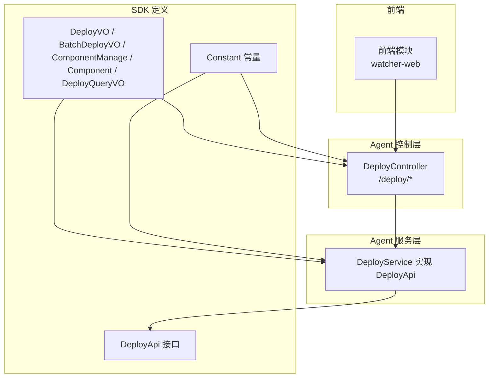
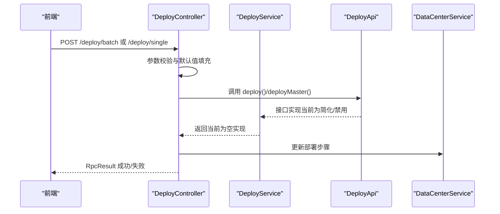
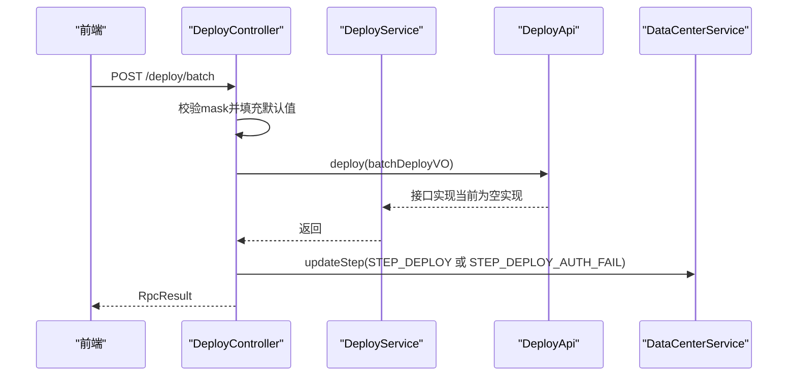
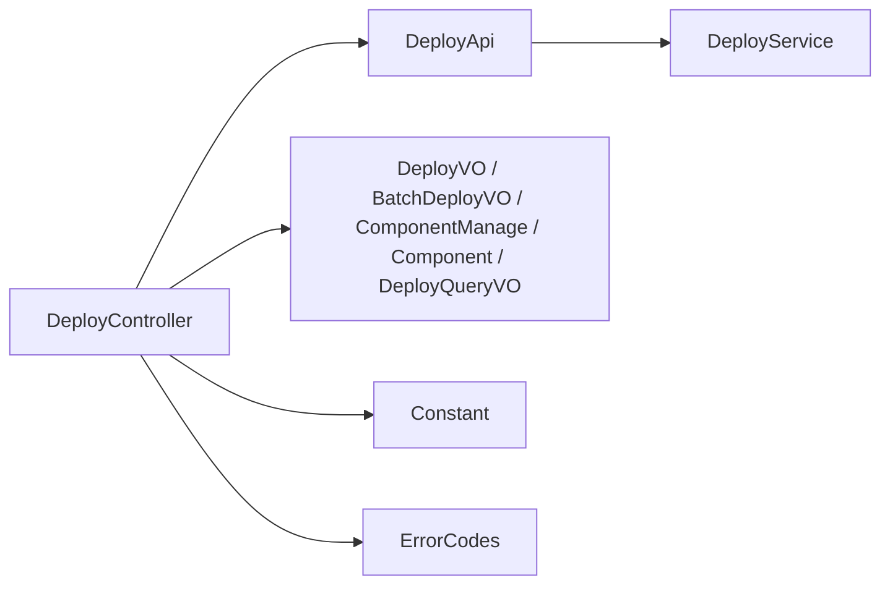

# 组件部署管理

<cite>
**本文引用的文件**
- [DeployController.java](file://watcher-agent/src/main/java/com/virtual/cloud/om/agent/controller/DeployController.java)
- [DeployService.java](file://watcher-agent/src/main/java/com/virtual/cloud/om/agent/service/deploy/DeployService.java)
- [DeployApi.java](file://watcher-sdk/src/main/java/com/virtual/cloud/om/sdk/api/DeployApi.java)
- [DeployVO.java](file://watcher-sdk/src/main/java/com/virtual/cloud/om/sdk/dto/deploy/DeployVO.java)
- [BatchDeployVO.java](file://watcher-sdk/src/main/java/com/virtual/cloud/om/sdk/dto/deploy/BatchDeployVO.java)
- [ComponentManage.java](file://watcher-sdk/src/main/java/com/virtual/cloud/om/sdk/dto/deploy/ComponentManage.java)
- [Component.java](file://watcher-sdk/src/main/java/com/virtual/cloud/om/sdk/dto/deploy/Component.java)
- [DeployQueryVO.java](file://watcher-sdk/src/main/java/com/virtual/cloud/om/sdk/dto/deploy/DeployQueryVO.java)
- [index.ts](file://watcher-web/src/api/deploy/index.ts)
- [Constant.java](file://watcher-sdk/src/main/java/com/virtual/cloud/om/sdk/constant/Constant.java)
- [ErrorCodes.java](file://watcher-sdk/src/main/java/com/virtual/cloud/om/sdk/exception/ErrorCodes.java)
- [DataReportService.java](file://watcher-agent/src/main/java/com/virtual/cloud/om/agent/service/report/DataReportService.java)
</cite>

## 目录
1. [简介](#简介)
2. [项目结构](#项目结构)
3. [核心组件](#核心组件)
4. [架构总览](#架构总览)
5. [详细组件分析](#详细组件分析)
6. [依赖分析](#依赖分析)
7. [性能考虑](#性能考虑)
8. [故障排查指南](#故障排查指南)
9. [结论](#结论)
10. [附录](#附录)

## 简介
本技术文档聚焦于组件部署管理功能，围绕以下目标展开：
- 深入解析 DeployController 中的 REST API 接口设计与调用链路，覆盖多节点批量部署（/deploy/batch）与单节点部署（/deploy/single）的请求参数、响应格式与错误处理。
- 全面阐述 DeployService 的部署逻辑现状与职责边界，说明当前实现对部署能力的“简化/禁用”状态，并给出可扩展的实现建议。
- 详解 DeployVO、BatchDeployVO、ComponentManage 等数据传输对象的字段定义、语义与验证要点。
- 说明组件服务管理（/deploy/manage）接口的使用方法，包括组件启停控制、状态查询与健康检查。
- 提供部署过程中的错误处理策略、重试机制与监控告警配置建议。
- 给出实际部署案例与最佳实践，覆盖不同组件类型的部署场景。

## 项目结构
组件部署管理涉及三层：
- 控制层（Controller）：对外暴露 REST 接口，负责参数接收、简单校验与调用服务层。
- 服务层（Service）：实现具体业务逻辑，当前以“简化/禁用”为主，便于后续扩展。
- DTO 层（SDK）：定义请求/响应数据模型与常量，确保前后端契约一致。

图表来源
- [DeployController.java:32-137](file://watcher-agent/src/main/java/com/virtual/cloud/om/agent/controller/DeployController.java#L32-L137)
- [DeployService.java:26-231](file://watcher-agent/src/main/java/com/virtual/cloud/om/agent/service/deploy/DeployService.java#L26-L231)
- [DeployApi.java:14-105](file://watcher-sdk/src/main/java/com/virtual/cloud/om/sdk/api/DeployApi.java#L14-L105)
- [DeployVO.java:10-33](file://watcher-sdk/src/main/java/com/virtual/cloud/om/sdk/dto/deploy/DeployVO.java#L10-L33)
- [BatchDeployVO.java:10-38](file://watcher-sdk/src/main/java/com/virtual/cloud/om/sdk/dto/deploy/BatchDeployVO.java#L10-L38)
- [ComponentManage.java:11-24](file://watcher-sdk/src/main/java/com/virtual/cloud/om/sdk/dto/deploy/ComponentManage.java#L11-L24)
- [Component.java:15-35](file://watcher-sdk/src/main/java/com/virtual/cloud/om/sdk/dto/deploy/Component.java#L15-L35)
- [DeployQueryVO.java:12-46](file://watcher-sdk/src/main/java/com/virtual/cloud/om/sdk/dto/deploy/DeployQueryVO.java#L12-L46)
- [Constant.java:53-76](file://watcher-sdk/src/main/java/com/virtual/cloud/om/sdk/constant/Constant.java#L53-L76)

章节来源
- [DeployController.java:32-137](file://watcher-agent/src/main/java/com/virtual/cloud/om/agent/controller/DeployController.java#L32-L137)
- [DeployService.java:26-231](file://watcher-agent/src/main/java/com/virtual/cloud/om/agent/service/deploy/DeployService.java#L26-L231)
- [DeployApi.java:14-105](file://watcher-sdk/src/main/java/com/virtual/cloud/om/sdk/api/DeployApi.java#L14-L105)

## 核心组件
- DeployController：提供 /deploy/batch、/deploy/single、/deploy/manage 等接口；负责参数接收、简单校验、调用 DeployApi 并更新数据中心步骤。
- DeployService：实现 DeployApi 接口，默认采用“简化/禁用”实现，便于后续替换为真实部署逻辑。
- DeployApi：定义部署与组件管理的统一接口契约，包括批量部署、单节点部署、组件启停、状态查询、健康检查等。
- DTO 对象：DeployVO、BatchDeployVO、ComponentManage、Component、DeployQueryVO，承载请求/响应数据结构与字段约束。
- 常量与错误码：Constant 定义组件状态、服务名、网络配置路径等；ErrorCodes 定义 HTTP/系统错误码。

章节来源
- [DeployController.java:46-90](file://watcher-agent/src/main/java/com/virtual/cloud/om/agent/controller/DeployController.java#L46-L90)
- [DeployService.java:26-231](file://watcher-agent/src/main/java/com/virtual/cloud/om/agent/service/deploy/DeployService.java#L26-L231)
- [DeployApi.java:14-105](file://watcher-sdk/src/main/java/com/virtual/cloud/om/sdk/api/DeployApi.java#L14-L105)
- [DeployVO.java:10-33](file://watcher-sdk/src/main/java/com/virtual/cloud/om/sdk/dto/deploy/DeployVO.java#L10-L33)
- [BatchDeployVO.java:10-38](file://watcher-sdk/src/main/java/com/virtual/cloud/om/sdk/dto/deploy/BatchDeployVO.java#L10-L38)
- [ComponentManage.java:11-24](file://watcher-sdk/src/main/java/com/virtual/cloud/om/sdk/dto/deploy/ComponentManage.java#L11-L24)
- [Component.java:15-35](file://watcher-sdk/src/main/java/com/virtual/cloud/om/sdk/dto/deploy/Component.java#L15-L35)
- [DeployQueryVO.java:12-46](file://watcher-sdk/src/main/java/com/virtual/cloud/om/sdk/dto/deploy/DeployQueryVO.java#L12-L46)
- [Constant.java:53-76](file://watcher-sdk/src/main/java/com/virtual/cloud/om/sdk/constant/Constant.java#L53-L76)
- [ErrorCodes.java:68-88](file://watcher-sdk/src/main/java/com/virtual/cloud/om/sdk/exception/ErrorCodes.java#L68-L88)

## 架构总览
下图展示了从前端到 Agent 控制层、服务层与 SDK 的调用关系与数据流：

图表来源
- [DeployController.java:46-90](file://watcher-agent/src/main/java/com/virtual/cloud/om/agent/controller/DeployController.java#L46-L90)
- [DeployService.java:48-100](file://watcher-agent/src/main/java/com/virtual/cloud/om/agent/service/deploy/DeployService.java#L48-L100)
- [DeployApi.java:14-105](file://watcher-sdk/src/main/java/com/virtual/cloud/om/sdk/api/DeployApi.java#L14-L105)

## 详细组件分析

### 接口与数据模型

#### /deploy/batch（多节点批量部署）
- 请求方式：POST
- 路径：/deploy/batch
- 请求体：BatchDeployVO
  - 字段说明：
    - vip：虚IP
    - mask：子网掩码，默认 255.255.255.0（若为空则自动填充）
    - nodes：节点列表，元素类型为 DeployVO
- 响应：RpcResult<Void>
- 错误处理：
  - 异常捕获后更新数据中心步骤为“部署失败”，并返回失败信息
- 前端调用示例：见 [index.ts:17-22](file://watcher-web/src/api/deploy/index.ts#L17-L22)

章节来源
- [DeployController.java:46-61](file://watcher-agent/src/main/java/com/virtual/cloud/om/agent/controller/DeployController.java#L46-L61)
- [BatchDeployVO.java:10-38](file://watcher-sdk/src/main/java/com/virtual/cloud/om/sdk/dto/deploy/BatchDeployVO.java#L10-L38)
- [DeployVO.java:10-33](file://watcher-sdk/src/main/java/com/virtual/cloud/om/sdk/dto/deploy/DeployVO.java#L10-L33)
- [index.ts:17-22](file://watcher-web/src/api/deploy/index.ts#L17-L22)

#### /deploy/single（单节点部署）
- 请求方式：POST
- 路径：/deploy/single
- 请求体：DeployVO
  - 字段说明：
    - ip：IP 地址
    - username：账号
    - password：密码
    - isMaster：是否为主节点
- 响应：RpcResult<Void>
- 错误处理：
  - 异常捕获后更新数据中心步骤为“部署失败”，并返回失败信息
- 前端调用示例：见 [index.ts:10-15](file://watcher-web/src/api/deploy/index.ts#L10-L15)

章节来源
- [DeployController.java:63-75](file://watcher-agent/src/main/java/com/virtual/cloud/om/agent/controller/DeployController.java#L63-L75)
- [DeployVO.java:10-33](file://watcher-sdk/src/main/java/com/virtual/cloud/om/sdk/dto/deploy/DeployVO.java#L10-L33)
- [index.ts:10-15](file://watcher-web/src/api/deploy/index.ts#L10-L15)

#### /deploy/manage（组件服务管理）
- 请求方式：PUT
- 路径：/deploy/manage
- 请求体：ComponentManage
  - 字段说明：
    - ip：节点 IP
    - name：组件名称
    - operate：操作类型（restart/startup/shutdown）
- 响应：RpcResult<Void>
- 说明：该接口委托给 DeployApi.componentsManage，当前实现为简化/禁用

章节来源
- [DeployController.java:84-90](file://watcher-agent/src/main/java/com/virtual/cloud/om/agent/controller/DeployController.java#L84-L90)
- [ComponentManage.java:11-24](file://watcher-sdk/src/main/java/com/virtual/cloud/om/sdk/dto/deploy/ComponentManage.java#L11-L24)
- [DeployApi.java:52-56](file://watcher-sdk/src/main/java/com/virtual/cloud/om/sdk/api/DeployApi.java#L52-L56)

#### 状态查询与健康检查
- 获取节点状态：GET /deploy
  - 响应：RpcListLoadResult<DeployQueryVO>
- 健康检查：接口位于 DeployApi.handleHealthCheck 与 handleHealthCheckForUp
  - 当前实现为简化/禁用

章节来源
- [DeployController.java:77-82](file://watcher-agent/src/main/java/com/virtual/cloud/om/agent/controller/DeployController.java#L77-L82)
- [DeployApi.java:61-82](file://watcher-sdk/src/main/java/com/virtual/cloud/om/sdk/api/DeployApi.java#L61-L82)
- [DeployQueryVO.java:12-46](file://watcher-sdk/src/main/java/com/virtual/cloud/om/sdk/dto/deploy/DeployQueryVO.java#L12-L46)

### 数据传输对象（DTO）

#### DeployVO
- 字段
  - ip：IP 地址
  - username：账号
  - password：密码
  - isMaster：是否为主节点
- 用途：单节点部署请求体

章节来源
- [DeployVO.java:10-33](file://watcher-sdk/src/main/java/com/virtual/cloud/om/sdk/dto/deploy/DeployVO.java#L10-L33)

#### BatchDeployVO
- 字段
  - vip：虚IP
  - mask：子网掩码，默认 255.255.255.0
  - nodes：节点列表（DeployVO）
- 方法
  - getMasterNode()/getSlave1Node()/getSlave2Node()：便捷获取主/备节点
- 用途：多节点批量部署请求体

章节来源
- [BatchDeployVO.java:10-38](file://watcher-sdk/src/main/java/com/virtual/cloud/om/sdk/dto/deploy/BatchDeployVO.java#L10-L38)

#### ComponentManage
- 字段
  - ip：节点 IP
  - name：组件名称
  - operate：操作类型（restart/startup/shutdown）
- 用途：组件启停控制请求体

章节来源
- [ComponentManage.java:11-24](file://watcher-sdk/src/main/java/com/virtual/cloud/om/sdk/dto/deploy/ComponentManage.java#L11-L24)

#### Component
- 字段
  - name：组件名称
  - status：组件状态（startup/shutdown/unknown）
  - detail：状态详情（用于前端展示）
- 方法
  - isRunning()：基于状态判断是否运行
- 用途：节点状态信息中的组件列表项

章节来源
- [Component.java:15-35](file://watcher-sdk/src/main/java/com/virtual/cloud/om/sdk/dto/deploy/Component.java#L15-L35)

#### DeployQueryVO
- 字段
  - ip：IP 地址
  - vip：虚IP
  - username：账号
  - password：密码
  - isMaster：是否为主节点
  - components：组件列表（Component）
- 用途：节点状态查询响应体

章节来源
- [DeployQueryVO.java:12-46](file://watcher-sdk/src/main/java/com/virtual/cloud/om/sdk/dto/deploy/DeployQueryVO.java#L12-L46)

### 服务层实现现状与扩展建议

#### DeployService 当前实现
- DeployService 实现 DeployApi，默认采用“简化/禁用”模式，所有方法均输出日志并返回空或空集合，便于后续替换为真实部署逻辑。
- 适用场景：开发/演示环境，或作为部署流程的占位实现。

章节来源
- [DeployService.java:26-231](file://watcher-agent/src/main/java/com/virtual/cloud/om/agent/service/deploy/DeployService.java#L26-L231)

#### 可扩展实现建议
- 部署流程控制
  - 组件状态检查：在执行部署前，先调用 queryStatus 或 queryStatus(SSHHost, watcherHome, component) 检查组件状态，避免重复部署或冲突。
  - 依赖关系验证：在部署前校验前置组件（如 ZooKeeper、Kafka、Nginx、Keepalived）是否就绪。
  - 部署流程控制：按顺序执行安装、配置、启动、健康检查与回滚策略。
- 回滚机制
  - 在部署失败时，执行逆向操作（停止、卸载、恢复配置），并记录失败原因与回滚结果。
- 错误处理与重试
  - 对网络/SSH/进程类错误进行分类与重试，结合 Constant 中的错误码与消息资源进行统一处理。
- 监控告警
  - 在关键节点上报错误信息至 DataReportService，以便统一收集与告警。

章节来源
- [DeployApi.java:14-105](file://watcher-sdk/src/main/java/com/virtual/cloud/om/sdk/api/DeployApi.java#L14-L105)
- [Constant.java:53-76](file://watcher-sdk/src/main/java/com/virtual/cloud/om/sdk/constant/Constant.java#L53-L76)
- [DataReportService.java:306-333](file://watcher-agent/src/main/java/com/virtual/cloud/om/agent/service/report/DataReportService.java#L306-L333)

### API 调用序列图（概念性）
以下序列图展示从前端到控制层、服务层与 SDK 的典型调用流程（概念性，不映射具体代码行）：

图表来源
- [DeployController.java:46-61](file://watcher-agent/src/main/java/com/virtual/cloud/om/agent/controller/DeployController.java#L46-L61)
- [DeployService.java:48-100](file://watcher-agent/src/main/java/com/virtual/cloud/om/agent/service/deploy/DeployService.java#L48-L100)
- [DeployApi.java:14-105](file://watcher-sdk/src/main/java/com/virtual/cloud/om/sdk/api/DeployApi.java#L14-L105)

## 依赖分析
- 控制层依赖服务层接口 DeployApi，通过注入实现解耦。
- 服务层实现 DeployApi，当前为简化/禁用，便于替换为真实部署逻辑。
- DTO 层提供统一的数据契约，前端通过 API 模块发起请求。
- 常量与错误码贯穿控制层与服务层，保证行为一致性。

图表来源
- [DeployController.java:32-137](file://watcher-agent/src/main/java/com/virtual/cloud/om/agent/controller/DeployController.java#L32-L137)
- [DeployService.java:26-231](file://watcher-agent/src/main/java/com/virtual/cloud/om/agent/service/deploy/DeployService.java#L26-L231)
- [DeployApi.java:14-105](file://watcher-sdk/src/main/java/com/virtual/cloud/om/sdk/api/DeployApi.java#L14-L105)
- [DeployVO.java:10-33](file://watcher-sdk/src/main/java/com/virtual/cloud/om/sdk/dto/deploy/DeployVO.java#L10-L33)
- [BatchDeployVO.java:10-38](file://watcher-sdk/src/main/java/com/virtual/cloud/om/sdk/dto/deploy/BatchDeployVO.java#L10-L38)
- [ComponentManage.java:11-24](file://watcher-sdk/src/main/java/com/virtual/cloud/om/sdk/dto/deploy/ComponentManage.java#L11-L24)
- [Component.java:15-35](file://watcher-sdk/src/main/java/com/virtual/cloud/om/sdk/dto/deploy/Component.java#L15-L35)
- [DeployQueryVO.java:12-46](file://watcher-sdk/src/main/java/com/virtual/cloud/om/sdk/dto/deploy/DeployQueryVO.java#L12-L46)
- [Constant.java:53-76](file://watcher-sdk/src/main/java/com/virtual/cloud/om/sdk/constant/Constant.java#L53-L76)
- [ErrorCodes.java:68-88](file://watcher-sdk/src/main/java/com/virtual/cloud/om/sdk/exception/ErrorCodes.java#L68-L88)

## 性能考虑
- 批量部署时建议并发控制与超时管理，避免阻塞线程池与资源争用。
- 组件启停与健康检查应设置合理的轮询间隔与最大重试次数，防止过度探测。
- 日志与监控上报应异步化，避免影响主流程性能。

## 故障排查指南
- 常见错误码参考
  - HTTP/系统错误码：参见 [ErrorCodes.java:68-88](file://watcher-sdk/src/main/java/com/virtual/cloud/om/sdk/exception/ErrorCodes.java#L68-L88)
- 步骤与状态
  - 部署步骤常量：STEP_DEPLOY、STEP_DEPLOY_AUTH_FAIL 等，参见 [Constant.java:78-94](file://watcher-sdk/src/main/java/com/virtual/cloud/om/sdk/constant/Constant.java#L78-L94)
- 健康检查
  - 接口：handleHealthCheck、handleHealthCheckForUp，当前为简化/禁用，参见 [DeployApi.java:61-82](file://watcher-sdk/src/main/java/com/virtual/cloud/om/sdk/api/DeployApi.java#L61-L82)
- 前端调用
  - 参考 [index.ts:1-57](file://watcher-web/src/api/deploy/index.ts#L1-L57)，确认请求路径与参数格式

章节来源
- [ErrorCodes.java:68-88](file://watcher-sdk/src/main/java/com/virtual/cloud/om/sdk/exception/ErrorCodes.java#L68-L88)
- [Constant.java:78-94](file://watcher-sdk/src/main/java/com/virtual/cloud/om/sdk/constant/Constant.java#L78-L94)
- [DeployApi.java:61-82](file://watcher-sdk/src/main/java/com/virtual/cloud/om/sdk/api/DeployApi.java#L61-L82)
- [index.ts:1-57](file://watcher-web/src/api/deploy/index.ts#L1-L57)

## 结论
- 当前部署能力处于“简化/禁用”状态，适合在开发与演示环境中使用。
- 建议在 DeployService 中逐步实现真实的部署流程、状态检查、依赖验证、回滚与重试机制，并完善监控告警。
- 通过统一的 DTO 与 DeployApi 接口，可平滑过渡到生产可用的部署管理功能。

## 附录

### 实际部署案例与最佳实践
- 单节点部署
  - 场景：首次安装或修复单节点组件
  - 建议：先查询状态，再执行部署；失败时记录日志并触发回滚
- 多节点批量部署
  - 场景：集群初始化或扩缩容
  - 建议：优先部署主节点，再依次部署备节点；每个节点部署后进行健康检查
- 组件启停控制
  - 场景：维护窗口内的组件重启或关闭
  - 建议：通过 /deploy/manage 指定节点与组件，结合状态查询确认操作结果
- 健康检查
  - 建议：部署完成后执行健康检查，失败则立即回滚并上报错误

### 错误处理策略与重试机制
- 分类处理：区分网络连接、SSH 认证、进程状态等错误类型
- 重试策略：指数退避、最大重试次数限制
- 告警上报：通过 DataReportService 上报错误信息，统一收集与告警

章节来源
- [DeployApi.java:14-105](file://watcher-sdk/src/main/java/com/virtual/cloud/om/sdk/api/DeployApi.java#L14-L105)
- [DataReportService.java:306-333](file://watcher-agent/src/main/java/com/virtual/cloud/om/agent/service/report/DataReportService.java#L306-L333)