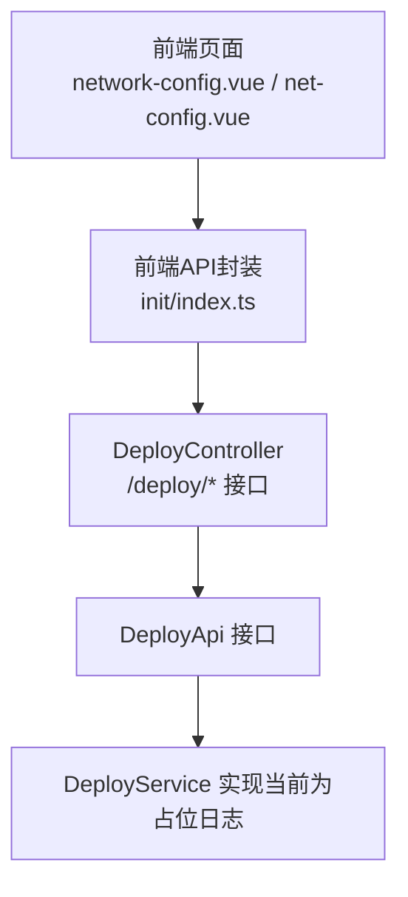
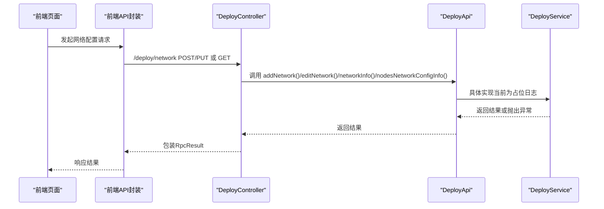
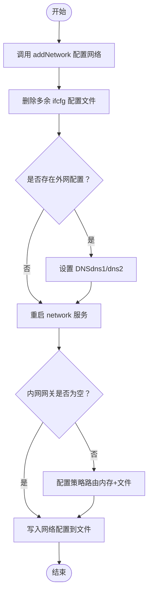
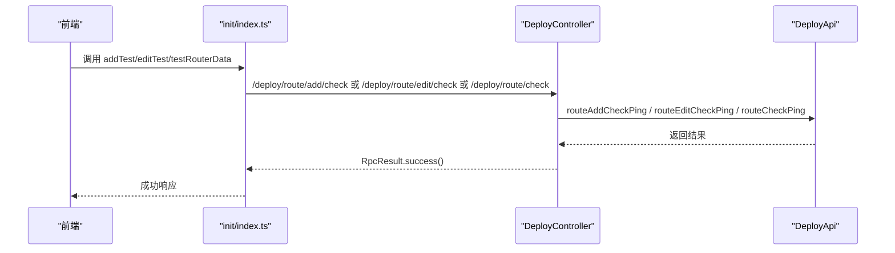
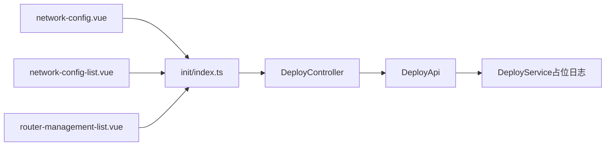

# 网络配置管理

<cite>
**本文引用的文件**
- [DeployController.java](file://watcher-agent/src/main/java/com/virtual/cloud/om/agent/controller/DeployController.java)
- [DeployApi.java](file://watcher-sdk/src/main/java/com/virtual/cloud/om/sdk/api/DeployApi.java)
- [NetworkInfoVO.java](file://watcher-sdk/src/main/java/com/virtual/cloud/om/sdk/dto/deploy/NetworkInfoVO.java)
- [NetworkConfigDTO.java](file://watcher-sdk/src/main/java/com/virtual/cloud/om/sdk/dto/deploy/NetworkConfigDTO.java)
- [NetworkVO.java](file://watcher-sdk/src/main/java/com/virtual/cloud/om/sdk/dto/deploy/NetworkVO.java)
- [RouteVo.java](file://watcher-sdk/src/main/java/com/virtual/cloud/om/sdk/dto/deploy/RouteVo.java)
- [RouteCheckPingVo.java](file://watcher-sdk/src/main/java/com/virtual/cloud/om/sdk/dto/deploy/RouteCheckPingVo.java)
- [index.ts](file://watcher-web/src/api/init/index.ts)
- [network-config.vue](file://watcher-web/src/views/main/init-config/components/network-config.vue)
- [net-config.vue](file://watcher-web/src/views/main/net/network-config/components/net-config.vue)
- [network-config-list.vue](file://watcher-web/src/views/main/net/network-config/network-config-list.vue)
- [router-management-list.vue](file://watcher-web/src/views/main/net/router-management/router-management-list.vue)
- [net.ts](file://watcher-web/src/router/modules/net.ts)
</cite>

## 目录
1. [简介](#简介)
2. [项目结构](#项目结构)
3. [核心组件](#核心组件)
4. [架构总览](#架构总览)
5. [详细组件分析](#详细组件分析)
6. [依赖分析](#依赖分析)
7. [性能考虑](#性能考虑)
8. [故障排除指南](#故障排除指南)
9. [结论](#结论)
10. [附录](#附录)

## 简介
本技术文档聚焦于网络配置管理功能，围绕 DeployController 中与网络配置相关的 API 进行系统化梳理，涵盖本地网卡配置、外网网卡编辑、网络信息查询、节点网络配置获取、WiFi 列表与无线配置、以及网络连通性测试（路由添加/编辑/检查）等能力。同时对 NetworkInfoVO 与 NetworkConfigDTO 数据模型进行字段定义与验证规则说明，并给出网络配置的完整流程（网卡配置文件生成、DNS 设置、策略路由配置、网络服务重启），最后提供最佳实践与故障排除建议。

## 项目结构
网络配置管理涉及三层协作：
- 前端（Vue）：负责用户交互、参数校验与调用后端 API
- SDK（DTO/API）：定义数据模型与服务契约
- Agent 控制器与服务：实现具体网络配置逻辑与系统命令执行

图表来源
- [DeployController.java:145-240](file://watcher-agent/src/main/java/com/virtual/cloud/om/agent/controller/DeployController.java#L145-L240)
- [DeployApi.java:84-105](file://watcher-sdk/src/main/java/com/virtual/cloud/om/sdk/api/DeployApi.java#L84-L105)
- [index.ts:1-73](file://watcher-web/src/api/init/index.ts#L1-L73)

章节来源
- [DeployController.java:145-240](file://watcher-agent/src/main/java/com/virtual/cloud/om/agent/controller/DeployController.java#L145-L240)
- [index.ts:1-73](file://watcher-web/src/api/init/index.ts#L1-L73)

## 核心组件
- DeployController：提供网络配置相关接口，包括本地网卡配置、外网网卡编辑、网络信息查询、节点网络配置获取、WiFi 列表、路由管理与连通性测试。
- DeployApi：定义网络配置与路由管理的服务契约，供控制器调用。
- DTO 模型：
  - NetworkInfoVO：用于提交/编辑网络配置的输入对象，包含内网/外网网卡信息、分配方式、DNS、WiFi 等。
  - NetworkConfigDTO：用于展示各节点网络配置的输出对象，包含内外网网卡、分配方式、掩码、网关、DNS、WiFi 及时间戳。
  - NetworkVO：用于展示本地网卡列表的基本信息。
  - RouteVo / RouteCheckPingVo：路由管理与连通性测试的数据载体。

章节来源
- [DeployController.java:145-240](file://watcher-agent/src/main/java/com/virtual/cloud/om/agent/controller/DeployController.java#L145-L240)
- [DeployApi.java:84-105](file://watcher-sdk/src/main/java/com/virtual/cloud/om/sdk/api/DeployApi.java#L84-L105)
- [NetworkInfoVO.java:1-83](file://watcher-sdk/src/main/java/com/virtual/cloud/om/sdk/dto/deploy/NetworkInfoVO.java#L1-L83)
- [NetworkConfigDTO.java:1-25](file://watcher-sdk/src/main/java/com/virtual/cloud/om/sdk/dto/deploy/NetworkConfigDTO.java#L1-L25)
- [NetworkVO.java:1-15](file://watcher-sdk/src/main/java/com/virtual/cloud/om/sdk/dto/deploy/NetworkVO.java#L1-L15)
- [RouteVo.java:1-28](file://watcher-sdk/src/main/java/com/virtual/cloud/om/sdk/dto/deploy/RouteVo.java#L1-L28)
- [RouteCheckPingVo.java:1-13](file://watcher-sdk/src/main/java/com/virtual/cloud/om/sdk/dto/deploy/RouteCheckPingVo.java#L1-L13)

## 架构总览
下图展示了从前端到控制器、再到服务接口的调用链路与关键处理步骤。

图表来源
- [DeployController.java:145-240](file://watcher-agent/src/main/java/com/virtual/cloud/om/agent/controller/DeployController.java#L145-L240)
- [DeployApi.java:84-105](file://watcher-sdk/src/main/java/com/virtual/cloud/om/sdk/api/DeployApi.java#L84-L105)

## 详细组件分析

### 网络配置 API 设计与实现
- 本地网卡配置（POST /deploy/network）
  - 功能：接收 NetworkInfoVO，配置网络、删除冗余 ifcfg 文件、设置 DNS、重启 network 服务、配置策略路由并持久化配置。
  - 关键步骤：addNetwork → deleteRedundantIfcfgFile → addDNS → service network restart → addStrategyRoute/addStrategyRouteInFile → 写入配置文件。
- 外网网卡编辑（PUT /deploy/network）
  - 功能：接收 NetworkInfoVO，更新外网配置，删除冗余 ifcfg 文件，通过 SSH 重启内网网络，按需配置策略路由。
- 网络信息查询（GET /deploy/network）
  - 功能：返回本地网卡列表（NetworkVO）。
- 节点网络配置获取（GET /deploy/network/config/nodes 与 /deploy/network/config/node）
  - 功能：返回所有节点或指定节点的 NetworkConfigDTO 列表。
- WiFi 列表获取（GET /deploy/network/wifis）
  - 功能：启用无线并扫描，返回可用 WiFi 名称集合。
- 路由管理与连通性测试
  - 路由列表：GET /deploy/route
  - 添加路由：POST /deploy/route
  - 编辑路由：PUT /deploy/route
  - 删除路由：DELETE /deploy/route
  - 路由添加测试：POST /deploy/route/add/check
  - 路由编辑测试：POST /deploy/route/edit/check
  - 路由连通性检查：POST /deploy/route/check

章节来源
- [DeployController.java:145-240](file://watcher-agent/src/main/java/com/virtual/cloud/om/agent/controller/DeployController.java#L145-L240)
- [DeployController.java:242-280](file://watcher-agent/src/main/java/com/virtual/cloud/om/agent/controller/DeployController.java#L242-L280)
- [DeployApi.java:84-105](file://watcher-sdk/src/main/java/com/virtual/cloud/om/sdk/api/DeployApi.java#L84-L105)

### 数据模型与验证规则

#### NetworkInfoVO 字段定义
- 节点名称：nodeName
- 内网网卡：inner（NetworkInfo）
- 外网网卡：outer（NetworkInfo）
- 是否主节点：master（0/1）

NetworkInfo 子对象字段：
- name：网卡名
- ip：IP 地址
- mask：子网掩码
- gateway：网关
- allocation：分配方式（默认静态，支持静态/动态）
- wifi：WiFi 名称
- wifiPwd：WiFi 密码
- dns1/dns2：DNS 主备

验证规则（前端侧）：
- 单网卡模式：内网 IP、掩码、网关必填；主节点标志为 0/1。
- 多网卡模式：内网与外网网卡均需满足 IP、网卡名、掩码；若外网为 DHCP，则仅需选择网卡名；否则需填写 IP、掩码；内外网分配方式需一致；掩码需在允许列表；网关可选但格式需合法；外网为无线时需填写 WiFi 名称。

章节来源
- [NetworkInfoVO.java:1-83](file://watcher-sdk/src/main/java/com/virtual/cloud/om/sdk/dto/deploy/NetworkInfoVO.java#L1-L83)
- [network-config.vue:48-361](file://watcher-web/src/views/main/init-config/components/network-config.vue#L48-L361)
- [net-config.vue:103-351](file://watcher-web/src/views/main/net/network-config/components/net-config.vue#L103-L351)

#### NetworkConfigDTO 字段定义
- 节点名：nodeName
- 内网：name/ip/allocation/mask/gateway
- 外网：name/ip/allocation/mask/gateway/wifi/wifiPwd
- DNS：dns1/dns2
- 时间戳：createTime/updateTime

用途：用于展示各节点的网络配置详情，便于统一查看与编辑。

章节来源
- [NetworkConfigDTO.java:1-25](file://watcher-sdk/src/main/java/com/virtual/cloud/om/sdk/dto/deploy/NetworkConfigDTO.java#L1-L25)

#### NetworkVO 字段定义
- name：网卡名
- ip：IP 地址
- mask：子网掩码
- gateway：网关
- wifi：是否无线（0/1）

用途：用于展示本地网卡列表，辅助用户选择网卡与分配方式。

章节来源
- [NetworkVO.java:1-15](file://watcher-sdk/src/main/java/com/virtual/cloud/om/sdk/dto/deploy/NetworkVO.java#L1-L15)

#### 路由相关数据模型
- RouteVo：目标 IP、掩码、下一跳、出接口、适用采集端 IP 列表、描述、uuid 等。
- RouteCheckPingVo：目标地址、适用采集端列表、uuid。

章节来源
- [RouteVo.java:1-28](file://watcher-sdk/src/main/java/com/virtual/cloud/om/sdk/dto/deploy/RouteVo.java#L1-L28)
- [RouteCheckPingVo.java:1-13](file://watcher-sdk/src/main/java/com/virtual/cloud/om/sdk/dto/deploy/RouteCheckPingVo.java#L1-L13)

### 网络配置完整流程
以下流程图展示了 POST /deploy/network 的完整处理过程：

图表来源
- [DeployController.java:145-180](file://watcher-agent/src/main/java/com/virtual/cloud/om/agent/controller/DeployController.java#L145-L180)

章节来源
- [DeployController.java:145-180](file://watcher-agent/src/main/java/com/virtual/cloud/om/agent/controller/DeployController.java#L145-L180)

### 路由连通性测试流程
- 路由添加测试：POST /deploy/route/add/check → 调用 routeAddCheckPing
- 路由编辑测试：POST /deploy/route/edit/check → 调用 routeEditCheckPing
- 路由连通性检查：POST /deploy/route/check → 调用 routeCheckPing

图表来源
- [DeployController.java:261-280](file://watcher-agent/src/main/java/com/virtual/cloud/om/agent/controller/DeployController.java#L261-L280)
- [index.ts:108-119](file://watcher-web/src/api/init/index.ts#L108-L119)
- [index.ts:88-93](file://watcher-web/src/api/init/index.ts#L88-L93)

章节来源
- [DeployController.java:261-280](file://watcher-agent/src/main/java/com/virtual/cloud/om/agent/controller/DeployController.java#L261-L280)
- [index.ts:108-119](file://watcher-web/src/api/init/index.ts#L108-L119)
- [index.ts:88-93](file://watcher-web/src/api/init/index.ts#L88-L93)

### 前端集成与页面导航
- 前端 API 封装：init/index.ts 提供网络配置与路由管理的请求方法。
- 页面组件：
  - 初始化配置页：network-config.vue（支持单/多网卡模式、DHCP/静态切换、WiFi 选择与校验）
  - 网络配置列表页：network-config-list.vue（展示各节点网络配置）
  - 路由管理页：router-management-list.vue（展示路由列表）
- 路由模块：net.ts 定义了网络与路由相关菜单与子路由。

章节来源
- [index.ts:1-140](file://watcher-web/src/api/init/index.ts#L1-L140)
- [network-config.vue:237-249](file://watcher-web/src/views/main/init-config/components/network-config.vue#L237-L249)
- [network-config-list.vue:69-131](file://watcher-web/src/views/main/net/network-config/network-config-list.vue#L69-L131)
- [router-management-list.vue:41-82](file://watcher-web/src/views/main/net/router-management/router-management-list.vue#L41-L82)
- [net.ts:29-49](file://watcher-web/src/router/modules/net.ts#L29-L49)

## 依赖分析
- 控制器依赖服务接口 DeployApi，后者定义 addNetwork、editNetwork、addDNS、route* 等方法。
- 前端通过 init/index.ts 的方法映射到 /deploy/* 接口，实现网络配置与路由管理。
- 前端页面组件对 DTO 字段进行绑定与校验，确保提交数据符合后端要求。

图表来源
- [DeployController.java:145-240](file://watcher-agent/src/main/java/com/virtual/cloud/om/agent/controller/DeployController.java#L145-L240)
- [DeployApi.java:84-105](file://watcher-sdk/src/main/java/com/virtual/cloud/om/sdk/api/DeployApi.java#L84-L105)
- [index.ts:1-140](file://watcher-web/src/api/init/index.ts#L1-L140)

章节来源
- [DeployController.java:145-240](file://watcher-agent/src/main/java/com/virtual/cloud/om/agent/controller/DeployController.java#L145-L240)
- [DeployApi.java:84-105](file://watcher-sdk/src/main/java/com/virtual/cloud/om/sdk/api/DeployApi.java#L84-L105)
- [index.ts:1-140](file://watcher-web/src/api/init/index.ts#L1-L140)

## 性能考虑
- 网络服务重启为阻塞操作，建议在低峰时段执行，避免影响业务流量。
- 路由连通性测试会发起网络探测，频繁测试可能增加网络负载，建议合理控制频率。
- 多节点网络配置展示采用一次性拉取（/deploy/network/config/nodes），前端应做分页或懒加载优化以降低首屏压力。

## 故障排除指南
常见问题与排查要点：
- 网络服务重启失败
  - 现象：返回 FAILED 或 失败
  - 排查：检查网卡配置文件合法性、DNS 设置、策略路由是否冲突
- 策略路由未生效
  - 现象：内网网关存在但路由未下发
  - 排查：确认 addStrategyRoute 与 addStrategyRouteInFile 是否正确执行，核对路由表
- 外网 DHCP 配置无效
  - 现象：外网网卡选择 DHCP 后仍无法获取 IP
  - 排查：确认 nmcli 状态、无线开关与 WiFi 可用性；检查 DHCP 服务器可达性
- 路由连通性测试不通过
  - 现象：添加/编辑路由后测试失败
  - 排查：使用 routeAddCheckPing / routeEditCheckPing / routeCheckPing 逐项验证；检查目标 IP、掩码、下一跳与出接口

章节来源
- [DeployController.java:145-180](file://watcher-agent/src/main/java/com/virtual/cloud/om/agent/controller/DeployController.java#L145-L180)
- [DeployController.java:261-280](file://watcher-agent/src/main/java/com/virtual/cloud/om/agent/controller/DeployController.java#L261-L280)

## 结论
本文档系统梳理了 DeployController 的网络配置相关 API、数据模型与前端集成方式，并给出了网络配置的完整流程与路由连通性测试方法。尽管当前 DeployService 中部分实现为占位日志，但接口契约清晰，便于后续完善底层实现。建议在生产环境中严格遵循前端校验规则与最佳实践，确保网络配置的稳定性与一致性。

## 附录

### API 定义概览
- 本地网卡配置：POST /deploy/network
- 外网网卡编辑：PUT /deploy/network
- 网络信息查询：GET /deploy/network
- 节点网络配置（全部）：GET /deploy/network/config/nodes
- 节点网络配置（单个）：GET /deploy/network/config/node
- WiFi 列表：GET /deploy/network/wifis
- 路由管理：GET/POST/PUT/DELETE /deploy/route
- 路由连通性测试：POST /deploy/route/add/check, /deploy/route/edit/check, /deploy/route/check

章节来源
- [DeployController.java:145-240](file://watcher-agent/src/main/java/com/virtual/cloud/om/agent/controller/DeployController.java#L145-L240)
- [DeployController.java:242-280](file://watcher-agent/src/main/java/com/virtual/cloud/om/agent/controller/DeployController.java#L242-L280)
- [index.ts:1-140](file://watcher-web/src/api/init/index.ts#L1-L140)