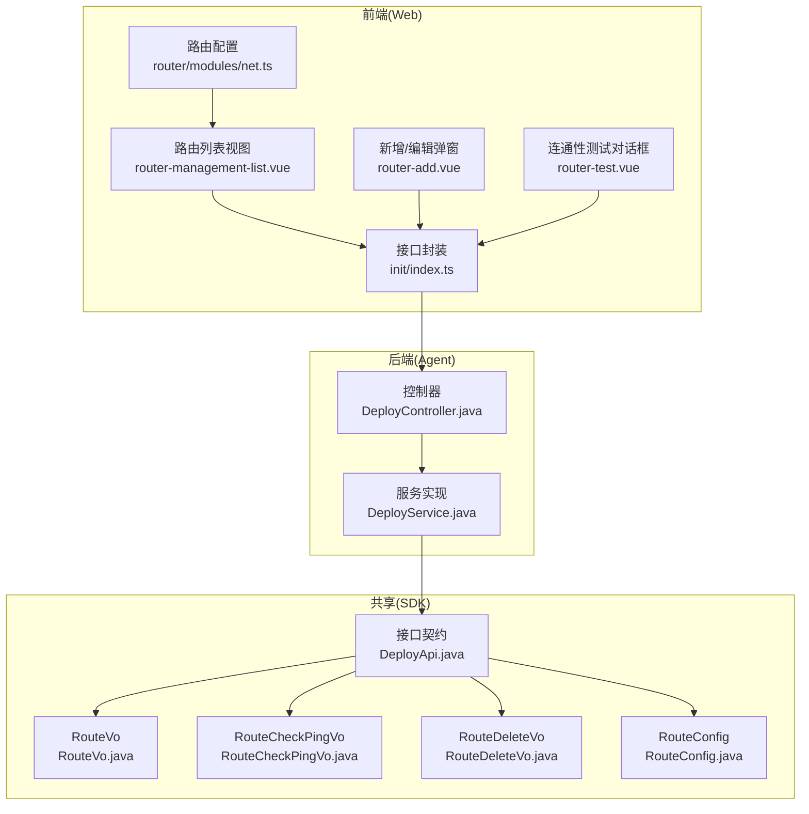
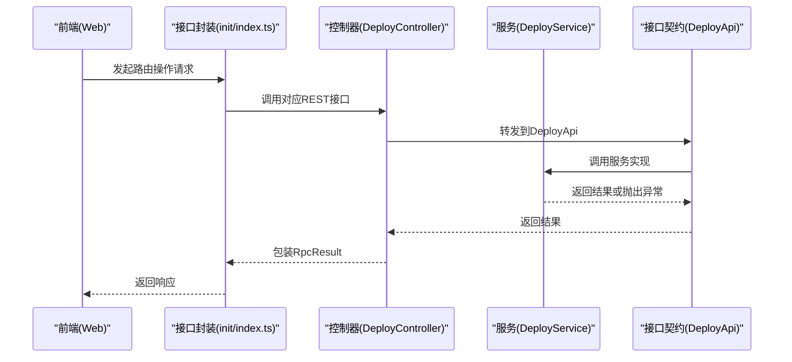
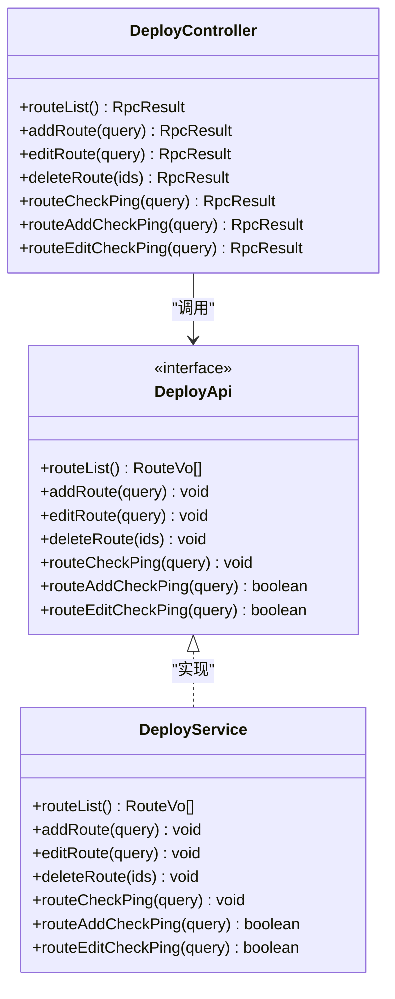
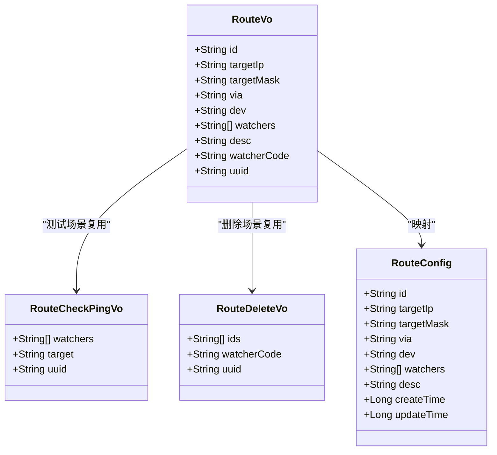
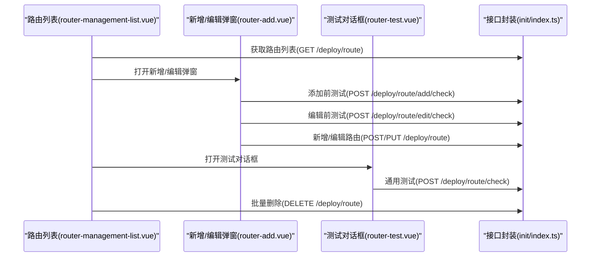
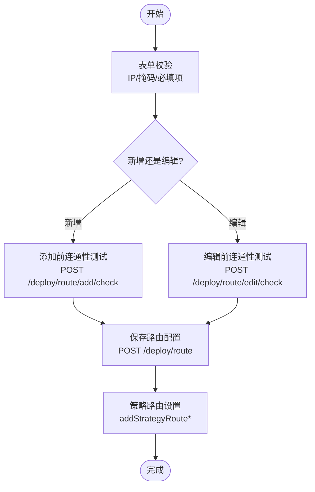
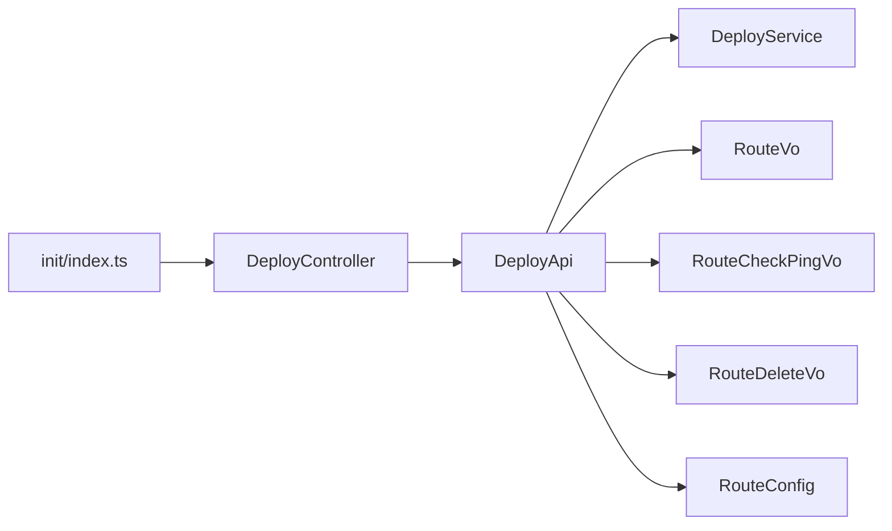

# 路由管理功能

<cite>
**本文引用的文件**
- [DeployController.java](file://watcher-agent/src/main/java/com/virtual/cloud/om/agent/controller/DeployController.java)
- [DeployService.java](file://watcher-agent/src/main/java/com/virtual/cloud/om/agent/service/deploy/DeployService.java)
- [DeployApi.java](file://watcher-sdk/src/main/java/com/virtual/cloud/om/sdk/api/DeployApi.java)
- [RouteVo.java](file://watcher-sdk/src/main/java/com/virtual/cloud/om/sdk/dto/deploy/RouteVo.java)
- [RouteCheckPingVo.java](file://watcher-sdk/src/main/java/com/virtual/cloud/om/sdk/dto/deploy/RouteCheckPingVo.java)
- [RouteDeleteVo.java](file://watcher-sdk/src/main/java/com/virtual/cloud/om/sdk/dto/deploy/RouteDeleteVo.java)
- [RouteConfig.java](file://watcher-agent/src/main/java/com/virtual/cloud/om/agent/entity/RouteConfig.java)
- [index.ts](file://watcher-web/src/api/init/index.ts)
- [router-management-list.vue](file://watcher-web/src/views/main/net/router-management/router-management-list.vue)
- [router-add.vue](file://watcher-web/src/views/main/net/router-management/components/router-add.vue)
- [router-test.vue](file://watcher-web/src/views/main/net/router-management/components/router-test.vue)
- [net.ts](file://watcher-web/src/router/modules/net.ts)
</cite>

## 目录
1. [简介](#简介)
2. [项目结构](#项目结构)
3. [核心组件](#核心组件)
4. [架构总览](#架构总览)
5. [详细组件分析](#详细组件分析)
6. [依赖分析](#依赖分析)
7. [性能考虑](#性能考虑)
8. [故障排除指南](#故障排除指南)
9. [结论](#结论)
10. [附录](#附录)

## 简介
本文件面向“路由管理”功能，围绕 DeployController 中的路由管理相关 API 进行系统化技术说明，覆盖以下内容：
- 路由管理接口：列表查询、添加、编辑、删除
- 数据传输对象：RouteVo、RouteCheckPingVo 的字段与校验规则
- 路由管理流程：配置验证、连通性测试、策略路由设置
- 路由测试功能：添加前的 IP 连通性检查、编辑前的连通性验证、配置后的连通性确认
- 最佳实践：多网段网络、VLAN 配置与复杂拓扑下的路由设计
- 故障排除：常见问题定位与解决思路

## 项目结构
路由管理功能涉及三层：
- 控制层（Controller）：暴露 REST 接口，处理请求与响应
- 服务层（Service）：实现业务逻辑，当前为占位实现（日志提示功能已禁用）
- DTO/实体层（SDK/Agent）：定义数据模型与接口契约
- 前端（Web）：提供路由列表、新增/编辑弹窗、连通性测试对话框

图表来源
- [DeployController.java:261-324](file://watcher-agent/src/main/java/com/virtual/cloud/om/agent/controller/DeployController.java#L261-L324)
- [DeployService.java:28-232](file://watcher-agent/src/main/java/com/virtual/cloud/om/agent/service/deploy/DeployService.java#L28-L232)
- [DeployApi.java:14-105](file://watcher-sdk/src/main/java/com/virtual/cloud/om/sdk/api/DeployApi.java#L14-L105)
- [RouteVo.java:11-27](file://watcher-sdk/src/main/java/com/virtual/cloud/om/sdk/dto/deploy/RouteVo.java#L11-L27)
- [RouteCheckPingVo.java:8-12](file://watcher-sdk/src/main/java/com/virtual/cloud/om/sdk/dto/deploy/RouteCheckPingVo.java#L8-L12)
- [RouteDeleteVo.java:8-12](file://watcher-sdk/src/main/java/com/virtual/cloud/om/sdk/dto/deploy/RouteDeleteVo.java#L8-L12)
- [RouteConfig.java:16-33](file://watcher-agent/src/main/java/com/virtual/cloud/om/agent/entity/RouteConfig.java#L16-L33)
- [index.ts:68-140](file://watcher-web/src/api/init/index.ts#L68-L140)
- [router-management-list.vue:1-362](file://watcher-web/src/views/main/net/router-management/router-management-list.vue#L1-L362)
- [router-add.vue:1-384](file://watcher-web/src/views/main/net/router-management/components/router-add.vue#L1-L384)
- [router-test.vue:54-127](file://watcher-web/src/views/main/net/router-management/components/router-test.vue#L54-L127)
- [net.ts:29-49](file://watcher-web/src/router/modules/net.ts#L29-L49)

章节来源
- [DeployController.java:261-324](file://watcher-agent/src/main/java/com/virtual/cloud/om/agent/controller/DeployController.java#L261-L324)
- [DeployService.java:28-232](file://watcher-agent/src/main/java/com/virtual/cloud/om/agent/service/deploy/DeployService.java#L28-L232)
- [DeployApi.java:14-105](file://watcher-sdk/src/main/java/com/virtual/cloud/om/sdk/api/DeployApi.java#L14-L105)
- [index.ts:68-140](file://watcher-web/src/api/init/index.ts#L68-L140)

## 核心组件
- 控制器接口
  - 路由列表查询：GET /deploy/route
  - 路由添加：POST /deploy/route
  - 路由编辑：PUT /deploy/route
  - 路由删除：DELETE /deploy/route
  - 路由连通性测试（通用）：POST /deploy/route/check
  - 路由添加前连通性检查：POST /deploy/route/add/check
  - 路由编辑前连通性检查：POST /deploy/route/edit/check
- 数据传输对象
  - RouteVo：路由配置的输入/输出载体
  - RouteCheckPingVo：连通性测试输入载体
  - RouteDeleteVo：批量删除输入载体
- 实体与接口契约
  - RouteConfig：Agent 层路由实体
  - DeployApi：路由相关接口契约（含连通性测试、增删改查、策略路由）

章节来源
- [DeployController.java:261-324](file://watcher-agent/src/main/java/com/virtual/cloud/om/agent/controller/DeployController.java#L261-L324)
- [RouteVo.java:11-27](file://watcher-sdk/src/main/java/com/virtual/cloud/om/sdk/dto/deploy/RouteVo.java#L11-L27)
- [RouteCheckPingVo.java:8-12](file://watcher-sdk/src/main/java/com/virtual/cloud/om/sdk/dto/deploy/RouteCheckPingVo.java#L8-L12)
- [RouteDeleteVo.java:8-12](file://watcher-sdk/src/main/java/com/virtual/cloud/om/sdk/dto/deploy/RouteDeleteVo.java#L8-L12)
- [RouteConfig.java:16-33](file://watcher-agent/src/main/java/com/virtual/cloud/om/agent/entity/RouteConfig.java#L16-L33)
- [DeployApi.java:94-105](file://watcher-sdk/src/main/java/com/virtual/cloud/om/sdk/api/DeployApi.java#L94-L105)

## 架构总览
下图展示从前端到后端的调用链路与职责分工。

图表来源
- [DeployController.java:261-324](file://watcher-agent/src/main/java/com/virtual/cloud/om/agent/controller/DeployController.java#L261-L324)
- [DeployService.java:28-232](file://watcher-agent/src/main/java/com/virtual/cloud/om/agent/service/deploy/DeployService.java#L28-L232)
- [DeployApi.java:14-105](file://watcher-sdk/src/main/java/com/virtual/cloud/om/sdk/api/DeployApi.java#L14-L105)
- [index.ts:68-140](file://watcher-web/src/api/init/index.ts#L68-L140)

## 详细组件分析

### 控制器层：DeployController
- 提供路由管理相关 REST 接口，统一返回 RpcResult 结果包装
- 路由列表查询：GET /deploy/route
- 路由添加：POST /deploy/route
- 路由编辑：PUT /deploy/route
- 路由删除：DELETE /deploy/route
- 路由连通性测试（通用）：POST /deploy/route/check
- 路由添加前连通性检查：POST /deploy/route/add/check
- 路由编辑前连通性检查：POST /deploy/route/edit/check

图表来源
- [DeployController.java:261-324](file://watcher-agent/src/main/java/com/virtual/cloud/om/agent/controller/DeployController.java#L261-L324)
- [DeployService.java:28-232](file://watcher-agent/src/main/java/com/virtual/cloud/om/agent/service/deploy/DeployService.java#L28-L232)
- [DeployApi.java:14-105](file://watcher-sdk/src/main/java/com/virtual/cloud/om/sdk/api/DeployApi.java#L14-L105)

章节来源
- [DeployController.java:261-324](file://watcher-agent/src/main/java/com/virtual/cloud/om/agent/controller/DeployController.java#L261-L324)

### 服务层：DeployService
- 当前实现为占位实现，所有路由相关方法均记录日志并返回默认值或空集合
- 未来扩展点：在服务层实现具体的路由配置验证、连通性测试与策略路由设置

章节来源
- [DeployService.java:179-230](file://watcher-agent/src/main/java/com/virtual/cloud/om/agent/service/deploy/DeployService.java#L179-L230)

### DTO 与实体
- RouteVo：路由配置输入/输出载体，包含目标 IP、掩码、下一跳、出接口、适用采集端 IP 列表、描述、watcherCode、uuid 等字段
- RouteCheckPingVo：连通性测试输入载体，包含目标 IP、采集端列表、uuid
- RouteDeleteVo：批量删除输入载体，包含 ID 列表、watcherCode、uuid
- RouteConfig：Agent 层路由实体，字段与 RouteVo 对应

图表来源
- [RouteVo.java:11-27](file://watcher-sdk/src/main/java/com/virtual/cloud/om/sdk/dto/deploy/RouteVo.java#L11-L27)
- [RouteCheckPingVo.java:8-12](file://watcher-sdk/src/main/java/com/virtual/cloud/om/sdk/dto/deploy/RouteCheckPingVo.java#L8-L12)
- [RouteDeleteVo.java:8-12](file://watcher-sdk/src/main/java/com/virtual/cloud/om/sdk/dto/deploy/RouteDeleteVo.java#L8-L12)
- [RouteConfig.java:16-33](file://watcher-agent/src/main/java/com/virtual/cloud/om/agent/entity/RouteConfig.java#L16-L33)

章节来源
- [RouteVo.java:11-27](file://watcher-sdk/src/main/java/com/virtual/cloud/om/sdk/dto/deploy/RouteVo.java#L11-L27)
- [RouteCheckPingVo.java:8-12](file://watcher-sdk/src/main/java/com/virtual/cloud/om/sdk/dto/deploy/RouteCheckPingVo.java#L8-L12)
- [RouteDeleteVo.java:8-12](file://watcher-sdk/src/main/java/com/virtual/cloud/om/sdk/dto/deploy/RouteDeleteVo.java#L8-L12)
- [RouteConfig.java:16-33](file://watcher-agent/src/main/java/com/virtual/cloud/om/agent/entity/RouteConfig.java#L16-L33)

### 前端组件与交互
- 路由列表视图：支持刷新、筛选、单条/批量删除、编辑与测试
- 新增/编辑弹窗：表单校验（IP、掩码、下一跳、采集端必填），支持“测试”按钮触发添加/编辑前连通性检查
- 连通性测试对话框：输入目标 IP，发起通用连通性测试
- 接口封装：统一调用 /deploy/route* 相关接口
- 路由模块：导航至路由管理页面

图表来源
- [router-management-list.vue:192-294](file://watcher-web/src/views/main/net/router-management/router-management-list.vue#L192-L294)
- [router-add.vue:300-361](file://watcher-web/src/views/main/net/router-management/components/router-add.vue#L300-L361)
- [router-test.vue:88-105](file://watcher-web/src/views/main/net/router-management/components/router-test.vue#L88-L105)
- [index.ts:68-140](file://watcher-web/src/api/init/index.ts#L68-L140)

章节来源
- [router-management-list.vue:192-294](file://watcher-web/src/views/main/net/router-management/router-management-list.vue#L192-L294)
- [router-add.vue:300-361](file://watcher-web/src/views/main/net/router-management/components/router-add.vue#L300-L361)
- [router-test.vue:88-105](file://watcher-web/src/views/main/net/router-management/components/router-test.vue#L88-L105)
- [index.ts:68-140](file://watcher-web/src/api/init/index.ts#L68-L140)

### 路由管理流程与测试
- 路由配置验证
  - 表单层面：IP 地址格式、掩码合法性、必填项校验
  - 采集端选择：默认全选，可按需调整
- 连通性测试
  - 添加前测试：POST /deploy/route/add/check
  - 编辑前测试：POST /deploy/route/edit/check
  - 通用测试：POST /deploy/route/check
- 策略路由设置
  - 接口契约包含 addStrategyRoute、addStrategyRouteSSH、addStrategyRouteInFile，用于不同场景下的策略路由写入

图表来源
- [router-add.vue:300-361](file://watcher-web/src/views/main/net/router-management/components/router-add.vue#L300-L361)
- [DeployController.java:261-324](file://watcher-agent/src/main/java/com/virtual/cloud/om/agent/controller/DeployController.java#L261-L324)
- [DeployApi.java:102-105](file://watcher-sdk/src/main/java/com/virtual/cloud/om/sdk/api/DeployApi.java#L102-L105)

章节来源
- [router-add.vue:300-361](file://watcher-web/src/views/main/net/router-management/components/router-add.vue#L300-L361)
- [DeployController.java:261-324](file://watcher-agent/src/main/java/com/virtual/cloud/om/agent/controller/DeployController.java#L261-L324)
- [DeployApi.java:102-105](file://watcher-sdk/src/main/java/com/virtual/cloud/om/sdk/api/DeployApi.java#L102-L105)

## 依赖分析
- 控制器依赖接口契约 DeployApi，服务实现 DeployService 实现该接口
- 前端通过 init/index.ts 封装的接口调用控制器
- DTO/实体在 SDK 与 Agent 层之间传递，保持字段一致性

图表来源
- [DeployController.java:261-324](file://watcher-agent/src/main/java/com/virtual/cloud/om/agent/controller/DeployController.java#L261-L324)
- [DeployService.java:28-232](file://watcher-agent/src/main/java/com/virtual/cloud/om/agent/service/deploy/DeployService.java#L28-L232)
- [DeployApi.java:14-105](file://watcher-sdk/src/main/java/com/virtual/cloud/om/sdk/api/DeployApi.java#L14-L105)
- [RouteVo.java:11-27](file://watcher-sdk/src/main/java/com/virtual/cloud/om/sdk/dto/deploy/RouteVo.java#L11-L27)
- [RouteCheckPingVo.java:8-12](file://watcher-sdk/src/main/java/com/virtual/cloud/om/sdk/dto/deploy/RouteCheckPingVo.java#L8-L12)
- [RouteDeleteVo.java:8-12](file://watcher-sdk/src/main/java/com/virtual/cloud/om/sdk/dto/deploy/RouteDeleteVo.java#L8-L12)
- [RouteConfig.java:16-33](file://watcher-agent/src/main/java/com/virtual/cloud/om/agent/entity/RouteConfig.java#L16-L33)
- [index.ts:68-140](file://watcher-web/src/api/init/index.ts#L68-L140)

章节来源
- [DeployController.java:261-324](file://watcher-agent/src/main/java/com/virtual/cloud/om/agent/controller/DeployController.java#L261-L324)
- [DeployService.java:28-232](file://watcher-agent/src/main/java/com/virtual/cloud/om/agent/service/deploy/DeployService.java#L28-L232)
- [DeployApi.java:14-105](file://watcher-sdk/src/main/java/com/virtual/cloud/om/sdk/api/DeployApi.java#L14-L105)
- [index.ts:68-140](file://watcher-web/src/api/init/index.ts#L68-L140)

## 性能考虑
- 路由列表查询建议分页或限制返回数量，避免大规模数据导致前端渲染压力
- 连通性测试建议异步执行并在前端显示进度反馈
- 批量删除采用一次请求提交多个 ID，减少往返次数
- 服务层实现策略路由写入时，优先采用原子性写入与回滚机制，确保配置一致性

## 故障排除指南
- 控制器返回失败
  - 检查请求参数是否符合 DTO 规范（IP、掩码、必填项）
  - 查看服务层日志，确认功能是否已启用（当前服务层为占位实现）
- 连通性测试失败
  - 确认目标 IP 可达且防火墙放行
  - 检查采集端 IP 列表是否正确
- 路由配置未生效
  - 检查策略路由写入流程是否执行成功
  - 核对设备接口与下一跳地址是否匹配
- 前端交互异常
  - 确认 init/index.ts 中接口路径与后端一致
  - 检查路由模块 net.ts 是否正确注册

章节来源
- [DeployController.java:282-324](file://watcher-agent/src/main/java/com/virtual/cloud/om/agent/controller/DeployController.java#L282-L324)
- [DeployService.java:179-230](file://watcher-agent/src/main/java/com/virtual/cloud/om/agent/service/deploy/DeployService.java#L179-L230)
- [index.ts:68-140](file://watcher-web/src/api/init/index.ts#L68-L140)

## 结论
- 路由管理功能在当前版本中以接口契约与前端交互为主，服务层实现处于占位状态
- 建议后续在服务层完善路由配置验证、连通性测试与策略路由写入逻辑
- 前端提供完善的表单校验与测试能力，便于用户进行路由配置与验证
- 通过统一的 DTO/实体与接口契约，保证前后端协作的一致性与可维护性

## 附录
- 路由管理页面入口：导航至“网络/路由管理”
- 常用接口路径
  - GET /deploy/route：路由列表
  - POST /deploy/route：新增路由
  - PUT /deploy/route：编辑路由
  - DELETE /deploy/route：删除路由
  - POST /deploy/route/check：通用连通性测试
  - POST /deploy/route/add/check：添加前连通性检查
  - POST /deploy/route/edit/check：编辑前连通性检查

章节来源
- [net.ts:29-49](file://watcher-web/src/router/modules/net.ts#L29-L49)
- [index.ts:68-140](file://watcher-web/src/api/init/index.ts#L68-L140)