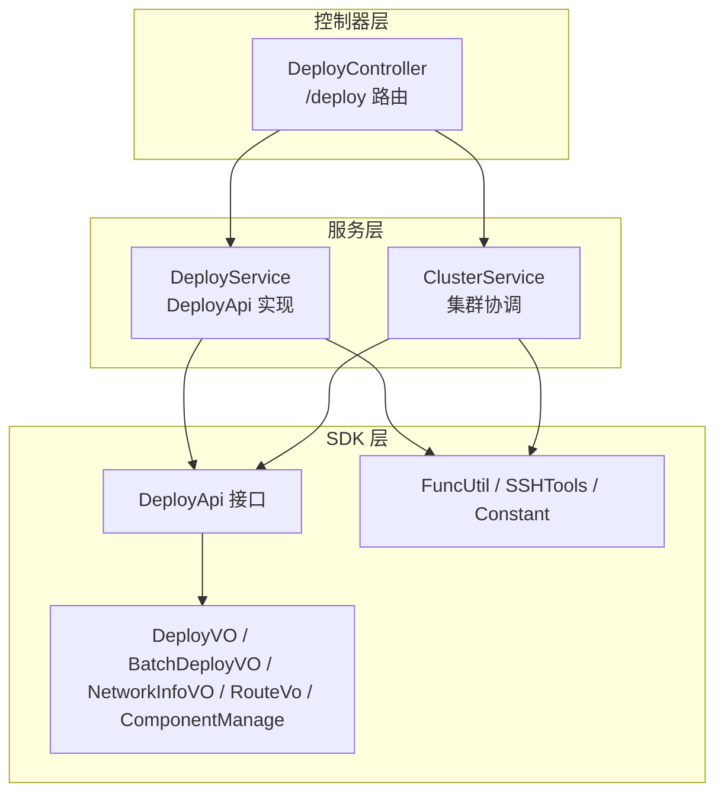
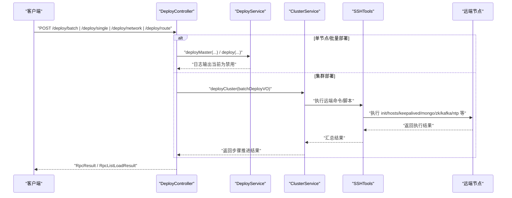
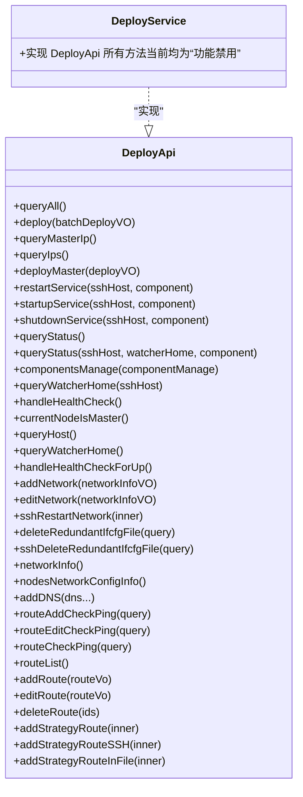
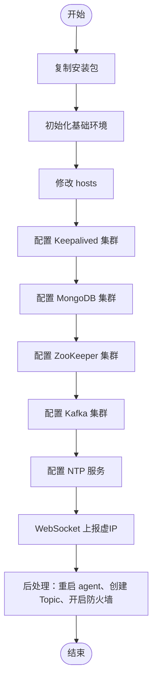
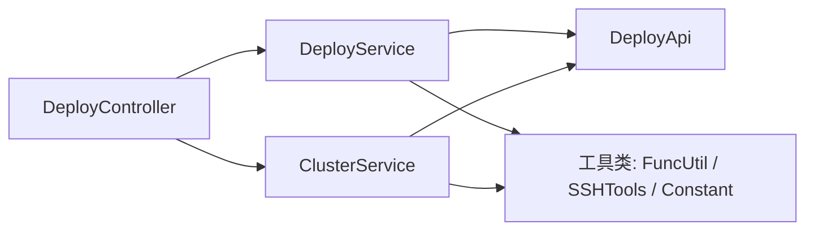

# 部署管理功能

<cite>
**本文引用的文件**
- [DeployController.java](file://watcher-agent/src/main/java/com/virtual/cloud/om/agent/controller/DeployController.java)
- [DeployService.java](file://watcher-agent/src/main/java/com/virtual/cloud/om/agent/service/deploy/DeployService.java)
- [ClusterService.java](file://watcher-agent/src/main/java/com/virtual/cloud/om/agent/service/deploy/ClusterService.java)
- [DeployApi.java](file://watcher-sdk/src/main/java/com/virtual/cloud/om/sdk/api/DeployApi.java)
- [DeployVO.java](file://watcher-sdk/src/main/java/com/virtual/cloud/om/sdk/dto/deploy/DeployVO.java)
- [BatchDeployVO.java](file://watcher-sdk/src/main/java/com/virtual/cloud/om/sdk/dto/deploy/BatchDeployVO.java)
- [NetworkInfoVO.java](file://watcher-sdk/src/main/java/com/virtual/cloud/om/sdk/dto/deploy/NetworkInfoVO.java)
- [RouteVo.java](file://watcher-sdk/src/main/java/com/virtual/cloud/om/sdk/dto/deploy/RouteVo.java)
- [ComponentManage.java](file://watcher-sdk/src/main/java/com/virtual/cloud/om/sdk/dto/deploy/ComponentManage.java)
- [Constant.java](file://watcher-sdk/src/main/java/com/virtual/cloud/om/sdk/constant/Constant.java)
- [FuncUtil.java](file://watcher-sdk/src/main/java/com/virtual/cloud/om/sdk/utils/FuncUtil.java)
- [SSHTools.java](file://watcher-sdk/src/main/java/com/virtual/cloud/om/sdk/utils/SSHTools.java)
- [Deploy.java](file://watcher-agent/src/main/java/com/virtual/cloud/om/agent/entity/Deploy.java)
</cite>

## 目录
1. [简介](#简介)
2. [项目结构](#项目结构)
3. [核心组件](#核心组件)
4. [架构总览](#架构总览)
5. [详细组件分析](#详细组件分析)
6. [依赖分析](#依赖分析)
7. [性能考虑](#性能考虑)
8. [故障排查指南](#故障排查指南)
9. [结论](#结论)
10. [附录](#附录)

## 简介
本文件面向监控代理的部署管理功能，围绕以下目标展开：
- 详解 DeployController 的 REST API 设计，覆盖组件部署、集群管理、网络配置与路由管理的 HTTP 接口规范。
- 深入阐述 DeployService 的部署逻辑实现现状与限制，包括组件状态检查、依赖关系验证、部署流程控制与回滚机制的现状说明。
- 说明 ClusterService 的集群协调能力，包括节点发现、健康检查、负载均衡与故障转移的实现要点。
- 提供部署配置的详细说明，包括组件配置文件格式、网络拓扑配置与安全策略设置。
- 覆盖部署过程中的错误处理、重试机制与监控告警建议。
- 提供单节点与集群部署的实际案例与最佳实践。

## 项目结构
部署管理相关代码主要分布在 watcher-agent 的 controller 层与 service 层，以及 watcher-sdk 的 DTO、API 与工具类中。整体采用分层架构：
- 控制器层：对外暴露 HTTP 接口，负责请求解析与响应封装。
- 服务层：实现部署、集群、网络与路由等业务逻辑；当前 DeployService 多数方法处于“功能禁用”状态，实际部署逻辑由 ClusterService 通过 SSH 工具链完成。
- SDK 层：提供统一的 DTO、API 接口与工具类（如 SSH、命令执行、常量定义）。

图表来源
- [DeployController.java:32-325](file://watcher-agent/src/main/java/com/virtual/cloud/om/agent/controller/DeployController.java#L32-L325)
- [DeployService.java:26-232](file://watcher-agent/src/main/java/com/virtual/cloud/om/agent/service/deploy/DeployService.java#L26-L232)
- [ClusterService.java:27-497](file://watcher-agent/src/main/java/com/virtual/cloud/om/agent/service/deploy/ClusterService.java#L27-L497)
- [DeployApi.java:14-106](file://watcher-sdk/src/main/java/com/virtual/cloud/om/sdk/api/DeployApi.java#L14-L106)
- [FuncUtil.java:338-458](file://watcher-sdk/src/main/java/com/virtual/cloud/om/sdk/utils/FuncUtil.java#L338-L458)
- [SSHTools.java:169-264](file://watcher-sdk/src/main/java/com/virtual/cloud/om/sdk/utils/SSHTools.java#L169-L264)

章节来源
- [DeployController.java:32-325](file://watcher-agent/src/main/java/com/virtual/cloud/om/agent/controller/DeployController.java#L32-L325)
- [DeployService.java:26-232](file://watcher-agent/src/main/java/com/virtual/cloud/om/agent/service/deploy/DeployService.java#L26-L232)
- [ClusterService.java:27-497](file://watcher-agent/src/main/java/com/virtual/cloud/om/agent/service/deploy/ClusterService.java#L27-L497)
- [DeployApi.java:14-106](file://watcher-sdk/src/main/java/com/virtual/cloud/om/sdk/api/DeployApi.java#L14-L106)

## 核心组件
- DeployController：提供部署、网络与路由管理的 HTTP 接口，负责调用 DeployApi 与 ClusterService，并对数据中心步骤进行更新。
- DeployService：DeployApi 的实现类，当前多数方法处于“功能禁用”状态，仅保留接口签名与日志输出。
- ClusterService：实现多节点集群部署流程，通过 SSH 工具链在各节点执行安装脚本、配置文件与服务启停。
- DeployApi：部署相关能力的抽象接口，定义了部署、组件管理、网络与路由等方法。
- DTO 与常量：提供部署输入输出模型、网络配置模型、路由模型、组件管理模型以及常量定义（如服务名、文件路径、数据中心步骤等）。
- 工具类：FuncUtil 提供命令执行与超时控制，SSHTools 提供 SSH 会话、命令执行与文件传输。

章节来源
- [DeployController.java:32-325](file://watcher-agent/src/main/java/com/virtual/cloud/om/agent/controller/DeployController.java#L32-L325)
- [DeployService.java:26-232](file://watcher-agent/src/main/java/com/virtual/cloud/om/agent/service/deploy/DeployService.java#L26-L232)
- [ClusterService.java:27-497](file://watcher-agent/src/main/java/com/virtual/cloud/om/agent/service/deploy/ClusterService.java#L27-L497)
- [DeployApi.java:14-106](file://watcher-sdk/src/main/java/com/virtual/cloud/om/sdk/api/DeployApi.java#L14-L106)
- [Constant.java:53-76](file://watcher-sdk/src/main/java/com/virtual/cloud/om/sdk/constant/Constant.java#L53-L76)

## 架构总览
下图展示了部署管理的端到端交互：客户端通过 HTTP 请求访问 DeployController，控制器根据业务选择调用 DeployService 或 ClusterService，最终通过 SSH 工具链在远端节点执行具体操作。

图表来源
- [DeployController.java:46-102](file://watcher-agent/src/main/java/com/virtual/cloud/om/agent/controller/DeployController.java#L46-L102)
- [ClusterService.java:56-144](file://watcher-agent/src/main/java/com/virtual/cloud/om/agent/service/deploy/ClusterService.java#L56-L144)
- [SSHTools.java:169-264](file://watcher-sdk/src/main/java/com/virtual/cloud/om/sdk/utils/SSHTools.java#L169-L264)

## 详细组件分析

### DeployController REST API 规范
- 基础路径：/deploy
- 认证与跨域：未在控制器中显式声明，需结合全局安全配置使用。
- 响应约定：统一使用 RpcResult 或 RpcListLoadResult 包裹结果与状态。

核心接口清单
- POST /deploy/batch
  - 功能：批量部署（多节点）
  - 请求体：BatchDeployVO
  - 成功：更新数据中心步骤为部署成功
  - 失败：更新数据中心步骤为部署认证失败
- POST /deploy/single
  - 功能：单节点部署（主节点）
  - 请求体：DeployVO
  - 成功：更新数据中心步骤为部署成功
  - 失败：更新数据中心步骤为部署认证失败
- GET /deploy
  - 功能：查询节点部署状态
  - 返回：DeployQueryVO 列表
- PUT /deploy/manage
  - 功能：组件服务管理（启动/停止/重启）
  - 请求体：ComponentManage
- GET /deploy/refresh
  - 功能：刷新 Spring Boot 应用上下文
  - 返回：成功提示
- GET /deploy/host
  - 功能：获取节点信息
- GET /deploy/localIps
  - 功能：获取本机 IP 列表
- PUT /deploy/keepalived/notify/{masterOrBackup}
  - 功能：接收 keepalived 主备通知
  - 路径参数：masterOrBackup（master/backup）
- PUT /deploy/step
  - 功能：修改部署步骤
  - 请求体：UpdateStepDTO
- GET /deploy/network
  - 功能：查询本地网络信息
- POST /deploy/network
  - 功能：配置本地网卡（含 DNS、策略路由、重启网络服务）
  - 请求体：NetworkInfoVO
  - 成功：写入网络配置文件并更新数据中心步骤
- PUT /deploy/network
  - 功能：编辑外网网卡（SSH 远端生效）
  - 请求体：NetworkInfoVO
- GET /deploy/network/master
  - 功能：校验节点是否为部署阶段之前的主节点，返回已写入的网络配置
- GET /deploy/network/config/nodes
  - 功能：获取所有节点的网络配置
- GET /deploy/network/config/node
  - 功能：按节点名查询网络配置详情
- GET /deploy/network/wifis
  - 功能：扫描并返回可用 WiFi 列表
- POST /deploy/route/add/check
  - 功能：添加路由前连通性检查
  - 请求体：RouteVo
- POST /deploy/route/edit/check
  - 功能：编辑路由前连通性检查
  - 请求体：RouteVo
- POST /deploy/route/check
  - 功能：路由连通性检查
  - 请求体：RouteCheckPingVo
- GET /deploy/route
  - 功能：查询路由列表
- POST /deploy/route
  - 功能：添加路由
  - 请求体：RouteVo
- PUT /deploy/route
  - 功能：编辑路由
  - 请求体：RouteVo
- DELETE /deploy/route
  - 功能：删除路由
  - 请求体：ID 列表

章节来源
- [DeployController.java:46-325](file://watcher-agent/src/main/java/com/virtual/cloud/om/agent/controller/DeployController.java#L46-L325)

### DeployService 部署逻辑实现现状
- 当前实现：DeployService 作为 DeployApi 的实现类，绝大多数方法仅输出日志并提示“功能禁用”，未执行任何实际部署动作。
- 影响：控制器中的批量/单节点部署调用不会产生实际效果，集群部署流程由 ClusterService 通过 SSH 工具链直接在远端节点执行。

图表来源
- [DeployApi.java:14-106](file://watcher-sdk/src/main/java/com/virtual/cloud/om/sdk/api/DeployApi.java#L14-L106)
- [DeployService.java:26-232](file://watcher-agent/src/main/java/com/virtual/cloud/om/agent/service/deploy/DeployService.java#L26-L232)

章节来源
- [DeployService.java:26-232](file://watcher-agent/src/main/java/com/virtual/cloud/om/agent/service/deploy/DeployService.java#L26-L232)
- [DeployApi.java:14-106](file://watcher-sdk/src/main/java/com/virtual/cloud/om/sdk/api/DeployApi.java#L14-L106)

### ClusterService 集群协调功能
ClusterService 提供完整的多节点集群部署流程，包含以下关键步骤：
- 步骤管理：通过参数中心维护集群部署步骤（0~10），每步成功后推进一步。
- 节点准备：关闭防火墙、复制安装包、初始化从节点、修改 hosts。
- Keepalived 集群：修改 VIP、网卡、虚拟路由器 ID、优先级，注册系统服务并启动。
- MongoDB 集群：清理从节点数据、重启服务、执行集群脚本、修改配置。
- ZooKeeper 集群：设置 myid、配置 server 列表、启动并重启各节点。
- Kafka 集群：修改 broker.id、listeners、zookeeper.connect，清理日志并启动。
- NTP 服务：安装与配置 NTP，设置定时同步与禁用 chronyd。
- 后处理：重启从节点 agent、创建并消费 Filebeat 日志 Topic、开启防火墙。

图表来源
- [ClusterService.java:56-144](file://watcher-agent/src/main/java/com/virtual/cloud/om/agent/service/deploy/ClusterService.java#L56-L144)

章节来源
- [ClusterService.java:56-144](file://watcher-agent/src/main/java/com/virtual/cloud/om/agent/service/deploy/ClusterService.java#L56-L144)

### 网络配置与路由管理
- 网络配置模型：NetworkInfoVO 描述节点的内网/外网网卡信息，支持静态与 DHCP 分配方式，可配置 DNS、网关与 WiFi 参数。
- 路由模型：RouteVo 描述目的地址、掩码、下一跳与出接口，并可限定适用的采集端 IP 列表。
- 控制器接口：
  - POST /deploy/network：配置本地网卡，写入策略路由与 DNS，重启网络服务。
  - PUT /deploy/network：编辑外网网卡（通过 SSH 在远端生效）。
  - GET /deploy/network/wifis：扫描可用 WiFi。
  - 路由增删改查与连通性检查接口用于运维管理。

章节来源
- [NetworkInfoVO.java:1-83](file://watcher-sdk/src/main/java/com/virtual/cloud/om/sdk/dto/deploy/NetworkInfoVO.java#L1-L83)
- [RouteVo.java:1-28](file://watcher-sdk/src/main/java/com/virtual/cloud/om/sdk/dto/deploy/RouteVo.java#L1-L28)
- [DeployController.java:139-325](file://watcher-agent/src/main/java/com/virtual/cloud/om/agent/controller/DeployController.java#L139-L325)

### 组件管理与健康检查
- 组件管理：ComponentManage 指定节点 IP、组件名与操作类型（restart/startup/shutdown），通过控制器调用 DeployApi 的组件管理方法。
- 健康检查：DeployApi 提供通用健康检查与仅检查 agent 的方法，当前 DeployService 中对应方法为“功能禁用”。

章节来源
- [ComponentManage.java:1-24](file://watcher-sdk/src/main/java/com/virtual/cloud/om/sdk/dto/deploy/ComponentManage.java#L1-L24)
- [DeployApi.java:52-82](file://watcher-sdk/src/main/java/com/virtual/cloud/om/sdk/api/DeployApi.java#L52-L82)
- [DeployService.java:98-135](file://watcher-agent/src/main/java/com/virtual/cloud/om/agent/service/deploy/DeployService.java#L98-L135)

## 依赖分析
- 控制器依赖：
  - DeployController 依赖 DeployApi 与 DataCenterService（用于更新部署步骤）。
- 服务层依赖：
  - DeployService 实现 DeployApi，依赖参数中心与任务中心等接口（当前方法为占位）。
  - ClusterService 依赖 DeployApi、参数中心与实时日志接口，大量使用 SSHTools 与 FuncUtil 执行远端命令与文件操作。
- 工具类依赖：
  - SSHTools：提供 SSH 会话、命令执行、文件传输与超时控制。
  - FuncUtil：提供命令执行、超时控制、IO 与异常处理。

图表来源
- [DeployController.java:38-42](file://watcher-agent/src/main/java/com/virtual/cloud/om/agent/controller/DeployController.java#L38-L42)
- [DeployService.java:30-40](file://watcher-agent/src/main/java/com/virtual/cloud/om/agent/service/deploy/DeployService.java#L30-L40)
- [ClusterService.java:32-39](file://watcher-agent/src/main/java/com/virtual/cloud/om/agent/service/deploy/ClusterService.java#L32-L39)
- [FuncUtil.java:338-458](file://watcher-sdk/src/main/java/com/virtual/cloud/om/sdk/utils/FuncUtil.java#L338-L458)
- [SSHTools.java:169-264](file://watcher-sdk/src/main/java/com/virtual/cloud/om/sdk/utils/SSHTools.java#L169-L264)

章节来源
- [DeployController.java:38-42](file://watcher-agent/src/main/java/com/virtual/cloud/om/agent/controller/DeployController.java#L38-L42)
- [DeployService.java:30-40](file://watcher-agent/src/main/java/com/virtual/cloud/om/agent/service/deploy/DeployService.java#L30-L40)
- [ClusterService.java:32-39](file://watcher-agent/src/main/java/com/virtual/cloud/om/agent/service/deploy/ClusterService.java#L32-L39)

## 性能考虑
- SSH 并发与超时：ClusterService 中多处使用 SSHTools 执行命令，建议为不同阶段设置合理的超时阈值，避免长时间阻塞。
- 命令执行效率：FuncUtil 的命令执行具备超时控制与错误输出捕获，建议在关键步骤（如 Kafka/ZooKeeper 初始化）增加重试与幂等处理。
- 网络配置变更：网络重启与策略路由写入属于高风险操作，建议在变更前备份配置文件并在失败时自动回滚。
- 资源占用：集群部署涉及多节点并发执行，建议在控制器层引入限流与排队机制，防止资源争用导致失败。

## 故障排查指南
常见问题与定位建议：
- SSH 连接失败
  - 现象：命令执行抛出 SSH 异常或返回错误信息。
  - 排查：确认主机信息、端口可达性与凭据；查看 SSHTools 的错误输出与异常码。
- 防火墙拦截
  - 现象：节点间通信失败或服务启动异常。
  - 排查：检查防火墙状态与开放端口；ClusterService 在部署期间会临时关闭防火墙，结束后再开启。
- 网络配置错误
  - 现象：网络重启失败或策略路由不生效。
  - 排查：核对 NetworkInfoVO 的网卡名、IP、掩码与网关；检查 ifcfg 文件与策略路由配置；必要时回滚至备份配置。
- 路由不可达
  - 现象：添加/编辑路由后连通性检查失败。
  - 排查：使用路由检查接口验证目标可达性；确认下一跳与出接口配置正确。
- 集群步骤卡住
  - 现象：部署停留在某一步骤。
  - 排查：检查参数中心的集群步骤参数；查看该步骤对应的远端执行日志；手动推进或回滚。

章节来源
- [SSHTools.java:207-264](file://watcher-sdk/src/main/java/com/virtual/cloud/om/sdk/utils/SSHTools.java#L207-L264)
- [FuncUtil.java:377-458](file://watcher-sdk/src/main/java/com/virtual/cloud/om/sdk/utils/FuncUtil.java#L377-L458)
- [ClusterService.java:147-169](file://watcher-agent/src/main/java/com/virtual/cloud/om/agent/service/deploy/ClusterService.java#L147-L169)

## 结论
- DeployController 提供了完善的部署、网络与路由管理 HTTP 接口，但当前 DeployService 的实现处于“功能禁用”状态，实际部署由 ClusterService 通过 SSH 工具链完成。
- ClusterService 实现了从安装包复制、基础环境初始化到各组件集群搭建的全流程，具备良好的步骤化与容错能力。
- 建议后续完善 DeployService 的真实部署逻辑，统一控制器与服务层职责边界，并增强错误处理、重试与监控告警能力。

## 附录

### 部署配置说明
- 组件配置文件路径
  - 采集端各节点网络配置记录文件：/etc/watcher-nodes-network-config
  - Keepalived 配置路径示例：/components/keepalived/keepalived-2.0.20/conf/keepalived.conf
- 网络拓扑配置
  - 内网/外网网卡、IP、掩码、网关、DNS、WiFi 名称与密码等通过 NetworkInfoVO 传递。
- 安全策略
  - SSH 凭据用于远端节点操作；网络配置变更需谨慎，建议在变更前备份配置文件。

章节来源
- [Constant.java:53-76](file://watcher-sdk/src/main/java/com/virtual/cloud/om/sdk/constant/Constant.java#L53-L76)
- [NetworkInfoVO.java:1-83](file://watcher-sdk/src/main/java/com/virtual/cloud/om/sdk/dto/deploy/NetworkInfoVO.java#L1-L83)

### 部署案例与最佳实践
- 单节点部署
  - 使用 POST /deploy/single，传入 DeployVO（IP、用户名、密码、是否主节点）。
  - 注意：当前 DeployService 方法为“功能禁用”，实际部署由 ClusterService 的步骤推进与 SSH 执行完成。
- 集群部署
  - 使用 POST /deploy/batch，传入 BatchDeployVO（VIP、掩码与节点列表）。
  - ClusterService 将按步骤执行复制安装包、初始化、修改 hosts、配置 Keepalived/MongoDB/ZooKeeper/Kafka/NTP 等。
  - 建议在部署前关闭防火墙，在部署完成后开启防火墙；确保各节点网络互通与 DNS 可用。
- 网络配置
  - 使用 POST /deploy/network 配置本地网卡，包含 DNS 与策略路由；使用 PUT /deploy/network 编辑外网网卡。
  - 使用 GET /deploy/network/wifis 扫描可用 WiFi。
- 路由管理
  - 使用 GET /deploy/route 查询路由列表，使用 POST/PUT/DELETE /deploy/route 增删改查路由。
  - 使用 POST /deploy/route/add/check 与 POST /deploy/route/edit/check 在变更前进行连通性检查。

章节来源
- [DeployController.java:46-325](file://watcher-agent/src/main/java/com/virtual/cloud/om/agent/controller/DeployController.java#L46-L325)
- [BatchDeployVO.java:1-39](file://watcher-sdk/src/main/java/com/virtual/cloud/om/sdk/dto/deploy/BatchDeployVO.java#L1-L39)
- [DeployVO.java:1-34](file://watcher-sdk/src/main/java/com/virtual/cloud/om/sdk/dto/deploy/DeployVO.java#L1-L34)
- [ClusterService.java:56-144](file://watcher-agent/src/main/java/com/virtual/cloud/om/agent/service/deploy/ClusterService.java#L56-L144)