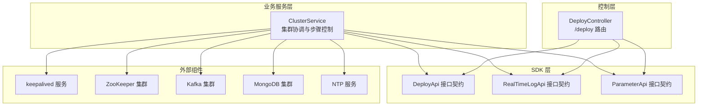
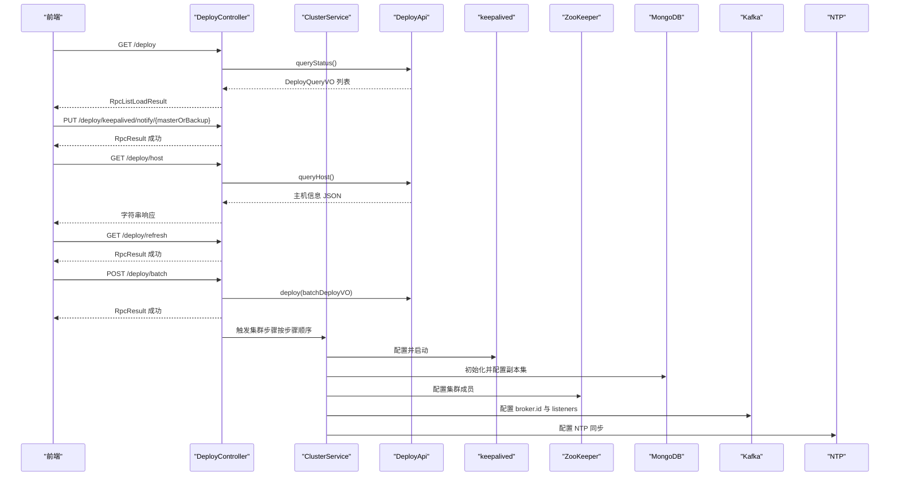
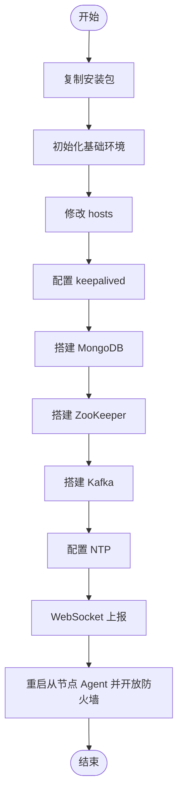
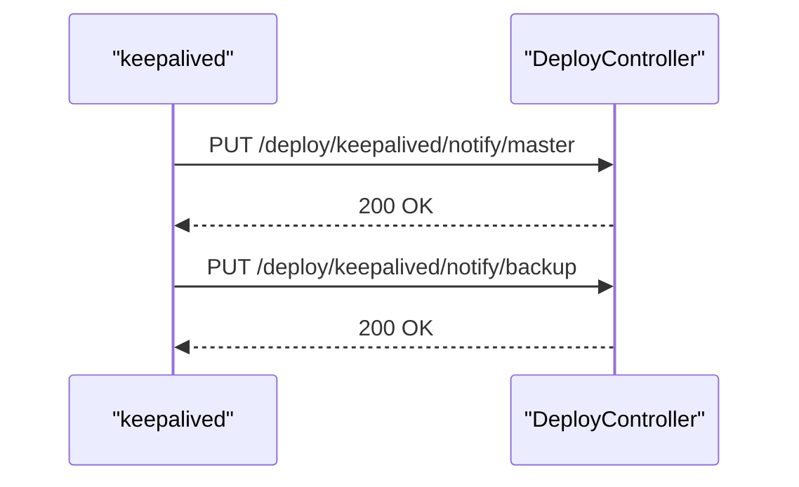
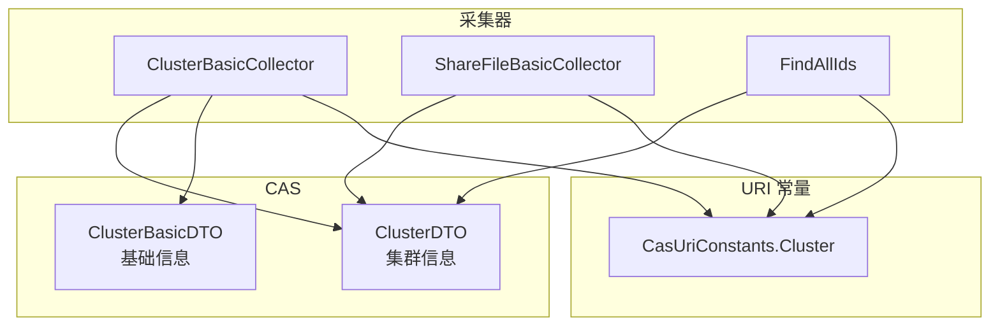
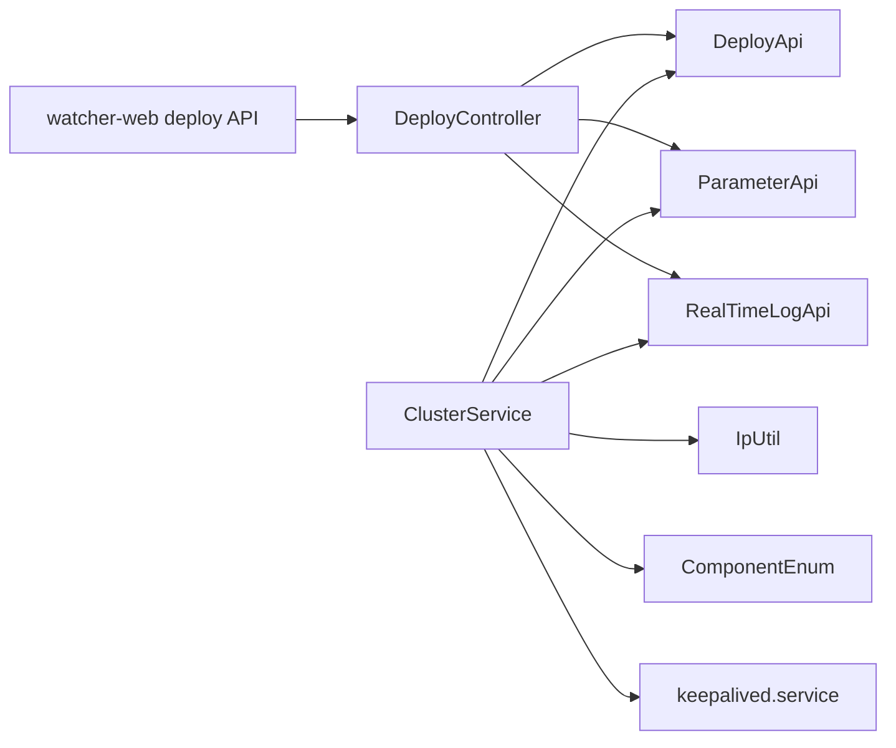

# 集群管理功能

<cite>
**本文引用的文件**
- [DeployController.java](file://watcher-agent/src/main/java/com/virtual/cloud/om/agent/controller/DeployController.java)
- [ClusterService.java](file://watcher-agent/src/main/java/com/virtual/cloud/om/agent/service/deploy/ClusterService.java)
- [DeployApi.java](file://watcher-sdk/src/main/java/com/virtual/cloud/om/sdk/api/DeployApi.java)
- [index.ts](file://watcher-web/src/api/deploy/index.ts)
- [keepalived.service](file://watcher-builder/assembly/conf/keepalived.service)
- [register_keepalived_as_system_service.sh](file://watcher-builder/assembly/bin/register_keepalived_as_system_service.sh)
- [IpUtil.java](file://watcher-sdk/src/main/java/com/virtual/cloud/om/sdk/utils/IpUtil.java)
- [ComponentEnum.java](file://watcher-sdk/src/main/java/com/virtual/cloud/om/sdk/constant/ComponentEnum.java)
- [ComponentManage.java](file://watcher-sdk/src/main/java/com/virtual/cloud/om/sdk/dto/deploy/ComponentManage.java)
- [Component.java](file://watcher-sdk/src/main/java/com/virtual/cloud/om/sdk/dto/deploy/Component.java)
- [DataCenterService.java](file://watcher-agent/src/main/java/com/virtual/cloud/om/agent/service/datacenter/DataCenterService.java)
- [ParameterService.java](file://watcher-agent/src/main/java/com/virtual/cloud/om/agent/service/parameter/ParameterService.java)
- [Parameter.java](file://watcher-agent/src/main/java/com/virtual/cloud/om/agent/entity/Parameter.java)
- [RealTimeLogService.java](file://watcher-agent/src/main/java/com/virtual/cloud/om/agent/service/logs/RealTimeLogService.java)
- [RealTimeLogApi.java](file://watcher-sdk/src/main/java/com/virtual/cloud/om/sdk/api/RealTimeLogApi.java)
- [ClusterDTO.java](file://watcher-sdk/src/main/java/com/virtual/cloud/om/sdk/dto/dataReport/cas/ClusterDTO.java)
- [ClusterBasicDTO.java](file://watcher-sdk/src/main/java/com/virtual/cloud/om/sdk/dto/dataReport/cas/ClusterBasicDTO.java)
- [CasUriConstants.java](file://watcher-sdk/src/main/java/com/virtual/cloud/om/sdk/constant/uri/CasUriConstants.java)
- [ClusterBasicCollector.java](file://watcher-cas/src/main/java/com/virtual/cloud/om/cas/service/report/ClusterBasicCollector.java)
- [ShareFileBasicCollector.java](file://watcher-cas/src/main/java/com/virtual/cloud/om/cas/service/report/ShareFileBasicCollector.java)
- [FindAllIds.java](file://watcher-cas/src/main/java/com/virtual/cloud/om/cas/service/severPerformanceMonitor/FindAllIds.java)
</cite>

## 目录
1. [简介](#简介)
2. [项目结构](#项目结构)
3. [核心组件](#核心组件)
4. [架构总览](#架构总览)
5. [详细组件分析](#详细组件分析)
6. [依赖分析](#依赖分析)
7. [性能考虑](#性能考虑)
8. [故障排查指南](#故障排查指南)
9. [结论](#结论)
10. [附录](#附录)

## 简介
本文件面向集群管理功能，聚焦以下目标：
- 深入解析 DeployController 中与集群相关的 API 设计与实现：节点状态查询（/deploy）、节点信息获取（/deploy/host）与节点刷新（/deploy/refresh）。
- 全面阐述 ClusterService 的集群协调能力：节点发现机制、健康检查策略、负载均衡算法与故障转移处理。
- 说明 keepalived 通知接口（/deploy/keepalived/notify/{masterOrBackup}）的实现原理：主备节点切换的触发条件与处理逻辑。
- 提供集群部署最佳实践：节点角色分配、网络拓扑设计与高可用配置。
- 给出集群监控与故障诊断方法：常见问题排查与解决方案。

## 项目结构
集群管理涉及三层协作：
- 控制层（DeployController）：对外暴露 REST 接口，调用 SDK 的 DeployApi 完成部署与状态查询。
- 业务服务层（ClusterService）：封装集群搭建流程（复制包、初始化、hosts 修改、keepalived、MongoDB、ZooKeeper、Kafka、NTP、WebSocket 上报等），并负责组件生命周期管理。
- SDK 层（DeployApi 及其接口契约）：定义跨模块的统一能力边界，如组件启停、状态查询、网络配置等。

图表来源
- [DeployController.java:34-143](file://watcher-agent/src/main/java/com/virtual/cloud/om/agent/controller/DeployController.java#L34-L143)
- [ClusterService.java:56-144](file://watcher-agent/src/main/java/com/virtual/cloud/om/agent/service/deploy/ClusterService.java#L56-L144)
- [DeployApi.java:14-105](file://watcher-sdk/src/main/java/com/virtual/cloud/om/sdk/api/DeployApi.java#L14-L105)
- [RealTimeLogApi.java:15-49](file://watcher-sdk/src/main/java/com/virtual/cloud/om/sdk/api/RealTimeLogApi.java#L15-L49)
- [ParameterService.java:17-51](file://watcher-agent/src/main/java/com/virtual/cloud/om/agent/service/parameter/ParameterService.java#L17-L51)

章节来源
- [DeployController.java:34-143](file://watcher-agent/src/main/java/com/virtual/cloud/om/agent/controller/DeployController.java#L34-L143)
- [ClusterService.java:56-144](file://watcher-agent/src/main/java/com/virtual/cloud/om/agent/service/deploy/ClusterService.java#L56-L144)
- [DeployApi.java:14-105](file://watcher-sdk/src/main/java/com/virtual/cloud/om/sdk/api/DeployApi.java#L14-L105)

## 核心组件
- DeployController：提供多节点/单节点部署、节点状态查询、节点信息获取、组件管理、节点刷新、本地网卡查询、keepalived 通知等接口。
- ClusterService：实现集群搭建的完整流程，包含步骤化控制、keepalived 配置、ZooKeeper/Kafka/MongoDB/NTP 等组件初始化与启停。
- DeployApi：定义部署与组件管理的统一接口，包括查询状态、组件启停、网络配置、健康检查等。
- RealTimeLogApi：提供实时日志策略处理与 Kafka 相关能力（当前实现中已禁用 Kafka，保留接口契约）。
- ParameterApi：参数存取接口，用于持久化集群步骤状态等。

章节来源
- [DeployController.java:34-143](file://watcher-agent/src/main/java/com/virtual/cloud/om/agent/controller/DeployController.java#L34-L143)
- [ClusterService.java:56-144](file://watcher-agent/src/main/java/com/virtual/cloud/om/agent/service/deploy/ClusterService.java#L56-L144)
- [DeployApi.java:14-105](file://watcher-sdk/src/main/java/com/virtual/cloud/om/sdk/api/DeployApi.java#L14-L105)
- [RealTimeLogApi.java:15-49](file://watcher-sdk/src/main/java/com/virtual/cloud/om/sdk/api/RealTimeLogApi.java#L15-L49)
- [ParameterService.java:17-51](file://watcher-agent/src/main/java/com/virtual/cloud/om/agent/service/parameter/ParameterService.java#L17-L51)

## 架构总览
下图展示了集群管理在系统中的交互关系与职责划分：

图表来源
- [DeployController.java:77-130](file://watcher-agent/src/main/java/com/virtual/cloud/om/agent/controller/DeployController.java#L77-L130)
- [ClusterService.java:56-144](file://watcher-agent/src/main/java/com/virtual/cloud/om/agent/service/deploy/ClusterService.java#L56-L144)
- [DeployApi.java:14-105](file://watcher-sdk/src/main/java/com/virtual/cloud/om/sdk/api/DeployApi.java#L14-L105)

## 详细组件分析

### DeployController：集群相关 API 设计与实现
- 节点状态查询（GET /deploy）
  - 功能：返回各节点的部署状态列表。
  - 实现：调用 DeployApi.queryStatus()，封装为 RpcListLoadResult 返回。
- 节点信息获取（GET /deploy/host）
  - 功能：返回当前节点的主机信息（JSON 字符串）。
  - 实现：调用 DeployApi.queryHost() 并原样返回。
- 节点刷新（GET /deploy/refresh）
  - 功能：热重启 Spring Boot 应用上下文以刷新配置。
  - 实现：使用单线程池异步执行应用上下文关闭与重新启动。
- keepalived 通知（PUT /deploy/keepalived/notify/{masterOrBackup}）
  - 功能：接收 keepalived 的主/备切换通知，记录日志。
  - 实现：根据路径变量区分 master 或 backup，记录日志并返回成功。
- 组件管理（PUT /deploy/manage）
  - 功能：对指定节点的组件进行重启/启动/停止操作。
  - 实现：封装 ComponentManage 请求体，调用 DeployApi.componentsManage()。
- 本地网卡（GET /deploy/network）
  - 功能：查询当前节点的网络信息。
  - 实现：调用 DeployApi.networkInfo() 返回列表。
- 本地 IP（GET /deploy/localIps）
  - 功能：查询本机可用 IP 列表。
  - 实现：通过 IpUtil.queryLocalIps() 返回去重后的 IP 集合。

章节来源
- [DeployController.java:77-143](file://watcher-agent/src/main/java/com/virtual/cloud/om/agent/controller/DeployController.java#L77-L143)
- [index.ts:4-57](file://watcher-web/src/api/deploy/index.ts#L4-L57)
- [IpUtil.java:462-468](file://watcher-sdk/src/main/java/com/virtual/cloud/om/sdk/utils/IpUtil.java#L462-L468)

### ClusterService：集群协调与步骤化控制
- 步骤化流程
  - 复制安装包至从节点、初始化基础环境、修改 hosts 文件、配置 keepalived、搭建 MongoDB/ZooKeeper/Kafka、配置 NTP、WebSocket 上报、最后重启从节点 Agent 并开放防火墙。
  - 使用 ParameterApi 持久化“集群步骤”状态，确保断点续跑。
- keepalived 配置与启动
  - 修改 VIP、掩码、网卡、virtual_router_id、优先级，注册为系统服务并启动。
  - 通过 register_keepalived_as_system_service.sh 将 keepalived.service 安装到 systemd。
- ZooKeeper 集群
  - 分别设置 myid，追加 server.N 配置，依次启动并重启验证。
- Kafka 集群
  - 修改 broker.id、listeners、zookeeper.connect，清理日志目录并逐节点启动。
- MongoDB 集群
  - 清理从节点数据目录，重启后在主节点执行副本集初始化，再修改各节点配置文件。
- NTP 同步
  - 在主节点安装并启动 ntpd；从节点安装并配置指向主节点的 server，加入定时同步任务，禁用 chronyd。
- 健康检查与网络探测
  - 使用 IpUtil.isHostReachable()/isPortReachable() 进行连通性校验，失败时抛出错误码。

图表来源
- [ClusterService.java:56-144](file://watcher-agent/src/main/java/com/virtual/cloud/om/agent/service/deploy/ClusterService.java#L56-L144)
- [register_keepalived_as_system_service.sh:1-20](file://watcher-builder/assembly/bin/register_keepalived_as_system_service.sh#L1-L20)
- [keepalived.service:1-13](file://watcher-builder/assembly/conf/keepalived.service#L1-L13)

章节来源
- [ClusterService.java:56-144](file://watcher-agent/src/main/java/com/virtual/cloud/om/agent/service/deploy/ClusterService.java#L56-L144)
- [ClusterService.java:240-278](file://watcher-agent/src/main/java/com/virtual/cloud/om/agent/service/deploy/ClusterService.java#L240-L278)
- [register_keepalived_as_system_service.sh:1-20](file://watcher-builder/assembly/bin/register_keepalived_as_system_service.sh#L1-L20)
- [keepalived.service:1-13](file://watcher-builder/assembly/conf/keepalived.service#L1-L13)
- [IpUtil.java:340-366](file://watcher-sdk/src/main/java/com/virtual/cloud/om/sdk/utils/IpUtil.java#L340-L366)

### DeployApi：部署与组件管理接口契约
- 查询类
  - queryStatus()：查询节点部署状态。
  - queryHost()：查询主机信息。
  - queryWatcherHome()/queryWatcherHome(SSHHost)：查询程序家目录。
  - networkInfo()/nodesNetworkConfigInfo()：查询网络信息。
- 组件启停类
  - startupService()/shutdownService()/restartService()：对指定组件进行启停重启。
  - componentsManage(ComponentManage)：统一组件管理入口。
- 健康检查类
  - handleHealthCheck()/handleHealthCheckForUp()：健康检查与轻量健康检查。
- 路由与网络
  - routeList/add/edit/deleteRoute、addDNS、routeAddCheckPing/routeEditCheckPing/routeCheckPing 等。

章节来源
- [DeployApi.java:14-105](file://watcher-sdk/src/main/java/com/virtual/cloud/om/sdk/api/DeployApi.java#L14-L105)
- [ComponentManage.java:1-23](file://watcher-sdk/src/main/java/com/virtual/cloud/om/sdk/dto/deploy/ComponentManage.java#L1-L23)
- [Component.java:1-34](file://watcher-sdk/src/main/java/com/virtual/cloud/om/sdk/dto/deploy/Component.java#L1-L34)
- [ComponentEnum.java:1-13](file://watcher-sdk/src/main/java/com/virtual/cloud/om/sdk/constant/ComponentEnum.java#L1-L13)

### keepalived 通知接口：主备切换触发与处理
- 接口路径：PUT /deploy/keepalived/notify/{masterOrBackup}
- 触发条件：keepalived 在主备节点间发生切换时，向该接口发送通知。
- 处理逻辑：根据路径变量记录日志（master/backup），便于运维审计与联动。

图表来源
- [DeployController.java:118-130](file://watcher-agent/src/main/java/com/virtual/cloud/om/agent/controller/DeployController.java#L118-L130)

章节来源
- [DeployController.java:118-130](file://watcher-agent/src/main/java/com/virtual/cloud/om/agent/controller/DeployController.java#L118-L130)

### 集群监控与 CAS 报告
- 集群信息模型
  - ClusterDTO：包含集群 ID、主机池 ID/名称、名称、描述、是否启用 HA、启动优先级等。
  - ClusterBasicDTO：导出集群基础信息（ID、名称、描述、HA 标志）。
- CAS 查询与采集
  - 通过 CasUriConstants.Cluster.* 查询集群列表与详情。
  - ClusterBasicCollector/ShareFileBasicCollector 从 CAS 拉取集群信息并上报。
  - FindAllIds 从 CAS 获取所有集群 ID 列表，支撑后续聚合分析。

图表来源
- [ClusterDTO.java:1-45](file://watcher-sdk/src/main/java/com/virtual/cloud/om/sdk/dto/dataReport/cas/ClusterDTO.java#L1-L45)
- [ClusterBasicDTO.java:1-18](file://watcher-sdk/src/main/java/com/virtual/cloud/om/sdk/dto/dataReport/cas/ClusterBasicDTO.java#L1-L18)
- [ClusterBasicCollector.java:31-72](file://watcher-cas/src/main/java/com/virtual/cloud/om/cas/service/report/ClusterBasicCollector.java#L31-L72)
- [ShareFileBasicCollector.java:32-54](file://watcher-cas/src/main/java/com/virtual/cloud/om/cas/service/report/ShareFileBasicCollector.java#L32-L54)
- [FindAllIds.java:66-85](file://watcher-cas/src/main/java/com/virtual/cloud/om/cas/service/severPerformanceMonitor/FindAllIds.java#L66-L85)
- [CasUriConstants.java:62-93](file://watcher-sdk/src/main/java/com/virtual/cloud/om/sdk/constant/uri/CasUriConstants.java#L62-L93)

章节来源
- [ClusterDTO.java:1-45](file://watcher-sdk/src/main/java/com/virtual/cloud/om/sdk/dto/dataReport/cas/ClusterDTO.java#L1-L45)
- [ClusterBasicDTO.java:1-18](file://watcher-sdk/src/main/java/com/virtual/cloud/om/sdk/dto/dataReport/cas/ClusterBasicDTO.java#L1-L18)
- [ClusterBasicCollector.java:31-72](file://watcher-cas/src/main/java/com/virtual/cloud/om/cas/service/report/ClusterBasicCollector.java#L31-L72)
- [ShareFileBasicCollector.java:32-54](file://watcher-cas/src/main/java/com/virtual/cloud/om/cas/service/report/ShareFileBasicCollector.java#L32-L54)
- [FindAllIds.java:66-85](file://watcher-cas/src/main/java/com/virtual/cloud/om/cas/service/severPerformanceMonitor/FindAllIds.java#L66-L85)
- [CasUriConstants.java:62-93](file://watcher-sdk/src/main/java/com/virtual/cloud/om/sdk/constant/uri/CasUriConstants.java#L62-L93)

## 依赖分析
- 控制层依赖 SDK 的 DeployApi 与 ParameterApi，用于统一的部署与参数存取。
- ClusterService 依赖 DeployApi、ParameterApi、RealTimeLogApi 以及工具类 IpUtil。
- keepalived 服务通过 systemd 服务文件与注册脚本进行安装与启动。
- 前端通过 watcher-web 的 deploy API 模块调用 /deploy 下的接口。

图表来源
- [DeployController.java:38-42](file://watcher-agent/src/main/java/com/virtual/cloud/om/agent/controller/DeployController.java#L38-L42)
- [ClusterService.java:32-41](file://watcher-agent/src/main/java/com/virtual/cloud/om/agent/service/deploy/ClusterService.java#L32-L41)
- [ParameterService.java:17-51](file://watcher-agent/src/main/java/com/virtual/cloud/om/agent/service/parameter/ParameterService.java#L17-L51)
- [RealTimeLogApi.java:15-49](file://watcher-sdk/src/main/java/com/virtual/cloud/om/sdk/api/RealTimeLogApi.java#L15-L49)
- [IpUtil.java:24-480](file://watcher-sdk/src/main/java/com/virtual/cloud/om/sdk/utils/IpUtil.java#L24-L480)
- [ComponentEnum.java:1-13](file://watcher-sdk/src/main/java/com/virtual/cloud/om/sdk/constant/ComponentEnum.java#L1-L13)
- [keepalived.service:1-13](file://watcher-builder/assembly/conf/keepalived.service#L1-L13)
- [index.ts:1-57](file://watcher-web/src/api/deploy/index.ts#L1-L57)

章节来源
- [DeployController.java:38-42](file://watcher-agent/src/main/java/com/virtual/cloud/om/agent/controller/DeployController.java#L38-L42)
- [ClusterService.java:32-41](file://watcher-agent/src/main/java/com/virtual/cloud/om/agent/service/deploy/ClusterService.java#L32-L41)
- [ParameterService.java:17-51](file://watcher-agent/src/main/java/com/virtual/cloud/om/agent/service/parameter/ParameterService.java#L17-L51)
- [RealTimeLogApi.java:15-49](file://watcher-sdk/src/main/java/com/virtual/cloud/om/sdk/api/RealTimeLogApi.java#L15-L49)
- [IpUtil.java:24-480](file://watcher-sdk/src/main/java/com/virtual/cloud/om/sdk/utils/IpUtil.java#L24-L480)
- [ComponentEnum.java:1-13](file://watcher-sdk/src/main/java/com/virtual/cloud/om/sdk/constant/ComponentEnum.java#L1-L13)
- [keepalived.service:1-13](file://watcher-builder/assembly/conf/keepalived.service#L1-L13)
- [index.ts:1-57](file://watcher-web/src/api/deploy/index.ts#L1-L57)

## 性能考虑
- 步骤化部署避免一次性大规模变更，降低单点压力与回滚成本。
- keepalived 通过 virtual_router_id 与优先级实现主备快速切换，减少网络抖动影响。
- ZooKeeper/Kafka/MongoDB 的分步初始化与重启，确保依赖链路稳定。
- 建议在大规模集群中：
  - 将 keepalived、ZooKeeper、Kafka、MongoDB 的配置文件与数据目录放置在独立磁盘，提升 IO 性能。
  - 合理设置 Kafka broker.id 与 ZooKeeper server.id，避免冲突。
  - 使用独立网卡承载 VIP 流量，减少业务流量干扰。

## 故障排查指南
- keepalived 无法启动或切换失败
  - 检查 VIP/掩码/网卡/优先级配置是否正确。
  - 确认注册脚本执行成功且 systemd 服务已启用。
  - 查看节点连通性：使用 IpUtil 的 isHostReachable/isPortReachable 校验。
- ZooKeeper 集群不可用
  - 确认 myid 文件内容与 server 配置一致。
  - 检查各节点 ZooKeeper 服务状态与日志。
- Kafka 集群不可用
  - 确认 broker.id、listeners、zookeeper.connect 配置正确。
  - 清理日志目录后逐节点启动，观察启动日志。
- MongoDB 副本集初始化失败
  - 确认主节点副本集初始化命令执行成功。
  - 检查从节点数据目录清理与重启顺序。
- NTP 同步异常
  - 确认主节点 ntpd 已启动，从节点指向主节点的 server 配置正确。
  - 检查定时任务与 chronyd 是否被禁用。
- 健康检查与状态查询
  - 使用 DeployController 的 /deploy 接口查看节点状态。
  - 使用 /deploy/host 获取主机信息辅助定位问题。
- 参数与步骤
  - 若部署中断，可通过 ParameterApi 查询/修改集群步骤，实现断点续跑。

章节来源
- [ClusterService.java:240-278](file://watcher-agent/src/main/java/com/virtual/cloud/om/agent/service/deploy/ClusterService.java#L240-L278)
- [IpUtil.java:340-366](file://watcher-sdk/src/main/java/com/virtual/cloud/om/sdk/utils/IpUtil.java#L340-L366)
- [DeployController.java:77-143](file://watcher-agent/src/main/java/com/virtual/cloud/om/agent/controller/DeployController.java#L77-L143)
- [ParameterService.java:17-51](file://watcher-agent/src/main/java/com/virtual/cloud/om/agent/service/parameter/ParameterService.java#L17-L51)

## 结论
本文从接口设计、服务编排、组件配置与监控采集四个维度，系统梳理了集群管理功能。通过步骤化部署与 keepalived 主备切换，结合 ZooKeeper/Kafka/MongoDB/NTP 的协同配置，实现了高可用的分布式采集节点集群。建议在生产环境中遵循本文的最佳实践与故障排查方法，确保集群稳定性与可维护性。

## 附录
- 前端调用示例（对应后端 /deploy 接口）
  - GET /deploy：获取节点状态
  - POST /deploy/batch：批量部署
  - POST /deploy/single：单节点部署
  - PUT /deploy/manage：组件管理
  - PUT /deploy/keepalived/notify/{masterOrBackup}：keepalived 通知
  - GET /deploy/host：获取节点信息
  - GET /deploy/refresh：刷新应用
  - GET /deploy/network：获取网络信息
  - GET /deploy/localIps：获取本地 IP

章节来源
- [index.ts:4-57](file://watcher-web/src/api/deploy/index.ts#L4-L57)
- [DeployController.java:47-143](file://watcher-agent/src/main/java/com/virtual/cloud/om/agent/controller/DeployController.java#L47-L143)