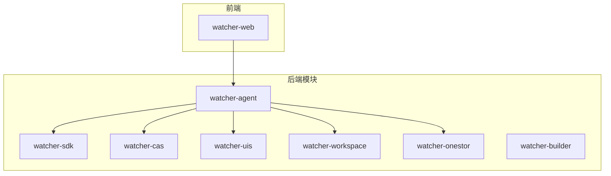
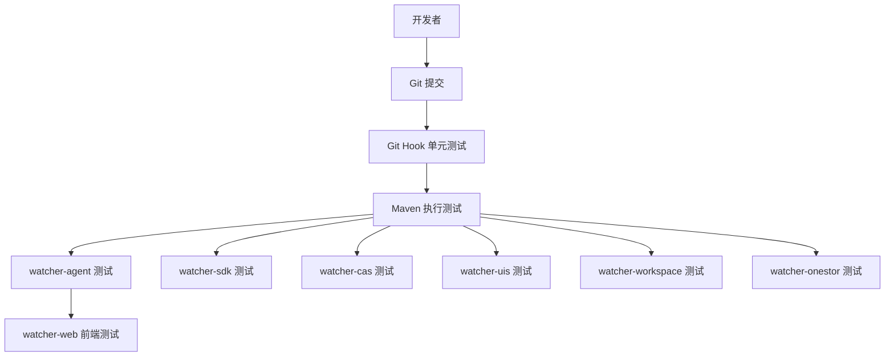
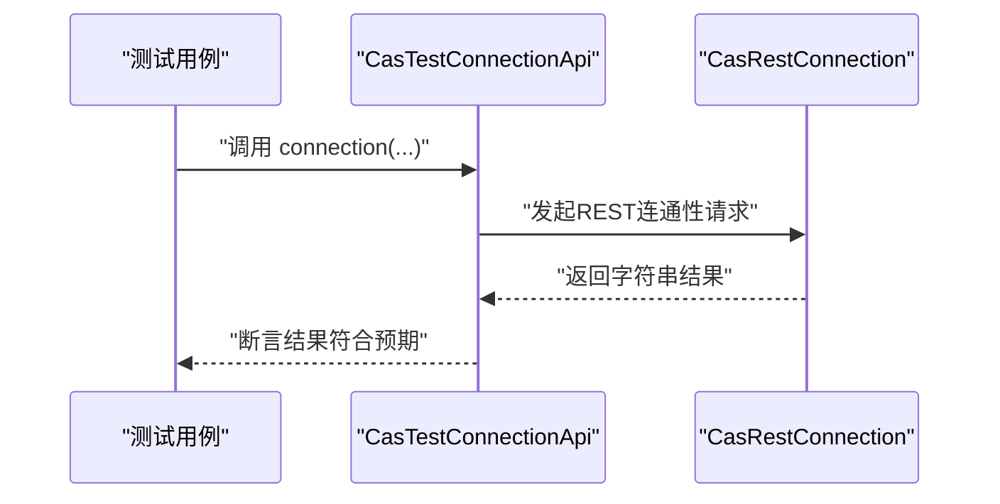
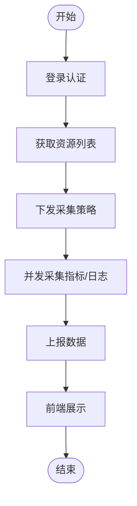
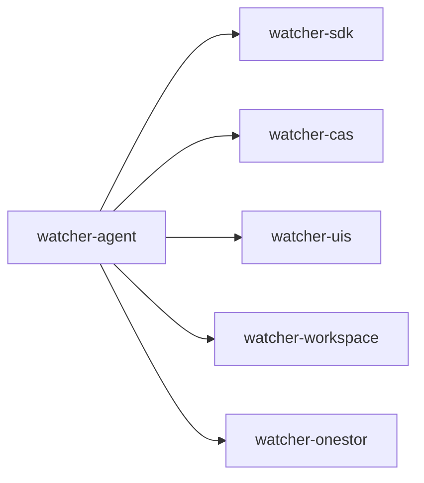

# 测试策略

<cite>
**本文引用的文件**
- [Readme.md](file://Readme.md)
- [pom.xml](file://pom.xml)
- [.githooks/run_unit_tests.py](file://.githooks/run_unit_tests.py)
- [watcher-agent/pom.xml](file://watcher-agent/pom.xml)
- [watcher-sdk/pom.xml](file://watcher-sdk/pom.xml)
- [watcher-web/package.json](file://watcher-web/package.json)
- [watcher-cas/src/main/java/com/virtual/cloud/om/cas/service/CasTestConnectionApi.java](file://watcher-cas/src/main/java/com/virtual/cloud/om/cas/service/CasTestConnectionApi.java)
- [watcher-agent/src/main/java/com/virtual/cloud/om/agent/service/DataReportCollectorOverview.java](file://watcher-agent/src/main/java/com/virtual/cloud/om/agent/service/DataReportCollectorOverview.java)
- [watcher-agent/src/main/java/com/virtual/cloud/om/agent/service/report/DataReportService.java](file://watcher-agent/src/main/java/com/virtual/cloud/om/agent/service/report/DataReportService.java)
- [watcher-sdk/src/main/java/com/virtual/cloud/om/sdk/api/PlatformTestConnectionApi.java](file://watcher-sdk/src/main/java/com/virtual/cloud/om/sdk/api/PlatformTestConnectionApi.java)
- [watcher-sdk/src/main/java/com/virtual/cloud/om/sdk/utils/MockDataUtil.java](file://watcher-sdk/src/main/java/com/virtual/cloud/om/sdk/utils/MockDataUtil.java)
- [watcher-agent/src/main/resources/application-test.properties](file://watcher-agent/src/main/resources/application-test.properties)
- [watcher-agent/src/main/resources/logback-test.xml](file://watcher-agent/src/main/resources/logback-test.xml)
- [pipeline.groovy](file://pipeline.groovy)
</cite>

## 目录
1. [引言](#引言)
2. [项目结构](#项目结构)
3. [核心组件](#核心组件)
4. [架构总览](#架构总览)
5. [详细组件分析](#详细组件分析)
6. [依赖分析](#依赖分析)
7. [性能考虑](#性能考虑)
8. [故障排查指南](#故障排查指南)
9. [结论](#结论)
10. [附录](#附录)

## 引言
本测试策略文档面向ShowTime监控系统，围绕单元测试、集成测试、端到端测试与性能测试，结合项目现有技术栈与脚手架能力，给出可落地的测试实践建议。系统采用多模块Maven聚合工程，后端基于Spring Boot，前端基于Vue3，测试覆盖Java后端、SDK工具与前端。

## 项目结构
- 后端多模块：watcher-agent、watcher-sdk、watcher-cas、watcher-uis、watcher-workspace、watcher-onestor、watcher-builder
- 前端：watcher-web（Vue3）
- 测试基础设施：Git Hook自动触发单元测试；各模块均具备spring-boot-starter-test依赖，便于单元测试与集成测试

图表来源
- [pom.xml:11-20](file://pom.xml#L11-L20)
- [watcher-agent/pom.xml:24-50](file://watcher-agent/pom.xml#L24-L50)

章节来源
- [Readme.md:27-45](file://Readme.md#L27-L45)
- [pom.xml:11-20](file://pom.xml#L11-L20)

## 核心组件
- 单元测试框架：Spring Boot Starter Test（JUnit、Mockito、AssertJ等组合）
- 集成测试：基于application-test.properties与logback-test.xml进行环境隔离与日志控制
- Git Hook：commit前自动执行单元测试，失败阻断提交
- 前端测试：基于Vite与mock插件，结合mock API进行前端逻辑验证

章节来源
- [watcher-agent/pom.xml:102-103](file://watcher-agent/pom.xml#L102-L103)
- [watcher-sdk/pom.xml:29-35](file://watcher-sdk/pom.xml#L29-L35)
- [.githooks/run_unit_tests.py:21-31](file://.githooks/run_unit_tests.py#L21-L31)
- [watcher-web/package.json:68-70](file://watcher-web/package.json#L68-L70)

## 架构总览
下图展示测试相关的关键交互：Git Hook触发测试、后端模块化测试、前端mock测试与SDK工具支撑。

图表来源
- [.githooks/run_unit_tests.py:94-113](file://.githooks/run_unit_tests.py#L94-L113)
- [watcher-agent/pom.xml:102-103](file://watcher-agent/pom.xml#L102-L103)
- [watcher-sdk/pom.xml:29-35](file://watcher-sdk/pom.xml#L29-L35)

## 详细组件分析

### 单元测试策略
- 测试框架选择
  - 后端：Spring Boot Starter Test（默认包含JUnit、Mockito、AssertJ等），适合快速搭建单元测试
  - 前端：Vite + mock插件，结合mock API进行UI与接口逻辑验证
- 测试用例编写规范
  - 命名：以被测方法名+场景+期望结果命名，避免模糊描述
  - 断言：优先使用领域化断言，减少对内部状态的直接依赖
  - 覆盖率：建议关键路径与边界条件达到高覆盖率，结合CI生成覆盖率报告
- Mock数据使用
  - 使用Mockito进行外部依赖隔离；对于复杂对象，可借助SDK中的MockDataUtil生成测试数据
  - 前端使用mockjs/mock API进行接口桩，确保UI逻辑独立验证
- 环境隔离
  - 使用application-test.properties与logback-test.xml，确保测试日志与配置与开发/生产隔离

章节来源
- [watcher-agent/pom.xml:102-103](file://watcher-agent/pom.xml#L102-L103)
- [watcher-sdk/pom.xml:29-35](file://watcher-sdk/pom.xml#L29-L35)
- [watcher-web/package.json:68-70](file://watcher-web/package.json#L68-L70)
- [watcher-sdk/src/main/java/com/virtual/cloud/om/sdk/utils/MockDataUtil.java](file://watcher-sdk/src/main/java/com/virtual/cloud/om/sdk/utils/MockDataUtil.java)
- [watcher-agent/src/main/resources/application-test.properties](file://watcher-agent/src/main/resources/application-test.properties)
- [watcher-agent/src/main/resources/logback-test.xml](file://watcher-agent/src/main/resources/logback-test.xml)

### 集成测试方案
- 模块间接口测试
  - 通过统一的SDK接口（如PlatformTestConnectionApi）验证平台连通性与上报流程
  - 示例：CasTestConnectionApi对接REST连接，验证连通性返回值
- 数据库集成测试
  - 使用application-test.properties配置测试数据库连接，确保测试不影响生产数据
  - 建议使用Flyway/Hibernate Schema生成测试schema，或在测试中初始化最小化数据集
- 外部系统集成测试
  - 通过Mock外部系统响应，验证数据上报与错误处理链路
  - 关键流程：资源识别 → 平台判定 → 并发采集 → 上报结果

图表来源
- [watcher-cas/src/main/java/com/virtual/cloud/om/cas/service/CasTestConnectionApi.java:18-23](file://watcher-cas/src/main/java/com/virtual/cloud/om/cas/service/CasTestConnectionApi.java#L18-L23)
- [watcher-sdk/src/main/java/com/virtual/cloud/om/sdk/api/PlatformTestConnectionApi.java](file://watcher-sdk/src/main/java/com/virtual/cloud/om/sdk/api/PlatformTestConnectionApi.java)

章节来源
- [watcher-cas/src/main/java/com/virtual/cloud/om/cas/service/CasTestConnectionApi.java:18-29](file://watcher-cas/src/main/java/com/virtual/cloud/om/cas/service/CasTestConnectionApi.java#L18-L29)
- [watcher-sdk/src/main/java/com/virtual/cloud/om/sdk/api/PlatformTestConnectionApi.java](file://watcher-sdk/src/main/java/com/virtual/cloud/om/sdk/api/PlatformTestConnectionApi.java)

### 端到端测试设计
- 用户场景模拟
  - 登录 → 资源列表 → 采集策略下发 → 实时日志/指标展示
  - 使用前端mock API与真实后端配合，验证完整业务闭环
- 业务流程验证
  - 数据上报流程：资源识别 → 平台判定 → 并发采集 → 上报结果 → 错误回退
- 用户体验测试
  - 页面加载性能、错误提示友好度、国际化文案一致性

图表来源
- [watcher-agent/src/main/java/com/virtual/cloud/om/agent/service/report/DataReportService.java:166-201](file://watcher-agent/src/main/java/com/virtual/cloud/om/agent/service/report/DataReportService.java#L166-L201)

章节来源
- [watcher-agent/src/main/java/com/virtual/cloud/om/agent/service/report/DataReportService.java:166-201](file://watcher-agent/src/main/java/com/virtual/cloud/om/agent/service/report/DataReportService.java#L166-L201)

### 性能测试方法
- 负载测试
  - 使用JMeter/Gatling对关键接口（如采集、上报、登录）施加逐步增长的并发请求
- 压力测试
  - 将请求量提升至系统瓶颈，观察错误率、响应时间与资源占用
- 并发测试
  - 验证多采集器并发执行与线程池配置的稳定性
- 性能基准测试
  - 固定场景下对比不同参数下的吞吐与延迟，形成基线

章节来源
- [watcher-agent/src/main/java/com/virtual/cloud/om/agent/service/report/DataReportService.java:188-201](file://watcher-agent/src/main/java/com/virtual/cloud/om/agent/service/report/DataReportService.java#L188-L201)

### 测试环境管理
- 测试数据准备
  - 使用MockDataUtil生成标准化测试数据；或在测试初始化阶段写入最小化样本数据
- 环境隔离
  - application-test.properties与logback-test.xml确保测试配置与日志独立
- 测试自动化
  - Git Hook在提交前自动执行单元测试，失败阻断合并

章节来源
- [watcher-sdk/src/main/java/com/virtual/cloud/om/sdk/utils/MockDataUtil.java](file://watcher-sdk/src/main/java/com/virtual/cloud/om/sdk/utils/MockDataUtil.java)
- [watcher-agent/src/main/resources/application-test.properties](file://watcher-agent/src/main/resources/application-test.properties)
- [watcher-agent/src/main/resources/logback-test.xml](file://watcher-agent/src/main/resources/logback-test.xml)
- [.githooks/run_unit_tests.py:200-245](file://.githooks/run_unit_tests.py#L200-L245)

### 测试工具与框架使用指南
- JUnit（随Spring Boot Starter Test引入）
  - 用于编写测试类与断言
- Mockito
  - 用于模拟外部依赖，隔离被测单元
- Selenium（建议）
  - 可选用于端到端UI测试，需配合浏览器驱动与页面对象模型
- 前端测试
  - Vite + mock插件，结合mock API进行接口与UI逻辑验证

章节来源
- [watcher-agent/pom.xml:102-103](file://watcher-agent/pom.xml#L102-L103)
- [watcher-sdk/pom.xml:29-35](file://watcher-sdk/pom.xml#L29-L35)
- [watcher-web/package.json:68-70](file://watcher-web/package.json#L68-L70)

### 持续集成中的测试实践
- 自动化测试流水线
  - 在CI中执行Maven测试阶段，确保每次合并前通过所有单元测试
- 测试报告生成
  - Maven Surefire/Failsafe插件生成XML报告；可在CI中上传报告供质量门禁使用
- 质量门禁
  - 设置失败即阻断规则；结合覆盖率阈值与测试时长阈值，保障发布质量

章节来源
- [.githooks/run_unit_tests.py:94-113](file://.githooks/run_unit_tests.py#L94-L113)
- [pipeline.groovy](file://pipeline.groovy)

## 依赖分析
- 组件耦合
  - watcher-agent依赖watcher-sdk与多个平台模块（cas/uis/workspace/onestor），测试时应通过接口抽象与Mock隔离外部依赖
- 直接与间接依赖
  - SDK提供统一接口与工具类，降低各平台模块间的重复实现
- 外部依赖与集成点
  - REST连接、WebSocket、定时任务等均为测试关注点

图表来源
- [watcher-agent/pom.xml:24-50](file://watcher-agent/pom.xml#L24-L50)

章节来源
- [watcher-agent/pom.xml:24-50](file://watcher-agent/pom.xml#L24-L50)

## 性能考虑
- 并发采集与线程池
  - DataReportService中使用异步与上下文类加载器设置，保证多线程环境下类加载稳定
- 上下文类加载器
  - 在ForkJoinPool工作线程中设置正确的TCCL，避免JAXB等类路径依赖问题
- 资源与网络
  - REST调用与WebSocket交互需在测试中模拟高延迟与失败场景，评估重试与降级策略

章节来源
- [watcher-agent/src/main/java/com/virtual/cloud/om/agent/service/report/DataReportService.java:188-201](file://watcher-agent/src/main/java/com/virtual/cloud/om/agent/service/report/DataReportService.java#L188-L201)

## 故障排查指南
- 提交被阻断
  - 检查Git Hook是否正确识别测试命令；确认Maven测试阶段是否正常执行
- 测试失败定位
  - 查看logback-test.xml输出与测试日志；核对application-test.properties配置
- 并发与线程问题
  - 关注DataReportService中的线程池与TCCL设置，必要时增加日志与异常捕获

章节来源
- [.githooks/run_unit_tests.py:200-245](file://.githooks/run_unit_tests.py#L200-L245)
- [watcher-agent/src/main/resources/logback-test.xml](file://watcher-agent/src/main/resources/logback-test.xml)
- [watcher-agent/src/main/resources/application-test.properties](file://watcher-agent/src/main/resources/application-test.properties)
- [watcher-agent/src/main/java/com/virtual/cloud/om/agent/service/report/DataReportService.java:188-201](file://watcher-agent/src/main/java/com/virtual/cloud/om/agent/service/report/DataReportService.java#L188-L201)

## 结论
本策略以“单元测试为基础、集成测试为补充、端到端测试为验证、性能测试为保障”的四层测试体系，结合项目现有Maven与Git Hook能力，形成可落地的测试实践。建议在CI中固化测试流程与质量门禁，并持续优化覆盖率与性能基线，确保系统稳定性与可维护性。

## 附录
- 测试清单
  - 单元测试：覆盖核心业务逻辑与边界条件
  - 集成测试：模块间接口、数据库与外部系统
  - 端到端测试：用户场景与业务流程
  - 性能测试：负载、压力、并发与基准
- 工具与版本建议
  - JUnit/Mockito：随Spring Boot Starter Test
  - 前端：Vite + mock插件
  - CI：Maven测试阶段 + 测试报告 + 质量门禁