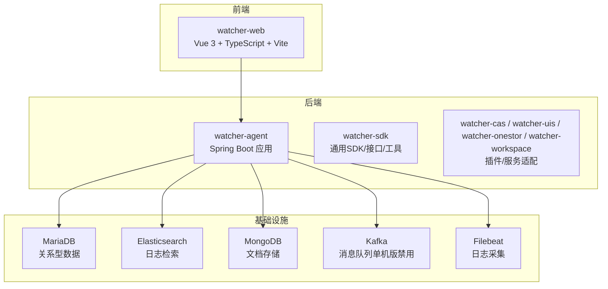
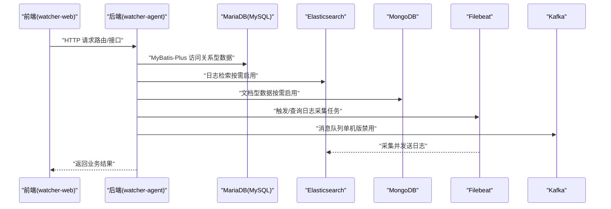
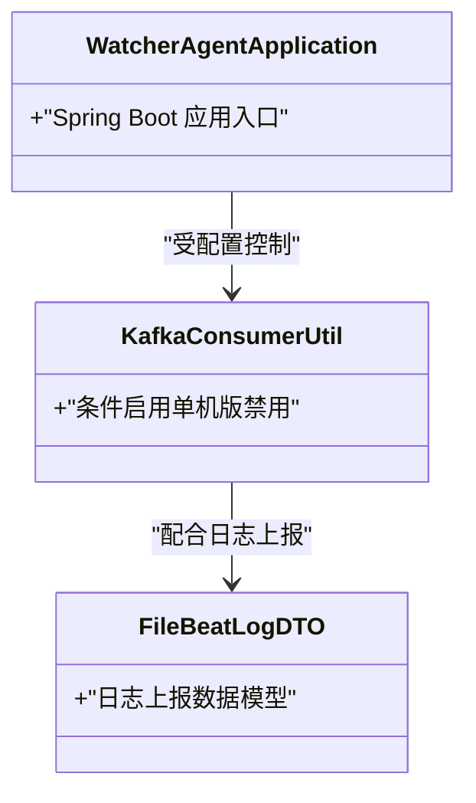
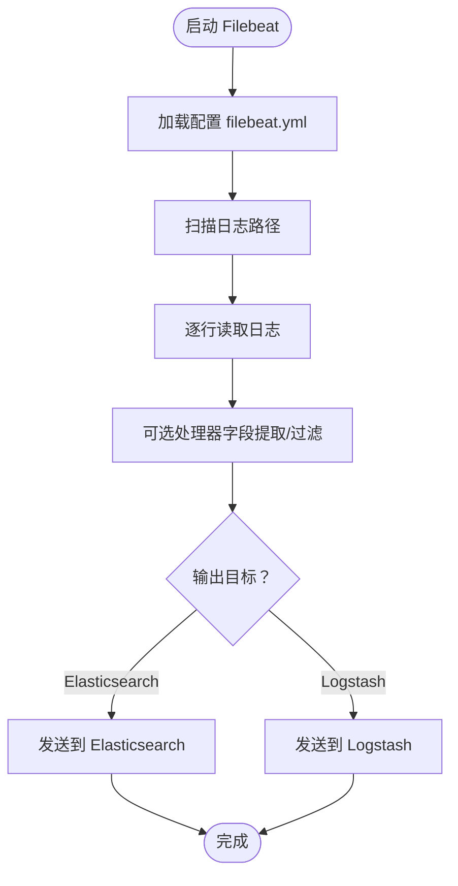
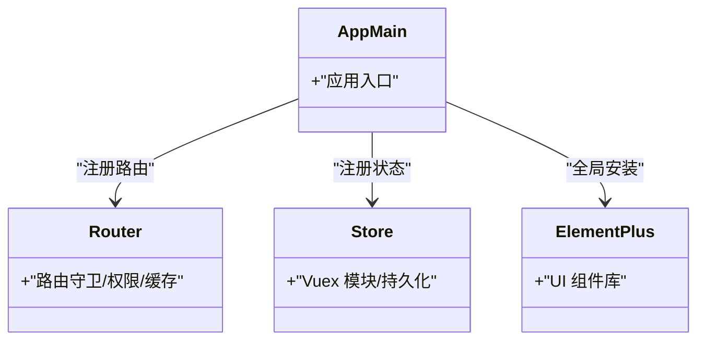
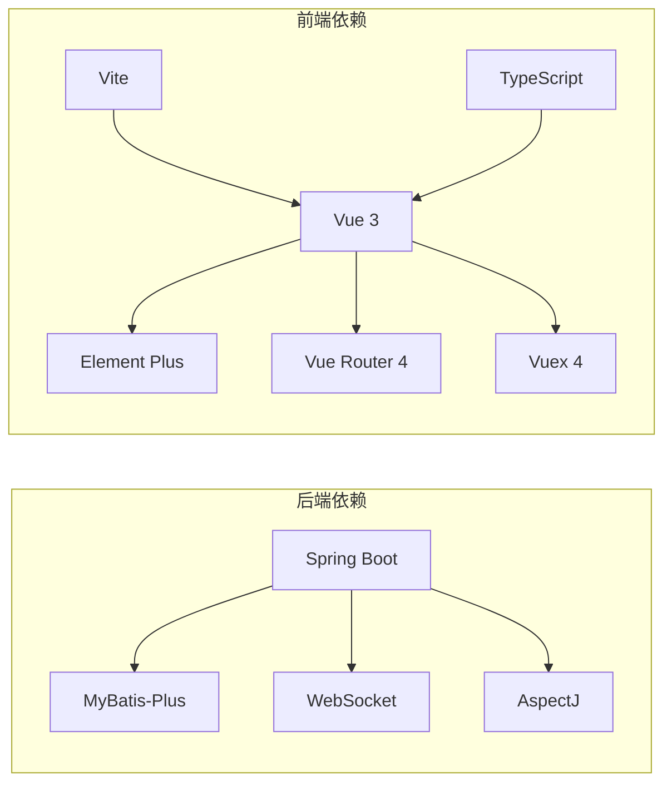

# 技术栈选型

<cite>
**本文引用的文件**
- [pom.xml](file://pom.xml)
- [watcher-agent/pom.xml](file://watcher-agent/pom.xml)
- [watcher-agent/src/main/resources/application.properties](file://watcher-agent/src/main/resources/application.properties)
- [watcher-agent/src/main/resources/application-test.properties](file://watcher-agent/src/main/resources/application-test.properties)
- [watcher-web/package.json](file://watcher-web/package.json)
- [watcher-web/vite.config.ts](file://watcher-web/vite.config.ts)
- [watcher-web/tsconfig.json](file://watcher-web/tsconfig.json)
- [watcher-web/src/main.ts](file://watcher-web/src/main.ts)
- [watcher-web/src/router/index.ts](file://watcher-web/src/router/index.ts)
- [watcher-web/src/store/index.ts](file://watcher-web/src/store/index.ts)
- [watcher-sdk/src/main/java/com/virtual/cloud/om/sdk/utils/KafkaConsumerUtil.java](file://watcher-sdk/src/main/java/com/virtual/cloud/om/sdk/utils/KafkaConsumerUtil.java)
- [watcher-sdk/src/main/java/com/virtual/cloud/om/sdk/dto/FileBeatLogDTO.java](file://watcher-sdk/src/main/java/com/virtual/cloud/om/sdk/dto/FileBeatLogDTO.java)
- [watcher-builder/assembly/components/filebeat/filebeat-8.0.1-linux-x86_64/filebeat.yml](file://watcher-builder/assembly/components/filebeat/filebeat-8.0.1-linux-x86_8/filebeat.yml)
- [watcher-builder/assembly/components/filebeat/filebeat-8.0.1-linux-x86_64/filebeat.reference.yml](file://watcher-builder/assembly/components/filebeat/filebeat-8.0.1-linux-x86_64/filebeat.reference.yml)
- [watcher-builder/assembly/components/filebeat/startup.sh](file://watcher-builder/assembly/components/filebeat/startup.sh)
- [watcher-builder/assembly/components/filebeat/shutdown.sh](file://watcher-builder/assembly/components/filebeat/shutdown.sh)
- [watcher-builder/assembly/components/filebeat/status.sh](file://watcher-builder/assembly/components/filebeat/status.sh)
</cite>

## 目录
1. [引言](#引言)
2. [项目结构](#项目结构)
3. [核心组件](#核心组件)
4. [架构总览](#架构总览)
5. [详细组件分析](#详细组件分析)
6. [依赖分析](#依赖分析)
7. [性能考虑](#性能考虑)
8. [故障排查指南](#故障排查指南)
9. [结论](#结论)
10. [附录](#附录)

## 引言
本技术栈选型文档面向ShowTime监控系统，围绕后端与前端的关键技术与框架选择进行系统化说明，并结合实际代码与配置文件给出依据与权衡。重点覆盖以下方面：
- 后端技术栈：Spring Boot、MyBatis-Plus、MariaDB、Elasticsearch、MongoDB、Kafka、Filebeat
- 前端技术栈：Vue 3、Element Plus、TypeScript、Vite、Vue Router、Vuex
- 数据库选型策略：MySQL/MariaDB（关系型）、MongoDB（文档型）、Elasticsearch（日志检索）
- 消息队列与日志采集：Kafka（单机版禁用）、Filebeat（日志采集）

## 项目结构
ShowTime采用多模块Maven聚合工程组织，后端以Spring Boot为核心，前端采用Vue 3生态，构建与打包通过Vite完成。整体结构如下：

图表来源
- [pom.xml:11-18](file://pom.xml#L11-L18)
- [watcher-agent/pom.xml:54-136](file://watcher-agent/pom.xml#L54-L136)
- [watcher-web/package.json:20-54](file://watcher-web/package.json#L20-L54)

章节来源
- [pom.xml:11-18](file://pom.xml#L11-L18)
- [watcher-agent/pom.xml:54-136](file://watcher-agent/pom.xml#L54-L136)
- [watcher-web/package.json:20-54](file://watcher-web/package.json#L20-L54)

## 核心组件
- 后端核心：Spring Boot 2.5.12，Actuator，Web，Validation，WebSocket，AOP/AspectJ，MyBatis-Plus
- 数据库：MariaDB（关系型），MongoDB（文档型），Elasticsearch（日志检索）
- 消息队列：Kafka（单机版默认禁用）
- 日志采集：Filebeat（日志采集与转发）
- 前端核心：Vue 3，Element Plus，TypeScript，Vite，Vue Router，Vuex

章节来源
- [watcher-agent/pom.xml:54-136](file://watcher-agent/pom.xml#L54-L136)
- [watcher-agent/src/main/resources/application.properties:14-20](file://watcher-agent/src/main/resources/application.properties#L14-L20)
- [watcher-agent/src/main/resources/application-test.properties:3-26](file://watcher-agent/src/main/resources/application-test.properties#L3-L26)
- [watcher-sdk/src/main/java/com/virtual/cloud/om/sdk/utils/KafkaConsumerUtil.java:1-14](file://watcher-sdk/src/main/java/com/virtual/cloud/om/sdk/utils/KafkaConsumerUtil.java#L1-L14)
- [watcher-web/package.json:20-54](file://watcher-web/package.json#L20-L54)

## 架构总览
系统采用“前端Vue 3 + 后端Spring Boot”的分层架构，后端通过REST接口与前端交互，同时集成多种中间件满足不同场景需求。下图展示了核心交互流程：

图表来源
- [watcher-web/src/router/index.ts:27-30](file://watcher-web/src/router/index.ts#L27-L30)
- [watcher-agent/src/main/resources/application.properties:14-20](file://watcher-agent/src/main/resources/application.properties#L14-L20)
- [watcher-agent/src/main/resources/application-test.properties:3-26](file://watcher-agent/src/main/resources/application-test.properties#L3-L26)
- [watcher-sdk/src/main/java/com/virtual/cloud/om/sdk/utils/KafkaConsumerUtil.java:1-14](file://watcher-sdk/src/main/java/com/virtual/cloud/om/sdk/utils/KafkaConsumerUtil.java#L1-L14)

## 详细组件分析

### 后端技术栈：Spring Boot 与周边
- Spring Boot：统一依赖管理与自动装配，Actuator提供运行时监控，Web与Validation支撑REST服务与参数校验，WebSocket支持实时通信。
- MyBatis-Plus：简化持久层开发，配置驼峰映射与Mapper扫描，提升开发效率。
- MariaDB：作为关系型数据库，承担业务主数据存储；驱动与连接参数在配置中明确。

图表来源
- [watcher-agent/pom.xml:54-136](file://watcher-agent/pom.xml#L54-L136)
- [watcher-sdk/src/main/java/com/virtual/cloud/om/sdk/utils/KafkaConsumerUtil.java:1-14](file://watcher-sdk/src/main/java/com/virtual/cloud/om/sdk/utils/KafkaConsumerUtil.java#L1-L14)
- [watcher-sdk/src/main/java/com/virtual/cloud/om/sdk/dto/FileBeatLogDTO.java:14-35](file://watcher-sdk/src/main/java/com/virtual/cloud/om/sdk/dto/FileBeatLogDTO.java#L14-L35)

章节来源
- [watcher-agent/pom.xml:54-136](file://watcher-agent/pom.xml#L54-L136)
- [watcher-agent/src/main/resources/application.properties:48-58](file://watcher-agent/src/main/resources/application.properties#L48-L58)
- [watcher-sdk/src/main/java/com/virtual/cloud/om/sdk/utils/KafkaConsumerUtil.java:1-14](file://watcher-sdk/src/main/java/com/virtual/cloud/om/sdk/utils/KafkaConsumerUtil.java#L1-L14)

### 数据库选型策略
- 关系型数据（MariaDB/MySQL）：承载业务主数据，MyBatis-Plus提供ORM能力，配置中包含Mapper扫描与驼峰映射。
- 文档型数据（MongoDB）：用于非结构化或半结构化日志元数据等场景，测试配置中可见其URI与索引创建。
- 日志检索（Elasticsearch）：用于海量日志的快速检索与可视化，测试配置中包含集群名称、认证信息与连接参数。

章节来源
- [watcher-agent/src/main/resources/application.properties:48-58](file://watcher-agent/src/main/resources/application.properties#L48-L58)
- [watcher-agent/src/main/resources/application-test.properties:3-26](file://watcher-agent/src/main/resources/application-test.properties#L3-L26)

### 消息队列Kafka选型与现状
- 选型优势：高吞吐、可扩展、支持流式处理与解耦生产消费。
- 实际状态：单机版默认禁用，通过配置项控制启用；SDK侧存在条件启用注解，表明该功能可按部署环境切换。

章节来源
- [watcher-agent/src/main/resources/application.properties:16-18](file://watcher-agent/src/main/resources/application.properties#L16-L18)
- [watcher-sdk/src/main/java/com/virtual/cloud/om/sdk/utils/KafkaConsumerUtil.java:1-14](file://watcher-sdk/src/main/java/com/virtual/cloud/om/sdk/utils/KafkaConsumerUtil.java#L1-L14)

### 日志采集Filebeat应用
- Filebeat职责：从指定日志路径采集行级日志，按需转发至Elasticsearch或Logstash。
- 配置要点：inputs中定义日志路径与过滤规则；输出可指向Elasticsearch；参考配置文件包含完整选项说明。
- 集群与单机：测试配置演示单机模式，生产可扩展为集群模式。

图表来源
- [watcher-builder/assembly/components/filebeat/filebeat-8.0.1-linux-x86_64/filebeat.yml:15-31](file://watcher-builder/assembly/components/filebeat/filebeat-8.0.1-linux-x86_64/filebeat.yml#L15-L31)
- [watcher-builder/assembly/components/filebeat/filebeat-8.0.1-linux-x86_64/filebeat.reference.yml:2473-4627](file://watcher-builder/assembly/components/filebeat/filebeat-8.0.1-linux-x86_64/filebeat.reference.yml#L2473-L4627)

章节来源
- [watcher-builder/assembly/components/filebeat/filebeat-8.0.1-linux-x86_64/filebeat.yml:1-188](file://watcher-builder/assembly/components/filebeat/filebeat-8.0.1-linux-x86_64/filebeat.yml#L1-L188)
- [watcher-builder/assembly/components/filebeat/filebeat-8.0.1-linux-x86_64/filebeat.reference.yml:2473-4627](file://watcher-builder/assembly/components/filebeat/filebeat-8.0.1-linux-x86_64/filebeat.reference.yml#L2473-L4627)

### 前端技术栈：Vue 3 + Element Plus + TypeScript + Vite
- Vue 3：组合式API与更好的Tree-shaking，配合TypeScript获得更强类型保障。
- Element Plus：丰富的UI组件库，提供主题定制与国际化支持。
- Vite：快速冷启动与热更新，构建优化与别名配置。
- Vue Router：路由守卫与权限控制，动态标题与缓存策略。
- Vuex：集中式状态管理，持久化插件实现跨会话状态保持。

图表来源
- [watcher-web/src/main.ts:26-36](file://watcher-web/src/main.ts#L26-L36)
- [watcher-web/src/router/index.ts:27-30](file://watcher-web/src/router/index.ts#L27-L30)
- [watcher-web/src/store/index.ts:32-38](file://watcher-web/src/store/index.ts#L32-L38)

章节来源
- [watcher-web/package.json:20-54](file://watcher-web/package.json#L20-L54)
- [watcher-web/vite.config.ts:13-49](file://watcher-web/vite.config.ts#L13-L49)
- [watcher-web/tsconfig.json:2-18](file://watcher-web/tsconfig.json#L2-L18)
- [watcher-web/src/main.ts:26-36](file://watcher-web/src/main.ts#L26-L36)
- [watcher-web/src/router/index.ts:35-52](file://watcher-web/src/router/index.ts#L35-L52)
- [watcher-web/src/store/index.ts:32-38](file://watcher-web/src/store/index.ts#L32-L38)

## 依赖分析
- 后端依赖：Spring Boot Starter Web/Actuator/WebSocket/Validation，AOP/AspectJ，MyBatis-Plus，Gson，SnakeYAML等。
- 前端依赖：Vue 3、Element Plus、Vue Router 4、Vuex 4、Axios、ECharts、Socket.IO、MockJS、TypeScript等。
- 构建工具：Vite提供开发服务器、代理与打包优化；TypeScript编译器与类型声明。

图表来源
- [watcher-agent/pom.xml:54-136](file://watcher-agent/pom.xml#L54-L136)
- [watcher-web/package.json:20-54](file://watcher-web/package.json#L20-L54)
- [watcher-web/vite.config.ts:45-47](file://watcher-web/vite.config.ts#L45-L47)

章节来源
- [watcher-agent/pom.xml:54-136](file://watcher-agent/pom.xml#L54-L136)
- [watcher-web/package.json:20-54](file://watcher-web/package.json#L20-L54)
- [watcher-web/vite.config.ts:45-47](file://watcher-web/vite.config.ts#L45-L47)

## 性能考虑
- 后端：合理配置线程池与连接池，开启Actuator健康检查与指标暴露；WebSocket长连接注意内存与并发控制。
- 前端：Vite按需拆分chunk（如将ECharts独立分包），减少首屏体积；路由与组件缓存策略降低重复渲染。
- 数据库：MariaDB连接超时与字符集设置需与业务量匹配；Elasticsearch索引策略与分片副本影响查询性能。
- 日志：Filebeat输入路径与过滤规则避免无意义扫描；输出到Elasticsearch时建议批量发送与压缩。

## 故障排查指南
- 后端配置开关：确认application.properties中各中间件开关（如elasticsearch.enable、kafka.enable、mongodb.enable）与实际部署一致。
- 日志采集：检查Filebeat配置文件中的paths与enabled状态；通过status脚本确认进程状态；必要时查看参考配置文件的完整选项。
- 前端代理：确认Vite代理配置与后端服务端口一致；开发环境下host与端口需与后端context-path匹配。
- 类型与构建：TypeScript严格模式下确保类型声明完整；Vite别名与路径映射需与项目结构一致。

章节来源
- [watcher-agent/src/main/resources/application.properties:16-18](file://watcher-agent/src/main/resources/application.properties#L16-L18)
- [watcher-builder/assembly/components/filebeat/filebeat-8.0.1-linux-x86_64/filebeat.yml:22-31](file://watcher-builder/assembly/components/filebeat/filebeat-8.0.1-linux-x86_64/filebeat.yml#L22-L31)
- [watcher-builder/assembly/components/filebeat/status.sh:1-9](file://watcher-builder/assembly/components/filebeat/status.sh#L1-L9)
- [watcher-web/vite.config.ts:23-34](file://watcher-web/vite.config.ts#L23-L34)
- [watcher-web/tsconfig.json:2-18](file://watcher-web/tsconfig.json#L2-L18)

## 结论
ShowTime的技术栈在后端采用Spring Boot与MyBatis-Plus构建稳定的服务层，在前端采用Vue 3与Element Plus实现现代化交互体验。数据库层面以MariaDB为主，辅以MongoDB与Elasticsearch满足文档与日志检索需求；消息队列Kafka在单机版默认禁用，具备按需启用的能力；Filebeat负责日志采集与转发。整体选型兼顾易用性、可维护性与扩展性，适合中大型监控系统的演进需求。

## 附录
- 技术栈对比与替代方案（概念性说明）
  - 后端框架：Spring Boot vs. Micronaut/Quarkus（更轻量但生态差异较大）
  - ORM：MyBatis-Plus vs. JPA/Hibernate（后者配置更简单但灵活性略低）
  - 前端框架：Vue 3 vs. React（生态与团队熟悉度决定）
  - UI库：Element Plus vs. Ant Design Vue/Naive UI（组件风格与设计语言）
  - 构建工具：Vite vs. Webpack（开发体验与生态成熟度）
  - 数据库：MariaDB vs. PostgreSQL（事务特性与生态差异）
  - 日志检索：Elasticsearch vs. OpenSearch/Loki（许可证与生态）
  - 消息队列：Kafka vs. RabbitMQ/RocketMQ（吞吐与生态差异）