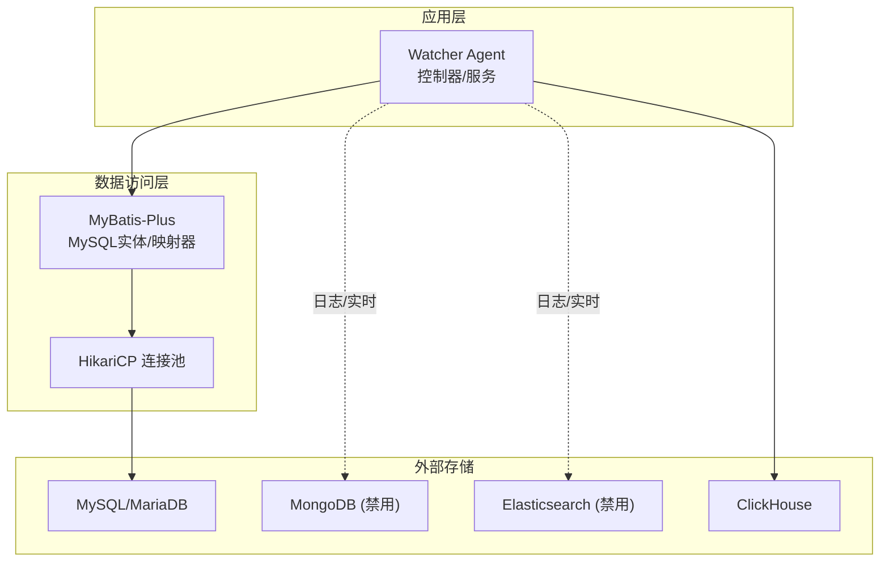
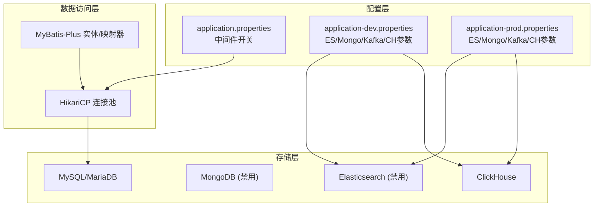
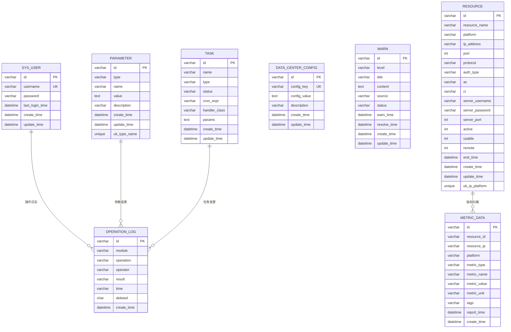
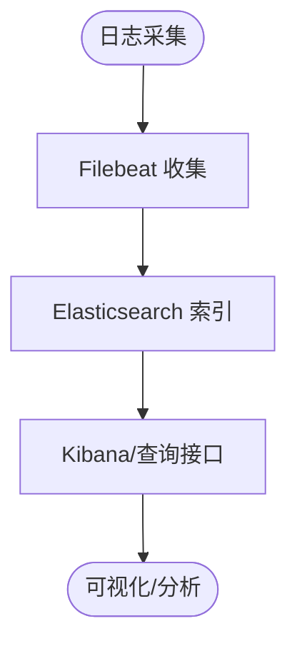
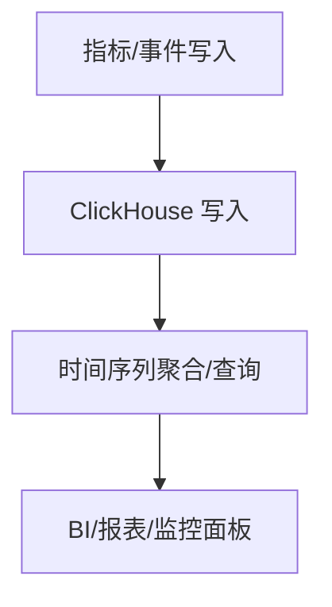
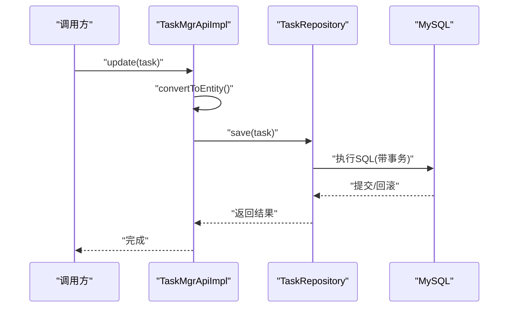
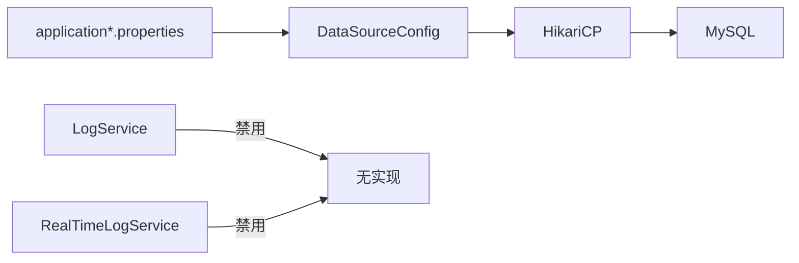

# 多数据库存储架构

<cite>
**本文引用的文件**
- [application.properties](file://watcher-agent/src/main/resources/application.properties)
- [application-dev.properties](file://watcher-agent/src/main/resources/application-dev.properties)
- [application-prod.properties](file://watcher-agent/src/main/resources/application-prod.properties)
- [DataSourceConfig.java](file://watcher-agent/src/main/java/com/virtual/cloud/om/agent/config/DataSourceConfig.java)
- [schema-mysql.sql](file://watcher-agent/src/main/resources/schema-mysql.sql)
- [init.sql](file://watcher-agent/src/main/resources/database/init.sql)
- [MetricData.java](file://watcher-sdk/src/main/java/com/virtual/cloud/om/sdk/entity/mysql/MetricData.java)
- [LogService.java](file://watcher-agent/src/main/java/com/virtual/cloud/om/agent/service/logs/LogService.java)
- [RealTimeLogService.java](file://watcher-agent/src/main/java/com/virtual/cloud/om/agent/service/logs/RealTimeLogService.java)
- [es_mapping_serverlog.json](file://watcher-agent/src/main/resources/es_mapping_serverlog.json)
- [filebeat.reference.yml](file://watcher-builder/assembly/components/filebeat/filebeat-8.0.1-linux-x86_64/filebeat.reference.yml)
- [TaskMgrApiImpl.java](file://watcher-agent/src/main/java/com/virtual/cloud/om/agent/service/task/TaskMgrApiImpl.java)
</cite>

## 目录
1. [简介](#简介)
2. [项目结构](#项目结构)
3. [核心组件](#核心组件)
4. [架构总览](#架构总览)
5. [详细组件分析](#详细组件分析)
6. [依赖分析](#依赖分析)
7. [性能考虑](#性能考虑)
8. [故障排查指南](#故障排查指南)
9. [结论](#结论)
10. [附录](#附录)

## 简介
本文件面向ShowTime监控系统，系统性梳理其多数据库存储架构设计与实现，重点覆盖以下方面：
- MySQL、MongoDB、Elasticsearch、ClickHouse在监控系统中的角色分工与数据分布策略
- 关系型与非关系型数据的存储选择原则（结构化指标、日志、时间序列）
- 数据库连接池配置、事务管理与一致性保障机制
- 数据分片、索引优化与查询性能调优策略
- 数据库监控指标与容量规划建议（含增长预测与成本优化）

## 项目结构
围绕多数据库存储，代码库主要由以下部分构成：
- 应用配置层：集中于Spring Boot配置文件，定义各数据库中间件的开关与连接参数
- 数据访问层：基于MyBatis-Plus的MySQL实体与映射器，配合HikariCP连接池
- 日志与实时采集：通过Filebeat对接Elasticsearch；MongoDB与Kafka在当前模式下处于禁用状态
- 时间序列与指标：ClickHouse用于高性能写入与聚合分析，MySQL承担结构化元数据与事务性业务

**图表来源**
- [application.properties:14-28](file://watcher-agent/src/main/resources/application.properties#L14-L28)
- [DataSourceConfig.java:27-45](file://watcher-agent/src/main/java/com/virtual/cloud/om/agent/config/DataSourceConfig.java#L27-L45)

**章节来源**
- [application.properties:1-80](file://watcher-agent/src/main/resources/application.properties#L1-L80)
- [application-dev.properties:1-72](file://watcher-agent/src/main/resources/application-dev.properties#L1-L72)
- [application-prod.properties:1-70](file://watcher-agent/src/main/resources/application-prod.properties#L1-L70)

## 核心组件
- MySQL/MariaDB：承载结构化业务数据与指标明细表，采用MyBatis-Plus进行ORM映射，HikariCP提供高性能连接池
- MongoDB：当前模式下禁用，保留配置以支持未来扩展
- Elasticsearch：当前模式下禁用，保留配置与索引映射文件以支持日志检索
- ClickHouse：用于高吞吐写入与时间序列分析，提供高效聚合能力

**章节来源**
- [schema-mysql.sql:1-204](file://watcher-agent/src/main/resources/schema-mysql.sql#L1-L204)
- [application.properties:16-19](file://watcher-agent/src/main/resources/application.properties#L16-L19)
- [application-dev.properties:65-69](file://watcher-agent/src/main/resources/application-dev.properties#L65-L69)
- [application-prod.properties:65-69](file://watcher-agent/src/main/resources/application-prod.properties#L65-L69)

## 架构总览
系统在“单机版MySQL”模式下运行，通过配置项控制中间件开关，确保核心功能稳定。日志与实时采集路径在当前配置中被禁用，但保留了ES/Mongo/Kafka的配置与映射文件，便于后续按需启用。

**图表来源**
- [application.properties:14-28](file://watcher-agent/src/main/resources/application.properties#L14-L28)
- [application-dev.properties:3-31](file://watcher-agent/src/main/resources/application-dev.properties#L3-L31)
- [application-prod.properties:3-29](file://watcher-agent/src/main/resources/application-prod.properties#L3-L29)

## 详细组件分析

### MySQL/MariaDB：结构化指标与业务数据
- 数据模型：包含用户、参数、任务、操作日志、数据中心配置、告警、资源、指标数据等表，采用InnoDB引擎与UTF8MB4字符集
- 索引策略：对高频查询字段建立索引，如操作日志的deleted/time、参数的type+name、任务status、资源的platform/ip/usable、指标的resource_id/type/report_time/platform
- ORM映射：使用MyBatis-Plus注解映射到实体类，如MetricData实体对应指标明细表
- 连接池：HikariCP配置最大池大小、空闲超时、最大生命周期等参数，MariaDB驱动参数包含时区与SSL设置

**图表来源**
- [schema-mysql.sql:9-204](file://watcher-agent/src/main/resources/schema-mysql.sql#L9-L204)

**章节来源**
- [schema-mysql.sql:1-204](file://watcher-agent/src/main/resources/schema-mysql.sql#L1-L204)
- [MetricData.java:1-42](file://watcher-sdk/src/main/java/com/virtual/cloud/om/sdk/entity/mysql/MetricData.java#L1-L42)
- [DataSourceConfig.java:27-45](file://watcher-agent/src/main/java/com/virtual/cloud/om/agent/config/DataSourceConfig.java#L27-L45)

### MongoDB：文档型数据存储（当前禁用）
- 配置：在开发环境配置了MongoDB URI与副本集参数，自动索引创建开启
- 当前状态：在应用配置中明确禁用，相关服务实现为空实现或跳过逻辑

**章节来源**
- [application-dev.properties:3-5](file://watcher-agent/src/main/resources/application-dev.properties#L3-L5)
- [application.properties:16-19](file://watcher-agent/src/main/resources/application.properties#L16-L19)
- [LogService.java:21-49](file://watcher-agent/src/main/java/com/virtual/cloud/om/agent/service/logs/LogService.java#L21-L49)

### Elasticsearch：日志检索与分析（当前禁用）
- 配置：开发/生产环境分别配置集群名、用户名、密码、主机列表、超时与并发参数
- 索引映射：提供服务器日志的映射模板，包含IK分词器与keyword字段
- 当前状态：在应用配置中禁用，相关服务未启用

**图表来源**
- [es_mapping_serverlog.json:1-62](file://watcher-agent/src/main/resources/es_mapping_serverlog.json#L1-L62)
- [filebeat.reference.yml:3656-3720](file://watcher-builder/assembly/components/filebeat/filebeat-8.0.1-linux-x86_64/filebeat.reference.yml#L3656-L3720)

**章节来源**
- [application-dev.properties:8-31](file://watcher-agent/src/main/resources/application-dev.properties#L8-L31)
- [application-prod.properties:7-29](file://watcher-agent/src/main/resources/application-prod.properties#L7-L29)
- [es_mapping_serverlog.json:1-62](file://watcher-agent/src/main/resources/es_mapping_serverlog.json#L1-L62)
- [filebeat.reference.yml:3656-3720](file://watcher-builder/assembly/components/filebeat/filebeat-8.0.1-linux-x86_64/filebeat.reference.yml#L3656-L3720)

### ClickHouse：时间序列与高吞吐写入
- 配置：开发/生产环境提供endpoint、用户、密码、数据库参数
- 初始化脚本：提供awesome_metrics表的建表语句，使用MergeTree引擎并按时间排序
- 适用场景：高吞吐写入、时间序列聚合分析、大规模OLAP查询

**图表来源**
- [application-dev.properties:65-69](file://watcher-agent/src/main/resources/application-dev.properties#L65-L69)
- [application-prod.properties:65-69](file://watcher-agent/src/main/resources/application-prod.properties#L65-L69)
- [init.sql:1-12](file://watcher-agent/src/main/resources/database/init.sql#L1-L12)

**章节来源**
- [application-dev.properties:65-69](file://watcher-agent/src/main/resources/application-dev.properties#L65-L69)
- [application-prod.properties:65-69](file://watcher-agent/src/main/resources/application-prod.properties#L65-L69)
- [init.sql:1-12](file://watcher-agent/src/main/resources/database/init.sql#L1-L12)

### 事务管理与一致性保障
- 事务注解：在任务管理的更新流程中标注@Transactional，确保更新操作的原子性
- 一致性策略：MySQL承担强一致性的业务事务；日志与实时采集在当前模式下禁用，避免跨库事务复杂度

**图表来源**
- [TaskMgrApiImpl.java:91-104](file://watcher-agent/src/main/java/com/virtual/cloud/om/agent/service/task/TaskMgrApiImpl.java#L91-L104)

**章节来源**
- [TaskMgrApiImpl.java:91-104](file://watcher-agent/src/main/java/com/virtual/cloud/om/agent/service/task/TaskMgrApiImpl.java#L91-L104)

## 依赖分析
- 组件耦合：数据访问层通过MyBatis-Plus与MySQL交互，连接池由HikariCP统一管理
- 外部依赖：Elasticsearch、MongoDB、Kafka、ClickHouse通过配置文件集中管理，当前模式下部分中间件禁用
- 接口契约：日志服务与实时日志服务在当前模式下提供空实现或禁用逻辑，避免对禁用中间件产生依赖

**图表来源**
- [DataSourceConfig.java:27-45](file://watcher-agent/src/main/java/com/virtual/cloud/om/agent/config/DataSourceConfig.java#L27-L45)
- [application.properties:14-28](file://watcher-agent/src/main/resources/application.properties#L14-L28)
- [LogService.java:21-49](file://watcher-agent/src/main/java/com/virtual/cloud/om/agent/service/logs/LogService.java#L21-L49)
- [RealTimeLogService.java:32-37](file://watcher-agent/src/main/java/com/virtual/cloud/om/agent/service/logs/RealTimeLogService.java#L32-L37)

**章节来源**
- [application.properties:14-28](file://watcher-agent/src/main/resources/application.properties#L14-L28)
- [LogService.java:21-49](file://watcher-agent/src/main/java/com/virtual/cloud/om/agent/service/logs/LogService.java#L21-L49)
- [RealTimeLogService.java:32-37](file://watcher-agent/src/main/java/com/virtual/cloud/om/agent/service/logs/RealTimeLogService.java#L32-L37)

## 性能考虑
- 连接池优化
  - HikariCP参数：最大池大小、最小空闲、连接超时、空闲超时、最大生命周期，结合MariaDB驱动参数与时区设置
  - 建议：根据峰值并发与慢查询情况调整最大池大小与连接超时，避免连接泄漏与抖动
- 索引优化
  - MySQL：为高频过滤/排序字段建立复合索引，避免全表扫描；定期分析表统计信息，重建碎片化索引
  - ClickHouse：按时间列排序（ORDER BY）与分区策略提升查询效率；合理设置TTL与合并策略
- 查询调优
  - 使用EXPLAIN分析慢查询；限制返回字段与分页；对大表使用分区裁剪
  - 对日志检索，若启用Elasticsearch，建议使用keyword字段进行精确匹配，text字段配合分词器进行全文检索
- 写入优化
  - ClickHouse：批量写入、压缩编码、异步落盘；避免小粒度频繁写入
  - MySQL：批量插入、减少事务跨度、使用合适的字符集与存储引擎

[本节为通用性能指导，不直接分析具体文件]

## 故障排查指南
- 中间件开关检查
  - 确认application.properties中各中间件开关状态，避免误启导致启动失败或功能异常
- 连接参数校验
  - MySQL：核对URL、用户名、密码、驱动类名与时区设置
  - Elasticsearch：核对集群名、用户名、密码、主机列表与超时参数
  - ClickHouse：核对endpoint、用户、密码、数据库
- 连接池问题
  - 观察连接池指标（活跃连接数、等待时间、拒绝次数），必要时调整最大池大小与超时
- 日志与实时采集
  - 当前模式下日志与实时采集服务为空实现或禁用，若出现异常应检查配置开关与服务实现

**章节来源**
- [application.properties:14-28](file://watcher-agent/src/main/resources/application.properties#L14-L28)
- [application-dev.properties:3-31](file://watcher-agent/src/main/resources/application-dev.properties#L3-L31)
- [application-prod.properties:3-29](file://watcher-agent/src/main/resources/application-prod.properties#L3-L29)
- [DataSourceConfig.java:27-45](file://watcher-agent/src/main/java/com/virtual/cloud/om/agent/config/DataSourceConfig.java#L27-L45)

## 结论
- 在“单机版MySQL”模式下，系统通过集中配置与连接池实现了稳定的结构化数据存储与事务处理
- 日志与实时采集在当前配置中处于禁用状态，但保留了ES/Mongo/Kafka的配置与映射文件，便于后续按需启用
- ClickHouse作为时间序列与高吞吐分析的补充，适合大规模指标与日志的聚合分析
- 建议在启用其他中间件时，同步完善索引与查询优化策略，并持续监控连接池与数据库性能指标

[本节为总结性内容，不直接分析具体文件]

## 附录

### 数据分布策略与存储选择原则
- 结构化指标数据（MySQL）
  - 适用：需要强一致性的业务事务、复杂关联查询、可审计的日志与参数配置
  - 设计要点：规范化表结构、合理索引、事务边界清晰
- 日志数据（Elasticsearch/ClickHouse）
  - 适用：海量日志检索、全文检索、时间序列分析
  - 设计要点：字段类型选择（keyword/text）、分词器配置、索引/分区策略
- 时间序列数据（ClickHouse）
  - 适用：高吞吐写入、宽表聚合、快速OLAP查询
  - 设计要点：ORDER BY时间列、分区键、TTL与合并策略

[本节为概念性内容，不直接分析具体文件]

### 容量规划与成本优化建议
- 增长预测
  - 基于指标上报速率与日志量级估算每日/每月增量，结合保留周期推导总容量需求
- 成本优化
  - 分层存储：热数据存SSD，冷数据迁移至对象存储或低频存储
  - 压缩与归档：启用列式压缩与冷归档策略
  - 弹性伸缩：数据库与中间件按负载动态扩缩容

[本节为通用指导，不直接分析具体文件]